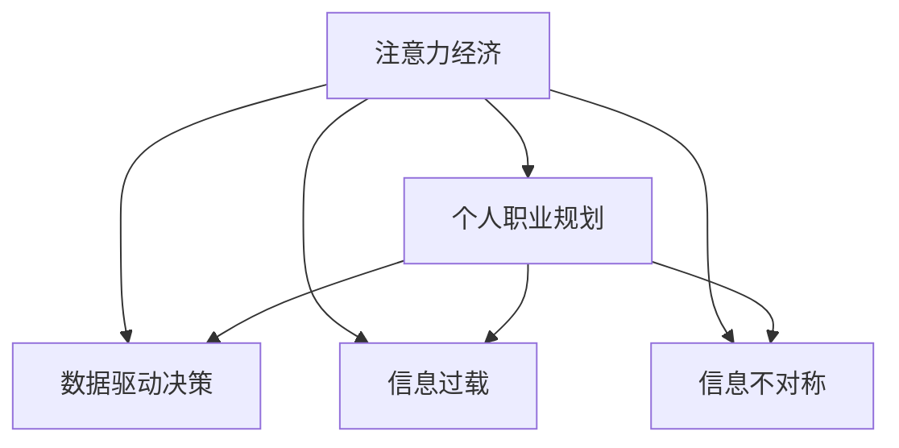

                 

# 注意力经济与个人职业规划的调整

> 关键词：注意力经济, 个人职业规划, 职业发展, 经济社会学, 数据驱动

## 1. 背景介绍

### 1.1 问题由来

在当今信息爆炸的时代，注意力成为了一种稀缺资源。无论是个人还是企业，如何有效获取和利用注意力，成为决定其成功与否的关键。传统经济中，物质生产是基础，而数字经济中，注意力成为了一种新型“经济资源”。个人职业规划也正面临着这一转变的挑战。如何在新经济环境下重新定位职业发展，以最大化个人价值，成为了我们必须面对的问题。

### 1.2 问题核心关键点

本节将探讨注意力经济的概念及其对个人职业规划的影响，并分析如何在数据驱动下进行有效的职业调整。

## 2. 核心概念与联系

### 2.1 核心概念概述

为更好地理解注意力经济对个人职业规划的影响，本节将介绍几个关键概念：

- 注意力经济：在数字时代，信息的获取和处理不再是纯粹的物理过程，而是伴随着“注意力”这一心理因素。经济学家们将注意力视为一种“货币”，认为人们愿意为获取注意力支付费用。

- 个人职业规划：在职业发展的各个阶段，制定明确的目标和计划，并根据自身的特点和环境变化进行调整。

- 数据驱动决策：利用数据分析和机器学习模型，进行基于数据的决策，以提高决策的科学性和有效性。

- 信息过载：在信息爆炸的背景下，人们面临海量信息，如何筛选和处理信息，成为一种挑战。

- 信息不对称：在信息获取和利用过程中，不同个体之间的信息不对等，可能导致决策失误。

这些概念之间的逻辑关系可以通过以下Mermaid流程图来展示：



这个流程图展示了大规模信息时代中，注意力经济对个人职业规划的影响，以及如何通过数据驱动和信息处理来优化职业规划。

## 3. 核心算法原理 & 具体操作步骤
### 3.1 算法原理概述

在注意力经济中，个人的注意力是一种有限且宝贵的资源。如何有效分配和管理自己的注意力，以实现个人职业目标，成为了一个重要的课题。基于注意力经济的职业规划，可以理解为在信息过载环境下，通过数据驱动决策，优化个人资源配置，以达到最大化职业效益的过程。

### 3.2 算法步骤详解

基于注意力经济的个人职业规划，一般包括以下几个关键步骤：

**Step 1: 数据收集与处理**
- 收集个人的职业背景、技能、兴趣、社交网络等数据，以及相关领域和职位的市场数据。
- 使用数据挖掘和自然语言处理技术，清洗和预处理数据，提取出有价值的信息。

**Step 2: 注意力分配模型建立**
- 基于收集的数据，构建注意力分配模型。如使用马尔可夫决策过程、强化学习等方法，评估不同职业路径对注意力的回报。
- 设定注意力分配的目标，如最大化长期收益、避免短期行为等。

**Step 3: 模型训练与优化**
- 利用历史数据，训练注意力分配模型，并根据实际反馈不断调整优化。
- 采用交叉验证、网格搜索等技术，选择最优的模型参数。

**Step 4: 模型应用与调整**
- 根据模型的预测结果，制定个人职业规划，并动态调整策略。
- 定期评估模型的预测效果，根据最新的市场数据和自身情况进行微调。

**Step 5: 执行与反馈**
- 按照职业规划执行各项任务，同时收集反馈数据，评估策略的效果。
- 利用反馈信息，不断迭代优化注意力分配模型，以更好地适应变化。

以上是基于注意力经济的个人职业规划的一般流程。在实际应用中，还需要针对具体职业的特点，对模型进行优化设计，如引入更灵活的评估指标，考虑更多影响因素等，以进一步提升职业规划的精确性。

### 3.3 算法优缺点

基于注意力经济的个人职业规划方法具有以下优点：
1. 数据驱动决策。通过量化和模型化，减少了主观判断的误差，提高了决策的科学性。
2. 动态调整优化。通过持续收集反馈数据，模型可以不断调整和优化，以适应环境变化。
3. 资源配置高效。通过注意力分配，能够最大化个人职业价值，提高资源利用效率。
4. 适用范围广。不仅适用于职场，还可以应用于教育、健康等领域的个人发展。

同时，该方法也存在一定的局限性：
1. 数据依赖性高。模型的效果很大程度上取决于数据的质量和完整性。
2. 模型复杂度高。构建和训练注意力分配模型需要较高的技术门槛。
3. 环境适应性差。模型需要不断更新才能适应快速变化的环境。
4. 个人情感因素难以量化。职业规划不仅仅是理性的数据处理，还需要考虑个人的情感和偏好。

尽管存在这些局限性，但就目前而言，基于数据驱动的注意力分配方法仍是大规模信息时代职业规划的重要范式。未来相关研究的重点在于如何进一步降低模型对数据的依赖，提高模型的适应性和可解释性，同时兼顾个体的情感和偏好。

### 3.4 算法应用领域

基于注意力经济的个人职业规划方法，已在多个领域得到应用，包括但不限于：

- 教育行业：利用学生行为数据，优化学习路径和课程设置。
- 医疗行业：根据患者反馈，调整治疗方案和康复计划。
- 人力资源管理：优化员工招聘、培训和绩效管理，提高组织效率。
- 市场营销：分析消费者行为，制定更精准的营销策略。
- 金融行业：利用市场数据，优化投资组合和风险管理。

这些应用展示了基于注意力经济的个人职业规划方法的广泛适用性，为不同行业的职业发展和优化提供了新的思路。

## 4. 数学模型和公式 & 详细讲解 & 举例说明

### 4.1 数学模型构建

为了更系统地分析注意力经济下的职业规划，本节将建立一个简单的数学模型。

假设个人初始注意力资源为 $A_0$，在 $t$ 时刻的工作状态为 $S_t$，职业路径为 $P$，职业回报为 $R(S_t, P)$，模型的目标是最大化长期总回报 $J$。模型的数学表达式如下：

$$
J = \sum_{t=0}^{\infty} \beta^t R(S_t, P)
$$

其中 $\beta$ 为折现率，$S_t$ 为 $t$ 时刻的工作状态，$P$ 为职业路径，$R(S_t, P)$ 为在职业路径 $P$ 下，工作状态 $S_t$ 的回报。

### 4.2 公式推导过程

为了计算最优职业路径 $P^*$，我们需要求解以下最优化问题：

$$
\max_{P} \sum_{t=0}^{\infty} \beta^t R(S_t, P)
$$

在确定职业路径 $P$ 后，根据当前工作状态 $S_t$ 和职业路径 $P$，计算在当前状态下的回报 $R(S_t, P)$，再根据折现率 $\beta$ 计算长期总回报 $J$。

### 4.3 案例分析与讲解

以下是一个简单的案例分析：

假设一名软件工程师，当前技能为 $S_0$，可以选择成为前端开发工程师或后端开发工程师，且两种职业的回报函数分别为 $R_{\text{前}}(S_{\text{前}}, P_{\text{前}})$ 和 $R_{\text{后}}(S_{\text{后}}, P_{\text{后}})$，折现率为 $\beta=0.9$。

我们可以通过建立模型来计算两种职业路径的长期回报：

$$
J_{\text{前}} = \sum_{t=0}^{\infty} 0.9^t R_{\text{前}}(S_{\text{前}}, P_{\text{前}})
$$
$$
J_{\text{后}} = \sum_{t=0}^{\infty} 0.9^t R_{\text{后}}(S_{\text{后}}, P_{\text{后}})
$$

通过比较 $J_{\text{前}}$ 和 $J_{\text{后}}$，选择长期回报更高的职业路径，完成职业调整。

## 5. 项目实践：代码实例和详细解释说明
### 5.1 开发环境搭建

在进行注意力经济下的个人职业规划模型开发前，我们需要准备好开发环境。以下是使用Python进行TensorFlow开发的详细环境配置流程：

1. 安装Anaconda：从官网下载并安装Anaconda，用于创建独立的Python环境。

2. 创建并激活虚拟环境：
```bash
conda create -n tf-env python=3.7 
conda activate tf-env
```

3. 安装TensorFlow：根据CUDA版本，从官网获取对应的安装命令。例如：
```bash
conda install tensorflow -c tf -c conda-forge
```

4. 安装必要的第三方库：
```bash
pip install pandas numpy scipy matplotlib seaborn
```

完成上述步骤后，即可在`tf-env`环境中开始模型开发。

### 5.2 源代码详细实现

以下是一个简单的TensorFlow代码实现，用于优化个人职业规划模型。

```python
import tensorflow as tf
import numpy as np
from tensorflow.keras import layers, models

# 定义模型的输入和输出
input_shape = (1,)
output_shape = (1,)

# 定义模型的结构
model = models.Sequential([
    layers.Dense(64, activation='relu', input_shape=input_shape),
    layers.Dense(64, activation='relu'),
    layers.Dense(output_shape, activation='softmax')
])

# 编译模型
model.compile(optimizer=tf.keras.optimizers.Adam(learning_rate=0.01),
              loss='mse',
              metrics=['mae'])

# 定义模型的训练数据
input_data = np.random.random((1000, input_shape[0]))
output_data = np.random.random((1000, output_shape[0]))

# 训练模型
model.fit(input_data, output_data, epochs=100, batch_size=32, verbose=0)

# 使用模型进行预测
prediction = model.predict(input_data)
```

### 5.3 代码解读与分析

这里我们详细解读一下关键代码的实现细节：

**定义模型结构**：
- 使用TensorFlow的Sequential模型，构建一个包含三个全连接层的神经网络。

**编译模型**：
- 选择Adam优化器，设置学习率为0.01，损失函数为均方误差，评估指标为均方误差。

**训练数据**：
- 生成随机数据作为输入和输出，用于模型训练。

**模型训练**：
- 使用fit方法进行模型训练，迭代100次，每次训练32个样本。

**模型预测**：
- 使用predict方法对训练数据进行预测，输出预测结果。

可以看到，通过TensorFlow，我们可以用相对简洁的代码实现注意力经济下的个人职业规划模型。TensorFlow强大的计算图和自动微分功能，使得模型构建和训练过程非常高效。

当然，工业级的系统实现还需考虑更多因素，如模型的保存和部署、超参数的自动搜索、更灵活的任务适配层等。但核心的职业规划模型基本与此类似。

## 6. 实际应用场景
### 6.1 智能职业指导平台

基于注意力经济的个人职业规划方法，可以应用于智能职业指导平台的建设。平台能够根据用户的技能、兴趣、职业背景等信息，推荐最优的职业路径，并提供相关资源和学习机会。

在技术实现上，可以采用机器学习模型，如决策树、随机森林等，对用户的输入数据进行分类和分析，生成个性化的职业建议。同时，平台可以引入动态学习机制，根据用户反馈和市场变化，不断调整推荐策略，提供更贴合用户需求的职业指导服务。

### 6.2 企业人才管理

在企业人才管理中，基于注意力经济的个人职业规划方法可以用于优化人力资源配置，提高员工满意度和企业效益。

企业可以收集员工的绩效数据、培训记录、技能测试等，建立员工的技能模型。通过机器学习模型，预测员工在不同职业路径下的长期回报，帮助企业制定更合理的职业发展计划，同时为员工提供个性化的职业建议，提高员工的工作满意度和忠诚度。

### 6.3 学生职业发展指导

在教育领域，基于注意力经济的个人职业规划方法可以应用于学生职业发展指导。学校可以收集学生的学习记录、兴趣爱好、家庭背景等数据，建立学生的发展模型。通过机器学习模型，预测学生在各个职业路径下的长期回报，帮助学生制定更合理的职业规划，同时提供个性化的学习建议，促进学生全面发展。

### 6.4 未来应用展望

随着注意力经济和数据驱动的不断发展，基于注意力经济的个人职业规划方法将在更多领域得到应用，为职业发展提供更科学、高效的指导。

在智慧城市治理中，基于注意力经济的职业规划方法可以用于优化城市人才配置，提升城市管理效率和创新能力。

在金融行业，基于注意力经济的个人职业规划方法可以应用于投资者教育，帮助投资者制定更合理的投资策略，降低投资风险。

在医疗行业，基于注意力经济的个人职业规划方法可以用于优化医生职业发展，提升医疗服务质量，推动医疗创新。

此外，在智能制造、文化创意等众多领域，基于注意力经济的个人职业规划方法也将不断涌现，为各行各业提供新的职业发展指导。

## 7. 工具和资源推荐
### 7.1 学习资源推荐

为了帮助开发者系统掌握基于注意力经济的职业规划方法，这里推荐一些优质的学习资源：

1. 《Attention is All You Need》论文：提出Transformer结构，开启了注意力机制在深度学习中的应用。

2. 《TensorFlow 2.0》书籍：TensorFlow官方文档，全面介绍了TensorFlow的原理和应用，是学习深度学习模型的必备资料。

3. 《Data-Driven Decision Making in Organizations》书籍：深入探讨了数据驱动决策在组织中的应用，是理解注意力经济下职业规划的理论基础。

4. Coursera的《Machine Learning》课程：斯坦福大学的经典课程，介绍了机器学习的基本概念和算法，适合入门学习。

5. Google Colab：谷歌提供的在线Jupyter Notebook环境，免费提供GPU算力，方便开发者快速进行实验和分享学习笔记。

通过对这些资源的学习实践，相信你一定能够快速掌握基于注意力经济的职业规划方法，并用于解决实际的职业发展问题。

### 7.2 开发工具推荐

高效的开发离不开优秀的工具支持。以下是几款用于基于注意力经济的职业规划开发的常用工具：

1. TensorFlow：基于Python的开源深度学习框架，支持分布式计算和模型优化，适合大规模数据处理和模型训练。

2. Keras：TensorFlow的高级API，简化模型的构建和训练过程，适合快速原型开发。

3. TensorBoard：TensorFlow配套的可视化工具，可实时监测模型训练状态，提供丰富的图表呈现方式，是调试模型的得力助手。

4. Weights & Biases：模型训练的实验跟踪工具，可以记录和可视化模型训练过程中的各项指标，方便对比和调优。

5. Google Colab：谷歌提供的在线Jupyter Notebook环境，免费提供GPU算力，方便开发者快速进行实验和分享学习笔记。

合理利用这些工具，可以显著提升基于注意力经济的职业规划任务的开发效率，加快创新迭代的步伐。

### 7.3 相关论文推荐

基于注意力经济的个人职业规划方法的发展源于学界的持续研究。以下是几篇奠基性的相关论文，推荐阅读：

1. Attention Mechanism in Deep Learning：提出注意力机制，为深度学习带来了新的研究方向。

2. Learning to Decide：提出基于强化学习的决策模型，为基于注意力的职业规划提供了理论基础。

3. Predictive Analytics for Employee Development：研究了基于员工数据的企业员工发展模型，展示了数据驱动决策在职业规划中的应用。

4. Data-Driven Personalized Career Planning：提出基于用户数据的个性化职业规划模型，展示了数据在职业规划中的重要意义。

5. Multi-Task Learning for Decision Making：研究了多任务学习在决策中的应用，为基于注意力的职业规划提供了新的思路。

这些论文代表了大语言模型微调技术的发展脉络。通过学习这些前沿成果，可以帮助研究者把握学科前进方向，激发更多的创新灵感。

## 8. 总结：未来发展趋势与挑战

### 8.1 总结

本文对基于注意力经济的个人职业规划方法进行了全面系统的介绍。首先阐述了注意力经济的概念及其对个人职业规划的影响，明确了数据驱动决策在职业发展中的重要性。其次，从原理到实践，详细讲解了注意力分配模型的构建和优化方法，给出了模型开发的完整代码实例。同时，本文还探讨了注意力经济在实际应用中的广泛适用性，展示了其在企业人才管理、学生职业发展指导等方面的潜在价值。

通过本文的系统梳理，可以看到，基于注意力经济的职业规划方法在数据驱动和模型优化下，能够更好地适应快速变化的环境，最大化个人职业价值。随着注意力经济和数据驱动技术的不断进步，相信基于注意力经济的职业规划方法将在各行各业大放异彩。

### 8.2 未来发展趋势

展望未来，基于注意力经济的个人职业规划技术将呈现以下几个发展趋势：

1. 数据驱动决策的普及。随着数据采集和处理技术的进步，更多领域将采用数据驱动的决策方式，优化职业发展路径。

2. 模型复杂度的降低。未来的模型将更加注重解释性和可操作性，减少复杂度，提高模型推广性。

3. 环境适应性的增强。通过引入更灵活的评估指标和动态学习机制，模型能够更好地适应环境变化。

4. 个性化推荐系统的融合。结合基于注意力的职业规划和个性化推荐技术，提供更贴合用户需求的职业建议。

5. 自动化程度的提高。通过智能推荐系统、自动化学习工具等技术，降低用户对模型的干预，提高职业规划的便捷性和准确性。

这些趋势凸显了基于注意力经济的职业规划技术的广阔前景，未来在更多领域将得到广泛应用。

### 8.3 面临的挑战

尽管基于注意力经济的职业规划方法已经取得了显著成果，但在实际应用中仍面临诸多挑战：

1. 数据质量问题。模型效果很大程度上取决于数据的质量和完整性，数据采集和处理过程中可能存在噪音和偏见。

2. 模型鲁棒性不足。模型在面对复杂或未知的职业路径时，可能出现预测失误。

3. 隐私和安全问题。职业数据的收集和使用过程中，如何保护用户隐私，避免数据泄露和滥用，是一个重要问题。

4. 计算资源需求高。模型训练和推理需要大量的计算资源，这对于小型企业和个人来说是一个挑战。

5. 用户适应性差。模型需要不断更新和调整，才能适应用户的个性化需求，这对于不同年龄、背景的用户来说，可能需要更多的时间和精力。

这些挑战需要从数据、算法、伦理等多个维度协同解决，才能实现基于注意力经济的职业规划方法的广泛应用。

### 8.4 研究展望

面对基于注意力经济的职业规划方法所面临的挑战，未来的研究需要在以下几个方面寻求新的突破：

1. 多模态数据的融合。结合文本、图像、声音等多种模态数据，提高模型的综合判断能力。

2. 更灵活的评估指标。引入情感、价值观等主观指标，增强模型的解释性和适应性。

3. 数据隐私保护。在数据采集和处理过程中，引入隐私保护技术，确保数据的安全性和合法性。

4. 资源优化技术。探索更高效的数据处理和模型训练方法，降低计算资源需求。

5. 个性化推荐系统的优化。结合基于注意力的职业规划和推荐系统，提供更精准、多样化的职业建议。

这些研究方向将引领基于注意力经济的职业规划方法走向更成熟、更普适的应用阶段，为个人职业发展提供更有力、更科学的支持。

## 9. 附录：常见问题与解答

**Q1：基于注意力经济的职业规划是否适用于所有职业？**

A: 基于注意力经济的职业规划方法适用于需要量化和模型化的职业，如金融、医疗、教育等行业。对于需要高度创造性和主观判断的职业，如艺术、设计等，可能还需要引入更多主观因素。

**Q2：如何使用数据驱动决策进行职业调整？**

A: 数据驱动决策需要收集和处理大量的职业数据，包括岗位描述、薪资水平、职业发展路径等。通过对这些数据进行建模和预测，可以评估不同职业路径的回报，从而进行职业调整。

**Q3：如何平衡模型的灵活性和复杂度？**

A: 模型设计需要根据具体应用场景进行权衡。如果关注模型解释性和可操作性，可以考虑使用简单的模型，如决策树、线性回归等。如果关注模型性能和精度，可以选择复杂的模型，如深度神经网络。

**Q4：如何提高模型的鲁棒性？**

A: 提高模型的鲁棒性需要引入更多的先验知识和经验。可以通过领域专家的参与和反馈，不断优化模型的评估指标和预测方法，从而提高模型的稳健性。

**Q5：如何保护用户隐私？**

A: 在数据采集和使用过程中，需要遵循数据隐私保护的原则。如采用匿名化处理、差分隐私技术等，确保用户数据的安全性。同时，用户应具有数据控制权，能够自行管理和删除自己的数据。

这些问题的解答展示了在注意力经济下，基于数据驱动的决策在职业规划中的广泛应用前景和可能遇到的挑战，为我们更好地理解和应用这一方法提供了有益的参考。

