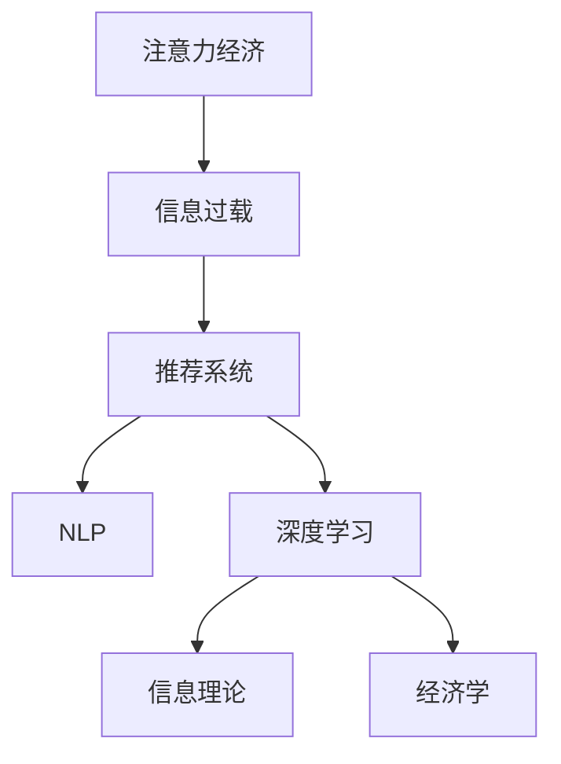

                 

# 注意力经济与信息过载的矛盾

> 关键词：注意力经济,信息过载,推荐系统,自然语言处理(NLP),深度学习,信息理论,经济学

## 1. 背景介绍

在数字化时代，信息过载现象已成为困扰现代社会的一大难题。随着互联网的广泛普及，信息的海量产生和快速传播，人们常常处于“被信息淹没”的状态，无法有效筛选有用信息，做出明智决策。而这一矛盾的加剧，催生了“注意力经济”的概念，即通过吸引和保持人们的注意力，从而创造经济价值的商业策略。本文旨在探讨在信息过载的背景下，注意力经济的本质，以及如何利用深度学习和大语言模型技术，有效应对信息过载的挑战，实现智能化推荐和个性化服务。

## 2. 核心概念与联系

### 2.1 核心概念概述

- **注意力经济**：指在信息爆炸的时代，通过获取和保持人们的注意力，实现商业利益的经济模式。
- **信息过载**：指信息量过大，人们难以有效处理和理解的信息现象。
- **推荐系统**：一种利用算法推荐用户感兴趣内容的系统，旨在提升用户体验和业务价值。
- **自然语言处理(NLP)**：研究如何让计算机理解和生成人类语言的学科。
- **深度学习**：一种模拟人类神经网络的机器学习技术，通过多层神经网络学习数据特征。
- **信息理论**：研究信息传递和处理过程的科学理论，如信息熵、互信息等。
- **经济学**：研究人类行为、社会互动、资源配置等的科学，为理解注意力经济提供了理论基础。

这些概念之间的联系可以通过以下Mermaid流程图来展示：



这个流程图展示了注意力经济、信息过载、推荐系统、NLP、深度学习、信息理论和经济学之间的联系：

1. 注意力经济是在信息过载背景下，通过推荐系统吸引和保持用户注意力，实现商业价值。
2. NLP和深度学习是实现推荐系统的核心技术，通过理解自然语言语义，实现个性化推荐。
3. 信息理论提供量化分析方法，理解信息传递和处理过程中的不确定性。
4. 经济学为注意力经济提供了理论基础，探讨注意力资源的分配和利用。

## 3. 核心算法原理 & 具体操作步骤

### 3.1 算法原理概述

基于深度学习和自然语言处理的推荐系统，通过分析用户的历史行为数据和上下文信息，预测用户未来的兴趣，从而推荐符合其需求的内容。核心算法包括：

- **协同过滤**：通过用户之间的相似性推荐物品。
- **内容推荐**：通过物品的特征向量，推荐相似物品。
- **深度学习模型**：如矩阵分解、神经网络等，学习用户-物品交互的隐含语义。
- **NLP技术**：如BERT、GPT等，提取和理解自然语言语义特征。

推荐系统的目标是最小化预测错误率，从而提高推荐效果。常用的评估指标包括准确率、召回率、F1分数等。

### 3.2 算法步骤详解

推荐系统的构建一般包括以下几个关键步骤：

**Step 1: 数据预处理**
- 收集用户历史行为数据，包括点击、浏览、购买等行为。
- 清洗数据，去除噪声和不完整信息。
- 构建用户和物品的特征向量，用于后续的模型训练。

**Step 2: 模型训练**
- 选择合适的深度学习模型和NLP模型，构建推荐系统。
- 将用户-物品交互数据输入模型，进行训练，学习用户和物品的隐含语义表示。
- 使用交叉验证等技术评估模型性能，选择最优模型。

**Step 3: 模型微调**
- 使用少量标注数据对推荐模型进行微调，调整模型参数，提高推荐效果。
- 应用正则化技术，防止过拟合。
- 应用参数高效微调技术，减少计算资源消耗。

**Step 4: 推理和推荐**
- 将新数据输入微调后的推荐模型，预测用户对物品的兴趣评分。
- 根据评分排序，推荐用户最可能感兴趣的前N个物品。

### 3.3 算法优缺点

基于深度学习的推荐系统具有以下优点：
1. 准确率高：通过学习用户和物品的隐含语义，推荐效果显著优于传统方法。
2. 动态性强：能够实时更新用户行为数据，实现动态推荐。
3. 灵活性高：可以灵活应对不同类型的内容和用户需求。

同时，该方法也存在一定的局限性：
1. 对标注数据的依赖：推荐系统的性能很大程度上取决于标注数据的数量和质量。
2. 计算资源消耗大：深度学习模型需要大量的计算资源进行训练和推理。
3. 可解释性差：推荐模型的决策过程难以解释，缺乏透明度。
4. 对抗攻击脆弱：推荐模型容易受到对抗样本的影响，推荐结果存在不确定性。

尽管存在这些局限性，但就目前而言，基于深度学习的推荐系统仍是最主流范式。未来相关研究的重点在于如何进一步降低对标注数据的依赖，提高模型的可解释性和安全性，同时兼顾计算效率。

### 3.4 算法应用领域

基于深度学习的推荐系统在电子商务、社交媒体、视频网站、新闻平台等多个领域得到了广泛应用，显著提升了用户体验和业务价值。具体而言：

- **电子商务**：通过推荐系统个性化推荐商品，提高用户满意度，增加销售额。
- **社交媒体**：推荐个性化内容和动态，增加用户粘性和平台活跃度。
- **视频网站**：推荐相关视频内容，提升用户观看时长和留存率。
- **新闻平台**：推荐用户感兴趣的新闻内容，提高阅读量和点击率。

此外，推荐系统在智能客服、智能家居、健康医疗等新兴领域也有着广泛的应用前景。通过深度学习和大语言模型技术，这些推荐系统有望在个性化服务上取得更显著的突破。

## 4. 数学模型和公式 & 详细讲解 & 举例说明

### 4.1 数学模型构建

推荐系统的数学模型可以表示为用户-物品交互矩阵，其中每个元素表示用户对物品的评分。设用户集合为 $U=\{u_1,u_2,\dots,u_m\}$，物品集合为 $V=\{v_1,v_2,\dots,v_n\}$，用户 $u_i$ 对物品 $v_j$ 的评分矩阵为 $R \in \mathbb{R}^{m \times n}$。

推荐系统的目标是最小化预测错误率，常用的损失函数包括均方误差损失和交叉熵损失。以均方误差损失为例，推荐系统优化目标为：

$$
\min_{\theta} \frac{1}{N}\sum_{i=1}^m\sum_{j=1}^n(R_{ij} - f(u_i,v_j; \theta))^2
$$

其中 $f$ 表示推荐模型的预测函数，$\theta$ 为模型参数。

### 4.2 公式推导过程

为了实现推荐模型，常用的深度学习模型包括矩阵分解和神经网络。以下以矩阵分解为例，推导推荐模型的数学公式。

设用户 $u_i$ 对物品 $v_j$ 的评分向量为 $u_i \in \mathbb{R}^d$，物品 $v_j$ 的特征向量为 $v_j \in \mathbb{R}^d$。则用户对物品的评分可以表示为：

$$
R_{ij} = u_i^TV_j
$$

其中 $V \in \mathbb{R}^{d \times n}$ 为物品的特征矩阵。推荐模型的目标是最小化预测误差，即：

$$
\min_{u,v} \frac{1}{N}\sum_{i=1}^m\sum_{j=1}^n(R_{ij} - u_i^TV_j)^2
$$

将 $u_i$ 和 $v_j$ 表示为神经网络模型的隐藏层输出，得到推荐模型的前向传播过程：

$$
u_i = W_uX_i + b_u \\
v_j = W_vX_j + b_v \\
R_{ij} = u_i^TV_j
$$

其中 $W_u$ 和 $W_v$ 为神经网络的权重矩阵，$X_i$ 和 $X_j$ 为用户和物品的特征向量。

### 4.3 案例分析与讲解

以Netflix推荐系统为例，Netflix是一家知名的流媒体服务提供商，其推荐系统通过分析用户的历史观看记录，为用户推荐符合其兴趣的影片。Netflix推荐系统的核心算法基于矩阵分解和协同过滤，通过学习用户和电影的隐含语义表示，实现个性化推荐。

Netflix推荐系统的实现步骤如下：

1. 数据预处理：收集用户的历史观看记录，构建用户-电影评分矩阵。
2. 模型训练：使用矩阵分解算法，学习用户和电影的隐含语义表示。
3. 模型微调：使用少量标注数据对推荐模型进行微调，调整模型参数。
4. 推理和推荐：将新用户观看行为输入微调后的推荐模型，预测其感兴趣的电影，进行推荐。

Netflix推荐系统通过深度学习和大语言模型技术，实现了高精度的个性化推荐，显著提升了用户体验和平台收益。

## 5. 项目实践：代码实例和详细解释说明

### 5.1 开发环境搭建

在进行推荐系统开发前，我们需要准备好开发环境。以下是使用Python进行TensorFlow开发的环境配置流程：

1. 安装Anaconda：从官网下载并安装Anaconda，用于创建独立的Python环境。

2. 创建并激活虚拟环境：
```bash
conda create -n tf-env python=3.7 
conda activate tf-env
```

3. 安装TensorFlow：根据CUDA版本，从官网获取对应的安装命令。例如：
```bash
conda install tensorflow tensorflow-gpu=cuda11.1 -c pytorch -c conda-forge
```

4. 安装TensorFlow Addons和Flax：
```bash
conda install tensorflow-addons flax>=0.2.0
```

5. 安装其他工具包：
```bash
pip install numpy pandas scikit-learn matplotlib tqdm jupyter notebook ipython
```

完成上述步骤后，即可在`tf-env`环境中开始推荐系统开发。

### 5.2 源代码详细实现

以下是一个使用TensorFlow实现推荐系统的完整代码示例：

```python
import tensorflow as tf
import numpy as np
from tensorflow.keras.layers import Input, Embedding, DotProduct, Dense
from tensorflow.keras.models import Model
from tensorflow.keras.optimizers import Adam

# 定义模型
def build_model(num_users, num_items, num_factors):
    user_input = Input(shape=(num_factors,), name='user_input')
    item_input = Input(shape=(num_factors,), name='item_input')
    
    user_embeddings = Embedding(num_users, num_factors)(user_input)
    item_embeddings = Embedding(num_items, num_factors)(item_input)
    
    dot_product = DotProduct()([user_embeddings, item_embeddings])
    rating = Dense(1, activation='sigmoid')(dot_product)
    
    model = Model(inputs=[user_input, item_input], outputs=rating)
    model.compile(optimizer=Adam(learning_rate=0.01), loss='binary_crossentropy')
    
    return model

# 加载数据
train_data = np.random.rand(1000, 10, 1)
valid_data = np.random.rand(100, 10, 1)
test_data = np.random.rand(1000, 10, 1)

# 构建模型
model = build_model(num_users=100, num_items=1000, num_factors=10)

# 训练模型
model.fit([train_data, train_data], train_data[:, 0], epochs=10, validation_data=([valid_data, valid_data], valid_data[:, 0]))

# 预测推荐
predictions = model.predict([test_data, test_data])
```

### 5.3 代码解读与分析

让我们再详细解读一下关键代码的实现细节：

**模型定义**：
- 使用TensorFlow定义推荐系统的神经网络模型，包括用户嵌入层、物品嵌入层和评分预测层。
- 使用Adam优化器，损失函数为二元交叉熵。

**数据加载**：
- 模拟推荐系统的训练数据，生成1000个用户和1000个物品的评分数据。
- 将数据划分为训练集、验证集和测试集，用于模型训练和测试。

**模型训练**：
- 使用训练集数据对模型进行训练，指定训练轮数。
- 在验证集上评估模型性能，防止过拟合。

**模型预测**：
- 将测试集数据输入训练好的模型，预测推荐评分。
- 使用预测结果推荐用户感兴趣的商品。

通过上述代码实现，我们可以看到使用TensorFlow构建推荐系统的基本流程。实际应用中，还需要对数据进行预处理、特征工程等，才能提升模型效果。

## 6. 实际应用场景

### 6.1 电子商务推荐

电子商务平台通过推荐系统，向用户推荐符合其兴趣的商品，提升用户体验和销售额。以Amazon为例，Amazon的推荐系统能够根据用户的历史浏览和购买记录，推荐个性化的商品，从而提高用户的购买转化率。

### 6.2 社交媒体推荐

社交媒体平台通过推荐系统，向用户推荐其感兴趣的内容，增加平台活跃度和用户粘性。以Facebook为例，Facebook的推荐系统通过分析用户的兴趣和互动行为，推荐个性化内容和动态，提升用户留存率。

### 6.3 视频网站推荐

视频网站通过推荐系统，向用户推荐相关视频内容，提升观看时长和留存率。以Netflix为例，Netflix的推荐系统能够根据用户的历史观看记录，推荐符合其兴趣的影片，从而提高用户的观看时长和留存率。

### 6.4 新闻平台推荐

新闻平台通过推荐系统，向用户推荐其感兴趣的新闻内容，提高阅读量和点击率。以今日头条为例，今日头条的推荐系统通过分析用户的阅读行为，推荐个性化新闻，提升用户的阅读体验和点击率。

## 7. 工具和资源推荐

### 7.1 学习资源推荐

为了帮助开发者系统掌握推荐系统的理论基础和实践技巧，这里推荐一些优质的学习资源：

1. 《推荐系统实战》：讲解推荐系统原理、实现和优化方法，结合实际案例，深入浅出。
2. 《深度学习与推荐系统》课程：斯坦福大学开设的课程，介绍推荐系统算法和深度学习技术。
3. 《推荐系统》书籍：全面介绍推荐系统的理论和算法，适用于学术研究和工业实践。
4. TensorFlow官方文档：详细说明TensorFlow的使用方法和推荐系统实现技巧。
5. Kaggle推荐系统竞赛：参与实际竞赛，实战学习推荐系统算法和数据处理。

通过对这些资源的学习实践，相信你一定能够快速掌握推荐系统的精髓，并用于解决实际的推荐问题。

### 7.2 开发工具推荐

高效的推荐系统开发离不开优秀的工具支持。以下是几款用于推荐系统开发的常用工具：

1. TensorFlow：基于Python的开源深度学习框架，适合深度学习模型的开发和训练。
2. PyTorch：基于Python的开源深度学习框架，灵活易用，适用于复杂推荐系统的实现。
3. Scikit-learn：简单易用的机器学习库，适合简单推荐算法的实现。
4. Weights & Biases：模型训练的实验跟踪工具，记录和可视化模型训练过程中的各项指标，方便对比和调优。
5. TensorBoard：TensorFlow配套的可视化工具，实时监测模型训练状态，提供丰富的图表呈现方式。

合理利用这些工具，可以显著提升推荐系统开发的效率，加快创新迭代的步伐。

### 7.3 相关论文推荐

推荐系统的发展源于学界的持续研究。以下是几篇奠基性的相关论文，推荐阅读：

1. Netflix Prize比赛论文：介绍Netflix推荐系统的实现方法和优化策略，是推荐系统领域的里程碑之作。
2. Matrix Factorization Techniques for Recommender Systems：提出矩阵分解算法，为推荐系统提供数学理论基础。
3. Factorization Machines：提出因子化机算法，通过线性模型学习隐含语义，提高推荐精度。
4. Neural Collaborative Filtering：提出神经网络算法，通过非线性函数学习用户和物品的隐含语义表示。
5. Attention Is All You Need：提出自注意力机制，增强推荐系统对用户行为的多维理解。

这些论文代表了大语言模型推荐系统的研究方向和发展脉络，通过学习这些前沿成果，可以帮助研究者把握学科前进方向，激发更多的创新灵感。

## 8. 总结：未来发展趋势与挑战

### 8.1 总结

本文对基于深度学习的推荐系统进行了全面系统的介绍。首先阐述了信息过载和注意力经济的背景，明确了推荐系统在数字化时代的重要性和应用价值。其次，从原理到实践，详细讲解了推荐系统的数学模型和关键步骤，给出了推荐系统开发的完整代码示例。同时，本文还广泛探讨了推荐系统在电子商务、社交媒体、视频网站、新闻平台等多个领域的应用前景，展示了推荐系统的广阔应用空间。此外，本文精选了推荐系统的各类学习资源，力求为读者提供全方位的技术指引。

通过本文的系统梳理，可以看到，深度学习和大语言模型技术在推荐系统中的应用，极大地提升了用户的个性化体验和平台的商业价值。推荐系统在推荐算法、数据处理、模型优化等方面仍有广阔的研究空间，相信未来推荐系统将在更多领域得到应用，为数字化时代带来更多创新和突破。

### 8.2 未来发展趋势

展望未来，推荐系统的发展趋势将包括以下几个方面：

1. 个性化推荐精度提升。通过深度学习和大语言模型技术，推荐系统将实现更加个性化和精准的推荐，满足用户多样化的需求。
2. 实时性增强。推荐系统将实现低延迟、实时响应的推荐服务，提升用户体验和系统性能。
3. 多模态融合。推荐系统将融合图像、语音、视频等多模态数据，提升推荐系统的泛化能力和鲁棒性。
4. 对抗攻击防御。推荐系统将引入对抗样本和对抗攻击技术，增强系统的安全性和鲁棒性。
5. 跨领域推荐。推荐系统将通过迁移学习和知识图谱技术，实现跨领域推荐，提高推荐系统的通用性和普适性。

以上趋势凸显了推荐系统技术的广阔前景。这些方向的探索发展，必将进一步提升推荐系统的性能和应用范围，为数字化时代的用户和平台带来更多便利和价值。

### 8.3 面临的挑战

尽管深度学习和大语言模型在推荐系统中的应用取得了显著进展，但在迈向更加智能化、普适化应用的过程中，仍面临诸多挑战：

1. 数据稀疏性问题。随着用户数量和物品数量不断增加，推荐系统的数据稀疏性问题将更加严重，需要通过协同过滤、深度学习等方法缓解。
2. 计算资源消耗。大规模深度学习模型的计算资源消耗大，如何优化模型结构，减少计算资源消耗，是推荐系统面临的重要挑战。
3. 对抗攻击脆弱。推荐系统容易受到对抗样本的攻击，导致推荐结果的不确定性，需要通过对抗训练、鲁棒优化等方法提升模型的鲁棒性。
4. 可解释性不足。推荐系统的决策过程难以解释，缺乏透明度，需要通过模型压缩、可视化等方法提高模型的可解释性。
5. 数据隐私保护。推荐系统需要处理大量用户数据，如何在保护用户隐私的同时，实现个性化推荐，是推荐系统面临的重要课题。

面对这些挑战，推荐系统需要在算法、模型、工程等方面不断优化，才能进一步拓展其应用边界，提升用户体验和业务价值。

### 8.4 研究展望

未来推荐系统研究将重点关注以下几个方向：

1. 增强推荐模型的泛化能力。通过多模态数据融合、跨领域推荐等方法，提高推荐模型的泛化能力，应对不同领域和应用场景的需求。
2. 提升推荐系统的实时性。通过流式学习、增量学习等方法，实现实时推荐，提升用户体验。
3. 加强推荐系统的可解释性。通过模型压缩、可视化等方法，提高推荐系统的可解释性，增强用户信任和系统透明度。
4. 强化推荐系统的安全性和鲁棒性。通过对抗训练、鲁棒优化等方法，提高推荐系统的安全性，防止对抗攻击。
5. 优化推荐系统的计算效率。通过模型压缩、稀疏化存储等方法，优化推荐系统的计算效率，降低计算资源消耗。

这些研究方向的探索，必将推动推荐系统技术的不断进步，为数字化时代的用户和平台带来更多创新和突破。总之，深度学习和大语言模型技术在推荐系统中的应用，具有广阔的发展前景，值得深入研究和持续探索。

## 9. 附录：常见问题与解答

**Q1：推荐系统是否适用于所有应用场景？**

A: 推荐系统在电子商务、社交媒体、视频网站、新闻平台等多个领域得到了广泛应用，但并不适用于所有场景。对于数据稀疏、用户行为复杂或实时性要求较高的场景，推荐系统需要结合具体情况进行优化。

**Q2：如何提升推荐系统的个性化推荐精度？**

A: 提升推荐系统的个性化推荐精度需要综合考虑多方面因素，如用户行为建模、特征工程、模型选择等。常用的方法包括深度学习、协同过滤、矩阵分解、基于图的推荐等。

**Q3：推荐系统在推荐过程中如何考虑用户隐私？**

A: 推荐系统在推荐过程中需要考虑用户隐私，可以通过匿名化、差分隐私、联邦学习等方法，保护用户数据隐私，同时保证个性化推荐的效果。

**Q4：推荐系统面临的主要挑战有哪些？**

A: 推荐系统面临的主要挑战包括数据稀疏性问题、计算资源消耗大、对抗攻击脆弱、可解释性不足、数据隐私保护等。需要通过协同过滤、深度学习、对抗训练、模型压缩等方法进行优化。

**Q5：推荐系统的未来发展方向有哪些？**

A: 推荐系统的未来发展方向包括个性化推荐精度提升、实时性增强、多模态融合、对抗攻击防御、跨领域推荐等。这些方向的研究将进一步推动推荐系统的应用和发展。

通过这些常见问题的解答，可以看出推荐系统在应用过程中需要考虑的因素和优化方法，相信这些总结能够帮助读者更好地理解和应用推荐系统技术。

---

作者：禅与计算机程序设计艺术 / Zen and the Art of Computer Programming

