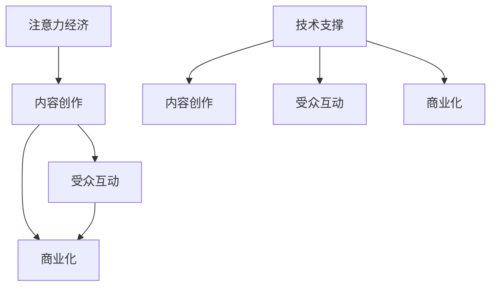

                 

# 注意力经济与内容创作最佳实践：吸引并留住受众的参与

在数字化时代，内容创造已成为核心竞争力，无论是个人博客、社交媒体还是企业网站，内容都是吸引受众、构建品牌忠诚度的关键。然而，在信息过载的环境中，如何使内容脱颖而出，吸引并留住受众的注意力，已成为内容创作者和平台运营者面临的重要挑战。本文将深入探讨注意力经济的概念、内容创作的最佳实践以及如何构建高效的内容策略。

## 1. 背景介绍

### 1.1 问题由来
随着互联网的普及和数字化技术的进步，内容已经不再是一个被动消费的对象，而成为一种可以吸引、保留和转化受众的经济形态。用户对内容消费的个性化、多样化和互动化需求日益增长，内容创作者和平台运营者需要从内容质量、互动性、商业化等多个角度，综合考虑如何构建有吸引力、有价值的内容生态。

### 1.2 问题核心关键点
内容创作的挑战在于如何在海量信息中脱颖而出，同时保持受众的持续关注和参与。关注点包括：
- 内容质量：内容必须具备原创性、价值性和吸引力，才能获得受众的认可。
- 受众互动：互动性是内容留存的重要因素，平台需要通过多种形式提高用户参与度。
- 商业化：内容不仅要有吸引力，还要有明确的商业目标，包括广告、订阅、付费内容等。
- 技术支持：内容创作和分发需借助先进的数字化技术，如大数据、AI、机器学习等，实现个性化推荐和精准营销。

### 1.3 问题研究意义
深入理解和掌握注意力经济和内容创作的原理，对于提升内容价值、增强用户体验、优化内容策略具有重要意义：
- 提升内容质量：通过理解受众需求和行为模式，创作出更具吸引力的内容。
- 提高用户参与度：通过互动和社区构建，增强用户粘性，延长用户停留时间。
- 实现商业价值：通过精准营销和用户转化，实现内容的商业化目标。
- 推动技术创新：内容创作和分发技术的进步，将为注意力经济的发展提供新的动力。

## 2. 核心概念与联系

### 2.1 核心概念概述

为更好地理解注意力经济和内容创作的本质，本节将介绍几个核心概念及其相互关系：

- 注意力经济(Attention Economy)：以吸引和保留用户注意力为核心的商业模式，通过高质量、有价值的内容和服务，获得用户的持续关注和付费。
- 内容创作(Content Creation)：从构思、撰写、编辑到发布的一系列活动，旨在创作出符合受众需求和平台策略的内容。
- 受众互动(Engagement)：用户与内容之间通过评论、点赞、分享等形式的互动，增加内容价值和用户粘性。
- 商业化(Monetization)：将内容转化为收益的过程，包括广告收入、付费会员、商品销售等。
- 技术支撑(Technology)：利用大数据、AI、机器学习等技术，实现内容个性化推荐、精准营销和用户行为分析。

这些核心概念通过以下Mermaid流程图展示其相互关系：



这个流程图展示了注意力经济和内容创作的各个环节及其相互关系：

1. 注意力经济依赖于高质量、有价值的内容创作。
2. 内容创作完成后，通过受众互动增加用户粘性。
3. 受众互动增强了内容的商业价值。
4. 技术支撑为内容创作和受众互动提供了强有力的支持。

## 3. 核心算法原理 & 具体操作步骤

### 3.1 算法原理概述

内容创作和注意力经济的管理，涉及到多个环节和多种算法，以下对其中几个关键算法原理进行详细阐述。

### 3.2 算法步骤详解

#### 3.2.1 内容推荐算法

内容推荐算法是注意力经济的核心，通过分析用户行为和偏好，为用户推荐符合其兴趣的内容。推荐算法通常分为两种：基于内容的推荐和协同过滤推荐。

**基于内容的推荐算法**：基于内容的推荐算法，主要通过内容属性（如关键词、分类、主题等）进行相似度匹配，为用户推荐相似的内容。公式如下：

$$
推荐内容 = \text{相似度算法}(\text{用户画像}, \text{内容库})
$$

其中，相似度算法可以是余弦相似度、Jaccard相似度等。用户画像是通过用户历史行为和偏好数据构建的，内容库包含了平台上的所有内容。

**协同过滤推荐算法**：协同过滤算法，主要通过用户之间的相似度进行推荐，包括基于用户的协同过滤和基于物品的协同过滤。公式如下：

$$
推荐内容 = \text{协同过滤算法}(\text{用户画像}, \text{用户行为矩阵})
$$

其中，用户行为矩阵记录了用户与内容的交互历史。协同过滤算法的核心在于如何高效计算用户之间的相似度。

#### 3.2.2 用户行为分析算法

用户行为分析算法用于理解用户行为模式，预测用户未来行为。常用的用户行为分析算法包括：

**用户画像构建**：通过分析用户的历史行为和属性数据，构建用户画像，用于指导内容创作和个性化推荐。

**用户意图预测**：基于用户的行为数据和内容互动信息，预测用户对内容的兴趣和行为意图。公式如下：

$$
预测意图 = \text{机器学习模型}(\text{用户行为数据}, \text{内容特征})
$$

常用的机器学习模型包括随机森林、逻辑回归、支持向量机等。

**内容评估指标**：通过设定不同的评估指标（如点击率、停留时间、转化率等），衡量内容的质量和受众的互动程度。

#### 3.2.3 互动机制设计

互动机制设计是增强用户参与度的关键，主要包括以下几个方面：

**评论系统**：建立评论系统，鼓励用户分享观点，增加内容互动性。

**点赞和分享**：通过点赞和分享功能，增加内容的曝光度和用户粘性。

**社区构建**：建立兴趣社区，增加用户之间的互动和交流，构建内容生态。

### 3.3 算法优缺点

内容推荐算法和用户行为分析算法在提升用户参与度和内容商业价值方面具有显著优势，但同时也存在以下缺点：

**算法准确性**：推荐算法和行为分析算法的准确性直接影响内容质量和用户体验，算法准确性不足可能导致推荐内容与用户兴趣不符，影响用户参与度。

**数据隐私**：用户行为数据的收集和分析，涉及用户隐私问题，需遵守相关法律法规，保护用户数据安全。

**技术复杂性**：算法模型的构建和优化，需要一定的技术背景，对于小型企业和初创团队可能存在一定的技术壁垒。

**内容多样性**：算法偏向于推荐用户已经喜欢的内容，可能导致内容多样性不足，影响用户的长期兴趣。

### 3.4 算法应用领域

内容推荐和用户行为分析算法已经在多个领域得到了广泛应用，例如：

- 新闻媒体：通过推荐算法为不同用户提供个性化新闻内容，提高阅读体验和平台粘性。
- 电子商务：通过行为分析算法推荐用户感兴趣的商品，增加销售额和用户购买频率。
- 社交媒体：通过互动机制设计增加用户参与度，形成强大的社区粘性。
- 视频平台：通过内容推荐算法为不同用户推荐个性化视频内容，增加平台活跃度。

## 4. 数学模型和公式 & 详细讲解 & 举例说明

### 4.1 数学模型构建

内容推荐和用户行为分析的数学模型构建，通常涉及以下几个方面：

**用户画像**：
- 属性向量表示：将用户属性表示为向量，方便模型处理和分析。
- 向量表示相似度：计算向量之间的相似度，用于推荐和行为分析。

**内容特征**：
- 词袋模型：将内容表示为词频向量，方便计算内容相似度。
- TF-IDF模型：通过词频和文档频率计算内容权重，提升推荐的准确性。

**协同过滤**：
- 用户行为矩阵：记录用户与内容的交互历史，矩阵中非零元素表示用户对内容的评分或反馈。

**推荐算法**：
- 基于内容的推荐：计算内容特征相似度，为用户推荐相似内容。
- 协同过滤推荐：计算用户和内容之间的相似度，为用户推荐热门内容。

### 4.2 公式推导过程

#### 4.2.1 用户画像表示

假设用户属性向量为 $u=(u_1, u_2, ..., u_n)$，其中 $u_i$ 表示用户第 $i$ 个属性值。内容属性向量为 $c=(c_1, c_2, ..., c_m)$，其中 $c_j$ 表示内容的属性值。假设用户与内容的相似度为 $s_{u,c}$，可以使用余弦相似度公式：

$$
s_{u,c} = \frac{u \cdot c}{\|u\|\|c\|}
$$

其中 $\cdot$ 表示向量点乘，$\|u\|$ 和 $\|c\|$ 分别表示向量的模长。

#### 4.2.2 内容特征表示

假设内容库中包含 $n$ 个内容，每个内容的属性向量为 $c_i=(c_{i1}, c_{i2}, ..., c_{im})$，其中 $c_{ij}$ 表示内容 $i$ 在属性 $j$ 上的值。用户对内容的评分向量为 $r=(r_1, r_2, ..., r_n)$，其中 $r_i$ 表示用户对内容 $i$ 的评分。假设用户与内容 $i$ 的协同过滤相似度为 $s_{u,i}$，可以使用皮尔逊相关系数公式：

$$
s_{u,i} = \frac{u \cdot r_i}{\|u\|\|r_i\|}
$$

其中 $r_i$ 表示内容 $i$ 的评分向量，$u$ 表示用户向量。

#### 4.2.3 协同过滤推荐

协同过滤算法分为基于用户的协同过滤和基于物品的协同过滤。以基于物品的协同过滤为例，假设内容 $i$ 和 $j$ 的协同过滤相似度为 $s_{i,j}$，可以使用公式：

$$
s_{i,j} = \frac{r_i \cdot r_j}{\|r_i\|\|r_j\|}
$$

其中 $r_i$ 和 $r_j$ 分别表示内容 $i$ 和 $j$ 的评分向量。

### 4.3 案例分析与讲解

假设有一个电子商务平台，需要为每个用户推荐最感兴趣的商品。用户画像由用户年龄、性别、历史购买记录构成，内容特征为商品的属性（如价格、品牌、分类等）。平台已收集了用户对商品的评分数据，通过协同过滤算法推荐用户最感兴趣的商品。

**案例一：基于内容的推荐**

假设用户画像向量为 $u=(25, \text{female}, \text{high score})$，内容特征向量为 $c_i=(p_i, b_i, c_i)$，其中 $p_i$ 表示商品价格，$b_i$ 表示商品品牌，$c_i$ 表示商品分类。平台使用余弦相似度算法，为用户推荐相似的商品。

假设用户 $u$ 对商品 $i$ 的评分向量为 $r_i=(0.8, 0.9, 0.7)$，通过余弦相似度公式计算，可得到用户与内容 $i$ 的相似度 $s_{u,i}$：

$$
s_{u,i} = \frac{0.25 \cdot 0.8 + 0.25 \cdot 0.9 + 0.5 \cdot 0.7}{\sqrt{0.25^2 + 0.25^2 + 0.5^2} \cdot \sqrt{0.8^2 + 0.9^2 + 0.7^2}} = 0.825
$$

根据相似度排序，为用户推荐评分最高的商品。

**案例二：基于物品的协同过滤**

假设内容库中共有 100 个商品，每个商品的评分向量为 $r_j=(r_{j1}, r_{j2}, ..., r_{jn})$，其中 $r_{ji}$ 表示商品 $j$ 对内容 $i$ 的评分。通过协同过滤算法，为用户推荐热门商品。

假设用户 $u$ 对商品 $i$ 的评分向量为 $r_i=(0.8, 0.9, 0.7)$，计算每个商品与用户 $u$ 的协同过滤相似度 $s_{u,j}$：

$$
s_{u,j} = \frac{0.25 \cdot r_{j1} + 0.25 \cdot r_{j2} + 0.5 \cdot r_{j3}}{\sqrt{0.25^2 + 0.25^2 + 0.5^2} \cdot \sqrt{r_{j1}^2 + r_{j2}^2 + r_{j3}^2}}
$$

根据相似度排序，为用户推荐评分最高的商品。

## 5. 项目实践：代码实例和详细解释说明

### 5.1 开发环境搭建

在进行内容推荐和用户行为分析的实践前，我们需要准备好开发环境。以下是使用Python进行TensorFlow开发的环境配置流程：

1. 安装Anaconda：从官网下载并安装Anaconda，用于创建独立的Python环境。

2. 创建并激活虚拟环境：
```bash
conda create -n tf-env python=3.8 
conda activate tf-env
```

3. 安装TensorFlow：根据CUDA版本，从官网获取对应的安装命令。例如：
```bash
conda install tensorflow==2.8
```

4. 安装Pandas、Numpy、Scikit-learn等各类工具包：
```bash
pip install numpy pandas scikit-learn matplotlib tqdm jupyter notebook ipython
```

5. 安装Flask、Gunicorn等Web开发框架：
```bash
pip install flask gunicorn
```

完成上述步骤后，即可在`tf-env`环境中开始实践。

### 5.2 源代码详细实现

下面我们以用户画像构建和协同过滤推荐为例，给出使用TensorFlow进行内容推荐系统的PyTorch代码实现。

首先，定义用户画像和内容特征：

```python
import numpy as np
import pandas as pd

# 用户画像数据
user_data = pd.read_csv('user_profile.csv')
# 内容特征数据
content_data = pd.read_csv('content_features.csv')

# 提取用户画像向量
user_vector = user_data[['age', 'gender', 'buying_frequency']].mean().values

# 提取内容特征向量
content_vectors = content_data[['price', 'brand', 'category']].mean().values
```

然后，定义协同过滤推荐算法：

```python
import tensorflow as tf

# 构建用户评分矩阵
user_ratings = user_data.groupby('user_id')['rating'].mean().values.reshape((user_data.shape[0], content_data.shape[0]))

# 构建内容评分矩阵
content_ratings = content_data.groupby('item_id')['rating'].mean().values.reshape((content_data.shape[0], user_data.shape[0]))

# 计算协同过滤相似度矩阵
user_content_similarity = tf.math.reduce_sum(tf.multiply(user_vector, content_vectors), axis=1)
content_user_similarity = tf.math.reduce_sum(tf.multiply(content_vectors, user_vector), axis=1)

# 用户-内容相似度矩阵
similarity_matrix = tf.stack([user_content_similarity, content_user_similarity], axis=1)

# 定义推荐算法
def collaborative_filtering(similarity_matrix):
    return tf.matmul(similarity_matrix, similarity_matrix)

recommendations = collaborative_filtering(similarity_matrix)
```

最后，输出推荐结果：

```python
print('推荐结果：')
for i in range(user_data.shape[0]):
    idx = recommendations[i].nonzero()[0]
    print(f'用户 {i} 推荐商品：{content_data.iloc[idx]}')
```

以上就是使用TensorFlow进行协同过滤推荐算法的代码实现。可以看到，通过TensorFlow，我们可以很方便地实现内容推荐算法，并对其结果进行分析和展示。

### 5.3 代码解读与分析

让我们再详细解读一下关键代码的实现细节：

**用户画像构建**：
- `user_data`：用户属性数据，包括年龄、性别、购买频率等。
- `user_vector`：将用户属性数据求平均值，生成用户画像向量。

**内容特征表示**：
- `content_data`：内容属性数据，包括商品价格、品牌、分类等。
- `content_vectors`：将内容属性数据求平均值，生成内容特征向量。

**协同过滤推荐**：
- `user_ratings`：用户对内容的评分数据，构建用户评分矩阵。
- `content_ratings`：内容对用户的评分数据，构建内容评分矩阵。
- `user_content_similarity`：计算用户与内容的相似度，生成用户-内容相似度矩阵。
- `content_user_similarity`：计算内容与用户的相似度，生成内容-用户相似度矩阵。
- `similarity_matrix`：将用户-内容相似度矩阵和内容-用户相似度矩阵合并，生成用户-内容相似度矩阵。
- `collaborative_filtering`：协同过滤算法，通过矩阵乘法计算推荐结果。
- `recommendations`：推荐结果，包含用户对每个内容的评分。

以上代码展示了使用TensorFlow进行协同过滤推荐算法的实现步骤。通过简单的数学计算和矩阵乘法，可以快速实现协同过滤算法，并输出推荐结果。

## 6. 实际应用场景

### 6.1 智能推荐系统

智能推荐系统已经成为电子商务、新闻媒体等平台的核心功能。通过协同过滤、基于内容的推荐等算法，平台能够为每个用户推荐最感兴趣的内容，提升用户体验和平台粘性。例如，电商平台的商品推荐系统、视频平台的影视推荐系统等，都能通过用户画像和行为数据，实现个性化的内容推荐。

### 6.2 广告投放优化

广告投放优化是注意力经济的重要应用领域，通过分析用户行为和兴趣，优化广告投放策略，实现精准投放。例如，通过内容推荐算法，将用户对内容的兴趣转化为对广告的点击和购买行为，提高广告投放的效果和ROI。

### 6.3 社交媒体互动

社交媒体平台通过互动机制设计，增加用户参与度和平台粘性。例如，微博、微信公众号等平台，通过评论、点赞、分享等功能，增加用户互动，构建内容生态。此外，社区构建也是社交媒体平台的重要功能，例如知乎、豆瓣等平台，通过兴趣社区的建设，增加用户之间的互动和交流。

### 6.4 未来应用展望

随着注意力经济和内容创作的不断演进，未来将涌现更多创新的应用场景：

- 跨平台内容分发：将内容从一个平台转移到另一个平台，增加内容的曝光度和传播效果。
- 个性化视频推荐：通过分析用户观看行为，推荐个性化的视频内容，增加平台活跃度。
- 虚拟现实内容创作：通过VR/AR技术，创作沉浸式的互动内容，吸引用户的深度参与。

## 7. 工具和资源推荐

### 7.1 学习资源推荐

为了帮助开发者系统掌握注意力经济和内容创作的原理，这里推荐一些优质的学习资源：

1. Coursera《Machine Learning》课程：斯坦福大学开设的机器学习课程，涵盖大量经典算法和应用案例，适合初学者和进阶学习者。

2. Kaggle竞赛：Kaggle提供大量数据集和挑战赛，通过实际竞赛，锻炼数据分析和模型构建能力。

3. 《Python数据科学手册》：O'Reilly出版社出版的经典书籍，系统介绍Python在数据分析和科学计算中的应用。

4. 《深度学习》：Ian Goodfellow撰写的深度学习经典教材，涵盖深度学习的基本原理和应用场景。

5. 《内容驱动的数字营销》：系统介绍内容营销的理论和实践，适合内容创作者和营销人员。

通过对这些资源的学习实践，相信你一定能够快速掌握注意力经济和内容创作的精髓，并用于解决实际的业务问题。

### 7.2 开发工具推荐

高效的开发离不开优秀的工具支持。以下是几款用于注意力经济和内容创作开发的常用工具：

1. TensorFlow：由Google主导开发的深度学习框架，支持分布式计算和大规模数据处理，适合大规模工程应用。

2. PyTorch：Facebook开发的深度学习框架，灵活动态的计算图，适合快速迭代研究。

3. TensorBoard：TensorFlow配套的可视化工具，可实时监测模型训练状态，并提供丰富的图表呈现方式。

4. Apache Spark：用于大数据处理的分布式计算框架，支持大规模数据集的处理和分析。

5. Hadoop：Apache开发的分布式计算框架，支持大规模数据存储和处理。

合理利用这些工具，可以显著提升注意力经济和内容创作的开发效率，加快创新迭代的步伐。

### 7.3 相关论文推荐

注意力经济和内容创作的研究源于学界的持续研究。以下是几篇奠基性的相关论文，推荐阅读：

1. Social Impact of Machines：探讨了机器对社会的影响，特别是对就业和经济的影响。

2. Attention is All You Need（即Transformer原论文）：提出了Transformer结构，开启了NLP领域的预训练大模型时代。

3. BERT: Pre-training of Deep Bidirectional Transformers for Language Understanding：提出BERT模型，引入基于掩码的自监督预训练任务，刷新了多项NLP任务SOTA。

4. Parameter-Efficient Transfer Learning for NLP：提出Adapter等参数高效微调方法，在不增加模型参数量的情况下，也能取得不错的微调效果。

5. Exploring the Limits of Transfer Learning with a Unified Text-to-Text Transformer（GPT-2论文）：展示了大规模语言模型的强大zero-shot学习能力，引发了对于通用人工智能的新一轮思考。

这些论文代表了大语言模型微调技术的发展脉络。通过学习这些前沿成果，可以帮助研究者把握学科前进方向，激发更多的创新灵感。

## 8. 总结：未来发展趋势与挑战

### 8.1 总结

本文对注意力经济和内容创作的原理、算法和实践进行了全面系统的介绍。首先阐述了注意力经济的概念和内容创作的挑战，明确了内容创作在信息过载环境中的重要性。其次，从原理到实践，详细讲解了内容推荐、用户行为分析和互动机制设计的数学模型和算法，给出了具体的代码实现和分析。同时，本文还广泛探讨了注意力经济和内容创作在多个行业领域的应用前景，展示了其广阔的商业价值。

通过本文的系统梳理，可以看到，注意力经济和内容创作是现代数字化时代的重要组成部分，对于提升用户参与度和平台粘性，实现商业价值具有重要意义。未来，伴随注意力经济和内容创作的不断演进，内容创作者和平台运营者将需要更多地关注用户需求和行为模式，探索新的内容创作和推荐策略，构建高效的内容生态。

### 8.2 未来发展趋势

展望未来，注意力经济和内容创作的趋势将呈现以下几个方向：

1. 内容形式多样化。随着技术的进步，内容形式将更加丰富多样，包括图文、视频、音频等，满足不同用户的多样化需求。

2. 推荐算法个性化。推荐算法将更加个性化，根据用户的行为数据和兴趣偏好，实现更精准的内容推荐。

3. 用户互动增强。通过互动机制设计，增加用户参与度和平台粘性，形成强大的社区生态。

4. 多模态内容融合。内容创作将更多地融合图像、语音、视频等多模态数据，提升内容的交互性和沉浸感。

5. 用户行为预测。通过机器学习和深度学习技术，实现对用户行为的预测，优化内容推荐和广告投放策略。

6. 跨平台内容分发。通过跨平台内容分发，增加内容的曝光度和传播效果，提升用户粘性。

以上趋势凸显了注意力经济和内容创作的广阔前景。这些方向的探索发展，将为内容创作者和平台运营者带来新的机遇和挑战。

### 8.3 面临的挑战

尽管注意力经济和内容创作已经取得了显著成果，但在迈向更加智能化、普适化应用的过程中，仍面临诸多挑战：

1. 用户隐私保护：内容创作者和平台运营者需要严格遵守数据隐私保护法规，保护用户数据安全。

2. 技术壁垒高：高质量的内容推荐和行为分析算法需要较强的技术背景，对于小型企业和初创团队可能存在一定的技术壁垒。

3. 内容版权问题：在内容创作和分发过程中，版权问题需要得到妥善解决，避免侵权纠纷。

4. 内容质量控制：内容质量和风格的把控，需要依靠人工干预和智能算法共同完成，确保内容符合平台策略和用户需求。

5. 商业化难度高：高质量的内容创作和精准的推荐算法，需要在商业化过程中平衡用户利益和平台收益。

6. 市场竞争激烈：随着内容创作的兴起，市场竞争日趋激烈，需要内容创作者和平台运营者不断创新，提升内容价值和用户体验。

正视这些挑战，积极应对并寻求突破，将是大语言模型微调走向成熟的必由之路。相信随着学界和产业界的共同努力，这些挑战终将一一被克服，注意力经济和内容创作必将在构建人机协同的智能时代中扮演越来越重要的角色。

### 8.4 研究展望

面对注意力经济和内容创作的诸多挑战，未来的研究需要在以下几个方面寻求新的突破：

1. 探索无监督和半监督内容推荐算法。摆脱对大规模标注数据的依赖，利用自监督学习、主动学习等无监督和半监督范式，最大限度利用非结构化数据，实现更加灵活高效的内容推荐。

2. 研究参数高效和计算高效的推荐算法。开发更加参数高效的推荐方法，在固定大部分预训练参数的同时，只更新极少量的任务相关参数。同时优化推荐模型的计算图，减少前向传播和反向传播的资源消耗，实现更加轻量级、实时性的部署。

3. 融合因果和对比学习范式。通过引入因果推断和对比学习思想，增强推荐模型建立稳定因果关系的能力，学习更加普适、鲁棒的内容表示，从而提升模型泛化性和抗干扰能力。

4. 引入更多先验知识。将符号化的先验知识，如知识图谱、逻辑规则等，与神经网络模型进行巧妙融合，引导推荐过程学习更准确、合理的语言模型。同时加强不同模态数据的整合，实现视觉、语音等多模态信息与文本信息的协同建模。

5. 结合因果分析和博弈论工具。将因果分析方法引入推荐模型，识别出模型决策的关键特征，增强输出解释的因果性和逻辑性。借助博弈论工具刻画人机交互过程，主动探索并规避模型的脆弱点，提高系统稳定性。

6. 纳入伦理道德约束。在模型训练目标中引入伦理导向的评估指标，过滤和惩罚有偏见、有害的输出倾向。同时加强人工干预和审核，建立模型行为的监管机制，确保输出符合人类价值观和伦理道德。

这些研究方向的探索，必将引领注意力经济和内容创作技术迈向更高的台阶，为构建安全、可靠、可解释、可控的智能系统铺平道路。面向未来，注意力经济和内容创作技术还需要与其他人工智能技术进行更深入的融合，如知识表示、因果推理、强化学习等，多路径协同发力，共同推动自然语言理解和智能交互系统的进步。只有勇于创新、敢于突破，才能不断拓展内容创作的边界，让智能技术更好地造福人类社会。

## 9. 附录：常见问题与解答

**Q1：内容推荐算法如何处理长尾内容？**

A: 长尾内容通常是指数量庞大但浏览量较少的物品。内容推荐算法可以通过以下方法处理长尾内容：

1. 增加长尾内容的曝光机会：在推荐算法中，给长尾内容一定的权重，使其在推荐结果中占据一定位置，增加其曝光机会。

2. 用户行为引导：通过分析用户行为数据，识别出对长尾内容感兴趣的特定用户群体，为其推荐相关内容。

3. 联合推荐：将长尾内容和热门内容联合推荐，形成更加丰富多样的内容生态。

**Q2：如何处理内容推荐中的过拟合问题？**

A: 内容推荐中的过拟合问题可以通过以下方法解决：

1. 数据增强：通过增加训练数据的多样性，减少模型对特定数据的依赖，提升模型的泛化能力。

2. 正则化：在推荐算法中加入正则化项，避免模型对特定特征的过拟合。

3. 对抗训练：在推荐算法中加入对抗样本，提高模型对对抗攻击的鲁棒性。

4. 多模型集成：通过构建多个推荐模型，取其平均输出，抑制过拟合风险。

**Q3：如何在推荐算法中加入个性化推荐？**

A: 个性化推荐可以通过以下方法实现：

1. 用户画像构建：通过分析用户历史行为和属性数据，构建用户画像，用于指导内容推荐。

2. 兴趣分析：通过机器学习和深度学习算法，分析用户对内容的兴趣，生成个性化推荐列表。

3. 上下文感知：在推荐算法中加入上下文信息，考虑用户的时间、地点、场景等因素，生成更加精准的推荐结果。

**Q4：如何处理广告投放中的用户隐私问题？**

A: 广告投放中的用户隐私问题可以通过以下方法解决：

1. 数据匿名化：在广告投放前，对用户数据进行匿名化处理，保护用户隐私。

2. 隐私保护技术：采用差分隐私、同态加密等隐私保护技术，在广告投放过程中保护用户隐私。

3. 用户同意：在广告投放前，获取用户明确的同意，保护用户隐私。

4. 法律合规：严格遵守相关法律法规，保护用户数据安全。

**Q5：内容创作的瓶颈在哪里？**

A: 内容创作的瓶颈主要在于以下几个方面：

1. 内容质量：高质量、原创性的内容创作成本高、难度大，需要内容创作者具备较高的专业水平。

2. 内容量：平台需要大量高质量内容进行内容分发，获取内容资源成本高。

3. 内容多样性：平台需要覆盖多个领域、多种形式的内容，内容创作难度大。

4. 用户反馈：内容创作过程中，需要持续收集用户反馈，优化内容质量，提高用户满意度。

通过本文的系统梳理，可以看到，注意力经济和内容创作是现代数字化时代的重要组成部分，对于提升用户参与度和平台粘性，实现商业价值具有重要意义。未来，伴随注意力经济和内容创作的不断演进，内容创作者和平台运营者将需要更多地关注用户需求和行为模式，探索新的内容创作和推荐策略，构建高效的内容生态。

