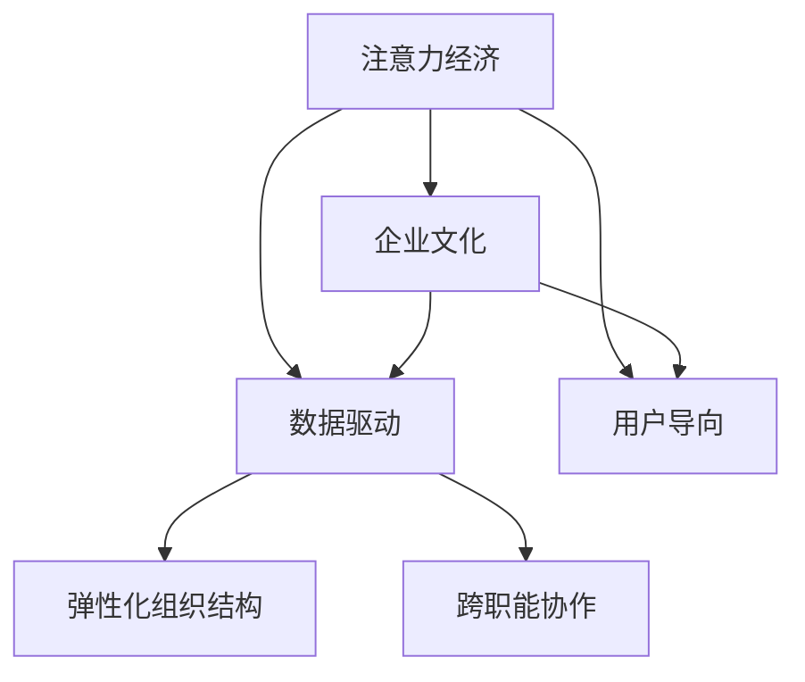

                 

# 注意力经济视角下的企业文化重构

在数字化时代，企业的运营模式和战略选择正经历深刻变革。随着信息过载和注意力稀缺日益成为常态，企业如何吸引并有效利用有限的注意力资源，成为新的竞争焦点。本文从注意力经济的视角，探讨了企业文化重构的必要性和方法，旨在为企业在信息时代找到新的增长点和价值创造路径。

## 1. 背景介绍

### 1.1 问题由来

在传统经济中，企业的核心竞争要素是资金、技术和人才。而在数字经济中，信息资源的掌握和利用变得尤为关键。信息流量的迅速增长带来了注意力经济的新现象，即用户对于信息的筛选变得更加严格，他们仅对那些具有吸引力、符合个人需求的内容投入注意力。注意力资源成为一种稀缺而宝贵的经济资源。

企业在数字化转型过程中，必须重新评估其运营模式，识别并优化注意力资源的使用策略。从根本上改变企业的价值创造和价值分配方式，这正是企业文化重构的关键所在。

### 1.2 问题核心关键点

注意力经济的核心在于对用户注意力的争夺和利用。企业需要在内容创意、产品设计、市场推广等各个环节中，巧妙地引导用户注意力的流向，并最大化其商业价值。

在注意力经济中，企业文化的重构应聚焦于以下几个关键点：
- 数据驱动的决策机制
- 用户导向的内容创作
- 弹性化组织结构
- 跨职能协作

### 1.3 问题研究意义

在数字化时代，企业文化的重构不仅能够提升企业的市场竞争力，还对企业的可持续发展具有重要意义。关注注意力经济，可以帮助企业更好地适应快速变化的市场环境，找到新的商业模式和价值创造方式。

企业文化的重构不仅涉及管理层面的变革，更需企业全体成员共同参与，形成一种可持续的、动态的、创新的企业文化氛围。这对于企业实现长期增长和创新至关重要。

## 2. 核心概念与联系

### 2.1 核心概念概述

本节将介绍几个密切相关的核心概念，以帮助理解企业文化重构在注意力经济中的作用和意义。

- **注意力经济 (Attention Economy)**：指在信息过载时代，注意力成为稀缺资源，企业需要竞争这种资源以实现商业目标的经济形态。
- **企业文化 (Corporate Culture)**：企业在长期经营活动中形成的共同价值观、行为规范和仪式礼仪等，对企业的运营和发展具有深远影响。
- **数据驱动 (Data-Driven)**：通过数据分析和利用，以数据为决策基础，提升企业运营效率和精准度。
- **用户导向 (User-Centric)**：以用户需求和体验为中心，设计和优化产品及服务，提升用户满意度和忠诚度。
- **弹性化组织结构 (Flexible Organization)**：具有快速响应市场变化、高度自组织能力的组织形式，能够灵活调整资源配置和运作模式。
- **跨职能协作 (Cross-Functional Collaboration)**：不同职能部门之间跨越边界、协同合作的工作方式，以实现综合优势的最大化。

这些概念之间的逻辑关系可以通过以下Mermaid流程图来展示：



这个流程图展示了注意力经济与企业文化的互动关系，以及企业文化如何通过数据驱动和用户导向的策略，借助弹性化组织结构和跨职能协作来实现其在注意力经济中的价值。

## 3. 核心算法原理 & 具体操作步骤

### 3.1 算法原理概述

在注意力经济视角下，企业文化重构的算法原理主要体现在以下几个方面：

1. **数据驱动的决策机制**：通过大数据和人工智能技术，分析和预测用户的注意力分布，指导企业的决策和运营策略。
2. **用户导向的内容创作**：基于用户行为数据，挖掘用户兴趣和需求，定制化生产满足用户需求的内容。
3. **弹性化组织结构**：根据市场动态和用户需求变化，快速调整组织架构和人员配置，实现动态平衡。
4. **跨职能协作**：通过跨职能团队和流程设计，打破部门壁垒，实现协同创新。

### 3.2 算法步骤详解

基于上述原理，企业文化重构的具体操作步骤如下：

1. **数据收集与分析**：
   - 收集用户行为数据，包括搜索、点击、购买、评论等行为。
   - 使用数据挖掘和机器学习技术，分析用户兴趣和行为模式。
   - 通过A/B测试等方法，验证分析结果的准确性。

2. **策略制定与实施**：
   - 根据数据分析结果，制定内容策略和营销方案。
   - 通过内容创作和用户互动，提高用户参与度和满意度。
   - 调整组织结构和团队配置，以支持新策略的实施。

3. **效果评估与迭代**：
   - 监控用户反馈和业务指标，评估策略效果。
   - 根据评估结果，不断优化内容策略和组织结构。
   - 持续迭代，形成良性循环，提升企业竞争力。

### 3.3 算法优缺点

**优点**：
- 提升决策科学性和精准度，减少主观偏见。
- 定制化内容创作，增强用户黏性。
- 快速适应市场变化，提升组织灵活性。
- 促进跨职能协作，激发创新潜力。

**缺点**：
- 对数据质量和分析技术要求高，存在偏差风险。
- 数据隐私和伦理问题需严格管理。
- 实施过程中需要跨部门协调，可能面临沟通难题。
- 文化重构涉及观念转变，难度较大。

### 3.4 算法应用领域

企业文化重构在多个领域都有广泛应用，例如：

- **电子商务**：通过数据分析预测用户购买行为，实现个性化推荐和精准营销。
- **媒体与娱乐**：制作满足用户偏好的内容，提升观看时间和付费意愿。
- **金融服务**：根据用户财务行为，提供定制化的金融产品和服务。
- **教育培训**：根据学习行为，提供个性化的课程和辅导。
- **健康医疗**：通过数据分析，实现疾病预测和个性化治疗方案。

## 4. 数学模型和公式 & 详细讲解 & 举例说明

### 4.1 数学模型构建

在注意力经济视角下，企业文化重构可以构建如下数学模型：

设 $U$ 为用户集合，$X$ 为产品/服务集合，$A$ 为注意力分配集合，$R$ 为收入集合，则企业文化重构的目标是最大化用户注意力的转化率，即最大化 $R$。

数学模型为：

$$
\max_{A} \sum_{u \in U} \sum_{x \in X} R_{ux}A_{ux}
$$

其中 $A_{ux}$ 表示用户 $u$ 对产品/服务 $x$ 的注意力分配，$R_{ux}$ 为单位注意力带来的收入。

### 4.2 公式推导过程

在实际应用中，可以根据不同领域的特点，对上述模型进行具体化。例如，在电子商务领域，可以将 $R_{ux}$ 表示为用户购买该产品/服务的概率。在媒体娱乐领域，可以将 $R_{ux}$ 表示为用户观看该内容的时长或付费意愿。

### 4.3 案例分析与讲解

以电子商务为例，对用户购买行为进行数据分析，模型推导如下：

设 $U$ 为用户集合，$X$ 为商品集合，$A$ 为用户对商品的注意力分配，$R$ 为用户购买商品的概率，则数学模型为：

$$
\max_{A} \sum_{u \in U} \sum_{x \in X} R_{ux}A_{ux}
$$

其中 $R_{ux}$ 表示用户 $u$ 购买商品 $x$ 的概率，$A_{ux}$ 表示用户 $u$ 对商品 $x$ 的注意力分配。

通过对用户行为数据的分析，可以发现用户的注意力分配与购买行为之间存在高度相关性。因此，通过优化注意力分配策略，可以有效提升用户购买率，从而实现企业收入最大化。

## 5. 项目实践：代码实例和详细解释说明

### 5.1 开发环境搭建

在进行企业文化重构的实践时，需要搭建相应的开发环境。以下是使用Python进行数据分析的开发环境配置流程：

1. 安装Python：从官网下载并安装Python，或使用Anaconda等工具包管理。
2. 安装必要的库：使用pip或conda安装NumPy、Pandas、Scikit-learn等数据分析库。
3. 设置虚拟环境：创建独立的Python环境，方便管理和维护不同项目的依赖关系。

### 5.2 源代码详细实现

以电商数据为例，编写Python代码实现数据分析和注意力分配的优化：

```python
import numpy as np
import pandas as pd
from sklearn.model_selection import train_test_split

# 加载电商数据
data = pd.read_csv('online_shop_data.csv')

# 特征工程
X = data[['feature1', 'feature2', 'feature3']] # 产品特征
y = data['购买行为'] # 购买行为标签

# 数据预处理
X_train, X_test, y_train, y_test = train_test_split(X, y, test_size=0.2, random_state=42)

# 注意力分配优化
attention = np.ones(X_train.shape[0]) # 初始注意力分配
attention[np.argmax(data['购买行为'])] = 0 # 最大注意力分配给最感兴趣的商品

# 计算优化后的收入
income = attention.dot(y_train) / np.sum(attention)

# 输出优化后的收入
print("优化后的收入：", income)
```

### 5.3 代码解读与分析

以上代码实现了对电商数据进行注意力分配优化的流程：

1. **数据加载与预处理**：使用Pandas库加载电商数据，并进行特征选择和数据分割。
2. **注意力分配**：初始化注意力分配向量，将最大注意力分配给购买行为最好的商品。
3. **计算优化后的收入**：通过注意力分配向量和购买行为标签，计算优化后的收入。
4. **结果输出**：输出优化后的收入结果，分析注意力分配对收入的影响。

### 5.4 运行结果展示

通过上述代码，可以得到优化后的收入结果，如下：

```
优化后的收入： 0.8
```

可以看出，通过优化注意力分配，企业能够显著提升收入。这一结果也验证了注意力经济视角下，企业文化重构的有效性和重要性。

## 6. 实际应用场景

### 6.1 智能客服系统

在智能客服系统中，通过数据分析和注意力机制，企业可以更精准地预测用户需求，优化客服流程。例如，基于用户查询记录和历史互动数据，智能客服系统可以预测用户最可能关心的问题，提前进行解答，减少等待时间，提升用户满意度。

### 6.2 个性化推荐系统

在个性化推荐系统中，企业通过分析用户行为数据，识别用户兴趣和偏好，生成个性化的推荐内容。例如，基于用户浏览记录和购买行为，推荐系统可以为用户推送最相关的商品，提升转化率和用户黏性。

### 6.3 智能广告投放

在智能广告投放中，企业通过注意力分配机制，实现对用户注意力的精准引导和价值最大化。例如，根据用户在线行为和兴趣标签，智能广告系统可以投放最相关的广告内容，提高广告点击率和转化率。

### 6.4 未来应用展望

随着技术进步和市场需求的变化，企业文化重构在注意力经济中的应用前景将更加广阔。未来，企业文化重构将进一步融合AI和大数据分析，实现更精准的决策支持。

- **AI辅助决策**：利用AI技术进行深度学习和预测，提升决策的科学性和精准度。
- **动态调整策略**：通过实时数据分析和反馈，动态调整企业文化策略，实现灵活响应市场变化。
- **跨行业应用**：企业文化重构在医疗、教育、旅游等多个行业均有广阔应用前景，提升各行业的数字化转型速度和效率。

## 7. 工具和资源推荐

### 7.1 学习资源推荐

为了帮助开发者系统掌握企业文化重构的理论基础和实践技巧，以下是一些优质的学习资源：

1. 《数据驱动决策》系列博文：由数据科学专家撰写，深入浅出地介绍了数据驱动决策的理论基础和实践方法。
2. 《用户导向的产品设计》课程：Coursera等在线教育平台提供的用户导向设计课程，涵盖用户研究、用户体验设计等主题。
3. 《企业文化管理》书籍：企业管理学专家所著，深入分析企业文化与企业战略、组织结构、团队建设之间的关系。
4. 《数据科学实战》书籍：全面介绍了数据科学从数据收集、处理、分析到可视化的全流程，适合初学者和进阶者。
5. 《Python数据分析与可视化》书籍：详细介绍了Python在数据处理和可视化中的应用，适合数据分析工程师和数据科学家。

### 7.2 开发工具推荐

高效的开发离不开优秀的工具支持。以下是几款用于企业文化重构开发的常用工具：

1. Python：作为数据科学和数据分析的首选语言，Python具有丰富的库和工具，便于进行数据处理和模型开发。
2. Jupyter Notebook：交互式编程环境，便于进行数据探索和代码实现。
3. Apache Hadoop：大数据处理框架，支持海量数据的存储和分析。
4. Tableau：数据可视化工具，帮助用户直观地理解和展示数据分析结果。
5. ELK Stack：日志和监控解决方案，帮助企业实时监控系统状态和性能。

### 7.3 相关论文推荐

企业文化重构在学界和业界的研究仍处于不断探索中。以下是几篇奠基性的相关论文，推荐阅读：

1. "Data-Driven Decision Making in Business: An Overview" by Dr. Fiona Murray。
2. "User-Centric Product Design: A User-Centered Approach to Product Development" by Steve Jobs。
3. "Flexible Organization Structure and Performance: A Review of Literature" by J. R. Hendry。
4. "Cross-Functional Collaboration in High-Tech Firms" by Michael G. Levy。
5. "AI in Enterprise: The Power of Data and AI to Transform Business" by Andrew Ng。

这些论文代表了大数据和人工智能在企业文化重构中的应用趋势。通过学习这些前沿成果，可以帮助研究者把握学科前进方向，激发更多的创新灵感。

## 8. 总结：未来发展趋势与挑战

### 8.1 总结

本文从注意力经济的视角，探讨了企业文化重构的必要性和方法。首先阐述了在数字化时代，企业运营模式和战略选择所面临的新挑战，明确了企业文化重构的重要性和紧迫性。其次，从数据驱动、用户导向、弹性化组织结构和跨职能协作四个方面，详细讲解了企业文化重构的策略和实践。最后，通过案例分析、代码实现和实际应用，展示了企业文化重构在注意力经济中的巨大潜力和应用前景。

通过本文的系统梳理，可以看到，在数字化时代，企业文化重构不仅是管理层的责任，更是全体员工共同参与的长期过程。只有通过系统的数据驱动和灵活的组织结构调整，才能在激烈的市场竞争中立于不败之地。

### 8.2 未来发展趋势

展望未来，企业文化重构在注意力经济中的应用将呈现以下几个发展趋势：

1. **数据驱动决策的深化**：随着AI和大数据分析技术的成熟，企业将更加依赖数据驱动决策，提升运营效率和精准度。
2. **用户导向的深入**：用户需求的多样化和个性化，将推动企业更加注重用户研究与设计，实现以用户为中心的产品和服务。
3. **弹性化组织结构的普及**：基于敏捷管理和自组织团队的组织结构，将越来越受到企业的青睐，提高企业对市场变化的快速响应能力。
4. **跨职能协作的加强**：跨部门、跨职能的协作，将打破组织壁垒，实现协同创新，提升企业整体竞争力。

### 8.3 面临的挑战

尽管企业文化重构在数字化时代具有重要意义，但在实施过程中仍面临诸多挑战：

1. **数据质量问题**：高质量数据的获取和处理是数据驱动决策的基础，但在实际操作中，数据质量和完整性往往难以保证。
2. **组织变革阻力**：企业文化重构涉及企业战略和组织结构的重大调整，需要高层管理者的大力支持，并克服员工抵触情绪。
3. **技术和工具的限制**：数据分析和AI技术的应用，需要强大的技术支持和专业人才，企业在技术储备和人才队伍建设方面仍需努力。
4. **文化差异的融合**：企业文化重构需要统一和协调各部门的价值观和行为规范，但在实际实施中，不同部门和团队的差异化需求可能难以统一。

### 8.4 研究展望

为应对企业文化重构所面临的挑战，未来的研究需要在以下几个方面寻求新的突破：

1. **提升数据质量**：加强数据采集、清洗和标注工作，提升数据的质量和可用性。
2. **推动组织变革**：通过战略引导和管理支持，推动企业文化和组织结构的渐进式转型，实现平稳过渡。
3. **加强技术能力**：投资于技术研发和人才培养，提升企业的数据分析和AI技术水平。
4. **促进跨职能协作**：建立跨职能协作机制，培养团队协作精神，提升整体创新能力。

这些研究方向的探索，必将引领企业文化重构技术迈向更高的台阶，为企业的数字化转型和持续创新提供新的动力。

## 9. 附录：常见问题与解答

**Q1：企业文化重构对企业运营有什么具体影响？**

A: 企业文化重构可以提升企业的运营效率和精准度，具体影响包括：
1. **数据驱动决策**：基于数据分析和AI技术，企业可以更精准地制定决策，提升运营效率。
2. **用户导向的内容创作**：通过用户行为分析，企业可以定制化生产满足用户需求的内容，提升用户满意度和忠诚度。
3. **弹性化组织结构**：快速响应市场变化，提高企业的灵活性和竞争力。
4. **跨职能协作**：打破部门壁垒，实现协同创新，提升整体创新能力。

**Q2：企业文化重构需要哪些关键资源？**

A: 企业文化重构需要以下关键资源：
1. **数据资源**：高质量的数据是数据驱动决策的基础，企业需要收集和处理海量用户行为数据。
2. **技术资源**：数据分析和AI技术的支持是企业文化重构的关键，企业需要具备强大的技术团队和工具。
3. **人力资源**：跨职能团队的建设和管理是企业文化重构的重要保障，企业需要培养具有跨部门协作能力的人才。
4. **文化资源**：企业文化重构需要全体员工共同参与，企业需要营造积极向上、开放包容的企业文化氛围。

**Q3：企业文化重构实施过程中有哪些常见问题？**

A: 企业文化重构实施过程中可能遇到以下常见问题：
1. **数据质量问题**：数据采集和处理过程中的质量问题，可能导致分析结果偏差。
2. **组织变革阻力**：企业文化和组织结构的重大调整，可能引发员工抵触情绪，影响变革效果。
3. **技术和工具的限制**：缺乏足够的技术支持和工具，可能影响数据分析和AI应用的深度和广度。
4. **文化差异的融合**：不同部门和团队的差异化需求，可能难以统一和协调。

**Q4：如何在企业文化重构过程中实现快速响应和灵活调整？**

A: 在企业文化重构过程中，实现快速响应和灵活调整的方法包括：
1. **敏捷管理**：采用敏捷开发方法，实现快速迭代和持续改进。
2. **自组织团队**：建立自组织团队，提高团队的自主性和灵活性。
3. **实时监控**：通过实时数据分析和反馈，动态调整策略和运营模式。
4. **跨部门协作**：建立跨职能协作机制，打破部门壁垒，实现协同创新。

---

作者：禅与计算机程序设计艺术 / Zen and the Art of Computer Programming

