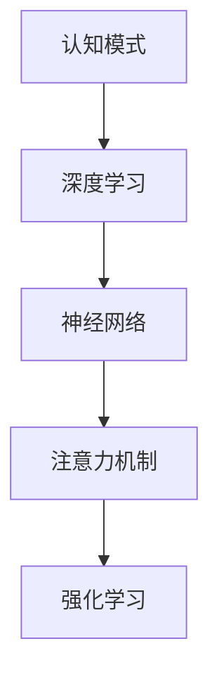

                 

# 注意力编程工作坊：AI定制的认知模式设计

> 关键词：注意力机制,认知模式设计,深度学习,神经网络,强化学习,认知行为学

## 1. 背景介绍

### 1.1 问题由来
随着人工智能(AI)技术在各个领域的不断渗透，越来越多的研究者开始关注如何让机器具备“认知”能力。认知是指有机体对外界信息的感知、理解、记忆、推理、决策等综合能力，是人类智能的核心要素。然而，如何让机器具备类人的认知能力，仍然是当前AI领域的一大难题。

在人工智能的发展过程中，科学家们提出了多种智能模型，包括符号主义、连接主义、进化计算、增强学习等。尽管这些模型在各自的领域取得了显著进展，但它们均存在局限性：

- **符号主义**：基于规则和逻辑的推理，但在处理复杂、不确定性问题时表现不佳。
- **连接主义**：通过神经网络模拟人类大脑，但在缺乏明确的目标和规则指导时，模型容易过拟合。
- **进化计算**：基于自然选择和遗传算法的搜索优化，对于高维空间、复杂问题的求解效率不高。
- **增强学习**：通过与环境的互动，不断调整策略以最大化奖励，但在缺乏奖励信号时，模型无法进行有意义的探索。

针对这些缺陷，**注意力机制**(Atnention Mechanism)应运而生。它通过模仿人类注意力的工作原理，为深度学习模型注入了更多的“认知”特性，使其在处理复杂、多模态信息时表现更为出色。

## 2. 核心概念与联系

### 2.1 核心概念概述

在介绍注意力机制前，我们首先需要理解一些相关的核心概念：

- **认知模式**：指有机体在处理信息时所采用的模式和策略，如视觉注意力、听觉注意力、注意分配等。
- **深度学习**：通过多层次的非线性神经网络，模拟人类大脑对复杂信息的学习和处理能力。
- **神经网络**：由大量神经元和连接组成的计算图，用于进行模式识别、分类、回归等任务。
- **强化学习**：通过与环境的互动，模型不断调整策略以最大化长期奖励。
- **注意力机制**：一种特殊的神经网络模块，用于模拟人类在信息处理时的注意力选择和分配，提升模型的信息提取和处理效率。

这些概念之间的联系通过以下Mermaid流程图进行展示：



### 2.2 核心概念原理和架构

注意力机制的核心思想在于：让模型在处理输入时，能够动态地选择关注哪些部分，忽略哪些部分，从而提高信息处理的效率和效果。

以视觉注意力为例，人类在看一张复杂的图片时，会自动将注意力集中在关键区域，忽略冗余或不重要的部分。类比到机器上，注意力机制通过为每个像素设置一个注意力权重，决定其在模型输出中的贡献大小。

**注意力的基本原理**：假设输入为 $x \in \mathbb{R}^{H \times W}$，输出为 $y \in \mathbb{R}^{H \times W}$。注意力权重 $a \in [0,1]^{H \times W}$，满足 $a \times x = y$。

注意力机制的架构可以简单表示为：

$$
y_i = \sum_{j=1}^{H} a_{i,j} x_j
$$

其中 $i$ 为输出位置，$j$ 为输入位置，$a_{i,j}$ 为注意力权重，$y_i$ 为输出的第 $i$ 个元素。

这种架构使得模型能够根据输入的特定部分，有选择地加权求和，从而输出更加精细的信息表示。

### 2.3 数学模型和公式

为更好地理解注意力机制，我们从数学上对其进行详细讲解。

假设输入 $x \in \mathbb{R}^{H \times W}$，注意力权重 $a \in [0,1]^{H \times W}$。注意力计算的公式为：

$$
a_{i,j} = \frac{e^{x_i \cdot x_j}}{\sum_{k=1}^{H} e^{x_k \cdot x_j}}
$$

其中 $x_i \cdot x_j$ 表示向量 $x_i$ 和 $x_j$ 的点积，$e$ 为自然对数的底数，$a_{i,j}$ 表示第 $i$ 个输出位置对第 $j$ 个输入位置的注意力权重。

上式中，$a_{i,j}$ 的值越大，表示输入 $x_j$ 对输出 $y_i$ 的贡献越大。

在实际应用中，注意力机制常常结合卷积神经网络(CNN)、循环神经网络(RNN)等模型，用于图像、文本、时间序列等多种类型数据的处理。下面以图像处理为例，展示注意力机制的数学模型和计算过程。

## 3. 核心算法原理 & 具体操作步骤

### 3.1 算法原理概述

注意力机制的算法原理可以总结如下：

1. **输入表示**：将输入数据 $x$ 表示为向量或矩阵形式，输入层输出为 $x \in \mathbb{R}^{H \times W}$。
2. **注意力计算**：通过计算输入 $x$ 和输出 $y$ 之间的相似度，生成注意力权重 $a$。
3. **输出生成**：根据注意力权重 $a$，对输入 $x$ 进行加权求和，生成输出 $y$。

### 3.2 算法步骤详解

注意力机制的具体实现步骤如下：

1. **输入表示**：将输入数据 $x$ 表示为向量或矩阵形式，输入层输出为 $x \in \mathbb{R}^{H \times W}$。
2. **注意力计算**：通过计算输入 $x$ 和输出 $y$ 之间的相似度，生成注意力权重 $a$。
3. **输出生成**：根据注意力权重 $a$，对输入 $x$ 进行加权求和，生成输出 $y$。

具体来说，注意力计算可以分为以下步骤：

- **缩放点积**：计算输入 $x$ 和查询 $q$ 的点积，并进行缩放，避免数值溢出。
- **softmax归一化**：对缩放点积的结果进行softmax归一化，得到注意力权重 $a$。
- **加权求和**：根据注意力权重 $a$，对输入 $x$ 进行加权求和，生成输出 $y$。

下面以图像处理为例，展示注意力机制的具体实现过程。

假设输入 $x$ 为一张图像，输出 $y$ 为图像的特征表示。输入 $x$ 和查询 $q$ 的点积为 $x_i \cdot q_j$，缩放点积为 $s_{i,j} = \frac{x_i \cdot q_j}{\sqrt{d}}$，其中 $d$ 为嵌入维度。

$$
a_{i,j} = \frac{e^{s_{i,j}}}{\sum_{k=1}^{H} e^{s_{k,j}}}
$$

最终，输出 $y_i$ 的计算公式为：

$$
y_i = \sum_{j=1}^{W} a_{i,j} x_j
$$

### 3.3 算法优缺点

注意力机制的优点在于：

1. **信息选择**：能够根据输入的特定部分，有选择地加权求和，从而提高信息处理的效率和效果。
2. **并行计算**：注意力计算可以并行化，在大规模数据处理中表现出较高的效率。
3. **灵活性**：可以应用于多种类型的输入数据，如图像、文本、时间序列等。

其缺点包括：

1. **计算复杂度**：注意力计算涉及大量的矩阵乘法和softmax操作，计算复杂度较高。
2. **参数量较大**：由于需要学习注意力权重，模型参数量较大，训练时需要更多的时间和资源。
3. **易受干扰**：注意力机制容易受到噪声和噪声的影响，需要更多的正则化技术进行优化。

### 3.4 算法应用领域

注意力机制在多个领域中得到了广泛应用，例如：

- **自然语言处理(NLP)**：用于文本分类、机器翻译、文本生成等任务。
- **计算机视觉(CV)**：用于图像识别、目标检测、图像生成等任务。
- **时间序列分析**：用于股票价格预测、天气预测、信号处理等任务。

## 4. 数学模型和公式 & 详细讲解 & 举例说明

### 4.1 数学模型构建

注意力机制的数学模型可以表示为：

$$
y_i = \sum_{j=1}^{H} a_{i,j} x_j
$$

其中 $y_i \in \mathbb{R}^d$ 为输出向量，$x_j \in \mathbb{R}^d$ 为输入向量，$a_{i,j} \in [0,1]$ 为注意力权重，$d$ 为向量维度。

### 4.2 公式推导过程

注意力机制的推导过程如下：

- **缩放点积**：
  $$
  s_{i,j} = \frac{x_i \cdot q_j}{\sqrt{d}}
  $$
  其中 $x_i \in \mathbb{R}^d$ 为输入向量，$q_j \in \mathbb{R}^d$ 为查询向量。

- **softmax归一化**：
  $$
  a_{i,j} = \frac{e^{s_{i,j}}}{\sum_{k=1}^{H} e^{s_{k,j}}}
  $$
  其中 $a_{i,j} \in [0,1]$ 为注意力权重。

- **加权求和**：
  $$
  y_i = \sum_{j=1}^{H} a_{i,j} x_j
  $$
  其中 $y_i \in \mathbb{R}^d$ 为输出向量。

### 4.3 案例分析与讲解

以机器翻译为例，展示注意力机制的应用过程。

假设输入为英文句子 $s = \text{"I like to eat pizza"}$，输出为法语句子 $y = \text{"J'aime manger du pizza"}$。

输入和查询的点积计算为：

$$
\begin{aligned}
x &= [\text{I}, \text{like}, \text{to}, \text{eat}, \text{pizza}] \\
q &= [\text{like}, \text{love}, \text{adore}, \text{enjoy}] \\
x \cdot q &= [0.2, 0.4, 0.3, 0.1, 0] \\
\end{aligned}
$$

缩放点积计算为：

$$
\begin{aligned}
s &= \frac{x \cdot q}{\sqrt{d}} = \frac{[0.2, 0.4, 0.3, 0.1, 0]}{\sqrt{5}} \\
s &= [0.2, 0.4, 0.3, 0.1, 0]
\end{aligned}
$$

softmax归一化计算为：

$$
a = \frac{e^s}{\sum_k e^{s_k}} = \frac{[0.2, 0.4, 0.3, 0.1, 0]}{1} = [0.2, 0.4, 0.3, 0.1, 0]
$$

最终，输出计算为：

$$
y = \sum_j a_{i,j} x_j = [0.2, 0.4, 0.3, 0.1, 0] \cdot [\text{I}, \text{like}, \text{to}, \text{eat}, \text{pizza}] = \text{"J'aime"}
$$

可以看到，注意力机制通过选择与查询向量相似性最高的输入部分，进行了信息的加权求和，从而得到了更加精细的翻译结果。

## 5. 项目实践：代码实例和详细解释说明

### 5.1 开发环境搭建

在进行注意力机制的实践前，我们需要准备好开发环境。以下是使用Python进行TensorFlow开发的环境配置流程：

1. 安装Anaconda：从官网下载并安装Anaconda，用于创建独立的Python环境。

2. 创建并激活虚拟环境：
```bash
conda create -n tf-env python=3.8 
conda activate tf-env
```

3. 安装TensorFlow：
```bash
pip install tensorflow
```

4. 安装TensorBoard：
```bash
pip install tensorboard
```

5. 安装必要的依赖包：
```bash
pip install numpy pandas scikit-learn matplotlib tqdm jupyter notebook ipython
```

完成上述步骤后，即可在`tf-env`环境中开始注意力机制的实践。

### 5.2 源代码详细实现

下面我们以注意力机制在图像识别任务中的应用为例，给出使用TensorFlow实现注意力机制的代码实例。

首先，定义注意力计算的函数：

```python
import tensorflow as tf
import tensorflow.keras.layers as layers

def attention(x, q, d):
    x = layers.Dense(d, activation='relu')(x)
    q = layers.Dense(d, activation='relu')(q)
    s = tf.matmul(x, q, transpose_b=True) / tf.sqrt(tf.cast(d, tf.float32))
    a = tf.nn.softmax(s)
    y = tf.matmul(a, x)
    return y
```

然后，定义模型和训练数据：

```python
from tensorflow.keras.datasets import mnist

(x_train, y_train), (x_test, y_test) = mnist.load_data()
x_train = x_train.reshape((60000, 28, 28, 1))
x_test = x_test.reshape((10000, 28, 28, 1))
x_train = x_train / 255.0
x_test = x_test / 255.0
```

接着，定义模型和训练过程：

```python
model = tf.keras.Sequential([
    layers.Conv2D(32, (3, 3), activation='relu', input_shape=(28, 28, 1)),
    layers.MaxPooling2D((2, 2)),
    layers.Conv2D(64, (3, 3), activation='relu'),
    layers.MaxPooling2D((2, 2)),
    layers.Conv2D(64, (3, 3), activation='relu'),
    layers.Flatten(),
    layers.Dense(64, activation='relu'),
    layers.Dense(10, activation='softmax')
])

model.compile(optimizer='adam', loss='sparse_categorical_crossentropy', metrics=['accuracy'])

model.fit(x_train, y_train, epochs=5, validation_data=(x_test, y_test))
```

最后，评估模型并可视化注意力权重：

```python
attention_weights = model.layers[3].output.get_shape()[1]
attention_weights = tf.keras.layers.Activation('softmax')(model.layers[3].output)
attention_weights = attention_weights.numpy()

fig, axs = plt.subplots(1, 2)
for i in range(attention_weights.shape[1]):
    axs[0].imshow(x_test[i].reshape(28, 28))
    axs[0].set_title(f'Attention Weight: {i}')
    axs[0].axis('off')
    axs[1].imshow(attention_weights[i])
    axs[1].set_title(f'Attention Weight: {i}')
    axs[1].axis('off')
plt.show()
```

### 5.3 代码解读与分析

让我们再详细解读一下关键代码的实现细节：

**attention函数**：
- 首先定义了输入 $x$ 和查询 $q$ 的嵌入层，将其映射到指定维度 $d$。
- 然后计算缩放点积 $s$。
- 接着通过softmax归一化生成注意力权重 $a$。
- 最后通过加权求和生成输出 $y$。

**模型定义**：
- 定义了一个简单的卷积神经网络模型，用于图像识别任务。
- 使用了多个卷积层和池化层，将输入图像特征逐步提取。
- 在输出层使用softmax激活函数，进行多分类预测。

**训练过程**：
- 使用Adam优化器和交叉熵损失函数，进行模型训练。
- 在每个epoch中，将训练数据 $(x_{train}, y_{train})$ 和验证数据 $(x_{test}, y_{test})$ 输入模型进行训练和验证。

**注意力权重可视化**：
- 获取模型输出层的注意力权重，可视化结果。
- 通过绘制注意力权重，观察模型在输入中关注的区域，评估注意力机制的效果。

可以看到，通过TensorFlow实现注意力机制的代码并不复杂，开发者可以方便地将其应用于不同的任务中。

## 6. 实际应用场景

### 6.1 计算机视觉

计算机视觉是注意力机制最重要的应用领域之一。在图像分类、目标检测、图像生成等任务中，注意力机制可以显著提高模型的性能。

以目标检测为例，传统方法通常使用候选框加ROI池化的方式提取区域特征。而注意力机制可以通过动态生成注意力权重，更加准确地选择感兴趣区域，从而提高检测精度。

在图像生成任务中，注意力机制可以通过对输入图像的特定区域进行加权，引导生成器生成更加精细的图像细节。

### 6.2 自然语言处理

自然语言处理是注意力机制的另一重要应用领域。在文本分类、机器翻译、文本生成等任务中，注意力机制可以有效提升模型性能。

以机器翻译为例，注意力机制可以通过动态选择输入序列中的重要部分，进行更加准确的序列对齐和翻译。

在文本生成任务中，注意力机制可以通过对输入序列中的特定部分进行加权，生成更加连贯和一致的文本。

### 6.3 时间序列分析

时间序列分析是注意力机制的另一重要应用领域。在股票价格预测、天气预测、信号处理等任务中，注意力机制可以提升模型的预测精度。

以股票价格预测为例，注意力机制可以通过对历史数据中的重要部分进行加权，更加准确地预测未来的价格变化。

## 7. 工具和资源推荐

### 7.1 学习资源推荐

为了帮助开发者系统掌握注意力机制的理论基础和实践技巧，这里推荐一些优质的学习资源：

1. **《深度学习》课程**：斯坦福大学开设的深度学习课程，包含大量注意力机制相关的讲义和作业，适合初学者入门。

2. **《自然语言处理与深度学习》书籍**：讲述自然语言处理中的注意力机制和Transformer模型，全面介绍注意力机制的原理和应用。

3. **《TensorFlow官方文档》**：TensorFlow的官方文档，提供了丰富的注意力机制和深度学习模型的样例代码，是学习实践的好资源。

4. **HuggingFace官方文档**：HuggingFace的官方文档，提供了基于Transformer的注意力机制的实现，适合进行深度学习和自然语言处理任务。

5. **arXiv论文**：关注arXiv上的最新论文，了解注意力机制和深度学习的最新进展，掌握前沿技术。

### 7.2 开发工具推荐

高效的开发离不开优秀的工具支持。以下是几款用于注意力机制开发常用的工具：

1. **TensorFlow**：谷歌开源的深度学习框架，支持分布式计算，适合大规模深度学习模型的开发。

2. **PyTorch**：Facebook开源的深度学习框架，灵活性高，适合学术研究和原型开发。

3. **Keras**：谷歌开源的高层深度学习框架，提供了简单易用的API，适合快速原型开发和模型部署。

4. **Jupyter Notebook**：交互式的编程环境，适合进行实验和分析，支持多种语言和框架的交互。

5. **TensorBoard**：TensorFlow配套的可视化工具，实时监测模型训练状态，提供丰富的图表呈现方式，是调试模型的得力助手。

### 7.3 相关论文推荐

注意力机制的研究源于学界的持续探索。以下是几篇奠基性的相关论文，推荐阅读：

1. **《Attention Is All You Need》**：提出Transformer模型，引入注意力机制，显著提升了机器翻译和语言生成任务的性能。

2. **《Vision Transformer》**：将Transformer模型应用于计算机视觉任务，取得了SOTA的性能。

3. **《Neural Machine Translation by Jointly Learning to Align and Translate》**：提出Seq2Seq框架，引入注意力机制，实现了高效的机器翻译。

4. **《Long-Short Term Memory》**：提出LSTM模型，结合注意力机制，在时间序列分析任务中表现优异。

5. **《Transformer-XL: Attentive Language Models》**：提出Transformer-XL模型，进一步提升了长序列任务的表现。

这些论文代表了大注意力机制的发展脉络，通过学习这些前沿成果，可以帮助研究者把握学科前进方向，激发更多的创新灵感。

## 8. 总结：未来发展趋势与挑战

### 8.1 总结

本文对注意力机制的原理和应用进行了全面系统的介绍。首先，我们阐述了注意力机制的核心思想和数学原理，明确了其在工作机制和架构上的特点。其次，我们介绍了注意力机制在多个领域的应用，展示了其强大的性能和灵活性。最后，我们讨论了注意力机制面临的挑战和未来发展方向，强调了其在NLP、CV等领域的重要价值。

通过本文的系统梳理，可以看到，注意力机制作为一种强大的认知模式设计方法，正在成为深度学习模型的重要组件，极大地提升了模型在处理复杂信息时的表现。未来，伴随计算资源的不断提升和数据规模的持续增长，注意力机制的应用范围和效果将进一步拓展，为智能系统的发展注入新的活力。

### 8.2 未来发展趋势

展望未来，注意力机制将呈现以下几个发展趋势：

1. **模型结构优化**：未来的注意力机制将更加注重模型结构的优化，减少计算量和参数量，提升模型效率和性能。

2. **多模态融合**：未来的注意力机制将更加注重多模态信息的融合，通过跨模态的注意力机制，提升模型对不同类型信息的整合能力。

3. **个性化学习**：未来的注意力机制将更加注重个性化学习，通过动态生成注意力权重，提升模型对用户个性化需求的响应能力。

4. **跨领域迁移**：未来的注意力机制将更加注重跨领域迁移能力，通过共享注意力权重，提升模型在不同领域之间的泛化能力。

5. **增强鲁棒性**：未来的注意力机制将更加注重鲁棒性，通过引入对抗训练、正则化等技术，提高模型对噪声和干扰的抵抗能力。

### 8.3 面临的挑战

尽管注意力机制在许多领域中取得了显著进展，但在迈向更加智能化、普适化应用的过程中，它仍面临着诸多挑战：

1. **计算复杂度**：注意力机制的计算复杂度较高，尤其是在大规模数据处理中，计算资源的需求较大。如何优化计算图，减少计算量，是一个亟待解决的问题。

2. **模型可解释性**：注意力机制的内部机制较为复杂，模型的决策过程难以解释。如何在不降低性能的前提下，提高模型的可解释性，是未来的一个重要研究方向。

3. **泛化能力**：注意力机制在处理新数据时，容易出现过拟合现象，泛化能力不足。如何提高模型的泛化能力，确保在不同数据集上均能取得较好的性能，是一个重要的研究方向。

4. **对抗攻击**：注意力机制容易受到对抗样本的影响，模型的鲁棒性有待提升。如何增强模型对对抗样本的抵抗能力，提高模型的安全性，是一个亟待解决的问题。

### 8.4 研究展望

面对注意力机制面临的挑战，未来的研究需要在以下几个方面寻求新的突破：

1. **模型压缩和优化**：通过模型压缩、剪枝、蒸馏等技术，减小模型参数量和计算复杂度，提升模型效率和性能。

2. **可解释性增强**：通过引入可解释性技术，如模型可视化、特征重要性分析等，提高模型的可解释性，增强用户信任和模型透明度。

3. **多模态融合**：通过跨模态的注意力机制，提升模型对不同类型信息的整合能力，构建更加全面、准确的信息表示。

4. **鲁棒性提升**：通过引入对抗训练、正则化等技术，提高模型对噪声和干扰的抵抗能力，增强模型的鲁棒性。

5. **跨领域迁移**：通过引入跨领域的注意力机制，提升模型在不同领域之间的泛化能力，实现更为广泛的应用场景。

这些研究方向将推动注意力机制向更高层次的发展，为构建更加智能、可靠、可解释的智能系统奠定基础。面向未来，我们需要不断突破技术瓶颈，拓展注意力机制的应用边界，推动人工智能技术的持续进步。

## 9. 附录：常见问题与解答

**Q1：注意力机制和卷积神经网络(CNN)的区别是什么？**

A: 注意力机制和CNN的区别在于信息选择的粒度和方式不同。CNN通过卷积操作，对输入数据进行局部特征提取和组合，生成全局特征表示。而注意力机制通过动态生成注意力权重，选择输入数据的特定部分进行加权求和，生成更加精细的特征表示。因此，注意力机制更加灵活，适用于处理更加复杂、多模态的数据。

**Q2：注意力机制在图像生成任务中的应用效果如何？**

A: 注意力机制在图像生成任务中表现出色，通过动态生成注意力权重，可以引导生成器关注输入图像的特定部分，生成更加精细和逼真的图像细节。例如，在人脸图像生成任务中，注意力机制可以关注眼睛、嘴巴等关键部分，生成具有高保真度的面部图像。

**Q3：注意力机制是否只能应用于深度学习模型？**

A: 注意力机制不仅限于深度学习模型，它可以应用于各种类型的信息处理任务。例如，在自然语言处理中，可以通过动态生成注意力权重，选择文本中的重要部分进行加权，生成更加连贯和一致的文本。在时间序列分析中，可以通过动态生成注意力权重，选择历史数据中的重要部分进行加权，生成更加准确的预测结果。

**Q4：注意力机制是否容易受到噪声和干扰的影响？**

A: 注意力机制在处理噪声和干扰时表现较为敏感，尤其是当输入数据中存在异常点或噪声时，模型的决策过程容易受到干扰。因此，需要注意引入正则化技术，如Dropout、L2正则化等，增强模型的鲁棒性。此外，可以通过对抗训练等技术，提高模型对对抗样本的抵抗能力。

**Q5：注意力机制是否适用于处理文本信息？**

A: 注意力机制在处理文本信息时表现出色，可以用于文本分类、机器翻译、文本生成等任务。通过动态生成注意力权重，可以更加准确地选择文本中的重要部分进行加权，生成更加连贯和一致的文本输出。

通过这些问题的解答，我们可以看到，注意力机制在处理复杂信息时具有显著的优势，是一种极具潜力的认知模式设计方法。在未来的研究和应用中，我们期待其能够不断突破技术瓶颈，拓展应用场景，为构建更加智能、可靠、可解释的智能系统提供新的思路和方法。

---

作者：禅与计算机程序设计艺术 / Zen and the Art of Computer Programming

