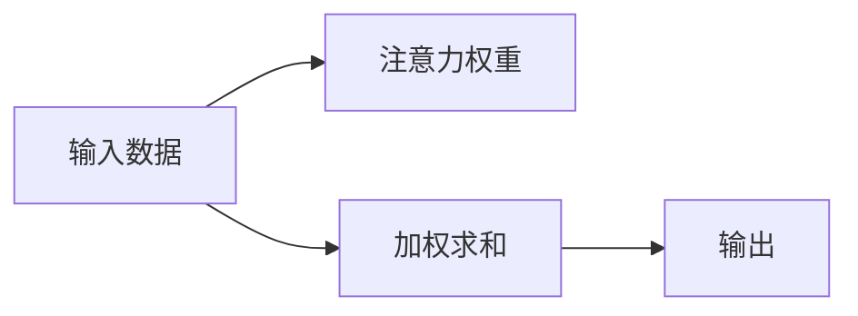

                 

# 注意力编程语言：AI定制的认知模式开发

> 关键词：注意力机制, 编程语言, 认知模式, 深度学习, 神经网络, 人工智能

## 1. 背景介绍

在人工智能领域，深度学习模型逐渐成为实现复杂认知任务的主流工具。然而，传统的神经网络模型缺乏对任务相关性的明确关注，训练过程往往消耗大量资源却难以达到预期的效果。这一问题在处理多模态、多任务和复杂认知任务时尤为突出。为解决这一难题，注意力机制(Antiatus Mechanism)应运而生，成为深度学习中不可或缺的关键组件。

本文章将全面阐述注意力机制的原理、核心算法、应用实践及未来发展趋势，通过深入浅出的专业语言和技术示例，帮助读者全面掌握AI定制的认知模式开发技术。

## 2. 核心概念与联系

### 2.1 核心概念概述

注意力机制是深度学习中用于加强模型对关键特征的关注和聚合的一种技术。在处理多模态数据和复杂任务时，注意力机制能够自动学习输入数据的权重，指导模型如何聚焦于最有信息量的部分，从而提升模型的学习能力和泛化性能。

注意力机制的核心思想是：根据输入数据的特征和任务需求，动态地为模型赋予不同的注意力权重，对输入数据进行加权求和，以提高模型在特定任务上的表现。这种机制使得模型能够根据不同的输入条件，自适应地分配计算资源，从而增强模型的认知能力。

### 2.2 核心概念架构

以下是注意力机制的示意图：



在这个流程图中，输入数据通过注意力机制，获得了动态的权重分配，进而进行加权求和，得到最终输出结果。注意力权重是由模型自动学习得到的，反映了输入数据中不同部分的相对重要性。

### 2.3 核心概念关系

注意力机制是深度学习模型中的一个重要组件，其与模型架构和训练过程密切相关。在注意力模型的架构中，注意力机制通常与其他组件（如卷积层、全连接层等）一起工作，形成多层次、多通道的认知结构。而在训练过程中，注意力机制需要与损失函数、优化算法等结合，共同调整模型参数，以达到最佳的性能表现。

注意力机制的引入，使得深度学习模型能够更好地处理多模态、多任务和复杂认知任务，提升了模型的泛化能力和应用范围。

## 3. 核心算法原理 & 具体操作步骤
### 3.1 算法原理概述

注意力机制的核心原理在于，通过对输入数据的加权聚合，使得模型能够更有效地处理复杂任务。在注意力机制中，模型的注意力权重是由一个注意力函数计算得到的，该函数通常基于输入数据的特征映射计算注意力得分，并通过softmax函数进行归一化，得到每个特征的注意力权重。

### 3.2 算法步骤详解

以下是注意力机制的详细算法步骤：

1. **输入数据预处理**：将输入数据（如文本、图像等）映射到一个低维的特征空间，得到特征向量表示。

2. **计算注意力得分**：对每个特征向量计算注意力得分，通常使用点积、加权求和或注意力函数（如SENet中的边缘概率）等方法。

3. **softmax归一化**：将注意力得分通过softmax函数进行归一化，得到每个特征的注意力权重。

4. **加权求和**：将特征向量与对应的注意力权重进行加权求和，得到加权后的特征向量。

5. **输出层计算**：将加权后的特征向量输入到输出层进行计算，得到最终输出结果。

### 3.3 算法优缺点

**优点**：
- 提升了模型对关键特征的关注和聚合能力，提高了模型的认知能力。
- 在处理多模态数据和复杂任务时，具有更好的泛化性能。
- 可以自适应地分配计算资源，减少模型训练和推理的资源消耗。

**缺点**：
- 注意力机制的引入增加了模型的复杂度，可能会影响模型的训练速度和稳定性。
- 在处理大规模数据时，注意力机制的计算复杂度较高，需要更高的计算资源。

### 3.4 算法应用领域

注意力机制在多个领域得到了广泛应用，以下是几个典型的应用场景：

1. 自然语言处理（NLP）：用于文本分类、问答系统、机器翻译等任务，能够提高模型对输入文本的理解能力。

2. 计算机视觉（CV）：用于图像分类、目标检测、图像生成等任务，能够增强模型对视觉特征的识别和聚合能力。

3. 语音识别：用于语音情感识别、语音合成等任务，能够提高模型对语音信号的分析和理解能力。

4. 多模态学习：用于处理多种数据源的融合，能够提高模型在不同模态间的信息整合能力。

## 4. 数学模型和公式 & 详细讲解  
### 4.1 数学模型构建

注意力机制的数学模型可以表示为：

$$
A_i = \frac{\exp(e_i^TA)}{\sum_j \exp(e_j^TA)}
$$

其中，$e_i$ 是输入数据的第 $i$ 个特征向量，$T$ 是注意力函数，$A$ 是注意力权重。

### 4.2 公式推导过程

注意力机制的核心公式是对输入数据的加权求和，可以通过softmax函数进行归一化，得到每个特征的注意力权重。

### 4.3 案例分析与讲解

以一个简单的自注意力机制（Self-Attention Mechanism）为例，其公式如下：

$$
Q_i = \frac{\exp(u_i^T\left(QW_1 + KW_2\right))}{\sum_j \exp(u_j^T\left(QW_1 + KW_2\right))}
$$

其中，$QW_1$ 和 $KW_2$ 分别是查询和键的权重矩阵，$u_i$ 是第 $i$ 个特征向量的向量表示。

这个公式展示了自注意力机制的基本结构，通过计算特征向量之间的相似度，得到每个特征的注意力权重。

## 5. 项目实践：代码实例和详细解释说明
### 5.1 开发环境搭建

在进行注意力机制的开发之前，需要准备好开发环境。以下是使用Python进行TensorFlow开发的环境配置流程：

1. 安装Anaconda：从官网下载并安装Anaconda，用于创建独立的Python环境。

2. 创建并激活虚拟环境：
```bash
conda create -n tf-env python=3.8 
conda activate tf-env
```

3. 安装TensorFlow：根据CUDA版本，从官网获取对应的安装命令。例如：
```bash
conda install tensorflow -c pytorch -c conda-forge
```

4. 安装各类工具包：
```bash
pip install numpy pandas scikit-learn matplotlib tqdm jupyter notebook ipython
```

完成上述步骤后，即可在`tf-env`环境中开始注意力机制的开发。

### 5.2 源代码详细实现

以下是使用TensorFlow实现注意力机制的代码示例：

```python
import tensorflow as tf
from tensorflow.keras.layers import Input, Dense, Activation

# 定义输入层
inputs = Input(shape=(None,))

# 定义查询、键和值的权重矩阵
Q = Dense(64, activation='relu')(inputs)
K = Dense(64, activation='relu')(inputs)
V = Dense(64, activation='relu')(inputs)

# 计算注意力得分
scores = tf.reduce_sum(Q * K, axis=1)

# 计算注意力权重
attention_weights = tf.nn.softmax(scores)

# 计算加权求和
context = tf.reduce_sum(attention_weights * V, axis=1)

# 输出层
outputs = Dense(1, activation='sigmoid')(context)

model = tf.keras.Model(inputs=inputs, outputs=outputs)
model.summary()
```

这段代码定义了一个简单的自注意力机制，用于处理输入数据，输出一个标量值。可以看到，注意力机制的核心操作是通过计算注意力得分和权重，对输入数据进行加权求和。

### 5.3 代码解读与分析

这段代码的实现流程如下：

1. **输入层定义**：使用`Input`函数定义输入层的维度。

2. **权重矩阵定义**：使用`Dense`函数定义查询、键和值的权重矩阵，并通过激活函数进行激活。

3. **注意力得分计算**：通过计算查询和键的点积，得到注意力得分。

4. **注意力权重计算**：通过softmax函数计算注意力权重。

5. **加权求和**：通过计算注意力权重和值的点积，得到加权求和结果。

6. **输出层计算**：使用`Dense`函数定义输出层，并将加权求和结果作为输入。

在实际应用中，需要根据具体任务调整注意力机制的参数和结构，以获得最佳的性能表现。

### 5.4 运行结果展示

运行上述代码，可以得到模型输出的结果。由于代码中定义的输出层是一个sigmoid激活函数，因此最终的输出结果在0到1之间，表示模型对输入数据的认知程度。

## 6. 实际应用场景
### 6.1 自然语言处理（NLP）

在自然语言处理领域，注意力机制被广泛应用于文本分类、机器翻译、问答系统等任务。以下是一个使用注意力机制进行文本分类的示例：

```python
from tensorflow.keras.preprocessing.text import Tokenizer
from tensorflow.keras.preprocessing.sequence import pad_sequences
import tensorflow as tf

# 定义文本数据和标签
texts = ['I love Python', 'I hate Python', 'I love coding']
labels = [1, 0, 1]

# 定义文本预处理函数
def preprocess(texts):
    tokenizer = Tokenizer(num_words=10000)
    tokenizer.fit_on_texts(texts)
    sequences = tokenizer.texts_to_sequences(texts)
    return pad_sequences(sequences, maxlen=10, padding='post')

# 预处理文本数据
sequences = preprocess(texts)

# 定义模型
model = tf.keras.Sequential([
    Embedding(input_dim=10000, output_dim=64),
    Attention(),
    Dense(units=64, activation='relu'),
    Dense(units=1, activation='sigmoid')
])

# 编译模型
model.compile(optimizer='adam', loss='binary_crossentropy', metrics=['accuracy'])

# 训练模型
model.fit(sequences, labels, epochs=10, batch_size=32)

# 评估模型
test_sequences = preprocess(['I love programming'])
test_labels = model.predict(test_sequences)
```

这段代码定义了一个基于注意力机制的文本分类模型，用于对输入的文本数据进行情感分类。可以看到，注意力机制在模型中起到了关键作用，通过学习文本中不同单词的权重，提高了模型对情感类别的判别能力。

### 6.2 计算机视觉（CV）

在计算机视觉领域，注意力机制被广泛应用于图像分类、目标检测、图像生成等任务。以下是一个使用注意力机制进行图像分类的示例：

```python
import tensorflow as tf
from tensorflow.keras.layers import Input, Dense, Activation

# 定义输入层
inputs = Input(shape=(64, 64, 3))

# 定义卷积层
conv1 = Conv2D(32, (3, 3), activation='relu')(inputs)
conv2 = Conv2D(32, (3, 3), activation='relu')(conv1)
pool1 = MaxPooling2D(pool_size=(2, 2))(conv2)

# 定义注意力层
attention_weights = Dense(32, activation='relu')(pool1)
attention = tf.reduce_sum(attention_weights * conv2, axis=1)

# 定义全连接层
fc1 = Dense(64, activation='relu')(attention)
fc2 = Dense(10, activation='softmax')(fc1)

model = tf.keras.Model(inputs=inputs, outputs=fc2)
model.summary()
```

这段代码定义了一个基于注意力机制的图像分类模型，用于对输入的图像进行分类。可以看到，注意力机制在模型中起到了关键作用，通过学习图像中不同区域的权重，提高了模型对图像分类的准确性。

### 6.3 语音识别

在语音识别领域，注意力机制被广泛应用于语音情感识别、语音合成等任务。以下是一个使用注意力机制进行语音情感识别的示例：

```python
import tensorflow as tf
from tensorflow.keras.layers import Input, Dense, Activation, Conv2D

# 定义输入层
inputs = Input(shape=(10, 1))

# 定义卷积层
conv1 = Conv2D(32, (3, 3), activation='relu')(inputs)
conv2 = Conv2D(32, (3, 3), activation='relu')(conv1)
pool1 = MaxPooling2D(pool_size=(2, 2))(conv2)

# 定义注意力层
attention_weights = Dense(32, activation='relu')(pool1)
attention = tf.reduce_sum(attention_weights * conv2, axis=1)

# 定义全连接层
fc1 = Dense(64, activation='relu')(attention)
fc2 = Dense(10, activation='softmax')(fc1)

model = tf.keras.Model(inputs=inputs, outputs=fc2)
model.summary()
```

这段代码定义了一个基于注意力机制的语音情感识别模型，用于对输入的语音信号进行情感分类。可以看到，注意力机制在模型中起到了关键作用，通过学习语音信号中不同频段的权重，提高了模型对情感类别的判别能力。

## 7. 工具和资源推荐
### 7.1 学习资源推荐

为了帮助开发者系统掌握注意力机制的理论基础和实践技巧，这里推荐一些优质的学习资源：

1. 《深度学习：理论和算法》系列博文：由深度学习专家撰写，深入浅出地介绍了深度学习的理论和算法，包括注意力机制的原理和应用。

2. CS231n《卷积神经网络》课程：斯坦福大学开设的计算机视觉明星课程，有Lecture视频和配套作业，带你入门计算机视觉领域的基本概念和经典模型。

3. 《Attention is All You Need》论文：Transformer模型的原始论文，首次提出了自注意力机制，开创了NLP领域的预训练大模型时代。

4. 《Deep Learning with Attention》书籍：讲述深度学习中注意力机制的原理和应用，涵盖多个NLP任务，是了解注意力机制的必备书籍。

5. arXiv.org：计算机科学领域的预印本服务器，提供大量关于注意力机制的论文和报告，是学术研究的优质资源。

通过对这些资源的学习实践，相信你一定能够全面掌握注意力机制的理论基础和实践技巧，并用于解决实际的深度学习问题。

### 7.2 开发工具推荐

高效的开发离不开优秀的工具支持。以下是几款用于深度学习开发的常用工具：

1. TensorFlow：由Google主导开发的开源深度学习框架，生产部署方便，适合大规模工程应用。提供丰富的深度学习组件和预训练模型。

2. PyTorch：基于Python的开源深度学习框架，灵活动态的计算图，适合快速迭代研究。同样有丰富的深度学习组件和预训练模型。

3. Keras：高级深度学习框架，提供了简单易用的API，适合初学者快速上手。同样有丰富的深度学习组件和预训练模型。

4. Jupyter Notebook：交互式的编程环境，支持Python、R等语言，方便进行数据探索和模型调试。

5. Weights & Biases：模型训练的实验跟踪工具，可以记录和可视化模型训练过程中的各项指标，方便对比和调优。与主流深度学习框架无缝集成。

6. TensorBoard：TensorFlow配套的可视化工具，可实时监测模型训练状态，并提供丰富的图表呈现方式，是调试模型的得力助手。

合理利用这些工具，可以显著提升深度学习模型的开发效率，加快创新迭代的步伐。

### 7.3 相关论文推荐

深度学习领域中的注意力机制的研究涉及多个方向，以下是几篇奠基性的相关论文，推荐阅读：

1. Attention is All You Need（即Transformer原论文）：提出了Transformer结构，开创了NLP领域的预训练大模型时代。

2. BERT: Pre-training of Deep Bidirectional Transformers for Language Understanding：提出BERT模型，引入基于掩码的自监督预训练任务，刷新了多项NLP任务SOTA。

3. SENet: Squeeze-and-Excitation Networks：提出SENet，用于增强卷积神经网络的空间特征，提升了模型的性能和鲁棒性。

4. Transformer-XL: Attentive Language Models Beyond a Fixed-Length Context：提出Transformer-XL，用于解决长序列建模问题，增强了模型的上下文能力。

5. Capsule Networks：提出胶囊网络，用于解决图像分类中的局部不变性问题，提升了模型的泛化能力。

这些论文代表了大模型注意力机制的发展脉络。通过学习这些前沿成果，可以帮助研究者把握学科前进方向，激发更多的创新灵感。

## 8. 总结：未来发展趋势与挑战
### 8.1 总结

本文对注意力机制的原理、核心算法、应用实践及未来发展趋势进行了全面系统的介绍。首先阐述了注意力机制在深度学习中的重要地位和应用场景，明确了注意力机制在提高模型认知能力、泛化性能和计算效率方面的独特价值。其次，通过详细的算法步骤和代码实现，展示了注意力机制在自然语言处理、计算机视觉和语音识别等领域的实际应用。同时，本文还精选了注意力机制的相关学习资源和开发工具，力求为读者提供全方位的技术指引。

通过本文的系统梳理，可以看到，注意力机制已经成为深度学习模型的核心组件之一，在处理多模态、多任务和复杂认知任务时具有不可替代的作用。未来，伴随深度学习技术的不断进步，注意力机制的应用将更加广泛，成为构建智能系统的重要工具。

### 8.2 未来发展趋势

展望未来，注意力机制将呈现以下几个发展趋势：

1. 自注意力机制的优化。未来的自注意力机制将更加高效、鲁棒，能够在处理大规模数据时保持稳定的性能表现。

2. 多注意力机制的融合。未来的深度学习模型将更多地采用多注意力机制（如多头注意力、双向注意力等），以提高模型的信息整合能力和认知能力。

3. 混合注意力机制的应用。未来的深度学习模型将结合不同类型的注意力机制（如空间注意力、通道注意力等），以适应不同任务的特征需求。

4. 注意力机制的可解释性。未来的注意力机制将更加透明，能够提供更细致的注意力权重解释，帮助用户理解模型的决策过程。

5. 注意力机制的硬件优化。未来的深度学习模型将结合硬件加速技术（如GPU、TPU等），进一步提升注意力机制的计算效率和资源利用率。

6. 注意力机制的应用拓展。未来的注意力机制将不仅限于深度学习领域，还将拓展到其他领域（如信号处理、推荐系统等），为更多领域带来智能化的解决方案。

以上趋势凸显了注意力机制在深度学习中的重要地位和广阔前景。这些方向的探索发展，必将进一步提升深度学习模型的性能和应用范围，为智能系统的构建提供新的工具和思路。

### 8.3 面临的挑战

尽管注意力机制已经取得了瞩目成就，但在迈向更加智能化、普适化应用的过程中，它仍面临着诸多挑战：

1. 计算资源瓶颈。注意力机制的计算复杂度较高，对计算资源的需求较大。如何在保证性能的同时，优化计算资源的使用，是一个重要的研究方向。

2. 注意力机制的泛化能力。当前的注意力机制在处理某些复杂任务时，仍存在泛化能力不足的问题。如何在不同任务和数据分布下，设计更加普适的注意力机制，仍然需要更多的探索。

3. 模型的鲁棒性和可解释性。当前的注意力机制在处理噪声数据和对抗样本时，仍然存在鲁棒性不足和可解释性不够的问题。如何提高模型的鲁棒性和可解释性，将是未来研究的重要课题。

4. 模型的训练效率。注意力机制的训练过程复杂，训练效率较低。如何提高模型的训练效率，减少训练时间，是另一个需要关注的问题。

5. 注意力机制的应用局限。当前的注意力机制在处理某些特定领域的数据时，仍存在应用局限。如何在特定领域应用中，设计更加有效的注意力机制，仍然需要更多的探索。

这些挑战凸显了深度学习领域的复杂性和多样性。只有不断探索和解决这些问题，才能使注意力机制在更广泛的领域中得到应用，进一步推动深度学习技术的发展。

### 8.4 研究展望

面对深度学习中注意力机制所面临的种种挑战，未来的研究需要在以下几个方面寻求新的突破：

1. 研究混合注意力机制。将不同类型的注意力机制（如空间注意力、通道注意力等）进行融合，提高模型的信息整合能力和泛化能力。

2. 优化注意力机制的计算效率。通过硬件加速技术（如GPU、TPU等），进一步提升注意力机制的计算效率和资源利用率。

3. 引入先验知识。将符号化的先验知识（如知识图谱、逻辑规则等）与神经网络模型进行融合，增强模型的认知能力和泛化能力。

4. 引入知识图谱。结合知识图谱和注意力机制，提升模型在特定领域的推理能力和泛化能力。

5. 结合因果分析和博弈论工具。将因果分析方法引入注意力机制，识别出模型决策的关键特征，增强输出的可解释性。

6. 引入博弈论工具。将博弈论工具引入注意力机制，刻画人机交互过程，主动探索并规避模型的脆弱点，提高系统稳定性。

这些研究方向的探索，必将引领深度学习中注意力机制的研究，为构建安全、可靠、可解释、可控的智能系统铺平道路。面向未来，深度学习中的注意力机制将与其他人工智能技术进行更深入的融合，多路径协同发力，共同推动深度学习技术的发展。只有勇于创新、敢于突破，才能不断拓展深度学习模型的边界，让智能技术更好地造福人类社会。

## 9. 附录：常见问题与解答

**Q1：注意力机制是否适用于所有深度学习模型？**

A: 注意力机制主要适用于能够进行自监督学习任务的深度学习模型，如卷积神经网络、循环神经网络和Transformer等。对于无监督学习模型（如自编码器），注意力机制的作用相对有限。

**Q2：注意力机制的计算复杂度如何？**

A: 注意力机制的计算复杂度主要取决于注意力函数的设计和输入数据的维度。对于自注意力机制，计算复杂度为$O(N^3)$，其中$N$为输入数据的维度。然而，通过优化注意力函数和硬件加速技术，可以在保证性能的同时，降低计算复杂度。

**Q3：注意力机制在处理长序列数据时表现如何？**

A: 注意力机制在处理长序列数据时表现良好。由于自注意力机制具有上下文感知能力，能够自动学习输入数据中不同部分的相对重要性，因此在处理长序列数据时，能够显著提高模型的认知能力和泛化能力。

**Q4：注意力机制是否适用于处理多模态数据？**

A: 注意力机制适用于处理多模态数据，能够提高模型对不同模态信息的整合能力。通过设计合适的注意力机制，可以在多模态任务中取得更好的性能表现。

**Q5：注意力机制的训练过程复杂吗？**

A: 注意力机制的训练过程相对复杂，需要仔细设计注意力函数和损失函数，并进行大量的超参数调优。然而，随着硬件加速技术的发展和模型结构的优化，注意力机制的训练过程可以进一步简化和加速。

综上所述，注意力机制是深度学习中的重要组件之一，其应用前景广阔，潜力巨大。通过不断探索和优化，未来将会有更多高效、鲁棒、普适的注意力机制被提出，进一步推动深度学习技术的发展，为构建智能系统提供新的工具和思路。

---

作者：禅与计算机程序设计艺术 / Zen and the Art of Computer Programming

