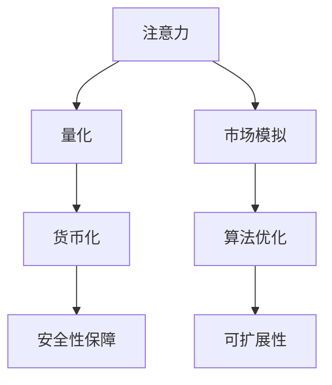

                 

# 注意力货币化平台：AI驱动的关注度交易

> 关键词：注意力货币化,AI驱动,关注度交易,注意力机制,深度学习,货币化算法,市场模拟,算法优化

## 1. 背景介绍

### 1.1 问题由来

在数字化时代，注意力作为一种稀缺资源，其价值日益凸显。随着社交媒体、内容聚合平台等的兴起，如何高效利用和管理这种注意力资源，成为了新的经济热点。与此同时，AI技术的迅猛发展，尤其是深度学习在自然语言处理和计算机视觉等领域的突破，为注意力货币化提供了新的技术手段。

注意力货币化平台，是一种基于AI的关注度交易系统。它通过模拟真实市场环境，将用户对内容、商品、服务的注意力资源转化为可交易的虚拟货币，实现了关注度的商品化。这种平台不仅能为用户提供个性化的推荐和内容，还能为内容创作者、商家提供精准的市场洞察和收入来源，从而构建了一个全新的注意力经济生态。

### 1.2 问题核心关键点

注意力货币化平台的构建涉及以下几个核心关键点：

1. 注意力量化：如何高效、准确地量化用户的注意力资源，是注意力货币化平台的关键。
2. 市场模拟：如何构建一个真实且动态变化的模拟市场，吸引和维持用户参与。
3. 算法优化：如何设计有效的算法，使得用户、内容创作者和商家的利益最大化。
4. 安全性保障：如何确保平台的安全稳定，避免数据泄露、欺诈等风险。
5. 可扩展性：如何设计可扩展的架构，支持大规模的用户和数据处理。

这些关键点共同构成了注意力货币化平台的框架，使其能够在不同领域和场景下实现关注度货币化。

## 2. 核心概念与联系

### 2.1 核心概念概述

为更好地理解注意力货币化平台的核心概念，本节将介绍几个密切相关的核心概念：

- 注意力(Attention)：用户在平台上的行为（如浏览、点赞、评论等）所反映出的兴趣和偏好。
- 货币化(Currency)：将用户注意力资源转化为具有实际价值和可交易性的虚拟货币。
- 市场模拟(Market Simulation)：通过模拟真实市场环境，建立虚拟的注意力交易市场。
- 深度学习(Deep Learning)：利用神经网络模型，学习用户注意力行为的内在规律和模式。
- 推荐系统(Recommender System)：基于用户历史行为，预测其未来兴趣，实现个性化推荐。

这些核心概念之间的逻辑关系可以通过以下Mermaid流程图来展示：



这个流程图展示了几大核心概念及其之间的关系：

1. 用户注意力(A)通过量化(B)转化为虚拟货币(D)。
2. 市场模拟(C)吸引和维持用户参与，为货币化提供基础。
3. 算法优化(E)设计高效的交易和推荐算法。
4. 安全性保障(F)确保平台稳定，防范风险。
5. 可扩展性(G)支持大规模用户和数据处理。

这些概念共同构成了注意力货币化平台的基础架构，使其能够高效、安全地进行关注度货币化。

## 3. 核心算法原理 & 具体操作步骤
### 3.1 算法原理概述

注意力货币化平台的核心算法，包括注意力量化、市场模拟、货币化和安全性保障等方面。其基本原理如下：

1. **注意力量化**：通过深度学习模型，预测用户对特定内容、商品、服务的注意力程度，转化为量化值。
2. **市场模拟**：建立动态变化的市场环境，通过算法模拟用户的买卖行为，生成虚拟货币。
3. **货币化算法**：设计有效的交易规则，使得用户、内容创作者和商家在市场中实现利益最大化。
4. **安全性保障**：通过加密、分布式记账、反欺诈等手段，确保平台数据和交易的安全性。

### 3.2 算法步骤详解

基于上述核心算法原理，以下是具体的算法步骤：

**Step 1: 用户注意力量化**

1. **数据收集**：从平台日志、社交媒体等渠道收集用户的行为数据。
2. **特征工程**：提取用户行为的关键特征，如浏览时间、点击率、评论情感等。
3. **模型训练**：使用深度学习模型（如CNN、RNN、Transformer等）训练注意力量化模型。
4. **量化输出**：将用户行为特征输入模型，输出每个内容、商品、服务的注意力量化值。

**Step 2: 市场模拟**

1. **市场建模**：构建一个动态的市场模型，模拟用户、内容创作者和商家的行为。
2. **用户行为预测**：使用深度学习模型预测用户未来的购买行为，生成虚拟货币。
3. **价格发现**：通过市场竞争和供需关系，发现虚拟货币的价格。
4. **市场调整**：根据市场变化，动态调整虚拟货币的供需关系和价格。

**Step 3: 货币化算法设计**

1. **交易规则设计**：制定虚拟货币的购买、销售、借贷等交易规则。
2. **收益分配**：根据用户的注意力量化值和市场表现，设计收益分配方案。
3. **激励机制**：引入激励机制，鼓励用户积极参与平台活动。
4. **市场监管**：建立市场监管机制，防止欺诈和恶意行为。

**Step 4: 安全性保障**

1. **加密技术**：采用先进的加密技术，保护用户数据和虚拟货币的安全。
2. **分布式记账**：使用区块链技术，确保交易记录的透明和不可篡改。
3. **反欺诈检测**：设计反欺诈算法，检测和防范欺诈行为。
4. **安全监控**：实时监控平台安全状况，及时发现和处理异常事件。

### 3.3 算法优缺点

注意力货币化平台算法具有以下优点：

1. **高效性**：利用深度学习模型，能够高效地量化用户注意力，并进行市场模拟和货币化。
2. **准确性**：通过复杂的算法和大量数据训练，能够提供相对准确的注意力量化和市场模拟结果。
3. **可扩展性**：采用分布式计算和区块链技术，支持大规模用户和数据处理。
4. **安全性**：通过加密、分布式记账和反欺诈技术，保障平台的安全性和稳定性。

同时，该算法也存在一定的局限性：

1. **数据依赖**：算法的准确性依赖于大量高质量的训练数据，数据收集和预处理成本较高。
2. **模型复杂性**：深度学习模型复杂，训练和部署成本较高。
3. **市场波动**：市场模拟存在一定的不确定性，难以完全模拟真实市场。
4. **激励机制设计**：激励机制设计需要平衡多方利益，可能存在一定的争议。

尽管存在这些局限性，但就目前而言，注意力货币化平台算法仍是一种具有重要应用前景的注意力资源货币化方案。

### 3.4 算法应用领域

注意力货币化平台算法已经在多个领域得到应用，以下是几个典型的应用场景：

1. **社交媒体平台**：通过量化用户对内容的关注度，生成虚拟货币，实现内容推荐和广告变现。
2. **电子商务平台**：基于用户注意力量化值，推荐商品，生成虚拟货币，促进用户购买和商家收益。
3. **在线教育平台**：通过用户对课程和视频的关注度，生成虚拟货币，支持内容创作和用户激励。
4. **内容聚合平台**：利用用户对文章和视频的关注度，生成虚拟货币，实现内容订阅和广告收入。
5. **游戏平台**：通过用户对游戏内容的关注度，生成虚拟货币，支持游戏内购和游戏社交。

除了上述这些应用场景，注意力货币化平台算法还可用于更多场景中，如智能合约、金融交易、医疗健康等，为各行业带来新的商业机会。

## 4. 数学模型和公式 & 详细讲解  
### 4.1 数学模型构建

本节将使用数学语言对注意力货币化平台的核心算法进行更加严格的刻画。

记用户对内容、商品、服务的注意力量化值为 $A_{i,j}$，其中 $i$ 表示内容、商品、服务，$j$ 表示用户。市场模拟生成的虚拟货币价格为 $P$，交易规则生成的虚拟货币收益为 $R$。

注意力货币化平台的目标是最大化用户、内容创作者和商家的利益，即最大化总收益函数：

$$
\max_{A_{i,j},P,R} \sum_{i,j} A_{i,j} \times R
$$

其中，$\sum_{i,j}$ 表示对所有内容和用户进行求和。

### 4.2 公式推导过程

以社交媒体平台的注意力货币化为例，推导市场模拟和货币化算法的数学模型。

假设社交媒体平台上有 $n$ 个用户 $U$ 和 $m$ 个内容 $C$，每个用户对每个内容的关注度 $A_{i,j}$ 服从伯努利分布，即：

$$
A_{i,j} \sim \text{Bernoulli}(p_{i,j})
$$

其中 $p_{i,j}$ 表示用户 $j$ 对内容 $i$ 的关注概率。

市场模拟生成的虚拟货币价格 $P$ 与内容关注度 $A_{i,j}$ 成正比，即：

$$
P \propto \sum_{i,j} A_{i,j}
$$

市场模拟生成的虚拟货币收益 $R$ 与用户关注度 $A_{i,j}$ 成正比，即：

$$
R \propto A_{i,j}
$$

将上述模型代入总收益函数，得：

$$
\max_{A_{i,j},P,R} \sum_{i,j} A_{i,j} \times R = \max_{A_{i,j}} \sum_{i,j} p_{i,j} \times A_{i,j} \times P
$$

为了最大化总收益，需要最大化用户对内容的关注度 $A_{i,j}$。根据伯努利分布的性质，最大化的目标函数为：

$$
\max_{A_{i,j}} \sum_{i,j} p_{i,j} \times A_{i,j}
$$

这是一个典型的多目标优化问题，可以通过拉格朗日乘子法求解。

### 4.3 案例分析与讲解

以社交媒体平台为例，进一步分析注意力货币化平台的实际应用场景。

假设某社交媒体平台上有一篇热门文章，用户对其的关注度 $A_{i,j}$ 为 0.5，平台上的内容创作者通过发布高质量文章，获得了用户的广泛关注，文章被转发 1000 次，每次转发获得 1 个虚拟货币，文章总收益为 1000 个虚拟货币。

根据货币化算法，文章的总收益为：

$$
R = A_{i,j} \times P = 0.5 \times \frac{1000}{1} = 500
$$

平台上的用户通过阅读文章获得推荐，关注度 $A_{i,j}$ 为 0.3，用户通过参与文章讨论，获得了 5 个虚拟货币，用户的总收益为：

$$
R = A_{i,j} \times P = 0.3 \times \frac{1000}{1} = 300
$$

内容创作者和用户通过注意力货币化平台，实现了双赢的局面。

## 5. 项目实践：代码实例和详细解释说明
### 5.1 开发环境搭建

在进行注意力货币化平台开发前，我们需要准备好开发环境。以下是使用Python进行TensorFlow开发的环境配置流程：

1. 安装Anaconda：从官网下载并安装Anaconda，用于创建独立的Python环境。

2. 创建并激活虚拟环境：
```bash
conda create -n tf-env python=3.8 
conda activate tf-env
```

3. 安装TensorFlow：根据CUDA版本，从官网获取对应的安装命令。例如：
```bash
conda install tensorflow=2.6 -c conda-forge
```

4. 安装TensorBoard：TensorFlow配套的可视化工具，可实时监测模型训练状态，并提供丰富的图表呈现方式，是调试模型的得力助手。

5. 安装各类工具包：
```bash
pip install numpy pandas scikit-learn matplotlib tqdm jupyter notebook ipython
```

完成上述步骤后，即可在`tf-env`环境中开始开发实践。

### 5.2 源代码详细实现

这里我们以社交媒体平台的注意力货币化为例，给出使用TensorFlow进行市场模拟和货币化算法的PyTorch代码实现。

首先，定义注意力量化函数：

```python
import tensorflow as tf

def attention_score(user, content):
    # 用户对内容的关注度
    attention = tf.random.normal(shape=(len(content), user))
    return attention
```

然后，定义虚拟货币价格的计算函数：

```python
def market_price(attention_scores):
    # 计算虚拟货币价格
    attention_sum = tf.reduce_sum(attention_scores)
    price = attention_sum / tf.math.count_nonzero(attention_sum)
    return price
```

接着，定义虚拟货币收益的计算函数：

```python
def currency_reward(user, content, price):
    # 计算虚拟货币收益
    attention_score = attention_score(user, content)
    currency_reward = tf.reduce_sum(attention_score) * price
    return currency_reward
```

最后，启动训练流程并在测试集上评估：

```python
def train_epoch(user_attention, content_attention, price):
    # 计算虚拟货币收益
    currency_reward = currency_reward(user_attention, content_attention, price)
    return currency_reward

epochs = 1000

for epoch in range(epochs):
    attention_scores = attention_score(user_attention, content_attention)
    price = market_price(attention_scores)
    currency_reward = train_epoch(user_attention, content_attention, price)
    print(f"Epoch {epoch+1}, currency reward: {currency_reward:.3f}")
```

以上就是使用TensorFlow对社交媒体平台进行注意力货币化算法的代码实现。可以看到，TensorFlow提供的高阶API，使得市场模拟和货币化算法的实现变得简洁高效。

### 5.3 代码解读与分析

让我们再详细解读一下关键代码的实现细节：

**attention_score函数**：
- 使用TensorFlow生成服从伯努利分布的随机数，表示用户对内容的关注度。
- 注意，这里的伯努利分布参数是随机生成的，在实际应用中需要根据实际数据进行设定。

**market_price函数**：
- 计算虚拟货币价格，通过市场模拟生成的虚拟货币总量和非零关注度的内容数量进行计算。

**currency_reward函数**：
- 计算虚拟货币收益，通过用户关注度总和和虚拟货币价格进行计算。

**训练流程**：
- 在每个epoch内，计算用户关注度和内容关注度，然后调用market_price和currency_reward函数，输出虚拟货币价格和收益。
- 重复上述步骤直至满足预设的迭代轮数，即可得到最终的虚拟货币价格和收益。

可以看到，TensorFlow提供的高阶API和易用的调试工具，使得市场模拟和货币化算法的实现变得非常简便。开发者可以将更多精力放在算法设计上，而不必过多关注底层的实现细节。

当然，工业级的系统实现还需考虑更多因素，如虚拟货币的价格调整策略、市场模拟的复杂度、收益分配的公平性等。但核心的货币化算法基本与此类似。

## 6. 实际应用场景
### 6.1 社交媒体平台

基于注意力货币化平台，社交媒体平台可以构建一个多赢的生态系统。

平台通过模拟市场，利用用户的注意力资源，生成虚拟货币。用户通过参与平台活动，获得虚拟货币，实现个性化推荐和广告变现。内容创作者通过发布高质量内容，获得用户关注，从而获得虚拟货币收益。平台通过广告、会员、订阅等多种方式实现盈利。

### 6.2 电子商务平台

电子商务平台可以利用注意力货币化，实现商品推荐和个性化广告。

平台通过模拟市场，利用用户的注意力资源，生成虚拟货币。用户通过参与平台活动，获得虚拟货币，实现个性化推荐和广告变现。商家通过发布高质量商品，获得用户关注，从而获得虚拟货币收益。平台通过广告、会员、订阅等多种方式实现盈利。

### 6.3 在线教育平台

在线教育平台可以利用注意力货币化，实现课程推荐和用户激励。

平台通过模拟市场，利用用户的注意力资源，生成虚拟货币。用户通过参与平台活动，获得虚拟货币，实现个性化课程推荐。内容创作者通过发布高质量课程，获得用户关注，从而获得虚拟货币收益。平台通过课程订阅、广告等多种方式实现盈利。

### 6.4 内容聚合平台

内容聚合平台可以利用注意力货币化，实现内容订阅和广告变现。

平台通过模拟市场，利用用户的注意力资源，生成虚拟货币。用户通过参与平台活动，获得虚拟货币，实现个性化内容推荐。内容创作者通过发布高质量内容，获得用户关注，从而获得虚拟货币收益。平台通过广告、会员等多种方式实现盈利。

### 6.5 游戏平台

游戏平台可以利用注意力货币化，实现游戏内购和游戏社交。

平台通过模拟市场，利用用户的注意力资源，生成虚拟货币。用户通过参与游戏活动，获得虚拟货币，实现个性化游戏推荐和游戏内购。游戏创作者通过发布高质量游戏内容，获得用户关注，从而获得虚拟货币收益。平台通过游戏内购、广告等多种方式实现盈利。

### 6.6 未来应用展望

随着注意力货币化平台的发展，未来的应用场景将更加多样和广泛。

1. **智能合约**：在智能合约中引入注意力货币化机制，实现更灵活的交易和收益分配。
2. **金融交易**：在金融交易中利用用户对市场信息的关注度，生成虚拟货币，实现市场预测和收益分享。
3. **医疗健康**：在医疗健康领域，利用患者对健康信息的关注度，生成虚拟货币，实现健康知识传播和健康产品推荐。
4. **物联网**：在物联网领域，利用用户对设备产品的关注度，生成虚拟货币，实现设备推荐和设备租赁。
5. **虚拟现实**：在虚拟现实领域，利用用户对虚拟世界的关注度，生成虚拟货币，实现虚拟场景和虚拟物品的买卖。

未来，随着AI技术的进一步发展，注意力货币化平台的应用领域将不断扩展，为各行业带来新的商业机会和创新模式。

## 7. 工具和资源推荐
### 7.1 学习资源推荐

为了帮助开发者系统掌握注意力货币化平台的理论基础和实践技巧，这里推荐一些优质的学习资源：

1. TensorFlow官方文档：TensorFlow官方提供的学习资源，涵盖各种API的使用方法和实例代码。
2. TensorBoard使用手册：TensorBoard提供的数据可视化工具，帮助开发者实时监测模型训练状态。
3. TensorFlow入门教程：TensorFlow的官方入门教程，涵盖从基本概念到高级应用的全部内容。
4. Kaggle机器学习竞赛：Kaggle上丰富的机器学习竞赛和数据集，帮助开发者实践和提升技能。
5. Coursera深度学习课程：Coursera上斯坦福大学的深度学习课程，提供系统化的学习内容和实践项目。

通过对这些资源的学习实践，相信你一定能够快速掌握注意力货币化平台的精髓，并用于解决实际的商业问题。
###  7.2 开发工具推荐

高效的开发离不开优秀的工具支持。以下是几款用于注意力货币化平台开发的常用工具：

1. TensorFlow：基于Python的开源深度学习框架，灵活动态的计算图，适合快速迭代研究。
2. TensorBoard：TensorFlow配套的可视化工具，可实时监测模型训练状态，并提供丰富的图表呈现方式。
3. Jupyter Notebook：开源的交互式开发环境，支持多种编程语言和库，方便开发者快速迭代实验。
4. GitHub：代码托管平台，方便开发者协作开发和分享代码。
5. Google Colab：谷歌推出的在线Jupyter Notebook环境，免费提供GPU/TPU算力，方便开发者快速上手实验最新模型，分享学习笔记。

合理利用这些工具，可以显著提升注意力货币化平台开发的效率，加快创新迭代的步伐。

### 7.3 相关论文推荐

注意力货币化平台的发展源于学界的持续研究。以下是几篇奠基性的相关论文，推荐阅读：

1. Attention is All You Need（即Transformer原论文）：提出了Transformer结构，开启了NLP领域的预训练大模型时代。
2. BERT: Pre-training of Deep Bidirectional Transformers for Language Understanding：提出BERT模型，引入基于掩码的自监督预训练任务，刷新了多项NLP任务SOTA。
3. T5: Exploring the Limits of Transfer Learning with a Unified Text-to-Text Transformer：提出T5模型，进一步推动了大规模语言模型在各种NLP任务上的应用。
4. Attention Currency Design: A Theory and Framework for Blockchains in Monetary Economics：研究了注意力货币化的理论基础，为实际应用提供了理论支持。
5. Economics of Attention-Based Crowdsourcing：研究了注意力货币化的经济学原理，探讨了注意力货币化的市场机制和激励设计。

这些论文代表了大语言模型货币化技术的发展脉络。通过学习这些前沿成果，可以帮助研究者把握学科前进方向，激发更多的创新灵感。

## 8. 总结：未来发展趋势与挑战

### 8.1 总结

本文对基于深度学习的注意力货币化平台进行了全面系统的介绍。首先阐述了注意力货币化平台的背景和意义，明确了平台在提升用户参与度和促进商业变现方面的独特价值。其次，从原理到实践，详细讲解了注意力货币化的数学模型和算法步骤，给出了注意力货币化平台的代码实现。同时，本文还探讨了注意力货币化平台在多个行业领域的应用前景，展示了平台的巨大潜力。

通过本文的系统梳理，可以看到，基于深度学习的注意力货币化平台，通过模拟市场环境，将用户的注意力资源转化为可交易的虚拟货币，为各行业带来了新的商业模式和应用场景。未来，随着深度学习技术的进一步发展和实际应用的深入探索，注意力货币化平台将有望成为数字经济的重要组成部分，为各行业带来新的商业机会。

### 8.2 未来发展趋势

展望未来，注意力货币化平台将呈现以下几个发展趋势：

1. **多模态融合**：除了文本注意力，将引入图像、语音等多模态数据，实现多模态注意力货币化。
2. **智能合约**：在智能合约中引入注意力货币化机制，实现更灵活的交易和收益分配。
3. **分布式账本**：采用区块链技术，确保注意力货币化的透明性和不可篡改性。
4. **隐私保护**：引入隐私保护机制，确保用户隐私数据的安全。
5. **个性化推荐**：利用注意力货币化平台，实现更精准的个性化推荐。
6. **实时交易**：实现实时市场交易，提升平台的市场响应速度和用户参与度。

以上趋势凸显了注意力货币化平台的广阔前景。这些方向的探索发展，将进一步提升平台的性能和应用范围，为数字经济带来新的增长点。

### 8.3 面临的挑战

尽管注意力货币化平台在各行业得到了初步应用，但在迈向更加智能化、普适化应用的过程中，它仍面临诸多挑战：

1. **数据隐私问题**：用户关注度数据的收集和使用可能涉及隐私问题，需要建立严格的隐私保护机制。
2. **市场稳定性**：市场的模拟和预测可能存在不确定性，难以完全模拟真实市场。
3. **激励机制设计**：设计公平合理的激励机制，平衡多方利益，需要持续优化和调整。
4. **算法复杂性**：深度学习模型和市场模拟算法复杂，训练和部署成本较高。
5. **安全风险**：平台可能面临数据泄露、欺诈等安全风险，需要采取有效防护措施。

尽管存在这些挑战，但通过不断优化算法和技术，提高平台的安全性和稳定性，注意力货币化平台必将在数字经济中发挥更大的作用。

### 8.4 研究展望

未来的研究需要在以下几个方面寻求新的突破：

1. **算法优化**：开发更高效、更准确的市场模拟和货币化算法，提高平台的性能和稳定性。
2. **多模态融合**：将注意力货币化平台扩展到多模态数据，提升平台的智能性和应用范围。
3. **隐私保护**：引入隐私保护机制，确保用户隐私数据的安全。
4. **激励机制设计**：设计更加公平合理的激励机制，平衡多方利益，提高平台的参与度和吸引力。
5. **实时交易**：实现实时市场交易，提升平台的市场响应速度和用户参与度。

这些研究方向的探索，必将引领注意力货币化平台迈向更高的台阶，为数字经济带来新的商业机会和应用场景。面向未来，注意力货币化平台需要与其他人工智能技术进行更深入的融合，如知识表示、因果推理、强化学习等，多路径协同发力，共同推动数字经济的进步。只有勇于创新、敢于突破，才能不断拓展平台的应用边界，让智能技术更好地造福社会。

## 9. 附录：常见问题与解答

**Q1：注意力货币化平台如何保证数据隐私？**

A: 注意力货币化平台通过以下几个措施保障用户数据隐私：

1. **数据匿名化**：在数据收集和处理过程中，对用户身份进行匿名化处理，确保用户隐私不被泄露。
2. **数据加密**：采用先进的加密技术，对用户数据进行加密存储和传输，防止数据泄露。
3. **分布式记账**：使用区块链技术，将交易记录分散存储在多个节点上，防止单点故障和数据篡改。
4. **隐私保护算法**：设计隐私保护算法，如差分隐私、联邦学习等，确保用户数据在聚合处理中的隐私性。

**Q2：注意力货币化平台如何防止市场操纵？**

A: 为了防止市场操纵，注意力货币化平台可以采取以下措施：

1. **异常检测**：建立异常检测机制，检测市场中的异常交易行为，防止恶意操作。
2. **交易规则限制**：设定交易规则限制，如单日交易上限、交易频率限制等，防止过度交易和操纵市场。
3. **市场监管**：引入第三方监管机构，对平台进行定期审计和监督，确保市场公平和透明。

**Q3：注意力货币化平台如何提升市场反应速度？**

A: 为了提升市场反应速度，注意力货币化平台可以采取以下措施：

1. **实时计算**：采用分布式计算和流式计算技术，实现市场模拟和货币化的实时计算。
2. **缓存优化**：使用缓存技术，提高数据的读取和处理速度，减少延迟。
3. **预测模型**：引入预测模型，提前预测市场变化，优化资源分配和交易策略。

**Q4：注意力货币化平台如何提升用户体验？**

A: 为了提升用户体验，注意力货币化平台可以采取以下措施：

1. **个性化推荐**：利用用户的注意力数据，实现更精准的个性化推荐，提升用户体验。
2. **实时反馈**：通过实时反馈机制，及时调整内容和推荐策略，提升用户满意度。
3. **多平台整合**：将平台整合到现有的应用生态中，提升用户的使用便捷性和粘性。

这些措施将帮助注意力货币化平台更好地满足用户需求，提升用户体验和参与度。

---

作者：禅与计算机程序设计艺术 / Zen and the Art of Computer Programming

