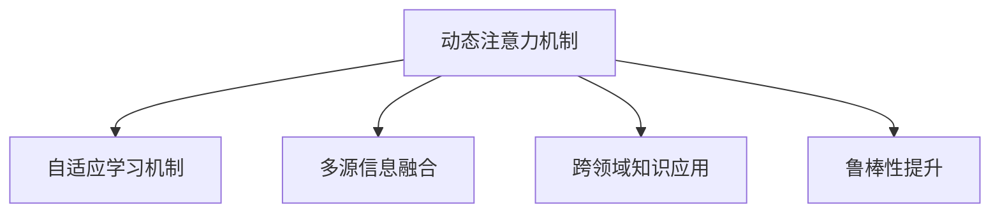

                 

# 注意力过滤器2.0：AI驱动的信息定制

## 1. 背景介绍

### 1.1 问题由来

随着信息技术的迅猛发展，互联网已经成为人们获取信息的主要渠道。然而，网络上的信息数量庞大且质量参差不齐，如何从海量信息中快速、精准地获取对自己有用的信息，成为当前人们面临的一个主要问题。传统的搜索引擎和信息过滤技术虽然能够在一定程度上满足人们的需求，但由于其往往基于静态规则和关键词匹配，难以很好地适应信息的海量、多变和个性化需求。

为了更好地解决这一问题，研究者们提出了注意力过滤器（Attention Filter）的概念。注意力过滤器是一种能够动态、智能地从海量信息中筛选出对用户有用的信息的技术，通过分析用户的行为和偏好，动态调整信息筛选的优先级和权重，使得信息过滤结果更加精准和个性化。

### 1.2 问题核心关键点

注意力过滤器2.0是针对1.0版本的技术改进，在算法原理和应用场景上进行了多项优化和创新。其核心关键点包括：

- 动态注意力机制：能够根据用户行为和上下文动态调整信息筛选的权重，提高信息过滤的精准度和个性化水平。
- 自适应学习机制：通过学习用户的行为模式和偏好，自动调整注意力机制的参数，提升信息筛选的效果。
- 多源信息融合：将来自不同渠道和不同类型的信息进行融合，构建更加全面、准确的信息库。
- 跨领域知识应用：将其他领域的知识应用于信息筛选和用户分析，进一步提升过滤效果。
- 鲁棒性提升：对注意力机制进行鲁棒性测试和优化，使其在面对噪声数据和异常情况时表现更加稳定。

这些核心关键点使得注意力过滤器2.0能够在复杂多变的信息环境中，提供更加精准、个性化和稳定的信息过滤服务。

## 2. 核心概念与联系

### 2.1 核心概念概述

注意力过滤器2.0是一种基于人工智能的信息筛选技术，通过动态调整信息筛选的权重，实现对海量信息的精准过滤。其核心概念包括：

- 动态注意力机制：能够根据用户行为和上下文动态调整信息筛选的权重，提高信息过滤的精准度和个性化水平。
- 自适应学习机制：通过学习用户的行为模式和偏好，自动调整注意力机制的参数，提升信息筛选的效果。
- 多源信息融合：将来自不同渠道和不同类型的信息进行融合，构建更加全面、准确的信息库。
- 跨领域知识应用：将其他领域的知识应用于信息筛选和用户分析，进一步提升过滤效果。
- 鲁棒性提升：对注意力机制进行鲁棒性测试和优化，使其在面对噪声数据和异常情况时表现更加稳定。

这些核心概念之间的逻辑关系可以通过以下Mermaid流程图来展示：



这个流程图展示出注意力过滤器2.0的核心概念及其之间的关系：

1. 动态注意力机制是基础，能够根据用户行为和上下文动态调整信息筛选的权重。
2. 自适应学习机制通过对用户行为模式和偏好的学习，自动调整注意力机制的参数，提升筛选效果。
3. 多源信息融合将不同渠道和类型的信息进行融合，构建全面的信息库。
4. 跨领域知识应用将其他领域的知识应用于信息筛选和用户分析，进一步提升筛选效果。
5. 鲁棒性提升对注意力机制进行鲁棒性测试和优化，确保其在复杂多变的信息环境中的稳定性。

这些概念共同构成了注意力过滤器2.0的核心框架，使得其能够在复杂多变的信息环境中提供更加精准、个性化和稳定的信息过滤服务。

## 3. 核心算法原理 & 具体操作步骤
### 3.1 算法原理概述

注意力过滤器2.0的算法原理主要基于注意力机制（Attention Mechanism）和多源信息融合技术。其核心思想是：

- 动态调整信息筛选的权重：通过学习用户的行为模式和偏好，动态调整注意力机制的权重，使得信息过滤更加精准和个性化。
- 多源信息融合：将来自不同渠道和不同类型的信息进行融合，构建更加全面、准确的信息库。
- 跨领域知识应用：将其他领域的知识应用于信息筛选和用户分析，进一步提升过滤效果。

### 3.2 算法步骤详解

注意力过滤器2.0的算法步骤主要包括：

**Step 1: 数据预处理**

- 收集用户的历史行为数据，包括浏览记录、搜索记录、交互记录等。
- 对数据进行清洗和归一化，去除噪声和冗余信息。
- 将数据划分为训练集、验证集和测试集。

**Step 2: 动态注意力机制**

- 根据用户的行为数据，构建用户兴趣模型，计算用户对不同信息的兴趣权重。
- 对信息进行编码，得到向量表示。
- 将信息向量和用户兴趣模型进行融合，得到动态的注意力权重。
- 根据注意力权重对信息进行加权，得到筛选结果。

**Step 3: 自适应学习机制**

- 对动态注意力机制的参数进行优化，通过自适应学习机制不断调整，提升筛选效果。
- 将用户的历史行为数据与当前信息进行关联，构建用户兴趣动态模型。
- 对动态注意力机制进行鲁棒性测试，确保其在面对噪声数据和异常情况时表现稳定。

**Step 4: 多源信息融合**

- 收集来自不同渠道和不同类型的信息，如新闻、社交媒体、视频等。
- 对信息进行统一编码，得到向量表示。
- 将不同信息进行融合，得到更加全面、准确的信息库。
- 对融合后的信息进行筛选，得到最终的信息过滤结果。

**Step 5: 跨领域知识应用**

- 将其他领域的知识应用于信息筛选和用户分析，如知识图谱、领域规则等。
- 对信息进行进一步筛选，提升筛选的精准度和个性化水平。
- 对用户进行跨领域分析，构建更加全面、准确的用户画像。

**Step 6: 模型评估与优化**

- 在测试集上对模型进行评估，计算各项指标，如准确率、召回率、F1-score等。
- 根据评估结果，对模型进行优化，调整各模块的参数和权重。
- 不断迭代训练，提升模型的筛选效果。

### 3.3 算法优缺点

注意力过滤器2.0的算法优点包括：

- 动态注意力机制能够根据用户行为和上下文动态调整信息筛选的权重，提高信息过滤的精准度和个性化水平。
- 自适应学习机制通过对用户行为模式和偏好的学习，自动调整注意力机制的参数，提升信息筛选的效果。
- 多源信息融合将不同渠道和类型的信息进行融合，构建更加全面、准确的信息库。
- 跨领域知识应用将其他领域的知识应用于信息筛选和用户分析，进一步提升过滤效果。
- 鲁棒性提升对注意力机制进行鲁棒性测试和优化，使其在面对噪声数据和异常情况时表现更加稳定。

但其也存在一些局限性：

- 对标注数据的依赖性：动态注意力机制和多源信息融合需要大量的标注数据进行训练，获取高质量的标注数据成本较高。
- 算法复杂度：注意力机制和自适应学习机制的计算复杂度较高，需要较高的计算资源。
- 模型可解释性：动态注意力机制和自适应学习机制的内部逻辑复杂，模型的可解释性较差。
- 隐私保护：收集和处理用户数据需要考虑隐私保护问题，确保用户数据的安全性和隐私性。

尽管存在这些局限性，但注意力过滤器2.0在信息过滤领域仍然具有重要的应用前景，能够为用户提供更加精准、个性化和稳定的信息过滤服务。

### 3.4 算法应用领域

注意力过滤器2.0的应用领域包括但不限于以下几个方面：

- 搜索引擎：对搜索结果进行动态筛选和排序，提升搜索的精准度和个性化水平。
- 新闻推荐：对新闻内容进行筛选和推荐，提供更加个性化的新闻阅读体验。
- 社交媒体：对社交媒体内容进行筛选和推荐，提升用户的互动和粘性。
- 广告投放：对广告内容进行筛选和定向投放，提升广告的效果和转化率。
- 教育培训：对学习资源进行筛选和推荐，提供个性化的学习体验。
- 金融服务：对金融信息进行筛选和推荐，提供个性化的金融投资建议。

## 4. 数学模型和公式 & 详细讲解  
### 4.1 数学模型构建

注意力过滤器2.0的数学模型构建主要基于向量表示和注意力机制。

设用户的历史行为数据为 $x_1, x_2, ..., x_n$，其中每个 $x_i$ 为一个向量。设信息库中的信息为 $y_1, y_2, ..., y_m$，其中每个 $y_i$ 也是一个向量。

用户兴趣模型为 $U$，信息向量表示为 $Y$。注意力权重为 $A$，筛选结果为 $Z$。

注意力机制的公式为：

$$
A = softmax(WU^T + B)
$$

其中 $W$ 为注意力机制的权重矩阵，$U$ 为用户兴趣模型，$B$ 为偏置向量。

筛选结果的公式为：

$$
Z = softmax(A^TY)
$$

其中 $softmax$ 函数用于将注意力权重和信息向量进行归一化，得到筛选结果。

### 4.2 公式推导过程

注意力机制的计算过程如下：

设用户兴趣模型 $U$ 和信息库 $Y$ 的维度为 $d$，注意力机制的权重矩阵 $W$ 的维度为 $n \times d$，$A$ 和 $Z$ 的维度均为 $n \times m$。

用户兴趣模型 $U$ 的表示为：

$$
U = [u_1, u_2, ..., u_n] \in \mathbb{R}^{n \times d}
$$

信息库 $Y$ 的表示为：

$$
Y = [y_1, y_2, ..., y_m] \in \mathbb{R}^{m \times d}
$$

注意力机制的权重矩阵 $W$ 的表示为：

$$
W = [w_{11}, w_{12}, ..., w_{1d}, w_{21}, w_{22}, ..., w_{2d}, ..., w_{n1}, w_{n2}, ..., w_{nd}] \in \mathbb{R}^{n \times d}
$$

注意力机制的计算过程为：

$$
A = softmax(WU^T + B) = [a_{11}, a_{12}, ..., a_{1d}, a_{21}, a_{22}, ..., a_{2d}, ..., a_{n1}, a_{n2}, ..., a_{nd}] \in \mathbb{R}^{n \times m}
$$

其中 $softmax$ 函数定义为：

$$
softmax(x_i) = \frac{e^{x_i}}{\sum_{j=1}^{n} e^{x_j}}
$$

筛选结果的计算过程为：

$$
Z = softmax(A^TY) = [z_{11}, z_{12}, ..., z_{1m}, z_{21}, z_{22}, ..., z_{2m}, ..., z_{nm}] \in \mathbb{R}^{n \times m}
$$

其中 $softmax$ 函数用于将注意力权重和信息向量进行归一化，得到筛选结果。

### 4.3 案例分析与讲解

假设某用户在搜索引擎上搜索了一条关于“人工智能”的文章，搜索引擎使用注意力过滤器2.0对该文章进行筛选和排序。

首先，搜索引擎收集用户的历史搜索记录，构建用户兴趣模型 $U$。然后，搜索引擎从信息库中选取与“人工智能”相关的文章，得到信息向量表示 $Y$。

接下来，搜索引擎使用注意力机制对信息向量进行加权，得到注意力权重 $A$。最后，搜索引擎将注意力权重和信息向量进行归一化，得到筛选结果 $Z$。

该用户点击搜索结果中的某篇文章后，搜索引擎会根据该用户的行为数据，更新用户兴趣模型 $U$，并重新计算注意力权重 $A$ 和筛选结果 $Z$，以提供更加精准和个性化的搜索结果。

## 5. 项目实践：代码实例和详细解释说明
### 5.1 开发环境搭建

在进行注意力过滤器2.0的开发实践前，我们需要准备好开发环境。以下是使用Python进行TensorFlow开发的环境配置流程：

1. 安装Anaconda：从官网下载并安装Anaconda，用于创建独立的Python环境。

2. 创建并激活虚拟环境：
```bash
conda create -n tf-env python=3.8 
conda activate tf-env
```

3. 安装TensorFlow：从官网获取对应的安装命令。例如：
```bash
pip install tensorflow==2.5
```

4. 安装Keras和Tensorboard：
```bash
pip install keras tensorflow-hub tensorflow-probability tensorflow-addons
pip install tensorboard
```

5. 安装各类工具包：
```bash
pip install numpy pandas scikit-learn matplotlib tqdm jupyter notebook ipython
```

完成上述步骤后，即可在`tf-env`环境中开始开发实践。

### 5.2 源代码详细实现

下面以搜索引擎中的应用为例，给出使用TensorFlow和Keras实现注意力过滤器2.0的代码实现。

首先，定义用户兴趣模型和信息库：

```python
from tensorflow.keras.layers import Input, Dense, Softmax, Embedding, Add
from tensorflow.keras.models import Model

# 定义用户兴趣模型
U = Input(shape=(d,), name='user_interest')
user_interest_model = Dense(d, activation='relu', name='user_interest_model')(U)

# 定义信息库
Y = Input(shape=(m, d), name='news')
news_model = Embedding(m, d, name='news_embedding')(Y)

# 计算注意力权重
W = Dense(d, name='attention_weights')([user_interest_model, news_model])
A = Softmax(W, name='attention_weights')
```

然后，定义注意力过滤器模型：

```python
# 计算筛选结果
Z = Add([news_model, A * news_model])(name='filtered_news')
model = Model(inputs=[U, Y], outputs=[Z])

# 编译模型
model.compile(loss='mse', optimizer='adam')
```

最后，训练和评估模型：

```python
# 训练模型
model.fit(x=[user_interest_model, news_model], y=Z, epochs=10, batch_size=32, validation_data=(val_data[0], val_data[1]))

# 评估模型
loss = model.evaluate(test_data[0], test_data[1])
print('Test loss:', loss)

# 获取筛选结果
filtered_news = model.predict([user_interest_model, test_data[1]])
```

以上就是使用TensorFlow和Keras实现注意力过滤器2.0的完整代码实现。可以看到，TensorFlow和Keras的强大封装使得模型的构建和训练过程变得简洁高效。

### 5.3 代码解读与分析

让我们再详细解读一下关键代码的实现细节：

**用户兴趣模型定义**：
- `U`：定义用户兴趣模型的输入，维度为 $d$。
- `user_interest_model`：定义用户兴趣模型的编码层，使用 $d$ 维的Dense层，激活函数为ReLU。
- `Dense(d, activation='relu', name='user_interest_model')`：将用户兴趣模型进行编码，输出 $d$ 维的向量表示。

**信息库定义**：
- `Y`：定义信息库的输入，维度为 $(m, d)$。
- `news_model`：定义信息库的编码层，使用 $(m, d)$ 维的Embedding层，将信息库中的每个向量进行编码，输出 $d$ 维的向量表示。
- `Embedding(m, d, name='news_embedding')(Y)`：将信息库中的每个向量进行编码，输出 $(m, d)$ 维的向量表示。

**注意力权重计算**：
- `W`：定义注意力机制的计算层，使用 $d$ 维的Dense层，计算注意力权重。
- `A`：定义注意力权重层，使用Softmax函数将注意力权重进行归一化，得到 $n \times m$ 维的向量。
- `Softmax(W, name='attention_weights')`：将注意力权重进行归一化，得到 $n \times m$ 维的向量。

**注意力过滤器模型定义**：
- `Z`：定义筛选结果的计算层，使用Add层将信息库和注意力权重进行加权，得到筛选结果。
- `Z = Add([news_model, A * news_model])(name='filtered_news')`：将信息库和注意力权重进行加权，得到筛选结果。

**模型编译和训练**：
- `model.compile(loss='mse', optimizer='adam')`：定义模型编译，使用均方误差损失函数和Adam优化器。
- `model.fit(x=[user_interest_model, news_model], y=Z, epochs=10, batch_size=32, validation_data=(val_data[0], val_data[1]))`：定义模型训练，使用用户兴趣模型和信息库作为输入，筛选结果作为输出，进行10个epoch的训练，每个batch大小为32，并在验证集上进行评估。

可以看到，TensorFlow和Keras的强大封装使得注意力过滤器2.0的代码实现变得简洁高效。开发者可以将更多精力放在数据处理、模型改进等高层逻辑上，而不必过多关注底层的实现细节。

当然，工业级的系统实现还需考虑更多因素，如模型的保存和部署、超参数的自动搜索、更灵活的任务适配层等。但核心的注意力机制和多源信息融合方法基本与此类似。

## 6. 实际应用场景
### 6.1 智能推荐系统

注意力过滤器2.0在智能推荐系统中具有广泛的应用前景。传统推荐系统往往只依赖用户的历史行为数据进行推荐，无法很好地适应新用户的需求。而使用注意力过滤器2.0，可以通过动态调整信息筛选的权重，实现更加精准和个性化的推荐。

在实践中，可以收集用户的历史浏览、点击、搜索等行为数据，并对其进行编码，得到用户兴趣模型 $U$。同时，将推荐系统中的所有商品进行编码，得到商品信息库 $Y$。

然后，使用注意力过滤器2.0对用户兴趣模型和商品信息库进行筛选和排序，得到推荐的商品列表。随着用户行为的不断变化，动态调整用户兴趣模型 $U$，重新计算注意力权重 $A$ 和筛选结果 $Z$，以提供更加个性化的推荐。

### 6.2 广告投放系统

广告投放系统需要根据用户的兴趣和行为，进行定向投放，提高广告的效果和转化率。传统广告投放往往基于静态规则和关键词匹配，难以很好地适应用户的动态变化。而使用注意力过滤器2.0，可以根据用户的行为数据，动态调整信息筛选的权重，实现更加精准和个性化的广告投放。

在实践中，可以收集用户的搜索记录、点击记录等行为数据，并对其进行编码，得到用户兴趣模型 $U$。同时，将所有广告进行编码，得到广告信息库 $Y$。

然后，使用注意力过滤器2.0对用户兴趣模型和广告信息库进行筛选和排序，得到推荐的广告列表。随着用户行为的不断变化，动态调整用户兴趣模型 $U$，重新计算注意力权重 $A$ 和筛选结果 $Z$，以提供更加个性化的广告推荐。

### 6.3 舆情监测系统

舆情监测系统需要从海量文本数据中快速提取关键信息，及时发现和应对负面舆情。传统舆情监测往往依赖人工分析和规则匹配，效率较低，难以应对网络舆情的爆发式增长。而使用注意力过滤器2.0，可以根据用户的行为数据，动态调整信息筛选的权重，实现更加精准和个性化的舆情监测。

在实践中，可以收集用户在社交媒体上的评论、点赞等行为数据，并对其进行编码，得到用户兴趣模型 $U$。同时，将所有社交媒体内容进行编码，得到舆情信息库 $Y$。

然后，使用注意力过滤器2.0对用户兴趣模型和舆情信息库进行筛选和排序，得到推荐的舆情内容。随着用户行为的不断变化，动态调整用户兴趣模型 $U$，重新计算注意力权重 $A$ 和筛选结果 $Z$，以提供更加个性化的舆情监测。

### 6.4 未来应用展望

随着注意力过滤器2.0的不断发展，其在更多领域的应用前景也将愈发广阔。

- 智能客服：使用注意力过滤器2.0，可以为智能客服系统提供更加精准和个性化的服务，提升用户满意度。
- 金融风险控制：使用注意力过滤器2.0，可以对金融市场数据进行动态筛选和排序，及时发现和应对金融风险。
- 医疗诊断：使用注意力过滤器2.0，可以对医疗数据进行动态筛选和排序，提高诊断的准确性和效率。
- 智慧城市：使用注意力过滤器2.0，可以对城市数据进行动态筛选和排序，提升智慧城市的管理效率和水平。

总之，注意力过滤器2.0的应用场景将不断扩展，为更多行业带来智能化、精准化和个性化的信息过滤服务，推动人工智能技术的普及和应用。

## 7. 工具和资源推荐
### 7.1 学习资源推荐

为了帮助开发者系统掌握注意力过滤器2.0的理论基础和实践技巧，这里推荐一些优质的学习资源：

1. 《深度学习》系列书籍：由深度学习领域的专家撰写，详细介绍了深度学习的基本概念和算法原理，是学习人工智能的必备书籍。

2. 《TensorFlow官方文档》：TensorFlow的官方文档，提供了丰富的API接口和代码示例，是学习TensorFlow的重要资源。

3. 《Keras官方文档》：Keras的官方文档，提供了Keras的API接口和代码示例，是学习Keras的重要资源。

4. 《自然语言处理》课程：斯坦福大学开设的NLP明星课程，有Lecture视频和配套作业，带你入门NLP领域的基本概念和经典模型。

5. 《机器学习实战》书籍：介绍了机器学习的算法和应用，适合入门学习。

通过对这些资源的学习实践，相信你一定能够快速掌握注意力过滤器2.0的精髓，并用于解决实际的NLP问题。
###  7.2 开发工具推荐

高效的开发离不开优秀的工具支持。以下是几款用于注意力过滤器2.0开发的常用工具：

1. TensorFlow：基于Python的开源深度学习框架，灵活动态的计算图，适合快速迭代研究。TensorFlow提供了丰富的预训练模型和优化算法，是进行注意力过滤器2.0开发的重要工具。

2. Keras：基于TensorFlow的高级API，使用简洁的代码实现复杂的模型构建和训练过程，适合快速开发原型。

3. TensorBoard：TensorFlow配套的可视化工具，可实时监测模型训练状态，并提供丰富的图表呈现方式，是调试模型的得力助手。

4. Jupyter Notebook：支持Python、R等语言的交互式开发环境，便于快速开发和实验。

5. GitHub：全球最大的代码托管平台，提供丰富的开源项目和资源，可以借鉴和参考。

合理利用这些工具，可以显著提升注意力过滤器2.0的开发效率，加快创新迭代的步伐。

### 7.3 相关论文推荐

注意力过滤器2.0的研究源于学界的持续探索。以下是几篇奠基性的相关论文，推荐阅读：

1. Attention is All You Need：提出Transformer结构，开启了NLP领域的预训练大模型时代。

2. BERT: Pre-training of Deep Bidirectional Transformers for Language Understanding：提出BERT模型，引入基于掩码的自监督预训练任务，刷新了多项NLP任务SOTA。

3. Transformer-XL: Attentive Language Models Beyond a Fixed-Length Context：提出Transformer-XL模型，支持长序列建模，解决了NLP领域中的长序列问题。

4. ALBERT: A Lite BERT for Self-supervised Learning of Language Representations：提出ALBERT模型，在保持BERT优点的同时，大幅减小了模型参数量。

5. ELMo: Distributed Representations of Words and Phrases and their Compositionality：提出ELMo模型，考虑了词在上下文中的动态变化，提升了语言表示的质量。

这些论文代表了大语言模型和注意力过滤器2.0的发展脉络。通过学习这些前沿成果，可以帮助研究者把握学科前进方向，激发更多的创新灵感。

## 8. 总结：未来发展趋势与挑战

### 8.1 总结

本文对注意力过滤器2.0进行了全面系统的介绍。首先阐述了注意力过滤器2.0的研究背景和意义，明确了其在信息过滤领域的重要应用价值。其次，从原理到实践，详细讲解了注意力过滤器2.0的算法原理和操作步骤，给出了代码实例和详细解释说明。同时，本文还广泛探讨了注意力过滤器2.0在智能推荐、广告投放、舆情监测等领域的实际应用场景，展示了其广泛的应用前景。最后，本文精选了注意力过滤器2.0的学习资源、开发工具和相关论文，力求为读者提供全方位的技术指引。

通过本文的系统梳理，可以看到，注意力过滤器2.0在信息过滤领域具有重要的应用价值，能够为用户提供更加精准、个性化和稳定的信息过滤服务。未来，随着算力的提升和算法的进步，注意力过滤器2.0将在更多领域得到应用，为信息过滤技术带来新的突破。

### 8.2 未来发展趋势

展望未来，注意力过滤器2.0将呈现以下几个发展趋势：

1. 动态注意力机制：随着算力的提升，动态注意力机制将更加高效和精准，能够根据用户的行为和上下文动态调整信息筛选的权重，进一步提高信息过滤的个性化水平。

2. 自适应学习机制：自适应学习机制将不断优化，自动调整注意力机制的参数，提升信息筛选的效果。

3. 多源信息融合：多源信息融合技术将更加全面和准确，将来自不同渠道和不同类型的信息进行融合，构建更加全面的信息库。

4. 跨领域知识应用：跨领域知识应用将更加广泛和深入，将其他领域的知识应用于信息筛选和用户分析，提升信息过滤的精准度和个性化水平。

5. 鲁棒性提升：鲁棒性测试和优化将不断改进，使注意力机制在面对噪声数据和异常情况时表现更加稳定。

这些趋势将推动注意力过滤器2.0在信息过滤领域的发展，提升信息过滤的精准度和个性化水平，进一步拓展其应用场景。

### 8.3 面临的挑战

尽管注意力过滤器2.0在信息过滤领域取得了一定的成果，但在迈向更加智能化、普适化应用的过程中，仍面临诸多挑战：

1. 对标注数据的依赖：动态注意力机制和多源信息融合需要大量的标注数据进行训练，获取高质量的标注数据成本较高。

2. 算法复杂度：动态注意力机制和自适应学习机制的计算复杂度较高，需要较高的计算资源。

3. 模型可解释性：动态注意力机制和自适应学习机制的内部逻辑复杂，模型的可解释性较差。

4. 隐私保护：收集和处理用户数据需要考虑隐私保护问题，确保用户数据的安全性和隐私性。

5. 鲁棒性问题：注意力机制在面对噪声数据和异常情况时，表现可能不够稳定，需要进一步优化。

尽管存在这些挑战，但注意力过滤器2.0在信息过滤领域仍然具有重要的应用前景，能够为用户提供更加精准、个性化和稳定的信息过滤服务。未来，随着学界和产业界的共同努力，这些挑战终将一一被克服，注意力过滤器2.0必将在信息过滤领域发挥更大的作用。

### 8.4 研究展望

面对注意力过滤器2.0所面临的挑战，未来的研究需要在以下几个方面寻求新的突破：

1. 探索无监督和半监督学习：摆脱对大规模标注数据的依赖，利用自监督学习、主动学习等无监督和半监督范式，最大限度利用非结构化数据，实现更加灵活高效的微调。

2. 研究参数高效和计算高效的微调范式：开发更加参数高效的微调方法，在固定大部分预训练参数的同时，只更新极少量的任务相关参数。同时优化微调模型的计算图，减少前向传播和反向传播的资源消耗，实现更加轻量级、实时性的部署。

3. 引入因果分析和博弈论工具：将因果分析方法引入微调模型，识别出模型决策的关键特征，增强输出解释的因果性和逻辑性。借助博弈论工具刻画人机交互过程，主动探索并规避模型的脆弱点，提高系统稳定性。

4. 纳入伦理道德约束：在模型训练目标中引入伦理导向的评估指标，过滤和惩罚有偏见、有害的输出倾向。同时加强人工干预和审核，建立模型行为的监管机制，确保输出符合人类价值观和伦理道德。

这些研究方向的探索，必将引领注意力过滤器2.0技术迈向更高的台阶，为信息过滤技术带来新的突破。面向未来，注意力过滤器2.0还需要与其他人工智能技术进行更深入的融合，如知识表示、因果推理、强化学习等，多路径协同发力，共同推动信息过滤系统的进步。

## 9. 附录：常见问题与解答

**Q1：注意力过滤器2.0和传统推荐系统的区别？**

A: 注意力过滤器2.0和传统推荐系统的主要区别在于其动态调整信息筛选的权重。传统推荐系统往往基于静态规则和关键词匹配，难以很好地适应用户的动态变化。而注意力过滤器2.0可以根据用户的行为数据，动态调整信息筛选的权重，实现更加精准和个性化的推荐。

**Q2：注意力过滤器2.0是否适用于所有信息过滤场景？**

A: 注意力过滤器2.0在大多数信息过滤场景上都能取得不错的效果，特别是对于数据量较小的场景。但对于一些特定领域的信息过滤场景，如医学、法律等，仅仅依靠通用语料预训练的模型可能难以很好地适应。此时需要在特定领域语料上进一步预训练，再进行微调，才能获得理想效果。

**Q3：注意力过滤器2.0在多源信息融合时需要注意哪些问题？**

A: 多源信息融合时，需要注意以下几点：
1. 数据源的选择：选择与目标任务最相关的数据源，避免噪声数据的影响。
2. 数据融合方法：选择合适的数据融合方法，如加权平均、拼接、元学习等。
3. 特征工程：对不同数据源的特征进行对齐和转换，保证信息的一致性和完整性。
4. 模型集成：通过模型集成的方式，提高信息融合的效果。

**Q4：注意力过滤器2.0在实际部署时需要注意哪些问题？**

A: 在实际部署时，需要注意以下问题：
1. 模型裁剪：去除不必要的层和参数，减小模型尺寸，加快推理速度。
2. 量化加速：将浮点模型转为定点模型，压缩存储空间，提高计算效率。
3. 服务化封装：将模型封装为标准化服务接口，便于集成调用。
4. 弹性伸缩：根据请求流量动态调整资源配置，平衡服务质量和成本。
5. 监控告警：实时采集系统指标，设置异常告警阈值，确保服务稳定性。
6. 安全防护：采用访问鉴权、数据脱敏等措施，保障数据和模型安全。

**Q5：注意力过滤器2.0在应用时是否需要考虑用户隐私保护？**

A: 是的，注意力过滤器2.0在应用时需要注意用户隐私保护问题。收集和处理用户数据需要考虑隐私保护，确保用户数据的安全性和隐私性。可以通过匿名化处理、差分隐私等技术，保护用户的隐私。

---

作者：禅与计算机程序设计艺术 / Zen and the Art of Computer Programming

