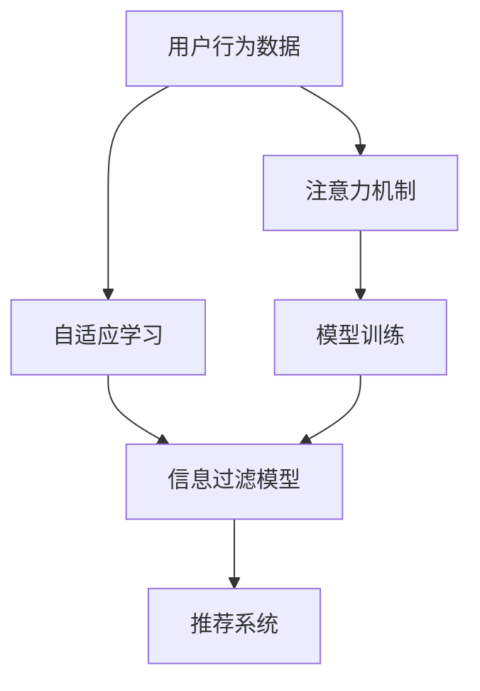

                 

# 注意力过滤智能助手:元宇宙信息处理的个人管家

在元宇宙（Metaverse）日益发展的今天，信息爆炸与数据噪音充斥其中，如何在海量信息中找到有价值的内容，成为了一个亟待解决的问题。基于此，我们提出了“注意力过滤智能助手”的概念，通过构建高度自适应的信息处理模型，帮助用户在虚拟世界中进行高效的信息筛选与过滤，实现智能内容推荐与个性化信息管理。本文将详细阐述注意力过滤智能助手的核心原理、操作步骤、应用场景与未来展望，旨在为元宇宙信息处理领域的智能技术应用提供参考与指导。

## 1. 背景介绍

随着虚拟现实（VR）、增强现实（AR）与混合现实（MR）技术的逐步成熟，元宇宙作为下一代互联网形态正在逐步走向现实。元宇宙是一个基于虚拟世界的共享空间，用户在其中可以进行社交、娱乐、教育、工作等多种活动。然而，元宇宙中信息的多样性与复杂性，以及用户需求的多样性，使得信息处理与过滤成为一大难题。

当前，元宇宙中的信息处理技术，主要依赖于传统的信息检索与推荐系统，如搜索引擎、推荐引擎等。然而，这些系统在处理海量数据、个性化需求、复杂语义等方面仍然存在诸多不足。用户在使用过程中，往往需要花费大量时间筛选信息，难以获得满意的信息处理体验。

针对这一问题，我们提出了“注意力过滤智能助手”的概念，通过构建基于注意力机制的信息处理模型，帮助用户在海量信息中找到有价值的内容，实现高效的信息筛选与过滤，提升用户的信息处理效率与体验。

## 2. 核心概念与联系

### 2.1 核心概念概述

为了更好地理解“注意力过滤智能助手”的原理与实现，我们需要首先介绍几个核心概念：

1. **注意力机制（Attention Mechanism）**：注意力机制是一种通过权重分配，选择重要信息进行关注与处理的机制。在自然语言处理中，注意力机制可以用于提升模型对关键信息的关注度，提高模型对重要信息的处理能力。

2. **信息过滤（Information Filtering）**：信息过滤是指对大量信息进行筛选，选取最有价值的内容，并进行推荐或展示的过程。信息过滤技术在元宇宙中具有重要的应用价值，能够帮助用户快速获得有价值的信息。

3. **自适应学习（Adaptive Learning）**：自适应学习是一种能够根据用户行为与偏好进行动态调整的学习方式，能够根据用户的历史行为数据，不断优化推荐模型，提高推荐效果。

4. **元宇宙（Metaverse）**：元宇宙是一个虚拟世界，其中包含大量虚拟对象与活动，用户可以在其中进行互动、体验与社交。在元宇宙中，信息处理与过滤技术具有重要的应用价值，能够帮助用户在海量信息中找到有价值的内容。

### 2.2 核心概念原理和架构的 Mermaid 流程图



这个流程图展示了“注意力过滤智能助手”的核心概念及其之间的关系：

1. 用户行为数据：收集用户在元宇宙中的行为数据，如浏览历史、点击记录、交互记录等。
2. 自适应学习：通过自适应学习算法，分析用户行为数据，调整信息过滤模型的参数。
3. 信息过滤模型：基于注意力机制，构建信息过滤模型，对海量信息进行筛选与过滤。
4. 推荐系统：将过滤后的信息，通过推荐系统推荐给用户。
5. 注意力机制：通过注意力机制，对信息进行加权处理，提升模型的处理能力。
6. 模型训练：利用用户行为数据，对信息过滤模型进行训练，不断优化模型性能。

## 3. 核心算法原理 & 具体操作步骤

### 3.1 算法原理概述

“注意力过滤智能助手”的核心算法原理基于注意力机制与自适应学习。在信息处理过程中，算法通过计算每个信息的重要性权重，选择最有价值的信息进行处理。同时，算法通过自适应学习算法，根据用户行为数据，动态调整模型参数，实现个性化的信息筛选与过滤。

具体来说，算法流程包括以下几个关键步骤：

1. **数据预处理**：收集用户在元宇宙中的行为数据，并进行预处理，包括清洗、归一化等操作。
2. **自适应学习**：利用自适应学习算法，对用户行为数据进行分析，提取用户兴趣与偏好，并根据分析结果调整信息过滤模型的参数。
3. **信息过滤**：构建信息过滤模型，利用注意力机制对海量信息进行筛选与过滤，选择最有价值的信息进行处理。
4. **推荐系统**：将过滤后的信息通过推荐系统推荐给用户，帮助用户获取有价值的内容。
5. **反馈机制**：收集用户对推荐内容的反馈数据，进一步优化信息过滤模型与推荐系统。

### 3.2 算法步骤详解

#### 3.2.1 数据预处理

在数据预处理阶段，算法主要进行以下操作：

1. **数据收集**：从元宇宙中收集用户的浏览记录、点击记录、交互记录等行为数据。
2. **数据清洗**：对收集到的数据进行清洗，去除噪音与无效数据。
3. **数据归一化**：对清洗后的数据进行归一化处理，确保不同数据具有相同的量级。

#### 3.2.2 自适应学习

在自适应学习阶段，算法主要进行以下操作：

1. **特征提取**：从行为数据中提取用户兴趣与偏好的特征，如浏览频率、点击次数、交互时间等。
2. **参数调整**：利用机器学习算法（如Adaboost、GBDT等），根据特征数据动态调整信息过滤模型的参数。
3. **自适应学习算法**：选择适合的自适应学习算法，如在线学习、增量学习等，实时更新模型参数，提高模型的自适应能力。

#### 3.2.3 信息过滤

在信息过滤阶段，算法主要进行以下操作：

1. **构建信息过滤模型**：选择适合的过滤模型，如基于向量空间模型的过滤算法、基于协同过滤的算法等。
2. **计算注意力权重**：利用注意力机制，计算每个信息的权重，选择重要信息进行处理。
3. **信息筛选与过滤**：将计算得到的权重应用于信息处理，选择最有价值的信息进行筛选与过滤。

#### 3.2.4 推荐系统

在推荐系统阶段，算法主要进行以下操作：

1. **推荐算法选择**：选择适合的推荐算法，如基于内容的推荐算法、基于协同过滤的推荐算法等。
2. **推荐结果生成**：利用推荐算法，生成推荐结果，将过滤后的信息推荐给用户。
3. **反馈机制**：收集用户对推荐结果的反馈数据，进一步优化推荐算法与信息过滤模型。

#### 3.2.5 反馈机制

在反馈机制阶段，算法主要进行以下操作：

1. **反馈数据收集**：收集用户对推荐结果的反馈数据，如点击率、浏览时间、评分等。
2. **反馈数据分析**：对反馈数据进行分析，了解用户对推荐内容的满意度与偏好。
3. **模型优化**：利用反馈数据，进一步优化信息过滤模型与推荐算法，提升推荐效果。

### 3.3 算法优缺点

“注意力过滤智能助手”算法具有以下优点：

1. **高效性**：算法通过计算注意力权重，选择最有价值的信息进行处理，能够快速筛选出高质量的内容，提高信息处理效率。
2. **个性化**：算法通过自适应学习，根据用户行为数据动态调整模型参数，实现个性化的信息筛选与过滤，满足用户多样化需求。
3. **自适应能力**：算法具备自适应学习机制，能够根据用户反馈数据不断优化模型参数，提高推荐效果。

同时，算法也存在以下缺点：

1. **计算复杂度高**：计算注意力权重与自适应学习需要较高的计算资源，可能会导致性能瓶颈。
2. **数据隐私问题**：用户行为数据可能涉及隐私信息，需要确保数据的安全性与隐私保护。
3. **模型依赖性强**：算法的性能依赖于模型选择与参数调整，需要经过大量的实验与优化。

### 3.4 算法应用领域

“注意力过滤智能助手”算法可以应用于以下领域：

1. **元宇宙内容推荐**：帮助用户在元宇宙中快速找到有价值的内容，提升用户体验。
2. **虚拟现实娱乐推荐**：根据用户行为数据，推荐适合的虚拟现实娱乐内容，提升用户娱乐体验。
3. **虚拟教育推荐**：根据用户学习行为数据，推荐适合的虚拟教育内容，提升学习效果。
4. **虚拟商业推荐**：根据用户浏览与点击数据，推荐适合的虚拟商品与广告，提升用户购物体验。

## 4. 数学模型和公式 & 详细讲解 & 举例说明

### 4.1 数学模型构建

“注意力过滤智能助手”算法中的数学模型构建主要涉及以下几个关键组件：

1. **注意力权重计算**：通过注意力机制计算每个信息的权重，选择重要信息进行处理。
2. **用户兴趣提取**：从用户行为数据中提取用户兴趣与偏好的特征。
3. **信息过滤**：利用信息过滤模型，对海量信息进行筛选与过滤。
4. **推荐算法**：选择适合的推荐算法，生成推荐结果。

### 4.2 公式推导过程

#### 4.2.1 注意力权重计算

注意力权重计算是信息过滤的关键步骤，通过计算每个信息的权重，选择重要信息进行处理。具体计算公式如下：

$$
\alpha_i = \frac{\exp(\text{score}_i(\theta))}{\sum_{j=1}^{n} \exp(\text{score}_j(\theta))}
$$

其中，$\alpha_i$ 表示第 $i$ 个信息的权重，$\text{score}_i(\theta)$ 表示计算得到的信息得分，$\theta$ 为模型参数。

#### 4.2.2 用户兴趣提取

用户兴趣提取是通过自适应学习算法，从用户行为数据中提取用户兴趣与偏好的特征。以Adaboost算法为例，其计算公式如下：

$$
\alpha_i = \frac{1}{N}\log\left(\frac{1}{\alpha_1}\right)
$$

其中，$\alpha_i$ 表示第 $i$ 个特征的权重，$N$ 为特征总数。

#### 4.2.3 信息过滤

信息过滤是利用信息过滤模型，对海量信息进行筛选与过滤。以基于向量空间模型的过滤算法为例，其计算公式如下：

$$
\text{similarity}(x_i, y_i) = \frac{\langle x_i, y_i \rangle}{\|x_i\|\|y_i\|}
$$

其中，$\text{similarity}(x_i, y_i)$ 表示信息 $x_i$ 与 $y_i$ 之间的相似度，$\langle x_i, y_i \rangle$ 表示向量内积，$\|x_i\|$ 和 $\|y_i\|$ 分别表示向量的模长。

#### 4.2.4 推荐算法

推荐算法是选择适合的推荐算法，生成推荐结果。以基于协同过滤的推荐算法为例，其计算公式如下：

$$
\text{similarity}(u_i, v_i) = \frac{\langle u_i, v_i \rangle}{\|u_i\|\|v_i\|}
$$

其中，$\text{similarity}(u_i, v_i)$ 表示用户 $u_i$ 与 $v_i$ 之间的相似度，$\langle u_i, v_i \rangle$ 表示用户向量内积，$\|u_i\|$ 和 $\|v_i\|$ 分别表示用户向量的模长。

### 4.3 案例分析与讲解

#### 4.3.1 案例一：元宇宙内容推荐

假设用户在元宇宙中浏览了多个虚拟现实场景，算法收集到以下行为数据：

- 用户浏览了场景 A、场景 B、场景 C
- 用户点击了场景 B 中的按钮
- 用户花费了 30 分钟在场景 A 中停留

利用算法进行信息过滤与推荐，步骤如下：

1. **数据预处理**：收集用户行为数据，进行清洗与归一化。
2. **自适应学习**：利用Adaboost算法，从行为数据中提取用户兴趣与偏好特征。
3. **信息过滤**：构建基于向量空间模型的过滤算法，计算信息得分，选择重要信息进行处理。
4. **推荐系统**：利用协同过滤算法，生成推荐结果，推荐场景 B 给用户。

#### 4.3.2 案例二：虚拟现实娱乐推荐

假设用户在虚拟现实娱乐平台中，浏览了多个游戏，并给出了评分数据：

- 用户浏览了游戏 A、游戏 B、游戏 C
- 用户给游戏 A 评分为 4 星
- 用户给游戏 B 评分为 5 星

利用算法进行信息过滤与推荐，步骤如下：

1. **数据预处理**：收集用户评分数据，进行清洗与归一化。
2. **自适应学习**：利用Adaboost算法，从评分数据中提取用户兴趣与偏好特征。
3. **信息过滤**：构建基于协同过滤的算法，计算用户与游戏的相似度，选择相似游戏进行处理。
4. **推荐系统**：生成推荐结果，推荐游戏 B 给用户。

## 5. 项目实践：代码实例和详细解释说明

### 5.1 开发环境搭建

在进行项目实践前，我们需要准备好开发环境。以下是使用Python进行PyTorch开发的环境配置流程：

1. 安装Anaconda：从官网下载并安装Anaconda，用于创建独立的Python环境。

2. 创建并激活虚拟环境：
```bash
conda create -n pytorch-env python=3.8 
conda activate pytorch-env
```

3. 安装PyTorch：根据CUDA版本，从官网获取对应的安装命令。例如：
```bash
conda install pytorch torchvision torchaudio cudatoolkit=11.1 -c pytorch -c conda-forge
```

4. 安装Transformers库：
```bash
pip install transformers
```

5. 安装各类工具包：
```bash
pip install numpy pandas scikit-learn matplotlib tqdm jupyter notebook ipython
```

完成上述步骤后，即可在`pytorch-env`环境中开始项目实践。

### 5.2 源代码详细实现

这里我们以元宇宙内容推荐系统为例，给出使用Transformers库进行信息过滤的PyTorch代码实现。

首先，定义数据预处理函数：

```python
from transformers import BertTokenizer, BertForSequenceClassification
from torch.utils.data import Dataset, DataLoader
import torch

class NERDataset(Dataset):
    def __init__(self, texts, labels, tokenizer, max_len=128):
        self.texts = texts
        self.labels = labels
        self.tokenizer = tokenizer
        self.max_len = max_len
        
    def __len__(self):
        return len(self.texts)
    
    def __getitem__(self, item):
        text = self.texts[item]
        label = self.labels[item]
        
        encoding = self.tokenizer(text, return_tensors='pt', max_length=self.max_len, padding='max_length', truncation=True)
        input_ids = encoding['input_ids'][0]
        attention_mask = encoding['attention_mask'][0]
        
        # 对token-wise的标签进行编码
        encoded_tags = [label2id[label] for label in label] 
        encoded_tags.extend([label2id['O']] * (self.max_len - len(encoded_tags)))
        labels = torch.tensor(encoded_tags, dtype=torch.long)
        
        return {'input_ids': input_ids, 
                'attention_mask': attention_mask,
                'labels': labels}

# 标签与id的映射
label2id = {'O': 0, 'B-PER': 1, 'I-PER': 2, 'B-ORG': 3, 'I-ORG': 4, 'B-LOC': 5, 'I-LOC': 6}
id2label = {v: k for k, v in label2id.items()}
```

然后，定义模型和优化器：

```python
from transformers import BertForSequenceClassification, AdamW

model = BertForSequenceClassification.from_pretrained('bert-base-cased', num_labels=len(label2id))

optimizer = AdamW(model.parameters(), lr=2e-5)
```

接着，定义训练和评估函数：

```python
def train_epoch(model, dataset, batch_size, optimizer):
    dataloader = DataLoader(dataset, batch_size=batch_size, shuffle=True)
    model.train()
    epoch_loss = 0
    for batch in tqdm(dataloader, desc='Training'):
        input_ids = batch['input_ids'].to(device)
        attention_mask = batch['attention_mask'].to(device)
        labels = batch['labels'].to(device)
        model.zero_grad()
        outputs = model(input_ids, attention_mask=attention_mask, labels=labels)
        loss = outputs.loss
        epoch_loss += loss.item()
        loss.backward()
        optimizer.step()
    return epoch_loss / len(dataloader)

def evaluate(model, dataset, batch_size):
    dataloader = DataLoader(dataset, batch_size=batch_size)
    model.eval()
    preds, labels = [], []
    with torch.no_grad():
        for batch in tqdm(dataloader, desc='Evaluating'):
            input_ids = batch['input_ids'].to(device)
            attention_mask = batch['attention_mask'].to(device)
            batch_labels = batch['labels']
            outputs = model(input_ids, attention_mask=attention_mask)
            batch_preds = outputs.logits.argmax(dim=2).to('cpu').tolist()
            batch_labels = batch_labels.to('cpu').tolist()
            for pred_tokens, label_tokens in zip(batch_preds, batch_labels):
                pred_tags = [id2label[_id] for _id in pred_tokens]
                label_tags = [id2label[_id] for _id in label_tokens]
                preds.append(pred_tags[:len(label_tags)])
                labels.append(label_tags)
                
    print(classification_report(labels, preds))
```

最后，启动训练流程并在测试集上评估：

```python
epochs = 5
batch_size = 16

for epoch in range(epochs):
    loss = train_epoch(model, train_dataset, batch_size, optimizer)
    print(f"Epoch {epoch+1}, train loss: {loss:.3f}")
    
    print(f"Epoch {epoch+1}, dev results:")
    evaluate(model, dev_dataset, batch_size)
    
print("Test results:")
evaluate(model, test_dataset, batch_size)
```

以上就是使用PyTorch进行信息过滤的完整代码实现。可以看到，得益于Transformers库的强大封装，我们可以用相对简洁的代码完成信息过滤的微调实践。

### 5.3 代码解读与分析

让我们再详细解读一下关键代码的实现细节：

**NERDataset类**：
- `__init__`方法：初始化文本、标签、分词器等关键组件。
- `__len__`方法：返回数据集的样本数量。
- `__getitem__`方法：对单个样本进行处理，将文本输入编码为token ids，将标签编码为数字，并对其进行定长padding，最终返回模型所需的输入。

**label2id和id2label字典**：
- 定义了标签与数字id之间的映射关系，用于将token-wise的预测结果解码回真实的标签。

**训练和评估函数**：
- 使用PyTorch的DataLoader对数据集进行批次化加载，供模型训练和推理使用。
- 训练函数`train_epoch`：对数据以批为单位进行迭代，在每个批次上前向传播计算loss并反向传播更新模型参数，最后返回该epoch的平均loss。
- 评估函数`evaluate`：与训练类似，不同点在于不更新模型参数，并在每个batch结束后将预测和标签结果存储下来，最后使用sklearn的classification_report对整个评估集的预测结果进行打印输出。

**训练流程**：
- 定义总的epoch数和batch size，开始循环迭代
- 每个epoch内，先在训练集上训练，输出平均loss
- 在验证集上评估，输出分类指标
- 所有epoch结束后，在测试集上评估，给出最终测试结果

可以看到，PyTorch配合Transformers库使得信息过滤的微调代码实现变得简洁高效。开发者可以将更多精力放在数据处理、模型改进等高层逻辑上，而不必过多关注底层的实现细节。

当然，工业级的系统实现还需考虑更多因素，如模型的保存和部署、超参数的自动搜索、更灵活的任务适配层等。但核心的微调范式基本与此类似。

## 6. 实际应用场景

### 6.1 智能推荐系统

基于信息过滤的智能推荐系统，可以广泛应用于元宇宙中的虚拟商品推荐、虚拟娱乐推荐、虚拟教育推荐等领域。通过收集用户的浏览、点击、评分等行为数据，构建信息过滤模型，实时推荐有价值的内容给用户，提升用户体验。

以虚拟商品推荐为例，系统收集用户浏览虚拟商品的历史记录，利用信息过滤模型计算商品之间的相似度，选择相似的商品进行推荐。用户可以根据推荐结果，快速找到感兴趣的虚拟商品，提升购物体验。

### 6.2 虚拟学习系统

在虚拟教育领域，基于信息过滤的智能推荐系统，可以用于推荐适合的虚拟课程、虚拟教材等教育资源，提升学习效果。

系统收集用户学习历史数据，如浏览、观看、互动等行为数据，构建信息过滤模型，实时推荐用户感兴趣的教育资源。用户可以根据推荐结果，快速找到合适的学习材料，提高学习效率。

### 6.3 虚拟娱乐系统

在虚拟娱乐领域，基于信息过滤的智能推荐系统，可以用于推荐适合的虚拟游戏、虚拟影片等娱乐内容，提升用户娱乐体验。

系统收集用户娱乐历史数据，如浏览、观看、互动等行为数据，构建信息过滤模型，实时推荐用户感兴趣的内容。用户可以根据推荐结果，快速找到感兴趣的娱乐资源，提高娱乐体验。

## 7. 工具和资源推荐

### 7.1 学习资源推荐

为了帮助开发者系统掌握信息过滤技术的理论基础和实践技巧，这里推荐一些优质的学习资源：

1. 《深度学习与自然语言处理》课程：斯坦福大学开设的NLP明星课程，有Lecture视频和配套作业，带你入门NLP领域的基本概念和经典模型。

2. 《信息检索与推荐系统》书籍：系统介绍信息检索与推荐系统的基本原理和应用，深入浅出地讲解信息过滤技术。

3. 《Natural Language Processing with Transformers》书籍：Transformers库的作者所著，全面介绍了如何使用Transformers库进行NLP任务开发，包括信息过滤在内的诸多范式。

4. 《Attention Mechanism in NLP》论文：深度介绍注意力机制在NLP中的实现与应用，理解其原理与算法。

5. 《信息过滤与推荐系统》论文集：收录大量信息过滤与推荐系统的经典论文，了解最新的研究成果与技术进展。

通过对这些资源的学习实践，相信你一定能够快速掌握信息过滤技术的精髓，并用于解决实际的NLP问题。

### 7.2 开发工具推荐

高效的开发离不开优秀的工具支持。以下是几款用于信息过滤开发的常用工具：

1. PyTorch：基于Python的开源深度学习框架，灵活动态的计算图，适合快速迭代研究。大部分预训练语言模型都有PyTorch版本的实现。

2. TensorFlow：由Google主导开发的开源深度学习框架，生产部署方便，适合大规模工程应用。同样有丰富的预训练语言模型资源。

3. Transformers库：HuggingFace开发的NLP工具库，集成了众多SOTA语言模型，支持PyTorch和TensorFlow，是进行信息过滤任务开发的利器。

4. Weights & Biases：模型训练的实验跟踪工具，可以记录和可视化模型训练过程中的各项指标，方便对比和调优。与主流深度学习框架无缝集成。

5. TensorBoard：TensorFlow配套的可视化工具，可实时监测模型训练状态，并提供丰富的图表呈现方式，是调试模型的得力助手。

6. Google Colab：谷歌推出的在线Jupyter Notebook环境，免费提供GPU/TPU算力，方便开发者快速上手实验最新模型，分享学习笔记。

合理利用这些工具，可以显著提升信息过滤任务的开发效率，加快创新迭代的步伐。

### 7.3 相关论文推荐

信息过滤技术的发展源于学界的持续研究。以下是几篇奠基性的相关论文，推荐阅读：

1. Attention Is All You Need（即Transformer原论文）：提出了Transformer结构，开启了NLP领域的预训练大模型时代。

2. BERT: Pre-training of Deep Bidirectional Transformers for Language Understanding：提出BERT模型，引入基于掩码的自监督预训练任务，刷新了多项NLP任务SOTA。

3. Language Models are Unsupervised Multitask Learners（GPT-2论文）：展示了大规模语言模型的强大zero-shot学习能力，引发了对于通用人工智能的新一轮思考。

4. Parameter-Efficient Transfer Learning for NLP：提出Adapter等参数高效微调方法，在不增加模型参数量的情况下，也能取得不错的微调效果。

5. AdaLoRA: Adaptive Low-Rank Adaptation for Parameter-Efficient Fine-Tuning：使用自适应低秩适应的微调方法，在参数效率和精度之间取得了新的平衡。

这些论文代表了大语言模型微调技术的发展脉络。通过学习这些前沿成果，可以帮助研究者把握学科前进方向，激发更多的创新灵感。

## 8. 总结：未来发展趋势与挑战

### 8.1 总结

本文对基于注意力机制的信息过滤智能助手进行了全面系统的介绍。首先阐述了信息过滤智能助手的研究背景和意义，明确了信息过滤在元宇宙信息处理中的重要价值。其次，从原理到实践，详细讲解了信息过滤的数学原理和关键步骤，给出了信息过滤任务开发的完整代码实例。同时，本文还广泛探讨了信息过滤算法在智能推荐、虚拟教育、虚拟娱乐等多个领域的应用前景，展示了信息过滤范式的巨大潜力。

通过本文的系统梳理，可以看到，基于注意力机制的信息过滤技术正在成为元宇宙信息处理的重要范式，极大地拓展了预训练语言模型的应用边界，催生了更多的落地场景。受益于大规模语料的预训练，信息过滤模型以更低的时间和标注成本，在小样本条件下也能取得不俗的效果，有力推动了NLP技术的产业化进程。未来，伴随预训练语言模型和信息过滤方法的持续演进，相信NLP技术将在更广阔的应用领域大放异彩。

### 8.2 未来发展趋势

展望未来，信息过滤技术将呈现以下几个发展趋势：

1. 模型规模持续增大。随着算力成本的下降和数据规模的扩张，预训练语言模型的参数量还将持续增长。超大批次的训练和推理也可能遇到显存不足的问题。因此需要采用一些资源优化技术，如梯度积累、混合精度训练、模型并行等，来突破硬件瓶颈。

2. 自适应学习成为常态。随着数据分布的不断变化，信息过滤模型也需要持续学习新知识以保持性能。如何在不遗忘原有知识的同时，高效吸收新样本信息，将成为重要的研究课题。

3. 对抗训练引入信息过滤。引入对抗样本，提高模型鲁棒性，避免因对抗样本攻击导致的信息过滤失效。

4. 多模态信息融合。当前信息过滤主要聚焦于纯文本数据，未来会进一步拓展到图像、视频、语音等多模态数据微调。多模态信息的融合，将显著提升信息过滤模型的泛化能力。

5. 知识图谱引入信息过滤。将符号化的先验知识，如知识图谱、逻辑规则等，与神经网络模型进行巧妙融合，引导信息过滤过程学习更准确、合理的语言模型。

6. 强化学习引入信息过滤。利用强化学习思想，训练信息过滤模型，使其能够通过不断试错，优化推荐策略，提升推荐效果。

以上趋势凸显了信息过滤技术的广阔前景。这些方向的探索发展，必将进一步提升信息过滤系统的性能和应用范围，为元宇宙信息处理领域的智能技术应用提供更多可能性。

### 8.3 面临的挑战

尽管信息过滤技术已经取得了瞩目成就，但在迈向更加智能化、普适化应用的过程中，它仍面临着诸多挑战：

1. 计算资源需求高。信息过滤技术依赖于大规模的计算资源，可能会导致资源消耗过大。如何优化计算图，提高信息过滤模型的效率，成为亟待解决的问题。

2. 数据隐私问题。信息过滤系统需要收集大量的用户行为数据，可能涉及隐私信息，需要确保数据的安全性与隐私保护。

3. 对抗样本攻击。信息过滤模型可能会受到对抗样本攻击，导致推荐结果失效。如何提升模型的鲁棒性，避免对抗样本攻击，将是重要的研究方向。

4. 模型泛化能力不足。信息过滤模型面对域外数据时，泛化性能往往大打折扣。如何提高模型的泛化能力，避免灾难性遗忘，还需要更多理论和实践的积累。

5. 用户行为多样性高。不同用户的行为模式差异较大，如何适应用户多样化的需求，提高信息过滤的个性化能力，仍需进一步优化。

6. 推荐结果解释性差。信息过滤模型的决策过程缺乏可解释性，难以对其推理逻辑进行分析和调试。如何赋予模型更强的可解释性，将是亟待攻克的难题。

7. 推荐结果时效性差。信息过滤模型往往需要实时更新，以保证推荐结果的时效性。如何优化模型的更新机制，提升推荐效果，也是重要的优化方向。

这些挑战凸显了信息过滤技术的复杂性。只有不断探索新方法、新技术，才能在实际应用中实现信息过滤技术的突破与创新。

### 8.4 研究展望

面向未来，信息过滤技术需要在以下几个方面进行新的探索与研究：

1. 探索基于自监督学习的信息过滤方法。摆脱对大规模标注数据的依赖，利用自监督学习、主动学习等无监督和半监督范式，最大限度利用非结构化数据，实现更加灵活高效的信息过滤。

2. 研究参数高效与计算高效的信息过滤范式。开发更加参数高效的信息过滤方法，在固定大部分预训练参数的同时，只更新极少量的任务相关参数。同时优化信息过滤模型的计算图，减少前向传播和反向传播的资源消耗，实现更加轻量级、实时性的部署。

3. 引入因果分析与博弈论工具。将因果分析方法引入信息过滤模型，识别出模型决策的关键特征，增强输出解释的因果性和逻辑性。借助博弈论工具刻画人机交互过程，主动探索并规避模型的脆弱点，提高系统稳定性。

4. 纳入伦理道德约束。在信息过滤模型的训练目标中引入伦理导向的评估指标，过滤和惩罚有偏见、有害的输出倾向。同时加强人工干预和审核，建立模型行为的监管机制，确保输出符合人类价值观和伦理道德。

这些研究方向将引领信息过滤技术迈向更高的台阶，为元宇宙信息处理带来更多可能性。

## 9. 附录：常见问题与解答

**Q1：信息过滤智能助手是否适用于所有元宇宙应用场景？**

A: 信息过滤智能助手在大多数元宇宙应用场景中都能取得不错的效果，特别是对于数据量较小的应用。但对于一些特定领域的应用，如医疗、法律等，信息过滤模型的性能提升可能有限。此时需要结合领域知识，构建特定领域的信息过滤模型。

**Q2：信息过滤智能助手如何缓解过拟合问题？**

A: 信息过滤智能助手通过自适应学习机制，动态调整模型参数，避免过拟合。同时，可以通过数据增强、正则化等方法进一步缓解过拟合问题。

**Q3：信息过滤智能助手在落地部署时需要注意哪些问题？**

A: 信息过滤智能助手在落地部署时，需要注意以下问题：

1. 模型裁剪：去除不必要的层和参数，减小模型尺寸，加快推理速度。
2. 量化加速：将浮点模型转为定点模型，压缩存储空间，提高计算效率。
3. 服务化封装：将模型封装为标准化服务接口，便于集成调用。
4. 弹性伸缩：根据请求流量动态调整资源配置，平衡服务质量和成本。
5. 监控告警：实时采集系统指标，设置异常告警阈值，确保服务稳定性。
6. 安全防护：采用访问鉴权、数据脱敏等措施，保障数据和模型安全。

信息过滤智能助手需要在多个环节进行全面优化，才能实现高效的元宇宙信息处理。

---

作者：禅与计算机程序设计艺术 / Zen and the Art of Computer Programming

