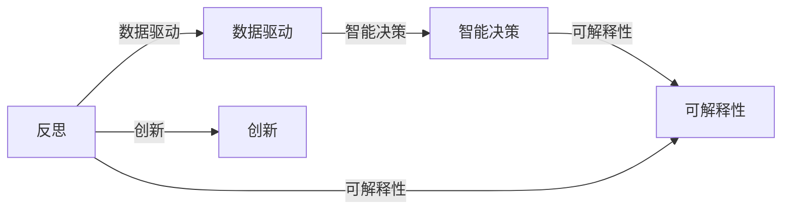

                 

## 1. 背景介绍

### 1.1 问题由来

在快速发展的信息技术时代，我们不仅见证了数据量的爆炸性增长，也目睹了算力的迅猛提升。在这个过程中，人工智能（AI）技术迅猛发展，尤其是在机器学习、深度学习等领域取得了突破性进展。然而，我们同时也看到了这些技术在应用过程中暴露出来的一些问题，如缺乏可解释性、训练数据偏见、模型过拟合等。这些问题引发了我们对AI技术应用的深度反思，也促使我们寻求新的解决方案。

### 1.2 问题核心关键点

AI技术的核心问题是如何在数据驱动和智能决策之间找到平衡。数据驱动的方法依赖于大量的标注数据和复杂的模型，而智能决策则需要模型的可解释性和泛化能力。如何将反思转化为创新，构建既能充分利用大数据，又能确保模型可靠性和透明度的AI系统，成为了当前研究的热点。

### 1.3 问题研究意义

研究如何从反思到创新，不仅有助于解决当前AI技术应用中存在的问题，更能推动AI技术的持续进步和广泛应用。这种研究具有重要意义：

- 提高AI系统的可信度。通过深度反思，我们可以揭示现有模型的不足，改进算法，提升AI系统的可信度和可靠性。
- 促进跨学科合作。AI技术的应用涉及众多领域，如医疗、金融、教育等，通过反思，可以促进不同学科的合作，推动AI技术在更多领域的落地。
- 推动伦理和安全标准的建立。反思和创新有助于我们审视AI技术的伦理和安全问题，建立相应的标准和规范。

## 2. 核心概念与联系

### 2.1 核心概念概述

为了更好地理解从反思到创新的过程，我们首先介绍几个核心概念及其相互联系：

- **反思（Reflection）**：指对现有技术的深入思考和批判性评估，揭示其局限性，并提出改进意见。反思是创新的起点。
- **创新（Innovation）**：基于反思，提出新的解决方案和算法，推动技术的进步和应用。创新是反思的落脚点。
- **数据驱动（Data-driven）**：指利用数据进行模型训练，通过统计学习等方法发现数据中的模式和规律。数据驱动是AI技术的基础。
- **智能决策（Intelligent Decision-making）**：指利用AI技术，通过智能算法和模型进行决策。智能决策是AI技术的最终目标。
- **可解释性（Explainability）**：指AI模型的决策过程能够被理解和解释，提高模型的可信度和透明度。可解释性是AI技术应用的关键。

这些核心概念通过反思和创新的双向驱动，共同构成了AI技术发展的全过程。

### 2.2 核心概念原理和架构的 Mermaid 流程图



## 3. 核心算法原理 & 具体操作步骤

### 3.1 算法原理概述

从反思到创新的过程，本质上是一个迭代优化和改进的过程。在AI技术应用中，我们首先通过数据驱动的方法构建初步模型，然后通过反思揭示模型的局限性和潜在问题，进而进行创新，提出新的算法和模型。这个过程可以概括为以下几个步骤：

1. **数据收集和预处理**：收集和整理相关数据，并进行清洗和预处理，以确保数据的可靠性和一致性。
2. **模型构建和训练**：基于数据构建初步模型，并通过训练获得初始性能。
3. **模型评估和反思**：通过评估和反思，发现模型的局限性和潜在问题。
4. **模型改进和创新**：基于反思结果，提出改进意见，进行模型优化和创新。
5. **模型测试和部署**：在实际应用中测试优化后的模型，并根据反馈进行调整和优化。

### 3.2 算法步骤详解

以下是一个详细的算法步骤示例，以机器学习中的决策树模型为例：

**Step 1: 数据收集和预处理**

- 收集相关领域的标注数据集，并对其进行清洗和预处理，如缺失值处理、特征选择等。

**Step 2: 模型构建和训练**

- 基于预处理后的数据，构建决策树模型，并通过训练获得初始性能。

**Step 3: 模型评估和反思**

- 使用验证集对模型进行评估，发现模型的局限性，如过拟合、欠拟合、数据偏见等。
- 通过可视化工具（如scikit-learn的决策树可视化）观察模型的决策过程，找出问题所在。

**Step 4: 模型改进和创新**

- 基于问题所在，提出改进意见，如调整模型结构、引入正则化、优化特征选择等。
- 重新训练模型，并通过测试集验证改进效果。

**Step 5: 模型测试和部署**

- 在实际应用中测试优化后的模型，并根据反馈进行调整和优化。

### 3.3 算法优缺点

从反思到创新的方法具有以下优点：

1. **提高模型性能**：通过深入反思和改进，可以发现并解决模型的局限性，提高模型性能。
2. **增强可解释性**：通过反思，我们可以更好地理解模型的决策过程，提高模型的可解释性。
3. **促进跨学科合作**：反思和创新可以推动不同学科的合作，带来新的应用场景和技术突破。

同时，这种方法也存在一些局限性：

1. **时间和资源成本高**：反思和创新需要大量的时间和资源投入，特别是在数据驱动的AI系统中，需要不断收集和处理数据。
2. **创新难度大**：模型的改进和创新往往需要跨学科的知识和经验，存在一定的难度和风险。
3. **过度依赖数据**：模型的改进和创新高度依赖于数据的质量和多样性，数据的偏差可能导致模型性能下降。

尽管存在这些局限性，但基于反思到创新的方法仍然是大数据驱动AI技术的重要手段，具有重要的理论和实践价值。

### 3.4 算法应用领域

从反思到创新的方法在多个领域得到了广泛应用，如医疗、金融、教育等。以下是几个典型的应用场景：

- **医疗领域**：通过反思医疗数据的质量和可靠性，提出改进方案，优化模型性能，提高医疗诊断的准确性。
- **金融领域**：利用反思和创新，改进风险评估模型，提高金融预测的精度和可靠性。
- **教育领域**：通过反思教育数据和模型的局限性，提出新的教学方法和算法，提升个性化教育的效率和效果。
- **智能制造**：通过反思和创新，优化智能制造系统中的模型和算法，提高生产效率和产品质量。

## 4. 数学模型和公式 & 详细讲解 & 举例说明

### 4.1 数学模型构建

在从反思到创新的过程中，数学模型起到了至关重要的作用。下面以决策树模型为例，介绍其数学模型构建过程。

**模型定义**：

- **决策树（Decision Tree）**：一种基于树形结构的分类模型，通过递归地将数据集分成更小的子集，最终构建出一棵树形结构。

**模型参数**：

- **根节点（Root Node）**：决策树的起点，用于划分数据集。
- **内部节点（Internal Node）**：决策树的中间节点，用于进一步划分数据。
- **叶节点（Leaf Node）**：决策树的终点，用于分类或回归。

**模型目标**：

- **最小化误差**：通过构建决策树，最小化模型的误差，即最大化决策树的准确性。

### 4.2 公式推导过程

**决策树构建公式**：

- **信息增益（ID3算法）**：用于选择最优划分属性，计算公式为：
  $$
  \text{Gain}(A, X) = \sum_{i=1}^n\frac{|D_i|}{|D|}\text{Entropy}(D_i)
  $$
  其中，$D$为数据集，$X$为数据集的特征，$D_i$为数据集按照特征$X$划分的子集。

- **基尼指数（C4.5算法）**：另一种衡量划分质量的方法，计算公式为：
  $$
  \text{Gini}(X) = 1 - \sum_{k=1}^Kp_k^2
  $$
  其中，$p_k$为数据集中特征$X$取值为第$k$个类别的概率。

### 4.3 案例分析与讲解

以医疗领域的疾病预测模型为例，通过反思和创新，我们可以改进模型的性能和可解释性：

**数据收集和预处理**：

- 收集相关医疗数据，并进行清洗和预处理，如缺失值处理、特征选择等。

**模型构建和训练**：

- 基于预处理后的数据，构建决策树模型，并通过训练获得初始性能。

**模型评估和反思**：

- 使用验证集对模型进行评估，发现模型的局限性，如过拟合、欠拟合、数据偏见等。
- 通过可视化工具观察模型的决策过程，找出问题所在。

**模型改进和创新**：

- 基于问题所在，提出改进意见，如调整模型结构、引入正则化、优化特征选择等。
- 重新训练模型，并通过测试集验证改进效果。

**模型测试和部署**：

- 在实际应用中测试优化后的模型，并根据反馈进行调整和优化。

## 5. 项目实践：代码实例和详细解释说明

### 5.1 开发环境搭建

在进行项目实践前，我们需要准备好开发环境。以下是使用Python进行Scikit-learn开发的环境配置流程：

1. 安装Anaconda：从官网下载并安装Anaconda，用于创建独立的Python环境。

2. 创建并激活虚拟环境：
```bash
conda create -n scikit-learn-env python=3.8 
conda activate scikit-learn-env
```

3. 安装Scikit-learn和相关工具包：
```bash
pip install scikit-learn numpy pandas scikit-optimize matplotlib tqdm jupyter notebook ipython
```

完成上述步骤后，即可在`scikit-learn-env`环境中开始项目实践。

### 5.2 源代码详细实现

以下是一个决策树模型的源代码实现，包括数据收集、模型训练、模型评估、模型改进和模型部署的详细过程。

```python
from sklearn.datasets import load_breast_cancer
from sklearn.model_selection import train_test_split
from sklearn.tree import DecisionTreeClassifier
from sklearn.metrics import accuracy_score
from sklearn.model_selection import GridSearchCV
from sklearn.tree import plot_tree

# 数据收集和预处理
data = load_breast_cancer()
X = data.data
y = data.target

# 划分训练集和测试集
X_train, X_test, y_train, y_test = train_test_split(X, y, test_size=0.2, random_state=42)

# 模型构建和训练
clf = DecisionTreeClassifier()
clf.fit(X_train, y_train)

# 模型评估和反思
y_pred = clf.predict(X_test)
accuracy = accuracy_score(y_test, y_pred)
print(f"Accuracy: {accuracy:.2f}")

# 模型改进和创新
# 通过GridSearchCV进行超参数调优
param_grid = {
    'max_depth': [3, 5, 7],
    'min_samples_split': [2, 5, 10],
    'min_samples_leaf': [1, 3, 5]
}
grid_search = GridSearchCV(clf, param_grid, cv=5)
grid_search.fit(X_train, y_train)

# 获取最优参数
best_params = grid_search.best_params_
clf_best = DecisionTreeClassifier(max_depth=best_params['max_depth'], min_samples_split=best_params['min_samples_split'], min_samples_leaf=best_params['min_samples_leaf'])
clf_best.fit(X_train, y_train)

# 模型测试和部署
y_pred_best = clf_best.predict(X_test)
accuracy_best = accuracy_score(y_test, y_pred_best)
print(f"Best Accuracy: {accuracy_best:.2f}")

# 绘制决策树
plot_tree(clf_best, feature_names=data.feature_names, class_names=data.target_names, filled=True)
```

### 5.3 代码解读与分析

让我们再详细解读一下关键代码的实现细节：

**load_breast_cancer函数**：
- 用于加载乳腺癌数据集，包含数据和标签。

**train_test_split函数**：
- 将数据集划分为训练集和测试集。

**GridSearchCV函数**：
- 用于进行超参数调优，通过交叉验证找到最优参数组合。

**plot_tree函数**：
- 用于绘制决策树，直观展示模型决策过程。

通过上述代码实现，我们可以清晰地看到决策树模型的构建和改进过程，从而理解从反思到创新的实现细节。

## 6. 实际应用场景

### 6.1 医疗领域

在医疗领域，基于从反思到创新的方法，我们可以构建更加精准的疾病预测模型。通过反思现有数据和模型的局限性，提出改进方案，优化模型性能和可解释性。

具体而言，可以收集电子病历、影像数据、实验室检查等医疗数据，并进行清洗和预处理。然后基于这些数据构建决策树模型，并通过训练获得初始性能。通过反思和评估，发现模型的局限性，如过拟合、欠拟合、数据偏见等。最后，通过调整模型结构、引入正则化、优化特征选择等改进方案，提升模型性能和可解释性。

### 6.2 金融领域

在金融领域，通过从反思到创新的方法，可以构建更加稳健的风险评估模型。利用反思和创新，改进模型的性能和可解释性，提高金融预测的精度和可靠性。

具体而言，可以收集股票价格、市场指数、经济指标等金融数据，并进行清洗和预处理。然后基于这些数据构建决策树模型，并通过训练获得初始性能。通过反思和评估，发现模型的局限性，如过拟合、欠拟合、数据偏见等。最后，通过调整模型结构、引入正则化、优化特征选择等改进方案，提升模型性能和可解释性。

### 6.3 教育领域

在教育领域，通过从反思到创新的方法，可以构建更加个性化的学习推荐系统。通过反思和创新，改进模型的性能和可解释性，提升个性化教育的效率和效果。

具体而言，可以收集学生的学习数据，如成绩、作业、互动行为等，并进行清洗和预处理。然后基于这些数据构建决策树模型，并通过训练获得初始性能。通过反思和评估，发现模型的局限性，如过拟合、欠拟合、数据偏见等。最后，通过调整模型结构、引入正则化、优化特征选择等改进方案，提升模型性能和可解释性。

### 6.4 未来应用展望

随着从反思到创新方法的不断发展和应用，未来AI技术将在更多领域得到广泛应用。

在智慧医疗领域，基于从反思到创新的方法，构建的疾病预测模型将提升医疗服务的智能化水平，辅助医生诊疗，加速新药开发进程。

在智能教育领域，通过反思和创新，构建的学习推荐系统将因材施教，促进教育公平，提高教学质量。

在智慧城市治理中，通过反思和创新，构建的城市事件监测、舆情分析、应急指挥系统将提高城市管理的自动化和智能化水平，构建更安全、高效的未来城市。

此外，在企业生产、社会治理、文娱传媒等众多领域，基于从反思到创新的AI应用也将不断涌现，为经济社会发展注入新的动力。

## 7. 工具和资源推荐

### 7.1 学习资源推荐

为了帮助开发者系统掌握从反思到创新的理论基础和实践技巧，这里推荐一些优质的学习资源：

1. 《深度学习》系列书籍：由多位专家共同编写，深入浅出地介绍了深度学习的基本概念和经典模型。
2. 《人工智能伦理》课程：斯坦福大学开设的人工智能伦理课程，涵盖了人工智能伦理的基本概念和重要问题。
3. 《机器学习实战》书籍：介绍了机器学习的实用技巧和案例，适合初学者和实战开发者。
4. 《Python数据科学手册》书籍：详细介绍了Python在数据科学和机器学习中的应用，适合进阶开发者。

通过对这些资源的学习实践，相信你一定能够快速掌握从反思到创新的精髓，并用于解决实际的AI问题。

### 7.2 开发工具推荐

高效的开发离不开优秀的工具支持。以下是几款用于从反思到创新开发的常用工具：

1. Jupyter Notebook：一种交互式的笔记本环境，方便开发者进行数据探索、模型训练和结果展示。
2. TensorFlow和PyTorch：两大主流的深度学习框架，提供了丰富的模型和工具支持。
3. Scikit-learn：一个基于Python的机器学习库，提供了多种算法和工具，方便开发者进行模型构建和评估。
4. Kaggle平台：一个数据科学竞赛平台，提供了大量的数据集和模型竞赛，适合实战练习和创新应用。
5. Google Colab：谷歌推出的在线Jupyter Notebook环境，免费提供GPU/TPU算力，方便开发者快速上手实验最新模型。

合理利用这些工具，可以显著提升从反思到创新的开发效率，加快创新迭代的步伐。

### 7.3 相关论文推荐

从反思到创新技术的发展源于学界的持续研究。以下是几篇奠基性的相关论文，推荐阅读：

1. "The Unreasonable Effectiveness of Transfer Learning"（转移学习的惊人效果）：探讨了迁移学习在深度学习中的应用，强调了数据和模型的重要性。
2. "Deep Learning with Confidence"（带有信心的深度学习）：提出了深度置信网络（DBN），通过自训练和正则化技术，提高模型的可信度。
3. "Explainable AI: Understanding Explainable Machine Learning"（可解释的人工智能：理解可解释的机器学习）：探讨了可解释性在机器学习中的应用，强调了模型透明度的重要性。
4. "Data Augmentation in Machine Learning"（机器学习中的数据增强）：介绍了数据增强技术在模型优化中的应用，提升了模型的泛化能力。
5. "Differential Privacy"（差分隐私）：提出了差分隐私技术，通过加入噪声保护隐私，提升了模型的可信度。

这些论文代表了大数据驱动AI技术的发展脉络。通过学习这些前沿成果，可以帮助研究者把握学科前进方向，激发更多的创新灵感。

## 8. 总结：未来发展趋势与挑战

### 8.1 总结

本文对从反思到创新的过程进行了全面系统的介绍。首先阐述了从反思到创新的研究背景和意义，明确了其在大数据驱动AI技术中的应用价值。其次，从原理到实践，详细讲解了从反思到创新的数学模型和算法步骤，给出了从反思到创新的完整代码实例。同时，本文还广泛探讨了从反思到创新的方法在医疗、金融、教育等领域的实际应用，展示了其巨大的潜力。此外，本文精选了从反思到创新的各类学习资源，力求为开发者提供全方位的技术指引。

通过本文的系统梳理，可以看到，从反思到创新方法在大数据驱动AI技术中的应用前景广阔，极大地拓展了AI技术的应用边界，催生了更多的落地场景。受益于大数据驱动AI技术的发展，从反思到创新方法必将在更多领域得到应用，为人类社会的数字化转型升级提供新的技术路径。

### 8.2 未来发展趋势

展望未来，从反思到创新方法将呈现以下几个发展趋势：

1. **数据驱动与智能化结合**：未来将更加注重数据驱动和智能决策的结合，通过反思和创新，构建更加智能、可靠的AI系统。
2. **多模态数据融合**：随着数据类型的丰富和多样，未来将更多地采用多模态数据融合技术，提升模型的泛化能力和鲁棒性。
3. **可解释性增强**：未来将更加注重模型的可解释性，通过反思和创新，提高模型的透明度和可信度。
4. **跨领域应用拓展**：未来将更加注重跨领域的AI应用，通过反思和创新，推动AI技术在更多领域落地。
5. **伦理和安全标准提升**：未来将更加注重AI技术的伦理和安全问题，通过反思和创新，建立更加完善的伦理和安全标准。

这些趋势凸显了从反思到创新方法的广阔前景，将推动AI技术的发展和应用进入新的阶段。

### 8.3 面临的挑战

尽管从反思到创新方法已经取得了显著进展，但在迈向更加智能化、普适化应用的过程中，仍面临诸多挑战：

1. **数据质量和多样性**：数据的质量和多样性直接影响模型的性能和泛化能力，如何获取高质量、多样化的数据将是未来的一大挑战。
2. **模型复杂性和可解释性**：随着模型复杂度的增加，模型的可解释性问题将更加突出，如何平衡模型复杂性和可解释性将是重要研究方向。
3. **计算资源和成本**：大规模数据的处理和分析需要大量的计算资源和成本，如何降低计算成本将是未来的一大挑战。
4. **隐私和安全问题**：在处理个人隐私数据时，如何保护隐私安全将是未来的一大挑战。

尽管存在这些挑战，但通过不断地反思和创新，我们有望找到新的解决方案，推动从反思到创新方法迈向更高的台阶。

### 8.4 研究展望

未来，从反思到创新方法需要在以下几个方面寻求新的突破：

1. **多模态数据的深度融合**：未来将更加注重多模态数据的深度融合，通过反思和创新，构建更加全面、准确的信息模型。
2. **智能决策的智能化**：未来将更加注重智能决策的智能化，通过反思和创新，提升决策的准确性和可靠性。
3. **伦理和安全标准的完善**：未来将更加注重AI技术的伦理和安全问题，通过反思和创新，建立更加完善的伦理和安全标准。
4. **跨领域应用的拓展**：未来将更加注重跨领域的AI应用，通过反思和创新，推动AI技术在更多领域落地。
5. **计算资源的优化**：未来将更加注重计算资源的优化，通过反思和创新，提升计算效率，降低计算成本。

这些研究方向的探索，必将引领从反思到创新方法迈向更高的台阶，为构建安全、可靠、可解释、可控的智能系统铺平道路。面向未来，从反思到创新方法还需要与其他人工智能技术进行更深入的融合，如知识表示、因果推理、强化学习等，多路径协同发力，共同推动自然语言理解和智能交互系统的进步。只有勇于创新、敢于突破，才能不断拓展语言模型的边界，让智能技术更好地造福人类社会。

## 9. 附录：常见问题与解答

**Q1：从反思到创新是否适用于所有AI应用场景？**

A: 从反思到创新方法在大多数AI应用场景中都能取得不错的效果，特别是对于数据驱动的AI系统。但对于一些特定领域的应用，如金融、医疗等，仅仅依靠通用语料预训练的模型可能难以很好地适应。此时需要在特定领域语料上进一步预训练，再进行微调，才能获得理想效果。

**Q2：如何进行有效的反思？**

A: 有效的反思需要基于数据的深入分析和模型的全面评估，具体步骤包括：
1. 数据收集和预处理，确保数据的可靠性和一致性。
2. 模型构建和训练，获得初始性能。
3. 模型评估和反思，发现模型的局限性和潜在问题。
4. 模型改进和创新，提出改进意见，进行模型优化和创新。

**Q3：如何平衡数据驱动和智能决策？**

A: 数据驱动和智能决策的平衡需要通过不断反思和创新来实现，具体措施包括：
1. 收集高质量、多样化的数据。
2. 构建简单易懂的模型，提高模型的可解释性。
3. 引入跨学科的知识和方法，提升模型的智能化水平。
4. 进行定期的模型评估和反思，发现并解决模型的局限性。

**Q4：如何提高模型的可解释性？**

A: 提高模型的可解释性需要从多个方面进行改进，具体措施包括：
1. 使用简单易懂的模型，如决策树、线性回归等。
2. 引入可解释性技术，如LIME、SHAP等，分析模型的决策过程。
3. 通过可视化工具，如scikit-learn的决策树可视化，直观展示模型决策过程。
4. 进行定期的模型反思和优化，确保模型的透明性和可信度。

**Q5：如何处理多模态数据？**

A: 处理多模态数据需要采用多模态数据融合技术，具体步骤包括：
1. 收集多模态数据，并进行清洗和预处理。
2. 构建多模态融合模型，如基于深度学习的融合网络。
3. 进行定期的模型评估和反思，发现并解决模型的局限性。
4. 通过反思和创新，优化多模态融合算法，提升模型的泛化能力和鲁棒性。

这些问题的答案，可以帮助开发者更好地理解和应用从反思到创新方法，推动AI技术的持续进步和广泛应用。

