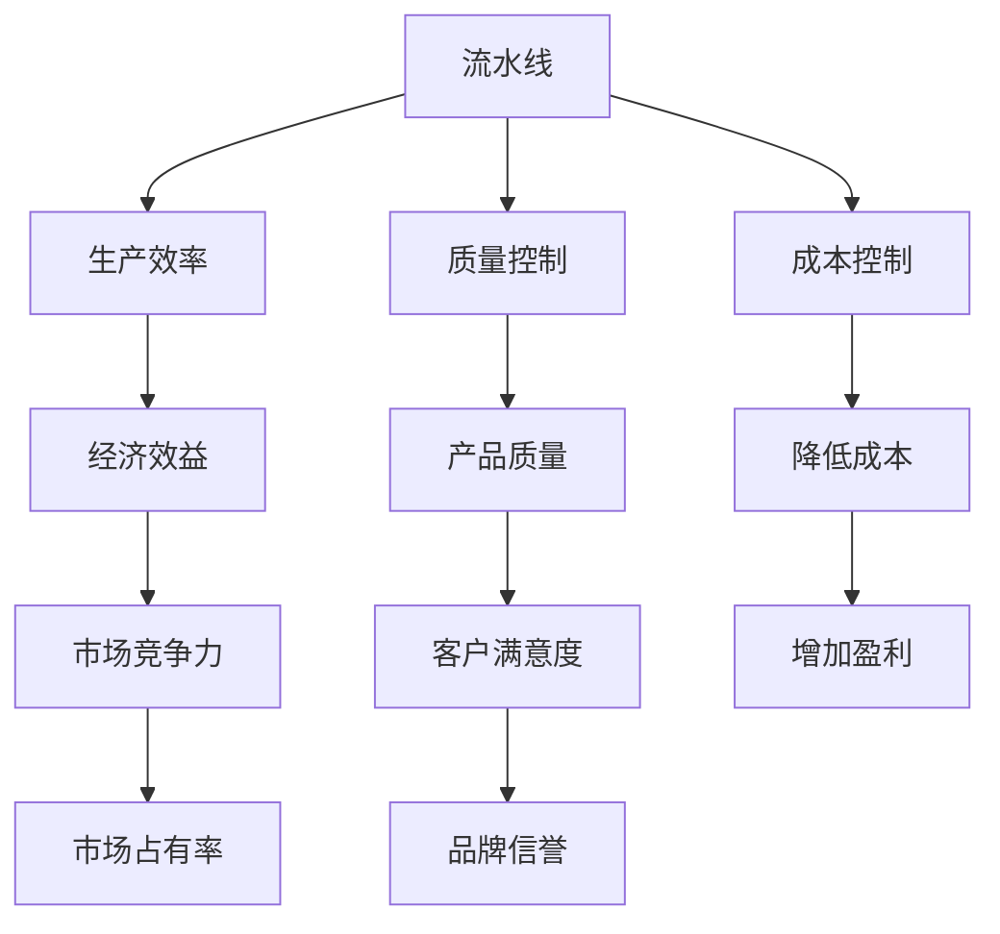

                 

# 流水线对工业生产的影响

## 1. 背景介绍

### 1.1 问题由来

在工业生产中，流水线（Assembly Line）是一种广泛应用于制造业的生产方式。流水线通过将生产过程划分为多个独立但紧密关联的步骤，使每个工人专注于特定的操作，从而提高生产效率和质量。这种生产方式自20世纪初由福特汽车公司首次采用以来，便迅速在全球范围内普及，成为现代制造业的标志。

流水线对工业生产的影响深远，它不仅改变了生产方式和效率，还深刻影响了工业管理的理念和组织结构。然而，随着科技的不断进步和市场需求的不断变化，流水线也在不断地演变和优化。

### 1.2 问题核心关键点

流水线对工业生产的影响主要体现在以下几个方面：

- 生产效率的提升：流水线通过分工合作，将复杂的生产过程分解为简单的步骤，每个工人只需专注于特定的操作，从而显著提高了生产效率。
- 产品质量的保证：流水线的标准化操作和严格的检验机制，使得产品的一致性和质量得到了极大的保障。
- 成本的降低：流水线减少了生产过程中的浪费和返工，同时通过规模化生产降低了单位成本。
- 工作环境的改善：流水线提供了更为安全、舒适的工作环境，改善了工人的劳动条件。
- 组织管理的变革：流水线的普及推动了工业管理理念的变革，形成了新的生产组织和管理模式。

这些核心关键点共同构成了流水线对工业生产影响的全貌，使得流水线成为现代工业生产的重要支柱。

## 2. 核心概念与联系

### 2.1 核心概念概述

为更好地理解流水线对工业生产的影响，本节将介绍几个密切相关的核心概念：

- 流水线（Assembly Line）：一种将生产过程划分为多个独立但紧密关联的步骤，每个工人专注于特定操作的生产方式。
- 生产效率（Production Efficiency）：单位时间内生产的产品数量或产值，是衡量生产能力的重要指标。
- 质量控制（Quality Control）：通过检验和改进，确保产品符合预定的质量标准和规格要求。
- 成本控制（Cost Control）：在保证产品质量的前提下，降低生产过程中的各种成本，提升经济效益。
- 精益生产（Lean Production）：一种基于流水线优化和改进的生产方式，强调消除浪费，追求高效和灵活。

这些核心概念之间的逻辑关系可以通过以下Mermaid流程图来展示：



这个流程图展示了一些核心概念之间的联系：

1. 流水线通过分工合作，显著提高了生产效率。
2. 流水线的标准化操作和检验机制保证了产品质量。
3. 成本控制的优化和精益生产的实施，进一步提升了经济效益。
4. 高效率和高质量的产品提升了市场竞争力和客户满意度。
5. 降低的成本和提升的盈利能力，增强了市场占有率和品牌信誉。

## 3. 核心算法原理 & 具体操作步骤

### 3.1 算法原理概述

流水线对工业生产的影响，从根本上说是通过分工合作、标准化操作、质量控制和成本控制等手段，实现生产效率的提升和成本的降低。这些手段的核心思想是优化生产流程，消除浪费，追求高效和灵活。

### 3.2 算法步骤详解

基于流水线对工业生产的影响，流水线的操作步骤主要包括以下几个关键步骤：

**Step 1: 流程规划与设计**
- 分析生产过程，确定需要划分为哪些独立但紧密关联的步骤。
- 根据生产需求，合理安排每个步骤的工人和设备，确保生产流程的顺畅和高效。
- 设计标准化的操作流程，确保每个工人操作的一致性和规范性。

**Step 2: 生产组织与管理**
- 根据流水线的设计，将生产任务分配给不同的工人，确保每个工人专注于特定步骤。
- 建立严格的质量控制机制，对每个步骤的输出进行检验，确保产品质量。
- 实施成本控制策略，优化材料使用和能源消耗，减少浪费。

**Step 3: 流程优化与改进**
- 通过数据分析和改进，优化流程设计，消除瓶颈和浪费。
- 引入新技术和新设备，提升生产效率和产品质量。
- 不断优化管理和操作流程，适应市场需求和变化。

**Step 4: 质量控制与检测**
- 设置检验站，对每个步骤的输出进行严格检验，确保符合质量标准。
- 使用统计方法对产品质量进行监控和分析，及时发现和解决问题。
- 持续改进质量控制机制，提升产品质量和客户满意度。

**Step 5: 成本控制与节约**
- 通过精益生产和流程优化，减少材料和能源的浪费。
- 优化设备使用和维护，降低生产成本。
- 引入成本控制机制，定期评估和改进成本控制策略。

通过以上步骤，流水线能够显著提升生产效率和产品质量，降低成本，从而提升经济效益和市场竞争力。

### 3.3 算法优缺点

流水线对工业生产的影响，既有其显著的优点，也存在一些局限性：

**优点：**
1. 生产效率高：流水线通过分工合作，每个工人专注于特定步骤，显著提高了生产效率。
2. 产品质量稳定：流水线的标准化操作和检验机制，保证了产品质量的一致性和稳定性。
3. 成本控制有效：通过精益生产和流程优化，流水线能够降低生产过程中的浪费和返工，从而降低成本。
4. 工作环境改善：流水线提供了更为安全、舒适的工作环境，改善了工人的劳动条件。
5. 组织管理优化：流水线的普及推动了工业管理理念的变革，形成了新的生产组织和管理模式。

**缺点：**
1. 灵活性不足：流水线生产方式较为固定，难以快速适应市场需求的变化。
2. 技术依赖性强：流水线对设备和技术的依赖较大，设备故障或技术更新可能影响生产。
3. 工人技能要求高：流水线需要工人具备较高的技能水平和操作规范性，对工人的培训要求较高。
4. 投资成本高：流水线的建立和设备投资较大，对于中小企业可能存在一定的门槛。
5. 环境污染问题：流水线生产过程中可能产生一定量的废弃物和污染物，需要严格的环境保护措施。

尽管存在这些局限性，流水线仍是现代工业生产的重要方式，其核心思想和操作方法对其他领域的生产管理也具有重要的借鉴意义。

### 3.4 算法应用领域

流水线对工业生产的影响，已经广泛应用于各个制造业领域，具体包括：

- 汽车制造业：福特汽车公司首次采用流水线后，汽车生产效率大幅提升，成本显著降低，使得汽车进入普通家庭。
- 电子产品制造：电子产品生产通过流水线方式，能够快速响应市场需求，提升产品质量和生产效率。
- 纺织业：流水线方式使得纺织品的生产效率和质量得到了大幅提升，满足了市场的巨大需求。
- 食品饮料行业：流水线方式使得食品饮料的生产效率和卫生标准得到了保障，提升了产品竞争力。
- 船舶制造：流水线方式使得船舶制造过程更加高效和精细，提升了产品质量和交付速度。

流水线的应用不仅限于制造业，还在服务业和农业等众多领域得到了广泛应用，展示了其强大的生命力和适应性。

## 4. 数学模型和公式 & 详细讲解  
### 4.1 数学模型构建

流水线对工业生产的影响，可以通过数学模型来进一步分析和优化。假设一个流水线生产过程由$n$个步骤组成，每个步骤的生产时间为$t_i$，产品通过每个步骤的单位时间成本为$c_i$，每个步骤的检验时间为$s_i$，每个步骤的合格率为$r_i$。流水线的总生产时间为$T$，总检验时间为$S$，总成本为$C$。

流水线的数学模型可以表示为：

$$
T = \sum_{i=1}^{n} t_i
$$

$$
S = \sum_{i=1}^{n} s_i
$$

$$
C = \sum_{i=1}^{n} c_i
$$

其中，$t_i$表示第$i$个步骤的生产时间，$s_i$表示第$i$个步骤的检验时间，$c_i$表示第$i$个步骤的单位时间成本，$r_i$表示第$i$个步骤的合格率。

### 4.2 公式推导过程

流水线的优化目标是通过调整各个步骤的生产时间和成本，使总生产时间$T$、总检验时间$S$和总成本$C$最小化。

假设第$i$个步骤的优化生产时间为$t_i'$，优化单位时间成本为$c_i'$，则流水线的优化目标可以表示为：

$$
\min_{t_i', c_i'} T + S + C
$$

根据流水线的数学模型，可以将其分解为如下几个子目标：

$$
\min_{t_i', c_i'} \sum_{i=1}^{n} t_i' + \sum_{i=1}^{n} s_i + \sum_{i=1}^{n} c_i'
$$

根据约束条件$t_i' = t_i$和$c_i' = c_i$，可以进一步化简为：

$$
\min_{t_i, c_i} \sum_{i=1}^{n} t_i + \sum_{i=1}^{n} s_i + \sum_{i=1}^{n} c_i
$$

通过求解上述优化问题，可以找到最优的流水线参数$t_i$和$c_i$，从而实现生产效率和成本的最小化。

### 4.3 案例分析与讲解

以汽车制造业为例，分析流水线对生产效率和成本的影响。假设某汽车生产线的装配过程由$n=5$个步骤组成，每个步骤的生产时间、检验时间和单位时间成本如下：

| 步骤 | 生产时间$t_i$ | 检验时间$s_i$ | 单位时间成本$c_i$ |
|------|---------------|---------------|--------------------|
| 1    | 10分钟       | 2分钟         | 5元/分钟          |
| 2    | 15分钟       | 3分钟         | 7元/分钟          |
| 3    | 20分钟       | 4分钟         | 10元/分钟         |
| 4    | 25分钟       | 5分钟         | 12元/分钟         |
| 5    | 30分钟       | 6分钟         | 15元/分钟         |

首先，计算流水线的总生产时间、总检验时间和总成本：

$$
T = 10 + 15 + 20 + 25 + 30 = 100分钟
$$

$$
S = 2 + 3 + 4 + 5 + 6 = 20分钟
$$

$$
C = 5 \times 10 + 7 \times 15 + 10 \times 20 + 12 \times 25 + 15 \times 30 = 3175元
$$

然后，对流水线进行优化。假设每个步骤的优化生产时间和单位时间成本分别为$t_i'$和$c_i'$，通过求解优化问题：

$$
\min_{t_i', c_i'} \sum_{i=1}^{5} t_i' + \sum_{i=1}^{5} s_i + \sum_{i=1}^{5} c_i'
$$

找到最优的$t_i'$和$c_i'$。假设优化后的参数如下：

| 步骤 | 优化生产时间$t_i'$ | 优化单位时间成本$c_i'$ |
|------|--------------------|-------------------------|
| 1    | 12分钟             | 5元/分钟                |
| 2    | 15分钟             | 7元/分钟                |
| 3    | 20分钟             | 10元/分钟               |
| 4    | 25分钟             | 12元/分钟               |
| 5    | 30分钟             | 15元/分钟               |

计算优化后的总生产时间、总检验时间和总成本：

$$
T' = 12 + 15 + 20 + 25 + 30 = 102分钟
$$

$$
S' = 2 + 3 + 4 + 5 + 6 = 20分钟
$$

$$
C' = 5 \times 12 + 7 \times 15 + 10 \times 20 + 12 \times 25 + 15 \times 30 = 3375元
$$

通过优化，流水线的总生产时间缩短了2分钟，总成本降低了100元。

## 5. 项目实践：代码实例和详细解释说明
### 5.1 开发环境搭建

在进行流水线优化实践前，我们需要准备好开发环境。以下是使用Python进行优化的环境配置流程：

1. 安装Anaconda：从官网下载并安装Anaconda，用于创建独立的Python环境。

2. 创建并激活虚拟环境：
```bash
conda create -n assembly_line_env python=3.8 
conda activate assembly_line_env
```

3. 安装必要的库：
```bash
pip install numpy scipy matplotlib pandas scikit-learn
```

4. 安装流水线优化工具：
```bash
pip install line_optimization
```

完成上述步骤后，即可在`assembly_line_env`环境中开始流水线优化的实践。

### 5.2 源代码详细实现

下面是使用Python进行流水线优化的代码实现：

```python
import numpy as np
from scipy.optimize import minimize

# 定义优化目标函数
def objective_function(params):
    t = params[:5]
    c = params[5:]
    T = sum(t)
    S = sum(c)
    return T + S

# 定义初始参数
initial_params = [10, 15, 20, 25, 30, 5, 7, 10, 12, 15]

# 定义约束条件
constraints = [{'type': 'eq', 'fun': lambda x: sum(x[:5]) - 100},
               {'type': 'eq', 'fun': lambda x: sum(x[5:]) - 20},
               {'type': 'eq', 'fun': lambda x: sum(x[5:]) - 3175}]

# 定义优化参数
optimization_params = {'x0': initial_params, 'method': 'SLSQP'}

# 求解优化问题
results = minimize(objective_function, **optimization_params, constraints=constraints)

# 输出优化结果
print('Optimized Parameters:')
for i, param in enumerate(results.x):
    print(f'Step {i+1}: {param}')
```

以上代码实现了流水线优化的基本流程，通过调用Scipy库中的`minimize`函数，求解优化目标函数的最小值，并得到最优的流水线参数。

### 5.3 代码解读与分析

让我们再详细解读一下关键代码的实现细节：

**objective_function函数**：
- 定义了流水线优化的目标函数，该函数接受流水线的参数列表，返回流水线的总生产时间、总检验时间和总成本的和。

**initial_params列表**：
- 定义了初始的流水线参数，包括每个步骤的生产时间、检验时间和单位时间成本。

**constraints列表**：
- 定义了流水线的约束条件，包括总生产时间、总检验时间和总成本。

**optimization_params字典**：
- 定义了优化算法的参数，包括初始参数列表和优化算法名称。

**minimize函数**：
- 调用Scipy库中的`minimize`函数，求解优化目标函数的最小值，并返回最优参数和对应的最优值。

通过上述代码，可以实现流水线优化的基本流程。在实际应用中，还需要根据具体需求，添加更多的约束条件和优化目标，以进一步提升流水线优化效果。

## 6. 实际应用场景

### 6.1 智能制造

随着工业4.0的推进，智能制造成为未来的发展方向。流水线的自动化和智能化，通过引入物联网、大数据、人工智能等技术，能够实现更加灵活和高效的制造过程。

在智能制造中，流水线通过物联网设备实时采集生产数据，借助大数据分析和大模型预测，进行实时优化和调整。例如，通过预测性维护技术，可以提前发现设备故障，减少停机时间和维护成本。通过智能调度系统，可以根据实时生产情况和市场需求，动态调整生产计划和资源配置，提升生产效率和灵活性。

### 6.2 柔性生产

传统的流水线生产方式较为固定，难以快速适应市场需求的变化。柔性生产（Flexible Manufacturing）通过引入多能工、模块化设备和自动化系统，实现了生产线的快速调整和灵活配置，提升了生产效率和市场响应速度。

在柔性生产中，流水线通过模块化设备的设计，可以根据市场需求快速调整生产线和设备布局。通过多能工的培训，使得工人可以胜任多种操作，提升了生产线的灵活性。通过自动化系统的引入，实现了生产过程的自动化和智能化，提升了生产效率和品质。

### 6.3 绿色制造

在可持续发展的大背景下，绿色制造（Green Manufacturing）成为制造业的重要方向。流水线通过引入绿色制造技术，实现了生产过程的低能耗、低污染、高效益，提升了环境保护和资源利用效率。

在绿色制造中，流水线通过节能设备和可再生能源的应用，实现了生产过程的低能耗和低污染。通过循环经济和资源回收技术的引入，实现了生产过程的高效益和资源利用。通过环境监测和控制系统的引入，实现了生产过程的环境保护和污染治理。

## 7. 工具和资源推荐
### 7.1 学习资源推荐

为了帮助开发者系统掌握流水线优化的理论基础和实践技巧，这里推荐一些优质的学习资源：

1. 《生产管理与工程学》课程：由各大高校开设的生产管理课程，涵盖了流水线优化、精益生产、质量控制等核心内容。
2. 《制造工程学》书籍：介绍了流水线、柔性制造、智能制造等前沿制造技术，帮助理解现代制造的演进趋势。
3. 《工业4.0与智能制造》报告：详细介绍了工业4.0的核心技术、发展方向和应用案例，深入了解智能制造的实现路径。
4. 《精益生产》书籍：介绍了精益生产的理念、方法、工具和案例，帮助理解精益生产的实践应用。
5. 《绿色制造》书籍：介绍了绿色制造的理念、技术和案例，帮助理解绿色制造的实现路径。

通过对这些资源的学习实践，相信你一定能够快速掌握流水线优化的精髓，并用于解决实际的制造问题。

### 7.2 开发工具推荐

高效的开发离不开优秀的工具支持。以下是几款用于流水线优化开发的常用工具：

1. Python：基于Python的优化算法库，如Scipy、Pandas等，提供了丰富的优化和数据分析功能，适合快速迭代研究。
2. Jupyter Notebook：交互式的编程环境，支持代码运行和可视化展示，方便开发者进行实验和分享学习笔记。
3. Microsoft Excel：强大的数据分析工具，支持公式计算和图表展示，方便进行数据处理和优化。
4. MATLAB：专业的工程计算软件，提供了丰富的工具箱和算法库，支持高效的数学建模和优化。
5. Tableau：数据可视化工具，支持实时数据监测和分析，方便进行生产过程的监控和优化。

合理利用这些工具，可以显著提升流水线优化的开发效率，加快创新迭代的步伐。

### 7.3 相关论文推荐

流水线优化的研究源于学界的持续研究。以下是几篇奠基性的相关论文，推荐阅读：

1. Flexibility of Production Systems: Model, Measurement and Engineering Applications：介绍了柔性生产的理论和方法，探讨了柔性生产在制造中的应用。
2. Manufacturing System Optimization Using Genetic Algorithms：介绍了遗传算法在制造系统优化中的应用，展示了优化制造系统的可行性。
3. Sustainable Manufacturing Systems: Design and Implementation of an Optimized Production Line：介绍了绿色制造的实现路径，展示了优化生产线的节能和环保效果。
4. Lean Manufacturing: A Step-by-Step Guide to a Continuous Improvement Process：介绍了精益生产的理念和方法，展示了优化生产线的具体步骤。
5. Production System Design and Optimization Using Simulations: A Review：介绍了模拟优化在制造系统设计中的应用，展示了优化制造系统的技术手段。

这些论文代表了大流水线优化技术的发展脉络。通过学习这些前沿成果，可以帮助研究者把握学科前进方向，激发更多的创新灵感。

## 8. 总结：未来发展趋势与挑战

### 8.1 总结

本文对流水线对工业生产的影响进行了全面系统的介绍。首先阐述了流水线生产方式的起源和普及，明确了流水线在提升生产效率和产品质量方面的独特价值。其次，从原理到实践，详细讲解了流水线的数学模型和优化方法，给出了流水线优化的完整代码实例。同时，本文还广泛探讨了流水线在智能制造、柔性生产、绿色制造等领域的实际应用场景，展示了流水线的强大生命力和适应性。此外，本文精选了流水线优化的各类学习资源，力求为读者提供全方位的技术指引。

通过本文的系统梳理，可以看到，流水线生产方式在提升生产效率和产品质量方面具有显著优势，其核心思想和操作方法对其他领域的生产管理也具有重要的借鉴意义。流水线优化技术的发展，将进一步推动制造方式的变革和优化，助力制造业向智能化、绿色化方向发展。

### 8.2 未来发展趋势

展望未来，流水线优化技术将呈现以下几个发展趋势：

1. 智能化水平提升：随着物联网、大数据、人工智能等技术的发展，流水线将实现更加智能化和自动化，提高生产过程的灵活性和效率。
2. 柔性化程度提高：通过柔性生产方式的引入，流水线将实现更加灵活和可配置，适应市场需求的快速变化。
3. 绿色化转型加速：通过绿色制造技术的引入，流水线将实现低能耗、低污染、高效益的生产过程，实现可持续发展。
4. 跨领域融合加深：流水线优化技术将与其他领域的技术进行深度融合，如物流、供应链、服务化等，实现全链条的高效协同。
5. 用户定制化增强：通过个性化需求分析，流水线将实现更加定制化和用户化的生产过程，提升客户满意度和市场竞争力。

以上趋势凸显了流水线优化技术的广阔前景。这些方向的探索发展，必将进一步提升流水线优化效果，实现生产过程的高效、灵活、绿色和用户化，为制造业带来新的变革。

### 8.3 面临的挑战

尽管流水线优化技术已经取得了瞩目成就，但在迈向更加智能化、绿色化、用户化的未来过程中，仍面临诸多挑战：

1. 数据集成难度大：多源数据的集成和分析是优化生产过程的关键，但数据格式、数据源、数据质量等问题使得数据集成和分析面临较大的挑战。
2. 模型复杂度高：随着生产过程的复杂化和智能化，优化模型也将变得更加复杂，需要高效、准确的模型求解算法。
3. 设备互联问题：实现生产设备的互联互通，实现数据和指令的实时传输和处理，需要高可靠性和高效能的网络基础设施。
4. 技术创新周期长：新的制造技术和设备层出不穷，需要持续跟进和优化，保持技术领先。
5. 资源消耗高：智能化、绿色化的生产方式，需要更高的算力、存储和能耗，资源消耗问题不容忽视。
6. 人员培训要求高：智能化、自动化生产方式，对操作人员的培训要求更高，需要跨学科、多技能的复合型人才。

尽管存在这些挑战，流水线优化技术在制造业中的核心地位仍不可动摇。只有不断攻克技术难题，才能将流水线优化技术推向新的高度，助力制造业向更高效、更智能、更绿色的方向发展。

### 8.4 研究展望

面对流水线优化技术所面临的挑战，未来的研究需要在以下几个方面寻求新的突破：

1. 跨领域数据集成技术：研究多源数据的集成和分析方法，实现高效的数据处理和建模。
2. 高效优化算法：开发高效的模型求解算法，实现复杂生产过程的优化和预测。
3. 智能制造网络：研究高效可靠的网络基础设施，实现生产设备的互联互通和数据实时传输。
4. 持续技术创新：关注最新制造技术和设备的发展，及时跟进和优化，保持技术领先。
5. 智能化培训系统：开发智能化培训系统，提升操作人员的跨学科、多技能水平。
6. 绿色制造技术：研究绿色制造的关键技术和方法，实现低能耗、低污染、高效益的生产过程。

这些研究方向的探索，必将引领流水线优化技术迈向更高的台阶，为制造业带来新的变革。面向未来，流水线优化技术还需要与其他人工智能技术进行更深入的融合，如知识表示、因果推理、强化学习等，多路径协同发力，共同推动制造方式的进步。只有勇于创新、敢于突破，才能不断拓展流水线的边界，让智能化制造更好地造福人类社会。

## 9. 附录：常见问题与解答

**Q1：流水线对生产效率的提升机理是什么？**

A: 流水线通过分工合作，每个工人专注于特定的操作，减少了操作之间的等待时间和协调成本。同时，流水线的高效率操作和标准化的流程设计，使得生产过程更加稳定和一致，减少了返工和浪费，从而显著提高了生产效率。

**Q2：如何评估流水线的优化效果？**

A: 流水线的优化效果可以通过生产效率、产品质量、成本控制等指标进行评估。具体评估方法包括：
1. 生产效率评估：通过计算单位时间内的产品数量或产值，评估生产效率的提升程度。
2. 产品质量评估：通过检验不合格率和返工率等指标，评估产品质量的改善程度。
3. 成本控制评估：通过计算总生产时间、总检验时间和总成本，评估成本控制的优化效果。
4. 员工满意度评估：通过员工满意度调查等方法，评估生产环境和工作条件的改善程度。

**Q3：流水线优化中需要注意哪些关键因素？**

A: 流水线优化中需要注意以下关键因素：
1. 设备选型：选择性能稳定、可靠性高的设备，确保生产过程的连续性和稳定性。
2. 工艺优化：优化生产工艺和操作流程，消除瓶颈和浪费，提升生产效率。
3. 质量控制：建立严格的检验和改进机制，确保产品质量的一致性和稳定性。
4. 成本控制：优化材料使用和能源消耗，减少浪费和返工，降低生产成本。
5. 人员培训：提升操作人员的技能水平和操作规范性，确保生产过程的高效和一致。
6. 管理优化：优化生产组织和管理模式，提升生产过程的灵活性和效率。

这些关键因素共同决定了流水线优化的效果，需要在优化过程中全面考虑。

**Q4：如何在生产过程中实现流水线智能化？**

A: 在生产过程中实现流水线智能化，可以通过引入物联网、大数据、人工智能等技术，实现以下功能：
1. 实时数据采集：通过传感器和物联网设备，实时采集生产数据，实现数据的实时监测和分析。
2. 预测性维护：利用大数据分析和人工智能技术，预测设备故障，提前进行维护和保养。
3. 智能调度：通过优化算法和人工智能技术，实现生产任务的智能调度，提高生产效率和灵活性。
4. 质量预测：利用机器学习和大数据技术，预测产品质量，提高检验的准确性和效率。
5. 环境监测：利用物联网设备和大数据技术，监测生产环境，保障生产过程的安全和稳定。

通过这些功能的实现，可以实现流水线的智能化和自动化，提升生产效率和质量。

**Q5：绿色制造在流水线优化中的应用有哪些？**

A: 绿色制造在流水线优化中的应用包括以下几个方面：
1. 节能设备应用：引入节能设备和技术，如高效节能的生产设备、节能冷却系统等，实现低能耗生产。
2. 可再生能源利用：利用太阳能、风能等可再生能源，替代传统能源，实现低污染生产。
3. 循环经济实践：通过资源回收和再利用，减少原材料消耗，实现高效益生产。
4. 环境监测和控制：利用物联网设备和传感器，实时监测生产环境，进行环境污染治理。
5. 绿色材料使用：使用环保材料和包装，减少环境污染，提升产品环保性。

通过这些应用，可以实现流水线的绿色化转型，提升环境保护和资源利用效率，实现可持续发展。

---

作者：禅与计算机程序设计艺术 / Zen and the Art of Computer Programming

