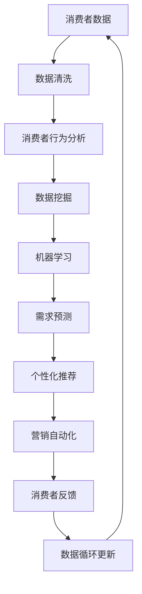

                 

## 1. 背景介绍

随着数字化转型浪潮席卷全球，数据成为了驱动企业增长的核心资产。在消费领域，无论是零售商、电商平台、在线服务提供商，还是内容创作者，都在积极利用消费者数据，挖掘潜力，实现增长。然而，尽管数据的重要性不言而喻，但真正能够挖掘出数据价值的只是少数企业。本章节将探讨消费数据在商业智能和决策中的关键作用，及其如何成为企业竞争力的核心。

### 1.1 数据驱动的消费市场

在数字化时代，消费者数据成为企业洞察市场趋势、提升用户满意度和优化运营效率的关键。通过对消费者行为的深入分析，企业可以更好地预测市场变化，制定更精准的营销策略，提升销售转化率。

1. **行为数据**：包括购买记录、浏览行为、点击路径等，可以帮助企业了解消费者的购物偏好和行为习惯。
2. **社交数据**：社交媒体和在线评论中的用户反馈和评价，是了解消费者情感和需求的重要窗口。
3. **地理位置数据**：通过分析消费者的地理位置，企业可以更精准地进行区域营销和本地化运营。
4. **交易数据**：交易数据记录了消费者的支付信息、消费频率等，有助于企业进行个性化推荐和促销活动。

### 1.2 数据驱动的决策重要性

数据驱动的决策不仅提升企业运营效率，还能减少不确定性，降低风险。具体而言：

- **个性化推荐**：通过分析消费者历史行为和偏好，提供个性化的产品和服务，提高消费者满意度和忠诚度。
- **风险管理**：通过预测分析，识别潜在风险和欺诈行为，及时采取措施。
- **需求预测**：预测未来的销售趋势，优化库存管理，减少过剩或短缺问题。

## 2. 核心概念与联系

### 2.1 核心概念概述

1. **消费者数据**：指与消费者相关的各种数据，包括行为数据、交易数据、地理位置数据、社交数据等。
2. **消费分析**：通过对消费者数据的分析，揭示消费者行为模式、需求趋势等，为决策提供支撑。
3. **数据挖掘**：从大量数据中提取有价值的信息和模式，用于分析和决策。
4. **机器学习**：利用算法和模型从数据中学习规律，预测未来趋势。
5. **消费者行为分析**：分析消费者行为数据，理解消费者的需求和偏好。
6. **营销自动化**：通过数据分析和机器学习，自动化营销策略的制定和执行。

### 2.2 核心概念原理和架构的 Mermaid 流程图



这个流程图展示了从消费者数据到最终营销自动化的完整流程，各个环节相互连接，形成一个闭环。

## 3. 核心算法原理 & 具体操作步骤

### 3.1 算法原理概述

消费数据的分析涉及多个领域的技术，包括数据清洗、数据挖掘、机器学习等。以下将详细介绍这些关键算法和技术。

### 3.2 算法步骤详解

#### 3.2.1 数据清洗

数据清洗是数据分析的基础，主要包括以下步骤：

1. **去重与合并**：消除重复数据，确保数据的一致性。
2. **缺失值处理**：通过填充、删除或插值等方式处理缺失数据。
3. **异常值检测**：识别并处理异常值，保证数据质量。

#### 3.2.2 数据挖掘

数据挖掘通过算法在数据中寻找模式和规律，常用于：

1. **关联规则挖掘**：从交易数据中发现商品之间的关联关系，如购物篮分析。
2. **聚类分析**：将消费者分为不同群体，基于相似的行为特征。
3. **分类和回归分析**：预测消费者行为，如预测购买意向和消费金额。

#### 3.2.3 机器学习

机器学习利用算法从数据中学习规律，常用于：

1. **回归模型**：预测连续数值，如预测销售额。
2. **分类模型**：预测离散标签，如预测客户流失。
3. **序列预测**：预测序列数据的变化，如预测库存水平。

### 3.3 算法优缺点

#### 3.3.1 数据清洗

**优点**：
- 提高数据质量，减少噪音。
- 确保数据分析结果的可靠性。

**缺点**：
- 数据清洗可能耗时耗力，特别是在大数据量下。
- 复杂的清洗规则可能引入新的数据偏差。

#### 3.3.2 数据挖掘

**优点**：
- 发现数据中的隐藏模式和规律。
- 支持业务决策和策略制定。

**缺点**：
- 对数据量和质量要求较高。
- 算法复杂，需要专业的知识。

#### 3.3.3 机器学习

**优点**：
- 可处理大规模数据集。
- 能够预测未来趋势，提供决策支持。

**缺点**：
- 对数据质量和特征工程依赖性大。
- 模型解释性较弱。

### 3.4 算法应用领域

#### 3.4.1 零售行业

在零售领域，消费数据分析可以用于：

- **库存管理**：预测销售趋势，优化库存水平，减少过剩或短缺。
- **促销活动**：基于消费者行为和需求预测，制定个性化的促销策略。
- **定价策略**：通过价格敏感度分析，制定最优价格策略。

#### 3.4.2 电子商务

电子商务领域可以利用消费数据分析进行：

- **个性化推荐**：根据消费者历史行为和偏好，提供个性化商品推荐。
- **用户细分**：通过聚类分析，实现用户细分，精准营销。
- **风险管理**：预测用户欺诈行为，提升交易安全性。

#### 3.4.3 金融服务

金融服务领域应用消费数据分析进行：

- **信用评分**：分析消费者交易和行为数据，预测信用风险。
- **欺诈检测**：识别异常交易行为，防范金融欺诈。
- **客户流失预测**：分析客户行为，预测流失风险。

## 4. 数学模型和公式 & 详细讲解 & 举例说明

### 4.1 数学模型构建

假设我们有消费者交易数据 $D=\{(x_i,y_i)\}_{i=1}^N$，其中 $x_i$ 是消费者特征向量，$y_i$ 是交易标签。我们使用线性回归模型 $y=\theta^Tx$ 进行预测，其中 $\theta$ 是模型参数。

### 4.2 公式推导过程

线性回归模型的目标是最小化损失函数：

$$
\min_{\theta} \frac{1}{N}\sum_{i=1}^N (y_i - \theta^T x_i)^2
$$

通过梯度下降等优化算法求解最优参数 $\theta$。

### 4.3 案例分析与讲解

假设某电商平台收集了用户的交易数据，目标是预测用户的下一次购买金额。我们可以使用线性回归模型进行预测，通过历史交易数据训练模型，预测用户的未来购买行为。

## 5. 项目实践：代码实例和详细解释说明

### 5.1 开发环境搭建

开发环境搭建包括以下步骤：

1. **安装Python**：下载并安装Python 3.x版本。
2. **安装必要的库**：安装numpy、pandas、scikit-learn等常用的数据处理和机器学习库。
3. **准备数据**：收集和整理消费者交易数据，确保数据质量。
4. **搭建环境**：使用Jupyter Notebook或其他IDE搭建开发环境。

### 5.2 源代码详细实现

以下是使用Python进行线性回归模型的实现：

```python
import pandas as pd
from sklearn.linear_model import LinearRegression

# 读取数据
data = pd.read_csv('transaction_data.csv')

# 数据清洗
# 去除重复数据
data = data.drop_duplicates()

# 处理缺失值
data = data.dropna()

# 划分训练集和测试集
train_data = data.sample(frac=0.8, random_state=42)
test_data = data.drop(train_data.index)

# 训练模型
model = LinearRegression()
model.fit(train_data[['feature1', 'feature2', 'feature3']], train_data['amount'])

# 预测测试集
predictions = model.predict(test_data[['feature1', 'feature2', 'feature3']])
```

### 5.3 代码解读与分析

在上述代码中，我们首先使用pandas读取消费者交易数据，并进行数据清洗和划分训练集和测试集。然后，使用sklearn库中的LinearRegression模型进行训练和预测。

## 6. 实际应用场景

### 6.1 零售行业

#### 6.1.1 库存管理

通过消费数据分析，零售商可以预测未来销售额，从而优化库存水平。例如，某超市通过分析历史销售数据，发现某季节苹果的销售量急剧增加，因此提前增加苹果库存，避免缺货。

#### 6.1.2 促销活动

零售商可以基于消费者行为和需求预测，制定个性化的促销策略。例如，某电商平台根据用户购买历史和浏览行为，向用户推荐特定的折扣活动，提升用户购买意愿。

#### 6.1.3 定价策略

通过价格敏感度分析，零售商可以制定最优价格策略。例如，某书店根据不同时间段和用户群体，调整书籍价格，提升销售量。

### 6.2 电子商务

#### 6.2.1 个性化推荐

电商平台利用消费数据分析，为每个用户推荐个性化商品。例如，某电商根据用户的历史购买记录和浏览行为，推荐相关的商品，提升用户体验和转化率。

#### 6.2.2 用户细分

电商平台通过聚类分析，实现用户细分，实现精准营销。例如，某电商平台将用户分为高价值用户和低价值用户，针对不同用户群体进行个性化推荐和优惠活动。

#### 6.2.3 风险管理

电商平台利用机器学习模型，识别潜在欺诈行为，提升交易安全性。例如，某电商平台通过分析交易数据，识别异常交易行为，及时采取措施，防止欺诈。

### 6.3 金融服务

#### 6.3.1 信用评分

金融服务机构利用消费数据分析，预测信用风险。例如，某银行通过分析用户的交易数据和行为数据，预测用户的信用评分，决定是否发放贷款。

#### 6.3.2 欺诈检测

金融机构利用机器学习模型，识别异常交易行为，防范金融欺诈。例如，某银行通过分析交易数据，识别异常行为，及时采取措施，防止欺诈。

#### 6.3.3 客户流失预测

金融机构利用机器学习模型，预测客户流失风险。例如，某银行通过分析客户行为数据，预测流失客户，提前采取措施，提升客户满意度。

## 7. 工具和资源推荐

### 7.1 学习资源推荐

1. **Kaggle**：提供丰富的数据集和竞赛平台，帮助学习者实践数据挖掘和机器学习技术。
2. **Coursera**：提供多门数据科学和机器学习的在线课程，包括数据清洗、数据挖掘、机器学习等。
3. **edX**：提供多门数据科学和机器学习的在线课程，涵盖数据处理、数据分析、数据可视化等。
4. **Google机器学习速成课程**：由Google提供的免费课程，涵盖机器学习基础、数据处理、模型训练等。

### 7.2 开发工具推荐

1. **Jupyter Notebook**：用于编写和运行Python代码，支持多种数据处理和机器学习库。
2. **TensorFlow**：由Google开发的开源机器学习框架，支持分布式计算和模型训练。
3. **PyTorch**：由Facebook开发的开源机器学习框架，支持动态计算图和高效模型训练。
4. **Scikit-learn**：基于Python的机器学习库，提供简单易用的API，支持多种机器学习算法。
5. **Pandas**：数据处理库，支持数据清洗、数据转换和数据可视化。

### 7.3 相关论文推荐

1. **《数据挖掘：概念与技术》**：详细介绍了数据挖掘的基本概念和技术，适合初学者入门。
2. **《机器学习》**：由Tom Mitchell著，是机器学习领域的经典教材，涵盖各种机器学习算法和应用。
3. **《Python数据科学手册》**：由Jake VanderPlas著，详细介绍了Python在数据科学和机器学习中的应用。
4. **《深度学习》**：由Ian Goodfellow、Yoshua Bengio和Aaron Courville著，是深度学习领域的经典教材。

## 8. 总结：未来发展趋势与挑战

### 8.1 研究成果总结

消费数据分析在商业智能和决策中发挥了重要作用，帮助企业提升运营效率，降低风险。随着数据技术的发展，未来的消费数据分析将更加精准、高效。

### 8.2 未来发展趋势

1. **大数据技术**：大数据技术的发展，使得企业能够处理更大规模、更多维度的数据，从而提供更深入的洞察。
2. **人工智能技术**：人工智能技术的进步，使得机器学习模型更加高效、精确，支持更复杂的预测和决策。
3. **实时数据处理**：实时数据处理技术的发展，使得企业能够实时分析消费者行为，及时调整策略。
4. **区块链技术**：区块链技术的应用，提升了交易数据的透明性和安全性，减少了欺诈风险。

### 8.3 面临的挑战

1. **数据隐私和安全**：消费者数据涉及个人隐私，需要确保数据的安全性和隐私保护。
2. **数据质量和一致性**：数据的准确性和一致性对数据分析结果至关重要，数据质量问题可能影响决策。
3. **计算资源**：大数据和人工智能技术需要大量计算资源，企业需要投入大量资源进行技术升级。
4. **算法复杂性**：机器学习模型的复杂性对算法工程师提出了更高要求，需要更多的专业知识和技能。

### 8.4 研究展望

未来的消费数据分析将更加注重数据隐私和安全，提高数据质量和一致性，降低计算资源需求，提升算法效率和可解释性。同时，更多的跨学科研究将涌现，如数据科学和心理学、经济学、社会学等的结合，为消费者行为研究提供更全面的视角。

## 9. 附录：常见问题与解答

**Q1：如何提高数据清洗的效率？**

A: 采用自动化数据清洗工具，如Pandas库中的`drop_duplicates`和`fillna`函数，可以提高数据清洗的效率。同时，定期进行数据审计，及时发现和纠正数据质量问题。

**Q2：如何选择适合的数据挖掘算法？**

A: 根据数据特点和业务需求选择合适的数据挖掘算法。例如，对于关联规则挖掘，可以使用Apriori算法；对于聚类分析，可以使用K-Means算法。同时，进行多种算法比较，选择效果最好的算法。

**Q3：如何提高机器学习模型的性能？**

A: 优化特征工程，选择具有代表性的特征。使用交叉验证、网格搜索等技术，优化模型参数。引入更多数据，避免模型过拟合。同时，使用集成学习、模型融合等技术，提高模型的泛化能力。

**Q4：如何保护消费者数据隐私？**

A: 采用数据匿名化、数据脱敏等技术，保护消费者隐私。建立严格的数据访问控制和审计机制，确保数据使用合规。同时，与消费者进行透明的数据使用协议，获得消费者的知情同意。

**Q5：如何提升实时数据分析的能力？**

A: 使用流数据处理技术，如Apache Kafka、Apache Flink等，实时处理数据。建立分布式数据存储和计算架构，提升数据处理能力。同时，采用高性能的计算硬件，如GPU、TPU等，加速数据分析过程。

---

作者：禅与计算机程序设计艺术 / Zen and the Art of Computer Programming

