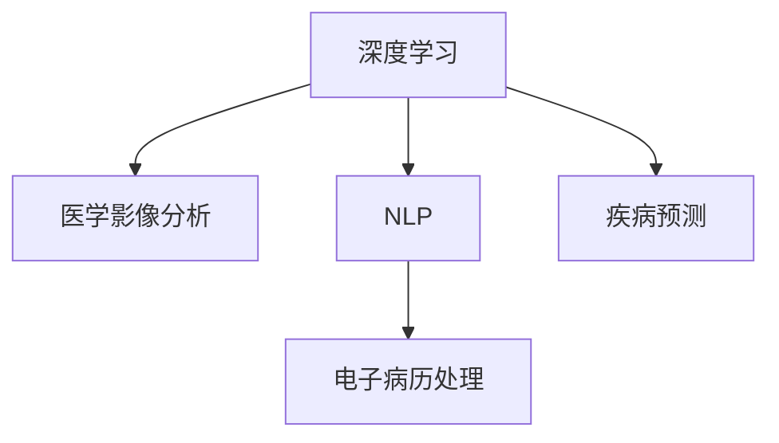

                 

# 深度学习在医疗诊断中的应用

> 关键词：深度学习,医疗诊断,医学影像,自然语言处理,电子病历,疾病预测

## 1. 背景介绍

### 1.1 问题由来
深度学习在医疗领域的应用，始于影像分析和自然语言处理技术的突破。近年来，随着深度学习模型的不断发展和算力的提升，医疗诊断系统的智能化水平得到了极大的提高。

深度学习在医疗诊断中主要应用于以下几个方面：
- **医学影像分析**：通过卷积神经网络(CNN)对医学影像进行疾病诊断。
- **电子病历处理**：利用自然语言处理(NLP)技术对电子病历文本进行疾病预测、症状分析等。
- **疾病预测**：通过深度学习模型对患者数据进行分析，预测未来可能出现的疾病。

## 2. 核心概念与联系

### 2.1 核心概念概述

为更好地理解深度学习在医疗诊断中的应用，本节将介绍几个密切相关的核心概念：

- **深度学习(Deep Learning)**：一种通过多层次神经网络模型进行特征提取和数据分析的技术。
- **医学影像分析**：使用深度学习模型对医学影像进行自动识别和诊断的技术。
- **自然语言处理(NLP)**：使用深度学习模型对文本数据进行自然语言理解、文本生成等处理。
- **电子病历(Electronic Health Records, EHR)**：医疗机构用于记录和管理患者健康信息的数字化文档。
- **疾病预测**：使用深度学习模型对患者历史数据进行分析，预测未来可能出现的疾病。

这些核心概念之间的逻辑关系可以通过以下Mermaid流程图来展示：



这个流程图展示深度学习在医疗诊断中的核心概念及其之间的关系：

1. 深度学习是医疗诊断中的基础技术，可以应用于医学影像分析、电子病历处理、疾病预测等多个环节。
2. 医学影像分析利用深度学习模型进行图像识别，自动识别出医学影像中的病变区域。
3. 电子病历处理利用深度学习模型对文本数据进行理解，提取出有用的信息，为诊断和治疗提供支持。
4. 疾病预测利用深度学习模型对患者数据进行分析，预测未来可能出现的疾病，辅助医生制定治疗方案。

## 3. 核心算法原理 & 具体操作步骤
### 3.1 算法原理概述

深度学习在医疗诊断中的应用，通常依赖于大量的医学数据和医疗专家的知识。深度学习模型通过多层次的神经网络，自动提取和分析数据特征，从而实现对医学影像、电子病历等数据的深度理解。

具体来说，深度学习在医疗诊断中的应用原理包括：

- **医学影像分析**：使用卷积神经网络(CNN)对医学影像进行特征提取和分类。
- **电子病历处理**：使用序列到序列(Sequence to Sequence, Seq2Seq)模型对电子病历文本进行处理。
- **疾病预测**：使用深度学习模型对患者历史数据进行分析，预测未来可能出现的疾病。

### 3.2 算法步骤详解

基于深度学习的医疗诊断通常包括以下几个关键步骤：

**Step 1: 数据收集与预处理**

- **数据收集**：收集患者医学影像、电子病历、实验室数据等医疗数据，构建训练数据集。
- **数据预处理**：对数据进行清洗、归一化、标注等预处理操作，确保数据的质量和一致性。

**Step 2: 模型选择与构建**

- **模型选择**：根据具体任务选择合适的深度学习模型。如医学影像分析中使用卷积神经网络(CNN)，电子病历处理中使用Seq2Seq模型，疾病预测中使用循环神经网络(RNN)等。
- **模型构建**：构建深度学习模型的计算图，设置模型的超参数，如学习率、批大小、迭代轮数等。

**Step 3: 模型训练与验证**

- **模型训练**：使用训练数据集对模型进行迭代优化，最小化损失函数。
- **模型验证**：在验证数据集上评估模型的性能，选择最优模型进行微调。

**Step 4: 模型微调和部署**

- **模型微调**：根据验证集的表现，调整模型的超参数或进行模型的微调，提升模型性能。
- **模型部署**：将训练好的模型部署到实际应用中，集成到医疗诊断系统中。

**Step 5: 性能评估与监控**

- **性能评估**：在测试数据集上评估模型的性能，对比微调前后的效果。
- **监控与优化**：实时监测模型的运行状态，根据性能指标进行优化和调整。

### 3.3 算法优缺点

深度学习在医疗诊断中的应用具有以下优点：

1. **自动化处理**：深度学习模型可以自动从大量数据中提取特征，处理复杂的数据结构，提高诊断效率。
2. **泛化能力强**：深度学习模型能够从数据中学习到通用的知识，适应新数据和新场景的能力强。
3. **诊断精度高**：深度学习模型通过多层次网络结构，能够捕捉数据中的复杂关系，提高诊断的准确性。

同时，深度学习在医疗诊断中也有以下局限性：

1. **数据需求大**：深度学习模型需要大量的高质量标注数据进行训练，医疗数据获取和标注成本较高。
2. **模型复杂**：深度学习模型通常包含大量参数，训练和推理效率较低，需要高性能计算设备。
3. **解释性不足**：深度学习模型更像"黑盒"系统，难以解释其内部工作机制，增加了医疗决策的复杂性。
4. **伦理问题**：深度学习模型可能学习到有害信息，带来伦理和法律问题。

尽管存在这些局限性，但就目前而言，深度学习在医疗诊断中的应用前景广阔，已成为了医疗领域的重要技术手段。

### 3.4 算法应用领域

深度学习在医疗诊断中的应用已经涵盖了多个领域，包括但不限于：

- **医学影像分析**：如X光片、CT扫描、MRI等医学影像的自动诊断，包括肿瘤、骨折、感染等。
- **电子病历处理**：对电子病历文本进行症状提取、疾病分类、诊断报告生成等处理。
- **疾病预测**：利用患者历史数据，预测未来可能出现的疾病，如糖尿病、心脏病等。
- **病理图像分析**：对病理切片进行自动分类和分析，帮助病理医生进行疾病诊断。
- **健康监测**：通过可穿戴设备采集的生理数据，进行健康状态监测和疾病预警。

这些应用场景展示了深度学习在医疗诊断中的强大能力和广泛应用前景。

## 4. 数学模型和公式 & 详细讲解 & 举例说明

### 4.1 数学模型构建

以下是深度学习在医疗诊断中的几个关键数学模型的构建：

- **医学影像分析**：使用卷积神经网络(CNN)模型，输入为医学影像数据，输出为病变区域位置和大小。
- **电子病历处理**：使用序列到序列(Seq2Seq)模型，输入为电子病历文本，输出为疾病分类或诊断报告。
- **疾病预测**：使用循环神经网络(RNN)模型，输入为患者历史数据，输出为疾病发生概率。

### 4.2 公式推导过程

以医学影像分析中的CNN模型为例，其数学模型构建如下：

- **输入**：医学影像数据 $X \in \mathbb{R}^{C\times H \times W}$，其中 $C$ 为通道数，$H$ 和 $W$ 为图像高宽。
- **卷积层**：使用卷积核 $\omega \in \mathbb{R}^{F \times F \times C}$，对输入数据进行卷积操作。卷积操作定义为：
  $$
  X_{conv} = X * \omega
  $$
- **激活函数**：使用ReLU激活函数，增强模型的非线性表达能力。
- **池化层**：使用最大池化操作，减小特征图尺寸，保留主要特征。
- **全连接层**：将池化后的特征图展平，输入到全连接层，进行分类。

### 4.3 案例分析与讲解

以医学影像分析中的肺部CT扫描诊断为例，其步骤如下：

1. **数据准备**：收集包含肺癌的肺部CT扫描数据，并标注出病变区域。
2. **模型训练**：构建包含卷积层、池化层、全连接层的CNN模型，使用标注数据进行训练。
3. **模型验证**：在验证集上评估模型性能，选择最优模型进行微调。
4. **模型部署**：将训练好的模型集成到医疗诊断系统中，实现自动化的肺部CT扫描诊断。

## 5. 项目实践：代码实例和详细解释说明

### 5.1 开发环境搭建

在进行医疗诊断的深度学习项目开发前，我们需要准备好开发环境。以下是使用Python进行TensorFlow开发的简单配置：

1. 安装Anaconda：从官网下载并安装Anaconda，用于创建独立的Python环境。

2. 创建并激活虚拟环境：
```bash
conda create -n tf-env python=3.8 
conda activate tf-env
```

3. 安装TensorFlow：根据CUDA版本，从官网获取对应的安装命令。例如：
```bash
conda install tensorflow -c tf -c conda-forge
```

4. 安装TensorBoard：
```bash
pip install tensorboard
```

5. 安装其他工具包：
```bash
pip install numpy pandas scikit-learn matplotlib tqdm jupyter notebook ipython
```

完成上述步骤后，即可在`tf-env`环境中开始深度学习项目的开发。

### 5.2 源代码详细实现

下面我们以医学影像分析项目为例，给出使用TensorFlow实现肺部CT扫描诊断的代码实现。

首先，定义数据处理函数：

```python
import tensorflow as tf
from tensorflow.keras.preprocessing.image import ImageDataGenerator

def load_and_preprocess_data(data_dir, batch_size=32):
    train_datagen = ImageDataGenerator(rescale=1./255)
    test_datagen = ImageDataGenerator(rescale=1./255)

    train_generator = train_datagen.flow_from_directory(
        data_dir, 
        target_size=(256, 256), 
        batch_size=batch_size, 
        class_mode='binary')
    
    test_generator = test_datagen.flow_from_directory(
        data_dir, 
        target_size=(256, 256), 
        batch_size=batch_size, 
        class_mode='binary', 
        shuffle=False)

    return train_generator, test_generator
```

然后，定义模型：

```python
from tensorflow.keras.layers import Input, Conv2D, MaxPooling2D, Flatten, Dense, Dropout
from tensorflow.keras.models import Model

input_image = Input(shape=(256, 256, 3))
x = Conv2D(32, (3, 3), activation='relu')(input_image)
x = MaxPooling2D((2, 2))(x)
x = Conv2D(64, (3, 3), activation='relu')(x)
x = MaxPooling2D((2, 2))(x)
x = Conv2D(128, (3, 3), activation='relu')(x)
x = MaxPooling2D((2, 2))(x)
x = Conv2D(256, (3, 3), activation='relu')(x)
x = MaxPooling2D((2, 2))(x)
x = Flatten()(x)
x = Dense(256, activation='relu')(x)
x = Dropout(0.5)(x)
x = Dense(1, activation='sigmoid')(x)

model = Model(input_image, x)
```

接着，定义训练和评估函数：

```python
from tensorflow.keras.optimizers import Adam
from tensorflow.keras.callbacks import EarlyStopping

def train_model(model, train_generator, test_generator, epochs=10, batch_size=32):
    model.compile(optimizer=Adam(lr=1e-4), loss='binary_crossentropy', metrics=['accuracy'])

    early_stopping = EarlyStopping(patience=5)
    history = model.fit(train_generator, validation_data=test_generator, epochs=epochs, batch_size=batch_size, callbacks=[early_stopping])

    return history
```

最后，启动训练流程并在测试集上评估：

```python
train_dir = 'train/'
test_dir = 'test/'

train_generator, test_generator = load_and_preprocess_data(train_dir, batch_size=32)
history = train_model(model, train_generator, test_generator, epochs=10, batch_size=32)

test_loss, test_accuracy = model.evaluate(test_generator)

print(f"Test Loss: {test_loss:.4f}")
print(f"Test Accuracy: {test_accuracy:.4f}")
```

以上即为使用TensorFlow实现肺部CT扫描诊断的完整代码实现。可以看到，深度学习模型通过卷积神经网络提取医学影像特征，并通过全连接层进行分类。

### 5.3 代码解读与分析

让我们再详细解读一下关键代码的实现细节：

**load_and_preprocess_data函数**：
- 定义数据处理函数，使用ImageDataGenerator对医学影像数据进行归一化、增强等预处理。
- 通过flow_from_directory方法加载数据，将训练集和测试集划分为图像和标签两部分。

**train_model函数**：
- 定义训练函数，使用Adam优化器、二元交叉熵损失函数、准确率指标进行模型编译。
- 设置EarlyStopping回调，当模型性能不再提升时停止训练，避免过拟合。
- 使用fit方法进行模型训练，并在测试集上进行评估。

**训练流程**：
- 加载训练集和测试集数据。
- 定义模型，包含卷积层、池化层、全连接层等结构。
- 使用编译后的模型进行训练，并在测试集上进行评估。

可以看到，TensorFlow提供了强大的工具和库，使得深度学习模型的实现变得更加简单高效。开发者可以根据具体任务，通过修改模型结构和参数，快速迭代和优化深度学习模型。

## 6. 实际应用场景

### 6.1 智能诊断系统

基于深度学习的医疗诊断系统，可以应用于智能诊断设备的开发，提升诊断效率和准确性。例如：

- **智能CT扫描机**：在CT扫描过程中，结合深度学习模型自动标注病变区域，辅助医生进行诊断。
- **智能病理切片分析**：对病理切片进行自动分类和标注，减轻病理医生工作负担。
- **智能手术辅助系统**：通过深度学习模型对医学影像进行手术规划和辅助，提高手术精准度。

这些系统将深度学习模型与传统医疗设备结合，提升诊断和治疗的智能化水平。

### 6.2 健康监测系统

深度学习在健康监测领域，可以用于可穿戴设备的数据分析和疾病预警。例如：

- **心脏健康监测**：通过可穿戴设备采集的心电图等生理数据，使用深度学习模型进行分析和预警。
- **糖尿病健康监测**：对糖尿病患者的血糖、血压等生理数据进行分析，预测血糖波动。
- **睡眠监测系统**：通过监测睡眠质量，使用深度学习模型预测失眠和睡眠障碍。

这些系统通过深度学习模型，实现对生理数据的实时监测和分析，帮助用户及时发现健康问题，提供个性化的健康管理方案。

### 6.3 远程医疗

深度学习在远程医疗中的应用，可以实现医生与患者之间的远程诊断和咨询。例如：

- **远程诊断系统**：结合深度学习模型，医生可以通过视频和影像数据，对患者进行远程诊断。
- **健康咨询平台**：通过深度学习模型，患者可以输入症状，系统自动生成诊断报告和建议。
- **健康数据分析平台**：使用深度学习模型对患者数据进行分析和预测，提供个性化的健康管理方案。

这些系统通过深度学习模型，实现医疗资源的远程共享和优化分配，提升医疗服务的普及性和可及性。

### 6.4 未来应用展望

深度学习在医疗诊断中的应用，未来将呈现以下几个趋势：

1. **多模态融合**：将医学影像、电子病历、生理数据等多模态数据进行融合分析，提升诊断的准确性和全面性。
2. **个性化医疗**：通过深度学习模型对患者数据进行分析，制定个性化的治疗方案，提升治疗效果。
3. **智能诊断助理**：结合深度学习模型和专家知识库，构建智能诊断助理，辅助医生进行诊断和治疗决策。
4. **远程健康监测**：通过深度学习模型对可穿戴设备采集的数据进行分析和预警，实现远程健康监测和管理。
5. **智能病历生成**：使用深度学习模型对电子病历文本进行处理，生成详细的诊断报告和处理建议。

这些趋势展示了深度学习在医疗诊断中的广阔前景，将深度学习与医疗领域深度融合，为医疗诊断和治疗带来革命性变化。

## 7. 工具和资源推荐
### 7.1 学习资源推荐

为帮助开发者系统掌握深度学习在医疗诊断中的应用，这里推荐一些优质的学习资源：

1. **《深度学习》系列书籍**：由深度学习领域的知名专家撰写，全面介绍了深度学习的基本概念和算法，包括医疗诊断中的深度学习应用。
2. **Coursera《深度学习专项课程》**：由斯坦福大学和密歇根大学提供的深度学习课程，涵盖深度学习的基础知识和应用实例，包括医疗诊断。
3. **DeepLearning.AI《深度学习AI系列课程》**：由深度学习领域的权威机构提供，包括深度学习在医疗、金融等领域的实践应用。
4. **Google AI《医学图像分析》课程**：由谷歌AI提供，涵盖医学图像分析的深度学习技术和实践案例。
5. **HuggingFace《深度学习在医疗领域的应用》白皮书**：详细介绍了深度学习在医疗领域的各类应用场景和技术细节。

通过对这些资源的学习实践，相信你一定能够快速掌握深度学习在医疗诊断中的应用。

### 7.2 开发工具推荐

高效的开发离不开优秀的工具支持。以下是几款用于深度学习在医疗诊断开发的常用工具：

1. **TensorFlow**：谷歌主导的深度学习框架，提供了强大的计算图和分布式训练功能，适合大规模工程应用。
2. **Keras**：基于TensorFlow的高级深度学习库，提供了简单易用的API，适合快速原型开发和实验。
3. **PyTorch**：由Facebook开发的深度学习框架，提供了动态计算图和丰富的API，适合研究和实验。
4. **Jupyter Notebook**：免费的交互式开发环境，支持Python和R等多种语言，适合数据探索和模型训练。
5. **Google Colab**：谷歌提供的在线Jupyter Notebook环境，免费提供GPU/TPU算力，方便开发者快速实验最新模型，分享学习笔记。

合理利用这些工具，可以显著提升深度学习在医疗诊断任务的开发效率，加快创新迭代的步伐。

### 7.3 相关论文推荐

深度学习在医疗诊断领域的研究源于学界的持续探索。以下是几篇奠基性的相关论文，推荐阅读：

1. **Convolutional Neural Networks for Sentence Classification**：提出使用卷积神经网络对文本数据进行情感分类，为电子病历文本分析提供了新的思路。
2. **A Survey of Deep Learning Techniques for Medical Imaging**：综述了深度学习在医学影像分析中的最新进展和技术细节。
3. **Sequence-to-Sequence Learning with Neural Networks**：提出使用序列到序列模型对文本数据进行处理，为电子病历文本分析和生成提供了新的方法。
4. **Deep Learning in Clinical Medicine**：综述了深度学习在临床医学中的应用，包括疾病预测、健康监测等。
5. **ImageNet Classification with Deep Convolutional Neural Networks**：提出了使用深度卷积神经网络进行图像分类的方法，为医学影像分析提供了重要的基础。

这些论文代表了深度学习在医疗诊断领域的研究进展，为后续研究提供了丰富的理论基础和技术支持。

## 8. 总结：未来发展趋势与挑战

### 8.1 总结

本文对深度学习在医疗诊断中的应用进行了全面系统的介绍。首先阐述了深度学习在医疗诊断中的重要性和应用场景，明确了深度学习在医学影像分析、电子病历处理、疾病预测等方面的关键作用。其次，从原理到实践，详细讲解了深度学习在医疗诊断中的应用原理和操作步骤，给出了具体的代码实现。同时，本文还广泛探讨了深度学习在医疗诊断中的实际应用场景，展示了其广阔的应用前景。

通过本文的系统梳理，可以看到，深度学习在医疗诊断中的强大能力和广阔前景，已经成为医疗领域的重要技术手段。未来，伴随深度学习模型的不断发展和优化，将进一步推动医疗诊断的智能化、精准化发展，为人类健康带来更多保障。

### 8.2 未来发展趋势

展望未来，深度学习在医疗诊断中的应用将呈现以下几个趋势：

1. **多模态融合**：将医学影像、电子病历、生理数据等多模态数据进行融合分析，提升诊断的准确性和全面性。
2. **个性化医疗**：通过深度学习模型对患者数据进行分析，制定个性化的治疗方案，提升治疗效果。
3. **智能诊断助理**：结合深度学习模型和专家知识库，构建智能诊断助理，辅助医生进行诊断和治疗决策。
4. **远程健康监测**：通过深度学习模型对可穿戴设备采集的数据进行分析和预警，实现远程健康监测和管理。
5. **智能病历生成**：使用深度学习模型对电子病历文本进行处理，生成详细的诊断报告和处理建议。

这些趋势展示了深度学习在医疗诊断中的广阔前景，将深度学习与医疗领域深度融合，为医疗诊断和治疗带来革命性变化。

### 8.3 面临的挑战

尽管深度学习在医疗诊断中的应用前景广阔，但在实际应用中仍面临诸多挑战：

1. **数据隐私和安全**：深度学习模型需要大量的患者数据进行训练，如何保护患者隐私和数据安全是一个重要问题。
2. **模型可解释性**：深度学习模型通常更像"黑盒"系统，难以解释其内部工作机制和决策逻辑，增加了医疗决策的复杂性。
3. **伦理问题**：深度学习模型可能学习到有害信息，带来伦理和法律问题。
4. **计算资源限制**：深度学习模型通常需要大量的计算资源进行训练和推理，如何优化模型结构和提高计算效率是一个重要问题。
5. **跨领域适应性**：深度学习模型在不同领域的应用效果可能差异较大，如何提高模型的跨领域适应性是一个重要研究方向。

这些挑战需要进一步研究和解决，才能真正实现深度学习在医疗诊断中的大规模应用。

### 8.4 研究展望

面对深度学习在医疗诊断中面临的挑战，未来的研究需要在以下几个方面寻求新的突破：

1. **隐私保护技术**：研究如何保护患者隐私和数据安全，确保医疗数据的合法合规使用。
2. **模型可解释性**：研究如何提高深度学习模型的可解释性，增强医疗决策的透明性和可信度。
3. **伦理与法律研究**：研究深度学习模型在医疗诊断中的伦理问题，制定相关法律法规，保障医疗安全和患者权益。
4. **跨领域适应性**：研究如何提高深度学习模型的跨领域适应性，增强其在不同领域的应用效果。
5. **计算资源优化**：研究如何优化深度学习模型的结构，提高计算效率，适应大规模医疗数据的应用需求。

这些研究方向将进一步推动深度学习在医疗诊断中的应用，为医疗诊断和治疗带来更多创新和突破。总之，深度学习在医疗诊断中的应用前景广阔，需要更多的研究者和从业者共同努力，推动深度学习与医疗领域的深度融合，为人类健康事业做出更大的贡献。

## 9. 附录：常见问题与解答

**Q1：深度学习在医疗诊断中的数据需求有哪些？**

A: 深度学习在医疗诊断中的应用需要大量的高质量标注数据进行训练，包括医学影像、电子病历、生理数据等。获取和标注这些数据需要耗费大量人力和物力，因此在数据获取和标注过程中需要特别注意数据的质量和隐私保护。

**Q2：深度学习在医疗诊断中的模型结构有哪些？**

A: 深度学习在医疗诊断中的应用主要依赖于卷积神经网络(CNN)、序列到序列(Seq2Seq)模型、循环神经网络(RNN)等结构。CNN适用于医学影像分析，Seq2Seq模型适用于电子病历文本处理，RNN适用于疾病预测等。

**Q3：深度学习在医疗诊断中的训练和推理效率如何？**

A: 深度学习在医疗诊断中的应用通常需要大量的计算资源进行训练和推理，特别是在处理大规模医学数据时。因此，优化模型结构和提高计算效率是提高深度学习在医疗诊断中应用效果的重要方向。

**Q4：深度学习在医疗诊断中的伦理问题有哪些？**

A: 深度学习在医疗诊断中的应用需要特别注意伦理问题，包括数据隐私保护、模型偏见和歧视等。需要建立严格的伦理审查机制，确保深度学习模型的公平性和安全性。

**Q5：深度学习在医疗诊断中的未来发展方向有哪些？**

A: 深度学习在医疗诊断中的未来发展方向包括多模态融合、个性化医疗、智能诊断助理、远程健康监测、智能病历生成等。这些方向将进一步推动深度学习与医疗领域的深度融合，为医疗诊断和治疗带来更多创新和突破。

---

作者：禅与计算机程序设计艺术 / Zen and the Art of Computer Programming

