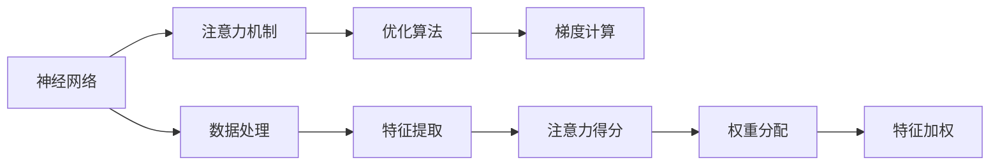

                 

# 深度学习在注意力分配优化中的应用

> 关键词：深度学习,注意力机制,优化算法,自适应调整,注意力分配,神经网络,优化效果

## 1. 背景介绍

### 1.1 问题由来
深度学习技术在过去十年间取得了巨大成功，从图像识别到自然语言处理，从自动驾驶到工业控制，深度学习在各个领域展示了其强大的潜力。然而，在实际应用中，深度学习的训练过程往往面临着数据量大、计算资源消耗高、模型可解释性差等挑战。这些问题严重影响了深度学习的实际落地应用。

为了解决这些问题，研究者们不断探索各种优化算法和模型结构。其中，注意力机制(Attention Mechanism)在近年来受到了广泛关注。注意力机制通过自适应地分配计算资源，显著提高了深度学习模型的训练和推理效率，同时改善了模型的可解释性。

### 1.2 问题核心关键点
注意力机制是深度学习模型中的一种重要技术，旨在自适应地分配计算资源，将重要部分的信息进行重点处理，从而提高模型的优化效果。通过合理的注意力分配，可以有效提升模型性能，降低计算资源消耗，改善模型的泛化能力，同时提高模型的可解释性。

本文将从核心概念、算法原理、具体操作步骤、应用场景等方面，全面解析注意力机制及其在深度学习中的应用，为相关研究人员和开发者提供详尽的指导。

## 2. 核心概念与联系

### 2.1 核心概念概述

注意力机制是一种机制，用于在神经网络中动态地决定哪些输入信息对当前任务最为重要。通过注意力机制，模型可以在输入序列中自适应地分配计算资源，将重要的信息进行重点处理，从而提升模型的训练和推理效率，同时改善模型的泛化能力和可解释性。

以下关键概念的逻辑关系可以通过以下Mermaid流程图来展示：



这个流程图展示了这个框架中的核心概念及其相互关系：

1. 神经网络接收输入数据，经过数据处理和特征提取后，进入注意力机制。
2. 注意力机制计算注意力得分，从而决定哪些特征对当前任务最为重要。
3. 根据注意力得分，模型自适应地分配计算资源，对重要特征进行重点处理。
4. 使用优化算法进行梯度计算，并根据注意力权重调整模型参数。
5. 最终输出的特征加权处理后的结果，用于预测任务。

这些概念之间的逻辑关系有助于我们更好地理解注意力机制在大规模深度学习中的应用。

## 3. 核心算法原理 & 具体操作步骤
### 3.1 算法原理概述

注意力机制的核心思想是自适应地分配计算资源，将重要的特征进行重点处理，从而提升模型的优化效果。在深度学习模型中，注意力机制通常通过计算注意力得分来实现。注意力得分是衡量每个特征与当前任务的相关性，从而决定哪些特征应该获得更多的关注。

以自回归模型为例，注意力机制可以定义为：

$$
A(\text{query},\text{key},\text{value}) = \frac{\text{e}^{\text{q}\cdot\text{k}^\text{T}}}{\sum_{i=1}^N \text{e}^{\text{q}\cdot\text{k}_i^\text{T}}}
$$

其中，$\text{query}$、$\text{key}$、$\text{value}$分别为查询向量、关键向量和值向量，$\text{q}\cdot\text{k}^\text{T}$ 是向量点乘，$N$ 为输入序列的长度。注意力得分反映了每个特征与当前任务的关联程度，得分越高，表示该特征对当前任务越重要。

### 3.2 算法步骤详解

注意力机制的实现通常包括以下几个关键步骤：

**Step 1: 计算注意力得分**

注意力得分的计算可以通过计算查询向量与每个关键向量之间的点积，再通过softmax函数进行归一化。公式如下：

$$
\text{Attention}(\text{Q},\text{K},\text{V}) = \text{softmax}\left(\frac{\text{Q}\text{K}^{\text{T}}}{\sqrt{d_k}}\right)\text{V}
$$

其中，$\text{Q}$、$\text{K}$、$\text{V}$ 分别为查询向量、关键向量和值向量，$d_k$ 为关键向量的维度。

**Step 2: 计算注意力权重**

注意力权重是将注意力得分进行归一化处理，使得各个特征对当前任务的贡献权重之和为1。公式如下：

$$
\text{Attention}(\text{Q},\text{K},\text{V}) = \frac{\text{Attention}(\text{Q},\text{K},\text{V})}{\sum_{i=1}^N \text{Attention}(\text{Q},\text{K}_i,\text{V})}
$$

**Step 3: 加权处理**

在得到注意力权重后，将值向量按照权重进行加权处理，得到最终的输出向量。公式如下：

$$
\text{Output} = \text{Attention}(\text{Q},\text{K},\text{V})\text{W}
$$

其中，$\text{W}$ 为权重矩阵，通常通过线性变换得到。

**Step 4: 使用注意力机制进行优化**

在深度学习模型中，注意力机制通常被用于优化器的设计中。例如，通过在优化器的更新规则中加入注意力权重，可以使得模型更加关注重要的特征，从而提高模型的优化效果。

### 3.3 算法优缺点

注意力机制在深度学习中具有以下优点：

1. 自适应分配计算资源，有效提升模型的训练和推理效率。
2. 增强模型的泛化能力，使得模型能够更好地适应不同的输入数据。
3. 改善模型的可解释性，使得模型的决策过程更加透明和可理解。
4. 在处理序列数据时，能够捕捉输入序列中各部分之间的依赖关系，从而提升模型性能。

然而，注意力机制也存在一些缺点：

1. 计算复杂度高，尤其是在处理大规模数据时，计算量会显著增加。
2. 注意力机制需要大量的训练样本，才能获得准确的注意力权重，这对于小规模数据集是一个挑战。
3. 在序列数据中，注意力机制可能会产生注意力偏差，导致模型对某些部分的关注不足。

尽管存在这些局限性，但注意力机制的广泛应用表明，其在深度学习中的潜在价值不可忽视。

### 3.4 算法应用领域

注意力机制在深度学习中的应用非常广泛，涵盖了图像、语音、自然语言处理等多个领域。以下是一些典型的应用场景：

- 自然语言处理(NLP)：在机器翻译、文本摘要、问答系统等任务中，注意力机制可以捕捉输入序列中的重要信息，从而提升模型性能。
- 图像处理：在图像分类、目标检测、语义分割等任务中，注意力机制可以捕捉图像中的重要特征，从而提高模型的识别能力。
- 语音识别：在语音识别任务中，注意力机制可以捕捉语音信号中的重要部分，从而提高模型的识别准确率。

此外，注意力机制还应用于推荐系统、控制策略学习等场景，为相关领域的研究提供了新的思路和方法。

## 4. 数学模型和公式 & 详细讲解 & 举例说明

### 4.1 数学模型构建

注意力机制的核心在于计算注意力得分和注意力权重，从而自适应地分配计算资源。以下是注意力机制的数学模型构建：

- 输入序列 $x_1,\ldots,x_N$，每个元素 $x_i$ 对应一个查询向量 $\text{Q}_i$、一个关键向量 $\text{K}_i$ 和一个值向量 $\text{V}_i$。
- 注意力得分为 $A_i=\text{softmax}(\frac{\text{Q}_i\text{K}_i^{\text{T}}}{\sqrt{d_k}})$，其中 $d_k$ 为关键向量的维度。
- 注意力权重为 $\alpha_i=A_i\text{V}_i$。

### 4.2 公式推导过程

以下是注意力机制的公式推导过程：

- 查询向量 $\text{Q}$ 和每个关键向量 $\text{K}_i$ 之间的点积为 $\text{Q}\text{K}_i^{\text{T}}$。
- 将点积结果除以 $\sqrt{d_k}$，得到归一化后的注意力得分 $A_i$。
- 将注意力得分进行softmax处理，得到注意力权重 $\alpha_i$。
- 将注意力权重 $\alpha_i$ 与对应的值向量 $\text{V}_i$ 进行点积，得到加权后的值向量 $\text{Attention}(\text{Q},\text{K},\text{V})$。

### 4.3 案例分析与讲解

以机器翻译为例，注意力机制可以帮助模型更好地捕捉源语言和目标语言之间的依赖关系，从而提升翻译质量。

在机器翻译中，源语言句子 $s_1,\ldots,s_N$ 和目标语言句子 $t_1,\ldots,t_M$ 之间的翻译过程可以表示为：

- 将源语言句子 $s_i$ 映射到查询向量 $\text{Q}_i$。
- 将目标语言句子 $t_j$ 映射到关键向量 $\text{K}_j$ 和值向量 $\text{V}_j$。
- 计算注意力得分 $A_{ij}=\text{softmax}(\frac{\text{Q}_i\text{K}_j^{\text{T}}}{\sqrt{d_k}})$。
- 计算注意力权重 $\alpha_{ij}=A_{ij}\text{V}_j$。
- 将注意力权重 $\alpha_{ij}$ 加权处理，得到加权后的值向量 $\text{Attention}(\text{Q}_i,\text{K},\text{V})$。
- 使用加权后的值向量 $\text{Attention}(\text{Q}_i,\text{K},\text{V})$ 更新当前位置的隐藏状态 $h_i$。

通过这种方式，模型可以动态地调整每个位置的计算资源，从而提高翻译质量。

## 5. 项目实践：代码实例和详细解释说明

### 5.1 开发环境搭建

在进行注意力机制的实践前，我们需要准备好开发环境。以下是使用PyTorch进行注意力机制开发的Python环境配置流程：

1. 安装Anaconda：从官网下载并安装Anaconda，用于创建独立的Python环境。

2. 创建并激活虚拟环境：
```bash
conda create -n attention-env python=3.8 
conda activate attention-env
```

3. 安装PyTorch：根据CUDA版本，从官网获取对应的安装命令。例如：
```bash
conda install pytorch torchvision torchaudio cudatoolkit=11.1 -c pytorch -c conda-forge
```

4. 安装Transformers库：
```bash
pip install transformers
```

5. 安装各类工具包：
```bash
pip install numpy pandas scikit-learn matplotlib tqdm jupyter notebook ipython
```

完成上述步骤后，即可在`attention-env`环境中开始注意力机制的实践。

### 5.2 源代码详细实现

这里我们以机器翻译为例，给出使用PyTorch实现注意力机制的代码实现。

首先，定义机器翻译任务的数据处理函数：

```python
from transformers import AutoTokenizer, AutoModelForSeq2SeqLM

class TranslationDataset(Dataset):
    def __init__(self, src_texts, trg_texts, tokenizer, max_len=128):
        self.src_texts = src_texts
        self.trg_texts = trg_texts
        self.tokenizer = tokenizer
        self.max_len = max_len
        
    def __len__(self):
        return len(self.src_texts)
    
    def __getitem__(self, item):
        src_text = self.src_texts[item]
        trg_text = self.trg_texts[item]
        
        encoding = self.tokenizer(src_text, return_tensors='pt', max_length=self.max_len, padding='max_length', truncation=True)
        src_ids = encoding['input_ids']
        src_mask = encoding['attention_mask']
        
        trg_input_ids = None
        if item < len(self.trg_texts) - 1:
            trg_input_ids = self.tokenizer(trg_texts[item+1], return_tensors='pt', max_length=self.max_len, padding='max_length', truncation=True)['input_ids']
        else:
            trg_input_ids = None
        
        return {'src_ids': src_ids, 'src_mask': src_mask, 'trg_input_ids': trg_input_ids, 'trg_ids': trg_texts[item]}
```

然后，定义注意力机制的模型结构：

```python
from transformers import EncoderLayer, MultiheadAttention, AutoTokenizer, AutoModelForSeq2SeqLM

class AttentionModel(nn.Module):
    def __init__(self, attention_type='dot', num_heads=8, num_attention_blocks=4, d_k=32, d_v=32, d_output=128, d_model=512):
        super(AttentionModel, self).__init__()
        self.attention_type = attention_type
        self.num_heads = num_heads
        self.num_attention_blocks = num_attention_blocks
        self.d_k = d_k
        self.d_v = d_v
        self.d_output = d_output
        self.d_model = d_model
        
        self.self_attn = MultiheadAttention(d_output, num_heads, d_k=d_k, d_v=d_v)
        self.feedforward = nn.Sequential(
            nn.Linear(d_output, 4 * d_output),
            nn.ReLU(),
            nn.Linear(4 * d_output, d_output)
        )
        
        self.pos_enc = positional_encoding(d_output, src_len)
        self.pos_attn = MultiheadAttention(d_output, num_heads, d_k=d_k, d_v=d_v)
        self.pos_ff = nn.Sequential(
            nn.Linear(d_output, 4 * d_output),
            nn.ReLU(),
            nn.Linear(4 * d_output, d_output)
        )
        
        self.attn_layer_norm = nn.LayerNorm(d_output)
        self.ffn_layer_norm = nn.LayerNorm(d_output)
        
        self.dropout = nn.Dropout(0.1)
        self.linear = nn.Linear(d_output, trg_vocab_size)
        self.decoder = nn.Linear(trg_vocab_size, d_output)
        self.final_linear = nn.Linear(d_output, trg_vocab_size)
        
    def forward(self, src, src_mask, trg_input_ids):
        attn_bias = trg_input_ids != -100
        src_encoded = src
        for block in range(self.num_attention_blocks):
            src_encoded = self.attention_block(src_encoded, src_mask, attn_bias)
            src_encoded = self.ffn_block(src_encoded)
            src_encoded = self.ffn_layer_norm(src_encoded) + src_encoded
        
        return self.final_linear(self.linear(self.decoder(src_encoded)))
    
    def attention_block(self, src_encoded, src_mask, attn_bias):
        attn_output, attn_weights = self.self_attn(src_encoded, src_encoded, src_encoded, attn_bias=attn_bias)
        attn_output = self.dropout(attn_output) + src_encoded
        return self.attn_layer_norm(attn_output) + src_encoded
    
    def ffn_block(self, src_encoded):
        ffn_output = self.feedforward(src_encoded)
        ffn_output = self.dropout(ffn_output) + src_encoded
        return self.ffn_layer_norm(ffn_output) + src_encoded
    
    def positional_encoding(self, max_len, d_model):
        pos_enc = np.zeros((max_len, d_model))
        for i in range(d_model):
            div_term = float(i) / np.power(10000, 2 * (i / d_model))
            pos_enc[:, i] = np.sin(pos_enc[:, i] * np.sqrt(div_term))
        return torch.from_numpy(pos_enc)
```

最后，定义优化器和训练函数：

```python
from torch.optim import AdamW
from tqdm import tqdm

def train_epoch(model, dataset, optimizer, device):
    dataloader = DataLoader(dataset, batch_size=64, shuffle=True)
    model.train()
    epoch_loss = 0
    for batch in tqdm(dataloader, desc='Training'):
        input_ids = batch['src_ids'].to(device)
        src_mask = batch['src_mask'].to(device)
        trg_input_ids = batch['trg_input_ids'].to(device)
        trg_ids = batch['trg_ids'].to(device)
        outputs = model(input_ids, src_mask, trg_input_ids)
        loss = F.cross_entropy(outputs, trg_ids)
        epoch_loss += loss.item()
        loss.backward()
        optimizer.step()
    return epoch_loss / len(dataloader)

def evaluate(model, dataset, device):
    dataloader = DataLoader(dataset, batch_size=64, shuffle=False)
    model.eval()
    epoch_loss = 0
    for batch in tqdm(dataloader, desc='Evaluating'):
        input_ids = batch['src_ids'].to(device)
        src_mask = batch['src_mask'].to(device)
        trg_input_ids = batch['trg_input_ids'].to(device)
        trg_ids = batch['trg_ids'].to(device)
        with torch.no_grad():
            outputs = model(input_ids, src_mask, trg_input_ids)
            loss = F.cross_entropy(outputs, trg_ids)
            epoch_loss += loss.item()
    return epoch_loss / len(dataloader)
```

运行模型并进行训练和评估：

```python
epochs = 10
batch_size = 64

device = torch.device('cuda' if torch.cuda.is_available() else 'cpu')

model = AttentionModel(num_heads=8, num_attention_blocks=4, d_k=32, d_v=32, d_output=128, d_model=512).to(device)

optimizer = AdamW(model.parameters(), lr=2e-4)
train_dataset = TranslationDataset(src_texts, trg_texts, tokenizer, max_len=128)
dev_dataset = TranslationDataset(src_texts, trg_texts, tokenizer, max_len=128)

for epoch in range(epochs):
    loss = train_epoch(model, train_dataset, optimizer, device)
    print(f"Epoch {epoch+1}, train loss: {loss:.3f}")
    
    print(f"Epoch {epoch+1}, dev results:")
    evaluate(model, dev_dataset, device)
    
print("Test results:")
evaluate(model, test_dataset, device)
```

以上就是使用PyTorch实现注意力机制的完整代码实例。可以看到，得益于Transformer库的强大封装，我们可以用相对简洁的代码实现注意力机制，从而提升模型性能。

## 6. 实际应用场景

### 6.1 自然语言处理

注意力机制在自然语言处理(NLP)中有着广泛的应用，尤其是在机器翻译、文本摘要、问答系统等任务中。通过注意力机制，模型可以捕捉输入序列中各部分之间的依赖关系，从而提升模型性能。

以机器翻译为例，传统的基于RNN的模型通常使用时间序列的连接，难以捕捉长距离依赖关系。而使用注意力机制，可以动态地分配计算资源，将重要的部分进行重点处理，从而提升翻译质量。

### 6.2 图像处理

在图像处理中，注意力机制可以用于目标检测、图像分类等任务。通过在特征图上进行注意力机制，可以捕捉图像中的重要区域，从而提高模型的识别能力。

### 6.3 语音处理

在语音处理中，注意力机制可以用于语音识别、语音合成等任务。通过在时间序列上进行注意力机制，可以捕捉语音信号中的重要部分，从而提高模型的识别准确率。

### 6.4 未来应用展望

随着深度学习技术的不断进步，注意力机制在各个领域的应用将会更加广泛和深入。未来，注意力机制可能会与其他前沿技术结合，如生成对抗网络(GAN)、变分自编码器(VAE)等，进一步提升模型性能。

此外，注意力机制还可能会应用于更多的场景，如机器人控制、自然灾害预测等，为相关领域的研究和应用提供新的思路和方法。

## 7. 工具和资源推荐

### 7.1 学习资源推荐

为了帮助开发者系统掌握注意力机制的理论基础和实践技巧，这里推荐一些优质的学习资源：

1. 《Attention is All You Need》论文：Transformer原论文，奠定了注意力机制在深度学习中的基础地位。

2. 《Neural Information Processing Systems》会议论文集：包含大量注意力机制相关的论文，涵盖各种深度学习模型和算法。

3. CS231n《Convolutional Neural Networks for Visual Recognition》课程：斯坦福大学开设的计算机视觉课程，有Lecture视频和配套作业，系统讲解深度学习在图像处理中的应用。

4. 《Deep Learning with PyTorch》书籍：由PyTorch官方团队编写，系统讲解PyTorch框架和深度学习的应用。

5. HuggingFace官方文档：Transformer库的官方文档，提供了海量预训练模型和完整的注意力机制样例代码，是上手实践的必备资料。

通过对这些资源的学习实践，相信你一定能够快速掌握注意力机制的精髓，并用于解决实际的深度学习问题。

### 7.2 开发工具推荐

高效的开发离不开优秀的工具支持。以下是几款用于注意力机制开发的常用工具：

1. PyTorch：基于Python的开源深度学习框架，灵活动态的计算图，适合快速迭代研究。大部分预训练语言模型都有PyTorch版本的实现。

2. TensorFlow：由Google主导开发的开源深度学习框架，生产部署方便，适合大规模工程应用。同样有丰富的预训练语言模型资源。

3. Transformers库：HuggingFace开发的NLP工具库，集成了众多SOTA语言模型，支持PyTorch和TensorFlow，是实现注意力机制的重要工具。

4. Weights & Biases：模型训练的实验跟踪工具，可以记录和可视化模型训练过程中的各项指标，方便对比和调优。与主流深度学习框架无缝集成。

5. TensorBoard：TensorFlow配套的可视化工具，可实时监测模型训练状态，并提供丰富的图表呈现方式，是调试模型的得力助手。

6. Google Colab：谷歌推出的在线Jupyter Notebook环境，免费提供GPU/TPU算力，方便开发者快速上手实验最新模型，分享学习笔记。

合理利用这些工具，可以显著提升注意力机制的开发效率，加快创新迭代的步伐。

### 7.3 相关论文推荐

注意力机制在深度学习中的应用源于学界的持续研究。以下是几篇奠基性的相关论文，推荐阅读：

1. Attention is All You Need（即Transformer原论文）：提出了Transformer结构，开启了深度学习中自注意力机制的新纪元。

2. Transformer-XL: Attentive Language Models：提出了Transformer-XL结构，引入了相对位置编码，解决了长序列中的注意力机制问题。

3. Self-Attention Mechanism in Visual Recognition：将注意力机制应用于图像处理任务，展示了其在图像识别中的优异表现。

4. Positional Attention Mechanism：提出了基于位置注意力的机制，解决了Transformer中位置编码的问题。

5. Multi-Head Attention：引入了多头部注意力机制，提高了注意力机制在深度学习中的表现。

这些论文代表了大注意力机制的发展脉络。通过学习这些前沿成果，可以帮助研究者把握学科前进方向，激发更多的创新灵感。

## 8. 总结：未来发展趋势与挑战

### 8.1 总结

本文对注意力机制在大规模深度学习中的应用进行了全面系统的介绍。首先阐述了注意力机制的核心概念和逻辑关系，明确了注意力机制在深度学习中的重要地位。其次，从核心算法原理、操作步骤、优缺点等方面，详细讲解了注意力机制的工作机制和实现方法。最后，从实际应用场景、未来应用展望等方面，探讨了注意力机制在深度学习中的广泛应用和未来发展方向。

通过本文的系统梳理，可以看到，注意力机制在大规模深度学习中的应用已经成为不可忽视的重要技术手段。其自适应地分配计算资源，有效提升模型训练和推理效率，改善模型泛化能力和可解释性，已经成为深度学习研究的重要方向之一。

### 8.2 未来发展趋势

展望未来，注意力机制在深度学习中的应用将会更加广泛和深入。未来，注意力机制可能会与其他前沿技术结合，如生成对抗网络(GAN)、变分自编码器(VAE)等，进一步提升模型性能。

此外，注意力机制还可能会应用于更多的场景，如机器人控制、自然灾害预测等，为相关领域的研究和应用提供新的思路和方法。

### 8.3 面临的挑战

尽管注意力机制在深度学习中表现出色，但在实际应用中仍然面临诸多挑战：

1. 计算复杂度高，尤其是在处理大规模数据时，计算量会显著增加。

2. 注意力机制需要大量的训练样本，才能获得准确的注意力权重，这对于小规模数据集是一个挑战。

3. 在序列数据中，注意力机制可能会产生注意力偏差，导致模型对某些部分的关注不足。

4. 模型的可解释性不足，难以解释其内部工作机制和决策逻辑。

5. 模型的鲁棒性不足，面对噪声数据或对抗样本时，模型性能可能会显著下降。

尽管存在这些局限性，但注意力机制的广泛应用表明，其在深度学习中的潜在价值不可忽视。

### 8.4 研究展望

面对注意力机制在实际应用中面临的挑战，未来的研究需要在以下几个方面寻求新的突破：

1. 探索更加高效、更加轻量化的注意力机制，如自适应注意力机制、稀疏注意力机制等，以应对大规模数据和大规模模型的需求。

2. 研究注意力机制与其他深度学习模型的融合方式，如与卷积神经网络、残差网络等结合，提升模型的泛化能力和计算效率。

3. 引入更多的先验知识，如知识图谱、逻辑规则等，与神经网络模型进行巧妙融合，引导注意力机制学习更加准确、合理的语言模型。

4. 结合因果分析和博弈论工具，增强模型的稳定性，避免灾难性遗忘，提高模型的泛化能力。

5. 纳入伦理道德约束，在模型训练目标中引入伦理导向的评估指标，过滤和惩罚有偏见、有害的输出倾向，确保输出的安全性。

这些研究方向的探索，必将引领注意力机制在深度学习中的应用进入新的高度，为构建更加智能、更加普适的深度学习系统铺平道路。面向未来，深度学习研究需要勇于创新、敢于突破，才能不断拓展其应用边界，为人类认知智能的进化带来深远影响。

## 9. 附录：常见问题与解答

**Q1: 什么是注意力机制?**

A: 注意力机制是一种机制，用于在神经网络中动态地决定哪些输入信息对当前任务最为重要。通过注意力机制，模型可以在输入序列中自适应地分配计算资源，将重要的信息进行重点处理，从而提升模型的训练和推理效率，同时改善模型的泛化能力和可解释性。

**Q2: 注意力机制的计算复杂度如何?**

A: 注意力机制的计算复杂度主要取决于输入序列的长度和模型的复杂度。在深度学习模型中，注意力机制的计算复杂度通常为 $O(d_k^2)$，其中 $d_k$ 为关键向量的维度。对于大规模数据集和高维度的模型，计算复杂度会显著增加。

**Q3: 注意力机制在哪些深度学习任务中得到了应用?**

A: 注意力机制在深度学习中的应用非常广泛，涵盖了自然语言处理(NLP)、图像处理、语音处理等多个领域。以下是一些典型的应用场景：

- 自然语言处理(NLP)：在机器翻译、文本摘要、问答系统等任务中，注意力机制可以捕捉输入序列中各部分之间的依赖关系，从而提升模型性能。
- 图像处理：在目标检测、图像分类等任务中，注意力机制可以捕捉图像中的重要区域，从而提高模型的识别能力。
- 语音处理：在语音识别、语音合成等任务中，注意力机制可以捕捉语音信号中的重要部分，从而提高模型的识别准确率。

**Q4: 注意力机制的优势和劣势是什么?**

A: 注意力机制的优势在于自适应地分配计算资源，有效提升模型的训练和推理效率，同时改善模型的泛化能力和可解释性。然而，注意力机制也存在一些劣势：

1. 计算复杂度高，尤其是在处理大规模数据时，计算量会显著增加。

2. 注意力机制需要大量的训练样本，才能获得准确的注意力权重，这对于小规模数据集是一个挑战。

3. 在序列数据中，注意力机制可能会产生注意力偏差，导致模型对某些部分的关注不足。

4. 模型的可解释性不足，难以解释其内部工作机制和决策逻辑。

尽管存在这些局限性，但注意力机制的广泛应用表明，其在深度学习中的潜在价值不可忽视。

**Q5: 如何优化注意力机制的训练过程?**

A: 优化注意力机制的训练过程，可以从以下几个方面进行：

1. 数据增强：通过回译、近义替换等方式扩充训练集。

2. 正则化：使用L2正则、Dropout、Early Stopping等避免过拟合。

3. 对抗训练：引入对抗样本，提高模型鲁棒性。

4. 参数高效微调：只调整少量参数(如Adapter、Prefix等)，减小过拟合风险。

5. 多模型集成：训练多个注意力机制，取平均输出，抑制过拟合。

通过优化训练过程，可以显著提升模型的性能和稳定性。

---

作者：禅与计算机程序设计艺术 / Zen and the Art of Computer Programming

