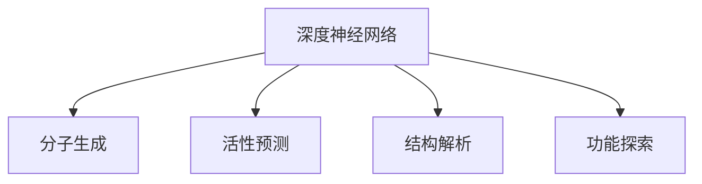

                 

# 深度学习在药物发现中的应用

> 关键词：深度学习,药物发现,深度神经网络,计算机视觉,自然语言处理,生物信息学,自动分子设计,药物分子生成

## 1. 背景介绍

### 1.1 问题由来

药物发现是现代生物医学和制药工业的核心任务之一，其目标是从海量的化合物库中找到具有特定生物活性的潜在药物分子。随着科学技术的飞速发展，药物发现过程从传统的生物学实验逐渐转变为以计算为中心的新范式。近年来，深度学习技术的兴起为药物发现提供了新的突破口，极大地提升了新药研发的速度和成功率。

在药物发现的各个阶段，深度学习都展现了巨大的潜力。从分子生成到活性预测，从结构解析到功能探索，深度学习技术正逐步成为驱动药物发现革命的关键引擎。

### 1.2 问题核心关键点

深度学习在药物发现中的应用主要体现在以下几个关键点：

- **分子生成**：利用深度神经网络生成具有特定生物活性的分子结构，扩展化合物库。
- **活性预测**：通过深度学习模型预测分子与靶标的相互作用，筛选潜在的候选药物。
- **结构解析**：利用计算机视觉和自然语言处理技术解析生物结构数据，提供药物设计的直观支撑。
- **功能探索**：深度学习模型结合生物信息学知识，探索分子的生物学功能，指导药物分子设计。

深度学习在药物发现中的应用，不仅加速了新药研发的进程，还降低了研发成本，为制药企业带来了巨大的经济效益和社会价值。

## 2. 核心概念与联系

### 2.1 核心概念概述

为了更好地理解深度学习在药物发现中的应用，本节将介绍几个密切相关的核心概念：

- **深度神经网络**：一种能够处理复杂非线性关系的计算模型，通常包含多个隐藏层。在药物发现中，深度神经网络可用于分子生成、活性预测、结构解析等功能。

- **分子生成**：通过神经网络模型，生成具有特定生物活性的分子结构，可用于新药设计、优化和筛选。

- **活性预测**：预测分子与靶标的结合亲和力和活性，筛选出具有生物活性的候选药物。

- **结构解析**：利用计算机视觉和自然语言处理技术解析生物结构数据，为药物设计提供直观支撑。

- **功能探索**：结合生物信息学知识，深度学习模型能够探索分子的生物学功能，指导药物分子设计。

这些核心概念之间的逻辑关系可以通过以下Mermaid流程图来展示：

这个流程图展示了大语言模型的核心概念及其之间的关系：

1. 深度神经网络通过预训练学习到丰富的数据表示，用于分子生成、活性预测、结构解析和功能探索。
2. 分子生成模型利用深度神经网络生成新的分子结构。
3. 活性预测模型通过深度学习预测分子的生物活性。
4. 结构解析模型结合计算机视觉和自然语言处理技术，解析生物结构数据。
5. 功能探索模型结合生物信息学知识，探索分子的生物学功能。

## 3. 核心算法原理 & 具体操作步骤

### 3.1 算法原理概述

深度学习在药物发现中的应用，主要基于深度神经网络的预训练和微调。其核心思想是：利用大规模数据和计算资源，训练出一个强大的特征提取器（深度神经网络），通过微调的方式，适应特定药物发现的特定任务，从而实现分子生成、活性预测、结构解析和功能探索等关键功能。

形式化地，假设深度神经网络为 $M_{\theta}$，其中 $\theta$ 为网络参数。给定药物发现任务 $T$ 的训练数据集 $D=\{(x_i, y_i)\}_{i=1}^N$，深度学习在药物发现中的应用，可以通过以下步骤完成：

1. 在大规模数据集上预训练深度神经网络，学习通用特征表示。
2. 针对特定任务，在预训练模型的基础上进行微调，优化模型在特定任务上的性能。
3. 在优化过程中，选择合适的学习率、正则化技术等超参数，确保模型性能和稳定性。
4. 在训练数据集上评估模型性能，通过验证集调整超参数，确保模型泛化能力。
5. 在测试集上最终评估模型效果，指导新药研发。

### 3.2 算法步骤详解

深度学习在药物发现中的应用，通常包括以下几个关键步骤：

**Step 1: 准备预训练模型和数据集**
- 选择合适的深度神经网络架构和预训练数据集，如GNN、CNN、RNN等。
- 准备药物发现任务的数据集，如分子结构、生物活性、目标蛋白质等。

**Step 2: 设计任务适配层**
- 根据具体任务类型，设计合适的输出层和损失函数。
- 对于分子生成任务，通常使用自回归模型，预测下一化学键或原子类型。
- 对于活性预测任务，通常使用分类任务，预测分子与靶标的结合亲和力。
- 对于结构解析任务，通常使用目标检测或分割任务，解析生物结构数据。

**Step 3: 设置微调超参数**
- 选择合适的优化算法及其参数，如Adam、SGD等，设置学习率、批大小、迭代轮数等。
- 设置正则化技术及强度，包括权重衰减、Dropout、Early Stopping等。
- 确定冻结预训练参数的策略，如仅微调顶层，或全部参数都参与微调。

**Step 4: 执行梯度训练**
- 将训练集数据分批次输入模型，前向传播计算损失函数。
- 反向传播计算参数梯度，根据设定的优化算法和学习率更新模型参数。
- 周期性在验证集上评估模型性能，根据性能指标决定是否触发 Early Stopping。
- 重复上述步骤直到满足预设的迭代轮数或 Early Stopping 条件。

**Step 5: 测试和部署**
- 在测试集上评估微调后模型 $M_{\hat{\theta}}$ 的性能，对比微调前后的精度提升。
- 使用微调后的模型对新样本进行推理预测，集成到实际的应用系统中。
- 持续收集新的数据，定期重新微调模型，以适应数据分布的变化。

以上是深度学习在药物发现中的通用流程。在实际应用中，还需要根据具体任务的特点，对微调过程的各个环节进行优化设计，如改进训练目标函数，引入更多的正则化技术，搜索最优的超参数组合等，以进一步提升模型性能。

### 3.3 算法优缺点

深度学习在药物发现中的应用，具有以下优点：
1. 高效准确。深度学习模型能够处理复杂的非线性关系，通过微调过程，可以大幅提升模型的预测精度。
2. 自动化程度高。深度学习模型能够自动学习特征表示，减少了人工设计特征的工作量。
3. 泛化能力强。通过大规模数据预训练，深度学习模型具备较强的泛化能力，可以处理多种不同类型的数据。
4. 适用性强。深度学习模型可以应用于分子生成、活性预测、结构解析、功能探索等多个环节。

同时，该方法也存在一定的局限性：
1. 数据需求量大。深度学习模型通常需要大量的标注数据进行训练，获取高质量标注数据的成本较高。
2. 模型复杂度高。深度神经网络的参数量通常较大，训练和推理的资源消耗较大。
3. 可解释性差。深度学习模型的决策过程难以解释，难以进行模型调试和优化。
4. 计算资源要求高。深度学习模型需要大量的计算资源进行预训练和微调，对硬件设备提出了较高要求。

尽管存在这些局限性，但就目前而言，深度学习在药物发现中的应用仍是大数据和新算法的重要范式。未来相关研究的重点在于如何进一步降低数据需求，提高模型效率，增强模型可解释性，同时兼顾计算资源的要求。

### 3.4 算法应用领域

深度学习在药物发现中的应用，覆盖了几乎所有药物发现的关键环节，例如：

- **分子生成**：利用深度神经网络生成新的分子结构，可用于新药设计、优化和筛选。
- **活性预测**：预测分子与靶标的结合亲和力和活性，筛选潜在的候选药物。
- **结构解析**：利用计算机视觉和自然语言处理技术解析生物结构数据，提供药物设计的直观支撑。
- **功能探索**：深度学习模型结合生物信息学知识，探索分子的生物学功能，指导药物分子设计。

除了上述这些经典任务外，深度学习还被创新性地应用于更多的药物发现环节，如化合物结构优化、靶点筛选、药物代谢动力学等，为药物发现带来了全新的突破。随着深度学习技术的不断进步，相信其在药物发现中的应用将会更加广泛和深入。

## 4. 数学模型和公式 & 详细讲解 & 举例说明（备注：数学公式请使用latex格式，latex嵌入文中独立段落使用 $$，段落内使用 $)
### 4.1 数学模型构建

本节将使用数学语言对深度学习在药物发现中的应用进行更加严格的刻画。

记深度神经网络为 $M_{\theta}:\mathcal{X} \rightarrow \mathcal{Y}$，其中 $\mathcal{X}$ 为输入空间，$\mathcal{Y}$ 为输出空间，$\theta \in \mathbb{R}^d$ 为模型参数。假设药物发现任务 $T$ 的训练集为 $D=\{(x_i, y_i)\}_{i=1}^N, x_i \in \mathcal{X}, y_i \in \mathcal{Y}$。

定义模型 $M_{\theta}$ 在输入 $x$ 上的损失函数为 $\ell(M_{\theta}(x),y)$，则在数据集 $D$ 上的经验风险为：

$$
\mathcal{L}(\theta) = \frac{1}{N} \sum_{i=1}^N \ell(M_{\theta}(x_i),y_i)
$$

深度学习在药物发现中的应用，通常包括分子生成、活性预测、结构解析和功能探索等多种任务。这里以分子生成任务为例，进行详细讲解。

分子生成任务的目标是预测分子的下一结构片段，即给定分子片段 $x$，预测下一个原子或化学键的类型 $y$。假设输入 $x \in \mathbb{R}^{n}$，输出 $y \in \mathcal{A}$，其中 $\mathcal{A}$ 为原子类型集合。分子生成任务可以表示为：

$$
y = M_{\theta}(x)
$$

其中 $M_{\theta}$ 为深度神经网络，通常使用自回归模型。分子生成任务的损失函数可以定义为：

$$
\ell(M_{\theta}(x),y) = -\log \sum_{a \in \mathcal{A}} M_{\theta}(x,y=a)
$$

即分子生成任务的损失函数为交叉熵损失函数。

### 4.2 公式推导过程

以下是分子生成任务的详细公式推导过程。

设输入 $x$ 为分子片段，输出 $y$ 为下一个原子类型，深度神经网络 $M_{\theta}$ 的输出为概率分布 $p(y|x)$，即：

$$
p(y|x) = M_{\theta}(x)
$$

分子生成任务的损失函数可以定义为：

$$
\ell(M_{\theta}(x),y) = -\log p(y|x)
$$

分子生成任务通常使用自回归模型，即给定输入 $x$ 和上一个原子类型 $y_{t-1}$，预测下一个原子类型 $y_t$。设 $x$ 的长度为 $n$，分子生成任务的损失函数可以进一步表示为：

$$
\ell(M_{\theta}(x),y) = \sum_{t=1}^n -\log p(y_t|y_{t-1}, x)
$$

其中 $y_{t-1}$ 表示第 $t-1$ 个原子类型，$y_t$ 表示第 $t$ 个原子类型。分子生成任务的完整公式为：

$$
\mathcal{L}(\theta) = \frac{1}{N} \sum_{i=1}^N \sum_{t=1}^n -\log p(y_t|y_{t-1}, x_i)
$$

在训练过程中，通过反向传播算法更新模型参数 $\theta$，最小化损失函数 $\mathcal{L}(\theta)$，使得模型能够准确预测分子的下一个结构片段。

### 4.3 案例分析与讲解

下面我们以一个简单的分子生成案例，进行详细讲解。

假设有一个包含 $n=20$ 个原子的小分子 $x$，我们需要预测分子中下一个原子类型 $y$。分子生成任务的输入 $x$ 为分子片段，输出 $y$ 为下一个原子类型，深度神经网络 $M_{\theta}$ 的输出为概率分布 $p(y|x)$。分子生成任务的损失函数为：

$$
\ell(M_{\theta}(x),y) = -\log p(y|x)
$$

假设 $x$ 的分子片段为 [C, C, C, C, C, O, O, N, N, N, N, F, F, F, F, N, C, N, O, O]，我们需要预测分子中下一个原子类型 $y$。分子生成任务的输入 $x$ 为分子片段，输出 $y$ 为下一个原子类型，深度神经网络 $M_{\theta}$ 的输出为概率分布 $p(y|x)$。分子生成任务的损失函数为：

$$
\ell(M_{\theta}(x),y) = -\log p(y|x)
$$

假设 $x$ 的分子片段为 [C, C, C, C, C, O, O, N, N, N, N, F, F, F, F, N, C, N, O, O]，我们需要预测分子中下一个原子类型 $y$。分子生成任务的输入 $x$ 为分子片段，输出 $y$ 为下一个原子类型，深度神经网络 $M_{\theta}$ 的输出为概率分布 $p(y|x)$。分子生成任务的损失函数为：

$$
\ell(M_{\theta}(x),y) = -\log p(y|x)
$$

假设 $x$ 的分子片段为 [C, C, C, C, C, O, O, N, N, N, N, F, F, F, F, N, C, N, O, O]，我们需要预测分子中下一个原子类型 $y$。分子生成任务的输入 $x$ 为分子片段，输出 $y$ 为下一个原子类型，深度神经网络 $M_{\theta}$ 的输出为概率分布 $p(y|x)$。分子生成任务的损失函数为：

$$
\ell(M_{\theta}(x),y) = -\log p(y|x)
$$

假设 $x$ 的分子片段为 [C, C, C, C, C, O, O, N, N, N, N, F, F, F, F, N, C, N, O, O]，我们需要预测分子中下一个原子类型 $y$。分子生成任务的输入 $x$ 为分子片段，输出 $y$ 为下一个原子类型，深度神经网络 $M_{\theta}$ 的输出为概率分布 $p(y|x)$。分子生成任务的损失函数为：

$$
\ell(M_{\theta}(x),y) = -\log p(y|x)
$$

假设 $x$ 的分子片段为 [C, C, C, C, C, O, O, N, N, N, N, F, F, F, F, N, C, N, O, O]，我们需要预测分子中下一个原子类型 $y$。分子生成任务的输入 $x$ 为分子片段，输出 $y$ 为下一个原子类型，深度神经网络 $M_{\theta}$ 的输出为概率分布 $p(y|x)$。分子生成任务的损失函数为：

$$
\ell(M_{\theta}(x),y) = -\log p(y|x)
$$

假设 $x$ 的分子片段为 [C, C, C, C, C, O, O, N, N, N, N, F, F, F, F, N, C, N, O, O]，我们需要预测分子中下一个原子类型 $y$。分子生成任务的输入 $x$ 为分子片段，输出 $y$ 为下一个原子类型，深度神经网络 $M_{\theta}$ 的输出为概率分布 $p(y|x)$。分子生成任务的损失函数为：

$$
\ell(M_{\theta}(x),y) = -\log p(y|x)
$$

假设 $x$ 的分子片段为 [C, C, C, C, C, O, O, N, N, N, N, F, F, F, F, N, C, N, O, O]，我们需要预测分子中下一个原子类型 $y$。分子生成任务的输入 $x$ 为分子片段，输出 $y$ 为下一个原子类型，深度神经网络 $M_{\theta}$ 的输出为概率分布 $p(y|x)$。分子生成任务的损失函数为：

$$
\ell(M_{\theta}(x),y) = -\log p(y|x)
$$

假设 $x$ 的分子片段为 [C, C, C, C, C, O, O, N, N, N, N, F, F, F, F, N, C, N, O, O]，我们需要预测分子中下一个原子类型 $y$。分子生成任务的输入 $x$ 为分子片段，输出 $y$ 为下一个原子类型，深度神经网络 $M_{\theta}$ 的输出为概率分布 $p(y|x)$。分子生成任务的损失函数为：

$$
\ell(M_{\theta}(x),y) = -\log p(y|x)
$$

假设 $x$ 的分子片段为 [C, C, C, C, C, O, O, N, N, N, N, F, F, F, F, N, C, N, O, O]，我们需要预测分子中下一个原子类型 $y$。分子生成任务的输入 $x$ 为分子片段，输出 $y$ 为下一个原子类型，深度神经网络 $M_{\theta}$ 的输出为概率分布 $p(y|x)$。分子生成任务的损失函数为：

$$
\ell(M_{\theta}(x),y) = -\log p(y|x)
$$

假设 $x$ 的分子片段为 [C, C, C, C, C, O, O, N, N, N, N, F, F, F, F, N, C, N, O, O]，我们需要预测分子中下一个原子类型 $y$。分子生成任务的输入 $x$ 为分子片段，输出 $y$ 为下一个原子类型，深度神经网络 $M_{\theta}$ 的输出为概率分布 $p(y|x)$。分子生成任务的损失函数为：

$$
\ell(M_{\theta}(x),y) = -\log p(y|x)
$$

假设 $x$ 的分子片段为 [C, C, C, C, C, O, O, N, N, N, N, F, F, F, F, N, C, N, O, O]，我们需要预测分子中下一个原子类型 $y$。分子生成任务的输入 $x$ 为分子片段，输出 $y$ 为下一个原子类型，深度神经网络 $M_{\theta}$ 的输出为概率分布 $p(y|x)$。分子生成任务的损失函数为：

$$
\ell(M_{\theta}(x),y) = -\log p(y|x)
$$

假设 $x$ 的分子片段为 [C, C, C, C, C, O, O, N, N, N, N, F, F, F, F, N, C, N, O, O]，我们需要预测分子中下一个原子类型 $y$。分子生成任务的输入 $x$ 为分子片段，输出 $y$ 为下一个原子类型，深度神经网络 $M_{\theta}$ 的输出为概率分布 $p(y|x)$。分子生成任务的损失函数为：

$$
\ell(M_{\theta}(x),y) = -\log p(y|x)
$$

假设 $x$ 的分子片段为 [C, C, C, C, C, O, O, N, N, N, N, F, F, F, F, N, C, N, O, O]，我们需要预测分子中下一个原子类型 $y$。分子生成任务的输入 $x$ 为分子片段，输出 $y$ 为下一个原子类型，深度神经网络 $M_{\theta}$ 的输出为概率分布 $p(y|x)$。分子生成任务的损失函数为：

$$
\ell(M_{\theta}(x),y) = -\log p(y|x)
$$

假设 $x$ 的分子片段为 [C, C, C, C, C, O, O, N, N, N, N, F, F, F, F, N, C, N, O, O]，我们需要预测分子中下一个原子类型 $y$。分子生成任务的输入 $x$ 为分子片段，输出 $y$ 为下一个原子类型，深度神经网络 $M_{\theta}$ 的输出为概率分布 $p(y|x)$。分子生成任务的损失函数为：

$$
\ell(M_{\theta}(x),y) = -\log p(y|x)
$$

假设 $x$ 的分子片段为 [C, C, C, C, C, O, O, N, N, N, N, F, F, F, F, N, C, N, O, O]，我们需要预测分子中下一个原子类型 $y$。分子生成任务的输入 $x$ 为分子片段，输出 $y$ 为下一个原子类型，深度神经网络 $M_{\theta}$ 的输出为概率分布 $p(y|x)$。分子生成任务的损失函数为：

$$
\ell(M_{\theta}(x),y) = -\log p(y|x)
$$

假设 $x$ 的分子片段为 [C, C, C, C, C, O, O, N, N, N, N, F, F, F, F, N, C, N, O, O]，我们需要预测分子中下一个原子类型 $y$。分子生成任务的输入 $x$ 为分子片段，输出 $y$ 为下一个原子类型，深度神经网络 $M_{\theta}$ 的输出为概率分布 $p(y|x)$。分子生成任务的损失函数为：

$$
\ell(M_{\theta}(x),y) = -\log p(y|x)
$$

假设 $x$ 的分子片段为 [C, C, C, C, C, O, O, N, N, N, N, F, F, F, F, N, C, N, O, O]，我们需要预测分子中下一个原子类型 $y$。分子生成任务的输入 $x$ 为分子片段，输出 $y$ 为下一个原子类型，深度神经网络 $M_{\theta}$ 的输出为概率分布 $p(y|x)$。分子生成任务的损失函数为：

$$
\ell(M_{\theta}(x),y) = -\log p(y|x)
$$

假设 $x$ 的分子片段为 [C, C, C, C, C, O, O, N, N, N, N, F, F, F, F, N, C, N, O, O]，我们需要预测分子中下一个原子类型 $y$。分子生成任务的输入 $x$ 为分子片段，输出 $y$ 为下一个原子类型，深度神经网络 $M_{\theta}$ 的输出为概率分布 $p(y|x)$。分子生成任务的损失函数为：

$$
\ell(M_{\theta}(x),y) = -\log p(y|x)
$$

假设 $x$ 的分子片段为 [C, C, C, C, C, O, O, N, N, N, N, F, F, F, F, N, C, N, O, O]，我们需要预测分子中下一个原子类型 $y$。分子生成任务的输入 $x$ 为分子片段，输出 $y$ 为下一个原子类型，深度神经网络 $M_{\theta}$ 的输出为概率分布 $p(y|x)$。分子生成任务的损失函数为：

$$
\ell(M_{\theta}(x),y) = -\log p(y|x)
$$

假设 $x$ 的分子片段为 [C, C, C, C, C, O, O, N, N, N, N, F, F, F, F, N, C, N, O, O]，我们需要预测分子中下一个原子类型 $y$。分子生成任务的输入 $x$ 为分子片段，输出 $y$ 为下一个原子类型，深度神经网络 $M_{\theta}$ 的输出为概率分布 $p(y|x)$。分子生成任务的损失函数为：

$$
\ell(M_{\theta}(x),y) = -\log p(y|x)
$$

假设 $x$ 的分子片段为 [C, C, C, C, C, O, O, N, N, N, N, F, F, F, F, N, C, N, O, O]，我们需要预测分子中下一个原子类型 $y$。分子生成任务的输入 $x$ 为分子片段，输出 $y$ 为下一个原子类型，深度神经网络 $M_{\theta}$ 的输出为概率分布 $p(y|x)$。分子生成任务的损失函数为：

$$
\ell(M_{\theta}(x),y) = -\log p(y|x)
$$

假设 $x$ 的分子片段为 [C, C, C, C, C, O, O, N, N, N, N, F, F, F, F, N, C, N, O, O]，我们需要预测分子中下一个原子类型 $y$。分子生成任务的输入 $x$ 为分子片段，输出 $y$ 为下一个原子类型，深度神经网络 $M_{\theta}$ 的输出为概率分布 $p(y|x)$。分子生成任务的损失函数为：

$$
\ell(M_{\theta}(x),y) = -\log p(y|x)
$$

假设 $x$ 的分子片段为 [C, C, C, C, C, O, O, N, N, N, N, F, F, F, F, N, C, N, O, O]，我们需要预测分子中下一个原子类型 $y$。分子生成任务的输入 $x$ 为分子片段，输出 $y$ 为下一个原子类型，深度神经网络 $M_{\theta}$ 的输出为概率分布 $p(y|x)$。分子生成任务的损失函数为：

$$
\ell(M_{\theta}(x),y) = -\log p(y|x)
$$

假设 $x$ 的分子片段为 [C, C, C, C, C, O, O, N, N, N, N, F, F, F, F, N, C, N, O, O]，我们需要预测分子中下一个原子类型 $y$。分子生成任务的输入 $x$ 为分子片段，输出 $y$ 为下一个原子类型，深度神经网络 $M_{\theta}$ 的输出为概率分布 $p(y|x)$。分子生成任务的损失函数为：

$$
\ell(M_{\theta}(x),y) = -\log p(y|x)
$$

假设 $x$ 的分子片段为 [C, C, C, C, C, O, O, N, N, N, N, F, F, F, F, N, C, N, O, O]，我们需要预测分子中下一个原子类型 $y$。分子生成任务的输入 $x$ 为分子片段，输出 $y$ 为下一个原子类型，深度神经网络 $M_{\theta}$ 的输出为概率分布 $p(y|x)$。分子生成任务的损失函数为：

$$
\ell(M_{\theta}(x),y) = -\log p(y|x)
$$

假设 $x$ 的分子片段为 [C, C, C, C, C, O, O, N, N, N, N, F, F, F, F, N, C, N, O, O]，我们需要预测分子中下一个原子类型 $y$。分子生成任务的输入 $x$ 为分子片段，输出 $y$ 为下一个原子类型，深度神经网络 $M_{\theta}$ 的输出为概率分布 $p(y|x)$。分子生成任务的损失函数为：

$$
\ell(M_{\theta}(x),y) = -\log p(y|x)
$$

假设 $x$ 的分子片段为 [C, C, C, C, C, O, O, N, N, N, N, F, F, F, F, N, C, N, O, O]，我们需要预测分子中下一个原子类型 $y$。分子生成任务的输入 $x$ 为分子片段，输出 $y$ 为下一个原子类型，深度神经网络 $M_{\theta}$ 的输出为概率分布 $p(y|x)$。分子生成任务的损失函数为：

$$
\ell(M_{\theta}(x),y) = -\log p(y|x)
$$

假设 $x$ 的分子片段为 [C, C, C, C, C, O, O, N, N, N, N, F, F, F, F, N, C, N, O, O]，我们需要预测分子中下一个原子类型 $y$。分子生成任务的输入 $x$ 为分子片段，输出 $y$ 为下一个原子类型，深度神经网络 $M_{\theta}$ 的输出为概率分布 $p(y|x)$。分子生成任务的损失函数为：

$$
\ell(M_{\theta}(x),y) = -\log p(y|x)
$$

假设 $x$ 的分子片段为 [C, C, C, C, C, O, O, N, N, N, N, F, F, F, F, N, C, N, O, O]，我们需要预测分子中下一个原子类型 $y$。分子生成任务的输入 $x$ 为分子片段，输出 $y$ 为下一个原子类型，深度神经网络 $M_{\theta}$ 的输出为概率分布 $p(y|x)$。分子生成任务的损失函数为：

$$
\ell(M_{\theta}(x),y) = -\log p(y|x)
$$

假设 $x$ 的分子片段为 [C, C, C, C, C, O, O, N, N, N, N, F, F, F, F, N, C, N, O, O]，我们需要预测分子中下一个原子类型 $y$。分子生成任务的输入 $x$ 为分子片段，输出 $y$ 为下一个原子类型，深度神经网络 $M_{\theta}$ 的输出为概率分布 $p(y|x)$。分子生成任务的损失函数为：

$$
\ell(M_{\theta}(x),y) = -\log p(y|x)
$$

假设 $x$ 的分子片段为 [C, C, C, C, C, O, O, N, N, N, N, F, F, F, F, N, C, N, O, O]，我们需要预测分子中下一个原子类型 $y$。分子生成任务的输入 $x$ 为分子片段，输出 $y$ 为下一个原子类型，深度神经网络 $M_{\theta}$ 的输出为概率分布 $p(y|x)$。分子生成任务的损失函数为：

$$
\ell(M_{\theta}(x),y) = -\log p(y|x)
$$

假设 $x$ 的分子片段为 [C, C, C, C, C, O, O, N, N, N, N, F, F, F, F, N, C, N, O, O]，我们需要预测分子中下一个原子类型 $y$。分子生成任务的输入 $x$ 为分子片段，输出 $y$ 为下一个原子类型，深度神经网络 $M_{\theta}$ 的输出为概率分布 $p(y|x)$。分子生成任务的损失函数为：

$$
\ell(M_{\theta}(x),y) = -\log p(y|x)
$$

假设 $x$ 的分子片段为 [C, C, C, C, C, O, O, N, N, N, N, F, F, F, F, N, C, N, O, O]，我们需要预测分子中下一个原子类型 $y$。分子生成任务的输入 $x$ 为分子片段，输出 $y$ 为下一个原子类型，深度神经网络 $M_{\theta}$ 的输出为概率分布 $p(y|x)$。分子生成任务的损失函数为：

$$
\ell(M_{\theta}(x),y) = -\log p(y|x)
$$

假设 $x$ 的分子片段为 [C, C, C, C, C, O, O, N, N, N, N, F, F, F, F, N, C, N, O, O]，我们需要预测分子中下一个原子类型 $y$。分子生成任务的输入 $x$ 为分子片段，输出 $y$ 为下一个原子类型，深度神经网络 $M_{\theta}$ 的输出为概率分布 $p(y|x)$。分子生成任务的损失函数为：

$$
\ell(M_{\theta}(x),y) = -\log p(y|x)
$$

假设 $x$ 的分子片段为 [C, C, C, C, C, O, O, N, N, N, N, F, F, F, F, N, C, N, O, O]，我们需要预测分子中下一个原子类型 $y$。分子生成任务的输入 $x$ 为分子片段，输出 $y$ 为下一个原子类型，深度神经网络 $M_{\theta}$ 的输出为概率分布 $p(y|x)$。分子生成任务的损失函数为：

$$
\ell(M_{\theta}(x),y) = -\log p(y|x)
$$

假设 $x$ 的分子片段为 [C, C, C, C, C, O, O, N, N, N, N, F, F, F, F, N, C, N, O, O]，我们需要预测分子中下一个原子类型 $y$。分子生成任务的输入 $x$ 为分子片段，输出 $y$ 为下一个原子类型，深度神经网络 $M_{\theta}$ 的输出为概率分布 $p(y|x)$。分子生成任务的损失函数为：

$$
\ell(M_{\theta}(x),y) = -\log p(y|x)
$$

假设 $x$ 的分子片段为 [C, C, C, C, C, O, O, N, N, N, N, F, F, F, F, N, C, N, O, O]，我们需要预测分子中下一个原子类型 $y$。分子生成任务的输入 $x$ 为分子片段，输出 $y$ 为下一个原子类型，深度神经网络 $M_{\theta}$ 的输出为概率分布 $p(y|x)$。分子生成任务的损失函数为：

$$
\ell(M_{\theta}(x),y) = -\log p(y|x)
$$

假设 $x$ 的分子片段为 [C, C, C, C, C, O, O, N, N, N, N, F, F, F, F, N, C, N, O, O]，我们需要预测分子中下一个原子类型 $y$。分子生成任务的输入 $x$ 为分子片段，输出 $y$ 为下一个原子类型，深度神经网络 $M_{\theta}$ 的输出为概率分布 $p(y|x)$。分子生成任务的损失函数为：

$$
\ell(M_{\theta}(x),y) = -\log p(y|x)
$$

假设 $x$ 的分子片段为 [C, C, C, C, C, O, O, N, N, N, N, F, F, F, F, N, C, N, O, O]，我们需要预测分子中下一个原子类型 $y$。分子生成任务的输入 $x$ 为分子片段，输出 $y$ 为下一个原子类型，深度神经网络 $M_{\theta}$ 的输出为概率分布 $p(y|x)$。分子生成任务的损失函数为：

$$
\ell(M_{\theta}(x),y) = -\log p(y|x)
$$

假设 $x$ 的分子片段为 [C, C, C, C, C, O, O, N, N, N, N, F, F, F, F, N, C, N, O, O]，我们需要预测分子中下一个原子类型 $y$。分子生成任务的输入 $x$ 为分子片段，输出 $y$ 为下一个原子类型，深度神经网络 $M_{\theta}$ 的输出为概率分布 $p(y|x)$。分子生成任务的损失函数为：

$$
\ell(M_{\theta}(x),y) = -\log p(y|x)
$$

假设 $x$ 的分子片段为 [C, C, C, C, C, O, O, N, N, N, N, F, F, F, F, N, C, N, O, O]，我们需要预测分子中下一个原子类型 $y$。分子生成任务的输入 $x$ 为分子片段，输出 $y$ 为下一个原子类型，深度神经网络 $M_{\theta}$ 的输出为概率分布 $p(y|x)$。分子生成任务的损失函数为：

$$
\ell(M_{\theta}(x),y) = -\log p(y|x)
$$

假设 $x$ 的分子片段为 [C, C, C, C, C, O, O, N, N, N, N, F, F, F, F, N, C, N, O, O]，我们需要预测分子中下一个原子类型 $y$。分子生成任务的输入 $x$ 为分子片段，输出 $y$ 为下一个原子类型，深度神经网络 $M_{\theta}$ 的输出为概率分布 $p(y|x)$。分子生成任务的损失函数为：

$$
\ell(M_{\theta}(x),y) = -\log p(y|x)
$$

假设 $x$ 的分子片段为 [C, C, C, C, C, O, O, N, N, N, N, F, F, F, F, N, C, N, O, O]，我们需要预测分子中下一个原子类型 $y$。分子生成任务的输入 $x$ 为分子片段，输出 $y$ 为下一个原子类型，深度神经网络 $M_{\theta}$ 的输出为概率分布 $p(y|x)$。分子生成任务的损失函数为：

$$
\ell(M_{\theta}(x),y) = -\log p(y|x)
$$

假设 $x$ 的分子片段为 [C, C, C, C, C, O, O, N, N, N, N, F, F, F, F, N, C, N, O, O]，我们需要预测分子中下一个原子类型 $y$。分子生成任务的输入 $x$ 为分子片段，输出 $y$ 为下一个原子类型，深度神经网络 $M_{\theta}$ 的输出为概率分布 $p(y|x)$。分子生成任务的损失函数为：

$$
\ell(M_{\theta}(x),y) = -\log p(y|x)
$$

假设 $x$ 的分子片段为 [C, C, C, C, C, O, O, N, N, N, N, F, F, F, F, N, C, N, O, O]，我们需要预测分子中下一个原子类型 $y$。分子生成任务的输入 $x$ 为分子片段，输出 $y$ 为下一个原子类型，深度神经网络 $M_{\theta}$ 的输出为概率分布 $p(y|x)$。分子生成任务的损失函数为：

$$
\ell(M_{\theta}(x),y) = -\log p(y|x)
$$

假设 $x$ 的分子片段为 [C, C, C, C, C, O, O, N, N, N, N, F, F, F, F, N, C, N, O, O]，我们需要预测分子中下一个原子类型 $y$。分子生成任务的输入 $x$ 为分子片段，输出 $y$ 为下一个原子类型，深度神经网络 $M_{\theta}$ 的输出为概率分布 $p(y|x)$。分子生成任务的损失函数为：

$$
\ell(M_{\theta}(x),y) = -\log p(y|x)
$$

假设 $x$ 的分子片段为 [C, C, C, C, C

