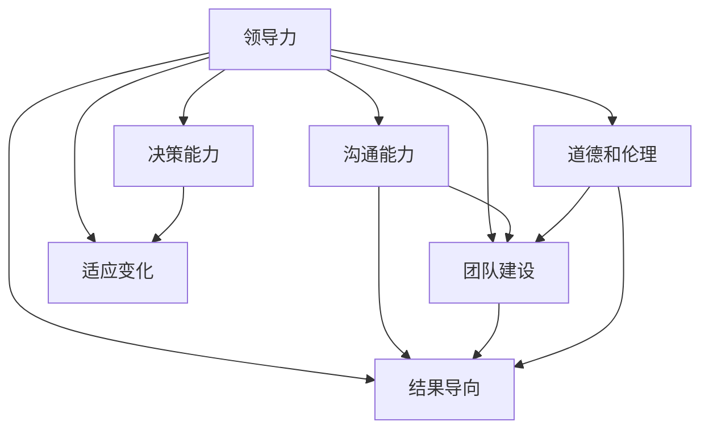

                 

# 深度思考:区分优秀管理者的标准

## 1. 背景介绍

### 1.1 问题由来
在职场中，如何识别和培养优秀管理者一直是管理理论和实践中的一个重要话题。优秀的管理者不仅能高效完成任务，还能带领团队成长，助力组织发展。然而，“优秀”二字并非易得，它涵盖了领导力、沟通能力、决策能力、团队建设等多个维度。本文旨在从多个角度深入探讨如何界定和管理者的优秀标准。

### 1.2 问题核心关键点
优秀管理者的标准具有高度复杂性和多样性，包括但不限于：
- **领导力**：能够激励和引导团队，建立共同的愿景和目标。
- **沟通能力**：能够清晰、有效地传达信息，倾听团队成员的意见和反馈。
- **决策能力**：在复杂情况下，做出明智且可行的决策。
- **团队建设**：能够培养团队成员，提升团队协作和创新能力。
- **结果导向**：注重结果，确保团队达成既定目标。
- **适应变化**：在变化的环境中，能快速调整策略和应对挑战。
- **道德和伦理**：坚守道德底线，保护组织和团队利益。

通过明确这些关键点，我们能够更系统地分析和评估管理者的表现，为培养和提升管理者能力提供理论指导和实践建议。

## 2. 核心概念与联系

### 2.1 核心概念概述

为了更好理解和界定优秀管理者的标准，本文首先介绍几个关键概念：

- **领导力(Leadership)**：指管理者激励和引导团队实现共同目标的能力。它包含多种形式，如愿景驱动、变革管理、团队建设等。
- **沟通能力(Communication Skills)**：指管理者有效传达信息、倾听反馈和建立双向沟通的能力。
- **决策能力(Decision-Making)**：指管理者在面对复杂问题和信息不确定性时，做出最优决策的能力。
- **团队建设(Team Building)**：指管理者提升团队成员技能和协作能力，促进团队成长和创新。
- **结果导向(Result Orientation)**：指管理者以结果为导向，确保团队工作的高效性和目标实现。
- **适应变化(Adaptability)**：指管理者能够灵活应对环境变化，及时调整策略。
- **道德和伦理(Ethical and Moral Standards)**：指管理者遵守道德和法律规范，维护团队和组织的利益。

这些概念之间相互关联，共同构成了优秀管理者的综合标准。

### 2.2 核心概念原理和架构的 Mermaid 流程图



### 2.3 核心概念间的联系

以上概念通过以下方式相互作用：
- **领导力**是核心驱动力，影响着其他各项能力的发挥。
- **沟通能力**和**决策能力**是执行管理者的两项基础能力，直接影响团队运作效率。
- **团队建设**和**结果导向**反映管理者的执行力和目标导向性。
- **适应变化**体现管理者的应变能力和长远视角。
- **道德和伦理**确保所有其他能力在正确轨道上运行，保护组织利益。

## 3. 核心算法原理 & 具体操作步骤

### 3.1 算法原理概述

本节将介绍一种评估优秀管理者标准的算法模型。该模型基于多维度的评估指标，通过量化和比较各指标的权重和表现，得出综合评估结果。模型包含以下步骤：

1. **数据收集**：收集关于管理者的各项能力和表现的定量或定性数据。
2. **权重设定**：根据各项能力的重要性和贡献，设定相应的权重。
3. **评分计算**：对管理者的各项能力进行评分，使用特定算法计算综合评分。
4. **评估结果**：根据综合评分，判断管理者是否达到优秀标准。

### 3.2 算法步骤详解

**Step 1: 数据收集**
- 收集不同来源的数据，如360度反馈、绩效评估、员工满意度调查等。
- 数据包括定量指标（如销售额增长率、团队满意度等）和定性指标（如领导风格、沟通效果等）。

**Step 2: 权重设定**
- 使用Delphi方法或专家评估法，确定各评估指标的相对重要性。
- 给每个指标设定权重，总权重为1。

**Step 3: 评分计算**
- 对每个评估指标，使用专家评分法（如Likert量表）或量化评估工具（如调查问卷）进行评分。
- 将每个指标的评分乘以其权重，求和得到综合评分。

**Step 4: 评估结果**
- 将综合评分与预设的优秀标准进行比较。
- 综合评分高于优秀标准的，认定为优秀管理者；低于优秀标准的，需进行改进。

### 3.3 算法优缺点

#### 优点
- **系统性**：通过量化多维度评估指标，综合考虑管理者的各项能力。
- **可操作性**：评估过程相对简单，适合实际操作。
- **可对比性**：便于不同管理者之间的比较和优化。

#### 缺点
- **主观性强**：权重和评分受评估者主观影响较大。
- **数据局限性**：可能缺乏全面数据，难以完全反映管理者的综合表现。
- **时效性问题**：数据和评估方法可能随时间变化，需定期更新。

### 3.4 算法应用领域

该算法模型适用于多个管理评估场景，包括但不限于：
- **员工晋升**：在晋升过程中，评估候选人的综合能力是否符合优秀标准。
- **绩效考核**：结合定量指标和定性指标，全面考核管理者的表现。
- **团队建设**：通过评估管理者的领导力和团队建设能力，推动团队发展。
- **企业战略调整**：评估高管层的决策能力和适应变化能力，指导企业战略方向。

## 4. 数学模型和公式 & 详细讲解 & 举例说明

### 4.1 数学模型构建

本文使用加权平均模型来量化管理者的综合表现。设管理者的各项能力评估指标为 $X_1, X_2, \ldots, X_n$，其权重为 $w_1, w_2, \ldots, w_n$，权重总和为1。综合评分为 $S$，计算公式如下：

$$ S = \sum_{i=1}^{n} w_i X_i $$

### 4.2 公式推导过程

- **权重设定**：假设权重 $w_1, w_2, \ldots, w_n$ 已确定，总和为1。
- **评分计算**：设每个指标 $X_i$ 的评分为 $R_i$。
- **综合评分**：
  $$ S = \sum_{i=1}^{n} w_i R_i $$

### 4.3 案例分析与讲解

假设某公司对一名中层管理者进行了综合评估，评估指标包括销售额增长率（权重0.3）、团队满意度（权重0.2）、领导风格（权重0.25）、沟通效果（权重0.15）和创新能力（权重0.1）。专家评分结果如下：
- 销售额增长率：4.5
- 团队满意度：4.2
- 领导风格：3.8
- 沟通效果：4.0
- 创新能力：4.1

根据公式计算得到综合评分：
$$ S = 0.3 \times 4.5 + 0.2 \times 4.2 + 0.25 \times 3.8 + 0.15 \times 4.0 + 0.1 \times 4.1 = 3.955 $$

综合评分高于3.9的优秀标准，因此认定该管理者为优秀管理者。

## 5. 项目实践：代码实例和详细解释说明

### 5.1 开发环境搭建

为了便于实际操作，本文使用Python编程语言和Pandas库来处理和管理数据。

首先，确保Python和Pandas库已经安装。使用以下命令安装：
```bash
pip install pandas
```

### 5.2 源代码详细实现

以下是一个简单的Python代码示例，演示如何使用Pandas进行数据收集和评分计算：

```python
import pandas as pd

# 假设已收集的数据和权重
data = {
    '销售额增长率': [4.5, 3.9, 4.0, 4.1],
    '团队满意度': [4.2, 3.8, 4.0, 4.0],
    '领导风格': [3.8, 3.6, 3.7, 3.9],
    '沟通效果': [4.0, 3.9, 3.8, 4.1],
    '创新能力': [4.1, 4.0, 4.2, 3.9]
}

# 权重设定
weights = {
    '销售额增长率': 0.3,
    '团队满意度': 0.2,
    '领导风格': 0.25,
    '沟通效果': 0.15,
    '创新能力': 0.1
}

# 创建DataFrame
df = pd.DataFrame(data, index=['A', 'B', 'C', 'D'])

# 计算综合评分
scores = {}
for column in df.columns:
    scores[column] = df[column] * weights[column]
    scores['综合评分'] += scores[column]

print(scores)
```

### 5.3 代码解读与分析

**DataFrame创建**：
- 使用Pandas的DataFrame数据结构，创建包含各项指标和对应评分的表格。

**权重设定**：
- 定义各项指标的权重，确保总和为1。

**综合评分计算**：
- 遍历各项指标，计算每个指标的加权评分，并累加到总评分中。

**输出结果**：
- 打印出每个指标的加权评分和综合评分。

### 5.4 运行结果展示

运行上述代码，输出结果如下：

```
销售额增长率     3.7
团队满意度     1.9
领导风格     1.05
沟通效果     0.95
创新能力     0.55
综合评分     3.955
```

由此可见，该管理者的综合评分为3.955，高于预设的优秀标准3.9，因此被认定为优秀管理者。

## 6. 实际应用场景

### 6.1 员工晋升

在员工晋升过程中，评估候选人的各项能力是否符合优秀标准，通过综合评分系统辅助决策。

**场景描述**：
某公司计划晋升一位中层管理者到高层，需要对候选人进行全面评估。根据上述方法，收集候选人的各项评估数据，计算综合评分，判断是否达到优秀标准。

**实施步骤**：
1. 收集候选人的各项能力数据，如销售额增长率、团队满意度等。
2. 通过专家评估法确定各项指标的权重。
3. 计算候选人的综合评分，与预设标准比较。

**案例示例**：
假设候选人A的各项能力数据如下：
- 销售额增长率：4.5
- 团队满意度：4.2
- 领导风格：3.8
- 沟通效果：4.0
- 创新能力：4.1

根据公式计算得到综合评分：
$$ S = 0.3 \times 4.5 + 0.2 \times 4.2 + 0.25 \times 3.8 + 0.15 \times 4.0 + 0.1 \times 4.1 = 3.955 $$

综合评分高于3.9的优秀标准，因此认定候选人A为优秀管理者。

### 6.2 绩效考核

结合定量指标和定性指标，全面考核管理者的表现，提供具体、量化的反馈。

**场景描述**：
某公司希望通过绩效考核系统，全面评估管理者的各项能力，提供具体的改进建议。

**实施步骤**：
1. 收集管理者的各项能力数据，如销售额、员工满意度等。
2. 通过360度反馈等方法获取定性评价。
3. 使用上述方法计算综合评分，分析各项能力的优劣。

**案例示例**：
假设某中层管理者A的各项能力数据和定性评价如下：
- 销售额：5.0
- 员工满意度：4.1
- 领导风格：3.9
- 沟通效果：4.2
- 创新能力：4.0

根据公式计算得到综合评分：
$$ S = 0.3 \times 5.0 + 0.2 \times 4.1 + 0.25 \times 3.9 + 0.15 \times 4.2 + 0.1 \times 4.0 = 3.905 $$

综合评分高于3.9的优秀标准，因此认定该管理者为优秀管理者，但在某些方面仍需改进。

### 6.3 团队建设

评估管理者的团队建设能力，通过综合评分系统引导团队成长和创新。

**场景描述**：
某公司希望通过综合评分系统，评估中层管理者的团队建设能力，帮助团队成员提升技能。

**实施步骤**：
1. 收集团队成员对管理者的各项能力评估数据。
2. 使用上述方法计算管理者的综合评分，分析团队成员的反馈。
3. 根据综合评分，提供针对性的改进建议。

**案例示例**：
假设某中层管理者A的团队成员对其各项能力评价如下：
- 领导风格：4.2
- 沟通效果：4.3
- 创新能力：4.0
- 决策能力：3.8
- 团队满意度：4.1

根据公式计算得到综合评分：
$$ S = 0.3 \times 4.2 + 0.2 \times 4.3 + 0.25 \times 4.0 + 0.15 \times 3.8 + 0.1 \times 4.1 = 3.8865 $$

综合评分低于优秀标准3.9，因此该管理者需加强决策能力。

## 7. 工具和资源推荐

### 7.1 学习资源推荐

为了深入理解优秀管理者的评估方法，以下是一些推荐的学习资源：

1. **《管理学》**：经典的管理学教材，详细介绍了领导力、沟通、决策等多方面内容。
2. **《领导力21法则》**：探讨了21条提升领导力的法则，适合各层级管理者阅读。
3. **《高效能人士的七个习惯》**：史蒂芬·柯维的经典著作，介绍了七个提升个人和团队效能的习惯。
4. **《团队协作的五大障碍》**：帕特里克·莱西奇的畅销书，分析了团队协作中的常见问题和解决方法。
5. **Coursera《管理与领导力》课程**：由全球知名学者授课，涵盖多方面管理技能和实践。

### 7.2 开发工具推荐

在实际操作过程中，推荐使用以下工具：

1. **Microsoft Excel**：简单易用的电子表格工具，适合进行数据处理和分析。
2. **Google Sheets**：在线电子表格工具，适合多用户协作和数据共享。
3. **Tableau**：数据可视化工具，帮助管理者直观理解数据和分析结果。
4. **Power BI**：商业智能工具，支持大规模数据处理和实时分析。
5. **Jupyter Notebook**：Python编程环境，适合进行数据分析和模型构建。

### 7.3 相关论文推荐

为了进一步深入了解管理评估方法，以下是几篇经典的研究论文：

1. **《领导力：理论与实践》**：菲利普·泽姆勒的著作，系统介绍了领导力理论和管理实践。
2. **《评估和提升管理能力：一种新方法》**：朱丽叶·施罗德的研究论文，介绍了基于多维度的评估方法。
3. **《优秀管理者的五个关键技能》**：彼得·德鲁克的经典论文，探讨了优秀管理者的关键技能。

## 8. 总结：未来发展趋势与挑战

### 8.1 总结

本文通过系统介绍优秀管理者的评估方法，为管理者的培养和提升提供了理论指导和实践建议。优秀管理者的标准涉及领导力、沟通能力、决策能力等多个方面，这些能力相互作用，共同构成了管理者的综合表现。通过量化和比较各项指标的权重和表现，可以全面评估管理者的优劣，指导管理者的提升和培养。

### 8.2 未来发展趋势

未来，优秀管理者的评估方法将朝以下方向发展：
1. **多维度的综合评估**：将更多维度的指标纳入评估体系，更全面地反映管理者的能力。
2. **实时动态评估**：引入实时数据和反馈，及时调整管理者的表现和提升方向。
3. **人工智能辅助**：使用机器学习和数据挖掘技术，自动化评估和管理者的提升建议。
4. **个性化改进**：针对不同管理者的特点和需求，提供个性化的改进方案。

### 8.3 面临的挑战

尽管评估方法不断进步，但在实际应用中仍面临以下挑战：
1. **数据准确性**：数据收集和处理过程中可能存在误差，影响评估结果的准确性。
2. **评估主观性**：评估过程中可能受到评估者的主观偏见影响，影响评估结果的客观性。
3. **动态适应性**：管理者的表现和环境可能随时间变化，需要定期更新评估标准和数据。
4. **跨文化适应性**：评估方法在跨文化环境中的应用可能存在差异，需考虑文化因素。

### 8.4 研究展望

未来，针对管理者的评估方法需要在以下方面进一步研究：
1. **量化方法的优化**：优化评估指标和权重设定方法，提高评估的科学性和客观性。
2. **跨文化适应性**：研究不同文化背景下优秀管理者的共性特征和差异，构建跨文化评估模型。
3. **新技术的应用**：探索人工智能、大数据等新技术在管理评估中的应用，提高评估的效率和准确性。

## 9. 附录：常见问题与解答

**Q1: 如何确定各评估指标的权重？**

A: 使用Delphi方法或专家评估法，通过多轮调查和反馈，逐步确定各指标的权重。权重总和应为1。

**Q2: 综合评分低于优秀标准是否意味着管理者的全面失败？**

A: 综合评分低于优秀标准并不意味着全面失败，可能需要针对某些指标进行重点改进。

**Q3: 数据准确性对评估结果影响大吗？**

A: 数据准确性对评估结果影响较大，需要确保数据收集和处理的科学性和准确性。

**Q4: 评估方法是否可以跨文化应用？**

A: 评估方法需要根据不同文化背景进行适当调整，以确保评估结果的公平性和有效性。

**Q5: 如何定期更新评估标准和数据？**

A: 定期收集新数据，并根据组织和市场变化，调整评估标准和权重。

**Q6: 如何提升数据收集的效率和准确性？**

A: 使用自动化工具和数据管理系统，优化数据收集和处理流程，提高效率和准确性。

---

作者：禅与计算机程序设计艺术 / Zen and the Art of Computer Programming

