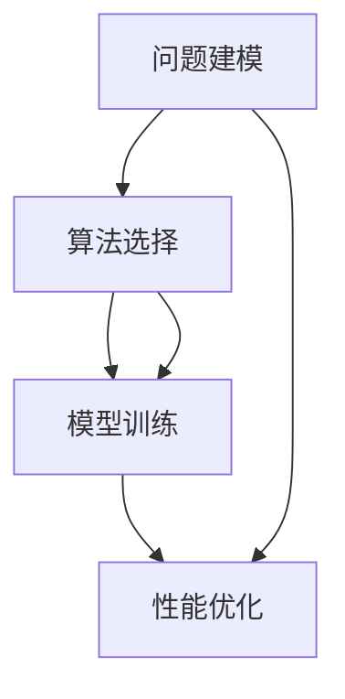

                 

# 深度思考的威力:洞悉问题本质

> 关键词：深度思考,问题本质,认知重塑,算法优化,模型选择,逻辑推理,实践案例,挑战与突破

## 1. 背景介绍

在当今信息爆炸的时代，人工智能(AI)和大数据技术的迅猛发展，不仅极大地提升了我们的生产效率，也深刻地改变了我们的思维方式和生活方式。然而，面对日益复杂的问题，仅仅依靠算力和数据已不足以找到有效的解决方案。正是在这样的背景下，深度思考的重要性愈发凸显。

深度思考，是一种基于逻辑、分析和批判性思维的系统化思考过程，通过多角度、多维度地分析和理解问题的本质，能够揭示出问题的核心，从而找到更优的解决方案。在大数据和AI技术的助力下，深度思考不仅能帮助我们更好地理解问题，还能指导我们更加精准地选择算法、设计模型，提升解决问题的效率和质量。

本文旨在通过深入探讨深度思考在AI和机器学习中的运用，帮助读者理解其核心原理和操作技术，同时提供实际案例和实践指导，揭示深度思考的威力，助力人工智能领域的创新和突破。

## 2. 核心概念与联系

### 2.1 核心概念概述

深度思考涉及的核心概念主要包括问题建模、算法选择、模型训练、性能优化等。这些概念彼此关联，共同构成了深度思考的框架。

- **问题建模**：将实际问题抽象为算法可处理的形式。包括问题定义、特征提取、目标函数设计等。
- **算法选择**：根据问题特性和数据特点，选择合适的算法。例如，线性回归适用于回归问题，决策树适用于分类问题，卷积神经网络适用于图像识别问题等。
- **模型训练**：使用训练数据对选定的算法进行训练，使其能够泛化到测试数据上。模型训练过程包含数据预处理、参数初始化、迭代优化等步骤。
- **性能优化**：通过调整超参数、增加正则化、改进模型结构等方法，提升模型的准确率和泛化能力。

### 2.2 核心概念原理和架构的 Mermaid 流程图



## 3. 核心算法原理 & 具体操作步骤

### 3.1 算法原理概述

深度思考的核心在于通过算法和模型的选择与优化，实现对问题的精确理解和解决。其基本步骤包括问题建模、算法选择、模型训练和性能优化。

**问题建模**：定义问题的目标函数，如回归问题中的均方误差、分类问题中的交叉熵损失等。确定输入特征和输出标签。

**算法选择**：根据问题的特点选择合适的算法。如线性回归、逻辑回归、决策树、随机森林、卷积神经网络等。

**模型训练**：使用训练数据对算法进行训练。通过前向传播计算损失函数，反向传播计算梯度，使用优化算法更新模型参数。

**性能优化**：通过调整学习率、增加正则化项、改进模型结构等方法，提高模型的泛化能力。

### 3.2 算法步骤详解

以线性回归问题为例，详细讲解深度思考的算法步骤：

**Step 1: 问题建模**
- 定义目标函数：均方误差函数
- 确定输入特征：$x_1, x_2, \cdots, x_n$
- 确定输出标签：$y$

**Step 2: 算法选择**
- 选择线性回归算法
- 定义模型：$y = \theta_0 + \sum_{i=1}^{n} \theta_i x_i$

**Step 3: 模型训练**
- 输入训练数据：$(x_1, y_1), (x_2, y_2), \cdots, (x_m, y_m)$
- 前向传播：$y_i = \theta_0 + \sum_{i=1}^{n} \theta_i x_{i,i}$ 
- 计算损失函数：$L = \frac{1}{2m} \sum_{i=1}^{m} (y_i - \hat{y_i})^2$
- 反向传播：$\frac{\partial L}{\partial \theta_0} = \frac{1}{m} \sum_{i=1}^{m} (y_i - \hat{y_i})$, $\frac{\partial L}{\partial \theta_i} = \frac{1}{m} \sum_{i=1}^{m} (y_i - \hat{y_i}) x_i$
- 使用优化算法更新参数：$\theta = \theta - \eta \nabla_{\theta}L$

**Step 4: 性能优化**
- 调整学习率$\eta$
- 增加正则化项$\lambda \sum_{i=1}^{n} \theta_i^2$
- 改进模型结构：增加隐层、调整神经元个数

### 3.3 算法优缺点

**优点**：
- 系统化思考：通过多角度分析问题，能够揭示问题的本质，找到最优解决方案。
- 泛化能力强：通过模型训练和优化，能够提升模型对未知数据的泛化能力。
- 算法选择灵活：根据问题特点选择最合适的算法，提高模型性能。

**缺点**：
- 计算资源消耗大：模型训练和优化需要大量计算资源，可能面临硬件瓶颈。
- 参数调优复杂：选择合适的算法和超参数可能需要大量实验和调试。
- 模型复杂度大：复杂的模型可能过度拟合训练数据，降低泛化能力。

### 3.4 算法应用领域

深度思考在人工智能和机器学习的广泛应用中，涵盖了从基础问题到复杂系统的各个领域，如自然语言处理、计算机视觉、信号处理等。

- **自然语言处理(NLP)**：通过深度思考，可以实现文本分类、情感分析、机器翻译等任务。
- **计算机视觉(CV)**：通过深度思考，可以实现图像识别、物体检测、人脸识别等任务。
- **信号处理(SP)**：通过深度思考，可以实现语音识别、语音合成、信号压缩等任务。

## 4. 数学模型和公式 & 详细讲解 & 举例说明

### 4.1 数学模型构建

以线性回归问题为例，构建数学模型：

- 目标函数：均方误差损失函数
- 输入特征：$x_1, x_2, \cdots, x_n$
- 输出标签：$y$
- 模型：$y = \theta_0 + \sum_{i=1}^{n} \theta_i x_i$

### 4.2 公式推导过程

**均方误差损失函数**：
$$
L = \frac{1}{2m} \sum_{i=1}^{m} (y_i - \hat{y_i})^2
$$

**前向传播**：
$$
\hat{y_i} = \theta_0 + \sum_{i=1}^{n} \theta_i x_{i,i}
$$

**反向传播**：
$$
\frac{\partial L}{\partial \theta_0} = \frac{1}{m} \sum_{i=1}^{m} (y_i - \hat{y_i}), \quad \frac{\partial L}{\partial \theta_i} = \frac{1}{m} \sum_{i=1}^{m} (y_i - \hat{y_i}) x_i
$$

**优化算法**：
$$
\theta = \theta - \eta \nabla_{\theta}L
$$

### 4.3 案例分析与讲解

以房价预测为例，分析深度思考在模型构建和优化中的运用：

**问题建模**：
- 目标函数：均方误差损失函数
- 输入特征：房屋面积、房间数量、地理位置等
- 输出标签：房价

**算法选择**：
- 选择线性回归算法

**模型训练**：
- 输入训练数据：房屋面积、房间数量、地理位置、房价
- 前向传播：$y_i = \theta_0 + \sum_{i=1}^{n} \theta_i x_{i,i}$
- 计算损失函数：$L = \frac{1}{2m} \sum_{i=1}^{m} (y_i - \hat{y_i})^2$
- 反向传播：$\frac{\partial L}{\partial \theta_0} = \frac{1}{m} \sum_{i=1}^{m} (y_i - \hat{y_i}), \quad \frac{\partial L}{\partial \theta_i} = \frac{1}{m} \sum_{i=1}^{m} (y_i - \hat{y_i}) x_i$
- 使用优化算法更新参数：$\theta = \theta - \eta \nabla_{\theta}L$

**性能优化**：
- 调整学习率$\eta$
- 增加正则化项$\lambda \sum_{i=1}^{n} \theta_i^2$
- 改进模型结构：增加隐层、调整神经元个数

## 5. 项目实践：代码实例和详细解释说明

### 5.1 开发环境搭建

以PyTorch为例，搭建深度思考项目的开发环境：

1. 安装Anaconda：从官网下载并安装Anaconda，用于创建独立的Python环境。
2. 创建并激活虚拟环境：
```bash
conda create -n pytorch-env python=3.8 
conda activate pytorch-env
```

3. 安装PyTorch：根据CUDA版本，从官网获取对应的安装命令。例如：
```bash
conda install pytorch torchvision torchaudio cudatoolkit=11.1 -c pytorch -c conda-forge
```

4. 安装PyTorch的高级接口：
```bash
pip install torchtext
```

5. 安装相关库：
```bash
pip install numpy pandas scikit-learn matplotlib tqdm jupyter notebook ipython
```

完成上述步骤后，即可在`pytorch-env`环境中开始深度思考项目的开发。

### 5.2 源代码详细实现

以下是一个简单的线性回归模型在PyTorch中的实现：

```python
import torch
import torch.nn as nn
import torch.optim as optim

# 定义线性回归模型
class LinearRegression(nn.Module):
    def __init__(self, input_dim, output_dim):
        super(LinearRegression, self).__init__()
        self.linear = nn.Linear(input_dim, output_dim)
        
    def forward(self, x):
        out = self.linear(x)
        return out

# 准备数据
x_train = torch.randn(100, 1)
y_train = x_train * 2 + 3

# 定义模型和优化器
model = LinearRegression(1, 1)
criterion = nn.MSELoss()
optimizer = optim.SGD(model.parameters(), lr=0.01)

# 训练模型
for epoch in range(1000):
    optimizer.zero_grad()
    y_pred = model(x_train)
    loss = criterion(y_pred, y_train)
    loss.backward()
    optimizer.step()

    if (epoch + 1) % 100 == 0:
        print(f"Epoch {epoch+1}, Loss: {loss.item()}")
```

### 5.3 代码解读与分析

**LinearRegression类**：
- `__init__方法`：初始化模型参数。
- `forward方法`：前向传播计算模型输出。

**数据准备**：
- 使用`torch.randn`生成训练数据`x_train`和标签`y_train`。

**模型定义**：
- 定义线性回归模型，包含一个线性层。

**训练流程**：
- 每个epoch：
  - 清除梯度
  - 前向传播计算预测输出
  - 计算损失函数
  - 反向传播更新参数
- 每100个epoch打印一次训练loss。

## 6. 实际应用场景

### 6.1 自然语言处理(NLP)

深度思考在自然语言处理中应用广泛，通过多角度分析文本数据，能够实现文本分类、情感分析、机器翻译等任务。

**文本分类**：通过深度思考，将文本数据转换为向量表示，使用分类器进行预测。

**情感分析**：通过深度思考，分析文本情感倾向，并进行情感分类。

**机器翻译**：通过深度思考，将源语言文本转换为目标语言文本。

### 6.2 计算机视觉(CV)

深度思考在计算机视觉中的应用，主要体现在图像识别和目标检测等任务中。

**图像识别**：通过深度思考，将图像转换为特征向量，使用分类器进行图像分类。

**目标检测**：通过深度思考，在图像中定位和识别目标物体。

### 6.3 信号处理(SP)

深度思考在信号处理中的应用，主要体现在语音识别、语音合成、信号压缩等任务中。

**语音识别**：通过深度思考，将语音信号转换为文本信息。

**语音合成**：通过深度思考，将文本信息转换为语音信号。

**信号压缩**：通过深度思考，将信号进行压缩和解压缩。

## 7. 工具和资源推荐

### 7.1 学习资源推荐

为了深入了解深度思考的原理和应用，以下推荐一些优质的学习资源：

1. 《深度学习》书籍：Ian Goodfellow所著，系统介绍了深度学习的原理和应用。
2. 《TensorFlow官方文档》：Google提供的TensorFlow开发指南，包含大量代码示例和教程。
3. 《PyTorch官方文档》：PyTorch官方文档，包含详细API说明和教程。
4. Coursera《深度学习专项课程》：Andrew Ng等人主讲的深度学习课程，涵盖深度学习的基本概念和算法。
5. Kaggle竞赛平台：提供丰富的数据集和竞赛任务，通过实践学习深度思考的实际应用。

### 7.2 开发工具推荐

深度思考的开发离不开优秀的工具支持。以下是几款常用的工具：

1. PyTorch：基于Python的开源深度学习框架，灵活动态的计算图，适合快速迭代研究。
2. TensorFlow：由Google主导开发的开源深度学习框架，生产部署方便，适合大规模工程应用。
3. Weights & Biases：模型训练的实验跟踪工具，可以记录和可视化模型训练过程中的各项指标，方便对比和调优。
4. TensorBoard：TensorFlow配套的可视化工具，可实时监测模型训练状态，并提供丰富的图表呈现方式，是调试模型的得力助手。
5. Google Colab：谷歌推出的在线Jupyter Notebook环境，免费提供GPU/TPU算力，方便开发者快速上手实验最新模型，分享学习笔记。

### 7.3 相关论文推荐

深度思考的发展源于学界的持续研究。以下是几篇奠基性的相关论文，推荐阅读：

1. AlexNet：ImageNet大规模视觉识别竞赛的冠军模型，展示了卷积神经网络在图像识别中的强大能力。
2. VGGNet：通过增加卷积层数，提升了卷积神经网络的识别精度。
3. ResNet：引入了残差连接，解决了深度神经网络训练中的梯度消失问题，极大地提高了模型的深度和精度。
4. Attention is All You Need：提出了Transformer结构，开启了NLP领域的预训练大模型时代。
5. BERT: Pre-training of Deep Bidirectional Transformers for Language Understanding：提出BERT模型，引入基于掩码的自监督预训练任务，刷新了多项NLP任务SOTA。

## 8. 总结：未来发展趋势与挑战

### 8.1 总结

本文系统地介绍了深度思考在人工智能和机器学习中的应用。通过问题建模、算法选择、模型训练和性能优化等关键步骤，揭示了深度思考的核心原理和操作技术。通过实际案例和代码实例，展示了深度思考的威力，并提供了系统化的实践指导。

通过本文的系统梳理，可以看到，深度思考在人工智能领域的广泛应用和重要价值。这种基于逻辑、分析和批判性思维的系统化思考过程，不仅能够帮助我们更好地理解问题，还能指导我们更加精准地选择算法、设计模型，提升解决问题的效率和质量。

### 8.2 未来发展趋势

展望未来，深度思考技术将呈现以下几个发展趋势：

1. 模型规模持续增大。随着算力成本的下降和数据规模的扩张，深度模型参数量还将持续增长。超大规模模型蕴含的丰富知识，有望支撑更加复杂多变的任务。
2. 深度学习与符号逻辑结合。深度学习与符号逻辑的融合，能够更好地处理复杂逻辑关系和规则约束，提升模型的鲁棒性和可解释性。
3. 强化学习和深度学习的结合。强化学习与深度学习的结合，能够更好地处理具有动态变化的任务，提升模型的决策能力和泛化能力。
4. 元学习和深度学习的结合。元学习与深度学习的结合，能够更好地适应新任务和新场景，提升模型的适应能力和迁移能力。
5. 迁移学习和深度学习的结合。迁移学习与深度学习的结合，能够更好地利用已有知识，提升模型的泛化能力和迁移能力。

以上趋势凸显了深度思考技术的广阔前景。这些方向的探索发展，必将进一步提升深度学习模型的性能和应用范围，为人工智能领域的创新和突破提供新的动力。

### 8.3 面临的挑战

尽管深度思考技术已经取得了瞩目成就，但在迈向更加智能化、普适化应用的过程中，仍面临着诸多挑战：

1. 计算资源消耗大。深度学习模型需要大量计算资源，可能面临硬件瓶颈。
2. 模型复杂度大。复杂的模型可能过度拟合训练数据，降低泛化能力。
3. 参数调优复杂。选择合适的算法和超参数可能需要大量实验和调试。
4. 模型可解释性不足。深度学习模型通常缺乏可解释性，难以解释其内部工作机制和决策逻辑。
5. 数据质量问题。深度学习模型对数据质量要求高，数据的噪声和偏差可能影响模型的性能。

### 8.4 研究展望

未来，深度思考技术需要在以下几个方面寻求新的突破：

1. 深度学习与符号逻辑结合。通过引入符号逻辑，增强深度学习模型的推理能力和可解释性。
2. 强化学习和深度学习的结合。通过强化学习，提升深度学习模型的决策能力和泛化能力。
3. 元学习和深度学习的结合。通过元学习，提升深度学习模型的适应能力和迁移能力。
4. 迁移学习和深度学习的结合。通过迁移学习，提升深度学习模型的泛化能力和迁移能力。
5. 深度学习与认知科学的结合。通过认知科学的研究，增强深度学习模型的可解释性和鲁棒性。

这些研究方向的探索，必将引领深度思考技术迈向更高的台阶，为人工智能领域的创新和突破提供新的动力。

## 9. 附录：常见问题与解答

**Q1: 深度思考与传统机器学习的区别是什么？**

A: 深度思考通过多角度、多维度的分析和理解问题的本质，能够揭示出问题的核心，从而找到最优解决方案。而传统机器学习主要依赖特征工程和模型调参，对问题的理解可能较为片面。

**Q2: 如何选择合适的深度学习算法？**

A: 选择深度学习算法需要考虑问题特性和数据特点。通常，回归问题选择线性回归、逻辑回归等算法，分类问题选择决策树、随机森林、卷积神经网络等算法，图像识别问题选择卷积神经网络等。

**Q3: 深度学习模型的训练过程需要多少计算资源？**

A: 深度学习模型的训练过程需要大量计算资源，包括GPU、TPU等高性能设备。此外，模型的参数量和计算复杂度也会影响训练过程。

**Q4: 深度学习模型的可解释性不足，如何解决？**

A: 可以通过增加正则化项、改进模型结构、引入符号逻辑等方法，提高模型的可解释性。此外，模型可视化工具，如TensorBoard，也可以帮助理解模型内部工作机制。

**Q5: 深度学习模型在实际应用中面临哪些挑战？**

A: 深度学习模型在实际应用中面临计算资源消耗大、模型复杂度大、参数调优复杂、模型可解释性不足等问题。需要综合考虑算法选择、模型设计、训练优化等多方面因素，提升模型性能和应用效果。

---

作者：禅与计算机程序设计艺术 / Zen and the Art of Computer Programming

