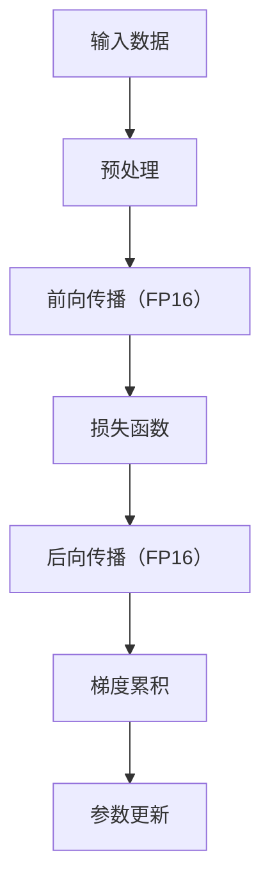

                 

# 混合精度训练：平衡计算速度和模型精度

> 关键词：混合精度训练,FP16,模型压缩,计算速度,模型精度

## 1. 背景介绍

### 1.1 问题由来
在深度学习领域，尤其是大规模深度神经网络训练过程中，计算速度和模型精度是一对永恒的矛盾。尽管我们希望在保证模型性能的前提下，尽可能提高计算速度，但实际训练过程中，计算速度和模型精度通常是此消彼长的关系。特别是，在训练过程中使用浮点数精度（Float Point Precision, FP32）不仅占用了大量的计算资源，而且可能导致训练时间过长，资源浪费严重。

而混合精度训练（Mixed Precision Training, MPT）技术，是一种能在保持较高模型精度的情况下，大幅提高训练速度的优化方法。MPT通过将浮点数的精度降低，实现更高效的计算和存储，从而在保证模型效果的同时，大大缩短训练时间，节省计算资源。

## 2. 核心概念与联系

### 2.1 核心概念概述

混合精度训练是一种优化深度学习模型训练速度的技术，通过降低部分计算和存储的精度，以达到在不损失模型精度的情况下，加快训练速度和降低资源消耗的目的。该技术广泛适用于各种深度学习模型，尤其是在大规模神经网络训练中，可以显著提升训练效率。

在混合精度训练中，通常使用16位浮点数（Float Point Number, FP16）作为中间计算的精度，同时保留32位浮点数（Float Point Number, FP32）作为关键的权重参数和梯度参数的存储精度。这样的设计在保证模型精度的情况下，大大降低了计算和存储的需求，从而提高了训练速度。

混合精度训练的原理可以通过以下几部分理解：

1. **数据类型转换**：在模型中，某些中间计算（如卷积、矩阵乘法等）使用16位浮点数，而关键的权重参数和梯度参数则使用32位浮点数。这种数据类型转换，使得模型可以在不损失精度的情况下，提高计算速度。

2. **梯度累积**：由于16位浮点数精度有限，可能会在反向传播过程中产生梯度截断（Gradient Truncation）现象。因此，需要引入梯度累积（Gradient Accumulation）技术，即将多个小批量的梯度进行累加，再更新权重参数，从而保证训练的准确性。

3. **混合精度优化器**：传统的优化器（如Adam）在计算过程中使用的是32位浮点数，难以直接应用到混合精度训练中。因此，需要开发新的优化器，使其能够在混合精度环境中高效运行。

### 2.2 核心概念联系
以下是一个简单的Mermaid流程图，展示了混合精度训练的主要流程：



该流程图的解释如下：

- A代表输入数据，经过B的预处理后，进入C进行前向传播，使用16位浮点数精度。
- 在D中计算损失函数，返回E进行后向传播，同样使用16位浮点数精度。
- 在E中计算梯度，并使用F的梯度累积技术进行处理，以保证计算准确性。
- 最终，在G中进行参数更新，使用32位浮点数精度。

## 3. 核心算法原理 & 具体操作步骤

### 3.1 算法原理概述

混合精度训练的原理可以总结如下：

1. **数据类型转换**：在前向传播过程中，将中间计算的数据类型转换为16位浮点数，而关键的权重参数和梯度参数保持32位浮点数。

2. **梯度累积**：在反向传播过程中，将多个小批量的梯度进行累加，再更新32位浮点数的权重参数。

3. **混合精度优化器**：使用特殊的优化器，支持16位浮点数计算，同时保持32位浮点数参数的精度。

### 3.2 算法步骤详解

以下是混合精度训练的详细步骤：

1. **准备数据和模型**：
   - 选择合适的数据集，准备训练和验证数据。
   - 加载预训练模型或初始化新的模型。

2. **定义混合精度模式**：
   - 使用深度学习框架提供的混合精度模式，如TensorFlow的`mixed_precision`，PyTorch的`amp`等，将模型和数据转换为混合精度环境。

3. **定义训练循环**：
   - 定义训练循环，包括设置批次大小、学习率、迭代轮数等超参数。
   - 在每个迭代轮次中，进行前向传播、计算损失、反向传播和参数更新。

4. **使用梯度累积**：
   - 在反向传播过程中，将多个小批量的梯度进行累加，再更新32位浮点数的权重参数。
   - 使用梯度累积时，需要根据模型的复杂度和硬件资源调整累积次数。

5. **保存和加载模型**：
   - 在训练过程中定期保存模型权重，以防万一训练中断。
   - 使用保存好的模型权重，继续进行训练或评估。

6. **评估模型性能**：
   - 在验证集或测试集上评估模型性能，对比使用混合精度和全精度（FP32）的效果。
   - 根据评估结果调整超参数，重新训练模型。

### 3.3 算法优缺点

混合精度训练具有以下优点：

- **训练速度提升**：通过使用16位浮点数，显著提高了计算和存储速度，减少了训练时间。
- **资源占用降低**：减少了内存和硬盘的占用，降低了计算资源的需求。
- **模型精度保持**：通过梯度累积等技术，保证了模型的精度和训练的准确性。

但同时，混合精度训练也存在一些缺点：

- **硬件要求高**：需要支持16位浮点数的硬件平台，如NVIDIA的Volta及更高版本的GPU。
- **调试复杂**：混合精度训练的调试和优化需要更多的技术和经验。
- **模型兼容性有限**：部分模型和算法可能不兼容混合精度训练，需要进行特殊处理。

### 3.4 算法应用领域

混合精度训练在深度学习领域的应用非常广泛，尤其在以下领域中表现尤为突出：

- **计算机视觉**：如卷积神经网络（CNN）、残差网络（ResNet）等，这些网络结构复杂，训练耗时长。
- **自然语言处理**：如Transformer等模型，其在处理大规模语言数据时，计算需求巨大。
- **语音识别**：如循环神经网络（RNN）、卷积神经网络（CNN）等，这些模型在处理音频信号时，计算需求高。
- **推荐系统**：如深度神经网络（DNN）、协同过滤（Collaborative Filtering）等，这些模型在处理大量用户行为数据时，计算需求大。
- **游戏AI**：如强化学习（Reinforcement Learning）、神经网络控制（Neural Network Control）等，这些模型在处理复杂环境时，计算需求高。

以上领域中，混合精度训练被广泛采用，以提高训练速度和模型性能。

## 4. 数学模型和公式 & 详细讲解 & 举例说明

### 4.1 数学模型构建

混合精度训练的数学模型主要包括以下几个关键部分：

- 定义模型的前向传播过程，使用16位浮点数精度。
- 定义损失函数，使用32位浮点数表示。
- 定义后向传播过程，使用16位浮点数精度。
- 定义梯度累积策略，确保32位浮点数的权重参数更新。

### 4.2 公式推导过程

假设模型结构为$f(x;\theta)$，其中$x$为输入数据，$\theta$为模型参数。在混合精度训练中，前向传播、损失函数、后向传播和参数更新的公式分别为：

- 前向传播：
  $$
  y = f(x;\theta_{fp16})
  $$
- 损失函数：
  $$
  L = \frac{1}{N}\sum_{i=1}^N l(y_i, y_i^*)
  $$
- 后向传播：
  $$
  \frac{\partial L}{\partial \theta} = \frac{\partial L}{\partial y} \frac{\partial y}{\partial x} \frac{\partial x}{\partial \theta}
  $$
- 参数更新：
  $$
  \theta \leftarrow \theta - \eta \nabla_{\theta}L
  $$

其中$y$为模型的预测输出，$y_i^*$为真实标签，$l$为损失函数，$\eta$为学习率，$\nabla_{\theta}L$为损失函数对模型参数的梯度。

### 4.3 案例分析与讲解

以下是一个简单的混合精度训练案例，以全连接神经网络（Fully Connected Neural Network）为例：

```python
import torch
import torch.nn as nn
import torch.optim as optim
from torch.cuda.amp import autocast

# 定义模型
model = nn.Sequential(
    nn.Linear(784, 128),
    nn.ReLU(),
    nn.Linear(128, 10),
    nn.Softmax(dim=-1)
)

# 定义混合精度模式
model.half()

# 定义训练循环
criterion = nn.CrossEntropyLoss()
optimizer = optim.Adam(model.parameters(), lr=0.001)

def train_epoch(model, data_loader, criterion, optimizer, device):
    model.train()
    total_loss = 0
    for inputs, labels in data_loader:
        inputs, labels = inputs.to(device), labels.to(device)
        with autocast():
            outputs = model(inputs)
            loss = criterion(outputs, labels)
        optimizer.zero_grad()
        loss.backward()
        optimizer.step()
        total_loss += loss.item()
    return total_loss / len(data_loader)

def evaluate(model, data_loader, criterion, device):
    model.eval()
    total_loss = 0
    with torch.no_grad():
        for inputs, labels in data_loader:
            inputs, labels = inputs.to(device), labels.to(device)
            outputs = model(inputs)
            loss = criterion(outputs, labels)
            total_loss += loss.item()
    return total_loss / len(data_loader)

# 训练模型
device = torch.device('cuda')
for epoch in range(10):
    loss = train_epoch(model, train_loader, criterion, optimizer, device)
    print(f"Epoch {epoch+1}, train loss: {loss:.4f}")
    
    loss = evaluate(model, test_loader, criterion, device)
    print(f"Epoch {epoch+1}, test loss: {loss:.4f}")
```

该案例中，模型使用16位浮点数（Half Precision, FP16）进行前向传播和后向传播，而损失函数和参数更新仍然使用32位浮点数（Full Precision, FP32）。在每个迭代轮次中，使用`autocast`自动切换精度，确保模型的精度和训练速度。

## 5. 项目实践：代码实例和详细解释说明

### 5.1 开发环境搭建

为了进行混合精度训练，需要搭建一个适合混合精度训练的开发环境。以下是使用PyTorch进行混合精度训练的环境配置流程：

1. **安装Anaconda**：
   ```bash
   conda install anaconda
   conda init
   ```

2. **创建虚拟环境**：
   ```bash
   conda create --name mpt-env python=3.8
   conda activate mpt-env
   ```

3. **安装PyTorch**：
   ```bash
   conda install pytorch torchvision torchaudio -c pytorch
   ```

4. **安装混合精度优化库**：
   ```bash
   pip install amp
   ```

5. **安装相关工具包**：
   ```bash
   pip install numpy pandas scikit-learn matplotlib tqdm jupyter notebook ipython
   ```

完成上述步骤后，即可在`mpt-env`环境中进行混合精度训练的实践。

### 5.2 源代码详细实现

以下是一个使用混合精度训练的PyTorch代码实现：

```python
import torch
import torch.nn as nn
import torch.optim as optim
from torch.cuda.amp import autocast, GradScaler

# 定义模型
model = nn.Sequential(
    nn.Linear(784, 128),
    nn.ReLU(),
    nn.Linear(128, 10),
    nn.Softmax(dim=-1)
)

# 定义混合精度模式
scaler = GradScaler()
model.half()

# 定义训练循环
criterion = nn.CrossEntropyLoss()
optimizer = optim.Adam(model.parameters(), lr=0.001)

def train_epoch(model, data_loader, criterion, optimizer, device):
    model.train()
    total_loss = 0
    for inputs, labels in data_loader:
        inputs, labels = inputs.to(device), labels.to(device)
        with autocast():
            outputs = model(inputs)
            loss = criterion(outputs, labels)
        scaler.scale(loss).backward()
        scaler.step(optimizer)
        scaler.update()
        total_loss += loss.item()
    return total_loss / len(data_loader)

def evaluate(model, data_loader, criterion, device):
    model.eval()
    total_loss = 0
    with torch.no_grad():
        for inputs, labels in data_loader:
            inputs, labels = inputs.to(device), labels.to(device)
            outputs = model(inputs)
            loss = criterion(outputs, labels)
            total_loss += loss.item()
    return total_loss / len(data_loader)

# 训练模型
device = torch.device('cuda')
for epoch in range(10):
    loss = train_epoch(model, train_loader, criterion, optimizer, device)
    print(f"Epoch {epoch+1}, train loss: {loss:.4f}")
    
    loss = evaluate(model, test_loader, criterion, device)
    print(f"Epoch {epoch+1}, test loss: {loss:.4f}")
```

该代码中，使用了`autocast`自动切换精度，同时使用`GradScaler`进行梯度缩放，以确保混合精度训练的稳定性和精度。

### 5.3 代码解读与分析

以下是关键代码的解读和分析：

**模型定义**：
```python
model = nn.Sequential(
    nn.Linear(784, 128),
    nn.ReLU(),
    nn.Linear(128, 10),
    nn.Softmax(dim=-1)
)
```

该代码定义了一个简单的全连接神经网络，用于手写数字识别任务。其中，输入层有784个节点，输出层有10个节点，表示0到9的数字。

**混合精度模式**：
```python
scaler = GradScaler()
model.half()
```

通过`scaler`进行梯度缩放，以确保混合精度训练的稳定性。`model.half()`将模型参数转换为16位浮点数精度，进行前向传播和后向传播。

**训练循环**：
```python
def train_epoch(model, data_loader, criterion, optimizer, device):
    model.train()
    total_loss = 0
    for inputs, labels in data_loader:
        inputs, labels = inputs.to(device), labels.to(device)
        with autocast():
            outputs = model(inputs)
            loss = criterion(outputs, labels)
        scaler.scale(loss).backward()
        scaler.step(optimizer)
        scaler.update()
        total_loss += loss.item()
    return total_loss / len(data_loader)
```

在每个迭代轮次中，使用`autocast`自动切换精度，计算损失并更新参数。`scaler.scale()`进行梯度缩放，`scaler.step()`更新参数，`scaler.update()`更新缩放因子。

**评估函数**：
```python
def evaluate(model, data_loader, criterion, device):
    model.eval()
    total_loss = 0
    with torch.no_grad():
        for inputs, labels in data_loader:
            inputs, labels = inputs.to(device), labels.to(device)
            outputs = model(inputs)
            loss = criterion(outputs, labels)
            total_loss += loss.item()
    return total_loss / len(data_loader)
```

评估函数与训练函数类似，但在`with torch.no_grad()`中关闭梯度计算，以节省计算资源。

## 6. 实际应用场景

### 6.1 计算机视觉

混合精度训练在计算机视觉领域得到了广泛应用。在图像分类、目标检测、实例分割等任务中，大规模的深度神经网络（如ResNet、Inception等）对计算资源的需求巨大，训练时间往往长达数天甚至数周。通过混合精度训练，可以显著提升训练速度，缩短开发周期。

### 6.2 自然语言处理

在自然语言处理领域，如文本分类、机器翻译、情感分析等任务中，大规模的语言模型（如BERT、GPT等）对计算资源的需求同样高。混合精度训练可以在保持模型性能的前提下，大幅提升训练速度，同时减少硬件资源占用。

### 6.3 语音识别

语音识别任务中，如自动语音识别（ASR）、语音合成（TTS）等，需要处理大量的音频信号，计算需求大。混合精度训练可以显著提高训练速度，使得模型更易于部署和应用。

### 6.4 推荐系统

推荐系统中的深度神经网络（DNN）、协同过滤（Collaborative Filtering）等模型，在处理用户行为数据时，计算需求高。混合精度训练可以大幅提升训练速度，提高模型预测的准确性。

## 7. 工具和资源推荐

### 7.1 学习资源推荐

为了帮助开发者系统掌握混合精度训练的理论基础和实践技巧，这里推荐一些优质的学习资源：

1. 《深度学习理论与实践》书籍：该书深入浅出地介绍了深度学习的基本原理和实践方法，包括混合精度训练在内的多个前沿技术。

2. 《深度学习入门：基于PyTorch的理论与实现》博文系列：该系列博文详细讲解了使用PyTorch进行深度学习开发的过程，包括混合精度训练在内。

3. CS231n《卷积神经网络》课程：斯坦福大学开设的计算机视觉经典课程，详细介绍了混合精度训练等优化技术。

4. NVIDIA官方文档：NVIDIA提供的混合精度训练指南，涵盖了混合精度计算、硬件优化等详细内容。

5. TensorFlow混合精度训练教程：TensorFlow官方提供的混合精度训练教程，包括混合精度优化器和梯度累积的实现。

### 7.2 开发工具推荐

高效的混合精度训练开发需要选择合适的工具支持。以下是几款用于混合精度训练开发的常用工具：

1. PyTorch：基于Python的开源深度学习框架，支持混合精度训练，适合快速迭代研究。

2. TensorFlow：由Google主导开发的开源深度学习框架，支持混合精度计算，适合大规模工程应用。

3. NVIDIA混合精度计算库：NVIDIA提供的混合精度计算库，支持GPU平台上的高效计算。

4. PyTorch混合精度训练插件：PyTorch提供的混合精度训练插件，简化混合精度训练的实现。

5. NVIDIA混合精度计算库：NVIDIA提供的混合精度计算库，支持GPU平台上的高效计算。

### 7.3 相关论文推荐

混合精度训练是深度学习领域的重要研究课题，以下是几篇奠基性的相关论文，推荐阅读：

1. "Mixed Precision Training with Tensor Cores"：NVIDIA的混合精度训练白皮书，详细介绍了混合精度训练的理论基础和实践方法。

2. "Model Parallelism in Mixed Precision for Deep Learning"：NVIDIA关于模型并行混合精度训练的研究论文，探讨了混合精度训练在模型并行中的实现方法。

3. "Weight-Centralized Distributed Training with Mixed-Precision"：NVIDIA关于分布式混合精度训练的研究论文，研究了混合精度训练在分布式系统中的优化方法。

4. "Precise and Efficient Deep Neural Network Trains with Mixed-Precision Adaptive Estimation"：NVIDIA关于混合精度训练中精度自适应估计的研究论文，提出了混合精度训练中的精度自适应方法。

5. "Learning to Train"：NVIDIA关于混合精度训练中学习率优化的方法研究论文，探讨了混合精度训练中的学习率优化策略。

这些论文代表了混合精度训练的研究进展，通过学习这些前沿成果，可以帮助研究者把握学科前进方向，激发更多的创新灵感。

## 8. 总结：未来发展趋势与挑战

### 8.1 研究成果总结

本文对混合精度训练的原理、操作步骤和实际应用进行了详细讲解。混合精度训练在深度学习领域具有重要的应用价值，能够在保持模型精度的情况下，大幅提升训练速度和计算效率。通过对比浮点数精度和混合精度训练的效果，本文从理论和实践两个方面展示了混合精度训练的优越性。

### 8.2 未来发展趋势

展望未来，混合精度训练技术将呈现以下几个发展趋势：

1. **硬件支持不断优化**：随着硬件技术的进步，混合精度训练将得到更广泛的支持。越来越多的硬件平台将支持16位浮点数的计算，使得混合精度训练在更多场景下得以应用。

2. **软件工具更加丰富**：混合精度训练相关的软件工具将不断丰富，包括混合精度优化器、混合精度训练插件等，使得开发者能够更便捷地进行混合精度训练。

3. **模型规模持续增大**：随着模型规模的不断增大，混合精度训练在保持模型精度的情况下，能够更高效地进行大规模深度学习模型的训练。

4. **模型压缩与量化**：混合精度训练将与其他模型压缩和量化技术结合，进一步提升模型的计算效率和存储效率。

5. **混合精度与其他技术的融合**：混合精度训练将与其他深度学习技术（如模型并行、分布式训练等）结合，形成更加全面的优化策略。

### 8.3 面临的挑战

尽管混合精度训练技术取得了显著成效，但在实际应用中仍面临一些挑战：

1. **硬件兼容性**：不同的硬件平台支持不同的精度类型，混合精度训练需要考虑兼容性问题。

2. **模型精度保证**：混合精度训练需要保证模型的精度，避免因为精度降低导致的模型效果下降。

3. **调试复杂性**：混合精度训练的调试和优化需要更多的技术支持，增加了开发难度。

4. **模型兼容性**：部分模型和算法可能不兼容混合精度训练，需要进行特殊处理。

### 8.4 研究展望

未来的研究需要在以下几个方面寻求新的突破：

1. **混合精度训练的普适性**：研究如何在更多深度学习任务中应用混合精度训练，使得混合精度训练成为一种通用的优化技术。

2. **混合精度训练的自动化**：研究混合精度训练的自动化优化方法，使得开发者能够更方便地进行混合精度训练，降低开发难度。

3. **混合精度训练与其他技术的结合**：研究混合精度训练与其他深度学习技术的结合方式，形成更加全面的优化策略。

4. **混合精度训练的理论基础**：研究混合精度训练的理论基础，探索混合精度训练的数学模型和优化方法。

通过这些研究方向的探索，将进一步提升混合精度训练的效率和效果，推动深度学习技术的不断发展。

## 9. 附录：常见问题与解答

**Q1：什么是混合精度训练？**

A: 混合精度训练是一种优化深度学习模型训练速度的技术，通过降低部分计算和存储的精度，以在不损失模型精度的情况下，加快训练速度和降低资源消耗。

**Q2：混合精度训练如何实现？**

A: 混合精度训练通过将中间计算的数据类型转换为16位浮点数，同时保持关键的权重参数和梯度参数使用32位浮点数。在反向传播过程中，使用梯度累积技术，将多个小批量的梯度进行累加，再更新32位浮点数的权重参数。

**Q3：混合精度训练的优缺点是什么？**

A: 优点包括：
1. 训练速度提升：使用16位浮点数，显著提高了计算和存储速度，减少了训练时间。
2. 资源占用降低：减少了内存和硬盘的占用，降低了计算资源的需求。
3. 模型精度保持：通过梯度累积等技术，保证了模型的精度和训练的准确性。

缺点包括：
1. 硬件要求高：需要支持16位浮点数的硬件平台。
2. 调试复杂：混合精度训练的调试和优化需要更多的技术和经验。
3. 模型兼容性有限：部分模型和算法可能不兼容混合精度训练，需要进行特殊处理。

**Q4：混合精度训练适用于哪些场景？**

A: 混合精度训练适用于计算需求高的深度学习任务，如计算机视觉、自然语言处理、语音识别、推荐系统等。这些领域中的大规模深度神经网络，对计算资源的需求巨大，使用混合精度训练可以显著提升训练速度和计算效率。

**Q5：混合精度训练和全精度训练有什么区别？**

A: 混合精度训练和全精度训练的主要区别在于计算精度和存储空间的不同。全精度训练使用32位浮点数进行计算和存储，而混合精度训练使用16位浮点数进行中间计算，同时保持32位浮点数作为关键的权重参数和梯度参数。这种设计在不损失模型精度的情况下，提高了计算和存储效率。

**Q6：混合精度训练如何保证模型精度？**

A: 混合精度训练通过梯度累积等技术，确保模型参数的更新准确性。在使用16位浮点数进行中间计算时，如果梯度值较小，容易出现梯度截断现象。因此，通过将多个小批量的梯度进行累加，再进行参数更新，可以确保梯度的准确性和模型精度的保持。

这些问题的解答，为读者提供了混合精度训练的详细理解，帮助开发者更好地掌握混合精度训练技术，提升深度学习模型的开发效率和性能。

