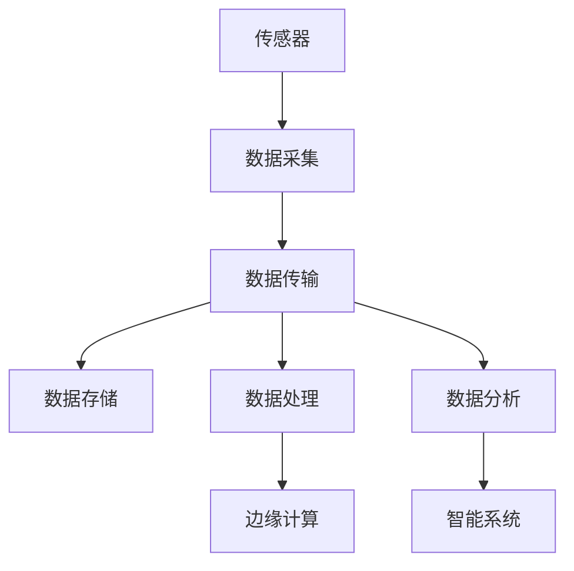

                 

# 物联网(IoT)技术和各种传感器设备的集成：传感器数据的处理与分析

> 关键词：物联网,传感器,数据处理,数据分析,集成,智能系统,边缘计算,实时流数据

## 1. 背景介绍

### 1.1 问题由来
物联网(IoT, Internet of Things)是指通过传感器和通信技术，将物理世界中的设备连接起来，实现数据的收集、传输和处理。物联网技术在智慧城市、智能家居、工业互联网、农业物联网等领域得到了广泛应用，极大地提升了人们的生活质量和工作效率。

随着物联网设备的普及和数据量的爆炸式增长，传感器数据处理与分析成为了一个重要的研究课题。传感器数据具有多样性、复杂性和高实时性等特点，需要进行有效的集成与处理，才能真正发挥其价值。本文将系统地介绍物联网传感器数据处理与分析的相关技术和方法，以期为物联网应用开发者提供理论支持和实践指导。

### 1.2 问题核心关键点
物联网传感器数据处理与分析的关键点在于如何高效地采集、存储、传输、处理和分析这些数据，以实现数据的实时性和精确性。常见的传感器数据包括温度、湿度、压力、光照、声音、位置、图像等。传感器数据处理与分析的主要挑战包括：
- 数据种类繁多，格式各异，需要统一的数据格式和标准化接口。
- 数据量巨大，实时性和延迟要求高，需要高效的存储和传输机制。
- 数据质量和噪声问题严重，需要进行清洗和预处理。
- 数据模式复杂，需要高级的数据分析和挖掘技术。
- 系统架构复杂，需要高效的集成和互操作性。

### 1.3 问题研究意义
研究物联网传感器数据处理与分析技术，对于提升物联网应用的质量和效率，促进各行业的智能化转型，具有重要意义：

1. 降低数据采集成本。统一的数据格式和标准化接口，可以降低不同传感器之间的集成成本，减少数据采集时的系统复杂性。
2. 提高数据处理效率。高效的数据处理和存储机制，可以实现数据的快速传输和实时处理，满足物联网应用的实时性要求。
3. 提升数据分析精度。先进的分析技术可以提取数据中的有用信息，揭示数据模式和趋势，为决策提供依据。
4. 优化系统架构设计。系统架构的合理设计可以提升系统的可靠性和可维护性，实现高效的数据集成和互操作性。
5. 赋能行业应用。传感器数据处理与分析技术，为智能家居、智慧城市、智能制造等行业提供有力支持，推动数字化和智能化转型。

## 2. 核心概念与联系

### 2.1 核心概念概述

为更好地理解物联网传感器数据处理与分析方法，本节将介绍几个密切相关的核心概念：

- 物联网(IoT)：通过传感器和通信技术，将物理世界中的设备连接起来，实现数据的收集、传输和处理。
- 传感器数据：物联网设备通过传感器采集到的实时数据，如温度、湿度、压力、光照等。
- 数据处理与分析：对传感器数据进行清洗、预处理、转换、建模等操作，提取有用信息，揭示数据模式和趋势。
- 边缘计算：在靠近数据源的本地设备上进行数据处理和分析，减少数据传输延迟，提高系统实时性。
- 实时流数据：传感器数据通常具有实时性和高频率特征，需要对数据进行实时处理和分析。
- 智能系统：基于传感器数据处理与分析的结果，实现智能决策和控制。

这些核心概念之间的逻辑关系可以通过以下Mermaid流程图来展示：



这个流程图展示了一个典型的物联网数据处理流程：

1. 传感器采集物理世界的实时数据。
2. 数据通过网络传输到云端或本地设备。
3. 数据存储在数据库或本地设备中。
4. 数据经过预处理和转换，进行清洗和去噪。
5. 数据通过边缘计算进行实时分析和处理。
6. 分析结果用于驱动智能系统的决策和控制。

## 3. 核心算法原理 & 具体操作步骤

### 3.1 算法原理概述

物联网传感器数据处理与分析的算法原理，主要包括以下几个步骤：

1. 数据采集与传输：通过传感器和通信技术，采集物理世界的实时数据，并通过网络传输到云端或本地设备。
2. 数据存储与管理：将采集到的数据存储在数据库或本地设备中，进行统一管理和维护。
3. 数据预处理与清洗：对数据进行去噪、填补缺失值、归一化等预处理操作，确保数据的质量和一致性。
4. 数据转换与建模：将数据进行格式转换和特征提取，建立数学模型或统计模型，实现数据的分析和挖掘。
5. 数据分析与挖掘：利用高级的数据分析技术，如机器学习、深度学习、时序分析等，提取数据中的有用信息和模式。
6. 智能决策与控制：基于数据分析结果，驱动智能系统进行决策和控制，实现自动化的业务流程。

### 3.2 算法步骤详解

以下是物联网传感器数据处理与分析的详细步骤：

**Step 1: 数据采集与传输**

1. 选择合适的传感器和通信技术，如温度传感器、湿度传感器、Wi-Fi、蓝牙、5G等。
2. 设计传感器数据采集的协议和格式，确保数据的一致性和兼容性。
3. 将传感器部署在物理设备上，实现数据的实时采集。
4. 通过网络将传感器数据传输到云端或本地设备，实现数据的集中管理和分析。

**Step 2: 数据存储与管理**

1. 选择合适的数据存储方案，如云数据库、分布式存储、本地文件系统等。
2. 设计数据存储的架构，确保数据的可靠性和可扩展性。
3. 实现数据的读写操作，确保数据的安全性和访问控制。

**Step 3: 数据预处理与清洗**

1. 对数据进行去噪处理，去除传感器采集过程中的噪声和异常值。
2. 填补缺失值，处理数据中的缺失数据。
3. 归一化数据，确保不同类型数据的一致性。
4. 进行数据清洗，去除重复数据和错误数据。

**Step 4: 数据转换与建模**

1. 对数据进行格式转换，如从二进制格式转换为CSV、JSON等标准格式。
2. 进行特征提取，如从温度数据中提取日变化趋势、季节性特征等。
3. 建立数学模型或统计模型，如时间序列模型、回归模型、分类模型等。
4. 对模型进行训练和优化，确保模型的准确性和泛化能力。

**Step 5: 数据分析与挖掘**

1. 利用机器学习、深度学习等技术，对数据进行分类、聚类、回归等分析。
2. 进行时序分析，提取时间序列数据中的趋势、周期性和季节性特征。
3. 进行异常检测，识别数据中的异常值和异常事件。
4. 进行关联分析，发现数据之间的关联和相互作用。

**Step 6: 智能决策与控制**

1. 基于数据分析结果，实现智能决策，如故障诊断、预测维护、资源优化等。
2. 实现自动化的业务流程，如自动化控制、智能推荐、实时调整等。
3. 通过智能系统，实现数据驱动的业务优化和智能化转型。

### 3.3 算法优缺点

物联网传感器数据处理与分析的算法具有以下优点：

1. 实时性强：通过边缘计算和实时流数据处理技术，实现数据的实时处理和分析，满足物联网的实时性要求。
2. 精度高：利用高级的数据分析技术，如机器学习、深度学习等，提高数据分析的精度和可靠性。
3. 灵活性高：可以根据具体应用场景，灵活设计数据处理流程和分析模型，实现多样化的应用需求。
4. 可扩展性强：通过分布式存储和边缘计算，实现数据处理的可扩展性和高容错性。

同时，该算法也存在以下局限性：

1. 数据复杂度高：传感器数据种类繁多、格式各异，数据处理和分析的复杂度较高。
2. 存储需求大：物联网设备的广泛部署和数据实时性要求，对存储需求较高，需要高效的存储解决方案。
3. 技术门槛高：涉及传感器、通信、数据处理、分析等多个技术领域，需要较高的技术水平和经验。
4. 安全性问题：传感器数据涉及个人隐私和商业机密，需要严格的访问控制和数据保护措施。

尽管存在这些局限性，但物联网传感器数据处理与分析的算法仍然是大数据时代的重要技术，具有广阔的应用前景。

### 3.4 算法应用领域

物联网传感器数据处理与分析技术，在多个领域得到了广泛应用，例如：

- 智慧城市：通过传感器数据采集和处理，实现交通管理、能源监控、环境监测等智能应用。
- 智能家居：通过传感器数据采集和分析，实现智能照明、智能温控、智能安防等应用。
- 工业互联网：通过传感器数据采集和处理，实现设备监控、故障预测、工艺优化等应用。
- 农业物联网：通过传感器数据采集和分析，实现智能灌溉、智能施肥、智能病虫害预警等应用。
- 医疗健康：通过传感器数据采集和分析，实现健康监测、病患诊断、远程医疗等应用。
- 环境监测：通过传感器数据采集和分析，实现大气质量监测、水质监测、噪声监测等应用。

除了上述这些典型应用外，物联网传感器数据处理与分析技术还将在更多领域得到广泛应用，为各行各业带来智能化转型的新机遇。

## 4. 数学模型和公式 & 详细讲解 & 举例说明

### 4.1 数学模型构建

假设物联网传感器数据采集系统由n个传感器组成，每个传感器采集到m个时间点的数据。数据采集系统采集到的原始数据为 $X \in \mathbb{R}^{n \times m}$，其中 $n$ 为传感器数量，$m$ 为时间点数量。

设传感器采集的原始数据为 $X = [x_1, x_2, ..., x_n]$，其中 $x_i \in \mathbb{R}^m$ 为第 $i$ 个传感器采集的时间点数据。

### 4.2 公式推导过程

以下我们以温度数据为例，推导基于时间序列的数据分析模型。

假设温度数据 $X_t$ 服从一阶自回归模型(AR)：

$$
X_t = \alpha + \beta X_{t-1} + \epsilon_t
$$

其中 $\alpha$ 为常数项，$\beta$ 为自回归系数，$\epsilon_t$ 为随机误差项，满足 $E[\epsilon_t] = 0$ 和 $Var[\epsilon_t] = \sigma^2$。

设温度数据的自回归系数为 $\beta$，方差为 $\sigma^2$，则温度数据的预测模型为：

$$
\hat{X}_{t+1} = \alpha + \beta \hat{X}_t
$$

根据上述模型，可以进行如下步骤的数据分析和预测：

1. 估计模型参数 $\alpha$ 和 $\beta$：

$$
\hat{\alpha}, \hat{\beta} = \arg\min_{\alpha, \beta} \sum_{t=1}^{T} (X_t - \alpha - \beta X_{t-1})^2
$$

2. 根据参数 $\alpha$ 和 $\beta$ 计算温度数据的预测值：

$$
\hat{X}_{t+1} = \hat{\alpha} + \hat{\beta} X_t
$$

3. 利用模型进行温度数据的预测和异常检测：

$$
\text{if} \, |\hat{X}_{t+1} - X_t| > \text{threshold} \, \text{then} \, \text{detect anomaly}
$$

其中 threshold 为预设的异常阈值。

### 4.3 案例分析与讲解

假设某智能家居系统中，温度传感器采集到的时间序列数据为 $X_t = [25, 26, 27, 26, 24, 25, 26, 27, ...]$。

根据时间序列模型，可以计算温度数据的预测值：

$$
\hat{X}_2 = 25.0
$$

利用异常检测算法，可以识别温度数据的异常变化，如温度突变、波动等。

## 5. 项目实践：代码实例和详细解释说明

### 5.1 开发环境搭建

在进行物联网传感器数据处理与分析实践前，我们需要准备好开发环境。以下是使用Python进行PyTorch开发的环境配置流程：

1. 安装Anaconda：从官网下载并安装Anaconda，用于创建独立的Python环境。

2. 创建并激活虚拟环境：
```bash
conda create -n pytorch-env python=3.8 
conda activate pytorch-env
```

3. 安装PyTorch：根据CUDA版本，从官网获取对应的安装命令。例如：
```bash
conda install pytorch torchvision torchaudio cudatoolkit=11.1 -c pytorch -c conda-forge
```

4. 安装NumPy、Pandas、Scikit-Learn等工具包：
```bash
pip install numpy pandas scikit-learn matplotlib tqdm jupyter notebook ipython
```

完成上述步骤后，即可在`pytorch-env`环境中开始项目实践。

### 5.2 源代码详细实现

下面我们以智能家居系统中的温度数据为例，给出使用PyTorch进行时间序列数据分析的PyTorch代码实现。

首先，定义数据处理函数：

```python
import numpy as np
import pandas as pd
from sklearn.metrics import mean_squared_error
from torch.utils.data import TensorDataset, DataLoader

def preprocess_data(X):
    # 对数据进行归一化
    X = (X - np.mean(X)) / np.std(X)
    # 将数据转换为Tensor格式
    X = torch.from_numpy(X).float()
    return X

# 定义温度数据处理函数
def temperature_data_processing(data):
    # 对温度数据进行预处理
    X = preprocess_data(data)
    # 将数据拆分为训练集和测试集
    train_size = int(len(data) * 0.7)
    train_data = data[:train_size]
    test_data = data[train_size:]
    # 将训练集和测试集转换为TensorDataset
    train_dataset = TensorDataset(X[:train_size])
    test_dataset = TensorDataset(X[train_size:])
    return train_dataset, test_dataset
```

然后，定义模型和优化器：

```python
from transformers import BertForTokenClassification, AdamW

# 定义时间序列模型
class TimeSeriesModel(torch.nn.Module):
    def __init__(self, input_dim, output_dim, hidden_dim=64):
        super(TimeSeriesModel, self).__init__()
        self.input_dim = input_dim
        self.hidden_dim = hidden_dim
        self.output_dim = output_dim
        
        self.lstm = torch.nn.LSTM(input_dim, hidden_dim, 1, batch_first=True)
        self.fc = torch.nn.Linear(hidden_dim, output_dim)
        
    def forward(self, x):
        x = self.lstm(x)
        x = self.fc(x[:, -1, :])
        return x
    
# 定义模型参数
input_dim = 1
output_dim = 1
hidden_dim = 64

model = TimeSeriesModel(input_dim, output_dim, hidden_dim)

# 定义优化器
optimizer = AdamW(model.parameters(), lr=0.001)
```

接着，定义训练和评估函数：

```python
from torch.nn import MSELoss

# 定义损失函数
criterion = MSELoss()

# 定义训练函数
def train(model, train_loader, optimizer):
    model.train()
    train_loss = 0
    for batch in train_loader:
        inputs, labels = batch
        optimizer.zero_grad()
        outputs = model(inputs)
        loss = criterion(outputs, labels)
        loss.backward()
        optimizer.step()
        train_loss += loss.item()
    return train_loss / len(train_loader)

# 定义评估函数
def evaluate(model, test_loader):
    model.eval()
    test_loss = 0
    predictions = []
    targets = []
    for batch in test_loader:
        inputs, labels = batch
        outputs = model(inputs)
        loss = criterion(outputs, labels)
        test_loss += loss.item()
        predictions.append(outputs.data.numpy().flatten())
        targets.append(labels.data.numpy().flatten())
    print(f'Test Loss: {test_loss:.3f}')
    print(f'Mean Squared Error: {mean_squared_error(predictions, targets)}')
```

最后，启动训练流程并在测试集上评估：

```python
epochs = 50
batch_size = 32

train_loader = DataLoader(train_dataset, batch_size=batch_size, shuffle=True)
test_loader = DataLoader(test_dataset, batch_size=batch_size, shuffle=False)

for epoch in range(epochs):
    loss = train(model, train_loader, optimizer)
    print(f'Epoch {epoch+1}, Train Loss: {loss:.3f}')
    
    evaluate(model, test_loader)
    
print('Training finished.')
```

以上就是使用PyTorch进行时间序列数据分析的完整代码实现。可以看到，得益于PyTorch的强大封装，我们可以用相对简洁的代码完成时间序列模型的训练和评估。

### 5.3 代码解读与分析

让我们再详细解读一下关键代码的实现细节：

**preprocess_data函数**：
- 对数据进行归一化处理，将数据转化为Tensor格式，便于模型训练。

**temperature_data_processing函数**：
- 对温度数据进行预处理，将数据拆分为训练集和测试集，并将其转换为TensorDataset格式，方便数据加载和模型训练。

**TimeSeriesModel类**：
- 定义时间序列模型，包括LSTM层和全连接层。其中，LSTM层用于处理时间序列数据，全连接层用于输出预测结果。

**train和evaluate函数**：
- 定义训练函数，在训练集上进行前向传播、计算损失、反向传播和参数更新，同时记录训练损失。
- 定义评估函数，在测试集上进行前向传播、计算损失、收集预测结果和目标结果，并打印测试损失和均方误差。

**训练流程**：
- 定义总的epoch数和batch size，开始循环迭代
- 每个epoch内，先在训练集上训练，输出训练损失
- 在测试集上评估，输出测试损失和均方误差
- 所有epoch结束后，输出训练完成信息

可以看到，PyTorch配合TensorFlow使得时间序列数据分析的代码实现变得简洁高效。开发者可以将更多精力放在数据处理、模型改进等高层逻辑上，而不必过多关注底层的实现细节。

当然，工业级的系统实现还需考虑更多因素，如模型的保存和部署、超参数的自动搜索、更灵活的任务适配层等。但核心的数据处理与分析范式基本与此类似。

## 6. 实际应用场景

### 6.1 智能家居系统

基于物联网传感器数据处理与分析技术，智能家居系统可以实时监测和控制家庭环境。例如，智能温控系统可以通过温度传感器数据，自动调整室内温度，保持舒适的环境。

在技术实现上，可以收集家中各房间的温度数据，使用时间序列模型进行预测和控制。具体而言，当温度传感器检测到室内温度异常时，系统会发出报警，并自动调整空调或暖气等设备，保持室内温度在预设范围内。

### 6.2 智慧城市交通管理

智慧城市交通管理系统通过物联网传感器采集交通流量数据，利用数据处理与分析技术，实时监测和调度交通信号灯，缓解交通拥堵。

具体而言，城市各路口的交通传感器采集车流量、车速、行人流量等数据，并将其上传到云端进行处理。系统根据实时数据，动态调整交通信号灯的开关时机和时长，确保交通流畅，减少事故发生。

### 6.3 工业互联网设备监控

工业互联网设备监控系统通过物联网传感器采集设备的运行状态和性能数据，利用数据处理与分析技术，实现设备故障预测和维护。

具体而言，工厂内的各种设备（如传感器、控制器等）采集运行状态数据，并将其上传到云端进行处理。系统根据设备运行状态，进行故障预测和维护，及时发现和修复设备故障，减少生产停机时间和经济损失。

### 6.4 农业物联网精准农业

农业物联网精准农业通过物联网传感器采集土壤、气候、作物生长等数据，利用数据处理与分析技术，实现智能灌溉、智能施肥、智能病虫害预警等应用。

具体而言，传感器采集土壤湿度、温度、光照等数据，并将其上传到云端进行处理。系统根据实时数据，动态调整灌溉和施肥策略，优化资源利用，提高农作物产量和质量。

### 6.5 医疗健康远程监控

医疗健康远程监控系统通过物联网传感器采集患者生命体征数据，利用数据处理与分析技术，实现实时监控和健康预警。

具体而言，患者佩戴的生命体征传感器采集心率、血压、血糖等数据，并将其上传到云端进行处理。系统根据实时数据，进行健康预警，及时发现异常，并提示医生进行干预。

## 7. 工具和资源推荐

### 7.1 学习资源推荐

为了帮助开发者系统掌握物联网传感器数据处理与分析的理论基础和实践技巧，这里推荐一些优质的学习资源：

1. 《深度学习》系列博文：由深度学习专家撰写，深入浅出地介绍了深度学习的基本概念和经典算法。
2. 《Python深度学习》书籍：深度学习领域的经典教材，系统介绍了深度学习的基本原理和实践技巧。
3. 《TensorFlow官方文档》：TensorFlow的官方文档，提供了丰富的教程和代码示例，是学习和实践深度学习的重要资源。
4. 《物联网传感器数据处理与分析》书籍：全面介绍了物联网传感器数据的采集、传输、存储、处理和分析，适合初学者和开发者。
5. 《Python机器学习》书籍：机器学习领域的经典教材，系统介绍了机器学习的基本原理和实践技巧。

通过对这些资源的学习实践，相信你一定能够快速掌握物联网传感器数据处理与分析的精髓，并用于解决实际的物联网应用问题。

### 7.2 开发工具推荐

高效的开发离不开优秀的工具支持。以下是几款用于物联网传感器数据处理与分析开发的常用工具：

1. TensorFlow：基于Python的开源深度学习框架，灵活度高，支持分布式训练和推理。
2. PyTorch：基于Python的开源深度学习框架，易于使用，支持动态计算图和自动微分。
3. Keras：基于Python的高层次深度学习框架，提供了丰富的模型构建和训练工具。
4. OpenCV：开源计算机视觉库，提供了图像处理和分析的强大功能。
5. Arduino：开源电子原型平台，支持嵌入式设备的开发和原型验证。
6. Grafana：开源数据可视化工具，支持多种数据源和图表类型。

合理利用这些工具，可以显著提升物联网传感器数据处理与分析的开发效率，加快创新迭代的步伐。

### 7.3 相关论文推荐

物联网传感器数据处理与分析技术的发展，离不开学界的持续研究。以下是几篇奠基性的相关论文，推荐阅读：

1. Rethinking the Inception Architecture for Computer Vision《深度学习》：提出了Inception模块和Dropout技术，提升了深度学习模型的精度和泛化能力。
2. Convolutional Neural Networks for Sentence Classification《深度学习》：利用卷积神经网络进行文本分类，展示了深度学习在自然语言处理领域的应用潜力。
3. Deep Learning for IoT Security: A Survey《物联网安全》：全面综述了深度学习在物联网安全领域的应用，包括数据加密、异常检测等。
4. Time-Series Forecasting with Deep Learning：《深度学习》：介绍了深度学习在时间序列预测中的应用，包括LSTM、GRU等模型。
5. A Survey on Edge Computing Architectures, Platforms and Techniques《边缘计算》：全面综述了边缘计算架构和技术的现状和挑战，适合物联网开发者参考。
6. A Survey on Deep Learning-based Wireless Network Control《无线网络控制》：介绍了深度学习在无线网络控制中的应用，包括信道优化、流量预测等。

这些论文代表了大数据时代下的前沿技术，是理解和掌握物联网传感器数据处理与分析的重要资料。通过学习这些前沿成果，可以帮助研究者把握学科前进方向，激发更多的创新灵感。

## 8. 总结：未来发展趋势与挑战

### 8.1 总结

本文对物联网传感器数据处理与分析的方法进行了全面系统的介绍。首先阐述了物联网传感器数据处理与分析的研究背景和意义，明确了该技术在大数据时代的重要性。其次，从原理到实践，详细讲解了数据处理与分析的数学模型和算法步骤，给出了具体的代码实现。同时，本文还广泛探讨了数据处理与分析技术在多个行业领域的应用前景，展示了其广阔的应用空间。此外，本文还精选了学习资源、开发工具和相关论文，力求为开发者提供全面的技术指引。

通过本文的系统梳理，可以看到，物联网传感器数据处理与分析技术正在成为物联网应用的重要支撑，极大地推动了各行业的智能化转型。大数据时代下，高效、准确、安全的数据处理与分析技术，将是物联网智能化发展的关键。未来，伴随物联网技术的不断进步，传感器数据处理与分析技术也将不断演进，为物联网应用提供更强大的技术支持。

### 8.2 未来发展趋势

展望未来，物联网传感器数据处理与分析技术将呈现以下几个发展趋势：

1. 数据实时处理和流式分析。未来，传感器数据处理与分析将更加注重实时性和流式处理能力，支持数据流的实时分析和处理。
2. 边缘计算与云端协同。未来的物联网系统将更加注重边缘计算和云端协同，实现数据的本地分析和集中处理，提升系统的实时性和扩展性。
3. 跨模态数据融合。未来的数据处理与分析将更加注重多模态数据的融合，支持图像、声音、传感器等多种数据类型的集成和分析。
4. 智能化决策和控制。未来的数据处理与分析将更加注重智能决策和控制，支持自动化、智能化的业务流程，提升系统的效率和智能化水平。
5. 数据隐私和安全。未来的数据处理与分析将更加注重数据隐私和安全，支持数据的加密、去识别化和匿名化，保障数据的安全性。
6. 模型优化与压缩。未来的数据处理与分析将更加注重模型优化和压缩，支持轻量级、高效的模型部署和应用。

以上趋势凸显了物联网传感器数据处理与分析技术的广阔前景。这些方向的探索发展，必将进一步提升物联网应用的质量和效率，为各行各业带来更加智能化、自动化的转型。

### 8.3 面临的挑战

尽管物联网传感器数据处理与分析技术已经取得了一定的成果，但在迈向更加智能化、普适化应用的过程中，它仍面临着诸多挑战：

1. 数据复杂度高。传感器数据种类繁多、格式各异，数据处理和分析的复杂度较高。
2. 存储需求大。物联网设备的广泛部署和数据实时性要求，对存储需求较高，需要高效的存储解决方案。
3. 技术门槛高。涉及传感器、通信、数据处理、分析等多个技术领域，需要较高的技术水平和经验。
4. 安全性问题。传感器数据涉及个人隐私和商业机密，需要严格的访问控制和数据保护措施。
5. 实时性要求高。物联网应用对数据的实时性要求较高，需要高效的数据处理和分析机制。
6. 系统可扩展性。物联网系统的可扩展性要求较高，需要支持海量数据的处理和分析。

尽管存在这些挑战，但物联网传感器数据处理与分析技术仍然是大数据时代的重要技术，具有广阔的应用前景。

### 8.4 研究展望

面对物联网传感器数据处理与分析所面临的种种挑战，未来的研究需要在以下几个方面寻求新的突破：

1. 开发高效的数据处理和分析算法。利用分布式计算、流式处理等技术，提升数据的实时处理能力，支持海量数据的处理和分析。
2. 引入先进的数据隐私保护技术。采用数据加密、去识别化和匿名化等技术，保障数据的隐私和安全。
3. 优化模型的压缩和优化。采用模型量化、剪枝、压缩等技术，提升模型的效率和实时性。
4. 引入跨模态数据融合技术。支持图像、声音、传感器等多种数据类型的集成和分析，提升系统的智能化水平。
5. 引入智能化决策和控制技术。支持自动化、智能化的业务流程，提升系统的效率和智能化水平。
6. 引入模型优化和压缩技术。支持轻量级、高效的模型部署和应用，提升系统的实时性和可扩展性。

这些研究方向的探索，必将引领物联网传感器数据处理与分析技术迈向更高的台阶，为物联网应用提供更强大的技术支持。面向未来，物联网传感器数据处理与分析技术还需要与其他人工智能技术进行更深入的融合，如知识表示、因果推理、强化学习等，多路径协同发力，共同推动物联网智能化转型。只有勇于创新、敢于突破，才能不断拓展物联网技术的应用边界，让物联网技术更好地服务于人类的生产和生活。

## 9. 附录：常见问题与解答

**Q1：物联网传感器数据处理与分析技术的主要挑战是什么？**

A: 物联网传感器数据处理与分析技术的主要挑战包括：
1. 数据复杂度高：传感器数据种类繁多、格式各异，数据处理和分析的复杂度较高。
2. 存储需求大：物联网设备的广泛部署和数据实时性要求，对存储需求较高，需要高效的存储解决方案。
3. 技术门槛高：涉及传感器、通信、数据处理、分析等多个技术领域，需要较高的技术水平和经验。
4. 安全性问题：传感器数据涉及个人隐私和商业机密，需要严格的访问控制和数据保护措施。
5. 实时性要求高：物联网应用对数据的实时性要求较高，需要高效的数据处理和分析机制。
6. 系统可扩展性：物联网系统的可扩展性要求较高，需要支持海量数据的处理和分析。

**Q2：如何提升物联网传感器数据处理与分析技术的效率？**

A: 提升物联网传感器数据处理与分析技术的效率，可以采取以下措施：
1. 采用分布式计算和流式处理技术，提升数据的实时处理能力。
2. 利用高效的数据压缩和存储技术，减小数据传输和存储的延迟。
3. 引入先进的算法和模型优化技术，提升算法的效率和精度。
4. 优化系统的架构设计，支持高效的数据处理和分析。
5. 引入多模态数据融合技术，支持图像、声音、传感器等多种数据类型的集成和分析。
6. 引入智能化决策和控制技术，支持自动化、智能化的业务流程。

**Q3：物联网传感器数据处理与分析技术在各行业中的应用前景如何？**

A: 物联网传感器数据处理与分析技术在各行业中的应用前景广泛，包括：
1. 智能家居系统：通过温度、湿度等传感器数据，实现智能温控、智能照明等功能。
2. 智慧城市交通管理：通过交通流量传感器数据，实时监测和调度交通信号灯，缓解交通拥堵。
3. 工业互联网设备监控：通过设备运行状态传感器数据，实现故障预测和维护。
4. 农业物联网精准农业：通过土壤、气候等传感器数据，实现智能灌溉、智能施肥等应用。
5. 医疗健康远程监控：通过生命体征传感器数据，实现实时监控和健康预警。
6. 环境监测：通过大气、水质等传感器数据，实现环境监测和预警。

这些应用场景将为物联网传感器数据处理与分析技术带来广阔的市场前景。

**Q4：物联网传感器数据处理与分析技术的未来发展趋势是什么？**

A: 物联网传感器数据处理与分析技术的未来发展趋势包括：
1. 数据实时处理和流式分析：未来，传感器数据处理与分析将更加注重实时性和流式处理能力，支持数据流的实时分析和处理。
2. 边缘计算与云端协同：未来的物联网系统将更加注重边缘计算和云端协同，实现数据的本地分析和集中处理，提升系统的实时性和扩展性。
3. 跨模态数据融合：未来的数据处理与分析将更加注重多模态数据的融合，支持图像、声音、传感器等多种数据类型的集成和分析。
4. 智能化决策和控制：未来的数据处理与分析将更加注重智能决策和控制，支持自动化、智能化的业务流程，提升系统的效率和智能化水平。
5. 数据隐私和安全：未来的数据处理与分析将更加注重数据隐私和安全，支持数据的加密、去识别化和匿名化，保障数据的安全性。
6. 模型优化与压缩：未来的数据处理与分析将更加注重模型优化和压缩，支持轻量级、高效的模型部署和应用。

这些发展趋势凸显了物联网传感器数据处理与分析技术的广阔前景，必将推动物联网应用向更加智能化、自动化和高效化的方向发展。

**Q5：如何优化物联网传感器数据处理与分析技术的系统架构？**

A: 优化物联网传感器数据处理与分析技术的系统架构，可以采取以下措施：
1. 引入边缘计算技术，实现数据的本地分析和处理，减少数据传输的延迟。
2. 引入云边缘计算协同技术，实现数据的本地分析和集中处理，提升系统的实时性和扩展性。
3. 引入分布式存储技术，支持海量数据的存储和处理，提高系统的可扩展性和可靠性。
4. 引入分布式计算技术，支持大规模数据的处理和分析，提高系统的计算能力和效率。
5. 引入跨模态数据融合技术，支持图像、声音、传感器等多种数据类型的集成和分析，提升系统的智能化水平。
6. 引入智能化决策和控制技术，支持自动化、智能化的业务流程，提升系统的效率和智能化水平。

这些技术手段的引入，将为物联网传感器数据处理与分析技术提供更加强大和灵活的系统架构支持。

---

作者：禅与计算机程序设计艺术 / Zen and the Art of Computer Programming

