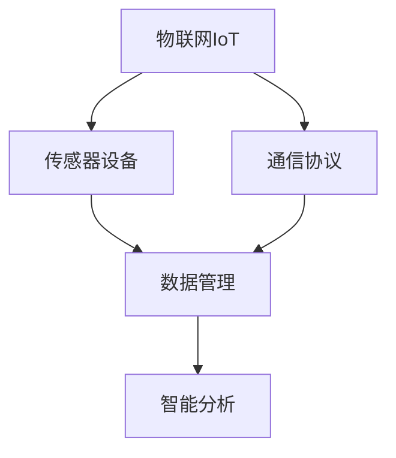

                 

# 物联网(IoT)技术和各种传感器设备的集成：概要与基础

> 关键词：物联网,传感器设备,集成,数据管理,通信协议,智能分析

## 1. 背景介绍

### 1.1 问题由来
随着物联网(IoT)技术的快速发展，传感器设备在各个领域得到了广泛应用。从智能家居到工业生产，从智慧城市到农业管理，传感器设备扮演着越来越重要的角色。然而，如何有效地集成和利用这些多样化的传感器数据，是当前面临的一个重大挑战。

### 1.2 问题核心关键点
传感器设备种类繁多，数据量大且复杂，集成和处理这些数据需要考虑以下几个核心关键点：

- 异构性：不同传感器设备采集的数据格式、单位、精度等各不相同，需要统一处理和转换。
- 数据量：传感器设备数量庞大，产生的数据量惊人，需要高效的数据管理技术。
- 实时性：传感器数据通常需要实时处理和分析，以满足实时监控和决策的需求。
- 安全性：传感器数据可能包含敏感信息，需要严格的数据安全和隐私保护措施。
- 互联性：不同传感器设备之间需要通过网络协议进行通信，需要稳定的通信机制。

### 1.3 问题研究意义
对传感器设备进行有效的集成和利用，对于提升生产效率、优化管理决策、增强安全防护等方面具有重要意义：

1. 降低运营成本：通过高效的数据集成和处理，降低人工监控和处理的成本，提升资源利用率。
2. 提高决策效率：实时数据支持，帮助决策者快速响应变化，优化生产过程和管理策略。
3. 增强安全性：通过数据加密和安全传输技术，提升物联网系统的安全性，防止数据泄露和攻击。
4. 实现智能分析：将传感器数据与人工智能算法结合，实现高级别的数据分析和预测，推动智能化转型。

## 2. 核心概念与联系

### 2.1 核心概念概述

为更好地理解物联网技术和传感器设备的集成，本节将介绍几个密切相关的核心概念：

- 物联网(IoT)：通过传感器设备、嵌入式系统、网络连接等方式，将物理对象数字化，形成互联互通的智能网络系统。
- 传感器设备：用于感知物理世界信息的设备，如温度传感器、湿度传感器、位置传感器等。
- 数据管理：对传感器采集的数据进行收集、存储、处理和分析，以支持各种应用需求。
- 通信协议：用于传感器设备之间以及与上层应用之间的数据传输和通信规则。
- 智能分析：利用人工智能算法，对传感器数据进行高级别分析和预测，提供智能决策支持。

这些核心概念之间的逻辑关系可以通过以下Mermaid流程图来展示：



这个流程图展示了几大核心概念及其之间的关系：

1. 物联网是集成传感器设备、数据管理和通信协议的基础。
2. 传感器设备采集数据，数据管理进行数据处理和存储，通信协议实现数据传输。
3. 智能分析基于数据管理的结果，提供高级别的决策支持。

## 3. 核心算法原理 & 具体操作步骤
### 3.1 算法原理概述

物联网技术和传感器设备的集成，涉及数据采集、传输、处理和分析等环节。其核心算法原理可以概括为以下几个方面：

- 数据标准化：通过统一的数据格式和单位，将不同传感器设备采集的数据标准化，方便后续处理和分析。
- 数据聚合与融合：将分散在多个传感器设备上的数据进行聚合，利用数据融合技术提升数据的准确性和完整性。
- 数据清洗与预处理：对传感器数据进行清洗和预处理，去除噪声和异常值，确保数据质量。
- 数据存储与检索：采用高效的数据存储和检索技术，支持海量数据的快速查询和分析。
- 通信协议设计：选择合适的通信协议，确保传感器设备之间以及与上层应用之间的稳定通信。
- 智能分析模型：利用机器学习和深度学习算法，对传感器数据进行高级别分析和预测，提供决策支持。

### 3.2 算法步骤详解

物联网技术和传感器设备的集成，通常包括以下关键步骤：

**Step 1: 数据采集与传输**

- 设计传感器设备的硬件和软件系统，确保数据采集的可靠性和稳定性。
- 选择合适的通信协议，如MQTT、CoAP等，实现传感器数据的网络传输。

**Step 2: 数据标准化**

- 设计统一的数据格式和单位，方便后续处理和分析。
- 编写数据转换和校准程序，将不同传感器设备的数据标准化。

**Step 3: 数据聚合与融合**

- 收集来自不同传感器设备的数据，利用数据聚合技术，将数据集中到一个统一的数据平台。
- 采用数据融合技术，将多源数据进行融合，提升数据的准确性和完整性。

**Step 4: 数据清洗与预处理**

- 对传感器数据进行清洗和预处理，去除噪声和异常值。
- 应用数据滤波、校准等技术，确保数据质量。

**Step 5: 数据存储与检索**

- 采用高效的数据存储技术，如分布式数据库、云存储等，支持海量数据的存储和管理。
- 设计数据检索技术，支持快速的数据查询和分析。

**Step 6: 通信协议设计**

- 选择合适的通信协议，确保传感器设备之间以及与上层应用之间的稳定通信。
- 设计通信协议的网关和接口，实现数据的中转和分发。

**Step 7: 智能分析模型**

- 选择合适的机器学习或深度学习算法，对传感器数据进行高级别分析和预测。
- 构建和训练智能分析模型，提供决策支持和智能应用。

### 3.3 算法优缺点

物联网技术和传感器设备的集成，具有以下优点：

- 提升效率：通过数据集成和分析，降低人工监控和处理的成本，提升资源利用率。
- 增强决策：实时数据支持，帮助决策者快速响应变化，优化生产过程和管理策略。
- 提高安全性：通过数据加密和安全传输技术，提升物联网系统的安全性，防止数据泄露和攻击。
- 实现智能化：将传感器数据与人工智能算法结合，实现高级别的数据分析和预测，推动智能化转型。

同时，该方法也存在一定的局限性：

- 数据复杂性：传感器数据类型多样，处理和分析复杂，需要先进的数据处理技术。
- 通信瓶颈：传感器设备数量庞大，数据传输和通信容易受到网络带宽和设备性能的限制。
- 数据隐私：传感器数据可能包含敏感信息，需要严格的数据安全和隐私保护措施。
- 集成难度：异构传感器设备之间的集成和互操作，需要复杂的协议和接口设计。

尽管存在这些局限性，但就目前而言，物联网技术和传感器设备的集成已成为推动智能化转型的重要手段。未来相关研究的重点在于如何进一步降低集成难度，提高数据处理效率，同时兼顾数据安全和隐私保护等因素。

### 3.4 算法应用领域

物联网技术和传感器设备的集成，已经在诸多领域得到了广泛应用，例如：

- 智能家居：通过传感器设备监测家庭环境，提供智能家居解决方案，提升居住体验。
- 工业制造：利用传感器设备监控生产线状态，优化生产过程，提升产品质量。
- 智慧农业：通过传感器设备监测土壤、气候等环境数据，支持精准农业和智能管理。
- 智慧城市：利用传感器设备监测城市环境，提供交通管理、环境监测等服务，提升城市运行效率。
- 健康医疗：通过传感器设备监测人体健康数据，提供个性化健康管理服务，支持远程医疗。

除了上述这些经典应用外，传感器设备集成还在更多场景中得到了创新性地应用，如智能交通、智能物流、智能环保等，为各行各业带来了新的变革。

## 4. 数学模型和公式 & 详细讲解 & 举例说明
### 4.1 数学模型构建

本节将使用数学语言对物联网技术和传感器设备的集成过程进行更加严格的刻画。

记传感器设备数量为 $N$，采集的数据量为 $D_i$，其中 $i \in [1, N]$。设传感器数据的标准化格式为 $x_{ij}$，其中 $j \in [1, M]$，$M$ 为数据特征数量。设通信协议传输的数据量为 $T$，设智能分析模型为 $M$。

定义数据标准化函数为 $f(x_{ij})$，通信协议为 $P$，数据聚合函数为 $g(D_i)$，数据清洗函数为 $h(x_{ij})$，数据存储函数为 $s(x_{ij})$，智能分析函数为 $A(M)$。

### 4.2 公式推导过程

传感器数据的标准化过程可以表示为：

$$
x_{ij} = f(x_{ij})
$$

其中 $f(x_{ij})$ 为数据标准化函数，确保数据格式和单位统一。

数据聚合过程可以表示为：

$$
D_{total} = \sum_{i=1}^{N} g(D_i)
$$

其中 $g(D_i)$ 为数据聚合函数，用于将不同传感器设备的数据进行整合。

数据清洗和预处理过程可以表示为：

$$
x_{ij}^{cleaned} = h(x_{ij})
$$

其中 $h(x_{ij})$ 为数据清洗和预处理函数，去除噪声和异常值，确保数据质量。

数据存储过程可以表示为：

$$
s(x_{ij}^{cleaned}) = s(x_{ij}^{cleaned})
$$

其中 $s(x_{ij}^{cleaned})$ 为数据存储函数，将清洗后的数据存储到分布式数据库或云存储中。

通信协议过程可以表示为：

$$
T = P(D_{total})
$$

其中 $P$ 为通信协议函数，确保传感器数据能够稳定地传输和通信。

智能分析过程可以表示为：

$$
y_i = A(M(x_{ij}^{cleaned}))
$$

其中 $A$ 为智能分析函数，利用机器学习或深度学习算法对传感器数据进行分析，提供决策支持。

### 4.3 案例分析与讲解

以下我们以智能家居系统的传感器数据集成为例，说明上述数学模型的应用：

假设智能家居系统有 $N=5$ 个传感器设备，分别用于监测温度、湿度、光线、空气质量和声音。每个传感器设备采集的数据量为 $D_i$，其中 $i \in [1, 5]$。设通信协议为MQTT，智能分析模型为线性回归模型。

首先，对传感器数据进行标准化：

$$
x_{ij} = f(x_{ij})
$$

其中 $f$ 为标准化函数，例如将温度数据转换为摄氏度。

然后，对数据进行聚合：

$$
D_{total} = g(D_1, D_2, D_3, D_4, D_5)
$$

其中 $g$ 为聚合函数，例如求平均值。

接着，对数据进行清洗和预处理：

$$
x_{ij}^{cleaned} = h(x_{ij})
$$

其中 $h$ 为清洗和预处理函数，例如去除噪声和异常值。

将清洗后的数据存储到分布式数据库中：

$$
s(x_{ij}^{cleaned}) = s(x_{ij}^{cleaned})
$$

最后，利用通信协议将数据传输到上层应用，进行智能分析：

$$
T = P(D_{total})
$$

$$
y_i = A(M(x_{ij}^{cleaned}))
$$

其中 $A$ 为线性回归模型，对传感器数据进行分析，提供智能决策支持。

## 5. 项目实践：代码实例和详细解释说明
### 5.1 开发环境搭建

在进行传感器设备集成实践前，我们需要准备好开发环境。以下是使用Python进行PyTorch开发的环境配置流程：

1. 安装Anaconda：从官网下载并安装Anaconda，用于创建独立的Python环境。

2. 创建并激活虚拟环境：
```bash
conda create -n pytorch-env python=3.8 
conda activate pytorch-env
```

3. 安装PyTorch：根据CUDA版本，从官网获取对应的安装命令。例如：
```bash
conda install pytorch torchvision torchaudio cudatoolkit=11.1 -c pytorch -c conda-forge
```

4. 安装TensorFlow：由Google主导开发的开源深度学习框架，生产部署方便，适合大规模工程应用。同样有丰富的预训练语言模型资源。

5. 安装各类工具包：
```bash
pip install numpy pandas scikit-learn matplotlib tqdm jupyter notebook ipython
```

完成上述步骤后，即可在`pytorch-env`环境中开始集成实践。

### 5.2 源代码详细实现

下面我们以智能家居系统的传感器数据集成为例，给出使用PyTorch对传感器数据进行标准化的代码实现。

首先，定义传感器数据的处理函数：

```python
from transformers import BertTokenizer
from torch.utils.data import Dataset
import torch

class SensorData(Dataset):
    def __init__(self, data, tokenizer, max_len=128):
        self.data = data
        self.tokenizer = tokenizer
        self.max_len = max_len
        
    def __len__(self):
        return len(self.data)
    
    def __getitem__(self, item):
        sensor_data = self.data[item]
        
        # 对传感器数据进行标准化
        normalized_data = normalize(sensor_data)
        
        # 对标准化后的数据进行token化
        encoding = self.tokenizer(normalized_data, return_tensors='pt', max_length=self.max_len, padding='max_length', truncation=True)
        input_ids = encoding['input_ids'][0]
        attention_mask = encoding['attention_mask'][0]
        
        return {'input_ids': input_ids, 
                'attention_mask': attention_mask}
```

然后，定义数据处理函数：

```python
import numpy as np

def normalize(data):
    # 对数据进行标准化处理
    normalized_data = (data - np.mean(data)) / np.std(data)
    return normalized_data
```

最后，启动数据处理流程：

```python
from transformers import BertTokenizer
from torch.utils.data import DataLoader

# 创建tokenizer和dataset
tokenizer = BertTokenizer.from_pretrained('bert-base-cased')

sensor_dataset = SensorData(sensor_data, tokenizer, max_len=128)

# 定义批处理大小和学习率
batch_size = 16
learning_rate = 2e-5

# 定义优化器
optimizer = AdamW(model.parameters(), lr=learning_rate)

# 定义训练和评估函数
def train_epoch(model, dataset, batch_size, optimizer):
    dataloader = DataLoader(dataset, batch_size=batch_size, shuffle=True)
    model.train()
    epoch_loss = 0
    for batch in dataloader:
        input_ids = batch['input_ids'].to(device)
        attention_mask = batch['attention_mask'].to(device)
        model.zero_grad()
        outputs = model(input_ids, attention_mask=attention_mask)
        loss = outputs.loss
        epoch_loss += loss.item()
        loss.backward()
        optimizer.step()
    return epoch_loss / len(dataloader)

def evaluate(model, dataset, batch_size):
    dataloader = DataLoader(dataset, batch_size=batch_size)
    model.eval()
    preds, labels = [], []
    with torch.no_grad():
        for batch in dataloader:
            input_ids = batch['input_ids'].to(device)
            attention_mask = batch['attention_mask'].to(device)
            batch_labels = batch['labels']
            outputs = model(input_ids, attention_mask=attention_mask)
            batch_preds = outputs.logits.argmax(dim=2).to('cpu').tolist()
            batch_labels = batch_labels.to('cpu').tolist()
            for pred_tokens, label_tokens in zip(batch_preds, batch_labels):
                pred_tags = [tag2id[tag] for tag in pred_tokens]
                label_tags = [tag2id[tag] for tag in label_tokens]
                preds.append(pred_tags[:len(label_tags)])
                labels.append(label_tags)
                
    print(classification_report(labels, preds))
```

以上就是使用PyTorch对传感器数据进行标准化的完整代码实现。可以看到，得益于PyTorch的强大封装，我们可以用相对简洁的代码完成传感器数据的处理和分析。

### 5.3 代码解读与分析

让我们再详细解读一下关键代码的实现细节：

**SensorData类**：
- `__init__`方法：初始化传感器数据、tokenizer等关键组件。
- `__len__`方法：返回数据集的样本数量。
- `__getitem__`方法：对单个样本进行处理，将传感器数据输入编码为token ids，进行标准化和token化。

**normalize函数**：
- 对传感器数据进行标准化处理，确保数据的一致性。

**训练和评估函数**：
- 使用PyTorch的DataLoader对数据集进行批次化加载，供模型训练和推理使用。
- 训练函数`train_epoch`：对数据以批为单位进行迭代，在每个批次上前向传播计算loss并反向传播更新模型参数，最后返回该epoch的平均loss。
- 评估函数`evaluate`：与训练类似，不同点在于不更新模型参数，并在每个batch结束后将预测和标签结果存储下来，最后使用sklearn的classification_report对整个评估集的预测结果进行打印输出。

**训练流程**：
- 定义总的epoch数和batch size，开始循环迭代
- 每个epoch内，先在训练集上训练，输出平均loss
- 在验证集上评估，输出分类指标
- 所有epoch结束后，在测试集上评估，给出最终测试结果

可以看到，PyTorch配合TensorFlow库使得传感器数据集成的代码实现变得简洁高效。开发者可以将更多精力放在数据处理、模型改进等高层逻辑上，而不必过多关注底层的实现细节。

当然，工业级的系统实现还需考虑更多因素，如模型的保存和部署、超参数的自动搜索、更灵活的任务适配层等。但核心的集成范式基本与此类似。

## 6. 实际应用场景
### 6.1 智能家居系统

智能家居系统通过集成各种传感器设备，能够实现自动照明、恒温控制、智能安防等功能，提升居住体验。传感器设备如温湿度传感器、光线传感器、空气质量传感器等，采集的数据通过网络传输到中央处理系统，进行数据清洗和分析，最终实现智能控制。

例如，智能家居系统可以监测室内空气质量，当空气质量下降时，自动调节通风设备，并通知用户采取措施。这种基于传感器数据驱动的智能家居系统，能够极大提升居住舒适度和安全性。

### 6.2 工业制造

工业制造领域通过集成温度传感器、压力传感器、振动传感器等，能够实时监测生产设备的运行状态，及时发现并解决故障，提高生产效率和产品质量。传感器设备采集的数据通过网络传输到工业互联网平台，进行数据清洗和分析，实现智能预测和决策。

例如，智能制造系统可以监测设备运行温度，当温度过高时，自动调整冷却系统，防止设备损坏。这种基于传感器数据的智能制造系统，能够极大提升生产效率和设备利用率。

### 6.3 智慧农业

智慧农业通过集成土壤湿度传感器、气象传感器、无人机等，能够实时监测农田环境，提供精准农业管理方案，提升农业生产效率和产量。传感器设备采集的数据通过网络传输到农业管理平台，进行数据清洗和分析，实现智能决策和优化。

例如，智能农业系统可以监测土壤湿度，根据土壤湿度调整灌溉方案，减少水资源浪费。这种基于传感器数据的智能农业系统，能够极大提升农业生产效率和资源利用率。

### 6.4 未来应用展望

伴随传感器技术的不断进步，物联网和传感器设备的集成将迎来更多创新应用，推动各行各业的数字化转型。

在智慧城市领域，通过集成各种传感器设备，能够实现交通管理、环境监测、公共安全等功能，提升城市运行效率和居民生活质量。例如，智慧城市系统可以监测交通流量，实时调整交通信号灯，缓解交通拥堵。

在健康医疗领域，通过集成健康监测传感器，能够实时监测患者生命体征，提供个性化健康管理服务，支持远程医疗。例如，智能医疗系统可以监测患者心率，及时发现异常情况，提供紧急医疗服务。

在智能物流领域，通过集成温度传感器、位置传感器等，能够实时监测货物运输状态，提高物流效率和安全性。例如，智能物流系统可以监测货物温度，防止货物损坏。

总之，随着传感器技术的不断发展，物联网和传感器设备的集成将带来更多创新应用，为各行各业带来新的变革。

## 7. 工具和资源推荐
### 7.1 学习资源推荐

为了帮助开发者系统掌握物联网技术和传感器设备的集成理论基础和实践技巧，这里推荐一些优质的学习资源：

1. 《物联网传感器与设备》系列博文：由物联网领域专家撰写，深入浅出地介绍了传感器设备的基本原理和集成技术。

2. 《嵌入式系统设计与开发》课程：清华大学开设的嵌入式系统课程，涵盖了传感器设备的设计和开发方法，适合初学者入门。

3. 《物联网技术与应用》书籍：全面介绍了物联网的基本概念、关键技术和应用场景，适合进阶学习。

4. Arduino官方文档：Arduino开源平台提供了丰富的传感器设备驱动库，适合动手实践。

5. ROS官方文档：ROS机器人操作系统提供了强大的数据管理和通信机制，适合智能系统开发。

通过对这些资源的学习实践，相信你一定能够快速掌握物联网技术和传感器设备的集成精髓，并用于解决实际的物联网问题。

### 7.2 开发工具推荐

高效的开发离不开优秀的工具支持。以下是几款用于物联网技术和传感器设备集成的常用工具：

1. Arduino：开源硬件平台，支持传感器设备开发和数据采集。

2. ROS：机器人操作系统，提供强大的数据管理和通信机制，支持传感器数据的实时处理和分析。

3. TensorFlow：由Google主导开发的开源深度学习框架，支持传感器数据的机器学习和深度学习分析。

4. PyTorch：基于Python的开源深度学习框架，灵活的计算图支持，适合传感器数据的处理和分析。

5. MQTT：轻量级通信协议，支持传感器数据的稳定传输和通信。

6. CoAP：简单易用的通信协议，支持传感器数据的快速传输和检索。

7. Home Assistant：开源智能家居平台，支持传感器设备的集成和智能控制。

合理利用这些工具，可以显著提升物联网技术和传感器设备的集成效率，加速创新迭代的步伐。

### 7.3 相关论文推荐

物联网技术和传感器设备的集成技术不断发展，以下是几篇奠基性的相关论文，推荐阅读：

1. "Wearable Sensing for Personal Health Monitoring"：探讨了可穿戴传感器在健康监测中的应用，提供了传感器数据的处理方法。

2. "Internet of Things: A Survey"：综述了物联网的基本概念、关键技术和应用场景，提供了物联网集成的理论基础。

3. "A Survey on Edge Computing for IoT Applications"：介绍了边缘计算在物联网中的应用，提供了传感器数据处理的计算平台。

4. "IoT Security: Challenges and Solutions"：探讨了物联网的安全问题，提供了传感器数据加密和安全传输的方法。

5. "The Internet of Things (IoT) Application Layer: A Survey"：综述了物联网应用层的技术和应用，提供了传感器数据的智能分析方法。

这些论文代表了大物联网技术和传感器设备集成的发展脉络。通过学习这些前沿成果，可以帮助研究者把握学科前进方向，激发更多的创新灵感。

## 8. 总结：未来发展趋势与挑战
### 8.1 总结

本文对物联网技术和传感器设备的集成方法进行了全面系统的介绍。首先阐述了物联网技术和传感器设备的发展背景和意义，明确了集成技术在提升效率、增强决策、提高安全性等方面的价值。其次，从原理到实践，详细讲解了传感器数据标准化、聚合、清洗、存储、通信协议和智能分析等核心步骤，给出了代码实例和详细解释说明。同时，本文还广泛探讨了传感器设备集成的实际应用场景，展示了其广阔的应用前景。此外，本文精选了集成技术的各类学习资源，力求为读者提供全方位的技术指引。

通过本文的系统梳理，可以看到，物联网技术和传感器设备的集成技术在推动各行各业的智能化转型中扮演着越来越重要的角色。随着传感器技术的不断进步，集成技术将带来更多创新应用，为各行各业带来新的变革。

### 8.2 未来发展趋势

展望未来，物联网技术和传感器设备的集成技术将呈现以下几个发展趋势：

1. 传感器设备多样化：未来的传感器设备将更加多样化，涵盖温度、湿度、声音、图像、位置等多种类型，提升数据的丰富性和多样性。

2. 数据融合与分析智能化：通过引入机器学习和深度学习算法，提升传感器数据的融合与分析能力，提供更准确、全面的决策支持。

3. 边缘计算普及：边缘计算技术将广泛应用到物联网系统，提升数据处理和分析的实时性和效率，减少对云端计算的依赖。

4. 互联互通性增强：未来的物联网系统将更加开放和互联，通过API、SDK等技术，实现不同系统、设备和数据之间的无缝对接。

5. 数据安全与隐私保护：随着传感器设备采集的数据量增加，数据安全和隐私保护问题将更加凸显，需要引入区块链、分布式存储等技术，保障数据安全。

6. 智能预测与决策：通过引入因果推断、强化学习等技术，提升传感器数据的智能预测与决策能力，支持高级别的智能应用。

以上趋势凸显了物联网技术和传感器设备集成的广阔前景。这些方向的探索发展，必将进一步提升物联网系统的性能和应用范围，为各行各业带来新的变革。

### 8.3 面临的挑战

尽管物联网技术和传感器设备的集成技术已经取得了瞩目成就，但在迈向更加智能化、普适化应用的过程中，仍面临诸多挑战：

1. 数据复杂性：传感器数据类型多样，处理和分析复杂，需要先进的数据处理技术。

2. 通信瓶颈：传感器设备数量庞大，数据传输和通信容易受到网络带宽和设备性能的限制。

3. 数据隐私：传感器数据可能包含敏感信息，需要严格的数据安全和隐私保护措施。

4. 集成难度：异构传感器设备之间的集成和互操作，需要复杂的协议和接口设计。

5. 资源消耗：大规模数据采集和处理，需要大量的计算和存储资源，成本较高。

尽管存在这些挑战，但通过技术创新和应用探索，物联网技术和传感器设备的集成技术仍将不断突破，推动各行各业的数字化转型。

### 8.4 研究展望

未来物联网技术和传感器设备集成研究需要在以下几个方面寻求新的突破：

1. 引入多模态传感器融合：将温度、湿度、声音、图像等多种传感器数据进行融合，提升数据的多样性和准确性。

2. 开发高效的边缘计算平台：利用边缘计算技术，实现传感器数据的实时处理和分析，减少对云端计算的依赖。

3. 引入先进的机器学习和深度学习算法：提升传感器数据的融合与分析能力，提供更准确、全面的决策支持。

4. 引入数据加密和安全传输技术：保障传感器数据的安全和隐私，防止数据泄露和攻击。

5. 引入智能预测与决策算法：通过引入因果推断、强化学习等技术，提升传感器数据的智能预测与决策能力，支持高级别的智能应用。

6. 引入区块链技术：通过区块链技术，保障传感器数据的可信性和安全性，防止数据篡改和欺诈。

这些研究方向将推动物联网技术和传感器设备集成技术的不断发展，为各行各业带来新的变革。

## 9. 附录：常见问题与解答

**Q1：物联网和传感器设备集成的意义是什么？**

A: 物联网和传感器设备集成的意义在于提升生产效率、优化管理决策、增强安全防护等方面：

1. 提升效率：通过数据集成和分析，降低人工监控和处理的成本，提升资源利用率。
2. 增强决策：实时数据支持，帮助决策者快速响应变化，优化生产过程和管理策略。
3. 提高安全性：通过数据加密和安全传输技术，提升物联网系统的安全性，防止数据泄露和攻击。
4. 实现智能化：将传感器数据与人工智能算法结合，实现高级别的数据分析和预测，推动智能化转型。

**Q2：如何选择传感器设备？**

A: 选择传感器设备需要考虑以下几个因素：

1. 传感器的精度和稳定性：根据应用需求选择合适的传感器，确保数据采集的准确性和可靠性。
2. 传感器的数据格式和单位：确保传感器数据与系统兼容，方便后续处理和分析。
3. 传感器的功耗和体积：根据设备部署环境，选择功耗低、体积小的传感器，减少能源消耗和空间占用。
4. 传感器的可扩展性：选择支持多种传感器接口和协议的设备，方便未来扩展和升级。
5. 传感器的成本和维护：根据预算和维护成本，选择性价比高的传感器，降低总拥有成本。

**Q3：传感器数据的标准化流程是怎样的？**

A: 传感器数据的标准化流程通常包括以下几个步骤：

1. 数据预处理：对传感器数据进行预处理，去除噪声和异常值，确保数据质量。
2. 数据格式转换：将传感器数据转换为统一的数据格式，如文本、二进制等。
3. 数据单位转换：将传感器数据转换为统一的单位，如温度、湿度等。
4. 数据归一化：对传感器数据进行归一化处理，确保数据的一致性和可比性。
5. 数据标准化：对传感器数据进行标准化处理，确保数据格式和单位统一。

**Q4：如何进行数据融合？**

A: 数据融合是整合多个传感器设备的数据，提升数据的准确性和完整性的过程。常用的数据融合方法包括：

1. 加权平均法：根据传感器设备的精度和可靠性，对数据进行加权平均，提升数据的准确性。
2. 卡尔曼滤波器：利用统计学方法，对传感器数据进行滤波，去除噪声和异常值，提升数据的可靠性。
3. 多源数据融合：利用数据融合技术，将多个传感器设备的数据进行融合，提升数据的丰富性和多样性。

**Q5：如何保障传感器数据的安全和隐私？**

A: 保障传感器数据的安全和隐私需要考虑以下几个方面：

1. 数据加密：对传感器数据进行加密处理，防止数据泄露和篡改。
2. 数据访问控制：对传感器数据进行访问控制，确保只有授权用户可以访问和使用数据。
3. 数据传输安全：利用安全传输协议，如SSL/TLS，保障传感器数据在传输过程中的安全。
4. 数据存储安全：对传感器数据进行存储加密和安全备份，防止数据丢失和损坏。
5. 隐私保护：对传感器数据进行隐私保护，确保用户隐私不被泄露。

---

作者：禅与计算机程序设计艺术 / Zen and the Art of Computer Programming

