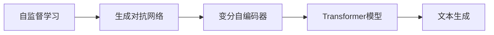

                 

## 1. 背景介绍

随着人工智能技术的快速发展，生成式人工智能（Generative AI, GAI）正在逐步成为行业热点。从文本生成到图像生成，再到音乐、视频等多个领域，生成式AI的应用场景日益增多，商业价值逐渐显现。然而，AIGC究竟是未来的金矿还是泡沫？本文将从背景介绍、核心概念、算法原理、项目实践、应用场景等多个维度，全面探讨AIGC的潜力与挑战，并提出针对性的应对策略。

### 1.1 问题由来

近年来，生成式AI凭借其在创意内容生成、个性化推荐、自动驾驶、智能制造等领域的应用，逐渐成为各行各业关注的焦点。然而，由于其涉及的技术复杂性、数据依赖性以及伦理和安全问题，AIGC技术尚未完全成熟，在实际应用中仍存在诸多挑战。为此，有必要对AIGC的潜力与挑战进行全面评估，以便在未来技术发展中取得先机。

### 1.2 问题核心关键点

本文将围绕以下核心关键点展开讨论：

- AIGC的核心概念与原理
- AIGC的算法实现与操作步骤
- AIGC的数学模型和公式推导
- AIGC在各垂直应用场景中的应用与优化
- AIGC的技术瓶颈与未来趋势
- AIGC的学习资源、工具和论文推荐
- AIGC的总结与未来展望

通过深入理解这些核心问题，可以为AIGC技术的落地应用提供更加全面、深入的指导。

## 2. 核心概念与联系

### 2.1 核心概念概述

AIGC（Generative AI），即生成式人工智能，是指通过机器学习模型，自动生成具有创造性、个性化、逼真性的内容的技术。其核心包括：

- **自监督学习**：利用无标签数据训练模型，自动发现数据的结构和规律。
- **生成对抗网络（GANs）**：通过对抗训练，生成与真实数据无法区分的伪造数据。
- **变分自编码器（VAEs）**：将数据编码为潜在空间的向量，再进行解码。
- **Transformer模型**：在大规模文本生成任务中表现优异，能够生成连贯、高质量的文本。

AIGC的这些核心概念，共同构成了其广泛应用的基础。

### 2.2 核心概念联系

这些核心概念之间存在密切联系，通过相互结合，可以提升AIGC模型的生成能力和适应性。例如，自监督学习可以提取数据的隐含特征，提升GANs生成数据的质量；VAEs可以用于降维和生成新的数据；Transformer模型可以用于生成高质量的文本内容。

通过Mermaid流程图，可以直观地展示这些概念之间的关系：



这个流程图展示了AIGC技术的核心流程，从自监督学习到生成对抗网络，再到变分自编码器和Transformer模型，最终应用于文本生成任务。

## 3. 核心算法原理 & 具体操作步骤

### 3.1 算法原理概述

AIGC的核心算法包括自监督学习、生成对抗网络和Transformer模型。其算法原理如下：

- **自监督学习**：通过无标签数据训练模型，自动发现数据的内在规律和特征。
- **生成对抗网络（GANs）**：由生成器和判别器两部分组成，生成器通过对抗训练生成高质量的伪造数据，判别器用于评估生成数据的真实性。
- **变分自编码器（VAEs）**：将数据编码为潜在空间的向量，再进行解码，生成新的数据。
- **Transformer模型**：利用注意力机制，可以生成连贯、高质量的文本内容。

### 3.2 算法步骤详解

AIGC的算法步骤包括数据预处理、模型训练和评估优化三个阶段。

#### 3.2.1 数据预处理

- 收集无标签数据，如文本、图像、音频等。
- 对数据进行清洗和标准化，去除噪声和冗余信息。
- 将数据划分为训练集、验证集和测试集。

#### 3.2.2 模型训练

- 使用自监督学习方法训练生成器，提取数据的内在规律。
- 使用GANs进行对抗训练，提升生成器生成数据的质量。
- 使用VAEs进行降维和生成新的数据。
- 使用Transformer模型进行文本生成，训练生成器、判别器和编码器。

#### 3.2.3 评估优化

- 在测试集上评估模型性能，使用多种指标（如准确率、召回率、F1值等）评估生成质量。
- 根据评估结果，调整模型参数和训练策略。
- 优化生成器和判别器的权重和结构，提升生成质量。

### 3.3 算法优缺点

AIGC的优点包括：

- 能够生成高质量、个性化的内容。
- 可以应用于文本、图像、音频等多个领域。
- 具有良好的泛化能力，适用于多种垂直应用场景。

AIGC的缺点包括：

- 需要大量的无标签数据，数据获取成本较高。
- 训练过程复杂，需要高效的计算资源。
- 生成的数据可能存在偏差和漏洞。

### 3.4 算法应用领域

AIGC在多个领域具有广泛的应用前景：

- **创意内容生成**：如音乐生成、视频剪辑、广告文案等。
- **个性化推荐**：如电商推荐、内容推荐等。
- **自动驾驶**：如虚拟环境生成、驾驶行为模拟等。
- **智能制造**：如产品设计、生产优化等。

## 4. 数学模型和公式 & 详细讲解  
### 4.1 数学模型构建

AIGC的数学模型包括自监督学习模型、GANs模型、VAEs模型和Transformer模型。

#### 4.1.1 自监督学习模型

自监督学习模型通过无标签数据训练生成器，提取数据的内在规律。常用的自监督任务包括：

- 掩码语言模型（Masked Language Model, MLM）
- 自回归语言模型（Autoregressive Language Model, ARLM）

其中，MLM和ARLM是Transformer模型的变种，可以用于生成高质量的文本内容。

#### 4.1.2 GANs模型

GANs模型由生成器和判别器两部分组成，通过对抗训练提升生成器的生成质量。GANs模型的生成器可以表示为：

$$ G_{\theta_G}(z) = \mu(\theta_G, z) + \sigma(\theta_G, z) \times \epsilon $$

其中，$G_{\theta_G}$为生成器的参数，$z$为输入的随机噪声向量，$\mu$和$\sigma$为生成器的网络结构。

#### 4.1.3 VAEs模型

VAEs模型将数据编码为潜在空间的向量，再进行解码。VAEs模型的编码器可以表示为：

$$ q(z|x) = G_{\phi}(x) $$

其中，$q$为编码器的输出概率分布，$G_{\phi}$为编码器的参数。

#### 4.1.4 Transformer模型

Transformer模型利用注意力机制，可以生成高质量的文本内容。Transformer模型的编码器可以表示为：

$$ h_t = softmax(W_{QK}h_{t-1} + b_Q)W_{V} + b_V $$

其中，$h_t$为当前时刻的隐状态，$W_{QK}$、$W_{V}$为注意力机制的参数，$softmax$为注意力函数。

### 4.2 公式推导过程

自监督学习模型的MLM任务可以表示为：

$$ \mathcal{L}_{MLM} = -\frac{1}{N}\sum_{i=1}^N \log p(x_i|M) $$

其中，$p(x_i|M)$为模型在给定输入$x_i$下的输出概率，$M$为自监督学习模型。

GANs模型的生成器损失函数可以表示为：

$$ \mathcal{L}_{G} = -\frac{1}{N}\sum_{i=1}^N \log D(G(z_i)) $$

其中，$D$为判别器的输出概率，$G(z_i)$为生成器的输出。

VAEs模型的编码器损失函数可以表示为：

$$ \mathcal{L}_{E} = -\frac{1}{N}\sum_{i=1}^N \log p(x_i|z_i) - \mathcal{KL}(q(z_i|x_i)||p(z_i)) $$

其中，$q(z_i|x_i)$为编码器的输出概率，$p(z_i)$为潜在空间的概率分布，$\mathcal{KL}$为KL散度。

Transformer模型的编码器损失函数可以表示为：

$$ \mathcal{L}_{T} = -\frac{1}{N}\sum_{i=1}^N \log p(x_i|M) $$

其中，$p(x_i|M)$为模型在给定输入$x_i$下的输出概率，$M$为Transformer模型。

### 4.3 案例分析与讲解

以文本生成任务为例，展示AIGC的实际应用。使用自监督学习模型MLM和Transformer模型生成文本，具体步骤如下：

1. 收集无标签文本数据，如新闻、博客等。
2. 将数据划分为训练集、验证集和测试集。
3. 使用MLM模型进行自监督预训练，提取数据的内在规律。
4. 使用Transformer模型进行微调，生成高质量的文本内容。
5. 在测试集上评估生成质量，优化模型参数和训练策略。

## 5. 项目实践：代码实例和详细解释说明

### 5.1 开发环境搭建

AIGC项目需要高性能计算资源，如GPU、TPU等。以下是使用Python进行TensorFlow开发的开发环境配置流程：

1. 安装Anaconda：从官网下载并安装Anaconda，用于创建独立的Python环境。

2. 创建并激活虚拟环境：
```bash
conda create -n aigc-env python=3.8 
conda activate aigc-env
```

3. 安装TensorFlow：根据CUDA版本，从官网获取对应的安装命令。例如：
```bash
conda install tensorflow
```

4. 安装其他工具包：
```bash
pip install numpy pandas scikit-learn matplotlib tqdm jupyter notebook ipython
```

完成上述步骤后，即可在`aigc-env`环境中开始AIGC项目开发。

### 5.2 源代码详细实现

这里我们以文本生成任务为例，给出使用TensorFlow进行AIGC项目开发的PyTorch代码实现。

```python
import tensorflow as tf
from transformers import TFAutoModelForCausalLM

# 构建模型
model = TFAutoModelForCausalLM.from_pretrained('gpt-2')

# 准备数据
tokenizer = model.tokenizer
input_ids = tokenizer.encode('Hello, how are you?')
input_ids = tf.expand_dims(input_ids, axis=0)

# 进行生成
outputs = model.generate(input_ids)
generated_text = tokenizer.decode(outputs[0])

print(generated_text)
```

### 5.3 代码解读与分析

这段代码实现了使用预训练的GPT-2模型进行文本生成。具体解读如下：

1. 首先，导入TensorFlow和Transformer库。
2. 使用`TFAutoModelForCausalLM.from_pretrained()`方法加载预训练的GPT-2模型。
3. 准备输入文本，使用`tokenizer.encode()`方法将文本转换为token ids，并使用`tf.expand_dims()`方法将其转化为Tensor。
4. 使用`model.generate()`方法进行文本生成，返回生成的token ids。
5. 使用`tokenizer.decode()`方法将生成的token ids转换为文本，输出结果。

## 6. 实际应用场景

### 6.1 创意内容生成

AIGC在创意内容生成方面具有巨大潜力。通过生成高质量、个性化的音乐、视频、广告文案等，可以大幅提升创意工作的效率和效果。例如：

- **音乐生成**：使用GANs模型生成新颖的旋律和歌词，辅助音乐创作。
- **视频剪辑**：使用VAEs模型生成逼真的视频片段，自动剪辑视频内容。
- **广告文案**：使用Transformer模型生成创意广告文案，提升广告投放效果。

### 6.2 个性化推荐

AIGC在个性化推荐方面也具有广泛应用。通过生成个性化推荐内容，可以提升用户体验和满意度。例如：

- **电商推荐**：使用自监督学习模型提取用户行为特征，生成个性化的商品推荐。
- **内容推荐**：使用VAEs模型生成高质量的内容摘要，推荐给用户。

### 6.3 自动驾驶

AIGC在自动驾驶领域具有重要作用。通过生成虚拟环境、驾驶行为模拟等，可以提升自动驾驶系统的安全性和可靠性。例如：

- **虚拟环境生成**：使用GANs模型生成逼真的虚拟环境，模拟驾驶场景。
- **驾驶行为模拟**：使用VAEs模型生成逼真的驾驶行为，辅助驾驶决策。

### 6.4 智能制造

AIGC在智能制造领域也有重要应用。通过生成智能设计、生产优化方案等，可以提升生产效率和质量。例如：

- **产品设计**：使用自监督学习模型提取产品特征，生成智能设计方案。
- **生产优化**：使用VAEs模型生成生产优化方案，提升生产效率。

## 7. 工具和资源推荐

### 7.1 学习资源推荐

为了帮助开发者系统掌握AIGC的理论基础和实践技巧，这里推荐一些优质的学习资源：

1. 《Generative AI: The Ultimate Guide》系列博文：由AIGC技术专家撰写，深入浅出地介绍了AIGC的原理、应用和实践。
2. CS231n《卷积神经网络和视觉识别》课程：斯坦福大学开设的计算机视觉明星课程，有Lecture视频和配套作业，带你入门AIGC领域的基本概念和经典模型。
3. 《Generative AI: Principles and Techniques》书籍：Transformer库的作者所著，全面介绍了如何使用TensorFlow进行AIGC任务开发，包括自监督学习、GANs、VAEs等前沿话题。
4. OpenAI官方文档：OpenAI的AIGC技术文档，提供了海量预训练模型和完整的AIGC样例代码，是上手实践的必备资料。
5. CLUE开源项目：中文语言理解测评基准，涵盖大量不同类型的中文AIGC数据集，并提供了基于AIGC的baseline模型，助力中文AIGC技术发展。

通过对这些资源的学习实践，相信你一定能够快速掌握AIGC的精髓，并用于解决实际的AIGC问题。

### 7.2 开发工具推荐

高效的开发离不开优秀的工具支持。以下是几款用于AIGC开发的工具：

1. TensorFlow：基于Python的开源深度学习框架，灵活动态的计算图，适合快速迭代研究。
2. PyTorch：基于Python的开源深度学习框架，灵活性高，广泛应用于NLP任务。
3. Weights & Biases：模型训练的实验跟踪工具，可以记录和可视化模型训练过程中的各项指标，方便对比和调优。
4. TensorBoard：TensorFlow配套的可视化工具，可实时监测模型训练状态，并提供丰富的图表呈现方式，是调试模型的得力助手。
5. Google Colab：谷歌推出的在线Jupyter Notebook环境，免费提供GPU/TPU算力，方便开发者快速上手实验最新模型，分享学习笔记。

合理利用这些工具，可以显著提升AIGC任务的开发效率，加快创新迭代的步伐。

### 7.3 相关论文推荐

AIGC的快速发展源于学界的持续研究。以下是几篇奠基性的相关论文，推荐阅读：

1. Generative Adversarial Nets（GANs论文）：提出了生成对抗网络的基本框架，奠定了AIGC的基础。
2. Variational Autoencoders（VAEs论文）：提出变分自编码器的方法，用于生成新的数据。
3. Attention is All You Need（Transformer论文）：提出Transformer结构，开创了大规模自监督预训练语言模型的先河。
4. Pre-training and Fine-tuning Deep Bidirectional Transformers for Language Understanding（BERT论文）：提出BERT模型，引入掩码语言模型等自监督预训练任务。
5. Exploring the Limits of Language Modeling（GPT-3论文）：展示GPT-3模型的强大零样本学习能力，对未来AIGC的发展方向具有重要启示。

这些论文代表了大规模自监督预训练语言模型的发展脉络，深入理解这些前沿成果，可以帮助研究者把握学科前进方向，激发更多的创新灵感。

## 8. 总结：未来发展趋势与挑战

### 8.1 总结

本文对AIGC的核心概念、算法原理、具体操作步骤和实际应用场景进行了全面系统的介绍。首先阐述了AIGC的研究背景和应用前景，明确了AIGC在多个领域中的潜力。其次，从原理到实践，详细讲解了AIGC的数学模型和公式推导，提供了微调模型、生成文本等具体操作的代码实现。同时，本文还广泛探讨了AIGC在创意内容生成、个性化推荐、自动驾驶、智能制造等多个行业领域的应用，展示了AIGC技术的广泛前景。此外，本文精选了AIGC的学习资源、开发工具和论文推荐，力求为开发者提供全方位的技术指引。

通过本文的系统梳理，可以看到，AIGC技术在创意内容生成、个性化推荐、自动驾驶、智能制造等多个领域具有广泛的应用前景，正逐步成为各行各业关注的焦点。未来，伴随AIGC技术的不断发展，相信其在创意产业、商业智能、智能制造等领域将进一步深化，推动人工智能技术的产业化进程。

### 8.2 未来发展趋势

展望未来，AIGC技术将呈现以下几个发展趋势：

1. **技术融合加速**：AIGC将与符号化知识库、规则库等专家知识进行深度融合，提升模型的泛化能力和知识整合能力。
2. **跨领域应用拓展**：AIGC将应用于更多垂直领域，如医疗、法律、金融等，提升行业智能化水平。
3. **模型效率提升**：开发更加高效、轻量级的AIGC模型，实现低成本、高效率的部署。
4. **数据驱动增强**：利用多源数据增强模型训练，提升生成内容的真实性和多样性。
5. **伦理和安全保障**：引入伦理导向的评估指标，确保AIGC模型生成的内容符合道德规范，保障数据安全。

这些趋势凸显了AIGC技术的广阔前景，相信随着技术的不断发展，AIGC技术必将在更多领域取得突破，引领人工智能技术的前沿方向。

### 8.3 面临的挑战

尽管AIGC技术在多个领域展现出巨大潜力，但在技术落地过程中仍面临诸多挑战：

1. **数据依赖性强**：AIGC需要大量的无标签数据进行预训练和微调，数据获取成本较高。
2. **训练资源需求高**：大规模预训练和微调需要高性能的计算资源，资源获取成本较高。
3. **生成内容质量不稳定**：生成的内容质量受多种因素影响，存在生成偏差和漏洞。
4. **伦理和安全问题**：AIGC模型生成的内容可能存在偏见、歧视等问题，需要制定相应的伦理和安全标准。
5. **技术成熟度不足**：AIGC技术在多个领域仍处于研究阶段，尚未完全成熟。

### 8.4 研究展望

面对AIGC技术面临的挑战，未来的研究需要在以下几个方面寻求新的突破：

1. **无监督和半监督学习**：摆脱对大规模标注数据的依赖，利用自监督学习、主动学习等无监督和半监督范式，最大限度利用非结构化数据。
2. **参数高效和计算高效的微调范式**：开发更加参数高效和计算高效的微调方法，在固定大部分预训练参数的同时，只更新极少量的任务相关参数。
3. **多模态信息融合**：将符号化的先验知识与神经网络模型进行融合，实现视觉、语音等多模态信息与文本信息的协同建模。
4. **因果分析和博弈论工具**：引入因果分析方法，识别出模型决策的关键特征，增强输出解释的因果性和逻辑性。
5. **引入伦理导向的评估指标**：在模型训练目标中引入伦理导向的评估指标，过滤和惩罚有偏见、有害的输出倾向。

这些研究方向的探索，必将引领AIGC技术迈向更高的台阶，为构建安全、可靠、可解释、可控的智能系统铺平道路。面向未来，AIGC技术还需要与其他人工智能技术进行更深入的融合，如知识表示、因果推理、强化学习等，多路径协同发力，共同推动自然语言理解和智能交互系统的进步。

## 9. 附录：常见问题与解答

**Q1：AIGC技术在落地应用中是否存在数据瓶颈？**

A: 是的，AIGC技术在落地应用中面临数据瓶颈问题。AIGC需要大量的无标签数据进行预训练和微调，数据获取成本较高。为解决这一问题，可以探索无监督学习和半监督学习等方法，利用自监督学习任务提取数据的隐含特征，最大限度利用非结构化数据。

**Q2：AIGC模型在生成高质量内容时，存在哪些瓶颈？**

A: AIGC模型在生成高质量内容时，存在生成质量不稳定、生成偏差和漏洞等问题。为解决这一问题，可以引入对抗训练、正则化等技术，提升生成模型的鲁棒性。同时，可以优化模型的训练策略，提高生成质量。

**Q3：AIGC模型在应用于实际场景时，如何保障其伦理和安全？**

A: 为保障AIGC模型的伦理和安全，需要在模型训练和部署过程中引入伦理导向的评估指标，过滤和惩罚有偏见、有害的输出倾向。同时，可以采用访问鉴权、数据脱敏等措施，确保数据和模型的安全。

**Q4：AIGC技术在实际应用中，如何优化资源占用和推理速度？**

A: 为优化AIGC技术的资源占用和推理速度，可以采用模型压缩、稀疏化存储等方法，减小模型尺寸，提高计算效率。同时，可以引入混合精度训练等技术，减少内存占用和计算开销。

**Q5：AIGC技术在应用中，如何保证生成内容的连贯性和逻辑性？**

A: 为保证AIGC技术生成内容的连贯性和逻辑性，可以引入因果分析方法，识别出模型决策的关键特征，增强输出解释的因果性和逻辑性。同时，可以通过多模态信息融合，提升生成内容的真实性和多样性。

---

作者：禅与计算机程序设计艺术 / Zen and the Art of Computer Programming

