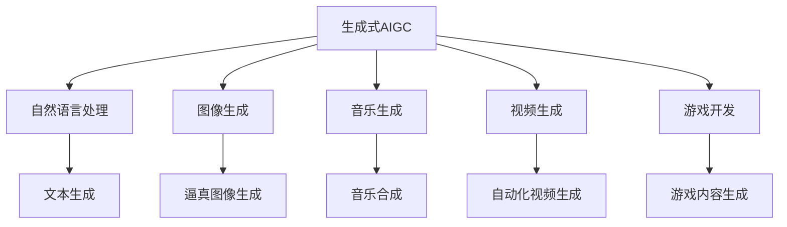

                 

# 生成式AIGC：AI技术的商业应用

> 关键词：生成式AIGC, AI技术, 商业应用, 自然语言处理(NLP), 图像生成, 音乐生成, 视频生成, 游戏开发

## 1. 背景介绍

### 1.1 问题由来

随着人工智能技术的不断进步，生成式AI（AIGC, Artificial Intelligence Generated Content）正在迅速改变各行各业的商业模式。从自然语言处理（NLP）到图像、音乐和视频生成，再到游戏开发等领域，生成式AI正展现其巨大的潜力和广泛的应用前景。然而，尽管生成式AI在技术上取得了显著的进展，其商业应用的普及仍面临着诸多挑战。

### 1.2 问题核心关键点

生成式AIGC技术的商业应用主要集中在以下几个方面：

1. **自然语言处理(NLP)**：通过AI生成高质量的文章、摘要、对话等文本内容，提升内容创作和信息获取效率。
2. **图像生成**：利用生成对抗网络（GANs）等技术，生成逼真图像，用于广告、娱乐、游戏等领域。
3. **音乐生成**：使用神经网络等技术，创作和合成音乐，应用于影视、游戏、广告等场景。
4. **视频生成**：通过视频编辑和生成技术，自动化生成视频内容，包括广告、教育、娱乐等。
5. **游戏开发**：利用AI生成游戏素材和内容，提升游戏开发效率和游戏体验。

这些技术不仅推动了各行业的创新，还为内容创作、娱乐消费、电子商务等领域带来了全新的机遇和挑战。

### 1.3 问题研究意义

生成式AIGC技术的商业应用，不仅有助于降低内容创作成本、提高内容创作效率，还能创造新的商业模式和消费体验。其商业意义体现在以下几个方面：

1. **降低内容创作成本**：通过自动生成高质量内容，大幅减少人工创作的需求，降低内容制作成本。
2. **提高内容创作效率**：生成式AI能够快速生成大量内容，极大地提高内容创作的效率。
3. **提升用户体验**：利用生成式AI技术，提供个性化的内容推荐和服务，提升用户满意度和粘性。
4. **开拓新市场**：生成式AI技术为新兴市场提供了新的内容来源和商业模式，如虚拟现实（VR）、增强现实（AR）、元宇宙等。
5. **推动产业升级**：生成式AI技术促进了各行业的信息化、智能化转型，推动了产业升级和创新。

## 2. 核心概念与联系

### 2.1 核心概念概述

生成式AIGC技术涵盖了多种人工智能生成内容的方法，包括但不限于自然语言处理（NLP）、图像生成、音乐生成、视频生成等。这些技术的核心概念包括：

- **生成对抗网络（GANs）**：一种基于博弈论的生成模型，通过对抗训练生成逼真图像、音频、视频等内容。
- **语言模型**：用于文本生成的概率模型，通过训练预测下一个单词或句子，生成连贯的自然语言内容。
- **变分自编码器（VAE）**：一种生成模型，通过学习数据的潜在表示，生成高质量的样本数据。
- **自回归模型**：如GPT系列模型，通过递归生成文本，具有较高的自然语言生成能力。
- **变分自编码器（VAE）**：通过学习数据的潜在表示，生成高质量的样本数据。

这些概念之间的联系可以通过以下Mermaid流程图来展示：



这个流程图展示了生成式AIGC技术的核心应用领域和其主要技术支持。

## 3. 核心算法原理 & 具体操作步骤

### 3.1 算法原理概述

生成式AIGC技术的核心算法原理主要包括生成对抗网络（GANs）和变分自编码器（VAE）等。这些算法通过无监督学习或半监督学习，生成逼真且高质量的内容。

**生成对抗网络（GANs）**：由生成器（Generator）和判别器（Discriminator）两部分组成。生成器通过学习真实的训练数据分布，生成逼真的假数据；判别器则尝试区分真实数据和假数据。通过对抗训练，生成器和判别器不断迭代，直到生成器生成的假数据可以欺骗判别器，生成逼真的假数据。

**变分自编码器（VAE）**：通过学习数据的潜在表示，生成高质量的样本数据。VAE包括编码器和解码器两部分。编码器将输入数据映射到潜在表示空间；解码器则将潜在表示映射回原始数据空间。

### 3.2 算法步骤详解

以下以GANs和VAE为例，详细介绍这两种算法的具体操作步骤：

**GANs生成逼真图像的具体步骤**：

1. **数据准备**：收集并准备高质量的训练数据集，如照片、艺术作品等。
2. **模型构建**：构建生成器和判别器模型，并设置适当的损失函数。
3. **对抗训练**：通过迭代更新生成器和判别器的参数，使生成器生成的图像可以欺骗判别器，判别器能够区分真实图像和生成图像。
4. **模型评估**：在测试集上评估生成图像的质量，调整生成器和判别器的参数，提高生成图像的逼真度。

**VAE生成高质量样本数据的具体步骤**：

1. **数据准备**：收集并准备高质量的训练数据集，如文本、图像等。
2. **模型构建**：构建编码器和解码器模型，并设置适当的损失函数。
3. **训练过程**：通过迭代更新编码器和解码器的参数，使模型学习到数据的潜在表示。
4. **样本生成**：使用训练好的模型，生成新的高质量数据样本。

### 3.3 算法优缺点

生成式AIGC技术的优点包括：

1. **高效生成内容**：能够快速生成大量高质量内容，提升内容创作效率。
2. **多样性**：生成内容具有多样性，可以满足不同用户的需求。
3. **自动化**：通过算法自动化生成内容，减少人工干预。

缺点包括：

1. **依赖高质量数据**：生成效果依赖于训练数据的质量和数量，数据不足或数据质量差会导致生成效果不佳。
2. **存在假数据风险**：生成的假数据可能会误导用户，存在伦理和法律风险。
3. **计算资源消耗大**：生成式模型通常需要较大的计算资源，训练和推理成本较高。

### 3.4 算法应用领域

生成式AIGC技术在多个领域都有广泛的应用，包括但不限于：

- **自然语言处理（NLP）**：生成文本摘要、对话系统、机器翻译等。
- **图像生成**：自动生成广告图像、艺术作品、虚拟现实场景等。
- **音乐生成**：自动作曲、音乐生成、音乐推荐等。
- **视频生成**：自动生成影视片段、广告、教育视频等。
- **游戏开发**：自动生成游戏素材、虚拟角色、游戏剧情等。

## 4. 数学模型和公式 & 详细讲解 & 举例说明

### 4.1 数学模型构建

生成式AIGC技术主要基于概率模型和生成模型。以下是几种常见的数学模型及其构建方法：

**GANs的生成过程**：
设 $G(z)$ 为生成器，$D(x)$ 为判别器，则GANs的目标函数为：
$$
\min_G \max_D V(D,G) = \min_G \max_D \mathbb{E}_{x \sim p_{data}} [\log D(x)] + \mathbb{E}_{z \sim p(z)} [\log(1-D(G(z)))]
$$

**VAE的生成过程**：
设 $z \sim p(z)$ 为潜在表示，$\mu(z)$ 为编码器的均值，$\sigma(z)$ 为编码器的标准差，则VAE的目标函数为：
$$
\min_{\mu(z),\sigma(z)} \mathbb{E}_{x \sim p_{data}} [\log p_{data}(x)] + \mathbb{E}_{z \sim p(z)} [-\log p_{data}(G(z))] + \int_{z}p(z)[\frac{1}{2}\|z-\mu(z)\|^2_{\sigma(z)}]
$$

### 4.2 公式推导过程

以下以GANs和VAE为例，详细推导其生成过程：

**GANs生成过程**：

1. **生成器（G）**：设生成器为 $G: z \sim p(z) \rightarrow x \sim p_{data}$，其中 $z$ 为潜在表示，$p(z)$ 为潜在表示的先验分布。
2. **判别器（D）**：设判别器为 $D: x \sim p_{data} \rightarrow [0,1]$，输出概率表示输入 $x$ 为真实数据的概率。
3. **目标函数**：最大化判别器的判断能力，即最大化 $\max_D \mathbb{E}_{x \sim p_{data}} [\log D(x)]$，同时最小化生成器生成的假数据欺骗判别器的能力，即最小化 $\min_G \mathbb{E}_{z \sim p(z)} [\log(1-D(G(z)))]$。

**VAE生成过程**：

1. **编码器（E）**：设编码器为 $E: x \sim p_{data} \rightarrow z \sim p(z)$，将输入 $x$ 映射到潜在表示 $z$。
2. **解码器（D）**：设解码器为 $D: z \sim p(z) \rightarrow x \sim p_{data}$，将潜在表示 $z$ 映射回原始数据 $x$。
3. **目标函数**：最大化数据似然 $p_{data}(x)$，即 $\max_D \mathbb{E}_{x \sim p_{data}} [\log p_{data}(x)]$，同时最小化重构误差 $-\mathbb{E}_{z \sim p(z)} [\log p_{data}(G(z))]$ 和潜在表示分布的约束 $-\int_{z}p(z)[\frac{1}{2}\|z-\mu(z)\|^2_{\sigma(z)}]$。

### 4.3 案例分析与讲解

**GANs生成逼真图像案例**：
1. **数据准备**：收集并准备高质量的训练数据集，如照片、艺术作品等。
2. **模型构建**：使用U-Net结构作为生成器，构建GANs模型。
3. **训练过程**：使用对抗训练方法，优化生成器和判别器的参数，直到生成器生成的图像可以欺骗判别器。
4. **结果评估**：在测试集上评估生成图像的质量，使用Inception Score和FID等指标评估生成效果。

**VAE生成高质量文本案例**：
1. **数据准备**：收集并准备高质量的训练数据集，如新闻、文章等。
2. **模型构建**：使用多层感知器（MLP）作为编码器和解码器，构建VAE模型。
3. **训练过程**：使用变分推断方法，优化编码器和解码器的参数，使模型学习到数据的潜在表示。
4. **结果评估**：使用ELBO（Evidence Lower BOund）等指标评估生成文本的质量。

## 5. 项目实践：代码实例和详细解释说明

### 5.1 开发环境搭建

在进行生成式AIGC项目开发前，需要准备好开发环境。以下是使用Python进行PyTorch开发的环境配置流程：

1. 安装Anaconda：从官网下载并安装Anaconda，用于创建独立的Python环境。
2. 创建并激活虚拟环境：
```bash
conda create -n pytorch-env python=3.8 
conda activate pytorch-env
```
3. 安装PyTorch：根据CUDA版本，从官网获取对应的安装命令。例如：
```bash
conda install pytorch torchvision torchaudio cudatoolkit=11.1 -c pytorch -c conda-forge
```
4. 安装各类工具包：
```bash
pip install numpy pandas scikit-learn matplotlib tqdm jupyter notebook ipython
```

完成上述步骤后，即可在`pytorch-env`环境中开始项目实践。

### 5.2 源代码详细实现

下面我们以GANs生成逼真图像为例，给出使用PyTorch实现生成过程的代码实现。

首先，定义GANs模型和优化器：

```python
import torch
from torch import nn
from torch.optim import Adam

class Generator(nn.Module):
    def __init__(self, input_dim, output_dim):
        super(Generator, self).__init__()
        self.input_dim = input_dim
        self.output_dim = output_dim
        self.hidden_dim = 256
        
        self.fc1 = nn.Linear(input_dim, hidden_dim)
        self.fc2 = nn.Linear(hidden_dim, output_dim)
        
    def forward(self, z):
        x = torch.relu(self.fc1(z))
        x = torch.sigmoid(self.fc2(x))
        return x

class Discriminator(nn.Module):
    def __init__(self, input_dim, output_dim):
        super(Discriminator, self).__init__()
        self.input_dim = input_dim
        self.output_dim = output_dim
        self.hidden_dim = 256
        
        self.fc1 = nn.Linear(input_dim, hidden_dim)
        self.fc2 = nn.Linear(hidden_dim, hidden_dim)
        self.fc3 = nn.Linear(hidden_dim, output_dim)
        
    def forward(self, x):
        x = torch.relu(self.fc1(x))
        x = torch.sigmoid(self.fc2(x))
        x = torch.sigmoid(self.fc3(x))
        return x

device = torch.device('cuda' if torch.cuda.is_available() else 'cpu')

generator = Generator(100, 784).to(device)
discriminator = Discriminator(784, 1).to(device)

# 定义优化器
adam_G = Adam(generator.parameters(), lr=0.0002)
adam_D = Adam(discriminator.parameters(), lr=0.0002)
```

接着，定义训练和评估函数：

```python
from torch.utils.data import DataLoader
from tqdm import tqdm
import numpy as np

def train_GANs(generator, discriminator, data_loader, num_epochs=200):
    for epoch in range(num_epochs):
        for i, (images, _) in enumerate(data_loader):
            images = images.to(device)
            
            # 生成假数据
            z = torch.randn(images.size(0), 100, device=device)
            fake_images = generator(z)
            
            # 标签：真实数据为1，假数据为0
            real_labels = torch.ones(images.size(0), device=device)
            fake_labels = torch.zeros(fake_images.size(0), device=device)
            
            # 优化生成器
            adam_G.zero_grad()
            g_loss = discriminator_loss(fake_images, real_labels, discriminator, adam_G)
            
            # 优化判别器
            adam_D.zero_grad()
            d_loss = discriminator_loss(images, real_labels, discriminator, adam_D)
            d_loss = d_loss + discriminator_loss(fake_images, fake_labels, discriminator, adam_D)
            
            # 计算梯度并更新模型参数
            g_loss.backward()
            d_loss.backward()
            adam_G.step()
            adam_D.step()
            
            # 输出训练信息
            if i % 100 == 0:
                print(f'Epoch [{epoch+1}/{num_epochs}], Step [{i+1}/{len(data_loader)}], G_loss: {g_loss.item():.4f}, D_loss: {d_loss.item():.4f}')
                
def discriminator_loss(images, labels, discriminator, optimizer):
    optimizer.zero_grad()
    
    # 计算判别器的损失
    real_outputs = discriminator(images)
    fake_outputs = discriminator(fake_images)
    
    real_loss = criterion(real_outputs, labels)
    fake_loss = criterion(fake_outputs, labels)
    d_loss = real_loss + fake_loss
    
    # 计算梯度并更新判别器参数
    d_loss.backward()
    optimizer.step()
    
    return d_loss
```

最后，启动训练流程并在测试集上评估：

```python
from torchvision.datasets import MNIST
from torchvision.transforms import ToTensor

# 加载MNIST数据集
train_dataset = MNIST(root='./data', train=True, transform=ToTensor(), download=True)
test_dataset = MNIST(root='./data', train=False, transform=ToTensor(), download=True)

train_loader = DataLoader(train_dataset, batch_size=32, shuffle=True)
test_loader = DataLoader(test_dataset, batch_size=32, shuffle=False)

# 训练GANs模型
train_GANs(generator, discriminator, train_loader, num_epochs=200)

# 在测试集上评估生成效果
with torch.no_grad():
    _, labels = test_loader.dataset[0]
    test_images = test_loader.dataset[0][0].numpy()
    fake_images = generator(torch.randn(test_images.size(0), 100)).detach().cpu().numpy()
    fig, axs = plt.subplots(1, 4, figsize=(8, 3))
    axs[0].imshow(test_images[0].numpy().reshape(28, 28))
    axs[1].imshow(fake_images[0].numpy().reshape(28, 28))
    axs[2].imshow(test_images[1].numpy().reshape(28, 28))
    axs[3].imshow(fake_images[1].numpy().reshape(28, 28))
    plt.show()
```

以上就是使用PyTorch对GANs生成逼真图像的完整代码实现。可以看到，通过简单几行代码，即可快速搭建并训练GANs模型，生成逼真的手写数字图像。

### 5.3 代码解读与分析

让我们再详细解读一下关键代码的实现细节：

**GANs模型定义**：
- `Generator`类定义了生成器模型，接受输入维度和输出维度作为参数，通过全连接层生成图像。
- `Discriminator`类定义了判别器模型，接受输入维度和输出维度作为参数，通过全连接层判断输入图像是否为真实图像。

**训练函数实现**：
- `train_GANs`函数定义了GANs模型的训练过程，包括生成器训练和判别器训练。
- 在每个epoch中，对每个批次的数据进行前向传播，计算损失，反向传播并更新模型参数。
- 使用`discriminator_loss`函数计算判别器损失，包括真实图像损失和假图像损失，并返回总损失。
- 输出每个epoch的训练进度和损失值。

**测试集评估**：
- 在测试集上生成几幅图像，并可视化展示生成效果。
- 使用`tqdm`和`plt`库进行进度条和图像展示。

## 6. 实际应用场景

### 6.1 智能广告

生成式AIGC技术在智能广告领域具有广泛的应用前景。通过生成逼真、个性化的广告内容，可以有效提升广告的点击率和转化率。

**具体实现**：
1. **数据准备**：收集用户浏览历史、兴趣标签等数据，构建用户画像。
2. **模型训练**：训练GANs模型生成个性化广告图像，结合NLP模型生成个性化广告文案。
3. **广告投放**：在广告投放平台上自动生成个性化广告内容，推送给用户。

**应用效果**：
- **点击率提升**：生成个性化广告内容，精准匹配用户需求，提升广告点击率。
- **转化率提升**：个性化广告内容更加贴近用户兴趣，提高广告转化率。
- **成本降低**：减少人工制作广告内容的工作量，降低广告投放成本。

### 6.2 内容创作

生成式AIGC技术在内容创作领域也有着广泛的应用。通过生成高质量的文章、摘要、视频等，可以大幅提高内容创作效率和质量。

**具体实现**：
1. **数据准备**：收集和准备相关领域的文本、图像等数据，构建数据集。
2. **模型训练**：训练VAE或GANs模型生成高质量内容。
3. **内容生成**：根据用户需求，生成特定主题的文章、视频等。

**应用效果**：
- **内容创作效率提升**：生成式AIGC技术可以大幅提升内容创作的效率，降低人工工作量。
- **内容质量提升**：生成的内容质量高、风格多样，满足不同用户的需求。
- **成本降低**：减少人工创作成本，提高内容创作的经济性。

### 6.3 游戏开发

生成式AIGC技术在游戏开发领域的应用主要体现在生成游戏素材和内容上。通过生成逼真、多样化的游戏素材，可以提升游戏的可玩性和用户体验。

**具体实现**：
1. **数据准备**：收集和准备游戏相关的素材数据，如人物、道具、场景等。
2. **模型训练**：训练GANs或VAE模型生成游戏素材。
3. **游戏素材生成**：在游戏开发过程中，根据需求生成逼真的游戏素材。

**应用效果**：
- **素材生成效率提升**：生成式AIGC技术可以快速生成游戏素材，提高游戏开发效率。
- **素材多样性提升**：生成的素材多样化，满足游戏开发的多样化需求。
- **游戏体验提升**：逼真的游戏素材提升游戏的可玩性和用户体验。

## 7. 工具和资源推荐

### 7.1 学习资源推荐

为了帮助开发者系统掌握生成式AIGC的理论基础和实践技巧，这里推荐一些优质的学习资源：

1. **《Deep Learning》书籍**：由Ian Goodfellow、Yoshua Bengio、Aaron Courville合著的经典教材，系统介绍了深度学习的基本概念和算法。
2. **CS231n《Convolutional Neural Networks for Visual Recognition》课程**：斯坦福大学开设的图像识别课程，涵盖图像生成、分类、检测等任务，并提供了丰富的实验和代码实现。
3. **CS224n《Natural Language Processing with Deep Learning》课程**：斯坦福大学开设的自然语言处理课程，涵盖NLP的各个方面，包括文本生成、情感分析、机器翻译等任务。
4. **ArXiv预印本**：涵盖各类深度学习和AIGC研究的最新进展，是获取前沿研究动态的好去处。
5. **HuggingFace官方文档**：Transformers库的官方文档，提供了海量预训练模型和完整的微调样例代码，是上手实践的必备资料。

通过对这些资源的学习实践，相信你一定能够快速掌握生成式AIGC的精髓，并用于解决实际的NLP问题。

### 7.2 开发工具推荐

高效的开发离不开优秀的工具支持。以下是几款用于生成式AIGC开发的常用工具：

1. **PyTorch**：基于Python的开源深度学习框架，灵活动态的计算图，适合快速迭代研究。大部分预训练语言模型都有PyTorch版本的实现。
2. **TensorFlow**：由Google主导开发的开源深度学习框架，生产部署方便，适合大规模工程应用。同样有丰富的预训练语言模型资源。
3. **Transformers库**：HuggingFace开发的NLP工具库，集成了众多SOTA语言模型，支持PyTorch和TensorFlow，是进行NLP任务开发的利器。
4. **Weights & Biases**：模型训练的实验跟踪工具，可以记录和可视化模型训练过程中的各项指标，方便对比和调优。与主流深度学习框架无缝集成。
5. **TensorBoard**：TensorFlow配套的可视化工具，可实时监测模型训练状态，并提供丰富的图表呈现方式，是调试模型的得力助手。
6. **Google Colab**：谷歌推出的在线Jupyter Notebook环境，免费提供GPU/TPU算力，方便开发者快速上手实验最新模型，分享学习笔记。

合理利用这些工具，可以显著提升生成式AIGC项目的开发效率，加快创新迭代的步伐。

### 7.3 相关论文推荐

生成式AIGC技术的发展源于学界的持续研究。以下是几篇奠基性的相关论文，推荐阅读：

1. **《Image Synthesis with Conditional GANs》**：提出条件生成对抗网络（CGANs），通过条件变量控制生成器，生成具有特定风格或属性的图像。
2. **《Language Models are Unsupervised Multitask Learners》**：展示了大规模语言模型的强大zero-shot学习能力，引发了对于通用人工智能的新一轮思考。
3. **《Text-Based Image-to-Image Translation Using CycleGAN》**：提出基于文本的图像到图像翻译方法，通过GANs生成逼真图像。
4. **《Learning to Paint by Examples》**：提出GANs生成绘画图像，通过对抗训练生成逼真绘画作品。
5. **《A Neural Architectural Programming Aesthetic》**：提出基于神经网络的架构编程（NAS）方法，生成具有特定风格的图像。

这些论文代表了大生成式AIGC技术的发展脉络。通过学习这些前沿成果，可以帮助研究者把握学科前进方向，激发更多的创新灵感。

## 8. 总结：未来发展趋势与挑战

### 8.1 总结

本文对生成式AIGC技术在商业应用中的发展和现状进行了全面系统的介绍。首先阐述了生成式AIGC技术的背景和研究意义，明确了其在内容创作、智能广告、游戏开发等领域的商业应用潜力。其次，从原理到实践，详细讲解了GANs和VAE等生成式模型的操作步骤，并提供了完整的代码实现。同时，本文还广泛探讨了生成式AIGC技术在多个行业领域的应用前景，展示了其巨大的商业价值。

通过本文的系统梳理，可以看到，生成式AIGC技术正在成为人工智能技术的重要范式，极大地拓展了内容创作和商业应用的边界，为各行各业带来了新的机遇和挑战。未来，伴随技术的不断进步，生成式AIGC技术必将在更广阔的领域得到应用，为经济社会发展注入新的动力。

### 8.2 未来发展趋势

生成式AIGC技术的发展趋势主要集中在以下几个方面：

1. **多模态生成**：未来生成式AIGC技术将进一步融合视觉、听觉、文本等多种模态的信息，生成更加丰富、逼真的内容。
2. **个性化生成**：通过用户画像和偏好分析，生成个性化内容，提升用户体验。
3. **实时生成**：在实时计算和传输的基础上，实现内容的实时生成和推送，满足即时性需求。
4. **自动化创作**：利用生成式AIGC技术自动生成内容，减少人工干预，提高创作效率。
5. **跨领域应用**：生成式AIGC技术将进一步拓展到更多的应用领域，如医疗、教育、金融等。

### 8.3 面临的挑战

尽管生成式AIGC技术已经取得了显著进展，但在实际应用中也面临诸多挑战：

1. **数据质量和数量**：生成效果依赖于高质量的训练数据，数据不足或数据质量差会导致生成效果不佳。
2. **模型计算资源消耗**：生成式模型通常需要较大的计算资源，训练和推理成本较高。
3. **伦理和法律风险**：生成的假数据可能会误导用户，存在伦理和法律风险。
4. **内容真实性和多样性**：生成内容可能缺乏真实性和多样性，难以满足用户多样化的需求。
5. **技术门槛较高**：生成式AIGC技术需要较高的技术门槛，需要专业的知识和技能。

### 8.4 研究展望

面对生成式AIGC技术面临的挑战，未来的研究需要在以下几个方面寻求新的突破：

1. **生成模型优化**：优化生成模型，提高生成内容的真实性和多样性，降低计算资源消耗。
2. **跨模态融合**：将视觉、听觉、文本等多种模态信息融合，生成更丰富、逼真的内容。
3. **个性化生成**：通过用户画像和偏好分析，生成个性化内容，提升用户体验。
4. **自动化创作**：利用生成式AIGC技术自动生成内容，减少人工干预，提高创作效率。
5. **伦理和法律合规**：制定生成内容的伦理和法律标准，确保生成的内容符合道德规范和法律法规。

这些研究方向的探索，必将引领生成式AIGC技术迈向更高的台阶，为人工智能技术在商业应用中发挥更大的价值提供新的可能。

## 9. 附录：常见问题与解答

**Q1：生成式AIGC技术的主要应用领域有哪些？**

A: 生成式AIGC技术在多个领域都有广泛的应用，包括但不限于：

1. **自然语言处理（NLP）**：生成文本摘要、对话系统、机器翻译等。
2. **图像生成**：自动生成广告图像、艺术作品、虚拟现实场景等。
3. **音乐生成**：自动作曲、音乐生成、音乐推荐等。
4. **视频生成**：自动生成影视片段、广告、教育视频等。
5. **游戏开发**：自动生成游戏素材、虚拟角色、游戏剧情等。

**Q2：生成式AIGC技术的主要优势有哪些？**

A: 生成式AIGC技术的主要优势包括：

1. **高效生成内容**：能够快速生成大量高质量内容，提升内容创作效率。
2. **多样性**：生成内容具有多样性，可以满足不同用户的需求。
3. **自动化**：通过算法自动化生成内容，减少人工干预。

**Q3：生成式AIGC技术的主要挑战有哪些？**

A: 生成式AIGC技术的主要挑战包括：

1. **数据质量和数量**：生成效果依赖于高质量的训练数据，数据不足或数据质量差会导致生成效果不佳。
2. **模型计算资源消耗**：生成式模型通常需要较大的计算资源，训练和推理成本较高。
3. **伦理和法律风险**：生成的假数据可能会误导用户，存在伦理和法律风险。
4. **内容真实性和多样性**：生成内容可能缺乏真实性和多样性，难以满足用户多样化的需求。
5. **技术门槛较高**：生成式AIGC技术需要较高的技术门槛，需要专业的知识和技能。

**Q4：生成式AIGC技术的未来发展趋势是什么？**

A: 生成式AIGC技术的未来发展趋势主要集中在以下几个方面：

1. **多模态生成**：未来生成式AIGC技术将进一步融合视觉、听觉、文本等多种模态的信息，生成更加丰富、逼真的内容。
2. **个性化生成**：通过用户画像和偏好分析，生成个性化内容，提升用户体验。
3. **实时生成**：在实时计算和传输的基础上，实现内容的实时生成和推送，满足即时性需求。
4. **自动化创作**：利用生成式AIGC技术自动生成内容，减少人工干预，提高创作效率。
5. **跨领域应用**：生成式AIGC技术将进一步拓展到更多的应用领域，如医疗、教育、金融等。

**Q5：如何提高生成式AIGC技术的生成效果？**

A: 提高生成式AIGC技术的生成效果，可以从以下几个方面入手：

1. **数据质量提升**：收集高质量的训练数据，提高生成内容的质量和多样性。
2. **模型优化**：优化生成模型，提高生成内容的真实性和多样性，降低计算资源消耗。
3. **技术融合**：将生成式AIGC技术与NLP、图像处理、音乐生成等技术进行融合，生成更加丰富、逼真的内容。
4. **用户反馈**：收集用户反馈，调整模型参数和训练策略，提高生成内容的适应性和满意度。

---

作者：禅与计算机程序设计艺术 / Zen and the Art of Computer Programming

