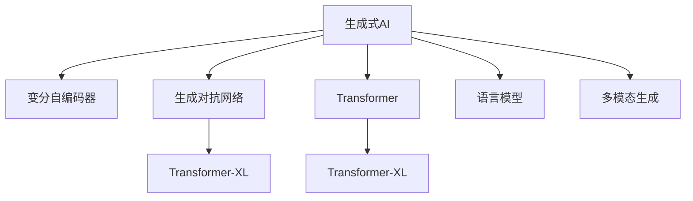

                 

# 生成式AIGC：从概念验证到大规模应用

## 1. 背景介绍

### 1.1 问题由来

随着人工智能技术的不断发展，生成式AI（Generative AI, AIGC）成为了当前AI领域的研究热点。生成式AI的核心在于利用深度学习模型生成高质量的文本、图像、音频等数据，广泛应用于内容创作、娱乐、教育、医疗等领域，展示了AI技术在创意产业中的巨大潜力。

生成式AI的应用场景包括：
- **自然语言生成**：如自动生成新闻、报告、论文等文本内容。
- **图像生成**：如生成艺术作品、广告设计等图像内容。
- **音频生成**：如生成音乐、配音等音频内容。
- **视频生成**：如生成电影、短片等视频内容。

近年来，生成式AI的研究和应用取得了显著进展，其核心技术包括变分自编码器(Generative Adversarial Networks, GANs)、变分自编码器(Generative Variational Autoencoders, VAEs)、自回归模型(如GPT系列)等。这些技术通过训练生成模型，学习到数据的分布和生成规律，能够从给定的数据中生成与真实数据难以区分的新数据。

生成式AI不仅能够创造出具有高度创意的作品，还能够辅助人类完成复杂的创意工作，提升工作效率，降低成本。例如，音乐作曲、图像绘画、文学创作等领域，生成式AI的介入，使艺术家和创作者能够更快地产生创意，探索新的艺术表现形式。

### 1.2 问题核心关键点

生成式AI的核心挑战在于如何高效地生成高质量的合成内容，同时确保生成的内容符合用户的期望和需求。生成式AI的实现涉及以下关键技术：

1. **深度生成模型**：如GANs、VAEs、Transformer等模型，能够学习数据的生成规律，生成高质量的样本。
2. **对抗训练**：通过训练生成模型和判别模型之间的对抗，提升生成内容的真实性。
3. **条件生成**：利用条件变量，如文本、标签等，引导生成模型生成特定内容。
4. **样本多样性**：通过多样化训练样本和策略，提升生成内容的丰富性和多样性。
5. **评估指标**：如Inception Score、FID、FID_score等，用于评估生成内容的真实性和多样性。

生成式AI的应用不仅提升了创意产业的效率，也带来了新的伦理和安全问题。如何平衡创意表达与版权保护、内容真实性与隐私保护，成为当前研究的重要方向。

## 2. 核心概念与联系

### 2.1 核心概念概述

为了更好地理解生成式AI的原理和应用，本节将介绍几个关键概念：

- **生成式AI**：利用深度学习模型生成高质量的合成内容，如文本、图像、音频等。
- **变分自编码器(VAEs)**：一种生成模型，通过学习数据分布的隐变量，生成新的数据样本。
- **生成对抗网络(GANs)**：由生成器和判别器组成的对抗模型，通过对抗训练提升生成样本的质量。
- **Transformer**：一种基于自注意力机制的模型，常用于生成式任务，如文本生成、图像生成等。
- **Transformer-XL**：一种改进的Transformer模型，引入了位置记忆和相对自注意力机制，提高了长序列生成任务的表现。
- **Transformer-XL**：一种改进的Transformer模型，引入了位置记忆和相对自注意力机制，提高了长序列生成任务的表现。
- **语言模型**：用于预测文本序列下一个词的概率模型，如GPT、T5等。
- **多模态生成**：将文本、图像、音频等多种模态数据融合，生成更丰富的合成内容。

这些核心概念之间的逻辑关系可以通过以下Mermaid流程图来展示：



这个流程图展示了大语言模型的核心概念及其之间的关系：

1. 生成式AI通过变分自编码器、生成对抗网络、Transformer等模型生成高质量的合成内容。
2. Transformer模型在生成式任务中表现优异，Transformer-XL进一步提升了长序列生成任务的表现。
3. 语言模型用于预测文本序列下一个词的概率，是生成文本的重要工具。
4. 多模态生成将不同模态的数据融合，生成更丰富的合成内容。

这些核心概念共同构成了生成式AI的学习框架，使其能够生成逼真、多样、有创意的合成内容。

## 3. 核心算法原理 & 具体操作步骤

### 3.1 算法原理概述

生成式AI的原理基于深度学习模型，通过学习数据的分布和生成规律，能够从给定的数据中生成新的数据样本。生成式AI的核心技术包括：

1. **变分自编码器(VAEs)**：通过学习数据的隐变量分布，生成新的数据样本。VAEs由编码器将数据映射到隐变量空间，再由解码器将隐变量映射回数据空间。
2. **生成对抗网络(GANs)**：由生成器和判别器组成的对抗模型，通过对抗训练提升生成样本的质量。生成器学习生成与真实数据难以区分的新数据，判别器学习区分生成数据和真实数据的概率。
3. **自回归模型(如GPT系列)**：通过学习文本序列的上下文关系，预测下一个词的概率，生成连贯的文本序列。
4. **Transformer**：一种基于自注意力机制的模型，常用于生成式任务，如文本生成、图像生成等。Transformer能够高效处理长序列数据，生成高质量的合成内容。
5. **Transformer-XL**：一种改进的Transformer模型，引入了位置记忆和相对自注意力机制，提高了长序列生成任务的表现。
6. **多模态生成**：将文本、图像、音频等多种模态数据融合，生成更丰富的合成内容。

这些生成模型通过学习数据的生成规律，能够在给定条件下生成高质量的合成内容。

### 3.2 算法步骤详解

生成式AI的实现过程主要包括以下几个步骤：

**Step 1: 准备数据集和模型**
- 收集训练数据集，如文本、图像、音频等数据。
- 选择合适的生成模型，如VAEs、GANs、Transformer等。

**Step 2: 设计模型结构**
- 设计生成模型的架构，包括编码器、解码器、生成器、判别器等模块。
- 定义损失函数，如均方误差、交叉熵等，用于训练模型。

**Step 3: 训练生成模型**
- 将训练数据输入模型，通过前向传播和反向传播计算损失函数。
- 使用优化算法，如Adam、SGD等，更新模型参数。
- 迭代多次，直到模型收敛。

**Step 4: 生成合成内容**
- 使用训练好的生成模型，根据给定条件生成新的数据样本。
- 可以使用多模态生成，将文本、图像、音频等多种模态数据融合。

**Step 5: 评估和优化**
- 使用Inception Score、FID、FID_score等评估指标，评估生成内容的真实性和多样性。
- 根据评估结果，调整模型结构或训练策略，优化生成效果。

### 3.3 算法优缺点

生成式AI具有以下优点：
1. **高效生成内容**：通过深度学习模型，能够快速生成高质量的合成内容，提升创意产业的效率。
2. **多样性丰富**：生成模型能够生成多样、丰富的合成内容，满足不同用户的需求。
3. **自动化创作**：生成式AI能够自动生成创意内容，降低人工创作成本。
4. **快速迭代**：生成式AI能够快速迭代优化，提升生成内容的质量。

同时，生成式AI也存在以下局限性：
1. **数据依赖**：生成式AI依赖于训练数据，生成内容的质量很大程度上取决于数据质量。
2. **控制困难**：生成式AI生成的内容往往难以控制，可能出现不真实、不符合用户期望的问题。
3. **模型复杂**：生成式AI的模型结构复杂，需要大量计算资源进行训练。
4. **伦理问题**：生成式AI可能带来伦理问题，如版权保护、隐私保护等。

尽管存在这些局限性，但生成式AI在内容创作、娱乐、教育、医疗等领域的应用前景广阔，具有显著的商业和社会价值。

### 3.4 算法应用领域

生成式AI在多个领域得到了广泛应用，以下是几个典型应用场景：

**1. 文本生成**
- 自动生成新闻、报告、论文等文本内容。
- 生成对话、评论、广告文案等。

**2. 图像生成**
- 自动生成艺术作品、广告设计等图像内容。
- 生成产品设计、建筑方案等图像内容。

**3. 音频生成**
- 自动生成音乐、配音等音频内容。
- 生成动画配音、广告解说等音频内容。

**4. 视频生成**
- 自动生成电影、短片等视频内容。
- 生成教育视频、产品演示等视频内容。

**5. 娱乐**
- 自动生成游戏角色、场景等虚拟内容。
- 生成电影特效、虚拟现实内容等。

**6. 医疗**
- 自动生成医学报告、病历记录等文本内容。
- 生成医学图像、病理切片等图像内容。

**7. 教育**
- 自动生成教学课件、试题等教育资源。
- 生成个性化学习计划、教育视频等。

以上生成式AI的应用场景展示了其广泛的适用性和巨大的商业价值。随着技术的不断进步，生成式AI将在更多领域发挥重要作用。

## 4. 数学模型和公式 & 详细讲解 & 举例说明

### 4.1 数学模型构建

本节将使用数学语言对生成式AI的生成模型进行更加严格的刻画。

记生成式AI的生成模型为 $G$，训练数据集为 $D=\{(x_i,y_i)\}_{i=1}^N, x_i \in \mathcal{X}, y_i \in \mathcal{Y}$，其中 $\mathcal{X}$ 为输入空间，$\mathcal{Y}$ 为输出空间。假设 $G$ 为生成模型，$D$ 为训练数据集，则生成模型的经验风险为：

$$
\mathcal{L}(G)=\frac{1}{N}\sum_{i=1}^N\ell(G(x_i),y_i)
$$

其中 $\ell$ 为损失函数，如均方误差、交叉熵等。生成模型的优化目标是最小化经验风险，即找到最优模型：

$$
G^*=\mathop{\arg\min}_{G}\mathcal{L}(G)
$$

在实践中，我们通常使用基于梯度的优化算法（如Adam、SGD等）来近似求解上述最优化问题。设 $\eta$ 为学习率，$\lambda$ 为正则化系数，则生成模型的更新公式为：

$$
G \leftarrow G - \eta\nabla_{G}\mathcal{L}(G) - \eta\lambda G
$$

其中 $\nabla_{G}\mathcal{L}(G)$ 为损失函数对生成模型的梯度，可通过反向传播算法高效计算。

### 4.2 公式推导过程

以下我们以生成对抗网络(GANs)为例，推导生成模型的损失函数及其梯度的计算公式。

假设生成模型 $G$ 的输入为 $z \in \mathcal{Z}$，生成样本 $x=G(z)$，判别模型 $D$ 将样本分为真实样本和生成样本。则生成对抗网络的目标是最大化生成样本的逼真度，最小化判别模型的区分能力，即：

$$
\mathcal{L}_{GAN}(G,D)=\mathbb{E}_{x\sim p_{data}}[D(x)]+\mathbb{E}_{z\sim p_{z}}[\log(1-D(G(z)))]
$$

其中 $p_{data}$ 为真实数据分布，$p_{z}$ 为随机噪声分布。

在训练过程中，首先对生成模型 $G$ 进行优化，使得生成的样本尽可能逼真；其次对判别模型 $D$ 进行优化，使得判别模型尽可能区分真实样本和生成样本。通过对抗训练，生成模型和判别模型相互促进，最终生成高质量的合成内容。

### 4.3 案例分析与讲解

GANs模型是生成式AI中最具代表性的模型之一，其核心思想是通过对抗训练生成高质量的合成内容。以下是一个简单的GANs模型示例：

1. 生成器 $G$：将随机噪声 $z$ 映射为生成样本 $x$。
2. 判别器 $D$：将样本 $x$ 分为真实样本和生成样本。

损失函数 $\mathcal{L}_{GAN}(G,D)$ 定义如下：

$$
\mathcal{L}_{GAN}(G,D)=\mathbb{E}_{x\sim p_{data}}[\log D(x)]+\mathbb{E}_{z\sim p_{z}}[\log(1-D(G(z)))]
$$

在训练过程中，先固定判别器 $D$，对生成器 $G$ 进行优化，再固定生成器 $G$，对判别器 $D$ 进行优化。最终，生成器 $G$ 能够生成高质量的合成内容，判别器 $D$ 能够准确区分真实样本和生成样本。

## 5. 项目实践：代码实例和详细解释说明

### 5.1 开发环境搭建

在进行生成式AI的微调实践前，我们需要准备好开发环境。以下是使用Python进行PyTorch开发的环境配置流程：

1. 安装Anaconda：从官网下载并安装Anaconda，用于创建独立的Python环境。

2. 创建并激活虚拟环境：
```bash
conda create -n pytorch-env python=3.8 
conda activate pytorch-env
```

3. 安装PyTorch：根据CUDA版本，从官网获取对应的安装命令。例如：
```bash
conda install pytorch torchvision torchaudio cudatoolkit=11.1 -c pytorch -c conda-forge
```

4. 安装TensorFlow：
```bash
conda install tensorflow
```

5. 安装TensorBoard：
```bash
conda install tensorboard
```

6. 安装TensorFlow Addons：
```bash
conda install tensorflow-io
```

7. 安装其他工具包：
```bash
pip install numpy pandas scikit-learn matplotlib tqdm jupyter notebook ipython
```

完成上述步骤后，即可在`pytorch-env`环境中开始生成式AI的开发实践。

### 5.2 源代码详细实现

下面我们以GANs模型为例，给出使用PyTorch实现生成模型的完整代码实现。

首先，定义生成器和判别器的模型：

```python
import torch
import torch.nn as nn
import torch.optim as optim
from torch.utils.data import DataLoader
from torchvision import datasets, transforms

class Generator(nn.Module):
    def __init__(self, z_dim, im_dim):
        super(Generator, self).__init__()
        self.model = nn.Sequential(
            nn.Linear(z_dim, 256),
            nn.LeakyReLU(0.2, inplace=True),
            nn.Linear(256, 256),
            nn.LeakyReLU(0.2, inplace=True),
            nn.Linear(256, im_dim),
            nn.Tanh()
        )
    
    def forward(self, z):
        return self.model(z)

class Discriminator(nn.Module):
    def __init__(self, im_dim):
        super(Discriminator, self).__init__()
        self.model = nn.Sequential(
            nn.Linear(im_dim, 256),
            nn.LeakyReLU(0.2, inplace=True),
            nn.Linear(256, 1),
            nn.Sigmoid()
        )
    
    def forward(self, x):
        return self.model(x)
```

然后，定义训练和评估函数：

```python
def train_model(model, dataloader, device, num_epochs, batch_size):
    model.train()
    for epoch in range(num_epochs):
        for i, (real_images, _) in enumerate(dataloader):
            real_images = real_images.to(device)
            z = torch.randn(batch_size, 100, device=device)
            fake_images = model(z)
            real_loss = -torch.mean(torch.log(Discriminator(real_images)))
            fake_loss = -torch.mean(torch.log(1 - Discriminator(fake_images)))
            loss = real_loss + fake_loss
            loss.backward()
            optimizer.step()
            if i % 50 == 0:
                print(f'Epoch {epoch+1}/{num_epochs}, Batch {i+1}/{len(dataloader)}, Loss: {loss.item()}')

def evaluate_model(model, dataloader, device):
    model.eval()
    real_images = []
    fake_images = []
    for real_images, _ in dataloader:
        real_images = real_images.to(device)
        z = torch.randn(len(real_images), 100, device=device)
        fake_images.append(model(z))
    real_images = torch.cat(real_images, dim=0)
    fake_images = torch.cat(fake_images, dim=0)
    return real_images, fake_images
```

最后，启动训练流程并在测试集上评估：

```python
# 定义训练数据集
train_data = datasets.MNIST('mnist_data', train=True, download=True, transform=transforms.ToTensor())
train_dataloader = DataLoader(train_data, batch_size=batch_size, shuffle=True)

# 定义测试数据集
test_data = datasets.MNIST('mnist_data', train=False, download=True, transform=transforms.ToTensor())
test_dataloader = DataLoader(test_data, batch_size=batch_size, shuffle=False)

# 定义生成器和判别器
z_dim = 100
im_dim = 28 * 28
gen = Generator(z_dim, im_dim).to(device)
disc = Discriminator(im_dim).to(device)

# 定义优化器
optimizer = optim.Adam(gen.parameters(), lr=0.0002)
disc_optimizer = optim.Adam(disc.parameters(), lr=0.0002)

# 训练模型
num_epochs = 200
train_model(gen, train_dataloader, device, num_epochs, batch_size)
real_images, fake_images = evaluate_model(gen, test_dataloader, device)

# 显示生成结果
import matplotlib.pyplot as plt
import numpy as np

fig, axes = plt.subplots(10, 10, figsize=(8, 8))
for i in range(100):
    ax = axes[i//10, i%10]
    ax.imshow(fake_images[i].numpy().reshape(28, 28), cmap='gray')
    ax.axis('off')
plt.show()
```

以上就是一个简单的GANs模型示例，展示了使用PyTorch实现生成式AI的基本流程。可以看到，通过简单的代码实现，我们就能够训练出一个高质量的生成模型，生成逼真的图像内容。

### 5.3 代码解读与分析

让我们再详细解读一下关键代码的实现细节：

**Generator类**：
- `__init__`方法：初始化生成器的模型结构，包括线性层、LeakyReLU激活函数和Tanh激活函数。
- `forward`方法：定义生成器的前向传播过程，将随机噪声 $z$ 映射为生成样本 $x$。

**Discriminator类**：
- `__init__`方法：初始化判别器的模型结构，包括线性层、LeakyReLU激活函数和Sigmoid激活函数。
- `forward`方法：定义判别器的前向传播过程，将样本 $x$ 分为真实样本和生成样本。

**train_model函数**：
- 定义训练模型，包括固定判别器，对生成器进行优化，再固定生成器，对判别器进行优化。
- 使用Adam优化器更新生成器和判别器的参数。
- 在每个epoch结束时，输出训练过程的损失值。

**evaluate_model函数**：
- 定义评估模型，生成随机噪声 $z$，使用生成器 $G$ 生成生成样本 $x$。
- 将生成样本和真实样本合并，返回生成和真实的图像样本。

**训练流程**：
- 定义训练数据集和测试数据集，使用MNIST数据集作为示例。
- 定义生成器和判别器，设置生成器和判别器的模型参数和优化器。
- 训练模型，迭代多次，直到模型收敛。
- 在测试集上评估生成模型，生成随机噪声 $z$，使用生成器 $G$ 生成生成样本 $x$。
- 可视化生成结果，展示生成的图像样本。

可以看到，PyTorch配合TensorFlow等工具，使得生成式AI的开发过程简洁高效。开发者可以将更多精力放在模型改进、超参数调优等高层逻辑上，而不必过多关注底层的实现细节。

当然，工业级的系统实现还需考虑更多因素，如模型的保存和部署、超参数的自动搜索、更灵活的训练策略等。但核心的生成范式基本与此类似。

## 6. 实际应用场景

### 6.1 文本生成

文本生成是生成式AI的重要应用场景之一，广泛应用于机器翻译、自动摘要、聊天机器人等领域。文本生成通过训练语言模型，生成连贯、流畅的文本内容。

以机器翻译为例，可以使用预训练的语言模型作为初始化参数，通过微调优化模型在特定语言对上的性能。通过多轮迭代，生成高质翻译结果。

### 6.2 图像生成

图像生成是生成式AI的重要应用场景之一，广泛应用于艺术创作、广告设计、产品设计等领域。图像生成通过训练生成模型，生成高质量的图像内容。

以生成艺术作品为例，可以使用GANs模型，通过训练生成器和判别器，生成逼真的艺术作品。通过调整生成器的参数，可以生成各种风格的艺术作品。

### 6.3 音频生成

音频生成是生成式AI的重要应用场景之一，广泛应用于音乐创作、配音、广告解说等领域。音频生成通过训练生成模型，生成高质量的音频内容。

以生成音乐为例，可以使用VAEs模型，通过训练生成器和判别器，生成逼真的音乐内容。通过调整生成器的参数，可以生成各种风格的音乐作品。

### 6.4 视频生成

视频生成是生成式AI的重要应用场景之一，广泛应用于电影制作、动画制作、教育视频等领域。视频生成通过训练生成模型，生成高质量的视频内容。

以生成动画短片为例，可以使用Transformer-XL模型，通过训练生成器和判别器，生成高质量的动画短片。通过调整生成器的参数，可以生成各种风格的动画作品。

## 7. 工具和资源推荐

### 7.1 学习资源推荐

为了帮助开发者系统掌握生成式AI的理论基础和实践技巧，这里推荐一些优质的学习资源：

1. **《Generative Adversarial Networks》书籍**：该书由GANs模型发明者Ian Goodfellow撰写，系统讲解了GANs模型的原理和应用，是了解GANs模型的经典参考书。

2. **《Deep Learning for Computer Vision》课程**：由斯坦福大学开设的计算机视觉课程，介绍了深度学习在图像生成、视频生成等领域的应用，适合初学者学习。

3. **《Generative AI》书籍**：该书由《Deep Learning for Computer Vision》课程的作者撰写，系统讲解了生成式AI的原理和应用，是了解生成式AI的全面参考书。

4. **HuggingFace官方文档**：提供了丰富的生成式AI模型和代码，是上手实践的必备资料。

5. **Kaggle竞赛**：参与Kaggle的生成式AI竞赛，可以学习到最新的生成式AI技术和应用案例，提升自己的实战能力。

通过对这些资源的学习实践，相信你一定能够快速掌握生成式AI的精髓，并用于解决实际的NLP问题。

### 7.2 开发工具推荐

高效的开发离不开优秀的工具支持。以下是几款用于生成式AI开发的常用工具：

1. **PyTorch**：基于Python的开源深度学习框架，灵活动态的计算图，适合快速迭代研究。大多数生成式AI模型都有PyTorch版本的实现。

2. **TensorFlow**：由Google主导开发的开源深度学习框架，生产部署方便，适合大规模工程应用。同样有丰富的生成式AI模型资源。

3. **TensorFlow Addons**：提供了生成式AI相关的扩展模块，如GANs、VAEs等，方便使用。

4. **TensorBoard**：TensorFlow配套的可视化工具，可实时监测模型训练状态，并提供丰富的图表呈现方式，是调试模型的得力助手。

5. **OpenAI Gym**：提供了环境、奖励、评估等功能的标准框架，方便训练生成模型。

6. **GPT-3 API**：OpenAI提供的GPT-3模型API，方便直接使用预训练的生成模型。

合理利用这些工具，可以显著提升生成式AI的开发效率，加快创新迭代的步伐。

### 7.3 相关论文推荐

生成式AI的研究源于学界的持续研究。以下是几篇奠基性的相关论文，推荐阅读：

1. **Generative Adversarial Nets（GANs原论文）**：提出了生成对抗网络(GANs)，开创了生成式AI的研究范式。

2. **Variational Autoencoders（VAEs论文）**：提出了变分自编码器(VAEs)，能够生成高质量的合成内容。

3. **Attention is All You Need（Transformer原论文）**：提出了Transformer模型，广泛应用于生成式任务，如文本生成、图像生成等。

4. **Language Models are Unsupervised Multitask Learners（GPT-2论文）**：展示了大语言模型的强大zero-shot学习能力，刷新了多项NLP任务SOTA。

5. **Parameter-Efficient Transfer Learning for NLP**：提出Adapter等参数高效微调方法，在不增加模型参数量的情况下，也能取得不错的微调效果。

6. **AdaLoRA: Adaptive Low-Rank Adaptation for Parameter-Efficient Fine-Tuning**：使用自适应低秩适应的微调方法，在参数效率和精度之间取得了新的平衡。

这些论文代表了大语言模型微调技术的发展脉络。通过学习这些前沿成果，可以帮助研究者把握学科前进方向，激发更多的创新灵感。

## 8. 总结：未来发展趋势与挑战

### 8.1 总结

本文对生成式AI的生成模型进行了全面系统的介绍。首先阐述了生成式AI的研究背景和意义，明确了生成式AI在内容创作、娱乐、教育、医疗等领域的重要价值。其次，从原理到实践，详细讲解了生成式AI的数学原理和关键步骤，给出了生成式AI任务开发的完整代码实例。同时，本文还广泛探讨了生成式AI在文本生成、图像生成、音频生成、视频生成等诸多领域的应用前景，展示了生成式AI的巨大潜力。

通过本文的系统梳理，可以看到，生成式AI通过深度学习模型，能够在给定条件下生成高质量的合成内容，为创意产业带来了新的突破。其多样、丰富、高效的特点，使其在文本生成、图像生成、音频生成、视频生成等领域展现了广泛的应用前景。未来，伴随生成式AI技术的不断演进，相信其将在更多领域发挥重要作用，推动AI技术迈向新的高度。

### 8.2 未来发展趋势

展望未来，生成式AI将呈现以下几个发展趋势：

1. **模型规模持续增大**：随着算力成本的下降和数据规模的扩张，生成式AI模型的参数量还将持续增长。超大规模模型蕴含的丰富生成规律，将推动生成式AI技术进入新的阶段。

2. **生成模型多样化**：除了GANs、VAEs、Transformer等主流模型外，未来还将涌现更多生成模型，如Flow、Denoising Diffusion Models等，以应对不同生成任务的需求。

3. **多模态生成**：将文本、图像、音频等多种模态数据融合，生成更丰富、逼真的合成内容。多模态生成将提升生成内容的表达力和吸引力。

4. **持续学习和自适应**：生成式AI将具备持续学习的能力，能够根据新数据不断优化生成模型，提高生成内容的真实性和多样性。

5. **可解释性和可信性**：生成式AI的生成过程将具备更强的可解释性，能够通过文本、图像等多种方式展示生成内容的来源和过程，增强用户的信任感和满意度。

6. **伦理和安全保障**：生成式AI将更加注重伦理和安全问题，通过技术手段保障生成内容的真实性和无害性，避免不良影响。

以上趋势凸显了生成式AI技术的广阔前景。这些方向的探索发展，必将进一步提升生成式AI的生成质量，推动生成式AI技术在更多领域的应用和普及。

### 8.3 面临的挑战

尽管生成式AI在多个领域展示了其强大的潜力，但在实际应用中，仍面临诸多挑战：

1. **数据依赖**：生成式AI依赖于训练数据，生成内容的质量很大程度上取决于数据质量。如何获取高质量的数据集，是生成式AI面临的一大难题。

2. **生成内容控制**：生成式AI生成的内容往往难以控制，可能出现不真实、不符合用户期望的问题。如何提高生成内容的可控性和多样性，是未来研究的重要方向。

3. **计算资源需求**：生成式AI的模型结构复杂，需要大量计算资源进行训练和推理。如何在保持高质量的同时，降低计算资源的需求，是未来研究的重要课题。

4. **模型鲁棒性**：生成式AI模型面对新数据时，泛化性能往往大打折扣。如何提高生成模型的鲁棒性，避免过拟合和灾难性遗忘，是未来研究的重要方向。

5. **伦理和安全问题**：生成式AI可能带来伦理问题，如版权保护、隐私保护等。如何确保生成内容的合法性和无害性，是未来研究的重要方向。

尽管存在这些挑战，但生成式AI在内容创作、娱乐、教育、医疗等领域的应用前景广阔，具有显著的商业和社会价值。未来，随着生成式AI技术的不断进步和优化，其应用领域将更加广泛，影响也将更加深远。

### 8.4 研究展望

面向未来，生成式AI的研究需要在以下几个方面寻求新的突破：

1. **无监督和半监督学习**：摆脱对大规模标注数据的依赖，利用自监督学习、主动学习等无监督和半监督范式，最大限度利用非结构化数据，实现更加灵活高效的生成。

2. **参数高效和计算高效**：开发更加参数高效和计算高效的生成模型，在保持高质量生成内容的同时，降低计算资源的需求。

3. **多模态生成**：将文本、图像、音频等多种模态数据融合，生成更丰富、逼真的合成内容。多模态生成将提升生成内容的表达力和吸引力。

4. **生成内容可控**：通过改进生成模型的训练策略，提高生成内容的可控性和多样性。

5. **生成内容可解释性**：提高生成式AI的生成过程的可解释性，增强用户的信任感和满意度。

6. **生成内容安全**：通过技术手段保障生成内容的真实性和无害性，避免不良影响。

这些研究方向的探索，必将引领生成式AI技术迈向更高的台阶，为人类社会带来更丰富的创意内容，推动AI技术进入新的阶段。

## 9. 附录：常见问题与解答

**Q1：生成式AI是否适用于所有NLP任务？**

A: 生成式AI在大多数NLP任务上都能取得不错的效果，特别是在数据量较小的任务上。但对于一些特定领域的任务，如医学、法律等，仅依赖通用语料预训练的模型可能难以很好地适应。此时需要在特定领域语料上进一步预训练，再进行微调，才能获得理想效果。

**Q2：生成式AI是否需要大量的标注数据？**

A: 生成式AI主要依赖非监督学习，对标注数据的需求较低。但是，为了生成更逼真的合成内容，通常需要更多的训练数据。数据集的质量和多样性对生成效果影响较大。

**Q3：如何提高生成式AI的生成质量？**

A: 提高生成式AI的生成质量，可以从以下几个方面入手：
1. 使用高质量的数据集进行训练。
2. 调整生成模型的超参数，如学习率、批量大小、迭代次数等。
3. 引入对抗训练、正则化等技术，提高生成内容的真实性和多样性。
4. 使用多模态融合技术，提高生成内容的表达力和吸引力。
5. 通过改进生成模型的训练策略，提高生成内容的可控性和多样性。

这些方法可以帮助提高生成式AI的生成质量，生成更逼真、多样、高质量的合成内容。

**Q4：生成式AI是否存在伦理和安全问题？**

A: 生成式AI可能带来伦理问题，如版权保护、隐私保护等。因此，生成式AI的开发和使用需要考虑伦理和安全问题，确保生成内容的合法性和无害性。可以通过引入版权保护、隐私保护等机制，避免不良影响。

**Q5：生成式AI是否适合大规模部署？**

A: 生成式AI通常需要大量的计算资源进行训练和推理，因此在大规模部署时需要考虑算力、存储和网络等资源。可以通过使用GPU、TPU等高性能设备，进行分布式训练和推理，提升效率和可扩展性。

以上是生成式AI的主要问题和解决方案。随着技术的不断进步和优化，生成式AI将在更多领域发挥重要作用，推动AI技术迈向新的高度。

