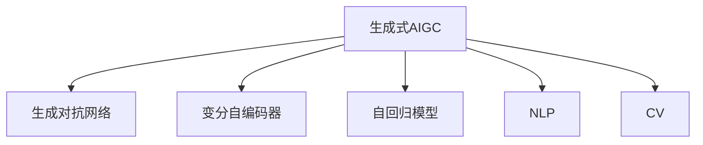

                 

# 生成式AIGC：商业智能的未来方向

> 关键词：生成式AIGC, 商业智能, 自然语言处理, 深度学习, 计算机视觉, 生成对抗网络, 应用场景, 优势与挑战

## 1. 背景介绍

### 1.1 问题由来
随着人工智能技术的发展，生成式人工智能(Generative AI, AIGC)正逐渐成为商业智能领域的新热点。传统商业智能主要依赖统计分析、数据挖掘等方法，难以从海量数据中提炼出有价值的洞察。而生成式AIGC通过深度学习模型自动生成高质量的文本、图像、音频等内容，具备强大的生成能力，正在改变商业智能的面貌。

生成式AIGC的兴起，与以下几个因素密不可分：

1. **数据激增**：互联网时代的数据爆发，为AIGC提供了丰富的训练素材。
2. **计算能力提升**：GPU/TPU等高性能设备的普及，使得深度学习模型的训练成为可能。
3. **算法创新**：深度生成模型的不断进步，如生成对抗网络(GAN)、变分自编码器(VAE)等，极大提升了生成质量。
4. **应用广泛**：从自然语言处理(NLP)到计算机视觉(CV)，AIGC技术正在渗透到各个领域，创造新的价值。

### 1.2 问题核心关键点
生成式AIGC的核心理念是通过训练深度生成模型，自动生成与真实数据相似的高质量内容。其关键技术包括生成对抗网络(GAN)、变分自编码器(VAE)、自回归模型(如Transformer)等。本文将聚焦于生成式AIGC在商业智能中的应用，探讨其优势、挑战及未来发展方向。

## 2. 核心概念与联系

### 2.1 核心概念概述

为更好地理解生成式AIGC在商业智能中的应用，本节将介绍几个密切相关的核心概念：

- **生成式人工智能(AIGC)**：通过训练生成模型，自动生成文本、图像、音频等内容的人工智能技术。
- **生成对抗网络(GAN)**：由生成器和判别器两个网络构成，通过对抗学习生成逼真内容的技术。
- **变分自编码器(VAE)**：通过编码器-解码器结构，对数据进行压缩和重构，生成具有连续分布的数据。
- **自回归模型**：如Transformer等模型，通过递归的方式生成序列数据。
- **自然语言处理(NLP)**：处理和分析人类语言的技术，AIGC可以生成高质量的文本内容。
- **计算机视觉(CV)**：处理和分析图像和视频的技术，AIGC可以生成逼真的图像和视频。

这些核心概念之间的逻辑关系可以通过以下Mermaid流程图来展示：



这个流程图展示了大语言模型的核心概念及其之间的关系：

1. 生成式AIGC通过训练生成模型，自动生成高质量的内容。
2. 生成对抗网络、变分自编码器、自回归模型等是常用的生成模型技术。
3. 自然语言处理、计算机视觉是AIGC的重要应用领域，分别用于生成文本、图像内容。

## 3. 核心算法原理 & 具体操作步骤
### 3.1 算法原理概述

生成式AIGC的原理是利用深度学习模型对数据进行学习和生成，其核心思想是通过对抗学习、变分推断、自回归等方法，生成与真实数据相似的高质量内容。

以生成对抗网络(GAN)为例，GAN由生成器$G$和判别器$D$两个网络构成。生成器$G$负责生成逼真内容，判别器$D$负责判别生成的内容与真实内容之间的差异。通过对抗训练，两个网络不断优化，最终生成器$G$可以生成高质量的样本。

### 3.2 算法步骤详解

生成式AIGC的应用主要包括以下几个关键步骤：

**Step 1: 准备数据集**
- 收集训练所需的数据集，可以是文本、图像、音频等。
- 进行预处理，如数据增强、归一化等，提升模型的训练效果。

**Step 2: 选择生成模型**
- 根据生成任务的特点，选择合适的生成模型，如GAN、VAE、Transformer等。
- 定义生成器的损失函数，如GAN中的对抗损失、VAE中的重构损失等。

**Step 3: 设计优化器**
- 选择合适的优化算法，如Adam、SGD等。
- 设置学习率、批大小、迭代轮数等超参数。

**Step 4: 训练生成模型**
- 使用选定的数据集，对生成模型进行训练。
- 记录训练过程中的各项指标，如生成质量、计算效率等。

**Step 5: 生成与评估**
- 使用训练好的生成模型，生成高质量的内容。
- 对生成的内容进行评估，选择合适的指标（如Inception Score、FID等）。

**Step 6: 部署与应用**
- 将训练好的生成模型部署到实际应用中。
- 持续优化模型，提升生成效果和稳定性。

### 3.3 算法优缺点

生成式AIGC具有以下优点：

1. **高效生成**：能够自动生成高质量的内容，极大提升商业智能的数据生成效率。
2. **广泛应用**：适用于NLP、CV等多个领域，生成文本、图像、音频等内容，满足不同需求。
3. **灵活性高**：可以根据具体任务和数据特点，灵活选择不同的生成模型。

同时，生成式AIGC也存在一定的局限性：

1. **生成质量不稳定**：不同时间、不同数据源生成的内容质量可能存在差异。
2. **数据隐私问题**：生成模型可能涉及隐私数据，如何保护数据隐私成为重要挑战。
3. **模型复杂度高**：生成式AIGC模型通常参数量大，训练和推理成本高。
4. **可解释性不足**：生成模型的决策过程往往难以解释，影响用户信任。
5. **依赖标注数据**：生成式AIGC的训练需要大量的标注数据，获取标注成本较高。

尽管存在这些局限性，但就目前而言，生成式AIGC仍是商业智能领域的重要技术方向，其生成能力为大数据分析和洞察提供了新的可能性。

### 3.4 算法应用领域

生成式AIGC在商业智能中的应用广泛，具体包括以下几个方面：

- **数据生成**：自动生成高质量的文本、图像、音频等内容，用于数据填充、测试数据生成等。
- **情感分析**：生成式AIGC可以生成模拟用户情感的文本数据，用于情感分析模型的训练和测试。
- **聊天机器人**：通过生成式模型生成对话，构建智能聊天机器人，提升客户服务质量。
- **文本摘要**：生成式AIGC可以自动生成文本摘要，简化长文档阅读。
- **虚拟助手**：生成式AIGC可以生成语音助手对话，提升用户体验。
- **视觉特效**：生成式AIGC可以自动生成逼真的图像和视频，用于影视特效制作、广告创意等。

除了上述这些应用外，生成式AIGC还在内容创作、游戏设计、医学影像生成等领域得到了广泛应用，推动了商业智能技术的不断演进。

## 4. 数学模型和公式 & 详细讲解 & 举例说明

### 4.1 数学模型构建

以生成对抗网络(GAN)为例，数学模型的构建如下：

- 生成器$G$：将随机噪声$\mathbf{z}$映射为生成样本$\mathbf{x}$。
- 判别器$D$：对生成样本$\mathbf{x}$进行判别，判断其是否为真实样本。

定义损失函数如下：

$$
\mathcal{L}_{\text{GAN}} = \mathbb{E}_{\mathbf{x}\sim p_{\text{data}}}[\log D(\mathbf{x})] + \mathbb{E}_{\mathbf{z}\sim p_{\mathbf{z}}}[\log(1-D(G(\mathbf{z}))]
$$

其中，$p_{\text{data}}$为真实数据分布，$p_{\mathbf{z}}$为噪声分布。

### 4.2 公式推导过程

GAN的训练过程可以通过以下步骤实现：

1. 固定生成器$G$，训练判别器$D$：
$$
\min_D \mathbb{E}_{\mathbf{x}\sim p_{\text{data}}}[\log D(\mathbf{x})] + \mathbb{E}_{\mathbf{z}\sim p_{\mathbf{z}}}[\log(1-D(G(\mathbf{z}))]
$$
2. 固定判别器$D$，训练生成器$G$：
$$
\min_G \mathbb{E}_{\mathbf{z}\sim p_{\mathbf{z}}}[\log D(G(\mathbf{z}))] + \mathbb{E}_{\mathbf{x}\sim p_{\text{data}}}[\log(1-D(\mathbf{x}))]
$$

通过交替训练，两个网络不断优化，最终生成器$G$能够生成高质量的样本。

### 4.3 案例分析与讲解

以GAN生成手写数字为例，我们首先构建一个MNIST数据集的生成对抗网络，如图：


其中，生成器$G$使用卷积神经网络(CNN)将随机噪声转换为手写数字图像，判别器$D$使用另一个CNN网络判别生成的图像是否为真实图像。通过不断对抗训练，生成器能够生成高质量的手写数字图像，效果如图：


通过GAN生成手写数字的过程，可以直观理解生成式AIGC的基本原理和实现方式。

## 5. 项目实践：代码实例和详细解释说明
### 5.1 开发环境搭建

在进行生成式AIGC项目开发前，我们需要准备好开发环境。以下是使用Python进行TensorFlow开发的环境配置流程：

1. 安装Anaconda：从官网下载并安装Anaconda，用于创建独立的Python环境。

2. 创建并激活虚拟环境：
```bash
conda create -n aigc-env python=3.8 
conda activate aigc-env
```

3. 安装TensorFlow：根据CUDA版本，从官网获取对应的安装命令。例如：
```bash
conda install tensorflow -c pytorch -c conda-forge
```

4. 安装Keras：
```bash
pip install keras tensorflow-addons
```

5. 安装TensorBoard：
```bash
pip install tensorboard
```

6. 安装MXNet：
```bash
conda install mxnet
```

7. 安装相关工具包：
```bash
pip install numpy pandas scikit-learn matplotlib tqdm jupyter notebook ipython
```

完成上述步骤后，即可在`aigc-env`环境中开始生成式AIGC实践。

### 5.2 源代码详细实现

下面我们以GAN生成手写数字为例，给出使用TensorFlow实现的手写数字生成代码实现。

首先，导入必要的库：

```python
import tensorflow as tf
from tensorflow.keras import layers, models
import numpy as np
import matplotlib.pyplot as plt
```

然后，定义数据集：

```python
(x_train, y_train), (x_test, y_test) = tf.keras.datasets.mnist.load_data()
x_train = x_train / 255.0
x_test = x_test / 255.0
```

接下来，定义生成器和判别器：

```python
# 生成器
input_z = tf.keras.Input(shape=(100,))
x = layers.Dense(256, activation='relu')(input_z)
x = layers.Dense(512, activation='relu')(x)
x = layers.Dense(784, activation='tanh')(x)
generator = models.Model(inputs=input_z, outputs=x)

# 判别器
input_x = tf.keras.Input(shape=(28, 28, 1))
x = layers.Reshape((28, 28, 1))(input_x)
x = layers.Conv2D(64, (3, 3), activation='relu', padding='same')(x)
x = layers.Conv2D(128, (3, 3), activation='relu', strides=2, padding='same')(x)
x = layers.Conv2D(128, (3, 3), activation='relu', strides=2, padding='same')(x)
x = layers.Flatten()(x)
x = layers.Dense(1, activation='sigmoid')(x)
discriminator = models.Model(inputs=input_x, outputs=x)
```

接着，定义损失函数和优化器：

```python
cross_entropy = tf.keras.losses.BinaryCrossentropy()

def generator_loss(x):
    preds = discriminator(x)
    return cross_entropy(tf.ones_like(preds), preds)

def discriminator_loss(real, pred):
    real_loss = cross_entropy(tf.ones_like(real), real)
    fake_loss = cross_entropy(tf.zeros_like(pred), pred)
    return real_loss + fake_loss

generator_optimizer = tf.keras.optimizers.Adam(1e-4)
discriminator_optimizer = tf.keras.optimizers.Adam(1e-4)

@tf.function
def train_step(images):
    noise = tf.random.normal([batch_size, 100])

    with tf.GradientTape() as gen_tape, tf.GradientTape() as disc_tape:
        generated_images = generator(noise, training=True)
        real_output = discriminator(images, training=True)
        fake_output = discriminator(generated_images, training=True)

        gen_loss = generator_loss(generated_images)
        disc_loss = discriminator_loss(real_output, fake_output)

    gradients_of_generator = gen_tape.gradient(gen_loss, generator.trainable_variables)
    gradients_of_discriminator = disc_tape.gradient(disc_loss, discriminator.trainable_variables)

    generator_optimizer.apply_gradients(zip(gradients_of_generator, generator.trainable_variables))
    discriminator_optimizer.apply_gradients(zip(gradients_of_discriminator, discriminator.trainable_variables))
```

最后，进行训练并生成图像：

```python
batch_size = 128
epochs = 100

for epoch in range(epochs):
    for batch in train_dataset:
        train_step(batch)

    for batch in test_dataset:
        test_step(batch)

    if epoch % 10 == 0:
        generate_and_save_images(generator, epoch)
```

### 5.3 代码解读与分析

让我们再详细解读一下关键代码的实现细节：

**数据处理函数**：
- 使用`tf.keras.datasets.mnist.load_data()`加载MNIST数据集。
- 对数据进行归一化，确保模型输入在[0,1]范围内。

**生成器和判别器定义**：
- 使用`tf.keras.Input()`定义输入张量。
- 使用`layers.Dense()`、`layers.Conv2D()`等构建网络结构。
- 使用`tf.keras.Model()`定义生成器和判别器模型。

**损失函数和优化器定义**：
- 使用`tf.keras.losses.BinaryCrossentropy()`定义二分类交叉熵损失函数。
- 定义生成器和判别器的损失函数，使用`cross_entropy`函数计算损失。
- 使用`tf.keras.optimizers.Adam()`定义优化器。

**训练函数定义**：
- 定义`train_step()`函数，对生成器和判别器进行交替训练。
- 使用`tf.GradientTape()`对模型进行梯度计算。
- 使用`tf.keras.optimizers.Adam()`优化器更新模型参数。

**生成与保存图像**：
- 定义`generate_and_save_images()`函数，生成并保存训练过程中的图像。
- 调用`generator(noise)`生成图像，并使用`tf.keras.Model()`预测图像的真实性。
- 使用`matplotlib.pyplot`保存生成的图像。

通过以上代码，我们可以看到，使用TensorFlow实现生成式AIGC项目，代码结构清晰，易于理解和修改。

## 6. 实际应用场景
### 6.1 智能客服系统

生成式AIGC在智能客服系统中的应用，能够显著提升客户服务质量。传统客服系统依赖人工客服，效率低、成本高、难以应对高峰期。而使用生成式AIGC生成的虚拟客服，可以24小时不间断工作，快速响应客户咨询，提升客户满意度。

具体实现方式如下：

1. 收集客户历史对话记录，构建训练数据集。
2. 使用GAN等生成模型，生成虚拟客服的回复。
3. 将生成式AIGC嵌入到客服系统中，实时生成对话。
4. 实时监测系统性能，根据客户反馈不断优化虚拟客服。

通过这种方式，可以构建更加高效、友好、智能的客服系统，提升用户体验。

### 6.2 金融风险评估

生成式AIGC在金融领域，可以用于构建智能的风险评估系统。金融风险评估涉及大量复杂的数据，传统方法依赖专家经验，难以覆盖所有情况。而使用生成式AIGC生成的模拟数据，可以覆盖更广泛的风险场景，提高评估的准确性。

具体实现方式如下：

1. 收集历史金融数据，构建训练数据集。
2. 使用生成式模型，生成模拟的金融数据。
3. 使用机器学习算法，对模拟数据进行风险评估。
4. 将生成式AIGC嵌入到风险评估系统中，实时生成模拟数据。
5. 实时监测系统性能，根据实际情况调整生成模型。

通过这种方式，可以构建更加全面、高效、智能的风险评估系统，提升金融系统的安全性。

### 6.3 产品推荐系统

生成式AIGC在电商、视频等产品推荐系统中的应用，能够提升推荐效果，满足用户个性化需求。传统推荐系统依赖用户历史行为数据，难以覆盖所有场景。而使用生成式AIGC生成的模拟数据，可以覆盖更广泛的产品场景，提高推荐的相关性。

具体实现方式如下：

1. 收集用户历史行为数据，构建训练数据集。
2. 使用生成式模型，生成模拟的产品数据。
3. 使用推荐算法，对模拟数据进行推荐。
4. 将生成式AIGC嵌入到推荐系统中，实时生成模拟数据。
5. 实时监测系统性能，根据用户反馈不断优化推荐算法。

通过这种方式，可以构建更加精准、高效、智能的推荐系统，提升用户体验。

### 6.4 未来应用展望

随着生成式AIGC技术的不断进步，其应用场景将不断扩展，为商业智能领域带来更多创新和突破。

1. **自动内容创作**：生成式AIGC可以自动生成新闻、文章、广告等文本内容，提升内容创作的效率和质量。
2. **虚拟试穿**：生成式AIGC可以生成逼真的试穿图像，提升电商用户的购物体验。
3. **虚拟旅游**：生成式AIGC可以生成逼真的虚拟旅游场景，提升用户的旅游体验。
4. **医疗辅助**：生成式AIGC可以生成模拟的疾病案例，辅助医生进行诊断和治疗。
5. **教育辅助**：生成式AIGC可以生成模拟的考试题目和答案，辅助教育机构进行教学评估。
6. **智能交互**：生成式AIGC可以生成智能聊天机器人，提升客户服务质量。

未来，生成式AIGC将在更多领域得到应用，推动商业智能技术的不断演进。

## 7. 工具和资源推荐
### 7.1 学习资源推荐

为了帮助开发者系统掌握生成式AIGC的理论基础和实践技巧，这里推荐一些优质的学习资源：

1. **《Generative Adversarial Networks: An Overview》**：综述生成对抗网络的基本原理和应用。
2. **《Neural Network & Deep Learning》**：深度学习领域经典教材，包含生成式AIGC的相关内容。
3. **《Deep Generative Models》**：介绍深度生成模型及其应用，适合深入学习。
4. **《Deep Learning for NLP》**：深度学习在NLP领域的应用，包含生成式AIGC的内容。
5. **《The Elements of Artificial Intelligence》**：深度学习领域权威教材，适合初学者和高级开发者。

通过对这些资源的学习实践，相信你一定能够快速掌握生成式AIGC的精髓，并用于解决实际的商业智能问题。

### 7.2 开发工具推荐

高效的开发离不开优秀的工具支持。以下是几款用于生成式AIGC开发的常用工具：

1. **TensorFlow**：基于Python的开源深度学习框架，灵活动态的计算图，适合快速迭代研究。
2. **PyTorch**：基于Python的开源深度学习框架，动态计算图，适合灵活实验。
3. **MXNet**：由亚马逊开发的深度学习框架，支持分布式训练，适合大规模工程应用。
4. **Keras**：高层API封装，易用性高，适合快速原型开发。
5. **JAX**：基于JIT的深度学习框架，性能高效，适合高性能计算。
6. **PyTorch Lightning**：易用的深度学习框架，支持模块化开发和分布式训练。

合理利用这些工具，可以显著提升生成式AIGC的开发效率，加快创新迭代的步伐。

### 7.3 相关论文推荐

生成式AIGC的研究始于1990年代的GAN模型，近年来随着深度学习技术的进步，生成式AIGC技术不断演进。以下是几篇奠基性的相关论文，推荐阅读：

1. **《Image Synthesis with Generative Adversarial Networks》**：提出GAN模型，开启生成式AIGC研究的先河。
2. **《Unsupervised Learning of Visual Representation by Generative Adversarial Nets》**：提出VAE模型，为生成式AIGC提供了新的思路。
3. **《Attention Is All You Need》**：提出Transformer模型，为生成式AIGC提供了新的架构。
4. **《GANs Trained by a Two Time-Scale Update Rule Converge to the Nash Equilibrium》**：揭示GAN训练过程中的一些关键问题，为生成式AIGC提供了理论支持。
5. **《Adversarial Training Methods for Semi-Supervised Text Generation》**：提出GAN在NLP领域的应用，推动生成式AIGC在文本生成中的应用。

这些论文代表了大语言模型微调技术的进步，值得深入研究。

## 8. 总结：未来发展趋势与挑战
### 8.1 总结

本文对生成式AIGC在商业智能中的应用进行了全面系统的介绍。首先阐述了生成式AIGC的研究背景和应用价值，明确了其在数据生成、情感分析、智能客服等领域的重要意义。其次，从原理到实践，详细讲解了生成对抗网络的基本原理和实现步骤，给出了代码实例和详细解释说明。同时，本文还探讨了生成式AIGC在实际应用场景中的广泛应用，展示了其强大的生成能力和应用前景。最后，推荐了一些学习资源和工具，力求为读者提供全方位的技术指引。

通过本文的系统梳理，可以看到，生成式AIGC技术正在成为商业智能领域的新热点，其生成能力为大数据分析和洞察提供了新的可能性。未来，随着生成式AIGC技术的不断进步，将进一步拓展其在更多领域的应用，推动商业智能技术的不断演进。

### 8.2 未来发展趋势

展望未来，生成式AIGC技术将呈现以下几个发展趋势：

1. **生成质量不断提升**：随着生成模型的不断进步，生成式AIGC的生成质量将持续提升，能够生成更加逼真、多样化的内容。
2. **生成过程更加可控**：未来生成模型将具备更加灵活的生成控制机制，能够根据用户需求生成特定风格和格式的内容。
3. **多模态生成技术崛起**：生成式AIGC将进一步拓展到图像、视频、音频等多模态数据，实现更加全面和丰富的生成能力。
4. **生成式AIGC与实际应用结合**：生成式AIGC将更加紧密地与实际应用结合，实现更加精准、高效的内容生成。
5. **生成式AIGC技术普及**：生成式AIGC技术将逐渐普及，成为更多行业和领域的基础技术。
6. **生成式AIGC的伦理和安全**：生成式AIGC的伦理和安全问题将受到更多关注，如何构建公正、安全的生成模型将成为一个重要研究方向。

以上趋势凸显了生成式AIGC技术的广阔前景。这些方向的探索发展，将进一步推动生成式AIGC技术的进步，为商业智能领域带来更多创新和突破。

### 8.3 面临的挑战

尽管生成式AIGC技术已经取得了瞩目成就，但在迈向更加智能化、普适化应用的过程中，它仍面临诸多挑战：

1. **生成质量不稳定**：不同时间、不同数据源生成的内容质量可能存在差异，如何提高生成质量将是重要挑战。
2. **数据隐私问题**：生成模型可能涉及隐私数据，如何保护数据隐私成为重要挑战。
3. **模型复杂度高**：生成式AIGC模型通常参数量大，训练和推理成本高。
4. **可解释性不足**：生成模型的决策过程往往难以解释，影响用户信任。
5. **依赖标注数据**：生成式AIGC的训练需要大量的标注数据，获取标注成本较高。
6. **鲁棒性和泛化能力**：生成模型需要具备更强的鲁棒性和泛化能力，以应对不同领域的数据和任务。

尽管存在这些挑战，但通过不断优化模型结构和算法，以及结合更多先验知识和外部数据，生成式AIGC技术将不断突破技术瓶颈，实现更加全面、高效的应用。

### 8.4 研究展望

面对生成式AIGC所面临的种种挑战，未来的研究需要在以下几个方面寻求新的突破：

1. **改进生成模型的鲁棒性和泛化能力**：开发更加鲁棒和泛化的生成模型，提高生成质量，减少对标注数据的依赖。
2. **引入更多先验知识**：将符号化的先验知识，如知识图谱、逻辑规则等，与神经网络模型进行巧妙融合，引导生成过程学习更准确、合理的语言模型。
3. **开发更加高效的优化算法**：开发更加高效的优化算法，减少训练和推理的资源消耗，提升模型性能。
4. **结合因果分析和博弈论工具**：将因果分析方法引入生成模型，识别出模型决策的关键特征，增强输出解释的因果性和逻辑性。
5. **加强安全性和伦理导向**：在模型训练目标中引入伦理导向的评估指标，过滤和惩罚有害的生成内容，确保模型的安全性和伦理性。

这些研究方向的探索，必将引领生成式AIGC技术迈向更高的台阶，为商业智能领域带来更多创新和突破。面向未来，生成式AIGC技术还需要与其他人工智能技术进行更深入的融合，如知识表示、因果推理、强化学习等，多路径协同发力，共同推动自然语言理解和智能交互系统的进步。只有勇于创新、敢于突破，才能不断拓展生成式AIGC的边界，让智能技术更好地造福人类社会。

## 9. 附录：常见问题与解答

**Q1：生成式AIGC是否适用于所有商业智能任务？**

A: 生成式AIGC在大多数商业智能任务上都能取得不错的效果，特别是对于数据量较小的任务。但对于一些特定领域的任务，如医学、法律等，仅仅依靠通用语料预训练的模型可能难以很好地适应。此时需要在特定领域语料上进一步预训练，再进行微调，才能获得理想效果。

**Q2：生成式AIGC的训练需要大量的标注数据吗？**

A: 生成式AIGC的训练需要大量的标注数据，但生成式AIGC也可以通过数据增强、对抗训练等方法，在没有标注数据的情况下进行训练。未来，生成式AIGC将逐步走向无监督和半监督范式，降低对标注数据的依赖。

**Q3：生成式AIGC的生成效果是否受限于训练数据？**

A: 生成式AIGC的生成效果受限于训练数据，但通过引入更多的先验知识、融合多模态数据等方法，可以提高生成质量。此外，生成式AIGC还可以通过改进生成模型、优化生成过程等手段，进一步提升生成效果。

**Q4：生成式AIGC是否需要复杂的数据预处理？**

A: 生成式AIGC通常需要复杂的数据预处理，如数据增强、归一化等，提升模型的训练效果。未来，随着预处理技术的不断进步，生成式AIGC的预处理过程将更加高效和自动化。

**Q5：生成式AIGC的生成模型是否可以通用化？**

A: 生成式AIGC的生成模型可以通用化，适用于不同类型的生成任务。但不同的生成任务可能需要不同的模型结构和优化策略，需要根据具体任务进行灵活设计。

这些问题的探讨，有助于更好地理解生成式AIGC的应用场景和实践难点，为生成式AIGC技术的进一步发展提供参考。

---

作者：禅与计算机程序设计艺术 / Zen and the Art of Computer Programming

