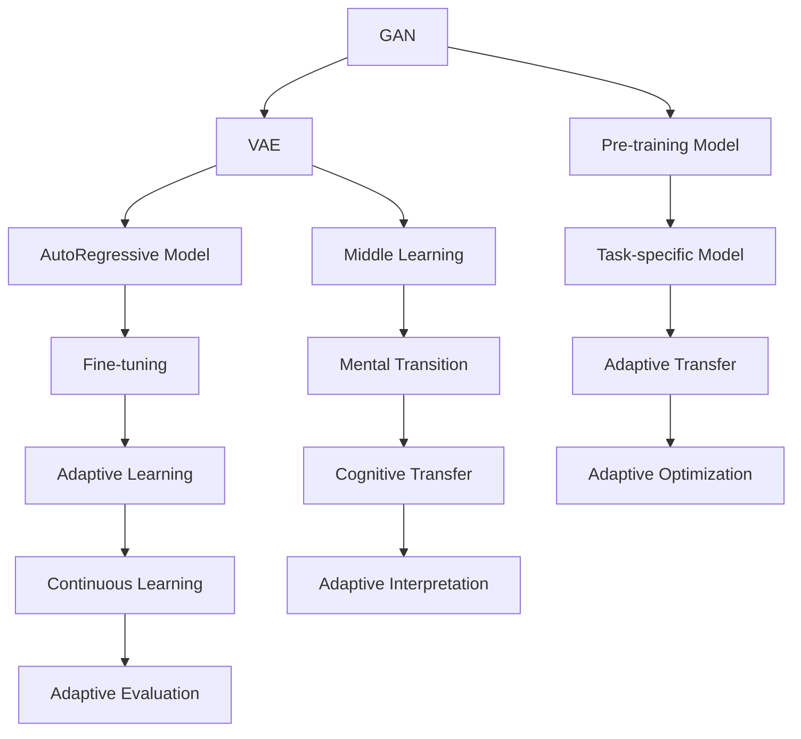

                 

## 1. 背景介绍

### 1.1 问题由来

随着人工智能(AI)技术的迅猛发展，生成式人工智能（Generative AI）已成为最受关注和前景广阔的领域之一。其应用广泛，涉及自然语言处理、计算机视觉、语音识别、音乐创作等多个方向，并正在深度改变社会的生产方式和生活模式。生成式AI的核心技术是生成对抗网络（GAN）、变分自编码器（VAE）和自回归模型等。

传统机器学习方式主要依赖于监督学习或无监督学习，而生成式AI更注重学习数据的生成过程，通过训练生成模型，能够从无标签数据中发现数据的内在结构和规律，自动生成高质量的样本。

当前，生成式AI技术在各行各业的应用案例不断涌现，如电商平台通过生成图片提升用户购物体验、数字媒体通过生成视频和音乐丰富内容生态、智能交通通过生成导航信息优化出行路线等。同时，生成式AI还在教育、娱乐、金融等垂直领域展现出巨大的潜力和价值。

然而，生成式AI的广泛应用也带来了新的挑战和伦理问题。如何确保生成内容的真实性、安全性、可解释性，以及如何平衡技术进步与人类价值观，是当前AI领域亟需解决的难题。

### 1.2 问题核心关键点

生成式AI的主要挑战包括：
- **真实性与安全性**：如何确保生成内容符合事实、避免假新闻和误导信息。
- **可解释性与透明性**：生成模型为何能产生特定内容，以及如何解读其生成过程。
- **版权与隐私问题**：生成内容的版权归属问题，以及如何保护用户隐私。
- **伦理与社会影响**：AI模型是否可能加剧社会不平等、偏见等问题。
- **技术挑战**：如超参数调优、计算资源消耗、模型训练和部署效率等。

本文将从生成式AI的基本原理、核心算法、应用案例以及未来展望等方面，深入探讨其对未来商业智能化转型的影响。

## 2. 核心概念与联系

### 2.1 核心概念概述

为更好地理解生成式AI的核心概念，本节将介绍几个关键概念及其相互联系：

- **生成对抗网络（GAN）**：一种通过两个神经网络（生成器和判别器）相互博弈的训练方式，目标是生成与真实数据难以区分的假数据。
- **变分自编码器（VAE）**：一种基于变分推断的无监督学习算法，通过编码器和解码器分别学习数据的概率分布和重构误差，实现数据生成和降维。
- **自回归模型（AutoRegressive Model）**：一种通过已有数据预测未来数据的方法，常用于文本、语音等序列数据的生成。
- **预训练模型**：在大规模无标签数据上预训练得到的通用模型，如BERT、GPT等，可用于下游任务的微调。
- **迁移学习**：将一个领域学到的知识迁移到另一个相关领域，从而在少样本条件下也能取得良好效果。

这些核心概念通过以下Mermaid流程图展示了其相互关系：



这个流程图展示了生成式AI的各个关键概念及其相互联系：

1. GAN和VAE作为生成式模型，主要用于数据生成和降维。
2. 自回归模型常用于序列数据生成。
3. 预训练模型和迁移学习用于获取通用知识。
4. 任务特定的模型和微调用于适应具体任务。
5. 适应性学习、认知转移和连续学习等概念，描述了模型在实际应用中的动态调整和优化过程。

## 3. 核心算法原理 & 具体操作步骤

### 3.1 算法原理概述

生成式AI的核心算法包括GAN、VAE和自回归模型等，其中GAN和VAE是最为重要的两种生成模型。以下将详细介绍其基本原理和操作步骤。

**生成对抗网络（GAN）**：
GAN由生成器（Generator）和判别器（Discriminator）组成。生成器尝试生成尽可能逼真的假数据，而判别器则尝试区分生成数据和真实数据。两者的博弈过程，使得生成器不断优化其生成能力，最终生成与真实数据难以区分的假数据。

GAN的训练过程可以概括为：
1. 判别器通过真实数据和生成数据进行训练，学习区分两者的能力。
2. 生成器通过真实数据和判别器的反馈进行训练，学习生成逼真的假数据。
3. 两者的博弈不断进行，直到生成器生成的数据无法被判别器区分。

**变分自编码器（VAE）**：
VAE通过编码器和解码器实现数据的降维和重构。编码器将数据映射到一个低维空间，解码器则将低维空间中的数据重构回高维空间。VAE通过最大化数据分布的概率，实现对数据的降维和重构。

VAE的训练过程可以概括为：
1. 编码器通过输入数据学习生成一个低维向量。
2. 解码器通过低维向量重构生成原始数据。
3. 通过计算解码器的重构误差和数据的似然函数，最小化重构误差和编码器的分布差异。

### 3.2 算法步骤详解

**生成对抗网络（GAN）**：

1. **模型初始化**：定义生成器和判别器的结构，并随机初始化参数。
2. **训练判别器**：将真实数据和生成数据交替输入判别器，更新判别器的参数，使其尽可能区分真实数据和生成数据。
3. **训练生成器**：使用判别器的输出作为反馈，更新生成器的参数，使其生成的数据尽可能接近真实数据。
4. **迭代训练**：重复执行上述两步，直到生成器生成的数据无法被判别器区分。

**变分自编码器（VAE）**：

1. **模型初始化**：定义编码器和解码器的结构，并随机初始化参数。
2. **训练编码器**：通过输入数据，计算编码器的输出向量，更新编码器的参数，使其能够更好地学习数据的分布。
3. **训练解码器**：使用编码器的输出向量，重构生成原始数据，更新解码器的参数，使其能够更好地重构数据。
4. **优化重构误差和分布差异**：通过最小化重构误差和编码器的分布差异，优化VAE模型的性能。

### 3.3 算法优缺点

生成式AI的算法具有以下优点：
1. **数据生成能力**：能够生成高质量的假数据，用于数据增强、生成对抗样本等。
2. **降维能力**：能够将高维数据映射到低维空间，便于存储和处理。
3. **可解释性**：生成式AI的生成过程可以解释为模型通过训练学习到的分布规律。

同时，也存在一些局限性：
1. **训练困难**：GAN和VAE的训练过程容易陷入不稳定状态，难以收敛。
2. **生成内容多样性**：生成的内容可能存在多样性和一致性问题。
3. **伦理和社会影响**：生成的假数据可能引发虚假信息、误导用户等社会问题。
4. **计算资源消耗大**：训练过程需要大量的计算资源和时间。

### 3.4 算法应用领域

生成式AI的应用领域非常广泛，以下是几个典型的应用场景：

- **自然语言生成（NLG）**：如自动摘要、机器翻译、文本生成等。通过生成对抗网络和自回归模型，可以实现自动生成高质量的文本。
- **图像生成**：如人脸生成、图像修复、图像转换等。通过GAN和VAE，可以实现从无标签数据中生成逼真的图像。
- **音频生成**：如语音合成、音乐生成、声音转换等。通过生成对抗网络和自回归模型，可以实现自动生成高质量的音频。
- **视频生成**：如视频补帧、视频剪辑、视频生成等。通过GAN和VAE，可以实现从无标签数据中生成逼真的视频。
- **推荐系统**：如基于生成式模型的推荐算法，能够生成更加个性化的推荐内容。

## 4. 数学模型和公式 & 详细讲解 & 举例说明

### 4.1 数学模型构建

生成式AI的数学模型通常包含以下关键部分：

- **数据分布**：生成式AI的目标是学习数据的分布，因此数据分布是一个重要组成部分。
- **生成模型**：生成模型用于从数据分布中生成新样本。
- **损失函数**：损失函数用于衡量生成模型生成的样本与真实数据之间的差异。

### 4.2 公式推导过程

**生成对抗网络（GAN）**：

1. **判别器的目标函数**：
   $$
   \mathcal{L}_{D} = \mathbb{E}_{\mathbf{x} \sim \mathcal{X}}[\log D(\mathbf{x})] + \mathbb{E}_{\mathbf{z} \sim \mathcal{Z}}[\log (1 - D(G(\mathbf{z}))]
   $$
   其中，$\mathbf{x}$ 表示真实数据，$\mathbf{z}$ 表示噪声向量，$G(\mathbf{z})$ 表示生成器生成的数据。

2. **生成器的目标函数**：
   $$
   \mathcal{L}_{G} = -\mathbb{E}_{\mathbf{z} \sim \mathcal{Z}}[\log D(G(\mathbf{z}))]
   $$

3. **联合目标函数**：
   $$
   \mathcal{L}_{GAN} = \mathcal{L}_{D} + \mathcal{L}_{G}
   $$

**变分自编码器（VAE）**：

1. **编码器的目标函数**：
   $$
   \mathcal{L}_{\beta} = -\mathbb{E}_{\mathbf{x} \sim \mathcal{X}}[\log p(\mathbf{x}|\mathbf{z})] + \beta \mathbb{E}_{\mathbf{z} \sim \mathcal{Z}}[\log \left|\sigma^{2}\right|] + \beta \mathbb{E}_{\mathbf{z} \sim \mathcal{Z}}[-\frac{1}{2} \mathbf{x} \sim \mathcal{X} ||\mathbf{x}-\mathbf{z}||^{2}]
   $$
   其中，$\mathbf{x}$ 表示原始数据，$\mathbf{z}$ 表示编码器生成的向量。

2. **解码器的目标函数**：
   $$
   \mathcal{L}_{\alpha} = -\mathbb{E}_{\mathbf{z} \sim \mathcal{Z}}[\log p_{\alpha}(\mathbf{x}|\mathbf{z})]
   $$
   其中，$p_{\alpha}(\mathbf{x}|\mathbf{z})$ 表示解码器生成的数据。

3. **联合目标函数**：
   $$
   \mathcal{L}_{VAE} = \mathcal{L}_{\beta} + \mathcal{L}_{\alpha}
   $$

### 4.3 案例分析与讲解

**图像生成**：
1. **模型选择**：选择GAN或VAE作为生成模型。
2. **数据预处理**：对图像数据进行预处理，如归一化、数据增强等。
3. **模型训练**：通过训练生成器和判别器（GAN）或编码器和解码器（VAE），优化模型参数。
4. **结果评估**：评估生成结果的逼真度和多样性，优化模型性能。

## 5. 项目实践：代码实例和详细解释说明

### 5.1 开发环境搭建

在进行生成式AI项目实践前，我们需要准备好开发环境。以下是使用Python进行TensorFlow开发的环境配置流程：

1. 安装Anaconda：从官网下载并安装Anaconda，用于创建独立的Python环境。

2. 创建并激活虚拟环境：
```bash
conda create -n tensorflow-env python=3.8 
conda activate tensorflow-env
```

3. 安装TensorFlow：根据CUDA版本，从官网获取对应的安装命令。例如：
```bash
conda install tensorflow -c tf -c conda-forge
```

4. 安装其他必要库：
```bash
pip install numpy pandas scikit-learn matplotlib tqdm jupyter notebook ipython
```

完成上述步骤后，即可在`tensorflow-env`环境中开始生成式AI实践。

### 5.2 源代码详细实现

下面我们以GAN生成手写数字为例，给出使用TensorFlow实现GAN的代码实现。

```python
import tensorflow as tf
from tensorflow.keras import layers
import matplotlib.pyplot as plt

# 定义生成器和判别器
class Generator(tf.keras.Model):
    def __init__(self):
        super(Generator, self).__init__()
        self.dense1 = layers.Dense(256, input_dim=100)
        self.dense2 = layers.Dense(784, activation='tanh')

    def call(self, x):
        x = tf.reshape(x, (100, 1))
        x = self.dense1(x)
        x = tf.reshape(x, (-1, 28, 28, 1))
        x = self.dense2(x)
        return x

class Discriminator(tf.keras.Model):
    def __init__(self):
        super(Discriminator, self).__init__()
        self.dense1 = layers.Dense(256, input_dim=784)
        self.dense2 = layers.Dense(1, activation='sigmoid')

    def call(self, x):
        x = self.dense1(x)
        x = self.dense2(x)
        return x

# 定义损失函数
cross_entropy = tf.keras.losses.BinaryCrossentropy(from_logits=True)

# 定义优化器
optimizer_G = tf.keras.optimizers.Adam(learning_rate=0.0002, beta_1=0.5)
optimizer_D = tf.keras.optimizers.Adam(learning_rate=0.0002, beta_1=0.5)

# 加载MNIST数据集
(x_train, _), (x_test, _) = tf.keras.datasets.mnist.load_data()

x_train = x_train / 255.0
x_test = x_test / 255.0
x_train = tf.reshape(x_train, (len(x_train), 784))
x_test = tf.reshape(x_test, (len(x_test), 784))

# 定义训练函数
@tf.function
def train_step(images):
    noise = tf.random.normal([batch_size, 100])
    with tf.GradientTape() as g:
        generated_images = generator(noise, training=True)
        real_output = discriminator(images, training=True)
        fake_output = discriminator(generated_images, training=True)
        gen_loss = cross_entropy(fake_output, tf.ones_like(fake_output))
        disc_loss = cross_entropy(real_output, tf.ones_like(real_output)) + cross_entropy(fake_output, tf.zeros_like(fake_output))
    gradients_of_G = g.gradient(gen_loss, generator.trainable_variables)
    gradients_of_D = g.gradient(disc_loss, discriminator.trainable_variables)
    optimizer_G.apply_gradients(zip(gradients_of_G, generator.trainable_variables))
    optimizer_D.apply_gradients(zip(gradients_of_D, discriminator.trainable_variables))

# 训练GAN模型
generator = Generator()
discriminator = Discriminator()
batch_size = 256
epochs = 100
steps_per_epoch = 1000

for epoch in range(epochs):
    for step in range(steps_per_epoch):
        train_step(x_train[step * batch_size:(step + 1) * batch_size])
    if epoch % 10 == 0:
        plt.figure(figsize=(8, 8))
        plt.title('Generated Images')
        plt.imshow(generator(noise, training=False)[0])
        plt.show()

```

### 5.3 代码解读与分析

让我们再详细解读一下关键代码的实现细节：

**Generator类**：
- `__init__`方法：初始化生成器中的层结构。
- `call`方法：定义生成器的前向传播过程。

**Discriminator类**：
- `__init__`方法：初始化判别器中的层结构。
- `call`方法：定义判别器的前向传播过程。

**损失函数**：
- `cross_entropy`方法：定义交叉熵损失函数，用于计算生成器和判别器的损失。

**优化器**：
- `optimizer_G`和`optimizer_D`方法：定义生成器和判别器的优化器。

**数据加载**：
- `(x_train, _)`, `(x_test, _)`：加载MNIST数据集，并对图像进行归一化和扁平化。

**训练函数**：
- `train_step`方法：定义一个训练步骤，包括生成器和判别器的计算过程和优化过程。

**模型训练**：
- 在每个epoch中，对所有训练样本进行训练，每训练一个batch就输出一次生成结果。

可以看到，TensorFlow的Keras API使得生成式AI的代码实现变得简洁高效。开发者可以将更多精力放在模型架构和优化策略的调整上，而不必过多关注底层的计算图和梯度计算等细节。

当然，工业级的系统实现还需考虑更多因素，如模型的保存和部署、超参数的自动搜索、更多的训练技巧等。但核心的生成式AI训练流程基本与此类似。

## 6. 实际应用场景

### 6.1 医疗影像生成

生成式AI在医疗影像生成方面具有广泛的应用前景。传统的医学影像数据量巨大，获取和标注成本高昂。生成式AI可以通过学习医学影像的分布，生成高质量的医学影像，用于辅助诊断、治疗方案设计和疾病预测等。

**应用场景**：
- **医学影像增强**：通过生成对抗网络，将低质量或模糊的医学影像生成高质量的影像，提升医生的诊断准确性。
- **虚拟切片生成**：生成虚拟切片，辅助医生进行病情分析，提高诊断效率。
- **疾病预测**：通过生成式模型生成患者模拟器，进行疾病预测和模拟治疗，提前发现潜在疾病风险。

### 6.2 数字艺术创作

生成式AI在数字艺术创作领域具有广泛的应用前景。数字艺术创作需要大量的创意和素材，传统的手工创作效率低，难以满足市场需求。生成式AI可以通过学习大量的艺术作品，生成高质量的艺术作品，用于广告、影视制作和虚拟现实等领域。

**应用场景**：
- **自动绘画**：通过生成对抗网络，自动生成各种风格的绘画作品，提高创作效率。
- **动画生成**：生成高质量的动画和视频，用于电影、游戏和虚拟现实等领域。
- **音乐创作**：生成各种风格的音乐作品，用于音乐制作和娱乐应用。

### 6.3 广告创意生成

生成式AI在广告创意生成方面具有广泛的应用前景。传统的广告创意设计需要大量的设计师和创意素材，成本高且效率低。生成式AI可以通过学习大量的广告素材，生成高质量的广告创意，用于品牌宣传、市场推广和数字营销等领域。

**应用场景**：
- **自动广告设计**：通过生成对抗网络，自动生成各种风格的广告设计，提高广告设计效率。
- **广告内容生成**：生成高质量的广告文案和视频内容，用于品牌宣传和市场推广。
- **用户画像生成**：生成高质量的用户画像，用于市场分析和个性化推荐。

### 6.4 未来应用展望

随着生成式AI技术的发展，其在未来将具有更加广泛的应用前景：

1. **智能设计**：生成式AI将进一步应用于工业设计、建筑设计等领域，帮助设计师快速生成设计方案，提高设计效率和质量。
2. **虚拟现实**：生成式AI将应用于虚拟现实游戏、虚拟现实会议等场景，生成逼真的虚拟环境。
3. **自动化内容生成**：生成式AI将应用于自动化新闻报道、自动化新闻稿撰写等领域，提高新闻和信息的生成效率。
4. **个性化推荐**：生成式AI将应用于个性化推荐系统，生成高质量的推荐内容，提高用户满意度和转化率。
5. **教育培训**：生成式AI将应用于教育培训，生成高质量的教育素材，提高教育培训的效果和效率。

## 7. 工具和资源推荐

### 7.1 学习资源推荐

为了帮助开发者系统掌握生成式AI的理论基础和实践技巧，这里推荐一些优质的学习资源：

1. **《生成对抗网络：原理与实现》**：张翔等著，详细介绍了GAN的基本原理和实现方法，是理解GAN的核心读物。
2. **《变分自编码器：原理与实现》**：王坚等著，详细介绍了VAE的基本原理和实现方法，是理解VAE的核心读物。
3. **《自然语言生成：原理与实践》**：李航等著，详细介绍了自然语言生成的基本原理和实现方法，是理解NLG的核心读物。
4. **Coursera《生成式AI课程》**：斯坦福大学开设的生成式AI课程，有Lecture视频和配套作业，带你入门生成式AI领域的基本概念和经典模型。
5. **ArXiv上的最新论文**：ArXiv上不断有新的生成式AI论文发布，保持对最新进展的关注，是学习生成式AI的重要途径。

通过对这些资源的学习实践，相信你一定能够快速掌握生成式AI的精髓，并用于解决实际的AI问题。

### 7.2 开发工具推荐

生成式AI的开发需要强大的计算资源和工具支持。以下是几款常用的生成式AI开发工具：

1. **TensorFlow**：由Google主导开发的深度学习框架，生产部署方便，适合大规模工程应用。
2. **PyTorch**：由Facebook主导开发的深度学习框架，灵活动态的计算图，适合快速迭代研究。
3. **Keras**：基于TensorFlow和PyTorch的高层API，提供简单易用的模型定义和训练接口。
4. **HuggingFace Transformers**：用于自然语言处理的预训练模型库，支持多种任务和预训练模型。
5. **JAX**：用于加速深度学习模型的开发和部署，支持动态计算图和自动微分。

合理利用这些工具，可以显著提升生成式AI的开发效率，加快创新迭代的步伐。

### 7.3 相关论文推荐

生成式AI的发展源于学界的持续研究。以下是几篇奠基性的相关论文，推荐阅读：

1. **《ImageNet Classification with Deep Convolutional Neural Networks》**：AlexNet论文，开创了深度学习在图像分类领域的先河。
2. **《Generative Adversarial Nets》**：Ian Goodfellow等著，提出了GAN的基本原理和实现方法，是理解GAN的核心论文。
3. **《A Tutorial on Variational Autoencoders》**：Diederik P. Kingma等著，详细介绍了VAE的基本原理和实现方法，是理解VAE的核心论文。
4. **《Attention is All You Need》**：Hinton等著，提出了自注意力机制，开启了Transformer结构的先河。
5. **《Playing Atari with Deep Reinforcement Learning》**：Volodymyr Mnih等著，展示了深度强化学习在复杂环境中的应用，是理解深度学习应用的核心论文。

这些论文代表了大规模生成式AI的研究脉络。通过学习这些前沿成果，可以帮助研究者把握学科前进方向，激发更多的创新灵感。

## 8. 总结：未来发展趋势与挑战

### 8.1 总结

本文对生成式AI的基本原理、核心算法、应用案例以及未来展望等方面进行了全面系统的介绍。首先，从生成对抗网络（GAN）和变分自编码器（VAE）的基本原理出发，深入讲解了生成式AI的核心算法。其次，通过TensorFlow等工具的代码实例，详细演示了生成式AI的实践方法。最后，讨论了生成式AI在医疗影像生成、数字艺术创作、广告创意生成等多个领域的实际应用案例，并展望了未来发展趋势。

通过对本文的系统梳理，可以看到，生成式AI正处于快速发展阶段，其技术力量和应用潜力都在不断提升。生成式AI的应用已经渗透到各个行业，并不断开拓新的应用场景。未来，随着技术的进一步发展，生成式AI必将在更多领域得到广泛应用，为各行各业带来全新的变革和机遇。

### 8.2 未来发展趋势

展望未来，生成式AI将呈现以下几个发展趋势：

1. **技术突破**：生成对抗网络、变分自编码器等生成式模型将不断进步，生成内容的真实性、多样性和一致性将进一步提升。
2. **跨模态融合**：生成式AI将与计算机视觉、自然语言处理、语音识别等技术深度融合，形成多模态生成模型。
3. **智能化提升**：生成式AI将进一步提升智能化水平，实现更加灵活和精细的生成控制。
4. **伦理和法律规范**：生成式AI将面临更多的伦理和法律问题，如何在保护用户隐私和伦理道德的前提下，推动技术发展，将是重要的研究方向。
5. **产业化应用**：生成式AI将在更多领域实现产业化应用，带来经济和社会效益。

### 8.3 面临的挑战

尽管生成式AI已经取得了显著进展，但在迈向更加智能化和普适化应用的过程中，它仍面临着诸多挑战：

1. **训练困难**：生成对抗网络和变分自编码器等生成模型的训练过程容易陷入不稳定状态，难以收敛。
2. **生成内容多样性**：生成的内容可能存在多样性和一致性问题。
3. **伦理和社会影响**：生成的假数据可能引发虚假信息、误导用户等社会问题。
4. **计算资源消耗大**：训练过程需要大量的计算资源和时间。
5. **模型鲁棒性**：生成的内容可能受到各种干扰和攻击，如对抗样本、噪声等。
6. **可解释性**：生成式AI的生成过程难以解释，难以理解其内部工作机制和决策逻辑。

### 8.4 研究展望

面对生成式AI所面临的挑战，未来的研究需要在以下几个方面寻求新的突破：

1. **数据增强和对抗样本防御**：通过数据增强和对抗样本防御技术，提升生成模型的鲁棒性和多样性。
2. **跨模态生成**：研究跨模态生成模型，实现语音、图像、文本等多种模态数据的联合生成。
3. **可解释性和透明性**：研究生成模型的可解释性和透明性，增强其决策过程的可理解性和可信度。
4. **跨领域应用**：探索生成式AI在更多领域的应用，如医学、教育、金融等。
5. **伦理和社会责任**：研究生成式AI的伦理和社会责任问题，制定相应的政策和规范。
6. **多模态数据融合**：研究多模态数据融合技术，实现不同模态数据的联合生成。

这些研究方向将推动生成式AI技术的进一步发展，提升其应用效果和社会价值。

## 9. 附录：常见问题与解答

**Q1：生成式AI是否适用于所有应用场景？**

A: 生成式AI并非适用于所有应用场景。在一些对真实性和可信度要求极高的场景，如司法判决、医学诊断等，生成式AI可能存在较大的风险。在这些领域，应结合人工干预和监督，确保生成内容的真实性和可信度。

**Q2：生成式AI生成的内容是否具有版权？**

A: 生成式AI生成的内容通常不受版权保护，因为其内容是基于输入数据的生成过程，而非对已有作品的复现。但需要注意，使用生成式AI生成的内容应遵守相关法律法规，避免侵犯他人权益。

**Q3：如何保护用户隐私？**

A: 在生成式AI应用中，应采取隐私保护措施，如数据匿名化、差分隐私等，确保用户数据的隐私安全。同时，应明确告知用户生成内容的使用方式，并获得用户同意。

**Q4：生成式AI的训练过程中如何避免过拟合？**

A: 生成式AI的训练过程中，可以采用以下策略避免过拟合：
1. 数据增强：通过数据增强技术，扩充训练数据集，减少模型过拟合。
2. 正则化：使用L2正则化、Dropout等技术，减少模型复杂度。
3. 对抗训练：通过引入对抗样本，增强模型鲁棒性。
4. 参数高效微调：只调整少量参数，减少过拟合风险。
5. 模型集成：通过模型集成技术，提高模型泛化能力。

**Q5：如何评估生成式AI模型的性能？**

A: 生成式AI模型的性能评估可以从以下几个方面进行：
1. 真实性评估：通过计算生成内容与真实内容的相似度，评估生成内容的真实性。
2. 多样性评估：通过计算生成内容的样本分布，评估生成内容的多样性。
3. 一致性评估：通过计算生成内容的一致性，评估生成内容的连贯性。
4. 鲁棒性评估：通过引入对抗样本，评估生成内容的鲁棒性。
5. 可解释性评估：通过计算生成内容的可解释性，评估生成内容的可信度。

这些评估指标可以帮助开发者全面评估生成式AI模型的性能，指导模型优化和应用。

---

作者：禅与计算机程序设计艺术 / Zen and the Art of Computer Programming

