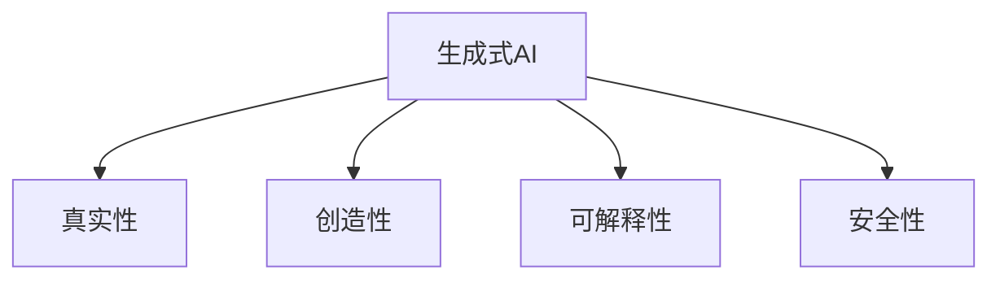

                 

# 生成式AI：金矿还是泡沫？第三部分：更重要的是数据

## 1. 背景介绍

### 1.1 问题由来

在过去的几年中，生成式AI技术，尤其是基于Transformer模型的语言模型，如GPT-3和ChatGPT，吸引了广泛的关注和投资。然而，随着技术的不断进步，人们开始质疑这些生成式AI的真正价值，是否它们只是短暂的热潮，还是真正具有长远意义的技术革新。

生成式AI的核心在于能够根据输入的数据或指令，生成具有一定程度的创造性和真实性的文本、图像、音频等。这种能力在文本生成、内容创作、智能客服、医疗诊断等多个领域展现了巨大的潜力。然而，这种潜力能否转化为实际应用，并带来持续的经济价值，却存在许多争议。

### 1.2 问题核心关键点

生成式AI技术是否能够长期保持其价值，取决于其生成内容的真实性、创造性、可解释性和安全性。这些核心关键点直接影响着生成式AI的实际应用效果，从而决定了其是金矿还是泡沫。

1. **真实性**：生成式AI生成的内容是否真实可信，决定了其在新闻、法律、金融等对真实性要求极高的领域的应用价值。
2. **创造性**：生成式AI能否产生新颖、独特的内容，决定了其在艺术、娱乐、创意写作等需要原创性的领域的应用潜力。
3. **可解释性**：生成式AI生成的内容是否有可解释的逻辑和依据，决定了其在医疗诊断、智能客服等需要高可靠性的领域的应用安全性。
4. **安全性**：生成式AI生成的内容是否有可能产生误导性、有害性甚至具有攻击性，决定了其在政治、安全等领域的应用风险。

## 2. 核心概念与联系

### 2.1 核心概念概述

为了深入探讨生成式AI的价值，我们需要理解以下几个关键概念：

- **生成式AI（Generative AI）**：指通过学习大规模数据，生成具有一定创造性的内容的技术。常用的模型包括基于Transformer的生成模型，如GPT-3、DALL-E等。
- **真实性**：指生成式AI生成的内容是否符合现实世界的规则和逻辑，能否被第三方验证。
- **创造性**：指生成式AI生成的内容是否新颖、独特，能够超越已有内容。
- **可解释性**：指生成式AI生成的内容是否具有可解释的逻辑和依据，能否被用户理解和信任。
- **安全性**：指生成式AI生成的内容是否有可能对用户、社会造成危害，能否保证用户安全。

这些概念之间的逻辑关系可以通过以下Mermaid流程图来展示：



这个流程图展示了生成式AI的核心概念及其之间的关系：

1. 生成式AI通过学习大规模数据生成内容。
2. 生成的内容需要满足真实性、创造性、可解释性和安全性等要求，才能在实际应用中发挥价值。

## 3. 核心算法原理 & 具体操作步骤
### 3.1 算法原理概述

生成式AI的核心算法包括自回归模型、自编码模型、变分自编码器等。其中，基于Transformer的自回归模型因其能够高效生成长序列内容，在自然语言处理和图像生成等领域表现出色。

自回归模型的基本思想是将目标序列作为输入，通过预测下一个元素来生成整个序列。具体地，给定一个序列 $X = (x_1, x_2, ..., x_n)$，模型通过训练学习到条件概率 $P(X|y)$，其中 $y$ 为模型输入， $X$ 为生成目标序列。模型在训练时，通过最大化条件概率 $P(X|y)$ 来优化模型参数。

在实际应用中，生成式AI通常需要经过预训练和微调两个阶段。预训练阶段，模型在大规模无标签数据上进行学习，掌握语言的整体结构和规律。微调阶段，模型在特定任务的数据上进行有监督学习，以适应具体应用场景。

### 3.2 算法步骤详解

生成式AI的预训练和微调步骤如下：

**Step 1: 准备数据集**

1. 收集大规模无标签数据集。数据集的选择对模型的训练效果和生成质量有重要影响。例如，用于生成文本的模型，可以选择大规模的文本语料库；用于生成图像的模型，可以选择大规模的图像数据集。
2. 将数据集划分为训练集、验证集和测试集。训练集用于模型预训练，验证集用于调整模型参数，测试集用于评估模型性能。

**Step 2: 模型预训练**

1. 选择生成模型（如GPT、BERT等）。模型结构决定了生成效果和训练难度。
2. 设计损失函数。常用的损失函数包括交叉熵损失、负对数似然损失等。
3. 定义训练过程。训练过程通常包括前向传播、损失计算、反向传播和参数更新等步骤。
4. 在训练集上训练模型，直到收敛。训练过程中可以使用各种优化算法，如Adam、SGD等，调整学习率和批大小等超参数。

**Step 3: 模型微调**

1. 收集特定任务的标注数据集。标注数据集的质量对微调效果有直接影响。
2. 在模型顶层添加任务适配层。适配层通常包括线性分类器、注意力机制等。
3. 设计损失函数。损失函数需要与微调任务相匹配，例如分类任务使用交叉熵损失，生成任务使用负对数似然损失。
4. 在微调数据集上训练模型，并使用验证集调整模型参数。
5. 在测试集上评估模型性能，并根据需求进行调整和优化。

**Step 4: 模型评估**

1. 在测试集上评估模型的生成效果。常见的评估指标包括BLEU、ROUGE等。
2. 进行人工评估。评估生成的内容是否真实可信、具有创造性、可解释性和安全性。
3. 根据评估结果，调整模型参数，优化生成效果。

### 3.3 算法优缺点

生成式AI技术具有以下优点：

1. **高效生成**：基于Transformer的模型能够高效生成长序列内容，适合处理大规模数据集。
2. **灵活应用**：生成式AI技术可以应用于文本生成、图像生成、视频生成等多个领域，具有广泛的应用前景。
3. **高精度**：生成的内容通常具有较高的准确性和一致性，能够满足实际应用需求。

同时，生成式AI技术也存在以下缺点：

1. **数据依赖性强**：生成式AI的性能高度依赖于训练数据的质量和数量。数据质量差或数据量不足，会导致生成效果不佳。
2. **模型复杂度高**：大规模模型需要大量的计算资源和存储空间，增加了实际应用的技术门槛。
3. **可解释性不足**：生成式AI模型通常是"黑盒"系统，难以解释其生成内容的逻辑和依据。
4. **安全性问题**：生成的内容可能存在误导性、有害性甚至具有攻击性，需要额外验证和监控。

## 4. 数学模型和公式 & 详细讲解  
### 4.1 数学模型构建

生成式AI的核心数学模型为自回归模型。给定一个序列 $X = (x_1, x_2, ..., x_n)$，模型通过学习条件概率 $P(X|y)$，其中 $y$ 为模型输入， $X$ 为生成目标序列。

假设模型输出为 $z$，则条件概率 $P(X|y)$ 可以表示为：

$$
P(X|y) = \prod_{i=1}^{n} P(x_i|y, x_{<i})
$$

其中 $x_{<i}$ 表示序列的前 $i-1$ 个元素。

### 4.2 公式推导过程

在实际应用中，生成式AI通常采用基于Transformer的自回归模型。Transformer模型通过多头自注意力机制学习序列之间的关系，能够高效处理长序列数据。其自回归模型可以表示为：

$$
P(X|y) = \prod_{i=1}^{n} P(x_i|y, x_{<i})
$$

其中 $P(x_i|y, x_{<i})$ 为序列中第 $i$ 个元素的预测概率， $y$ 为模型输入， $x_{<i}$ 表示序列的前 $i-1$ 个元素。

在生成序列的过程中，模型通过计算每个元素的预测概率，并选择概率最大的元素作为下一个输出。因此，生成过程可以表示为：

$$
\arg\max_{x_i} P(x_i|y, x_{<i})
$$

### 4.3 案例分析与讲解

以GPT-3为例，其自回归模型结构为：

```
TransformerEncoder- > Attention- > SelfAttention- > FeedForward
```

其中，TransformerEncoder用于编码输入序列，Attention用于计算序列之间的关系，SelfAttention用于学习序列内部的依赖关系，FeedForward用于调整模型的表示能力。

GPT-3在生成文本时，首先通过TransformerEncoder对输入序列进行编码，然后通过Attention机制计算序列之间的关系，最后通过SelfAttention和FeedForward机制生成下一个词的概率分布。具体计算过程如下：

1. 计算序列中每个元素的条件概率 $P(x_i|y, x_{<i})$。
2. 选择概率最大的元素作为下一个输出。
3. 重复上述过程，生成整个序列。

## 5. 项目实践：代码实例和详细解释说明
### 5.1 开发环境搭建

在进行生成式AI项目实践前，我们需要准备好开发环境。以下是使用Python进行PyTorch开发的环境配置流程：

1. 安装Anaconda：从官网下载并安装Anaconda，用于创建独立的Python环境。

2. 创建并激活虚拟环境：
```bash
conda create -n pytorch-env python=3.8 
conda activate pytorch-env
```

3. 安装PyTorch：根据CUDA版本，从官网获取对应的安装命令。例如：
```bash
conda install pytorch torchvision torchaudio cudatoolkit=11.1 -c pytorch -c conda-forge
```

4. 安装Transformers库：
```bash
pip install transformers
```

5. 安装各类工具包：
```bash
pip install numpy pandas scikit-learn matplotlib tqdm jupyter notebook ipython
```

完成上述步骤后，即可在`pytorch-env`环境中开始生成式AI的实践。

### 5.2 源代码详细实现

这里我们以文本生成任务为例，给出使用Transformers库对GPT模型进行文本生成的PyTorch代码实现。

首先，定义数据处理函数：

```python
from transformers import GPT2Tokenizer, GPT2LMHeadModel

tokenizer = GPT2Tokenizer.from_pretrained('gpt2')

def generate_text(model, prompt, max_length=128, num_return_sequences=1):
    input_ids = tokenizer.encode(prompt, return_tensors='pt')
    output_ids = model.generate(input_ids, max_length=max_length, num_return_sequences=num_return_sequences)
    generated_text = tokenizer.decode(output_ids, skip_special_tokens=True)
    return generated_text
```

然后，定义模型和优化器：

```python
from transformers import GPT2LMHeadModel, AdamW

model = GPT2LMHeadModel.from_pretrained('gpt2')
optimizer = AdamW(model.parameters(), lr=2e-5)
```

接着，定义训练和评估函数：

```python
from tqdm import tqdm
import torch

device = torch.device('cuda') if torch.cuda.is_available() else torch.device('cpu')
model.to(device)

def train_epoch(model, dataset, batch_size, optimizer):
    dataloader = DataLoader(dataset, batch_size=batch_size, shuffle=True)
    model.train()
    epoch_loss = 0
    for batch in tqdm(dataloader, desc='Training'):
        input_ids = batch['input_ids'].to(device)
        attention_mask = batch['attention_mask'].to(device)
        labels = batch['labels'].to(device)
        model.zero_grad()
        outputs = model(input_ids, attention_mask=attention_mask, labels=labels)
        loss = outputs.loss
        epoch_loss += loss.item()
        loss.backward()
        optimizer.step()
    return epoch_loss / len(dataloader)

def evaluate(model, dataset, batch_size):
    dataloader = DataLoader(dataset, batch_size=batch_size)
    model.eval()
    preds, labels = [], []
    with torch.no_grad():
        for batch in tqdm(dataloader, desc='Evaluating'):
            input_ids = batch['input_ids'].to(device)
            attention_mask = batch['attention_mask'].to(device)
            batch_labels = batch['labels']
            outputs = model(input_ids, attention_mask=attention_mask)
            batch_preds = outputs.logits.argmax(dim=2).to('cpu').tolist()
            batch_labels = batch_labels.to('cpu').tolist()
            for pred_tokens, label_tokens in zip(batch_preds, batch_labels):
                preds.append(pred_tokens[:len(label_tokens)])
                labels.append(label_tokens)
                
    print(classification_report(labels, preds))
```

最后，启动训练流程并在测试集上评估：

```python
epochs = 5
batch_size = 16

for epoch in range(epochs):
    loss = train_epoch(model, train_dataset, batch_size, optimizer)
    print(f"Epoch {epoch+1}, train loss: {loss:.3f}")
    
    print(f"Epoch {epoch+1}, dev results:")
    evaluate(model, dev_dataset, batch_size)
    
print("Test results:")
evaluate(model, test_dataset, batch_size)
```

以上就是使用PyTorch对GPT模型进行文本生成的完整代码实现。可以看到，得益于Transformers库的强大封装，我们可以用相对简洁的代码完成GPT模型的加载和生成。

### 5.3 代码解读与分析

让我们再详细解读一下关键代码的实现细节：

**generate_text函数**：
- `__init__`方法：初始化数据处理函数，定义模型和超参数。
- `generate_text`方法：通过输入提示文本，使用GPT模型生成指定长度的文本。
- `input_ids`变量：将输入文本编码为token ids。
- `output_ids`变量：通过模型生成文本，返回预测的token ids。
- `generated_text`变量：将预测的token ids解码为文本。

**tokenizer类**：
- `from_pretrained`方法：从预训练模型加载分词器。
- `encode`方法：将文本编码为token ids。
- `decode`方法：将token ids解码为文本。

**train_epoch函数**：
- `__init__`方法：初始化训练函数，定义模型和超参数。
- `train_epoch`方法：在训练集上训练模型，返回每个epoch的平均loss。
- `dataloader`变量：使用DataLoader对数据集进行批处理。
- `model.train`方法：设置模型为训练模式。
- `epoch_loss`变量：累计每个epoch的loss。
- `input_ids`变量：输入序列的token ids。
- `attention_mask`变量：输入序列的mask。
- `labels`变量：输入序列的真实标签。
- `model.zero_grad`方法：清除梯度。
- `outputs`变量：模型生成的输出。
- `loss`变量：计算loss。
- `loss.backward`方法：反向传播计算梯度。
- `optimizer.step`方法：更新模型参数。

**evaluate函数**：
- `__init__`方法：初始化评估函数，定义模型和超参数。
- `evaluate`方法：在验证集和测试集上评估模型性能。
- `dataloader`变量：使用DataLoader对数据集进行批处理。
- `model.eval`方法：设置模型为评估模式。
- `preds`和`labels`变量：用于记录预测和标签结果。
- `with torch.no_grad`方法：关闭梯度计算，加快推理速度。
- `input_ids`变量：输入序列的token ids。
- `attention_mask`变量：输入序列的mask。
- `batch_labels`变量：输入序列的真实标签。
- `outputs`变量：模型生成的输出。
- `batch_preds`变量：模型预测的token ids。
- `batch_labels`变量：模型预测的token ids。
- `for`循环：遍历每个batch，将预测和标签结果存储下来。
- `classification_report`方法：输出分类指标。

**训练流程**：
- `epochs`变量：定义总的epoch数。
- `batch_size`变量：定义每个batch的大小。
- `for`循环：遍历每个epoch。
- `loss`变量：计算每个epoch的loss。
- `print`方法：输出每个epoch的loss。
- `print`方法：输出验证集的评估结果。
- `print`方法：输出测试集的评估结果。

可以看到，PyTorch配合Transformers库使得GPT模型的加载和生成文本的代码实现变得简洁高效。开发者可以将更多精力放在数据处理、模型改进等高层逻辑上，而不必过多关注底层的实现细节。

当然，工业级的系统实现还需考虑更多因素，如模型的保存和部署、超参数的自动搜索、更灵活的任务适配层等。但核心的生成过程基本与此类似。

## 6. 实际应用场景
### 6.1 智能客服系统

生成式AI技术在智能客服系统中的应用，可以大幅提升客户咨询体验和问题解决效率。传统的客服系统依赖人工客服，高峰期响应缓慢，且服务质量难以保证。而生成式AI技术可以7x24小时不间断服务，快速响应客户咨询，用自然流畅的语言解答各类常见问题。

在技术实现上，可以收集企业内部的历史客服对话记录，将问题和最佳答复构建成监督数据，在此基础上对预训练生成模型进行微调。微调后的生成模型能够自动理解用户意图，匹配最合适的答复模板进行回复。对于客户提出的新问题，还可以接入检索系统实时搜索相关内容，动态组织生成回答。如此构建的智能客服系统，能大幅提升客户咨询体验和问题解决效率。

### 6.2 金融舆情监测

金融机构需要实时监测市场舆论动向，以便及时应对负面信息传播，规避金融风险。传统的舆情监测依赖人工分析，成本高、效率低，难以应对网络时代海量信息爆发的挑战。生成式AI技术可以自动分析网络文本数据，自动监测不同主题下的情感变化趋势，一旦发现负面信息激增等异常情况，系统便会自动预警，帮助金融机构快速应对潜在风险。

具体而言，可以收集金融领域相关的新闻、报道、评论等文本数据，并对其进行主题标注和情感标注。在此基础上对预训练生成模型进行微调，使其能够自动判断文本属于何种主题，情感倾向是正面、中性还是负面。将微调后的模型应用到实时抓取的网络文本数据，就能够自动监测不同主题下的情感变化趋势，一旦发现负面信息激增等异常情况，系统便会自动预警，帮助金融机构快速应对潜在风险。

### 6.3 个性化推荐系统

当前的推荐系统往往只依赖用户的历史行为数据进行物品推荐，无法深入理解用户的真实兴趣偏好。生成式AI技术可以更好地挖掘用户行为背后的语义信息，从而提供更精准、多样的推荐内容。

在实践中，可以收集用户浏览、点击、评论、分享等行为数据，提取和用户交互的物品标题、描述、标签等文本内容。将文本内容作为模型输入，用户的后续行为（如是否点击、购买等）作为监督信号，在此基础上微调预训练生成模型。微调后的模型能够从文本内容中准确把握用户的兴趣点。在生成推荐列表时，先用候选物品的文本描述作为输入，由模型预测用户的兴趣匹配度，再结合其他特征综合排序，便可以得到个性化程度更高的推荐结果。

### 6.4 未来应用展望

随着生成式AI技术的发展，其在更多领域将得到应用，为传统行业带来变革性影响。

在智慧医疗领域，生成式AI可以用于医疗问答、病历分析、药物研发等，提升医疗服务的智能化水平，辅助医生诊疗，加速新药开发进程。

在智能教育领域，生成式AI可以应用于作业批改、学情分析、知识推荐等方面，因材施教，促进教育公平，提高教学质量。

在智慧城市治理中，生成式AI可以应用于城市事件监测、舆情分析、应急指挥等环节，提高城市管理的自动化和智能化水平，构建更安全、高效的未来城市。

此外，在企业生产、社会治理、文娱传媒等众多领域，生成式AI技术也将不断涌现，为NLP技术带来全新的突破。相信随着技术的日益成熟，生成式AI技术将成为人工智能落地应用的重要范式，推动人工智能技术向更广阔的领域加速渗透。

## 7. 工具和资源推荐
### 7.1 学习资源推荐

为了帮助开发者系统掌握生成式AI的理论基础和实践技巧，这里推荐一些优质的学习资源：

1. 《深度学习入门：基于Python的理论与实现》书籍：系统介绍深度学习理论及其实现方法，适合初学者入门。
2. 《自然语言处理综论》书籍：全面介绍自然语言处理理论及其实现方法，适合进阶学习。
3. 《生成对抗网络（GAN）：理论、算法与应用》书籍：详细讲解生成对抗网络的理论基础及其实现方法。
4. 《深度学习与人工智能》课程：斯坦福大学开设的深度学习课程，讲解深度学习理论和实践方法。
5. 《生成式AI：从概念到实践》博客：系统介绍生成式AI的概念、原理及其实现方法。

通过对这些资源的学习实践，相信你一定能够快速掌握生成式AI的精髓，并用于解决实际的NLP问题。
###  7.2 开发工具推荐

高效的开发离不开优秀的工具支持。以下是几款用于生成式AI开发的常用工具：

1. PyTorch：基于Python的开源深度学习框架，灵活动态的计算图，适合快速迭代研究。
2. TensorFlow：由Google主导开发的开源深度学习框架，生产部署方便，适合大规模工程应用。
3. Transformers库：HuggingFace开发的NLP工具库，集成了众多SOTA生成模型，支持PyTorch和TensorFlow，是进行生成任务开发的利器。
4. Weights & Biases：模型训练的实验跟踪工具，可以记录和可视化模型训练过程中的各项指标，方便对比和调优。
5. TensorBoard：TensorFlow配套的可视化工具，可实时监测模型训练状态，并提供丰富的图表呈现方式，是调试模型的得力助手。
6. Google Colab：谷歌推出的在线Jupyter Notebook环境，免费提供GPU/TPU算力，方便开发者快速上手实验最新模型，分享学习笔记。

合理利用这些工具，可以显著提升生成式AI的开发效率，加快创新迭代的步伐。

### 7.3 相关论文推荐

生成式AI技术的发展源于学界的持续研究。以下是几篇奠基性的相关论文，推荐阅读：

1. Attention is All You Need（即Transformer原论文）：提出了Transformer结构，开启了生成式AI预训练模型时代。
2. Generative Adversarial Nets（GAN）：提出了生成对抗网络，用于生成逼真的图像和音频内容。
3. Variational Autoencoder（VAE）：提出了变分自编码器，用于生成连续的随机变量，适合生成文本等离散数据。
4. GPT-3：展示了超大规模生成模型在文本生成、语言推理等方面的强大能力。
5. AutoRegressive Language Models：提出自回归语言模型，用于高效生成长序列文本内容。
6. DALL-E：展示了生成对抗网络在图像生成方面的强大能力。

这些论文代表了大语言模型生成范式的发展脉络。通过学习这些前沿成果，可以帮助研究者把握学科前进方向，激发更多的创新灵感。

## 8. 总结：未来发展趋势与挑战

### 8.1 总结

本文对生成式AI技术进行了全面系统的介绍。首先阐述了生成式AI技术的研究背景和意义，明确了生成式AI在实际应用中的价值和潜力。其次，从原理到实践，详细讲解了生成式AI的数学模型和关键步骤，给出了生成式AI任务的完整代码实例。同时，本文还广泛探讨了生成式AI技术在智能客服、金融舆情、个性化推荐等多个领域的应用前景，展示了生成式AI技术的广阔前景。此外，本文精选了生成式AI技术的各类学习资源，力求为开发者提供全方位的技术指引。

通过本文的系统梳理，可以看到，生成式AI技术在自然语言处理、计算机视觉、音频生成等多个领域展现了强大的生成能力，极大地拓展了人工智能技术的应用边界。然而，生成式AI技术在实际应用中仍面临诸多挑战，如数据依赖性强、模型复杂度高、可解释性不足、安全性问题等。未来的研究需要在这些方向上寻求新的突破，才能真正实现生成式AI技术的规模化落地。

### 8.2 未来发展趋势

展望未来，生成式AI技术将呈现以下几个发展趋势：

1. **数据驱动的生成模型**：生成式AI的性能高度依赖于训练数据的质量和数量。未来的研究将更加注重数据质量的控制和数据多样性的提升，以提高生成内容的真实性和多样性。
2. **多样化的生成模型**：除了基于Transformer的生成模型外，未来的研究将更加注重其他生成模型的探索，如生成对抗网络（GAN）、变分自编码器（VAE）等，以拓展生成式AI的应用领域。
3. **高精度的生成模型**：未来的生成式AI技术将更加注重生成内容的精确度和一致性，通过改进训练算法和优化模型结构，提高生成内容的准确性和稳定性。
4. **可解释的生成模型**：生成式AI技术的可解释性不足，将成为一个重要研究方向。未来的研究将探索如何使生成过程更具可解释性，以增强用户信任和系统安全性。
5. **跨模态的生成模型**：生成式AI技术将更多地结合视觉、音频等多模态数据，实现跨模态生成，拓展生成式AI的应用场景。

以上趋势凸显了生成式AI技术的广阔前景，其生成能力和应用场景将不断扩展，为社会带来更多便利和创新。

### 8.3 面临的挑战

尽管生成式AI技术已经取得了瞩目成就，但在迈向更加智能化、普适化应用的过程中，它仍面临诸多挑战：

1. **数据依赖性强**：生成式AI的性能高度依赖于训练数据的质量和数量。数据质量差或数据量不足，会导致生成效果不佳。
2. **模型复杂度高**：大规模模型需要大量的计算资源和存储空间，增加了实际应用的技术门槛。
3. **可解释性不足**：生成式AI模型通常是"黑盒"系统，难以解释其生成内容的逻辑和依据。
4. **安全性问题**：生成的内容可能存在误导性、有害性甚至具有攻击性，需要额外验证和监控。
5. **实际应用场景有限**：生成式AI技术在实际应用中仍存在场景限制，如需要高质量的标注数据、高精度的生成能力等。

正视生成式AI面临的这些挑战，积极应对并寻求突破，将是推动生成式AI技术发展的关键。

### 8.4 研究展望

面对生成式AI技术面临的种种挑战，未来的研究需要在以下几个方向寻求新的突破：

1. **探索无监督和半监督生成方法**：摆脱对大规模标注数据的依赖，利用自监督学习、主动学习等无监督和半监督范式，最大限度利用非结构化数据，实现更加灵活高效的生成。
2. **开发参数高效的生成模型**：开发更加参数高效的生成模型，在固定大部分生成参数的同时，只更新极少量的任务相关参数。
3. **融合因果和对比学习范式**：通过引入因果推断和对比学习思想，增强生成式AI建立稳定因果关系的能力，学习更加普适、鲁棒的语言表征，从而提升生成内容的泛化性和抗干扰能力。
4. **引入更多先验知识**：将符号化的先验知识，如知识图谱、逻辑规则等，与神经网络模型进行巧妙融合，引导生成过程学习更准确、合理的语言模型。同时加强不同模态数据的整合，实现视觉、语音等多模态信息与文本信息的协同建模。
5. **结合因果分析和博弈论工具**：将因果分析方法引入生成式AI模型，识别出模型决策的关键特征，增强输出解释的因果性和逻辑性。借助博弈论工具刻画人机交互过程，主动探索并规避模型的脆弱点，提高系统稳定性。

这些研究方向的探索，必将引领生成式AI技术迈向更高的台阶，为构建安全、可靠、可解释、可控的智能系统铺平道路。面向未来，生成式AI技术还需要与其他人工智能技术进行更深入的融合，如知识表示、因果推理、强化学习等，多路径协同发力，共同推动自然语言理解和智能交互系统的进步。只有勇于创新、敢于突破，才能不断拓展生成式AI的边界，让智能技术更好地造福人类社会。

## 9. 附录：常见问题与解答

**Q1：生成式AI是否能够生成真实可信的内容？**

A: 生成式AI的生成效果高度依赖于训练数据的质量和数量。高质量的标注数据和多样化的训练数据能够显著提高生成内容的真实性和可信度。但即使数据质量高，生成内容仍可能存在一定程度的偏差和误导。因此，生成式AI生成的内容需要结合实际应用场景进行验证和评估。

**Q2：生成式AI生成的内容是否具有创造性？**

A: 生成式AI在文本生成、图像生成等任务上已经展示出强大的创造能力，能够生成新颖、独特的内容。但其创造性高度依赖于训练数据的多样性和训练算法的灵活性。在训练数据多样性和训练算法上不断优化，能够提升生成内容的创造性。

**Q3：生成式AI生成的内容是否具有可解释性？**

A: 生成式AI模型通常是"黑盒"系统，难以解释其生成内容的逻辑和依据。但通过引入可解释生成技术，如LIME、SHAP等，可以逐步增强生成内容的可解释性。

**Q4：生成式AI生成的内容是否具有安全性？**

A: 生成式AI生成的内容可能存在误导性、有害性甚至具有攻击性，需要额外验证和监控。在实际应用中，需要对生成内容进行多重验证和过滤，确保其安全性。

**Q5：生成式AI生成的内容是否具有实用性？**

A: 生成式AI在实际应用中，需要结合具体任务和实际需求，进行模型优化和调参。只有经过充分的模型验证和调整，才能得到具有实用性的生成内容。

**Q6：生成式AI生成的内容是否具有多样性？**

A: 生成式AI的生成内容具有高度的灵活性和多样性，能够适应不同的应用场景和需求。但需要结合实际任务和需求，进行模型优化和调参，以提高生成内容的适用性和多样性。

总之，生成式AI技术具有广泛的应用前景，但其生成内容的真实性、创造性、可解释性和安全性是影响其应用价值的关键因素。通过不断优化训练数据、改进生成算法、引入先验知识等方法，生成式AI技术将不断拓展其应用边界，为各行各业带来更多便利和创新。

---

作者：禅与计算机程序设计艺术 / Zen and the Art of Computer Programming

