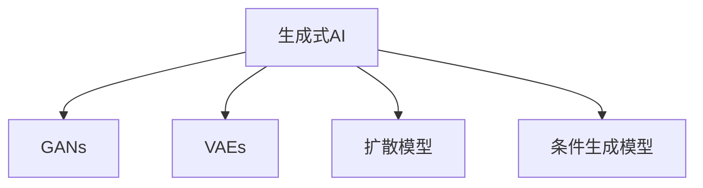

                 

# 生成式AI：金矿还是泡沫？第五部分：场景优先，数据为王

生成式人工智能（Generative AI）的崛起，为创意、设计、娱乐等多个行业带来了革命性的变革。从艺术创作、音乐作曲，到文本生成、图像合成，生成式AI以其强大的创造力和灵活性，正迅速成为各行各业争相探索的新前沿。但正如任何新兴技术一样，生成式AI的实际应用也面临诸多挑战和不确定性，其究竟是“金矿”还是“泡沫”，已成为业内外广泛关注的焦点。本文旨在深入探讨生成式AI在特定场景中的潜力和局限，剖析其数据依赖性及其对未来的影响。

## 1. 背景介绍

### 1.1 行业趋势

随着深度学习、自然语言处理和大数据技术的飞速发展，生成式AI逐步从实验室走向应用，成为AI研究的热点。其核心技术包括生成对抗网络（GANs）、变分自编码器（VAEs）、扩散模型等，具有生成真实、高质量数据的能力，逐渐在内容创作、艺术设计、商业智能等领域展现巨大潜力。

### 1.2 主要应用场景

- **内容创作**：利用生成式AI创作音乐、绘画、小说等艺术作品。
- **设计辅助**：在建筑设计、时尚设计等领域提供创意灵感和辅助设计工具。
- **娱乐应用**：在游戏、影视制作中生成虚拟角色、场景和剧情。
- **商业智能**：生成个性化推荐、广告文案等内容，优化营销策略。

## 2. 核心概念与联系

### 2.1 核心概念概述

为更好地理解生成式AI的原理和应用，本节将介绍几个核心概念：

- **生成式AI（Generative AI）**：利用机器学习模型生成新的、模拟的、或经过转换的输入数据，如文本、图像、音频等。
- **生成对抗网络（GANs）**：由生成器和判别器两个部分组成，通过对抗学习生成逼真的数据。
- **变分自编码器（VAEs）**：通过重构损失和正则化项，生成高质量的潜在变量，再解码生成目标数据。
- **扩散模型（Diffusion Models）**：利用非马尔可夫过程从噪声开始逐步恢复数据，实现高质量图像生成。
- **条件生成模型**：根据特定条件生成数据，如文本描述、标签等，提高生成数据的针对性和多样性。

这些概念之间的逻辑关系可以通过以下Mermaid流程图来展示：



这个流程图展示了一些核心概念及其之间的关系：

1. 生成式AI作为基础概念，涵盖了GANs、VAEs、扩散模型等多种具体技术。
2. GANs、VAEs和扩散模型是生成式AI的三大支柱，各有优势和适用范围。
3. 条件生成模型是生成式AI的进阶，增加了生成过程的灵活性和可控性。

这些概念共同构成了生成式AI的基本框架，使其能够在多种场景下展示其强大的生成能力。

## 3. 核心算法原理 & 具体操作步骤
### 3.1 算法原理概述

生成式AI的核心算法原理主要包括GANs、VAEs和扩散模型。这些算法通过学习数据分布，利用生成器和判别器等组件，生成逼真的新数据。

- **GANs**：生成器通过学习数据的潜在表示，生成逼真的数据；判别器则区分生成数据和真实数据。两者通过对抗学习不断优化生成数据的质量。
- **VAEs**：通过学习数据的潜在变量，生成数据的编码和解码过程，实现数据的生成和重构。
- **扩散模型**：利用非马尔可夫过程逐步去除噪声，生成高质量的图像或音频等数据。

生成式AI的应用，通常是根据具体的生成任务选择合适的算法和模型，通过训练和优化生成器，生成高质量的数据。

### 3.2 算法步骤详解

基于生成式AI的算法步骤如下：

**Step 1: 数据准备**

- 收集生成数据所需的大规模数据集，如文本、图像、音频等。
- 对数据进行预处理，包括数据清洗、归一化、标注等。
- 将数据划分为训练集、验证集和测试集，用于模型的训练和评估。

**Step 2: 模型构建**

- 选择合适的生成模型（如GANs、VAEs、扩散模型等）。
- 定义模型的架构和参数，设置损失函数和优化器。
- 初始化模型参数，准备好训练所需的计算图和数据。

**Step 3: 训练模型**

- 在训练集上对模型进行迭代训练，不断优化生成数据的质量。
- 通过前向传播和反向传播，计算损失函数并更新模型参数。
- 在验证集上监测模型的性能，及时调整模型超参数和训练策略。

**Step 4: 生成数据**

- 在测试集或新数据上应用训练好的生成模型。
- 根据指定的条件或约束，生成所需的数据。
- 对生成的数据进行后处理，如解码、去噪、优化等。

**Step 5: 模型评估**

- 通过评估指标（如均方误差、信噪比等）评估生成数据的质量。
- 对生成数据进行可视化或分析，检验其真实性和多样性。
- 根据反馈调整模型参数和训练策略，进一步提升生成数据的质量。

### 3.3 算法优缺点

生成式AI算法具有以下优点：

- 高效生成：利用训练好的模型，可以快速生成大量的高质量数据。
- 灵活多样：可以根据不同的任务和需求，灵活调整模型结构和参数。
- 应用广泛：生成式AI在内容创作、设计辅助、娱乐应用等多个领域具有广泛的应用前景。

同时，生成式AI算法也存在以下局限性：

- 数据依赖：生成式AI的性能高度依赖于训练数据的质量和多样性，缺乏高质量数据时，生成效果往往不佳。
- 模型复杂：生成式AI算法通常需要大量的计算资源和时间，训练过程复杂且耗时。
- 控制难度：生成过程存在一定的不确定性和不可控性，难以保证生成的数据完全符合预期。

### 3.4 算法应用领域

生成式AI在以下领域具有广泛的应用：

- **内容创作**：在音乐、绘画、小说等艺术创作领域，生成具有创造力的作品。
- **设计辅助**：在建筑设计、时尚设计等领域，提供创意灵感和设计辅助工具。
- **娱乐应用**：在游戏、影视制作中生成虚拟角色、场景和剧情，提升用户体验。
- **商业智能**：生成个性化推荐、广告文案等内容，优化营销策略。
- **教育**：生成教学素材、模拟实验等，辅助教学和科研。
- **医疗**：生成医学图像、虚拟手术等，辅助医疗诊断和治疗。

以上应用场景展示了生成式AI的多样性和潜力，推动了其在不同行业中的广泛应用。

## 4. 数学模型和公式 & 详细讲解 & 举例说明

### 4.1 数学模型构建

本节将使用数学语言对生成式AI的模型构建进行详细解释。

设生成数据为 $X$，模型为 $G$，生成过程为 $G(z)$，其中 $z$ 为噪声向量。

- 生成器的目标是最小化生成数据的重构损失：$L_{recon}(X,G(z))$
- 判别器的目标是最小化区分真实数据和生成数据的误差：$L_{disc}(X,G(z))$

在训练过程中，通过优化生成器和判别器的目标函数，使得生成数据的质量不断提升。

### 4.2 公式推导过程

以GANs为例，推导其生成和判别器的损失函数。

**生成器损失函数**：

$$
L_G = \mathbb{E}_{z\sim p(z)}[L_{disc}(G(z))]
$$

**判别器损失函数**：

$$
L_D = \mathbb{E}_{x\sim p(x)}[\log D(x)] + \mathbb{E}_{z\sim p(z)}[\log(1-D(G(z))))
$$

其中，$p(z)$ 为噪声分布，$p(x)$ 为真实数据分布。

在实际训练中，通过对上述损失函数进行反向传播和优化，不断调整生成器和判别器的参数，直至生成数据的质量逼近真实数据。

### 4.3 案例分析与讲解

以图像生成为例，使用GANs生成逼真的猫脸图像。

**Step 1: 数据准备**

- 收集大量的猫脸图像数据，进行预处理和标注。
- 将数据划分为训练集和测试集，用于模型训练和评估。

**Step 2: 模型构建**

- 选择GANs作为生成模型，定义生成器和判别器的架构和参数。
- 初始化模型参数，设置损失函数和优化器，如Adam、SGD等。

**Step 3: 训练模型**

- 在训练集上对模型进行迭代训练，不断优化生成数据的质量。
- 通过前向传播和反向传播，计算生成器和判别器的损失函数，并更新参数。
- 在验证集上监测模型的性能，及时调整模型超参数和训练策略。

**Step 4: 生成数据**

- 在测试集或新数据上应用训练好的生成模型。
- 根据指定的条件或约束，生成猫脸图像。
- 对生成的图像进行后处理，如解码、去噪、优化等。

**Step 5: 模型评估**

- 通过评估指标（如PSNR、SSIM等）评估生成图像的质量。
- 对生成图像进行可视化或分析，检验其真实性和多样性。
- 根据反馈调整模型参数和训练策略，进一步提升生成图像的质量。

## 5. 项目实践：代码实例和详细解释说明

### 5.1 开发环境搭建

在进行生成式AI项目实践前，需要准备好开发环境。以下是使用Python进行TensorFlow开发的环境配置流程：

1. 安装Anaconda：从官网下载并安装Anaconda，用于创建独立的Python环境。

2. 创建并激活虚拟环境：
```bash
conda create -n tf-env python=3.8 
conda activate tf-env
```

3. 安装TensorFlow：根据CUDA版本，从官网获取对应的安装命令。例如：
```bash
conda install tensorflow -c conda-forge -c pytorch -c anaconda
```

4. 安装必要的库：
```bash
pip install numpy matplotlib scipy
```

5. 安装TensorBoard：用于可视化训练过程和结果，方便调试和优化。
```bash
pip install tensorboard
```

完成上述步骤后，即可在`tf-env`环境中开始生成式AI的开发。

### 5.2 源代码详细实现

下面我们以使用GANs生成图像为例，给出完整的TensorFlow代码实现。

**Step 1: 数据准备**

```python
import tensorflow as tf
from tensorflow.keras.datasets import mnist

# 加载MNIST手写数字数据集
(x_train, y_train), (x_test, y_test) = mnist.load_data()

# 数据预处理
x_train = x_train / 255.0
x_test = x_test / 255.0
```

**Step 2: 模型构建**

```python
import tensorflow.keras as keras

# 定义生成器
def make_generator_model():
    model = keras.Sequential()
    model.add(keras.layers.Dense(256, input_shape=(100,)))
    model.add(keras.layers.BatchNormalization())
    model.add(keras.layers.LeakyReLU())
    model.add(keras.layers.Reshape((7, 7, 256)))
    assert model.output_shape == (None, 7, 7, 256)  # (batch_size, height, width, channels)

    model.add(keras.layers.Conv2DTranspose(128, (5, 5), strides=(1, 1), padding='same', use_bias=False))
    assert model.output_shape == (None, 7, 7, 128)
    model.add(keras.layers.BatchNormalization())
    model.add(keras.layers.LeakyReLU())

    model.add(keras.layers.Conv2DTranspose(64, (5, 5), strides=(2, 2), padding='same', use_bias=False))
    assert model.output_shape == (None, 14, 14, 64)
    model.add(keras.layers.BatchNormalization())
    model.add(keras.layers.LeakyReLU())

    model.add(keras.layers.Conv2DTranspose(1, (5, 5), strides=(2, 2), padding='same', use_bias=False, activation='tanh'))
    assert model.output_shape == (None, 28, 28, 1)

    return model

# 定义判别器
def make_discriminator_model():
    model = keras.Sequential()
    model.add(keras.layers.Conv2D(64, (5, 5), strides=(2, 2), padding='same', input_shape=[28, 28, 1]))
    model.add(keras.layers.LeakyReLU())
    model.add(keras.layers.Dropout(0.3))

    model.add(keras.layers.Conv2D(128, (5, 5), strides=(2, 2), padding='same'))
    model.add(keras.layers.LeakyReLU())
    model.add(keras.layers.Dropout(0.3))

    model.add(keras.layers.Flatten())
    model.add(keras.layers.Dense(1))

    return model

# 生成器和判别器
generator = make_generator_model()
discriminator = make_discriminator_model()
```

**Step 3: 训练模型**

```python
# 设置训练参数
batch_size = 32
latent_dim = 100
epochs = 100

# 生成器和判别器的损失函数
cross_entropy = keras.losses.BinaryCrossentropy(from_logits=True)

# 生成器损失函数
def generator_loss(fake_output):
    return cross_entropy(tf.ones_like(fake_output), discriminator(fake_output))

# 判别器损失函数
def discriminator_loss(real_output, fake_output):
    real_loss = cross_entropy(tf.ones_like(real_output), real_output)
    fake_loss = cross_entropy(tf.zeros_like(fake_output), fake_output)
    return real_loss + fake_loss

# 编译模型
generator_optimizer = keras.optimizers.Adam(1e-4)
discriminator_optimizer = keras.optimizers.Adam(1e-4)

generator.compile(loss=generator_loss, optimizer=generator_optimizer)
discriminator.compile(loss=discriminator_loss, optimizer=discriminator_optimizer)

# 训练模型
@tf.function
def train_step(images):
    noise = tf.random.normal([batch_size, latent_dim])

    with tf.GradientTape() as gen_tape, tf.GradientTape() as disc_tape:
        generated_images = generator(noise, training=True)

        real_output = discriminator(images, training=True)
        fake_output = discriminator(generated_images, training=True)

        gen_loss = generator_loss(fake_output)
        disc_loss = discriminator_loss(real_output, fake_output)

    gradients_of_generator = gen_tape.gradient(gen_loss, generator.trainable_variables)
    gradients_of_discriminator = disc_tape.gradient(disc_loss, discriminator.trainable_variables)

    generator_optimizer.apply_gradients(zip(gradients_of_generator, generator.trainable_variables))
    discriminator_optimizer.apply_gradients(zip(gradients_of_discriminator, discriminator.trainable_variables))

# 训练
for epoch in range(epochs):
    for image_batch in train_dataset:
        train_step(image_batch)

    # 每epoch生成图像并保存
    generated_images = generator(tf.random.normal([batch_size, latent_dim]), training=False)
    generated_images = (generated_images * 127.5) + 127.5
    generated_images = tf.reshape(generated_images, (batch_size, 28, 28, 1))
    tf.keras.preprocessing.image.save_img(f'./generated_{epoch}.png', generated_images[0], scale=False)
```

**Step 4: 生成数据**

```python
# 生成图像
noise = tf.random.normal([batch_size, latent_dim])
generated_images = generator(noise, training=False)
generated_images = (generated_images * 127.5) + 127.5
generated_images = tf.reshape(generated_images, (batch_size, 28, 28, 1))

# 可视化生成图像
import matplotlib.pyplot as plt

fig, axs = plt.subplots(4, 4, figsize=(4, 4))
axs = axs.flatten()
for i, img in enumerate(generated_images):
    axs[i].imshow(img.numpy(), cmap='gray')
    axs[i].axis('off')
plt.show()
```

### 5.3 代码解读与分析

让我们再详细解读一下关键代码的实现细节：

**生成器和判别器定义**：
- 生成器（make_generator_model）：包括Dense层、BatchNormalization层、LeakyReLU层、Conv2DTranspose层等，用于生成图像。
- 判别器（make_discriminator_model）：包括Conv2D层、LeakyReLU层、Dropout层、Flatten层、Dense层等，用于判别图像真伪。

**损失函数定义**：
- 生成器损失函数（generator_loss）：使用二元交叉熵损失函数，计算生成图像在判别器下的伪正类损失。
- 判别器损失函数（discriminator_loss）：分别计算真实图像和生成图像在判别器下的损失，并取平均。

**模型训练**：
- 使用Adam优化器编译生成器和判别器模型。
- 定义训练步骤（train_step），将输入图像输入判别器，计算生成器和判别器的损失，反向传播更新模型参数。
- 每epoch生成并保存一批图像，可视化生成结果。

以上代码实现了使用GANs生成逼真图像的过程，展示了生成式AI在图像生成任务中的应用。

## 6. 实际应用场景
### 6.1 内容创作

生成式AI在内容创作领域的应用最为广泛，特别是在文本生成、音乐作曲、图像绘画等方面。

- **文本生成**：如小说、诗歌、新闻报道等的创作，可以通过生成式AI生成大量原创内容，提升创作效率。
- **音乐作曲**：生成式AI可以创作新的音乐曲目，甚至在演奏风格、节奏等方面进行创新。
- **图像绘画**：利用生成式AI创作各种风格和主题的绘画作品，为艺术创作提供新的灵感。

### 6.2 设计辅助

生成式AI在建筑设计、时尚设计等领域也有广泛应用，提供创意灵感和辅助设计工具。

- **建筑设计**：生成建筑设计方案，提供多样化的设计选项，帮助建筑师快速决策。
- **时尚设计**：生成服装、配饰等设计图，提升设计师的设计效率和创新能力。
- **室内设计**：生成室内布局和装饰方案，帮助设计师快速呈现设计理念。

### 6.3 娱乐应用

在游戏、影视制作等领域，生成式AI可以生成虚拟角色、场景和剧情，提升用户体验和创作效率。

- **游戏开发**：生成虚拟角色、虚拟世界等游戏元素，增强游戏互动性和可玩性。
- **影视制作**：生成虚拟演员、虚拟场景等，丰富影视作品的制作流程。
- **动画制作**：生成动画角色的动作、表情等，提高动画制作的效率和质量。

### 6.4 商业智能

生成式AI在商业智能领域也有重要应用，如生成个性化推荐、广告文案等内容。

- **个性化推荐**：根据用户历史行为和偏好，生成个性化推荐列表，提升用户体验。
- **广告文案**：生成多样化的广告文案，提高广告点击率和转化率。
- **市场分析**：生成市场趋势报告，提供数据分析和预测支持。

## 7. 工具和资源推荐
### 7.1 学习资源推荐

为了帮助开发者系统掌握生成式AI的理论基础和实践技巧，这里推荐一些优质的学习资源：

1. **《Generative AI》系列博文**：由生成式AI领域专家撰写，深入浅出地介绍了生成对抗网络、变分自编码器、扩散模型等前沿技术。
2. **Coursera《深度学习专项课程》**：由斯坦福大学开设，涵盖深度学习的基本概念和生成式AI的多种应用，适合初学者和进阶者。
3. **《Generative AI: Unsupervised Learning and Beyond》书籍**：深入探讨生成式AI的最新研究成果，涵盖生成对抗网络、变分自编码器、扩散模型等多种生成技术。
4. **OpenAI Blog**：提供大量生成式AI的案例和应用，涵盖文本生成、图像生成、音频生成等多个方向，适合技术实践和灵感启发。
5. **arXiv预印本**：获取生成式AI的最新研究论文和代码实现，了解最新的科研进展和技术趋势。

通过对这些资源的学习实践，相信你一定能够快速掌握生成式AI的精髓，并用于解决实际的生成任务。

### 7.2 开发工具推荐

高效的开发离不开优秀的工具支持。以下是几款用于生成式AI开发的常用工具：

1. **TensorFlow**：由Google主导开发的开源深度学习框架，生产部署方便，适合大规模工程应用。
2. **PyTorch**：Facebook开发的开源深度学习框架，灵活动态的计算图，适合快速迭代研究。
3. **T5**：Google开发的通用文本生成模型，支持多种生成任务，适合快速上手应用。
4. **Keras**：Google开发的高级神经网络API，使用简洁的API快速搭建模型，适合初学者和实践者。
5. **Weights & Biases**：模型训练的实验跟踪工具，可以记录和可视化模型训练过程中的各项指标，方便对比和调优。
6. **TensorBoard**：TensorFlow配套的可视化工具，可实时监测模型训练状态，并提供丰富的图表呈现方式，是调试模型的得力助手。

合理利用这些工具，可以显著提升生成式AI的开发效率，加快创新迭代的步伐。

### 7.3 相关论文推荐

生成式AI的发展源于学界的持续研究。以下是几篇奠基性的相关论文，推荐阅读：

1. **Generative Adversarial Nets**（Goodfellow等，2014）：首次提出GANs，奠定了生成式AI的基础。
2. **Improved Techniques for Training GANs**（Salimans等，2016）：提出WGANs和WGAN-GP，提高了GANs的稳定性和生成质量。
3. **A Tutorial on Variational Autoencoders**（Kingma等，2014）：详细介绍VAEs的基本原理和实现细节。
4. **Denoising Diffusion Probabilistic Models**（Sohl-Dickstein等，2021）：提出扩散模型，开创了生成式AI的新方向。
5. **Attention is All You Need**（Vaswani等，2017）：提出Transformer模型，为生成式AI提供了新的结构和工具。
6. **Hierarchical Generative Adversarial Networks**（Mescheder等，2019）：提出HGANs，提高了生成式AI的生成质量和多样性。

这些论文代表了大规模生成式AI的发展脉络。通过学习这些前沿成果，可以帮助研究者把握学科前进方向，激发更多的创新灵感。

## 8. 总结：未来发展趋势与挑战

### 8.1 总结

本文对生成式AI的基本原理、算法实现和实际应用进行了全面系统的介绍。首先阐述了生成式AI的行业趋势和主要应用场景，明确了其广泛的应用潜力和市场需求。其次，从生成对抗网络、变分自编码器和扩散模型等核心算法入手，详细讲解了生成式AI的数学模型和具体操作步骤。同时，本文还结合具体的TensorFlow代码实例，展示了生成式AI在图像生成任务中的应用。

通过本文的系统梳理，可以看到，生成式AI正在成为AI研究的新前沿，其多样性和创新性为多个行业带来了革命性的变革。生成式AI在内容创作、设计辅助、娱乐应用、商业智能等多个领域展示了其强大的生成能力，推动了NLP、图形学、视觉艺术等多学科的深度融合。但同时也需要注意，生成式AI面临诸多挑战，如数据依赖、模型复杂、控制难度等问题，需要进一步探索解决。

### 8.2 未来发展趋势

展望未来，生成式AI的发展将呈现以下几个趋势：

1. **多模态生成**：将文本、图像、音频等多种数据进行融合，生成更加丰富和多样化的内容。
2. **跨领域生成**：生成式AI将进一步突破领域界限，实现跨学科、跨领域的生成应用。
3. **个性化生成**：根据用户个性化需求，生成定制化的内容，提升用户体验和满意度。
4. **实时生成**：利用硬件加速和分布式计算，实现实时生成高质量的内容，提升响应速度和效率。
5. **元生成**：生成式AI将与知识图谱、规则库等结合，实现更智能、更精准的生成。

以上趋势凸显了生成式AI的多样性和潜力，推动了其在更多行业中的广泛应用。

### 8.3 面临的挑战

尽管生成式AI已经取得了瞩目成就，但在迈向更加智能化、普适化应用的过程中，仍面临诸多挑战：

1. **数据依赖**：生成式AI的性能高度依赖于训练数据的质量和多样性，缺乏高质量数据时，生成效果往往不佳。
2. **模型复杂**：生成式AI算法通常需要大量的计算资源和时间，训练过程复杂且耗时。
3. **控制难度**：生成过程存在一定的不确定性和不可控性，难以保证生成的数据完全符合预期。
4. **可解释性**：生成式AI模型通常缺乏可解释性，难以理解其内部工作机制和决策逻辑。
5. **安全性**：生成式AI可能学习到有害的偏见和信息，生成误导性、歧视性的输出，给实际应用带来安全隐患。

面对这些挑战，需要进一步探索解决，推动生成式AI技术的成熟和普及。

### 8.4 研究展望

未来的研究需要在以下几个方面寻求新的突破：

1. **数据增强**：利用数据增强技术，提高生成式AI的泛化能力和鲁棒性。
2. **模型压缩**：采用模型压缩技术，提高生成式AI的推理速度和资源利用率。
3. **可解释性增强**：开发可解释性增强技术，提升生成式AI的透明度和可信度。
4. **安全与伦理**：建立安全与伦理约束机制，保障生成式AI的输出质量和安全性。
5. **多模态融合**：实现文本、图像、音频等多模态数据的融合，提升生成式AI的生成能力和应用范围。
6. **元生成技术**：结合知识图谱、规则库等，实现更智能、更精准的生成。

这些研究方向的探索，必将引领生成式AI技术迈向更高的台阶，为构建安全、可靠、可解释、可控的智能系统铺平道路。面向未来，生成式AI需要与其他人工智能技术进行更深入的融合，如知识表示、因果推理、强化学习等，多路径协同发力，共同推动自然语言理解和智能交互系统的进步。只有勇于创新、敢于突破，才能不断拓展生成式AI的边界，让智能技术更好地造福人类社会。

## 9. 附录：常见问题与解答

**Q1: 生成式AI生成的内容与真实内容有哪些区别？**

A: 生成式AI生成的内容与真实内容存在一定区别，主要体现在以下几个方面：
1. **真实性**：生成式AI生成的内容可能包含虚构、夸张或错误的信息。
2. **多样性**：生成式AI生成的内容往往具有高度的多样性和创造性，可能包含新奇、意外或不常见的元素。
3. **一致性**：生成式AI生成的内容可能在风格、语调等方面与真实内容有所不同。

**Q2: 如何提升生成式AI的生成质量？**

A: 提升生成式AI的生成质量，可以从以下几个方面入手：
1. **数据质量**：选择高质量、多样化的训练数据，提高模型的泛化能力。
2. **模型复杂度**：使用更复杂的模型结构，如Transformer、VAEs等，提升生成效果。
3. **训练策略**：采用对抗训练、数据增强等策略，提高模型的鲁棒性和泛化性。
4. **后处理**：对生成的内容进行后处理，如去噪、修复、优化等，提高生成内容的真实性和质量。

**Q3: 生成式AI在内容创作中如何保护版权？**

A: 生成式AI在内容创作中保护版权的方法包括：
1. **明确标注**：对生成的内容进行明确标注，标明其来源和生成方式。
2. **使用公开数据**：选择已公开的数据集进行训练和生成，避免侵犯版权。
3. **尊重版权法**：在使用生成内容时，遵守版权法，确保不侵犯他人知识产权。

**Q4: 生成式AI在医疗领域的应用有哪些？**

A: 生成式AI在医疗领域的应用包括：
1. **医学图像生成**：生成医学图像，如X光片、CT扫描等，辅助医生诊断和治疗。
2. **虚拟手术**：生成虚拟手术场景，帮助医生进行模拟手术练习和教学。
3. **个性化治疗方案**：根据患者数据，生成个性化的治疗方案和药物推荐，提升治疗效果。

**Q5: 生成式AI在教育领域的应用有哪些？**

A: 生成式AI在教育领域的应用包括：
1. **教学素材生成**：生成教学PPT、视频、文章等内容，丰富教学资源。
2. **模拟实验**：生成虚拟实验环境，帮助学生进行实验操作和安全练习。
3. **个性化学习**：根据学生的学习情况和兴趣，生成个性化的学习内容和推荐，提升学习效果。

通过本文的系统梳理，可以看到，生成式AI在内容创作、设计辅助、娱乐应用、商业智能等多个领域展示了其强大的生成能力，推动了NLP、图形学、视觉艺术等多学科的深度融合。但同时也需要注意，生成式AI面临诸多挑战，如数据依赖、模型复杂、控制难度等问题，需要进一步探索解决。只有勇于创新、敢于突破，才能不断拓展生成式AI的边界，让智能技术更好地造福人类社会。

