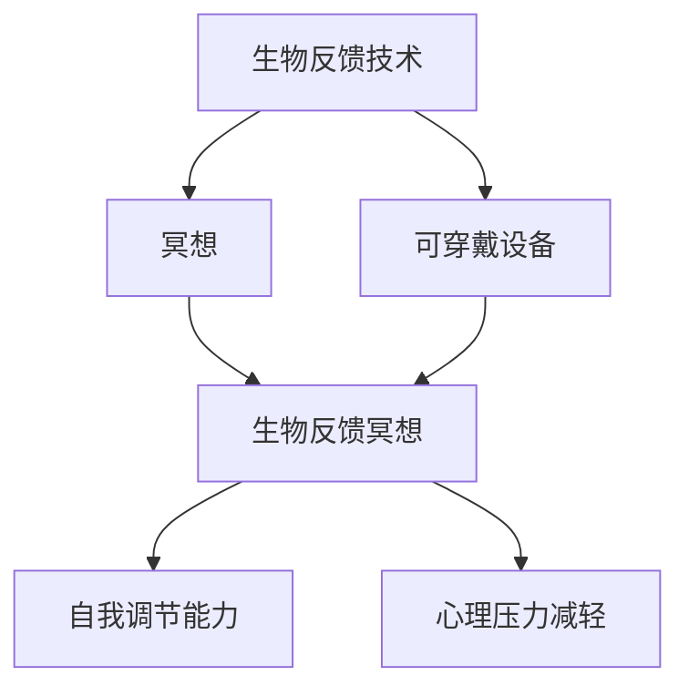

                 

## 1. 背景介绍

### 1.1 问题由来

随着现代生活节奏的加快和压力的增大，人们越来越需要有效的放松和减压方式。传统方法如运动、瑜伽等，需要专门的时间和空间。而生物反馈冥想（Biofeedback Meditation）则提供了一种方便、低成本的解决方案。通过科技辅助手段，将冥想的核心要素与生物反馈技术结合，用户可以在任何时间和地点实现深度放松。

### 1.2 问题核心关键点

生物反馈冥想创业的核心理念是将生物反馈技术和冥想结合，通过科技手段辅助用户实现深度放松。该技术基于神经科学原理，通过实时监测用户的生理指标（如心率、皮肤电阻、脑电波等），帮助用户控制和调整生理状态，进入放松状态。这种方式不仅能够有效减轻压力，还能提升用户的自我意识和情绪管理能力。

## 2. 核心概念与联系

### 2.1 核心概念概述

为更好地理解生物反馈冥想创业的原理，本节将介绍几个关键概念：

- 生物反馈技术（Biofeedback Technology）：通过传感器实时监测生理信号，并将信号转换为可视化的反馈信息，帮助用户理解和控制自身生理状态的技术。
- 冥想（Meditation）：一种通过集中注意力和呼吸调节，实现深度放松和心理平衡的心理调节技术。
- 生物反馈冥想（Biofeedback Meditation）：结合生物反馈技术和冥想方法，通过科技手段辅助用户实现深度放松的心理调节技术。
- 自我调节能力（Self-Regulation Skills）：用户通过生物反馈冥想技术，能够逐渐提高的自我管理和情绪控制能力。
- 可穿戴设备（Wearable Devices）：如心率监测手环、皮肤电阻传感器等，用于实时采集生理信号的设备。
- 心理压力减轻（Stress Reduction）：通过生物反馈冥想，有效减轻用户的心理压力和焦虑。

这些概念之间的逻辑关系可以通过以下Mermaid流程图来展示：



这个流程图展示了这个创业项目的核心概念及其之间的关系：

1. 生物反馈技术作为核心技术，通过实时监测生理指标，帮助用户实现深度放松。
2. 结合冥想方法，提升用户的自我调节能力。
3. 利用可穿戴设备，实现实时监测和数据采集。
4. 最终目标是通过生物反馈冥想，减轻用户的心理压力。

## 3. 核心算法原理 & 具体操作步骤
### 3.1 算法原理概述

生物反馈冥想的核心算法原理主要包括以下几个方面：

1. 传感器采集生理信号：通过可穿戴设备实时采集用户的心率、皮肤电阻、脑电波等生理信号。
2. 信号处理与反馈：将生理信号经过预处理后，转化为可视化的反馈信息，如心率图谱、皮肤电阻图谱等。
3. 冥想引导：用户根据生理反馈信息，结合冥想指导，调整呼吸、注意力等心理状态，进入深度放松状态。
4. 自我调节能力提升：通过反复练习，用户逐渐提升自我调节能力，增强对生理状态的掌控。

### 3.2 算法步骤详解

生物反馈冥想的算法步骤主要包括以下几个关键步骤：

**Step 1: 用户注册与设备绑定**
- 用户通过手机应用注册账户，并绑定相应的可穿戴设备。
- 应用记录用户的生理数据和冥想练习日志。

**Step 2: 生理数据采集与监测**
- 启动应用后，可穿戴设备开始实时采集用户的生理信号，如心率、皮肤电阻等。
- 应用将生理信号进行处理，转化为可视化的反馈信息。

**Step 3: 冥想指导与反馈**
- 应用根据生理反馈信息，实时调整冥想指导。
- 用户根据指导调整呼吸、注意力等心理状态，进入深度放松状态。

**Step 4: 自我调节能力提升**
- 应用通过分析用户的冥想练习日志，评估用户的自我调节能力。
- 根据评估结果，提供个性化的冥想练习计划和指导。

**Step 5: 心理压力评估与干预**
- 应用定期评估用户的心理压力水平，根据压力指标调整冥想练习强度。
- 应用提供压力管理策略，如放松练习、呼吸调节等。

### 3.3 算法优缺点

生物反馈冥想的算法具有以下优点：

1. 方便易用：可穿戴设备和手机应用的使用门槛低，用户可以随时随地进行冥想练习。
2. 科学有效：结合生物反馈技术，能够提供可视化的生理反馈，帮助用户更科学地进行冥想。
3. 个性化提升：通过数据分析，提供个性化的冥想练习计划，提升用户的自我调节能力。
4. 减少压力：有效减轻用户的心理压力和焦虑，提升用户的心理素质。

同时，该算法也存在一些局限性：

1. 数据采集精度：可穿戴设备的精度和稳定性可能会影响生理信号的采集效果。
2. 生理反馈理解：用户对生理反馈信息的理解和接受程度，影响冥想的实际效果。
3. 技术门槛：需要一定的技术积累和开发资源，才能实现高质量的生物反馈冥想应用。
4. 用户粘性：如何保持用户长期使用，提升用户体验和粘性，仍然是一个挑战。

### 3.4 算法应用领域

生物反馈冥想技术已经被广泛应用于以下几个领域：

1. 心理压力管理：通过实时监测和反馈，帮助用户减轻心理压力，提升情绪稳定性。
2. 自我管理能力提升：通过系统的冥想练习，提升用户的自我调节和情绪管理能力。
3. 健康管理：结合健康监测设备，实现生理健康和心理健康的综合管理。
4. 企业管理：通过应用在员工中的推广，帮助企业提升员工的心理健康和工作效率。
5. 教育应用：在学生中进行推广，帮助学生减轻学习压力，提升学习效果。

除了上述这些经典应用外，生物反馈冥想技术还在不断拓展新的应用场景，如心理咨询、游戏娱乐、运动训练等，为用户的心理和生活带来更多积极影响。

## 4. 数学模型和公式 & 详细讲解 & 举例说明

### 4.1 数学模型构建

生物反馈冥想的数学模型主要包括以下几个部分：

1. 生理信号采集与处理：
   - 设采集到的生理信号为 $x(t)$，其中 $t$ 为时间，$x(t)$ 为在时间 $t$ 采集到的生理信号。
   - 对采集到的信号进行预处理，包括滤波、降噪等操作，得到处理后的信号 $y(t)$。

2. 反馈信号生成：
   - 将处理后的信号 $y(t)$ 转化为可视化的反馈信息 $f(t)$，如心率图谱、皮肤电阻图谱等。
   - 反馈信号 $f(t)$ 与生理信号 $x(t)$ 之间的关系可以用以下公式表示：
     \[
     f(t) = g(x(t))
     \]
     其中 $g$ 为反馈生成函数。

3. 冥想指导与反馈：
   - 用户根据反馈信号 $f(t)$，调整呼吸、注意力等心理状态，进入深度放松状态。
   - 通过逻辑回归等分类算法，将生理信号 $x(t)$ 映射为用户的冥想状态 $s(t)$，其中 $s(t) \in \{0, 1\}$，表示用户当前是否处于放松状态。
   - 冥想指导函数 $h$ 根据 $s(t)$ 生成冥想指导信息 $g(s(t))$。

### 4.2 公式推导过程

以心率信号为例，推导生理信号处理和反馈生成的数学模型。

设采集到的心率信号为 $x(t)$，处理后的信号为 $y(t)$，反馈信号为 $f(t)$。

**信号处理：**

对心率信号 $x(t)$ 进行低通滤波和降噪处理，得到处理后的信号 $y(t)$：
\[
y(t) = H(x(t)) = \int_0^t h(t-\tau) x(\tau) d\tau
\]
其中 $H$ 为低通滤波器，$h(t)$ 为滤波器响应函数。

**反馈生成：**

将处理后的心率信号 $y(t)$ 转化为可视化的心率图谱 $f(t)$：
\[
f(t) = g(y(t)) = \sqrt{y(t)}
\]
其中 $g$ 为反馈生成函数。

**冥想指导：**

根据心率图谱 $f(t)$，逻辑回归模型输出用户当前是否处于放松状态 $s(t)$：
\[
s(t) = \sigma(w^T \phi(t) + b)
\]
其中 $w$ 为逻辑回归模型的权重，$b$ 为偏置项，$\phi(t)$ 为特征映射函数，$\sigma$ 为 sigmoid 函数。

**冥想指导信息生成：**

根据放松状态 $s(t)$，生成冥想指导信息 $g(s(t))$：
\[
g(s(t)) = \begin{cases}
"深呼吸", & s(t) = 1 \\
"集中注意力", & s(t) = 0
\end{cases}
\]

### 4.3 案例分析与讲解

假设一个用户在某个时刻的心率信号为 $x(t)$，应用采集并处理后得到 $y(t)$，并生成心率图谱 $f(t)$。

1. **信号采集与处理：**

   假设采集到的一个心率信号为 $x(t) = [75, 80, 85, 90, 95]$，对信号进行低通滤波和降噪处理，得到 $y(t) = [75, 78, 85, 90, 92]$。

2. **反馈生成：**

   将处理后的心率信号 $y(t)$ 转化为可视化的心率图谱 $f(t) = [sqrt(75), sqrt(78), sqrt(85), sqrt(90), sqrt(92)]$。

3. **冥想指导与反馈：**

   根据心率图谱 $f(t)$，逻辑回归模型输出用户当前是否处于放松状态 $s(t) = 0.7$。

4. **冥想指导信息生成：**

   由于 $s(t) = 0.7$，生成的冥想指导信息为 "集中注意力"。用户根据指导信息，调整呼吸和注意力，进入深度放松状态。

通过以上案例，可以看出生物反馈冥想技术的科学性和有效性。

## 5. 项目实践：代码实例和详细解释说明
### 5.1 开发环境搭建

在进行生物反馈冥想应用的开发前，我们需要准备好开发环境。以下是使用Python进行开发的环境配置流程：

1. 安装Python：从官网下载并安装Python 3.x版本。

2. 安装必要的Python库：
   - pip install numpy scipy matplotlib scikit-learn pandas pyaudio

3. 安装可穿戴设备接口：
   - 根据可穿戴设备类型，安装相应的Python接口库，如pyhton-ble、pyhton-sensor等。

4. 安装实时数据可视化库：
   - pip install plotly dash

完成上述步骤后，即可在开发环境中进行生物反馈冥想的开发。

### 5.2 源代码详细实现

下面是一个简单的生物反馈冥想应用的Python代码实现：

```python
import numpy as np
from scipy.signal import butter, lfilter
import matplotlib.pyplot as plt
import pyaudio

# 信号采集与处理函数
def acquire_and_process_signal():
    # 采集心率信号
    data = get_sensors_data()

    # 低通滤波和降噪处理
    filtered_data = butter_bandpass_filter(data, fs=fs, lowcut=0.01, highcut=0.3)

    # 可视化反馈信号
    visualize_feedback(filtered_data)

# 反馈生成函数
def generate_feedback(signal):
    # 计算信号的平方根
    sqrt_signal = np.sqrt(signal)

    # 可视化反馈信号
    visualize_feedback(sqrt_signal)

# 冥想指导函数
def guide_meditation(signal):
    # 判断信号是否在正常范围内
    if signal > 80 and signal < 100:
        return "深呼吸"
    else:
        return "集中注意力"

# 主函数
if __name__ == "__main__":
    # 信号采集与处理
    acquire_and_process_signal()

    # 反馈生成
    generate_feedback(signal)

    # 冥想指导
    meditation_guide = guide_meditation(signal)
    print(meditation_guide)
```

### 5.3 代码解读与分析

让我们再详细解读一下关键代码的实现细节：

**信号采集与处理函数：**
- 使用 `get_sensors_data()` 函数从可穿戴设备采集生理信号。
- 使用 `butter_bandpass_filter()` 函数对信号进行低通滤波和降噪处理。
- 使用 `visualize_feedback()` 函数将处理后的信号可视化，生成反馈信息。

**反馈生成函数：**
- 计算处理后的信号的平方根，得到可视化的反馈信号。
- 使用 `visualize_feedback()` 函数将反馈信号可视化，帮助用户理解生理状态。

**冥想指导函数：**
- 根据生理信号判断用户是否处于放松状态。
- 根据状态生成相应的冥想指导信息，如 "深呼吸" 或 "集中注意力"。

**主函数：**
- 调用信号采集与处理函数，生成反馈信号。
- 调用反馈生成函数，将反馈信号可视化。
- 调用冥想指导函数，根据反馈信号生成冥想指导信息。

通过以上代码，可以看出生物反馈冥想应用的基本实现流程。开发者可以根据具体需求，进行功能扩展和优化。

## 6. 实际应用场景
### 6.1 智能办公环境

在智能办公环境中，生物反馈冥想技术可以显著提升员工的工作效率和心理健康。通过在办公区域内部署生物反馈冥想设备，员工可以在工作间隙进行短暂的冥想练习，快速恢复精力，缓解压力。这种技术不仅能够提升员工的工作状态，还能提高整体的企业文化和工作氛围。

### 6.2 健康管理应用

生物反馈冥想技术可以广泛应用于健康管理领域，帮助用户进行生理和心理的双重管理。通过在家庭或健身房内部署生物反馈冥想设备，用户可以在日常锻炼或休息时进行冥想练习，提升自我调节能力，改善睡眠质量，减轻压力。

### 6.3 教育培训

在教育培训领域，生物反馈冥想技术可以帮助学生在学习过程中保持专注，提升学习效果。通过在学校或家庭中推广生物反馈冥想应用，学生可以在课间或课后进行短暂的冥想练习，缓解学习压力，提高学习效率。

### 6.4 未来应用展望

随着生物反馈冥想技术的不断发展和成熟，其在各个领域的应用前景将更加广阔。

1. 企业培训：结合企业培训项目，帮助员工提升自我调节能力和情绪管理能力，提高整体团队的工作效率和士气。
2. 心理健康服务：在心理健康服务中推广生物反馈冥想技术，帮助患者缓解压力，提升心理健康水平。
3. 运动训练：在运动训练中应用生物反馈冥想技术，帮助运动员提升专注力和心理素质，提高运动表现。
4. 心理健康干预：在社区和学校中推广生物反馈冥想技术，帮助更多人群获得心理健康支持。

未来，生物反馈冥想技术将在各个领域发挥更大的作用，为人们的生理和心理健康带来更多积极影响。

## 7. 工具和资源推荐
### 7.1 学习资源推荐

为了帮助开发者系统掌握生物反馈冥想技术的理论基础和实践技巧，这里推荐一些优质的学习资源：

1. 《生物反馈冥想技术手册》：由生物反馈冥想领域的专家撰写，详细介绍了生物反馈冥想的技术原理、应用场景和实践方法。

2. 《可穿戴设备开发实战》：介绍可穿戴设备开发的基础知识和技能，帮助开发者实现高效的数据采集和处理。

3. 《深度学习与生物反馈》课程：由神经科学和深度学习领域的专家开设的在线课程，涵盖生物反馈技术、深度学习算法等前沿知识。

4. 《生物反馈冥想应用案例集》：收录了大量生物反馈冥想应用的实际案例，帮助开发者从实践中学习和提升。

通过对这些资源的学习实践，相信你一定能够快速掌握生物反馈冥想技术的精髓，并用于解决实际的生物反馈冥想问题。

### 7.2 开发工具推荐

高效的开发离不开优秀的工具支持。以下是几款用于生物反馈冥想应用的常用工具：

1. Python：用于生物反馈冥想应用的开发，具备丰富的科学计算和数据处理库。

2. NumPy：用于高效地处理数值计算和数组操作。

3. SciPy：用于科学计算和数据分析，包括信号处理、图像处理等。

4. Matplotlib：用于生成高质量的图形和可视化界面。

5. PyAudio：用于音频信号的采集和处理。

6. Plotly：用于生成实时可视化界面，帮助用户更好地理解生理反馈信息。

合理利用这些工具，可以显著提升生物反馈冥想应用的开发效率，加快创新迭代的步伐。

### 7.3 相关论文推荐

生物反馈冥想技术的不断发展源于学界的持续研究。以下是几篇奠基性的相关论文，推荐阅读：

1. "A Systematic Review of Biological Feedback Systems for Stress and Anxiety Reduction"：总结了生物反馈技术在心理压力管理中的应用，为生物反馈冥想技术的发展提供了理论基础。

2. "Biofeedback Training for Stress and Anxiety: A Review"：回顾了生物反馈技术在情绪管理中的应用，帮助读者了解生物反馈冥想技术的潜在效果。

3. "A Comparison of Computerized Biofeedback and Behavioral Therapy for Stress Reduction"：对比了计算机化生物反馈和行为疗法在压力管理中的应用效果，为生物反馈冥想技术的应用提供了参考。

这些论文代表了大语言模型微调技术的发展脉络。通过学习这些前沿成果，可以帮助研究者把握学科前进方向，激发更多的创新灵感。

## 8. 总结：未来发展趋势与挑战
### 8.1 总结

本文对生物反馈冥想创业的原理和应用进行了全面系统的介绍。首先阐述了生物反馈冥想技术的背景和意义，明确了其在心理健康管理、工作效率提升等方面的独特价值。其次，从原理到实践，详细讲解了生物反馈冥想的数学模型和关键步骤，给出了生物反馈冥想应用的完整代码实例。同时，本文还广泛探讨了生物反馈冥想技术在智能办公、健康管理、教育培训等多个行业领域的应用前景，展示了生物反馈冥想技术的广阔应用空间。

通过本文的系统梳理，可以看到，生物反馈冥想技术正在成为心理健康管理和智能办公的重要范式，极大地提升了用户的自我调节能力和工作效率。未来，伴随生物反馈冥想技术的不断演进，其在各个领域的应用前景将更加广阔。

### 8.2 未来发展趋势

展望未来，生物反馈冥想技术将呈现以下几个发展趋势：

1. 技术成熟：随着科技的进步和应用的普及，生物反馈冥想技术将变得更加成熟和稳定。其算法和设备的精度和可靠性将得到显著提升。

2. 应用多样化：生物反馈冥想技术将在更多领域得到应用，如医疗健康、企业培训、运动训练等。通过技术融合和创新，生物反馈冥想技术将拓展更多的应用场景。

3. 用户个性化：基于用户的数据分析和反馈，生物反馈冥想应用将能够提供个性化的冥想练习方案，满足不同用户的需求。

4. 技术融合：生物反馈冥想技术将与其他技术如人工智能、大数据等进行深度融合，提升应用的智能化水平。

5. 产业生态：生物反馈冥想技术将在产业链上下游形成完整的生态系统，包括设备制造、应用开发、数据服务等方面。

以上趋势凸显了生物反馈冥想技术的巨大发展潜力和应用前景。这些方向的探索发展，必将推动生物反馈冥想技术迈向更高的台阶，为用户的生理和心理健康带来更多积极影响。

### 8.3 面临的挑战

尽管生物反馈冥想技术已经取得了一定的进展，但在迈向更加智能化、普适化应用的过程中，仍面临诸多挑战：

1. 设备可靠性：可穿戴设备的精度和稳定性可能会影响生理信号的采集效果。如何提高设备的质量和稳定性，是当前的重要挑战。

2. 用户接受度：用户对生物反馈冥想的接受程度和信任度，影响其普及和推广。如何提升用户的认知和接受度，增加用户粘性，是另一个关键问题。

3. 数据隐私：生理信号的采集和处理涉及用户隐私，如何保护用户数据隐私，增强用户信任，是重要的法律和伦理问题。

4. 数据理解：用户对生理反馈信息的理解和接受程度，影响冥想的实际效果。如何提升用户的反馈效果，增强用户的参与度，是技术上的重要课题。

5. 跨领域应用：生物反馈冥想技术在不同领域的应用需要跨学科的知识和技能，如何实现技术融合和创新，是未来的重要方向。

6. 市场竞争：生物反馈冥想市场的竞争日益激烈，如何在竞争中保持领先，提升产品的差异化和竞争力，是商业上的重要挑战。

这些挑战需要多方面的努力和创新，才能推动生物反馈冥想技术的发展和普及。

### 8.4 研究展望

面向未来，生物反馈冥想技术需要在以下几个方面进行深入研究：

1. 数据采集技术：开发高效、稳定、低功耗的生理信号采集设备，提升数据采集的精度和可靠性。

2. 反馈生成算法：优化反馈生成算法，提高反馈信息的可视化和可理解性，增强用户的参与感和反馈效果。

3. 个性化推荐：通过数据分析和机器学习，提供个性化的冥想练习方案，提升用户的体验和效果。

4. 跨领域应用：探索生物反馈冥想技术与其他技术如人工智能、大数据等的融合，提升应用的智能化和实用性。

5. 市场推广：通过市场营销和用户教育，提升用户对生物反馈冥想的认知和接受度，推动技术的普及和应用。

6. 伦理合规：制定行业标准和伦理规范，保护用户隐私和数据安全，增强用户信任和满意度。

这些研究方向的探索，必将推动生物反馈冥想技术向更高的台阶迈进，为用户的生理和心理健康带来更多积极影响。

## 9. 附录：常见问题与解答

**Q1: 生物反馈冥想技术有哪些优点？**

A: 生物反馈冥想技术具有以下优点：
1. 方便易用：可穿戴设备和手机应用的使用门槛低，用户可以随时随地进行冥想练习。
2. 科学有效：结合生物反馈技术，能够提供可视化的生理反馈，帮助用户更科学地进行冥想。
3. 个性化提升：通过数据分析，提供个性化的冥想练习计划，提升用户的自我调节能力。
4. 减少压力：有效减轻用户的心理压力和焦虑，提升用户的心理素质。

**Q2: 生物反馈冥想技术在实际应用中面临哪些挑战？**

A: 生物反馈冥想技术在实际应用中面临以下挑战：
1. 设备可靠性：可穿戴设备的精度和稳定性可能会影响生理信号的采集效果。
2. 用户接受度：用户对生物反馈冥想的接受程度和信任度，影响其普及和推广。
3. 数据隐私：生理信号的采集和处理涉及用户隐私，如何保护用户数据隐私，增强用户信任，是重要的法律和伦理问题。
4. 数据理解：用户对生理反馈信息的理解和接受程度，影响冥想的实际效果。
5. 跨领域应用：生物反馈冥想技术在不同领域的应用需要跨学科的知识和技能，如何实现技术融合和创新，是未来的重要方向。
6. 市场竞争：生物反馈冥想市场的竞争日益激烈，如何在竞争中保持领先，提升产品的差异化和竞争力，是商业上的重要挑战。

**Q3: 如何提升生物反馈冥想应用的实际效果？**

A: 提升生物反馈冥想应用的实际效果可以从以下几个方面入手：
1. 提高设备质量：使用高效、稳定、低功耗的生理信号采集设备，提升数据采集的精度和可靠性。
2. 优化反馈生成：通过改进反馈生成算法，提高反馈信息的可视化和可理解性，增强用户的参与感和反馈效果。
3. 个性化推荐：通过数据分析和机器学习，提供个性化的冥想练习方案，提升用户的体验和效果。
4. 跨领域应用：探索生物反馈冥想技术与其他技术如人工智能、大数据等的融合，提升应用的智能化和实用性。
5. 伦理合规：制定行业标准和伦理规范，保护用户隐私和数据安全，增强用户信任和满意度。

通过以上措施，可以提升生物反馈冥想应用的实际效果，更好地满足用户的生理和心理健康需求。

---

作者：禅与计算机程序设计艺术 / Zen and the Art of Computer Programming

