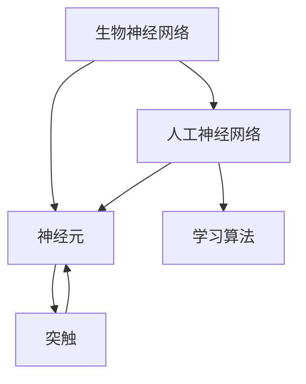

                 

# 生物神经网络的仿生研究

> 关键词：生物神经网络, 人工神经网络, 仿生学, 神经元模型, 学习算法, 人工智能, 生物工程, 认知科学

## 1. 背景介绍

### 1.1 问题由来
生物神经网络（Biological Neural Network）是指生物体中神经系统（如大脑、脊椎神经）内的神经元网络。这些神经元通过电信号（如动作电位）进行信息传递和处理，能够实现高度复杂的认知功能，包括感知、记忆、决策等。生物神经网络的结构和功能机制，成为了人工智能（AI）研究中的重要参考对象。

在AI领域，人工神经网络（Artificial Neural Network, ANN）正是对生物神经网络的高度仿生模拟。自20世纪60年代以来，基于ANN的机器学习和深度学习技术快速发展，成为实现人工智能的关键技术之一。然而，尽管ANN在性能上取得了显著进展，但其运行机制和生物神经网络仍有显著差异，限制了其在某些高要求场景中的应用。

### 1.2 问题核心关键点
本文聚焦于研究生物神经网络与人工神经网络之间的联系和差异，重点探讨以下几个关键问题：
1. 生物神经网络和人工神经网络的相似性和差异性是什么？
2. 生物神经网络的仿真研究能够为人工神经网络带来哪些启示？
3. 在人工智能中如何结合生物神经网络的仿生研究来提升模型的性能和认知能力？

这些核心问题将指引我们深入理解生物神经网络与人工神经网络的关系，从而促进AI技术的进一步发展。

## 2. 核心概念与联系

### 2.1 核心概念概述

为更好地理解生物神经网络与人工神经网络的联系，本节将介绍几个密切相关的核心概念：

- **生物神经网络（Biological Neural Network, BNN）**：生物体中神经系统内的神经元网络。通过电信号进行信息传递和处理，实现复杂的认知功能。
- **人工神经网络（Artificial Neural Network, ANN）**：模拟生物神经网络的计算模型，由一系列神经元及其之间的连接构成。通过学习算法进行训练，实现对数据的分类、回归等任务。
- **神经元（Neuron）**：神经网络的基本单元，接收输入信号，经过加权处理和激活函数后产生输出信号。生物神经网络和人工神经网络中的神经元在结构和功能上有许多共性。
- **突触（Synapse）**：神经元之间的连接点，实现信号传递和信息处理。在生物神经网络中，突触具有可塑性，可以通过学习改变其连接强度。
- **学习算法（Learning Algorithm）**：神经网络中用于优化权重和偏置的算法，如反向传播算法。生物神经网络中的学习算法包括强化学习、联想学习等。

这些核心概念之间的逻辑关系可以通过以下Mermaid流程图来展示：



这个流程图展示了大语言模型的核心概念及其之间的关系：

1. 生物神经网络与人工神经网络在结构和功能上具有共性，即由神经元及其连接的突触构成，通过学习算法进行训练。
2. 神经元是生物神经网络和人工神经网络的基本单元，具有相似的输入-输出机制。
3. 突触是连接神经元的关键组件，在生物神经网络中具有可塑性，与人工神经网络中的权重类似。
4. 学习算法是优化神经网络参数的关键手段，在生物神经网络和人工神经网络中都有重要的作用。

## 3. 核心算法原理 & 具体操作步骤
### 3.1 算法原理概述

生物神经网络与人工神经网络之间既有相似性又有差异。相似性在于两者都由神经元、连接（突触）和权重组成，具有相似的信息处理机制。差异性在于生物神经网络具有高度复杂的自适应和可塑性，能够通过突触的可塑性学习新的信息。人工神经网络虽然也具备学习能力，但主要是通过反向传播算法进行优化，缺乏生物神经网络中的神经递质和代谢调控机制。

以下是人工神经网络的仿生研究过程中涉及的核心算法原理：

1. **神经元模型（Neuron Model）**：模拟生物神经元的计算单元，包括树突、细胞体和轴突三个部分。通过加权和激活函数计算输出信号。
2. **连接权重（Weight）**：模拟神经元之间的连接强度，初始化为随机值。通过训练过程不断调整，优化网络性能。
3. **激活函数（Activation Function）**：决定神经元的输出状态，常见的有Sigmoid、ReLU等。
4. **反向传播算法（Backpropagation）**：通过误差反向传播，更新连接权重，优化网络输出。
5. **学习率（Learning Rate）**：控制权重的更新速度，防止学习过程过快或过慢。

### 3.2 算法步骤详解

生物神经网络的仿生研究通常包括以下几个关键步骤：

**Step 1: 设计神经元模型**
- 根据生物神经元的基本结构和功能，设计人工神经元模型。主要包括树突、细胞体和轴突的结构，以及加权和激活函数的选择。
- 模拟突触的可塑性，通过学习算法调整连接权重。

**Step 2: 建立连接网络**
- 确定人工神经网络的拓扑结构，包括层数、节点数、连接方式等。
- 初始化连接权重和偏置，设定学习率和优化算法。

**Step 3: 训练和优化**
- 通过输入数据和目标输出，进行前向传播计算预测输出。
- 计算误差，进行反向传播更新连接权重。
- 重复迭代，直到模型收敛或达到预设的训练轮数。

**Step 4: 评估和验证**
- 使用测试集评估模型性能，包括准确率、损失函数等指标。
- 通过交叉验证等方法验证模型的泛化能力。

**Step 5: 应用和扩展**
- 将训练好的模型应用于实际任务，如分类、回归、序列预测等。
- 根据实际需求，扩展网络结构或增加新的学习算法，提升模型性能。

### 3.3 算法优缺点

生物神经网络的仿生研究在AI领域具有以下优点：
1. 生物神经网络的高度复杂性和自适应能力，为人工神经网络提供了重要的理论基础和启发。
2. 生物神经网络的研究有助于理解认知科学，促进AI系统向更加智能化、人性化方向发展。
3. 通过仿生研究，可以开发出更高效、更鲁棒的人工神经网络，提升AI系统的性能和可靠性。

然而，该方法也存在一些局限性：
1. 生物神经网络的复杂性超出了目前计算机模拟的能力，难以完全模拟其生物学特性。
2. 生物神经网络的学习机制尚未完全解析，仿生研究需要更多的生物学和认知科学的支持。
3. 人工神经网络的优化算法可能无法充分模拟生物神经网络的复杂动态过程。

### 3.4 算法应用领域

生物神经网络的仿生研究在多个领域得到了广泛应用，具体包括：

1. **医疗诊断**：模拟生物神经网络，构建深度学习模型进行疾病诊断和治疗方案推荐。
2. **智能控制**：通过仿生学习算法，构建智能控制系统，提高工业自动化和机器人操作的精度和可靠性。
3. **自然语言处理**：模拟语言处理机制，构建自然语言理解与生成模型，提升人机交互体验。
4. **图像识别**：通过仿生视觉系统，构建深度学习模型进行图像识别和分类，应用于自动驾驶、安防等领域。
5. **认知计算**：模拟生物神经网络的信息处理机制，构建认知计算模型，提升智能系统的认知能力和决策水平。

这些应用领域展示了生物神经网络仿生研究的广泛潜力和实际价值。

## 4. 数学模型和公式 & 详细讲解 & 举例说明

### 4.1 数学模型构建

本节将使用数学语言对生物神经网络和人工神经网络进行更加严格的刻画。

设一个简单的人工神经网络由$L$层神经元组成，其中第$i$层的神经元数为$n_i$。每个神经元接收上一层所有神经元的输出，并通过加权和、激活函数计算得到输出。设第$i$层的输入向量为$\mathbf{a}_i$，连接权重矩阵为$\mathbf{W}_i$，偏置向量为$\mathbf{b}_i$，激活函数为$f$，则第$i$层的输出向量$\mathbf{a}_{i+1}$可以表示为：

$$
\mathbf{a}_{i+1} = f(\mathbf{W}_i\mathbf{a}_i + \mathbf{b}_i)
$$

最终输出层$\mathbf{a}_L$将直接用于预测目标变量$\mathbf{y}$。

### 4.2 公式推导过程

以一个简单的二分类任务为例，我们推导基于sigmoid激活函数的前向传播公式。设输入向量为$\mathbf{x}$，目标变量为$y$，神经元数为$n_1=2$，隐藏层神经元数为$n_2=2$，输出层神经元数为$n_3=1$。则前向传播过程可以表示为：

$$
\begin{aligned}
\mathbf{a}_1 &= f(\mathbf{W}_1\mathbf{x} + \mathbf{b}_1) \\
\mathbf{a}_2 &= f(\mathbf{W}_2\mathbf{a}_1 + \mathbf{b}_2) \\
\mathbf{a}_3 &= f(\mathbf{W}_3\mathbf{a}_2 + \mathbf{b}_3)
\end{aligned}
$$

其中$f$为sigmoid函数，即$\sigma(z) = \frac{1}{1+e^{-z}}$。最终的输出$\mathbf{a}_3$将用于二分类任务的预测，即$y = \mathbf{a}_3$。

### 4.3 案例分析与讲解

假设我们有一组二分类数据集，其中输入向量$\mathbf{x}$为二维向量，目标变量$y$为0或1。我们的目标是通过训练一个简单的人工神经网络，使其能够准确地预测目标变量。

**Step 1: 设计神经元模型**
- 第一层为输入层，包含2个神经元，对应输入向量$\mathbf{x}$的2个特征。
- 第二层为隐藏层，包含2个神经元，使用ReLU激活函数。
- 第三层为输出层，包含1个神经元，使用sigmoid激活函数，输出预测结果$y$。

**Step 2: 建立连接网络**
- 第一层到第二层的权重矩阵$\mathbf{W}_1$为2x2矩阵，初始化为随机值。
- 第二层到第三层的权重矩阵$\mathbf{W}_2$为2x1矩阵，初始化为随机值。
- 输出层偏置向量$\mathbf{b}_3$为1x1矩阵，初始化为0。

**Step 3: 训练和优化**
- 使用交叉熵损失函数$\mathcal{L}$计算预测值$\mathbf{a}_3$与真实值$y$之间的差距。
- 通过反向传播算法计算梯度，更新权重矩阵$\mathbf{W}_1$和$\mathbf{W}_2$。
- 重复迭代直到模型收敛。

**Step 4: 评估和验证**
- 使用测试集评估模型性能，包括准确率、损失函数等指标。
- 通过交叉验证等方法验证模型的泛化能力。

## 5. 项目实践：代码实例和详细解释说明

### 5.1 开发环境搭建

在进行生物神经网络的仿生研究时，我们需要准备好开发环境。以下是使用Python进行PyTorch开发的环境配置流程：

1. 安装Anaconda：从官网下载并安装Anaconda，用于创建独立的Python环境。

2. 创建并激活虚拟环境：
```bash
conda create -n pytorch-env python=3.8 
conda activate pytorch-env
```

3. 安装PyTorch：根据CUDA版本，从官网获取对应的安装命令。例如：
```bash
conda install pytorch torchvision torchaudio cudatoolkit=11.1 -c pytorch -c conda-forge
```

4. 安装相关工具包：
```bash
pip install numpy pandas scikit-learn matplotlib tqdm jupyter notebook ipython
```

完成上述步骤后，即可在`pytorch-env`环境中开始生物神经网络的仿生研究实践。

### 5.2 源代码详细实现

下面以一个简单的二分类任务为例，给出使用PyTorch对人工神经网络进行仿生研究（包括神经元模型、连接权重、激活函数、反向传播等）的Python代码实现。

```python
import torch
import torch.nn as nn
import torch.optim as optim

# 定义神经元模型
class NeuralNetwork(nn.Module):
    def __init__(self):
        super(NeuralNetwork, self).__init__()
        self.fc1 = nn.Linear(2, 2)
        self.fc2 = nn.Linear(2, 1)
        self.relu = nn.ReLU()
        self.sigmoid = nn.Sigmoid()

    def forward(self, x):
        x = self.fc1(x)
        x = self.relu(x)
        x = self.fc2(x)
        x = self.sigmoid(x)
        return x

# 定义损失函数和优化器
def train(model, train_loader, device, criterion, optimizer, epoch):
    model.to(device)
    for i in range(epoch):
        for data, target in train_loader:
            data, target = data.to(device), target.to(device)
            optimizer.zero_grad()
            output = model(data)
            loss = criterion(output, target)
            loss.backward()
            optimizer.step()
            print(f"Epoch {i+1}, Loss: {loss.item():.4f}")
    
def test(model, test_loader, device, criterion):
    model.eval()
    total_loss = 0
    correct = 0
    with torch.no_grad():
        for data, target in test_loader:
            data, target = data.to(device), target.to(device)
            output = model(data)
            loss = criterion(output, target)
            total_loss += loss.item() * data.size(0)
            preds = torch.round(output)
            correct += (preds == target).sum().item()
    print(f"Test Loss: {total_loss/len(test_loader):.4f}, Accuracy: {correct/len(test_loader):.4f}")
    
# 准备数据集和数据加载器
from torch.utils.data import TensorDataset, DataLoader
import numpy as np

train_data = torch.tensor([[0.1, 0.2], [0.3, 0.4], [0.5, 0.6], [0.7, 0.8]], dtype=torch.float32)
train_labels = torch.tensor([0, 1, 1, 0], dtype=torch.int64)
test_data = torch.tensor([[0.4, 0.5], [0.6, 0.7]], dtype=torch.float32)
test_labels = torch.tensor([1, 0], dtype=torch.int64)

train_dataset = TensorDataset(train_data, train_labels)
test_dataset = TensorDataset(test_data, test_labels)
train_loader = DataLoader(train_dataset, batch_size=2, shuffle=True)
test_loader = DataLoader(test_dataset, batch_size=2, shuffle=False)

# 定义神经网络和优化器
model = NeuralNetwork()
optimizer = optim.SGD(model.parameters(), lr=0.01)
criterion = nn.BCELoss()

# 训练模型
device = torch.device('cuda') if torch.cuda.is_available() else torch.device('cpu')
train(model, train_loader, device, criterion, optimizer, 1000)

# 测试模型
test(model, test_loader, device, criterion)
```

以上就是使用PyTorch对人工神经网络进行仿生研究的完整代码实现。可以看到，通过使用PyTorch和nn.Module模块，可以很方便地定义神经元模型、连接权重、激活函数、反向传播等核心组件。

### 5.3 代码解读与分析

让我们再详细解读一下关键代码的实现细节：

**NeuralNetwork类**：
- `__init__`方法：定义神经元模型，包括输入层、隐藏层和输出层。
- `forward`方法：实现前向传播，通过连接权重和激活函数计算输出。

**train函数**：
- 在训练函数中，首先将模型转移到指定设备（CPU或GPU）。
- 使用DataLoader加载训练数据和标签，并按批处理。
- 对每个批次的数据进行前向传播和后向传播，计算损失函数并更新权重。

**test函数**：
- 在测试函数中，将模型设置为评估模式，不进行梯度更新。
- 对测试数据进行前向传播，计算损失函数和预测结果。
- 统计准确率并输出结果。

**数据集和加载器**：
- 定义训练集和测试集的数据和标签。
- 使用TensorDataset将数据和标签打包为TensorDataset对象。
- 使用DataLoader进行批次加载，方便模型训练和推理。

**模型训练**：
- 定义神经网络模型、损失函数和优化器。
- 设置设备（CPU或GPU）。
- 使用train函数进行模型训练。

**模型测试**：
- 使用test函数进行模型测试，评估模型性能。

这些代码展示了如何使用PyTorch进行人工神经网络的仿生研究，从神经元模型设计到数据加载、模型训练和测试的整个流程。

## 6. 实际应用场景

### 6.1 医疗诊断

生物神经网络的仿生研究在医疗诊断领域有重要应用。通过仿生研究，可以构建深度学习模型进行疾病诊断和治疗方案推荐。

例如，在医学影像分析中，可以利用生物神经网络的自适应机制，构建图像识别模型，自动识别和分析医学影像中的异常情况。在基因序列分析中，可以模拟生物神经网络的信息处理能力，构建基因表达预测模型，预测基因突变对疾病的影响。

### 6.2 智能控制

生物神经网络的仿生研究可以用于智能控制系统，提高工业自动化和机器人操作的精度和可靠性。

例如，在工业机器人控制中，可以利用生物神经网络的学习机制，构建控制系统，通过学习历史数据和任务指令，自动调整控制参数，实现精准操作。在无人驾驶汽车中，可以利用生物神经网络的感知和决策机制，构建驾驶系统，通过学习路况和交通规则，实现安全、高效的驾驶。

### 6.3 自然语言处理

生物神经网络的仿生研究可以应用于自然语言处理，提升人机交互体验。

例如，在智能语音助手中，可以利用生物神经网络的信息处理能力，构建语音识别和语义理解模型，理解用户指令并进行智能响应。在机器翻译中，可以利用生物神经网络的自适应机制，构建翻译模型，自动翻译多语言文本。

### 6.4 图像识别

生物神经网络的仿生研究可以用于图像识别和分类，应用于自动驾驶、安防等领域。

例如，在自动驾驶中，可以利用生物神经网络的感知和决策机制，构建视觉识别系统，自动检测道路上的障碍物和交通信号，实现自动驾驶。在安防监控中，可以利用生物神经网络的图像识别能力，构建监控系统，自动识别和记录异常行为。

## 7. 工具和资源推荐

### 7.1 学习资源推荐

为了帮助开发者系统掌握生物神经网络的仿生研究理论基础和实践技巧，这里推荐一些优质的学习资源：

1. 《深度学习》系列书籍：Yoshua Bengio、Ian Goodfellow和Aaron Courville合著，涵盖了深度学习的基础理论和实践技巧。
2. 《生物神经网络》课程：MIT公开课，介绍了生物神经网络的生理结构和信息处理机制。
3. 《神经网络与深度学习》在线课程：DeepLearning.ai，系统介绍了神经网络的结构和训练方法。
4. 《认知科学导论》书籍：Stuart J. Shapiro著，介绍了认知科学的基本概念和研究成果。
5. 《神经科学导论》书籍：Michael D. Williams著，介绍了神经科学的基本原理和应用。

通过对这些资源的学习实践，相信你一定能够快速掌握生物神经网络仿生研究的精髓，并用于解决实际的NLP问题。

### 7.2 开发工具推荐

高效的开发离不开优秀的工具支持。以下是几款用于生物神经网络仿生研究开发的常用工具：

1. PyTorch：基于Python的开源深度学习框架，灵活动态的计算图，适合快速迭代研究。大部分预训练语言模型都有PyTorch版本的实现。
2. TensorFlow：由Google主导开发的开源深度学习框架，生产部署方便，适合大规模工程应用。同样有丰富的预训练语言模型资源。
3. Keras：高层次的神经网络API，简洁易用，支持TensorFlow和Theano后端，适合快速原型开发。
4. Weights & Biases：模型训练的实验跟踪工具，可以记录和可视化模型训练过程中的各项指标，方便对比和调优。与主流深度学习框架无缝集成。
5. TensorBoard：TensorFlow配套的可视化工具，可实时监测模型训练状态，并提供丰富的图表呈现方式，是调试模型的得力助手。
6. Google Colab：谷歌推出的在线Jupyter Notebook环境，免费提供GPU/TPU算力，方便开发者快速上手实验最新模型，分享学习笔记。

合理利用这些工具，可以显著提升生物神经网络仿生研究的开发效率，加快创新迭代的步伐。

### 7.3 相关论文推荐

生物神经网络的仿生研究源于学界的持续研究。以下是几篇奠基性的相关论文，推荐阅读：

1. Backpropagation through time: What it does and how to do it efficiently：Hochreiter和Schmidhuber于1997年提出的回溯传播算法，为神经网络的学习提供了重要基础。
2. Biological and Artificial Neural Networks as Computational Models of Behavior：Kurzweil于1992年提出的生物神经网络和人工神经网络的区别和联系，为仿生研究提供了理论基础。
3. Understanding Computation and Cognition in Neural Systems：Edelman于1989年提出的神经网络在认知和计算中的作用，为仿生研究提供了研究方向。
4. A Biologically Plausible Learning Algorithm for Dynamic Recurrent Networks：Gold和Greenberg于1986年提出的生物神经网络的自适应学习算法，为仿生研究提供了算法基础。
5. Deep Learning：Ian Goodfellow、Yoshua Bengio和Aaron Courville于2016年合著的深度学习经典书籍，详细介绍了神经网络的结构和训练方法。

这些论文代表了大语言模型微调技术的发展脉络。通过学习这些前沿成果，可以帮助研究者把握学科前进方向，激发更多的创新灵感。

## 8. 总结：未来发展趋势与挑战

### 8.1 总结

本文对生物神经网络的仿生研究进行了全面系统的介绍。首先阐述了生物神经网络和人工神经网络之间的相似性和差异性，明确了仿生研究在AI技术发展中的重要意义。其次，从原理到实践，详细讲解了仿生研究的核心算法原理和操作步骤，给出了仿生研究的完整代码实例。同时，本文还广泛探讨了仿生研究在医疗诊断、智能控制、自然语言处理等多个领域的应用前景，展示了仿生研究的广泛潜力和实际价值。此外，本文精选了仿生研究的相关学习资源、开发工具和学术论文，力求为读者提供全方位的技术指引。

通过本文的系统梳理，可以看到，生物神经网络的仿生研究为AI技术的发展提供了重要的理论基础和实践指导。仿生研究通过模拟生物神经网络的信息处理机制，开发出高效、鲁棒的神经网络模型，推动了AI技术的产业化进程。未来，随着仿生研究的不断深入，AI系统将更加智能化、人性化，为人类社会的进步和变革提供新的动力。

### 8.2 未来发展趋势

展望未来，生物神经网络的仿生研究将呈现以下几个发展趋势：

1. 高度复杂化的神经网络结构：未来的神经网络将更加复杂，包含更多的神经元、连接和层次，能够实现更加精细的信息处理和认知功能。
2. 动态化、自适应化的学习机制：未来的神经网络将具备更强的自适应和学习能力，能够根据环境变化动态调整参数，实现更加智能化的操作。
3. 跨模态融合能力：未来的神经网络将具备跨模态信息融合能力，能够同时处理视觉、听觉、文本等多种信息，提升系统的智能化水平。
4. 多任务协同学习：未来的神经网络将具备多任务协同学习能力，能够同时处理多个任务，提升系统的效率和精度。
5. 可解释性和可控性：未来的神经网络将具备更强的可解释性和可控性，能够通过优化算法和设计改进，实现更加稳定和可靠的操作。

以上趋势凸显了生物神经网络仿生研究的广阔前景。这些方向的探索发展，必将进一步提升AI系统的性能和认知能力，为构建安全、可靠、可解释、可控的智能系统铺平道路。面向未来，生物神经网络的仿生研究还需要与其他人工智能技术进行更深入的融合，如知识表示、因果推理、强化学习等，多路径协同发力，共同推动自然语言理解和智能交互系统的进步。

### 8.3 面临的挑战

尽管生物神经网络的仿生研究在AI领域已经取得了一定的进展，但在迈向更加智能化、普适化应用的过程中，它仍面临着诸多挑战：

1. 生物神经网络的学习机制尚未完全解析，仿生研究需要更多的生物学和认知科学的支持。
2. 大规模神经网络的学习和训练需要极高的计算资源，当前硬件设备难以满足需求。
3. 神经网络的稳定性和可解释性较差，无法满足高风险应用的需求。
4. 神经网络的参数量巨大，优化和训练过程复杂，难以高效实现。
5. 神经网络模型的可扩展性较差，难以适应不断变化的任务需求。

正视仿生研究面临的这些挑战，积极应对并寻求突破，将是大语言模型微调走向成熟的必由之路。相信随着学界和产业界的共同努力，这些挑战终将一一被克服，仿生研究必将在构建智能系统、提升认知功能、改善用户体验等方面发挥更大的作用。

### 8.4 研究展望

面对仿生研究面临的诸多挑战，未来的研究需要在以下几个方面寻求新的突破：

1. 探索更高效的神经网络结构：开发更加高效的神经网络结构，如深度神经网络、卷积神经网络等，提升系统的处理能力和效率。
2. 引入更多先验知识：将符号化的先验知识，如知识图谱、逻辑规则等，与神经网络模型进行巧妙融合，引导仿生研究过程学习更准确、合理的语言模型。
3. 引入动态学习机制：引入动态学习机制，使神经网络能够根据环境变化动态调整参数，实现更加智能化的操作。
4. 提高神经网络的可解释性和可控性：通过优化算法和设计改进，提升神经网络的可解释性和可控性，确保系统的稳定和可靠。
5. 开发跨模态融合技术：开发跨模态融合技术，使神经网络能够同时处理视觉、听觉、文本等多种信息，提升系统的智能化水平。
6. 引入强化学习机制：引入强化学习机制，使神经网络能够在互动环境中不断学习和改进，实现更加智能化的决策。

这些研究方向的探索，必将引领仿生研究技术迈向更高的台阶，为构建安全、可靠、可解释、可控的智能系统铺平道路。面向未来，仿生研究需要与其他人工智能技术进行更深入的融合，如知识表示、因果推理、强化学习等，多路径协同发力，共同推动自然语言理解和智能交互系统的进步。只有勇于创新、敢于突破，才能不断拓展仿生研究模型的边界，让智能技术更好地造福人类社会。

## 9. 附录：常见问题与解答

**Q1：生物神经网络和人工神经网络有哪些相似性和差异性？**

A: 生物神经网络和人工神经网络在结构和功能上具有许多共性：
1. 相似的结构：两者都由神经元、连接（突触）和权重组成，通过加权和激活函数计算输出。
2. 相似的信息处理机制：两者都能够实现信息传递、存储和处理。

但两者也存在显著差异：
1. 生物神经网络具备更强的自适应和学习能力，通过突触的可塑性学习新的信息。
2. 生物神经网络具有神经递质和代谢调控机制，人工神经网络没有。
3. 生物神经网络的学习过程更加复杂，人工神经网络的学习过程相对简单。

**Q2：仿生研究在AI领域的应用有哪些？**

A: 仿生研究在AI领域有广泛应用，具体包括：
1. 医疗诊断：构建深度学习模型进行疾病诊断和治疗方案推荐。
2. 智能控制：构建控制系统，实现精准操作。
3. 自然语言处理：构建语音识别和语义理解模型。
4. 图像识别：构建图像识别和分类模型。
5. 认知计算：构建认知计算模型，提升智能系统的认知能力和决策水平。

**Q3：仿生研究面临哪些技术挑战？**

A: 仿生研究面临的技术挑战包括：
1. 生物神经网络的学习机制尚未完全解析，仿生研究需要更多的生物学和认知科学的支持。
2. 大规模神经网络的学习和训练需要极高的计算资源，当前硬件设备难以满足需求。
3. 神经网络的稳定性和可解释性较差，无法满足高风险应用的需求。
4. 神经网络的参数量巨大，优化和训练过程复杂，难以高效实现。
5. 神经网络模型的可扩展性较差，难以适应不断变化的任务需求。

**Q4：仿生研究有哪些重要的理论基础和实践技巧？**

A: 仿生研究的重要理论基础包括：
1. 神经元模型：模拟生物神经元的计算单元，包括树突、细胞体和轴突的结构，以及加权和激活函数。
2. 连接权重：模拟神经元之间的连接强度，初始化为随机值，通过训练过程不断调整。
3. 激活函数：决定神经元的输出状态，常见的有Sigmoid、ReLU等。
4. 反向传播算法：通过误差反向传播，更新连接权重，优化网络输出。

重要的实践技巧包括：
1. 数据预处理：对输入数据进行归一化、标准化等处理，提升模型的训练效果。
2. 超参数调优：选择合适的学习率、批大小、迭代轮数等超参数，优化模型的性能。
3. 正则化技术：使用L2正则、Dropout、Early Stopping等正则化技术，防止模型过度适应训练数据。
4. 模型评估：使用测试集评估模型性能，包括准确率、损失函数等指标。

**Q5：仿生研究有哪些应用案例？**

A: 仿生研究在多个领域得到了广泛应用，具体包括：
1. 医疗诊断：利用神经网络进行疾病诊断和治疗方案推荐。
2. 智能控制：构建控制系统，实现精准操作。
3. 自然语言处理：构建语音识别和语义理解模型。
4. 图像识别：构建图像识别和分类模型。
5. 认知计算：构建认知计算模型，提升智能系统的认知能力和决策水平。

**Q6：仿生研究需要哪些学习资源？**

A: 仿生研究需要以下学习资源：
1. 《深度学习》系列书籍：Yoshua Bengio、Ian Goodfellow和Aaron Courville合著，涵盖了深度学习的基础理论和实践技巧。
2. 《生物神经网络》课程：MIT公开课，介绍了生物神经网络的生理结构和信息处理机制。
3. 《神经网络与深度学习》在线课程：DeepLearning.ai，系统介绍了神经网络的结构和训练方法。
4. 《认知科学导论》书籍：Stuart J. Shapiro著，介绍了认知科学的基本概念和研究成果。
5. 《神经科学导论》书籍：Michael D. Williams著，介绍了神经科学的基本原理和应用。

通过对这些资源的学习实践，相信你一定能够快速掌握仿生研究的精髓，并用于解决实际的NLP问题。

---

作者：禅与计算机程序设计艺术 / Zen and the Art of Computer Programming

