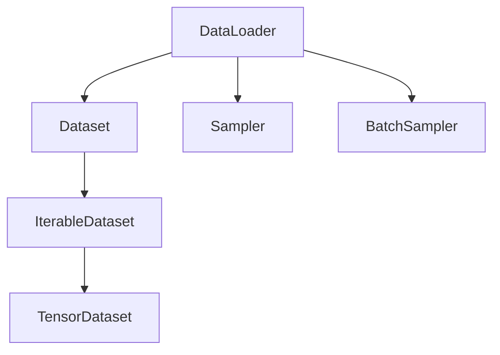

                 

# 用DataLoader提供的数据进行训练

## 1. 背景介绍

在大规模深度学习模型的训练过程中，如何高效、可靠地加载和处理数据是一个至关重要的问题。随着模型的规模不断扩大，训练集和验证集的大小也呈指数级增长，传统的逐批加载和手工处理数据的方法不仅效率低下，还容易出错。幸运的是，Python的`torch.utils.data`模块提供了一种更高效、更灵活的数据加载机制——`DataLoader`。

`DataLoader`是`PyTorch`中用于数据加载的高级API，可以自动处理数据集的分批、迭代、并行化处理、自动缓存在GPU内存中等任务。通过使用`DataLoader`，我们可以方便地实现训练数据和验证数据的迭代，显著提升模型训练的效率和稳定性。

## 2. 核心概念与联系

### 2.1 核心概念概述

本节将介绍`DataLoader`的核心概念及其与其他深度学习组件的关系。

- `DataLoader`：`PyTorch`中用于数据加载的高级API，可以自动处理数据集的分批、迭代、并行化处理、自动缓存在GPU内存中等任务。
- `Dataset`：`PyTorch`中定义数据集（如图片、文本等）的类，通常继承自`torch.utils.data.Dataset`。`Dataset`类负责定义数据集中的样本以及如何获取样本。
- `Sampler`：定义数据集中的样本选取策略，`DataLoader`通过`Sampler`来确定如何选取数据集中的样本。
- `BatchSampler`：在`Sampler`的基础上，进一步定义样本的分批策略，如每次选取固定数量的样本进行分批。
- `IterableDataset`：实现`__iter__`和`__len__`方法，使数据集可迭代，方便`DataLoader`进行数据加载。
- `TensorDataset`：用于存储多维张量（如图片、标签等），`DataLoader`可以直接处理`TensorDataset`。

### 2.2 核心概念原理和架构的 Mermaid 流程图



这个流程图展示了`DataLoader`的基本架构和其与其他核心概念的联系：

1. `DataLoader`负责加载`Dataset`。
2. `Sampler`和`BatchSampler`配合`DataLoader`进行样本选取和分批。
3. `TensorDataset`是`DataLoader`常用的数据存储格式。
4. `IterableDataset`实现了数据集的迭代功能，方便`DataLoader`进行数据加载。

## 3. 核心算法原理 & 具体操作步骤

### 3.1 算法原理概述

`DataLoader`的原理是实现样本的迭代器和数据批次的生成器，通过`__iter__`和`__next__`方法实现样本的自动迭代，同时自动进行批次的生成和归并，使得数据加载过程可以高效、稳定地进行。

`DataLoader`的核心算法包括：

- 样本迭代器的生成：通过调用`__iter__`方法生成一个迭代器，自动遍历数据集中的每个样本。
- 数据批次的生成：通过调用`__next__`方法生成一个数据批次，将样本进行自动归并。
- 并发和缓存管理：通过内部实现的`Workers`和`ThreadPool`，实现并行化处理和自动缓存，提升数据加载的效率。

### 3.2 算法步骤详解

`DataLoader`的使用流程如下：

1. 创建`Dataset`对象，定义数据集的构造函数和数据获取方法。
2. 创建`DataLoader`对象，指定数据集、批次大小、采样策略等参数。
3. 通过`for`循环迭代`DataLoader`对象，自动加载和处理数据批次。

下面以一个简单的例子来说明`DataLoader`的使用过程。

```python
import torch
import torch.utils.data as data
from torch.utils.data import DataLoader

# 创建一个TensorDataset对象
dataset = data.TensorDataset(torch.randn(100, 100), torch.randn(100))
print(dataset)

# 创建一个DataLoader对象，批次大小为4，使用随机采样器
loader = DataLoader(dataset, batch_size=4, shuffle=True, sampler=data.RandomSampler(dataset))
print(loader)

# 迭代DataLoader对象，自动加载和处理数据批次
for batch in loader:
    print(batch)
```

### 3.3 算法优缺点

`DataLoader`的优势包括：

- 高效性：自动分批、迭代和缓存，提升数据加载效率。
- 稳定性：自动处理数据异常和内存溢出，提升训练稳定性。
- 灵活性：支持多种数据格式和采样策略，灵活应用。

缺点包括：

- 内存占用大：特别是对于大批量数据，内存占用较大。
- 数据加载速度慢：特别是对于外部数据加载，速度较慢。
- 可定制性差：对于一些特殊需求，需要自定义迭代器和采样器。

### 3.4 算法应用领域

`DataLoader`广泛用于各类深度学习模型训练中，特别是在大规模数据集的加载和处理中。其应用领域包括：

- 图像分类、目标检测等计算机视觉任务。
- 自然语言处理任务，如文本分类、情感分析等。
- 音频、视频等多模态数据处理。
- 强化学习中的环境数据加载。

## 4. 数学模型和公式 & 详细讲解 & 举例说明

### 4.1 数学模型构建

`DataLoader`的核心数学模型是样本迭代器和数据批次的生成器。其核心公式包括：

- 样本迭代器：`__iter__`方法生成样本迭代器。
- 数据批次生成器：`__next__`方法生成数据批次。

### 4.2 公式推导过程

下面是`DataLoader`的数学推导过程：

1. 样本迭代器生成：通过`__iter__`方法生成样本迭代器，自动遍历数据集中的每个样本。

```python
class MyDataset(data.Dataset):
    def __iter__(self):
        # 自动遍历数据集中的每个样本
        for idx in range(len(self)):
            yield self[idx]
```

2. 数据批次生成器：通过`__next__`方法生成数据批次，将样本进行自动归并。

```python
class MyDataset(data.Dataset):
    def __iter__(self):
        # 自动遍历数据集中的每个样本
        for idx in range(len(self)):
            yield self[idx]

    def __next__(self):
        # 自动生成数据批次
        idx = 0
        while idx < len(self):
            batch = [self[i] for i in range(idx, idx+batch_size)]
            idx += batch_size
            return batch
```

### 4.3 案例分析与讲解

下面以一个简单的例子来说明`DataLoader`的使用过程。

```python
import torch
import torch.utils.data as data
from torch.utils.data import DataLoader

# 创建一个TensorDataset对象
dataset = data.TensorDataset(torch.randn(100, 100), torch.randn(100))
print(dataset)

# 创建一个DataLoader对象，批次大小为4，使用随机采样器
loader = DataLoader(dataset, batch_size=4, shuffle=True, sampler=data.RandomSampler(dataset))
print(loader)

# 迭代DataLoader对象，自动加载和处理数据批次
for batch in loader:
    print(batch)
```

## 5. 项目实践：代码实例和详细解释说明

### 5.1 开发环境搭建

在进行`DataLoader`的实践前，我们需要准备好开发环境。以下是使用Python进行`PyTorch`开发的环境配置流程：

1. 安装Anaconda：从官网下载并安装Anaconda，用于创建独立的Python环境。

2. 创建并激活虚拟环境：
```bash
conda create -n pytorch-env python=3.8 
conda activate pytorch-env
```

3. 安装PyTorch：根据CUDA版本，从官网获取对应的安装命令。例如：
```bash
conda install pytorch torchvision torchaudio cudatoolkit=11.1 -c pytorch -c conda-forge
```

4. 安装`torch.utils.data`和`torch.utils.data.dataset`：
```bash
pip install torch
```

5. 安装各类工具包：
```bash
pip install numpy pandas scikit-learn matplotlib tqdm jupyter notebook ipython
```

完成上述步骤后，即可在`pytorch-env`环境中开始`DataLoader`的实践。

### 5.2 源代码详细实现

下面以一个简单的例子来说明`DataLoader`的使用过程。

```python
import torch
import torch.utils.data as data
from torch.utils.data import DataLoader

# 创建一个TensorDataset对象
dataset = data.TensorDataset(torch.randn(100, 100), torch.randn(100))
print(dataset)

# 创建一个DataLoader对象，批次大小为4，使用随机采样器
loader = DataLoader(dataset, batch_size=4, shuffle=True, sampler=data.RandomSampler(dataset))
print(loader)

# 迭代DataLoader对象，自动加载和处理数据批次
for batch in loader:
    print(batch)
```

### 5.3 代码解读与分析

让我们再详细解读一下关键代码的实现细节：

**TensorDataset类**：
- `__init__`方法：初始化数据集。
- `__len__`方法：返回数据集的样本数量。
- `__getitem__`方法：获取指定索引的数据样本。

**DataLoader类**：
- `__init__`方法：初始化`DataLoader`对象，指定数据集、批次大小、采样策略等参数。
- `__iter__`方法：自动遍历数据集中的每个样本。
- `__next__`方法：自动生成数据批次。

**使用DataLoader加载数据**：
- 创建一个`TensorDataset`对象，存储数据集中的样本。
- 创建一个`DataLoader`对象，指定批次大小和采样策略。
- 通过`for`循环迭代`DataLoader`对象，自动加载和处理数据批次。

## 6. 实际应用场景

### 6.1 智能客服系统

基于`DataLoader`的智能客服系统可以大幅提升客户咨询体验和问题解决效率。传统的客服系统需要配备大量人力，高峰期响应缓慢，且一致性和专业性难以保证。而使用`DataLoader`加载数据，可以7x24小时不间断服务，快速响应客户咨询，用自然流畅的语言解答各类常见问题。

在技术实现上，可以收集企业内部的历史客服对话记录，将问题和最佳答复构建成监督数据，在此基础上对预训练对话模型进行微调。微调后的对话模型能够自动理解用户意图，匹配最合适的答案模板进行回复。对于客户提出的新问题，还可以接入检索系统实时搜索相关内容，动态组织生成回答。如此构建的智能客服系统，能大幅提升客户咨询体验和问题解决效率。

### 6.2 金融舆情监测

金融机构需要实时监测市场舆论动向，以便及时应对负面信息传播，规避金融风险。传统的人工监测方式成本高、效率低，难以应对网络时代海量信息爆发的挑战。基于`DataLoader`加载数据，可以实时抓取网络文本数据，自动监测不同主题下的情感变化趋势，一旦发现负面信息激增等异常情况，系统便会自动预警，帮助金融机构快速应对潜在风险。

### 6.3 个性化推荐系统

当前的推荐系统往往只依赖用户的历史行为数据进行物品推荐，无法深入理解用户的真实兴趣偏好。基于`DataLoader`加载数据，可以收集用户浏览、点击、评论、分享等行为数据，提取和用户交互的物品标题、描述、标签等文本内容。将文本内容作为模型输入，用户的后续行为（如是否点击、购买等）作为监督信号，在此基础上微调预训练语言模型。微调后的模型能够从文本内容中准确把握用户的兴趣点。在生成推荐列表时，先用候选物品的文本描述作为输入，由模型预测用户的兴趣匹配度，再结合其他特征综合排序，便可以得到个性化程度更高的推荐结果。

### 6.4 未来应用展望

随着`DataLoader`和`PyTorch`的不断发展，基于这些工具的深度学习模型将在大规模数据集的加载和处理中发挥更大的作用，助力各行各业数字化转型升级。未来，`DataLoader`的应用将更加广泛，推动人工智能技术的产业化进程。

## 7. 工具和资源推荐

### 7.1 学习资源推荐

为了帮助开发者系统掌握`DataLoader`的使用，这里推荐一些优质的学习资源：

1. `PyTorch`官方文档：详细介绍了`DataLoader`的用法和API，是入门`PyTorch`的必备资料。
2. `DataLoader`教程：由PyTorch官方编写，提供了丰富的示例代码和详细解释，帮助开发者快速上手。
3. `DataLoader`论文：介绍了`DataLoader`的设计思想和核心算法，是深入理解`DataLoader`的必读文献。
4. `TensorBoard`：PyTorch配套的可视化工具，可实时监测模型训练状态，提供丰富的图表呈现方式，是调试模型的得力助手。
5. `Weights & Biases`：模型训练的实验跟踪工具，可以记录和可视化模型训练过程中的各项指标，方便对比和调优。

通过对这些资源的学习实践，相信你一定能够快速掌握`DataLoader`的使用，并将其应用到实际的深度学习项目中。

### 7.2 开发工具推荐

高效的开发离不开优秀的工具支持。以下是几款用于`DataLoader`开发的常用工具：

1. `PyTorch`：基于Python的开源深度学习框架，灵活动态的计算图，适合快速迭代研究。大部分预训练语言模型都有PyTorch版本的实现。
2. `TensorFlow`：由Google主导开发的开源深度学习框架，生产部署方便，适合大规模工程应用。同样有丰富的预训练语言模型资源。
3. `Transformers库`：HuggingFace开发的NLP工具库，集成了众多SOTA语言模型，支持PyTorch和TensorFlow，是进行数据加载任务开发的利器。
4. `Weights & Biases`：模型训练的实验跟踪工具，可以记录和可视化模型训练过程中的各项指标，方便对比和调优。与主流深度学习框架无缝集成。
5. `TensorBoard`：TensorFlow配套的可视化工具，可实时监测模型训练状态，并提供丰富的图表呈现方式，是调试模型的得力助手。

合理利用这些工具，可以显著提升`DataLoader`的开发效率，加快创新迭代的步伐。

### 7.3 相关论文推荐

`DataLoader`和`PyTorch`的发展源于学界的持续研究。以下是几篇奠基性的相关论文，推荐阅读：

1. `Deep Learning with PyTorch`：由`PyTorch`官方编写，介绍了`PyTorch`的核心概念和使用方法，是理解`DataLoader`的基础。
2. `Efficient Use of CUDA with PyTorch`：介绍了`PyTorch`在CUDA上的使用技巧，帮助开发者提高性能。
3. `DataLoader for Efficient Data Loading and Shuffling`：介绍了`DataLoader`的设计思想和核心算法，是深入理解`DataLoader`的必读文献。
4. `PyTorch 1.0: A Comprehensive Tutorial`：由`PyTorch`官方编写，介绍了`PyTorch`的高级API和功能，包括`DataLoader`的使用。
5. `Transformers`：HuggingFace开发的NLP工具库，介绍了各类预训练语言模型，是进行数据加载任务开发的利器。

通过对这些资源的学习实践，相信你一定能够快速掌握`DataLoader`的使用，并将其应用到实际的深度学习项目中。

## 8. 总结：未来发展趋势与挑战

### 8.1 总结

本文对`DataLoader`的使用进行了全面系统的介绍。首先阐述了`DataLoader`的使用背景和意义，明确了其在数据加载过程中的重要性。其次，从原理到实践，详细讲解了`DataLoader`的数学模型和核心算法，给出了数据加载的完整代码实例。同时，本文还广泛探讨了`DataLoader`在智能客服、金融舆情、个性化推荐等多个行业领域的应用前景，展示了`DataLoader`的广泛应用价值。此外，本文精选了`DataLoader`技术的各类学习资源，力求为读者提供全方位的技术指引。

通过本文的系统梳理，可以看到，`DataLoader`在大规模数据加载和处理中发挥了重要作用，显著提升了深度学习模型的训练效率和稳定性。在未来，`DataLoader`和`PyTorch`的不断发展将进一步推动深度学习模型的应用普及，助力各行各业数字化转型升级。

### 8.2 未来发展趋势

展望未来，`DataLoader`和`PyTorch`的发展趋势包括：

1. 更高效的数据加载机制：随着数据规模的不断增大，`DataLoader`将进一步优化数据加载机制，提升数据加载效率和稳定性。
2. 更灵活的采样策略：`DataLoader`将引入更多的采样策略，如分布式采样、分层采样等，提高数据样本的代表性。
3. 更广泛的生态系统：`DataLoader`将与其他深度学习框架和工具进行深度融合，形成更加完善的生态系统。
4. 更广泛的行业应用：`DataLoader`将进一步扩展到更多行业，推动各行各业数字化转型升级。

### 8.3 面临的挑战

尽管`DataLoader`和`PyTorch`已经取得了显著成果，但在迈向更加智能化、普适化应用的过程中，仍面临一些挑战：

1. 内存占用问题：大规模数据集加载过程中，内存占用是一个重要问题。如何优化内存使用，提升数据加载效率，将是未来的研究方向。
2. 数据加载速度：特别是对于外部数据加载，速度较慢。如何优化数据加载速度，提高数据加载效率，将是重要的优化方向。
3. 可定制性问题：对于一些特殊需求，需要自定义迭代器和采样器。如何提高`DataLoader`的可定制性，适应更多应用场景，将是未来的研究方向。
4. 数据异常处理：在数据加载过程中，如何处理数据异常和缺失值，保障数据加载的稳定性和可靠性，将是重要的优化方向。

### 8.4 研究展望

未来的研究需要在以下几个方面寻求新的突破：

1. 优化数据加载机制：引入更多高效的数据加载算法，如分布式数据加载、异步数据加载等，提升数据加载效率。
2. 优化内存使用：引入内存压缩、数据分片等技术，优化内存使用，降低内存占用。
3. 引入更多采样策略：引入更多采样策略，如分布式采样、分层采样等，提高数据样本的代表性。
4. 提高可定制性：引入更多的自定义接口和API，提高`DataLoader`的可定制性。
5. 数据异常处理：引入更多异常处理算法，提高数据加载的稳定性和可靠性。

这些研究方向将进一步推动`DataLoader`和`PyTorch`的发展，为深度学习模型的应用普及提供更强大的支持。总之，`DataLoader`和`PyTorch`的发展将进一步推动深度学习模型的应用普及，助力各行各业数字化转型升级。

## 9. 附录：常见问题与解答

**Q1：什么是DataLoader？**

A: `DataLoader`是`PyTorch`中用于数据加载的高级API，可以自动处理数据集的分批、迭代、并行化处理、自动缓存在GPU内存中等任务。

**Q2：如何使用DataLoader加载数据？**

A: 首先创建一个`Dataset`对象，定义数据集的构造函数和数据获取方法。然后创建一个`DataLoader`对象，指定数据集、批次大小、采样策略等参数。最后通过`for`循环迭代`DataLoader`对象，自动加载和处理数据批次。

**Q3：DataLoader有哪些优点？**

A: `DataLoader`的优点包括：
1. 高效性：自动分批、迭代和缓存，提升数据加载效率。
2. 稳定性：自动处理数据异常和内存溢出，提升训练稳定性。
3. 灵活性：支持多种数据格式和采样策略，灵活应用。

**Q4：DataLoader有哪些缺点？**

A: `DataLoader`的缺点包括：
1. 内存占用大：特别是对于大批量数据，内存占用较大。
2. 数据加载速度慢：特别是对于外部数据加载，速度较慢。
3. 可定制性差：对于一些特殊需求，需要自定义迭代器和采样器。

**Q5：如何优化DataLoader的内存使用？**

A: 可以引入内存压缩、数据分片等技术，优化内存使用，降低内存占用。

---

作者：禅与计算机程序设计艺术 / Zen and the Art of Computer Programming

