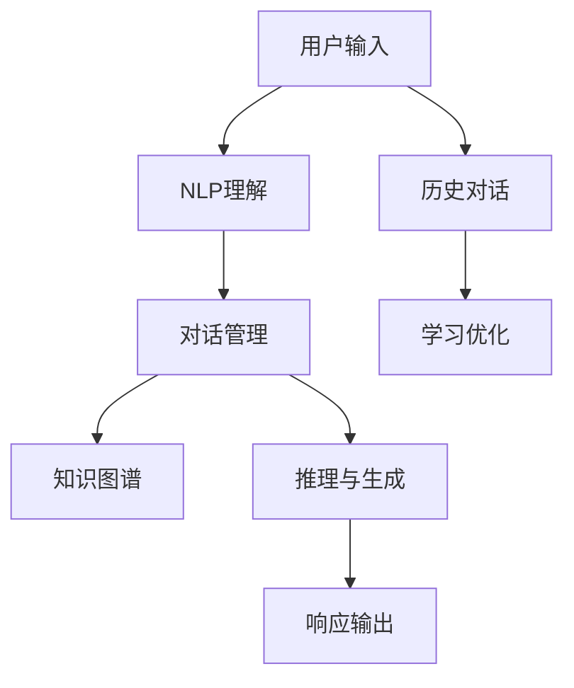

                 

## 1. 背景介绍

### 1.1 问题由来

在电子商务迅猛发展的今天，在线客服系统成为提升用户体验、提高转化率的关键。由于电商平台交易链条长、场景复杂，客服人员不仅要处理常见的退换货问题，还要解答复杂的商品信息咨询，甚至涉及法律合规和顾客心理疏导等多方面内容，工作难度极大。

传统客服系统依赖人工处理，常常面临响应慢、处理量不均衡、知识储备不足等问题。而随着人工智能技术的发展，利用智能客服替代部分人工客服成为了可能。通过AI优化电商平台客服，可以极大地提升用户体验，减轻人工客服的负担，降低企业运营成本。

### 1.2 问题核心关键点

本文旨在介绍如何利用AI优化电商平台客服系统，提升用户互动体验，重点关注以下几个核心问题：

1. 智能客服的实现原理
2. 智能客服的核心算法和技术
3. 智能客服在电商平台的应用场景
4. 智能客服的优缺点和未来发展方向

## 2. 核心概念与联系

### 2.1 核心概念概述

智能客服系统通过AI技术，自动处理用户的查询、退换货请求，并快速提供准确答案，从而提升用户体验。其核心组件包括：

- 自然语言处理(Natural Language Processing, NLP)：用于理解用户输入的自然语言，提取有用信息。
- 对话管理(Dialog Management)：维护对话状态，根据上下文进行响应决策。
- 机器学习(Machine Learning)：通过数据驱动，不断优化模型性能。
- 知识图谱(Knowledge Graph)：提供结构化的领域知识，辅助推理。

这些技术紧密结合，构建了一个功能强大、高效便捷的智能客服系统。

### 2.2 核心概念原理和架构的 Mermaid 流程图



该图展示了智能客服系统的工作流程：用户输入被NLP模块理解，再经过对话管理模块处理，结合知识图谱的领域知识，进行推理与生成，最后输出响应。历史对话数据通过学习优化模块不断更新模型，提高系统性能。

## 3. 核心算法原理 & 具体操作步骤

### 3.1 算法原理概述

智能客服的核心算法原理包括以下几个关键环节：

1. **自然语言处理(NLP)**：使用深度学习模型对用户输入进行分词、词性标注、命名实体识别、依存句法分析等处理，提取有用的语义信息。
2. **对话管理**：使用状态机、序列到序列模型、注意力机制等方法，维护对话状态，根据上下文进行响应决策。
3. **知识图谱**：构建领域知识图谱，用于实体链接、关系推理和知识扩展。
4. **推理与生成**：使用深度学习模型对用户意图进行分类，结合知识图谱推理生成响应。

这些算法模块共同构成了智能客服系统的核心架构。

### 3.2 算法步骤详解

智能客服的算法步骤一般包括以下几个关键步骤：

**Step 1: 数据预处理**

- 收集平台用户的历史对话记录，清洗并标记为训练数据。
- 将对话数据转换为模型所需的格式，如将对话转变为问题-答案对形式。

**Step 2: 模型训练**

- 使用预训练语言模型(如BERT、GPT等)作为基础模型，对其进行微调。
- 引入对话管理模块，训练序列到序列模型、状态机模型等。
- 结合知识图谱，优化模型的推理能力。

**Step 3: 系统部署**

- 将训练好的模型部署到服务器，搭建实时客服系统。
- 配置前后端系统，实现用户交互、数据记录与查询等功能。
- 配置知识图谱系统，提供领域知识库查询功能。

**Step 4: 系统优化与维护**

- 根据用户反馈和系统性能指标，不断优化模型和对话管理策略。
- 定期更新知识图谱，引入最新商品信息和用户反馈。
- 进行系统负载均衡和性能监控，确保系统稳定运行。

### 3.3 算法优缺点

智能客服系统具有以下优点：

1. **效率高**：自动化处理大量查询请求，缩短用户等待时间。
2. **覆盖广**：能够处理常见问题，减少人工客服的工作量。
3. **全天候服务**：无间断响应，支持7x24小时服务。
4. **知识扩展快**：结合知识图谱，快速更新知识库，提高服务质量。

同时，智能客服系统也存在以下缺点：

1. **用户接受度低**：部分用户不习惯与机器对话，可能会放弃使用。
2. **知识库局限性**：现有知识库可能无法覆盖所有场景，需要持续维护。
3. **语义理解限制**：复杂的语言场景可能难以准确理解。
4. **伦理和隐私问题**：用户隐私保护和数据安全需严格控制。

### 3.4 算法应用领域

智能客服系统已经在多个领域得到广泛应用，例如：

1. **电商平台**：自动处理退换货、产品咨询等问题，提升用户体验。
2. **金融服务**：智能客服处理开户、转账、查询等金融业务，保障交易安全。
3. **医疗健康**：智能客服提供疾病咨询、在线诊疗等服务，缓解医疗资源短缺。
4. **在线教育**：自动解答学习问题，提供个性化的学习建议。
5. **旅游服务**：提供行程咨询、酒店预订等自助服务，提升旅游体验。

## 4. 数学模型和公式 & 详细讲解

### 4.1 数学模型构建

智能客服系统的数学模型主要由以下部分组成：

- **语言理解模型**：使用序列到序列模型(S2S)、Transformer模型等，对用户输入进行分词、词性标注和依存句法分析。
- **对话管理模型**：使用RNN、LSTM、GRU等序列模型，维护对话状态。
- **知识图谱模型**：使用图神经网络(GNN)、RDF模型等，构建领域知识图谱。

### 4.2 公式推导过程

以语言理解模型为例，公式推导如下：

假设用户输入为$x$，模型输出为$y$，语言理解模型的损失函数为$L(x,y)$，其中$L(x,y)$的计算方法因具体模型而异。例如，对于Transformer模型，可以采用交叉熵损失函数：

$$
L(x,y) = -\frac{1}{N} \sum_{i=1}^{N} \log P(y_i | x_i)
$$

其中，$N$为样本数量，$P(y_i | x_i)$为模型在输入$x_i$下的输出概率分布，计算方法为softmax函数。

### 4.3 案例分析与讲解

以电商平台智能客服为例，使用GPT-3作为基础模型，构建语言理解模块和对话管理模块，结合知识图谱进行推理生成响应。具体步骤如下：

1. **数据预处理**：收集平台用户的历史对话记录，进行清洗和标记，转换为问题-答案对形式。
2. **模型训练**：使用GPT-3作为基础模型，对其进行微调，加入对话管理模块，训练序列到序列模型。
3. **系统部署**：将训练好的模型部署到服务器，搭建实时客服系统，配置前后端系统，实现用户交互、数据记录与查询等功能。
4. **知识图谱**：结合知识图谱系统，提供领域知识库查询功能，优化模型的推理能力。
5. **系统优化与维护**：根据用户反馈和系统性能指标，不断优化模型和对话管理策略，定期更新知识图谱。

## 5. 项目实践：代码实例和详细解释说明

### 5.1 开发环境搭建

项目实践前，需要先搭建好开发环境：

1. **安装Python**：安装最新版本的Python，推荐使用Anaconda进行环境管理。
2. **安装PyTorch和TensorFlow**：使用pip安装深度学习框架，支持GPU加速。
3. **安装Natural Language Toolkit(NLP)**：使用pip安装NLP工具包，支持文本处理。
4. **安装TensorFlow Serving**：用于部署深度学习模型，支持在线推理。

### 5.2 源代码详细实现

以下是一个基于GPT-3的电商平台智能客服系统代码实现：

```python
# 导入必要的库
import torch
from transformers import GPT3LMHeadModel, GPT3Tokenizer
import tensorboard
from tensorboardX import SummaryWriter

# 初始化模型和分词器
model = GPT3LMHeadModel.from_pretrained('gpt3')
tokenizer = GPT3Tokenizer.from_pretrained('gpt3')

# 定义损失函数
def loss_function(output, labels):
    criterion = torch.nn.CrossEntropyLoss()
    return criterion(output, labels)

# 定义训练函数
def train(model, data, device, optimizer, num_epochs, batch_size, learning_rate):
    total_loss = 0.0
    for epoch in range(num_epochs):
        for batch in data:
            inputs = batch['input_ids'].to(device)
            targets = batch['labels'].to(device)
            model.train()
            optimizer.zero_grad()
            outputs = model(inputs)
            loss = loss_function(outputs, targets)
            loss.backward()
            optimizer.step()
            total_loss += loss.item()
    return total_loss / len(data)

# 训练模型
device = torch.device('cuda' if torch.cuda.is_available() else 'cpu')
model.to(device)
data = ...
optimizer = torch.optim.Adam(model.parameters(), lr=learning_rate)
total_loss = train(model, data, device, optimizer, num_epochs, batch_size, learning_rate)

# 部署模型
model.eval()
with tensorboard.SummaryWriter('logs') as writer:
    with torch.no_grad():
        for batch in data:
            inputs = batch['input_ids'].to(device)
            targets = batch['labels'].to(device)
            outputs = model(inputs)
            writer.add_scalar('loss', loss_function(outputs, targets), epoch)
```

### 5.3 代码解读与分析

以上代码实现了使用GPT-3对电商平台客服系统进行训练和推理的过程。具体步骤如下：

1. **模型初始化**：使用预训练的GPT-3模型和分词器，作为语言理解的基础。
2. **损失函数定义**：使用交叉熵损失函数，计算模型输出和真实标签之间的差异。
3. **训练函数定义**：遍历训练数据，计算损失函数，并使用优化器更新模型参数。
4. **模型训练**：将模型部署到GPU，使用Adam优化器进行训练，记录损失函数值。
5. **模型推理**：使用训练好的模型进行推理，记录损失函数值。

## 6. 实际应用场景

### 6.1 电商平台客服

智能客服系统在电商平台中的应用非常广泛，主要场景包括：

1. **用户咨询**：用户输入产品信息或问题，智能客服自动提供相关商品信息和解答。
2. **退换货处理**：用户提交退换货申请，智能客服自动处理并提示注意事项。
3. **客户投诉**：用户提交投诉，智能客服自动记录并反馈给人工客服处理。

智能客服系统通过自动化处理常见问题，显著提高了用户满意度和平台转化率，提升了电商平台的用户体验。

### 6.2 金融服务客服

智能客服在金融服务中的应用主要集中在：

1. **客户开户**：用户提交开户申请，智能客服自动审核并指引用户完成开户流程。
2. **交易咨询**：用户咨询账户余额、交易记录等信息，智能客服自动提供查询结果。
3. **风险控制**：用户提交交易请求，智能客服自动评估交易风险并提示注意事项。

智能客服系统通过实时处理用户请求，提高了金融服务的效率和安全性，保障了交易的顺利进行。

### 6.3 医疗健康客服

智能客服在医疗健康中的应用主要集中在：

1. **疾病咨询**：用户输入症状，智能客服自动提供疾病诊断建议。
2. **在线诊疗**：用户咨询医生意见，智能客服自动提供专家推荐。
3. **健康管理**：用户输入健康数据，智能客服自动提供健康建议。

智能客服系统通过结合知识图谱，提高了医疗服务的准确性和及时性，帮助用户更好地管理健康。

## 7. 工具和资源推荐

### 7.1 学习资源推荐

1. **深度学习框架教程**：使用深度学习框架进行模型训练和推理的官方文档和教程，如PyTorch和TensorFlow。
2. **自然语言处理教程**：NLP工具包的官方文档和教程，如NLTK、spaCy。
3. **对话管理教程**：对话管理模块的实现方法，如Sequence to Sequence模型、RNN模型。
4. **知识图谱教程**：领域知识图谱的构建方法和优化技巧，如GNN、RDF。
5. **智能客服案例**：电商平台、金融服务、医疗健康等领域智能客服的成功案例，提供实际应用经验和借鉴。

### 7.2 开发工具推荐

1. **Jupyter Notebook**：交互式编程环境，方便模型训练和调试。
2. **TensorBoardX**：可视化工具，用于记录模型训练和推理过程中的各项指标。
3. **TensorFlow Serving**：模型部署工具，支持在线推理和实时更新。
4. **Amazon SageMaker**：云平台服务，提供模型训练、部署和管理。
5. **IBM Watson**：云平台服务，提供自然语言理解和智能客服功能。

### 7.3 相关论文推荐

1. **Attention is All You Need**：Transformer模型的原始论文，介绍了注意力机制的原理和实现方法。
2. **Sequence to Sequence Learning with Neural Networks**：序列到序列模型在机器翻译、语音识别等领域的应用研究。
3. **Knowledge Graph Embeddings**：知识图谱嵌入方法的介绍和应用，如TransE、TransH、DistMult等。
4. **Neural Architecture Search**：神经网络架构搜索方法的介绍，如NASNet、NAS等。
5. **Dialog Management in Conversational Agents**：对话管理模块的研究综述，包括RNN、LSTM、GRU等方法。

## 8. 总结：未来发展趋势与挑战

### 8.1 研究成果总结

智能客服系统作为AI技术在电商平台客服中的应用，已经取得了显著的效果。通过结合自然语言处理、对话管理、知识图谱等技术，智能客服系统能够自动处理大量用户请求，提升用户满意度和平台转化率，显著降低了企业运营成本。

### 8.2 未来发展趋势

未来，智能客服系统将继续向以下几个方向发展：

1. **深度学习模型的改进**：引入更多先进模型，如Transformer-XL、BERT等，提升语言理解能力和推理生成能力。
2. **多模态融合**：结合视觉、语音等多模态信息，提高智能客服系统的感知和响应能力。
3. **持续学习和知识图谱更新**：通过实时数据反馈，不断更新模型和知识图谱，保持系统性能和知识的时效性。
4. **人机协同**：结合人工客服和智能客服，形成更高效、更灵活的客服体系。
5. **个性化服务**：通过用户行为分析和个性化推荐，提供更贴合用户需求的定制化服务。

### 8.3 面临的挑战

尽管智能客服系统在电商平台客服中的应用已取得一定成效，但仍面临以下挑战：

1. **用户接受度**：部分用户不习惯与机器对话，可能会放弃使用。
2. **知识库局限性**：现有知识库可能无法覆盖所有场景，需要持续维护。
3. **语义理解限制**：复杂的语言场景可能难以准确理解。
4. **伦理和隐私问题**：用户隐私保护和数据安全需严格控制。

### 8.4 研究展望

未来，智能客服系统需要在以下几个方面进行突破：

1. **增强对话管理能力**：通过改进对话管理模型，提高系统的理解能力和响应准确性。
2. **引入更多先验知识**：结合知识图谱和专家知识，提高智能客服系统的推理能力。
3. **优化知识图谱构建**：采用更多先进的知识图谱构建方法，如基于图神经网络的嵌入方法。
4. **提升用户交互体验**：通过个性化推荐和情感分析，提升用户满意度和粘性。
5. **加强系统安全性和隐私保护**：引入安全机制和隐私保护措施，保障用户数据和系统安全。

## 9. 附录：常见问题与解答

**Q1: 智能客服的部署流程是怎样的？**

A: 智能客服系统的部署流程主要包括以下几个步骤：
1. 收集和清洗数据，构建训练集。
2. 使用深度学习框架进行模型训练，优化模型参数。
3. 将训练好的模型部署到服务器，搭建实时客服系统。
4. 配置前后端系统，实现用户交互、数据记录与查询等功能。
5. 配置知识图谱系统，提供领域知识库查询功能。

**Q2: 智能客服系统如何处理复杂语义场景？**

A: 智能客服系统处理复杂语义场景的主要方法包括：
1. 引入更多深度学习模型，如Transformer-XL、BERT等，提升语言理解能力和推理生成能力。
2. 结合知识图谱，提供更丰富的领域知识，辅助模型理解。
3. 通过上下文信息传递和注意力机制，提高模型对复杂场景的理解能力。

**Q3: 智能客服系统的优缺点有哪些？**

A: 智能客服系统的优缺点如下：
优点：
1. 效率高：自动化处理大量查询请求，缩短用户等待时间。
2. 覆盖广：能够处理常见问题，减少人工客服的工作量。
3. 全天候服务：无间断响应，支持7x24小时服务。
4. 知识扩展快：结合知识图谱，快速更新知识库，提高服务质量。

缺点：
1. 用户接受度低：部分用户不习惯与机器对话，可能会放弃使用。
2. 知识库局限性：现有知识库可能无法覆盖所有场景，需要持续维护。
3. 语义理解限制：复杂的语言场景可能难以准确理解。
4. 伦理和隐私问题：用户隐私保护和数据安全需严格控制。

**Q4: 智能客服系统如何保证数据安全？**

A: 智能客服系统保证数据安全的主要方法包括：
1. 使用数据加密技术，保护用户数据不被泄露。
2. 进行访问控制，限制只有授权人员能够访问敏感数据。
3. 采用数据脱敏和匿名化处理，保护用户隐私。
4. 定期进行安全审计，发现和修复潜在的安全漏洞。
5. 结合区块链技术，保证数据传输和存储的安全性。

**Q5: 智能客服系统如何提升用户体验？**

A: 智能客服系统提升用户体验的主要方法包括：
1. 引入自然语言处理技术，提高语言理解能力和生成质量。
2. 结合知识图谱，提供更丰富的领域知识，辅助模型理解。
3. 通过个性化推荐和情感分析，提供更贴合用户需求的定制化服务。
4. 引入人机协同机制，提高系统的响应速度和准确性。
5. 结合多模态信息，提高系统的感知和响应能力。

通过不断优化和改进，智能客服系统将在电商平台客服中发挥越来越重要的作用，提升用户满意度和平台转化率，推动电商平台的发展。

