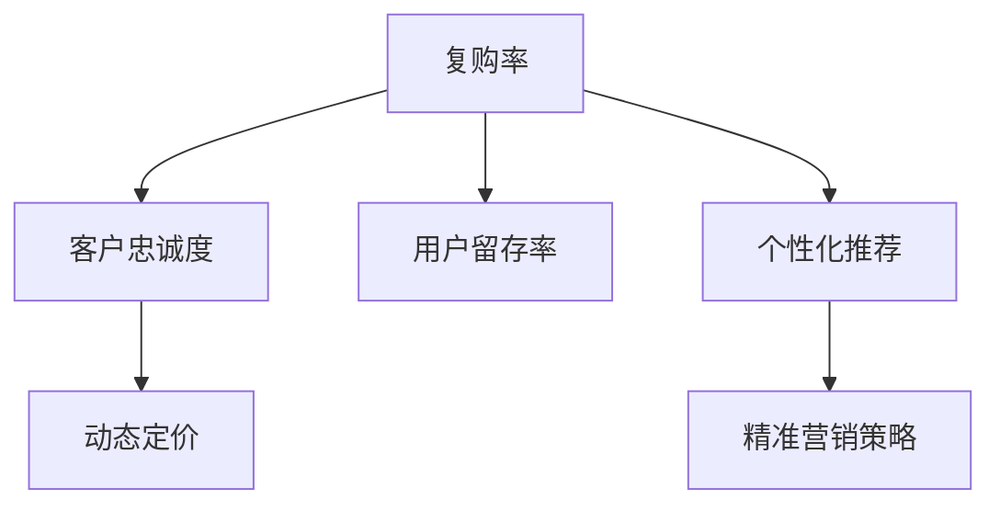

                 

# 用户复购角度的供给机会

> 关键词：复购率、客户忠诚度、用户留存、个性化推荐、动态定价、营销策略

## 1. 背景介绍

### 1.1 问题由来

在当今激烈的市场竞争中，企业之间的竞争已从产品本身的竞争转向用户体验和客户忠诚度的竞争。复购率的提升是提升客户忠诚度和提升企业利润的重要途径之一。但随着市场的变化，企业的经营环境和客户需求也在不断变化，因此，企业需要动态调整其产品、服务和营销策略，以满足客户需求。然而，传统客户管理方式需要大量人力、物力和时间成本，且无法实时响应市场变化，难以实现精准的客户需求洞察。

### 1.2 问题核心关键点

面对客户需求的多样性和变化性，如何通过数据驱动的方式，实现个性化推荐、动态定价和精准营销策略，从而提升用户复购率和客户忠诚度，成为企业关注的焦点。

## 2. 核心概念与联系

### 2.1 核心概念概述

为更好地理解如何通过数据驱动的方式提升用户复购率和客户忠诚度，本节将介绍几个密切相关的核心概念：

- **复购率（Re-purchase Rate）**：指消费者在一定时间内，再次购买同一产品的比例。高复购率表明消费者对品牌的忠诚度高，愿意反复购买同一产品。

- **客户忠诚度（Customer Loyalty）**：指客户对品牌的认同感和对品牌产品或服务的满意度。高忠诚度客户通常愿意在下次购买时选择同一品牌。

- **用户留存率（User Retention Rate）**：指用户在一段时间内继续使用产品的比例。高用户留存率表明用户对产品的满意度，愿意继续使用产品。

- **个性化推荐（Personalized Recommendation）**：根据用户的历史行为、兴趣和偏好，提供符合用户需求的产品推荐。个性化推荐可以提高用户满意度，提升复购率。

- **动态定价（Dynamic Pricing）**：根据市场需求、竞争状况、用户行为等因素，实时调整产品价格，以最大化企业收益。动态定价策略可以提升用户满意度，增强用户购买意愿。

- **精准营销策略（Targeted Marketing Strategy）**：通过数据分析和机器学习技术，识别潜在用户，推送合适的营销信息，提高营销效率和用户转化率。

这些核心概念之间的逻辑关系可以通过以下Mermaid流程图来展示：



这个流程图展示了这些核心概念之间的联系：

1. 复购率是衡量客户忠诚度和用户留存率的重要指标。
2. 个性化推荐可以提升用户满意度，进而提升复购率。
3. 动态定价策略可以提升用户购买意愿，进一步提高复购率。
4. 精准营销策略可以提高营销效率，吸引更多潜在用户，提升复购率。

## 3. 核心算法原理 & 具体操作步骤

### 3.1 算法原理概述

通过数据驱动的方式提升用户复购率和客户忠诚度，本质上是一个有监督的特征工程和机器学习过程。其核心思想是：

- **特征工程**：收集并加工用户的各类数据（如历史购买记录、浏览行为、评价反馈等），提取与复购相关的特征。
- **机器学习**：基于提取的特征，构建模型（如回归模型、分类模型、序列模型等），预测用户复购概率，优化营销策略和定价策略。
- **动态调整**：实时监测用户行为和市场变化，动态调整模型参数和策略，以适应市场变化，提高营销效果和用户满意度。

### 3.2 算法步骤详解

基于上述思路，提升用户复购率和客户忠诚度的数据驱动方法主要包括以下几个关键步骤：

**Step 1: 数据收集与预处理**
- 收集用户的历史行为数据，如购买记录、浏览行为、评价反馈等。
- 对数据进行清洗和预处理，去除噪声和缺失值，标准化数据格式。

**Step 2: 特征工程**
- 设计特征提取指标，如用户历史购买次数、浏览时长、评价评分等。
- 使用统计学和机器学习技术，对特征进行降维、归一化等处理，以提高模型训练效率。

**Step 3: 模型选择与训练**
- 根据数据类型和任务需求，选择合适的模型，如回归模型、分类模型、序列模型等。
- 在训练集上训练模型，优化模型参数，确保模型准确性和泛化能力。

**Step 4: 模型评估与优化**
- 在验证集上评估模型性能，使用各种指标（如准确率、召回率、ROC曲线等）衡量模型效果。
- 根据评估结果，调整模型参数和特征选择策略，优化模型性能。

**Step 5: 实时动态调整**
- 实时监测用户行为和市场变化，根据实时数据动态调整模型参数和策略。
- 使用A/B测试等方法，验证策略效果，优化营销效果。

### 3.3 算法优缺点

基于上述思路的数据驱动方法具有以下优点：
1. 数据驱动：通过收集和分析用户数据，提升个性化推荐和动态定价策略的有效性。
2. 实时调整：可以实时监测市场变化，动态调整策略，提升营销效果。
3. 高效率：机器学习算法可以快速处理海量数据，提升决策效率。

但同时，该方法也存在一些局限性：
1. 数据隐私：收集和处理用户数据时需要关注隐私保护问题。
2. 数据质量：数据清洗和预处理需要大量人力和时间成本。
3. 模型复杂性：复杂模型训练复杂，需要较高的计算资源。
4. 策略局限：模型效果依赖于数据质量和特征工程，可能存在过拟合或欠拟合问题。

尽管存在这些局限性，但通过合理的数据管理和特征工程，可以最大化利用数据价值，提升用户复购率和客户忠诚度。

### 3.4 算法应用领域

基于上述思路的数据驱动方法，广泛应用于电商、金融、旅游、保险等多个行业，用于提升用户复购率和客户忠诚度。

- **电商行业**：电商平台通过个性化推荐和动态定价策略，提升用户购买率和复购率，增强用户粘性。
- **金融行业**：金融机构通过客户忠诚度评分和精准营销策略，提升客户留存率和金融产品销售量。
- **旅游行业**：旅游平台通过用户行为分析，提供个性化旅游线路推荐，提升用户满意度和复购率。
- **保险行业**：保险公司通过客户评价和需求分析，提供精准的产品推荐和定价策略，提高客户满意度和复购率。

## 4. 数学模型和公式 & 详细讲解 & 举例说明

### 4.1 数学模型构建

本节将使用数学语言对提升用户复购率和客户忠诚度的数据驱动方法进行更加严格的刻画。

记用户历史行为数据为 $D=\{(x_i,y_i)\}_{i=1}^N$，其中 $x_i$ 为行为特征，$y_i$ 为复购标记（1表示复购，0表示未复购）。

定义复购概率预测模型为 $f(x_i)=P(y_i=1|x_i)$，使用概率回归模型进行建模，模型形式为 $f(x_i)=\sigma(Wx_i+b)$，其中 $W$ 和 $b$ 为模型参数，$\sigma$ 为 sigmoid 函数。

复购概率预测的目标是最小化预测误差：

$$
\min_{W,b} \sum_{i=1}^N \ell(f(x_i),y_i)
$$

其中 $\ell$ 为损失函数，常用的损失函数包括均方误差（MSE）、对数损失（Log Loss）等。

### 4.2 公式推导过程

以对数损失（Log Loss）为例，推导概率回归模型的优化公式：

$$
L(f(x_i),y_i) = -[y_i\log f(x_i)+(1-y_i)\log(1-f(x_i))]
$$

目标函数为：

$$
\min_{W,b} \sum_{i=1}^N L(f(x_i),y_i)
$$

使用梯度下降法求解：

$$
\begin{aligned}
&\frac{\partial L}{\partial W} = \sum_{i=1}^N [f(x_i)-y_i]x_i\\
&\frac{\partial L}{\partial b} = \sum_{i=1}^N [f(x_i)-y_i]
\end{aligned}
$$

求解得：

$$
\begin{aligned}
&W \leftarrow W - \eta \frac{\partial L}{\partial W}\\
&b \leftarrow b - \eta \frac{\partial L}{\partial b}
\end{aligned}
$$

其中 $\eta$ 为学习率。

### 4.3 案例分析与讲解

考虑一个电商平台的数据驱动决策案例：

假设该平台有 $N$ 个用户，收集了用户的购买记录、浏览行为和评价反馈等数据。用户 $i$ 的复购概率表示为 $f(x_i)$，其中 $x_i$ 包括购买次数、浏览时长、评价评分等特征。

通过概率回归模型 $f(x_i)=\sigma(Wx_i+b)$ 进行预测，目标是最小化对数损失：

$$
\min_{W,b} \sum_{i=1}^N L(f(x_i),y_i)
$$

具体步骤如下：

1. **数据准备**：收集用户的购买记录、浏览行为和评价反馈等数据，进行清洗和预处理，去除噪声和缺失值，标准化数据格式。
2. **特征工程**：设计特征提取指标，如用户历史购买次数、浏览时长、评价评分等，使用统计学和机器学习技术，对特征进行降维、归一化等处理。
3. **模型训练**：在训练集上训练模型，使用梯度下降法优化模型参数，确保模型准确性和泛化能力。
4. **模型评估**：在验证集上评估模型性能，使用准确率、召回率、ROC曲线等指标衡量模型效果。
5. **动态调整**：实时监测用户行为和市场变化，根据实时数据动态调整模型参数和策略，提升营销效果。

## 5. 项目实践：代码实例和详细解释说明

### 5.1 开发环境搭建

在进行数据驱动决策的实践前，我们需要准备好开发环境。以下是使用Python进行Pandas、Scikit-learn和XGBoost开发的环境配置流程：

1. 安装Anaconda：从官网下载并安装Anaconda，用于创建独立的Python环境。

2. 创建并激活虚拟环境：
```bash
conda create -n data-analysis-env python=3.8 
conda activate data-analysis-env
```

3. 安装必要的库：
```bash
conda install pandas scikit-learn xgboost
```

4. 安装Jupyter Notebook：
```bash
conda install jupyter notebook
```

完成上述步骤后，即可在`data-analysis-env`环境中开始项目实践。

### 5.2 源代码详细实现

这里以一个电商平台的复购率预测项目为例，给出使用Pandas、Scikit-learn和XGBoost进行用户复购率预测的Python代码实现。

```python
import pandas as pd
from sklearn.model_selection import train_test_split
from sklearn.ensemble import RandomForestClassifier
from sklearn.metrics import roc_auc_score
from xgboost import XGBClassifier

# 读取数据集
data = pd.read_csv('user_behavior.csv')

# 数据清洗和预处理
data.dropna(inplace=True)
data['purchase_count'] = data['purchase_count'].astype(int)

# 特征工程
X = data[['purchase_count', 'browsing_time', 'review_score']]
y = data['repurchase']

# 划分训练集和验证集
X_train, X_val, y_train, y_val = train_test_split(X, y, test_size=0.2, random_state=42)

# 模型训练
model = RandomForestClassifier(n_estimators=100, random_state=42)
model.fit(X_train, y_train)

# 模型评估
y_pred = model.predict_proba(X_val)[:, 1]
auc = roc_auc_score(y_val, y_pred)
print('AUC: {:.4f}'.format(auc))

# 模型应用
user = pd.DataFrame({'purchase_count': 5, 'browsing_time': 120, 'review_score': 4})
user_pred = model.predict_proba(user[['purchase_count', 'browsing_time', 'review_score']])[:, 1]
print('Predicted Probability: {:.4f}'.format(user_pred))
```

### 5.3 代码解读与分析

让我们再详细解读一下关键代码的实现细节：

**数据准备**：
- 使用Pandas读取用户行为数据集，进行数据清洗和预处理，去除噪声和缺失值，标准化数据格式。
- 对特征进行类型转换和归一化处理，确保模型能够有效处理特征。

**特征工程**：
- 设计特征提取指标，如用户历史购买次数、浏览时长、评价评分等，使用统计学和机器学习技术，对特征进行降维、归一化等处理。
- 根据特征选择算法，选择与复购率相关的特征，如购买次数、浏览时长、评价评分等。

**模型训练**：
- 使用RandomForestClassifier进行模型训练，设置模型参数，如决策树数量、随机种子等。
- 在训练集上训练模型，使用梯度下降法优化模型参数，确保模型准确性和泛化能力。
- 在验证集上评估模型性能，使用ROC曲线下面积（AUC）等指标衡量模型效果。

**模型应用**：
- 根据用户的行为数据，使用训练好的模型进行复购概率预测。
- 将用户的行为数据输入模型，输出复购概率预测结果。

## 6. 实际应用场景

### 6.1 电商行业

电商行业是用户复购率预测的重要应用场景之一。通过分析用户的历史购买行为、浏览行为、评价反馈等数据，电商企业可以预测用户复购概率，采取相应的营销策略，提升用户复购率和忠诚度。

在技术实现上，电商企业可以收集用户的历史购买记录、浏览行为、评价反馈等数据，设计特征提取指标，如购买次数、浏览时长、评价评分等，使用机器学习模型进行复购概率预测。具体步骤如下：

1. **数据收集**：收集用户的历史购买记录、浏览行为、评价反馈等数据，进行清洗和预处理，去除噪声和缺失值，标准化数据格式。
2. **特征工程**：设计特征提取指标，如用户历史购买次数、浏览时长、评价评分等，使用统计学和机器学习技术，对特征进行降维、归一化等处理。
3. **模型训练**：在训练集上训练模型，使用梯度下降法优化模型参数，确保模型准确性和泛化能力。
4. **模型评估**：在验证集上评估模型性能，使用准确率、召回率、ROC曲线等指标衡量模型效果。
5. **动态调整**：实时监测用户行为和市场变化，根据实时数据动态调整模型参数和策略，提升营销效果。

### 6.2 金融行业

金融行业也是用户复购率预测的重要应用场景之一。金融机构通过客户忠诚度评分和精准营销策略，提升客户留存率和金融产品销售量。

在技术实现上，金融机构可以收集客户的金融交易记录、评价反馈等数据，设计特征提取指标，如交易次数、评价评分等，使用机器学习模型进行客户留存率预测。具体步骤如下：

1. **数据收集**：收集客户的金融交易记录、评价反馈等数据，进行清洗和预处理，去除噪声和缺失值，标准化数据格式。
2. **特征工程**：设计特征提取指标，如交易次数、评价评分等，使用统计学和机器学习技术，对特征进行降维、归一化等处理。
3. **模型训练**：在训练集上训练模型，使用梯度下降法优化模型参数，确保模型准确性和泛化能力。
4. **模型评估**：在验证集上评估模型性能，使用准确率、召回率、ROC曲线等指标衡量模型效果。
5. **动态调整**：实时监测用户行为和市场变化，根据实时数据动态调整模型参数和策略，提升营销效果。

### 6.3 旅游行业

旅游行业也是用户复购率预测的重要应用场景之一。旅游平台通过用户行为分析，提供个性化旅游线路推荐，提升用户满意度和复购率。

在技术实现上，旅游平台可以收集用户的浏览行为、评价反馈等数据，设计特征提取指标，如浏览时长、评价评分等，使用机器学习模型进行复购概率预测。具体步骤如下：

1. **数据收集**：收集用户的浏览行为、评价反馈等数据，进行清洗和预处理，去除噪声和缺失值，标准化数据格式。
2. **特征工程**：设计特征提取指标，如浏览时长、评价评分等，使用统计学和机器学习技术，对特征进行降维、归一化等处理。
3. **模型训练**：在训练集上训练模型，使用梯度下降法优化模型参数，确保模型准确性和泛化能力。
4. **模型评估**：在验证集上评估模型性能，使用准确率、召回率、ROC曲线等指标衡量模型效果。
5. **动态调整**：实时监测用户行为和市场变化，根据实时数据动态调整模型参数和策略，提升营销效果。

## 7. 工具和资源推荐

### 7.1 学习资源推荐

为了帮助开发者系统掌握用户复购率预测的理论基础和实践技巧，这里推荐一些优质的学习资源：

1. **《Python数据分析》**：全面介绍Python在数据分析中的应用，包括Pandas、NumPy、Matplotlib等库的使用。
2. **《机器学习实战》**：通过实践案例，介绍机器学习模型的构建和评估方法。
3. **《深度学习》**：介绍深度学习模型的构建和优化方法，涵盖回归、分类、序列模型等。
4. **Kaggle**：在线数据科学竞赛平台，提供大量的数据集和模型评估案例，可以用于实践和验证。
5. **Coursera**：在线学习平台，提供各类机器学习课程，涵盖Pandas、Scikit-learn、TensorFlow等。

通过对这些资源的学习实践，相信你一定能够快速掌握用户复购率预测的精髓，并用于解决实际的NLP问题。

### 7.2 开发工具推荐

高效的开发离不开优秀的工具支持。以下是几款用于用户复购率预测开发的常用工具：

1. **Jupyter Notebook**：免费的交互式编程环境，支持多种语言和库，可以方便地进行模型开发和实验。
2. **Pandas**：用于数据处理和分析的Python库，支持数据清洗、降维、归一化等操作。
3. **Scikit-learn**：用于机器学习和模型评估的Python库，支持各类回归、分类、序列模型等。
4. **XGBoost**：高效的梯度提升模型，支持大规模数据处理和高效模型训练。
5. **TensorFlow**：深度学习框架，支持多种神经网络模型的构建和训练。

合理利用这些工具，可以显著提升用户复购率预测的开发效率，加快创新迭代的步伐。

### 7.3 相关论文推荐

用户复购率预测的相关研究源于学界的持续研究。以下是几篇奠基性的相关论文，推荐阅读：

1. **《A Survey of Recommender Systems》**：综述了推荐系统的理论和算法，介绍了各类推荐算法和评估指标。
2. **《Customer Lifetime Value: A Method for Estimating the Net Present Value of a Customer Relationship》**：介绍了客户生命周期价值的计算方法，用于评估客户价值和忠诚度。
3. **《Trust-Based Recommender Systems》**：介绍了基于信任的推荐系统，用于提升推荐系统的可信度和效果。
4. **《Dynamic Pricing with Adaptive Price-Making Mechanisms》**：介绍了动态定价模型，用于优化价格策略，提升销售收入。

这些论文代表了大语言模型微调技术的发展脉络。通过学习这些前沿成果，可以帮助研究者把握学科前进方向，激发更多的创新灵感。

## 8. 总结：未来发展趋势与挑战

### 8.1 总结

本文对提升用户复购率和客户忠诚度的数据驱动方法进行了全面系统的介绍。首先阐述了用户复购率、客户忠诚度、用户留存率、个性化推荐、动态定价和精准营销策略等核心概念，明确了数据驱动在提升用户复购率和客户忠诚度中的重要作用。其次，从原理到实践，详细讲解了机器学习模型的构建和训练过程，给出了数据驱动决策的完整代码实例。同时，本文还广泛探讨了数据驱动方法在电商、金融、旅游等多个行业领域的应用前景，展示了数据驱动方法的广泛应用潜力。

通过本文的系统梳理，可以看到，数据驱动方法在提升用户复购率和客户忠诚度方面的巨大前景。这些方法能够通过数据挖掘和机器学习技术，实现个性化的推荐和动态定价，从而提升用户满意度和复购率。未来，随着数据规模的不断增大和技术的不断进步，数据驱动方法将能够更好地应用于各种场景，为企业的用户复购和客户忠诚度提升提供强有力的支持。

### 8.2 未来发展趋势

展望未来，数据驱动方法在提升用户复购率和客户忠诚度方面将呈现以下几个发展趋势：

1. **多模态融合**：数据驱动方法将进一步拓展到图像、视频、语音等多模态数据融合，提升用户理解能力和推荐效果。
2. **实时数据处理**：通过流数据处理技术，实现实时数据采集和处理，提升决策效率和效果。
3. **个性化推荐算法**：深度学习算法在推荐系统中的应用将更加广泛，能够更好地处理复杂推荐任务。
4. **动态定价算法**：优化算法在动态定价中的应用将更加深入，能够更好地实现市场匹配和价格优化。
5. **精准营销技术**：通过数据分析和机器学习技术，实现精准营销，提升用户转化率和忠诚度。

这些趋势展示了数据驱动方法在提升用户复购率和客户忠诚度方面的巨大潜力，相信随着技术的不断发展，数据驱动方法将能够更好地应用于各种场景，为企业的用户复购和客户忠诚度提升提供强有力的支持。

### 8.3 面临的挑战

尽管数据驱动方法在提升用户复购率和客户忠诚度方面取得了显著成效，但在实现过程中仍面临诸多挑战：

1. **数据隐私保护**：在收集和处理用户数据时，需要严格遵守数据隐私保护法律法规，确保用户数据的安全和隐私。
2. **数据质量问题**：数据清洗和预处理需要大量人力和时间成本，数据质量问题可能会影响模型效果。
3. **模型复杂性**：复杂模型训练复杂，需要较高的计算资源，模型效果依赖于数据质量和特征工程。
4. **模型鲁棒性**：模型效果依赖于数据质量和特征工程，可能存在过拟合或欠拟合问题。

尽管存在这些挑战，但通过合理的数据管理和特征工程，可以最大化利用数据价值，提升用户复购率和客户忠诚度。

### 8.4 研究展望

面对数据驱动方法在提升用户复购率和客户忠诚度方面面临的挑战，未来的研究需要在以下几个方面寻求新的突破：

1. **数据隐私保护技术**：开发更加高效的数据隐私保护技术，确保用户数据的安全和隐私。
2. **数据清洗和预处理技术**：开发更加高效的数据清洗和预处理技术，提升数据质量。
3. **模型简化技术**：开发更加高效的模型简化技术，减少模型复杂性，提升模型训练效率。
4. **模型鲁棒性技术**：开发更加鲁棒的模型，提升模型的泛化能力和抗干扰能力。
5. **实时数据处理技术**：开发实时数据处理技术，实现实时数据采集和处理，提升决策效率和效果。

这些研究方向将引领数据驱动方法在提升用户复购率和客户忠诚度方面的进一步发展，为企业的用户复购和客户忠诚度提升提供更加强有力的支持。

## 9. 附录：常见问题与解答

**Q1：如何提升用户复购率和客户忠诚度？**

A: 提升用户复购率和客户忠诚度，需要从多个方面入手：

1. **个性化推荐**：通过分析用户的历史行为和兴趣，提供个性化推荐，提升用户满意度。
2. **动态定价**：根据市场需求、竞争状况、用户行为等因素，实时调整产品价格，以最大化企业收益。
3. **精准营销策略**：通过数据分析和机器学习技术，识别潜在用户，推送合适的营销信息，提高营销效率和用户转化率。
4. **用户留存率**：通过提升用户留存率，增加用户粘性，提升复购率。

通过这些手段，企业可以全面提升用户复购率和客户忠诚度。

**Q2：如何选择合适的数据驱动方法？**

A: 选择合适的数据驱动方法，需要考虑以下几个因素：

1. **数据规模**：数据规模越大，越适合使用复杂模型，如深度学习模型。
2. **任务类型**：不同的任务类型需要不同的模型，如回归任务适合使用线性回归模型，分类任务适合使用分类模型。
3. **实时性要求**：需要实时处理数据的任务，适合使用流数据处理技术，如Apache Kafka。
4. **计算资源**：计算资源丰富的企业，可以采用深度学习模型，计算资源有限的企业，可以采用简单模型或半监督学习方法。

通过合理选择数据驱动方法，可以更好地应对不同场景下的用户复购和客户忠诚度提升需求。

**Q3：如何评估数据驱动方法的效果？**

A: 评估数据驱动方法的效果，需要考虑以下几个指标：

1. **准确率**：模型预测结果与真实结果的匹配度。
2. **召回率**：模型预测出的正例数量与真实正例数量的匹配度。
3. **ROC曲线**：衡量模型在不同阈值下的性能，通常以AUC（Area Under Curve）表示。
4. **F1分数**：综合考虑准确率和召回率，衡量模型整体性能。

通过这些指标，可以全面评估数据驱动方法的效果，并根据评估结果进行优化。

**Q4：如何进行数据隐私保护？**

A: 数据隐私保护可以通过以下几个方法实现：

1. **数据匿名化**：对用户数据进行匿名化处理，去除敏感信息。
2. **差分隐私**：通过在模型训练中加入噪声，确保模型输出与原始数据的关系不可逆。
3. **联邦学习**：在多个设备上分布式训练模型，确保数据不出本地。

通过这些方法，可以确保用户数据的安全和隐私，满足数据隐私保护法律法规。

**Q5：如何进行数据清洗和预处理？**

A: 数据清洗和预处理可以通过以下几个步骤实现：

1. **数据去重**：去除重复数据，避免数据冗余。
2. **数据补全**：填补缺失数据，确保数据完整性。
3. **数据标准化**：对数据进行标准化处理，确保数据一致性。
4. **数据降维**：对数据进行降维处理，减少数据维度，提升模型训练效率。

通过这些步骤，可以确保数据质量，提升模型效果。

**Q6：如何进行模型简化？**

A: 模型简化可以通过以下几个方法实现：

1. **特征选择**：选择与目标变量相关的特征，去除无关特征。
2. **模型剪枝**：对模型进行剪枝，去除冗余参数，提升模型训练效率。
3. **模型压缩**：对模型进行压缩，减少存储空间，提升推理速度。

通过这些方法，可以简化模型，减少计算资源消耗，提升模型训练效率和推理速度。

**Q7：如何进行模型鲁棒性提升？**

A: 模型鲁棒性提升可以通过以下几个方法实现：

1. **正则化**：通过L1或L2正则化，防止模型过拟合。
2. **对抗训练**：通过对抗样本训练，提升模型鲁棒性。
3. **数据增强**：通过数据增强，提升模型泛化能力。

通过这些方法，可以提升模型鲁棒性，提高模型泛化能力和抗干扰能力。

**Q8：如何进行实时数据处理？**

A: 实时数据处理可以通过以下几个方法实现：

1. **流数据处理**：使用流数据处理技术，实时处理数据，如Apache Kafka、Apache Flink。
2. **实时监控**：实时监控数据流，及时发现异常情况。
3. **数据缓存**：使用数据缓存技术，提高数据处理效率。

通过这些方法，可以实现实时数据处理，提升决策效率和效果。

**Q9：如何进行用户留存率提升？**

A: 用户留存率提升可以通过以下几个方法实现：

1. **个性化服务**：通过个性化服务，提升用户满意度。
2. **定期回访**：定期回访用户，了解用户需求和反馈。
3. **优惠活动**：通过优惠活动，吸引用户复购。

通过这些方法，可以提升用户留存率，增加用户粘性，提升复购率。

---

作者：禅与计算机程序设计艺术 / Zen and the Art of Computer Programming

