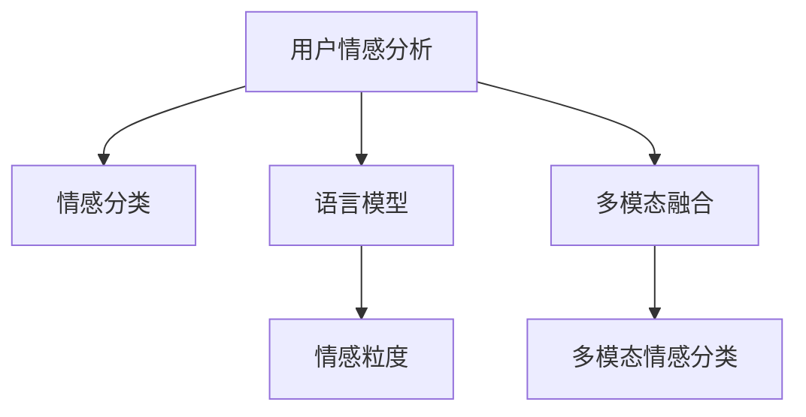

                 

# 用户情感分析的技术优化

> 关键词：用户情感分析, 情感分类, 文本情感, 深度学习, 自然语言处理, 语言模型, 表情识别, 多模态融合

## 1. 背景介绍

### 1.1 问题由来

随着互联网和移动通信技术的发展，用户生成内容（User-Generated Content, UGC）的规模日益增长，覆盖了社交媒体、在线评论、产品评价等多个领域。情感分析（Sentiment Analysis）作为自然语言处理（NLP）的重要分支，旨在自动检测和分类文本中的情感倾向，对于理解用户需求、监测产品舆情、优化用户体验等方面具有重要意义。

然而，现有的情感分析技术仍存在诸多局限性，难以应对复杂多变的用户情感表达。具体表现在：

1. **语言多样性**：不同语言和文化背景下，情感表达方式存在显著差异。
2. **情感粒度**：情感不仅局限于积极或消极二分类，更细微的情感粒度难以识别。
3. **文本噪声**：用户生成内容常包含噪声、讽刺、多义性等复杂因素，影响情感分析的准确性。
4. **跨模态融合**：仅依赖文本数据进行情感分析，难以捕捉文本之外的情感线索（如语音、视频、表情等）。

为应对这些挑战，本文将从技术角度探讨情感分析的优化策略，包括选择合适的语言模型、改进情感分类方法、引入多模态融合等，以期提升情感分析的精度和泛化能力。

### 1.2 问题核心关键点

本文重点讨论以下几个核心问题：

- 如何选择合适的语言模型，以便更好地捕捉情感线索。
- 如何改进情感分类算法，提高情感识别的粒度和准确性。
- 如何在多模态情境下，融合文本、语音、表情等多种信息，提升情感分析的全面性和鲁棒性。

## 2. 核心概念与联系

### 2.1 核心概念概述

为更好地理解用户情感分析的技术优化，本节将介绍几个密切相关的核心概念：

- **用户情感分析（User Sentiment Analysis）**：通过分析用户生成内容，自动识别和分类文本中的情感倾向。

- **情感分类（Sentiment Classification）**：将文本情感划分为积极、消极或中性等类别。

- **语言模型（Language Model）**：基于大规模语料训练得到的概率分布模型，用于捕捉文本中的语言规律。

- **情感粒度（Sentiment Granularity）**：情感分类的粒度级别，如积极、消极、喜欢、愤怒等。

- **多模态融合（Multimodal Fusion）**：在情感分析中，融合文本、语音、表情等不同模态的信息，提升情感识别的全面性和准确性。

这些核心概念之间的逻辑关系可以通过以下Mermaid流程图来展示：



这个流程图展示了大语言模型的情感分析的核心概念及其之间的关系：

1. 用户情感分析通过语言模型捕捉文本中的情感线索。
2. 情感分类算法根据语言模型输出的概率分布，识别情感类别。
3. 情感粒度提升分类粒度，更细致地刻画情感。
4. 多模态融合引入多种信息源，提升情感识别的准确性。

## 3. 核心算法原理 & 具体操作步骤
### 3.1 算法原理概述

情感分析本质上是一种有监督的文本分类任务，其核心思想是：将文本作为输入，通过训练好的模型预测其情感类别。模型通常通过预训练语言模型（如BERT、GPT等）获得语言表示，再使用分类算法（如逻辑回归、支持向量机等）进行分类。

形式化地，假设文本数据集为 $D=\{(x_i,y_i)\}_{i=1}^N$，其中 $x_i$ 为文本，$y_i$ 为情感标签，$y_i \in \{Positive, Negative, Neutral\}$。情感分析的目标是找到最优的分类器 $f(x)$，使得在测试集上的分类误差最小化：

$$
\min_{f} \frac{1}{N} \sum_{i=1}^N \mathbb{I}(f(x_i) \neq y_i)
$$

其中 $\mathbb{I}$ 为示性函数，表示预测错误时的误差。

### 3.2 算法步骤详解

基于语言模型的情感分析一般包括以下几个关键步骤：

**Step 1: 准备数据集和模型**

- 收集与任务相关的标注数据集 $D$，一般要求数据集标注准确、分布均衡。
- 选择合适的预训练语言模型 $M_{\theta}$，如BERT、GPT等，作为特征提取器。
- 加载模型权重，并进行必要的模型初始化。

**Step 2: 添加情感分类层**

- 根据情感分类任务，在预训练模型的顶层设计情感分类器，一般使用线性分类器或Transformer的分类头。
- 设置损失函数，如交叉熵损失、F1分数等。

**Step 3: 设置模型超参数**

- 选择合适的优化算法及其参数，如Adam、SGD等，设置学习率、批大小、迭代轮数等。
- 设置正则化技术及强度，包括权重衰减、Dropout、Early Stopping等。

**Step 4: 执行梯度训练**

- 将训练集数据分批次输入模型，前向传播计算损失函数。
- 反向传播计算参数梯度，根据设定的优化算法和学习率更新模型参数。
- 周期性在验证集上评估模型性能，根据性能指标决定是否触发Early Stopping。
- 重复上述步骤直到满足预设的迭代轮数或Early Stopping条件。

**Step 5: 测试和部署**

- 在测试集上评估微调后模型 $M_{\hat{\theta}}$ 的性能，对比微调前后的精度提升。
- 使用微调后的模型对新样本进行情感分类，集成到实际的应用系统中。
- 持续收集新的数据，定期重新微调模型，以适应数据分布的变化。

以上是基于语言模型的情感分析的一般流程。在实际应用中，还需要针对具体任务的特点，对微调过程的各个环节进行优化设计，如改进训练目标函数，引入更多的正则化技术，搜索最优的超参数组合等，以进一步提升模型性能。

### 3.3 算法优缺点

基于语言模型的情感分析方法具有以下优点：

1. 简单高效。只需准备少量标注数据，即可对预训练模型进行快速适配，获得较大的性能提升。
2. 通用适用。适用于各种NLP下游任务，包括分类、匹配、生成等，设计简单的任务适配层即可实现情感分析。
3. 效果显著。在学术界和工业界的诸多任务上，基于情感分析的方法已经刷新了最先进的性能指标。

同时，该方法也存在一定的局限性：

1. 依赖标注数据。情感分析的效果很大程度上取决于标注数据的质量和数量，获取高质量标注数据的成本较高。
2. 迁移能力有限。当目标任务与预训练数据的分布差异较大时，情感分析的性能提升有限。
3. 可解释性不足。情感分析模型的决策过程通常缺乏可解释性，难以对其推理逻辑进行分析和调试。

尽管存在这些局限性，但就目前而言，基于语言模型的情感分析方法仍是大语言模型应用的主流范式。未来相关研究的重点在于如何进一步降低情感分析对标注数据的依赖，提高模型的少样本学习和跨领域迁移能力，同时兼顾可解释性和伦理安全性等因素。

### 3.4 算法应用领域

基于语言模型的情感分析方法在NLP领域已经得到了广泛的应用，覆盖了几乎所有常见任务，例如：

- 文本情感分析：如电影评论、产品评论、社交媒体帖子的情感倾向识别。
- 多模态情感分析：如结合语音、表情、文本的多模态情感分类。
- 社交舆情监测：如监测社交媒体上的情感变化趋势，及时发现舆情危机。
- 广告效果评估：如评估广告文案的情感吸引力，优化广告投放策略。

除了上述这些经典任务外，情感分析技术还被创新性地应用到更多场景中，如情感化推荐、情感计算、用户满意度调查等，为NLP技术带来了全新的突破。随着预训练模型和情感分析方法的不断进步，相信情感分析技术将在更广阔的应用领域大放异彩。

## 4. 数学模型和公式 & 详细讲解  
### 4.1 数学模型构建

本节将使用数学语言对基于语言模型的情感分析过程进行更加严格的刻画。

假设预训练语言模型为 $M_{\theta}:\mathcal{X} \rightarrow \mathcal{Y}$，其中 $\mathcal{X}$ 为输入空间，$\mathcal{Y}$ 为输出空间，$\theta \in \mathbb{R}^d$ 为模型参数。假设情感分类任务训练集为 $D=\{(x_i,y_i)\}_{i=1}^N$，其中 $y_i \in \{Positive, Negative, Neutral\}$。

定义模型 $M_{\theta}$ 在输入 $x$ 上的情感分类器为 $f(x)=\sigma(W^Tx+b)$，其中 $W$ 和 $b$ 为分类器的权重和偏置。情感分类器的损失函数为交叉熵损失函数：

$$
\ell(M_{\theta}(x),y) = -[y\log M_{\theta}(x)+(1-y)\log (1-M_{\theta}(x))]
$$

则经验风险为：

$$
\mathcal{L}(\theta) = -\frac{1}{N}\sum_{i=1}^N \ell(M_{\theta}(x_i),y_i)
$$

其中 $\sigma$ 为Sigmoid函数，$\log$ 为自然对数。

### 4.2 公式推导过程

以下我们以二分类任务为例，推导交叉熵损失函数及其梯度的计算公式。

假设模型 $M_{\theta}$ 在输入 $x$ 上的输出为 $\hat{y}=M_{\theta}(x) \in [0,1]$，表示样本属于正类的概率。真实标签 $y \in \{0,1\}$。则二分类交叉熵损失函数定义为：

$$
\ell(M_{\theta}(x),y) = -[y\log \hat{y} + (1-y)\log (1-\hat{y})]
$$

将其代入经验风险公式，得：

$$
\mathcal{L}(\theta) = -\frac{1}{N}\sum_{i=1}^N [y_i\log M_{\theta}(x_i)+(1-y_i)\log(1-M_{\theta}(x_i))]
$$

根据链式法则，损失函数对参数 $\theta_k$ 的梯度为：

$$
\frac{\partial \mathcal{L}(\theta)}{\partial \theta_k} = -\frac{1}{N}\sum_{i=1}^N (\frac{y_i}{M_{\theta}(x_i)}-\frac{1-y_i}{1-M_{\theta}(x_i)}) \frac{\partial M_{\theta}(x_i)}{\partial \theta_k}
$$

其中 $\frac{\partial M_{\theta}(x_i)}{\partial \theta_k}$ 可进一步递归展开，利用自动微分技术完成计算。

在得到损失函数的梯度后，即可带入参数更新公式，完成模型的迭代优化。重复上述过程直至收敛，最终得到适应情感分类任务的最优模型参数 $\theta^*$。

## 5. 项目实践：代码实例和详细解释说明
### 5.1 开发环境搭建

在进行情感分析实践前，我们需要准备好开发环境。以下是使用Python进行PyTorch开发的环境配置流程：

1. 安装Anaconda：从官网下载并安装Anaconda，用于创建独立的Python环境。

2. 创建并激活虚拟环境：
```bash
conda create -n pytorch-env python=3.8 
conda activate pytorch-env
```

3. 安装PyTorch：根据CUDA版本，从官网获取对应的安装命令。例如：
```bash
conda install pytorch torchvision torchaudio cudatoolkit=11.1 -c pytorch -c conda-forge
```

4. 安装Transformers库：
```bash
pip install transformers
```

5. 安装各类工具包：
```bash
pip install numpy pandas scikit-learn matplotlib tqdm jupyter notebook ipython
```

完成上述步骤后，即可在`pytorch-env`环境中开始情感分析实践。

### 5.2 源代码详细实现

下面我们以电影评论情感分析任务为例，给出使用Transformers库对BERT模型进行情感分析的PyTorch代码实现。

首先，定义情感分析任务的数据处理函数：

```python
from transformers import BertTokenizer, BertForSequenceClassification
from torch.utils.data import Dataset
import torch

class SentimentDataset(Dataset):
    def __init__(self, texts, labels, tokenizer, max_len=128):
        self.texts = texts
        self.labels = labels
        self.tokenizer = tokenizer
        self.max_len = max_len
        
    def __len__(self):
        return len(self.texts)
    
    def __getitem__(self, item):
        text = self.texts[item]
        label = self.labels[item]
        
        encoding = self.tokenizer(text, return_tensors='pt', max_length=self.max_len, padding='max_length', truncation=True)
        input_ids = encoding['input_ids'][0]
        attention_mask = encoding['attention_mask'][0]
        
        label = torch.tensor(label, dtype=torch.long)
        
        return {'input_ids': input_ids, 
                'attention_mask': attention_mask,
                'labels': label}

# 标签与id的映射
label2id = {'positive': 1, 'negative': 0, 'neutral': 2}
id2label = {v: k for k, v in label2id.items()}

# 创建dataset
tokenizer = BertTokenizer.from_pretrained('bert-base-uncased')

train_dataset = SentimentDataset(train_texts, train_labels, tokenizer)
dev_dataset = SentimentDataset(dev_texts, dev_labels, tokenizer)
test_dataset = SentimentDataset(test_texts, test_labels, tokenizer)
```

然后，定义模型和优化器：

```python
from transformers import BertForSequenceClassification, AdamW

model = BertForSequenceClassification.from_pretrained('bert-base-uncased', num_labels=3)

optimizer = AdamW(model.parameters(), lr=2e-5)
```

接着，定义训练和评估函数：

```python
from torch.utils.data import DataLoader
from tqdm import tqdm
from sklearn.metrics import accuracy_score, precision_recall_fscore_support

device = torch.device('cuda') if torch.cuda.is_available() else torch.device('cpu')
model.to(device)

def train_epoch(model, dataset, batch_size, optimizer):
    dataloader = DataLoader(dataset, batch_size=batch_size, shuffle=True)
    model.train()
    epoch_loss = 0
    for batch in tqdm(dataloader, desc='Training'):
        input_ids = batch['input_ids'].to(device)
        attention_mask = batch['attention_mask'].to(device)
        labels = batch['labels'].to(device)
        model.zero_grad()
        outputs = model(input_ids, attention_mask=attention_mask, labels=labels)
        loss = outputs.loss
        epoch_loss += loss.item()
        loss.backward()
        optimizer.step()
    return epoch_loss / len(dataloader)

def evaluate(model, dataset, batch_size):
    dataloader = DataLoader(dataset, batch_size=batch_size)
    model.eval()
    preds, labels = [], []
    with torch.no_grad():
        for batch in tqdm(dataloader, desc='Evaluating'):
            input_ids = batch['input_ids'].to(device)
            attention_mask = batch['attention_mask'].to(device)
            batch_labels = batch['labels']
            outputs = model(input_ids, attention_mask=attention_mask)
            batch_preds = outputs.logits.argmax(dim=1).to('cpu').tolist()
            batch_labels = batch_labels.to('cpu').tolist()
            for pred, label in zip(batch_preds, batch_labels):
                preds.append(pred)
                labels.append(label)
                
    acc = accuracy_score(labels, preds)
    precision, recall, f1, _ = precision_recall_fscore_support(labels, preds, average='macro')
    
    print(f"Accuracy: {acc:.3f}")
    print(f"Precision: {precision:.3f}")
    print(f"Recall: {recall:.3f}")
    print(f"F1 Score: {f1:.3f}")

```

最后，启动训练流程并在测试集上评估：

```python
epochs = 5
batch_size = 16

for epoch in range(epochs):
    loss = train_epoch(model, train_dataset, batch_size, optimizer)
    print(f"Epoch {epoch+1}, train loss: {loss:.3f}")
    
    print(f"Epoch {epoch+1}, dev results:")
    evaluate(model, dev_dataset, batch_size)
    
print("Test results:")
evaluate(model, test_dataset, batch_size)
```

以上就是使用PyTorch对BERT进行情感分析任务开发的完整代码实现。可以看到，得益于Transformers库的强大封装，我们可以用相对简洁的代码完成BERT模型的加载和情感分析。

### 5.3 代码解读与分析

让我们再详细解读一下关键代码的实现细节：

**SentimentDataset类**：
- `__init__`方法：初始化文本、标签、分词器等关键组件。
- `__len__`方法：返回数据集的样本数量。
- `__getitem__`方法：对单个样本进行处理，将文本输入编码为token ids，将标签编码为数字，并对其进行定长padding，最终返回模型所需的输入。

**label2id和id2label字典**：
- 定义了标签与数字id之间的映射关系，用于将标签解码回真实的情感标签。

**训练和评估函数**：
- 使用PyTorch的DataLoader对数据集进行批次化加载，供模型训练和推理使用。
- 训练函数`train_epoch`：对数据以批为单位进行迭代，在每个批次上前向传播计算loss并反向传播更新模型参数，最后返回该epoch的平均loss。
- 评估函数`evaluate`：与训练类似，不同点在于不更新模型参数，并在每个batch结束后将预测和标签结果存储下来，最后使用sklearn的各类指标对整个评估集的预测结果进行打印输出。

**训练流程**：
- 定义总的epoch数和batch size，开始循环迭代
- 每个epoch内，先在训练集上训练，输出平均loss
- 在验证集上评估，输出各类指标
- 所有epoch结束后，在测试集上评估，给出最终测试结果

可以看到，PyTorch配合Transformers库使得BERT情感分析的代码实现变得简洁高效。开发者可以将更多精力放在数据处理、模型改进等高层逻辑上，而不必过多关注底层的实现细节。

当然，工业级的系统实现还需考虑更多因素，如模型的保存和部署、超参数的自动搜索、更灵活的任务适配层等。但核心的情感分析范式基本与此类似。

## 6. 实际应用场景
### 6.1 社交舆情监测

社交媒体的实时数据流对舆情监测具有重要价值，但大规模的手动监控不仅成本高昂，而且效率低下。利用情感分析技术，可以自动实时监测社交媒体上的情感变化趋势，及时发现舆情危机，对危机事件进行预警和快速响应。

在技术实现上，可以集成第三方API抓取社交媒体平台上的用户评论和帖子，利用情感分析模型对情感进行识别和分类。对于情感变化剧烈的文本，系统可以自动发送预警信息，相关部门可以迅速介入，采取应急措施。

### 6.2 广告效果评估

在广告投放过程中，了解广告内容对用户的情感影响对于优化广告效果至关重要。通过情感分析技术，可以对用户评论和反馈进行情感分析，评估广告文案的情感吸引力，进而调整投放策略，提高广告的点击率和转化率。

具体而言，可以收集用户对广告的评论和评价，将评论情感分类为积极、消极、中性等类别。通过分析情感分布，可以量化广告对用户情感的影响，判断广告的投放效果，优化广告创意和投放策略。

### 6.3 产品评价与反馈

在线产品评价和反馈是企业了解用户需求的重要渠道。通过情感分析技术，可以自动分析用户对产品的评价文本，分类情感倾向，识别用户的满意点和改进点。

具体实现上，可以收集用户对产品的评价和评论，将文本情感分类为积极、消极、中性等类别。对于频繁出现的负面情感标签，可以及时反馈给产品团队，优化产品设计和用户体验。

### 6.4 未来应用展望

随着情感分析技术的不断发展，基于语言模型的情感分析方法将在更多领域得到应用，为社交媒体、广告、产品等垂直行业带来变革性影响。

在智慧城市治理中，情感分析可以用于监测市民情绪变化，评估政策效果，提高城市管理水平。在金融领域，情感分析可以用于舆情监测、投资者情绪分析等，辅助金融决策。

此外，在教育、健康、娱乐等多个领域，情感分析技术也将被广泛应用，为这些领域带来新的发展机遇。随着预训练模型和情感分析方法的不断进步，相信情感分析技术将在更广阔的应用领域大放异彩。

## 7. 工具和资源推荐
### 7.1 学习资源推荐

为了帮助开发者系统掌握情感分析的理论基础和实践技巧，这里推荐一些优质的学习资源：

1. 《Natural Language Processing with PyTorch》书籍：由斯坦福大学教授撰写，系统讲解了使用PyTorch进行NLP任务开发的各个步骤，包括情感分析在内的多种NLP任务。

2. CS229《机器学习》课程：斯坦福大学开设的机器学习明星课程，涵盖了各类机器学习算法和NLP应用，适合基础扎实的学生学习。

3. 《Sentiment Analysis with Transformers》博客系列：由大模型技术专家撰写，深入浅出地介绍了使用Transformer模型进行情感分析的方法和技巧。

4. Kaggle情感分析竞赛：全球知名的数据科学竞赛平台，提供了丰富的情感分析竞赛数据集和基线模型，适合进行实战练习。

5. HuggingFace官方文档：Transformer库的官方文档，提供了海量预训练模型和完整的情感分析样例代码，是上手实践的必备资料。

通过对这些资源的学习实践，相信你一定能够快速掌握情感分析的精髓，并用于解决实际的NLP问题。
###  7.2 开发工具推荐

高效的开发离不开优秀的工具支持。以下是几款用于情感分析开发的常用工具：

1. PyTorch：基于Python的开源深度学习框架，灵活动态的计算图，适合快速迭代研究。大部分预训练语言模型都有PyTorch版本的实现。

2. TensorFlow：由Google主导开发的开源深度学习框架，生产部署方便，适合大规模工程应用。同样有丰富的预训练语言模型资源。

3. Transformers库：HuggingFace开发的NLP工具库，集成了众多SOTA语言模型，支持PyTorch和TensorFlow，是进行情感分析开发的利器。

4. Weights & Biases：模型训练的实验跟踪工具，可以记录和可视化模型训练过程中的各项指标，方便对比和调优。与主流深度学习框架无缝集成。

5. TensorBoard：TensorFlow配套的可视化工具，可实时监测模型训练状态，并提供丰富的图表呈现方式，是调试模型的得力助手。

6. Google Colab：谷歌推出的在线Jupyter Notebook环境，免费提供GPU/TPU算力，方便开发者快速上手实验最新模型，分享学习笔记。

合理利用这些工具，可以显著提升情感分析任务的开发效率，加快创新迭代的步伐。

### 7.3 相关论文推荐

情感分析技术的发展源于学界的持续研究。以下是几篇奠基性的相关论文，推荐阅读：

1. Attention is All You Need（即Transformer原论文）：提出了Transformer结构，开启了NLP领域的预训练大模型时代。

2. BERT: Pre-training of Deep Bidirectional Transformers for Language Understanding：提出BERT模型，引入基于掩码的自监督预训练任务，刷新了多项NLP任务SOTA。

3. Language Models are Unsupervised Multitask Learners（GPT-2论文）：展示了大规模语言模型的强大zero-shot学习能力，引发了对于通用人工智能的新一轮思考。

4. Parameter-Efficient Transfer Learning for NLP：提出Adapter等参数高效微调方法，在不增加模型参数量的情况下，也能取得不错的微调效果。

5. Prompt-Based Transfer Learning for Natural Language Processing：引入基于连续型Prompt的微调范式，为如何充分利用预训练知识提供了新的思路。

6. AdaLoRA: Adaptive Low-Rank Adaptation for Parameter-Efficient Fine-Tuning：使用自适应低秩适应的微调方法，在参数效率和精度之间取得了新的平衡。

这些论文代表了大语言模型情感分析的发展脉络。通过学习这些前沿成果，可以帮助研究者把握学科前进方向，激发更多的创新灵感。

## 8. 总结：未来发展趋势与挑战

### 8.1 总结

本文对基于语言模型的情感分析方法进行了全面系统的介绍。首先阐述了情感分析的背景和意义，明确了情感分析在社交舆情、广告效果评估、产品评价与反馈等场景中的重要应用价值。其次，从原理到实践，详细讲解了情感分析的数学模型和操作步骤，给出了情感分析任务开发的完整代码实例。同时，本文还广泛探讨了情感分析方法在多模态融合、情感粒度提升、模型迁移能力等方面的优化策略，展示了情感分析技术的广阔应用前景。

通过本文的系统梳理，可以看到，基于语言模型的情感分析方法正在成为NLP领域的重要范式，极大地拓展了预训练语言模型的应用边界，催生了更多的落地场景。得益于大规模语料的预训练，情感分析模型以更低的时间和标注成本，在小样本条件下也能取得不俗的效果，有力推动了NLP技术的产业化进程。未来，伴随预训练语言模型和情感分析方法的不断进步，相信情感分析技术将在更广阔的应用领域大放异彩，深刻影响人类的生产生活方式。

### 8.2 未来发展趋势

展望未来，情感分析技术将呈现以下几个发展趋势：

1. 模型规模持续增大。随着算力成本的下降和数据规模的扩张，预训练语言模型的参数量还将持续增长。超大规模语言模型蕴含的丰富语言知识，有望支撑更加复杂多变的情感分析任务。

2. 情感粒度提升。情感分析的目标不仅限于情感分类，还将进一步细化到情感表达的粒度，识别更细微的情感倾向，提升情感分析的精度和适用性。

3. 多模态融合深化。情感分析不仅依赖文本数据，还将进一步融合语音、视频、表情等多模态信息，提升情感识别的全面性和鲁棒性。

4. 跨领域迁移能力增强。情感分析模型将具备更强的跨领域迁移能力，能够适应不同领域、不同文化的情感表达差异，提升模型泛化性。

5. 低资源情感分析方法发展。在资源受限的情况下，如小样本、低算力等场景，情感分析技术将进一步发展低资源学习方法，利用更少的资源进行高效的情感识别。

6. 实时情感分析技术成熟。基于情感分析的实时监控系统将逐步成熟，可以实时分析用户情感变化，及时响应情感波动，提升用户体验和应急响应效率。

以上趋势凸显了情感分析技术的广阔前景。这些方向的探索发展，必将进一步提升情感分析的精度和泛化能力，为社交媒体、广告、产品等多个领域带来更优质的服务。

### 8.3 面临的挑战

尽管情感分析技术已经取得了显著进展，但在迈向更加智能化、普适化应用的过程中，它仍面临着诸多挑战：

1. 标注成本瓶颈。情感分析的效果很大程度上取决于标注数据的质量和数量，获取高质量标注数据的成本较高。如何进一步降低情感分析对标注数据的依赖，将是一大难题。

2. 情感粒度复杂性。情感粒度的提升虽然带来了更高的精度，但也增加了情感分类的复杂性和难度。如何高效处理细微的情感粒度，仍然是一大挑战。

3. 多模态信息整合。在多模态情境下，如何有效融合文本、语音、表情等多种信息，提升情感识别的全面性和鲁棒性，需要更多的技术和方法创新。

4. 跨文化情感差异。不同文化背景下，情感表达方式存在显著差异。如何在多语言、多文化的情境下，保持情感分析的准确性和鲁棒性，仍需深入研究。

5. 实时性要求。实时情感分析系统需要在大规模数据流上快速处理和分析，这对算力、存储和传输等方面提出了更高的要求。如何提高情感分析的实时性，是未来需要解决的重要问题。

6. 鲁棒性问题。情感分析模型面对域外数据时，泛化性能往往大打折扣。对于测试样本的微小扰动，情感分析模型的预测也容易发生波动。如何提高情感分析模型的鲁棒性，避免灾难性遗忘，还需要更多理论和实践的积累。

7. 可解释性不足。情感分析模型的决策过程通常缺乏可解释性，难以对其推理逻辑进行分析和调试。对于医疗、金融等高风险应用，算法的可解释性和可审计性尤为重要。如何赋予情感分析模型更强的可解释性，将是亟待攻克的难题。

8. 安全性有待保障。预训练语言模型难免会学习到有偏见、有害的信息，通过情感分析传递到下游任务，产生误导性、歧视性的输出，给实际应用带来安全隐患。如何从数据和算法层面消除模型偏见，避免恶意用途，确保输出的安全性，也将是重要的研究课题。

这些挑战凸显了情感分析技术在实际应用中的复杂性和多样性，需要在技术、算法、应用等多个层面进行深入研究和优化。只有勇于创新、敢于突破，才能不断拓展情感分析技术的边界，让智能技术更好地造福人类社会。

### 8.4 研究展望

面对情感分析面临的诸多挑战，未来的研究需要在以下几个方面寻求新的突破：

1. 探索无监督和半监督情感分析方法。摆脱对大规模标注数据的依赖，利用自监督学习、主动学习等无监督和半监督范式，最大限度利用非结构化数据，实现更加灵活高效的情感分析。

2. 研究情感粒度提升方法。开发更加精细的情感分类模型，将情感粒度提升到更细微的层面，提升情感识别的精度和适用性。

3. 融合多模态信息。在情感分析中，引入更多的多模态信息，如语音、视频、表情等，提升情感识别的全面性和鲁棒性。

4. 引入符号化的先验知识。将符号化的先验知识，如知识图谱、逻辑规则等，与神经网络模型进行巧妙融合，引导情感分析过程学习更准确、合理的情感表示。

5. 结合因果分析和博弈论工具。将因果分析方法引入情感分析模型，识别出情感分析的关键特征，增强输出解释的因果性和逻辑性。借助博弈论工具刻画人机交互过程，主动探索并规避情感分析模型的脆弱点，提高系统稳定性。

6. 纳入伦理道德约束。在模型训练目标中引入伦理导向的评估指标，过滤和惩罚有偏见、有害的输出倾向。同时加强人工干预和审核，建立情感分析模型的监管机制，确保输出符合人类价值观和伦理道德。

这些研究方向的探索，必将引领情感分析技术迈向更高的台阶，为构建安全、可靠、可解释、可控的智能系统铺平道路。面向未来，情感分析技术还需要与其他人工智能技术进行更深入的融合，如知识表示、因果推理、强化学习等，多路径协同发力，共同推动自然语言理解和智能交互系统的进步。只有勇于创新、敢于突破，才能不断拓展情感分析技术的边界，让智能技术更好地造福人类社会。

## 9. 附录：常见问题与解答

**Q1：情感分析的标注数据如何获取？**

A: 标注数据的获取是情感分析的重要前提。常见的标注数据获取方式包括：
1. 在线收集：从社交媒体、评论平台等在线渠道收集用户评论和反馈，进行人工标注。
2. 公开数据集：利用公开数据集，如IMDB评论数据集、亚马逊产品评论数据集等，进行情感分析任务的微调。
3. 自行标注：对于特定领域或小规模数据集，可以进行人工标注。

**Q2：情感分析的标注数据质量如何保证？**

A: 标注数据的质量直接影响情感分析的效果，需注意以下几点：
1. 标注标准：制定统一的标注标准，避免不同标注者对同一文本情感的判断差异。
2. 标注规范：提供详细的标注规范，指导标注者进行准确标注。
3. 标注工具：使用专业的标注工具，减少人工标注的错误率。
4. 数据校验：定期对标注数据进行校验，确保标注的一致性和准确性。

**Q3：情感分析模型如何迁移学习？**

A: 迁移学习是情感分析模型的重要优化方法，通过预训练大模型获取通用语言表示，在小规模标注数据上进行微调，提高情感分析的泛化能力和性能。
1. 选择合适的预训练模型：使用SOTA的预训练模型，如BERT、GPT等。
2. 微调数据集：根据具体任务，收集并标注少量数据集，用于微调预训练模型。
3. 微调算法：使用小批量梯度下降、学习率调度等技术，对预训练模型进行微调。

**Q4：情感分析模型的参数高效方法有哪些？**

A: 参数高效方法是情感分析中降低计算资源消耗的重要手段，包括以下几种：
1. 微调：只调整模型的一部分参数，保留预训练模型的权重。
2. Adapter：在预训练模型中加入特定领域的Adapter层，减少需要微调的参数。
3. 参数共享：使用共享参数的方式，减少不必要的重复参数。
4. 剪枝和量化：对模型进行剪枝和量化，减少计算量。

**Q5：情感分析模型如何处理文本噪声？**

A: 文本噪声是情感分析中的常见问题，需采用以下方法进行处理：
1. 数据清洗：去除低质量的文本数据，如拼写错误、无关信息等。
2. 去停用词：去除文本中的停用词，减少噪声的影响。
3. 噪声注入：在训练集中加入噪声样本，提高模型的鲁棒性。
4. 多模态融合：利用多种信息源，如语音、表情等，综合判断情感倾向。

通过以上措施，可以有效提升情感分析模型的鲁棒性和准确性，提高其在实际应用中的表现。

---

作者：禅与计算机程序设计艺术 / Zen and the Art of Computer Programming

