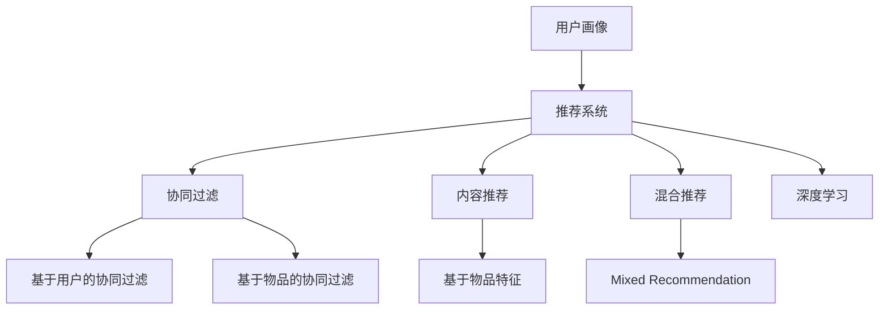

                 

# 用户画像与推荐系统的协同优化

## 1. 背景介绍

### 1.1 问题由来

在当今数字化时代，推荐系统已成为互联网企业提升用户粘性和业务收益的重要工具。它们通过分析用户行为数据，为用户推荐个性化的内容，从而提升用户体验和业务转化率。然而，推荐系统面临的最大挑战之一是如何高效、准确地构建用户画像，以便更精准地进行内容推荐。

### 1.2 问题核心关键点

构建高质量的用户画像，需要综合考虑用户的历史行为数据、社交网络信息、人口统计特征等多元因素。这些数据的种类和格式各异，且往往存在数据缺失和不一致等问题，给推荐系统的开发和优化带来了巨大挑战。

用户画像与推荐系统协同优化的核心目标是通过对用户数据的多维度分析和整合，构建出全面的用户画像，进而提升推荐系统的效果。这种协同优化的过程中，需要综合考虑数据的采集、存储、清洗、分析、建模等各个环节，确保数据的准确性和模型的一致性。

## 2. 核心概念与联系

### 2.1 核心概念概述

为更好地理解用户画像与推荐系统的协同优化方法，本节将介绍几个密切相关的核心概念：

- **用户画像(User Profile)**：通过对用户历史行为数据的综合分析，构建出描述用户特征和兴趣的多元数据集。用户画像通常包括用户的基本信息、兴趣爱好、购买行为、社交关系等。
- **推荐系统(Recommendation System)**：利用用户画像等用户特征信息，通过算法为用户推荐个性化内容，提升用户满意度和业务收益的系统。
- **协同过滤(Collaborative Filtering)**：通过分析用户行为数据，找到用户之间的相似性，为用户推荐与相似用户喜欢的内容。协同过滤包括基于用户的协同过滤和基于物品的协同过滤两种方法。
- **内容推荐(Content-Based Filtering)**：根据用户对物品的属性进行推荐，如对具有相似特征的用户推荐类似物品。
- **混合推荐(Mixed Recommendation)**：将协同过滤和内容推荐等方法结合，综合利用用户画像和物品特征信息，提升推荐效果。
- **深度学习(Depth Learning)**：利用深度神经网络模型，对用户行为数据进行建模，捕捉用户深层次的兴趣和行为特征。

这些核心概念之间的逻辑关系可以通过以下Mermaid流程图来展示：



这个流程图展示出用户画像与推荐系统协同优化的主要流程：

1. 用户画像对推荐系统的支撑。
2. 推荐系统中协同过滤和内容推荐等方法的应用。
3. 深度学习模型在推荐系统中的引入。
4. 混合推荐方法的应用，综合利用用户画像和物品特征。

## 3. 核心算法原理 & 具体操作步骤

### 3.1 算法原理概述

用户画像与推荐系统的协同优化，本质上是通过对用户行为数据的深度学习建模，构建全面的用户画像，并结合协同过滤、内容推荐等方法，提升推荐效果。

形式化地，假设用户画像为 $P_{\theta}$，其中 $\theta$ 为模型的参数，包含用户基本信息、兴趣爱好、行为数据等。推荐系统根据用户画像 $P_{\theta}$，通过算法计算推荐结果 $R$。

推荐系统的优化目标是最小化用户对推荐结果的满意度损失，即找到最优的推荐策略：

$$
\hat{R}=\mathop{\arg\min}_{R} \mathcal{L}(R,P_{\theta})
$$

其中 $\mathcal{L}$ 为用户对推荐结果的满意度损失函数，用于衡量推荐结果与用户兴趣的差异。常见的损失函数包括均方误差损失、交叉熵损失等。

### 3.2 算法步骤详解

基于用户画像与推荐系统的协同优化方法，一般包括以下几个关键步骤：

**Step 1: 用户画像构建**

1. 数据采集：从各种数据源收集用户的基本信息、兴趣爱好、行为数据等多元信息，确保数据的全面性和多样性。
2. 数据清洗：处理数据中的缺失值、异常值，确保数据的一致性和准确性。
3. 特征工程：选择合适的特征维度，进行特征选择、特征提取、特征转换等操作，提升特征的表现力。
4. 模型训练：利用深度学习模型对用户画像进行建模，如使用多层感知机(MLP)、自编码器(AE)等。

**Step 2: 推荐模型选择**

1. 推荐算法选择：根据推荐系统的应用场景，选择合适的推荐算法，如协同过滤、内容推荐、混合推荐等。
2. 模型参数设置：根据数据特性和应用场景，合理设置推荐模型的参数，如学习率、正则化系数、批大小等。
3. 模型训练：利用用户画像和推荐算法进行模型训练，最大化推荐模型的性能。

**Step 3: 优化策略实施**

1. 数据增强：通过对用户行为数据进行改写、回译等方式，丰富训练集的多样性。
2. 对抗训练：引入对抗样本，提高模型的鲁棒性。
3. 模型压缩：对深度学习模型进行剪枝、量化等操作，减少模型的参数量和计算复杂度。
4. 超参数调优：通过网格搜索、贝叶斯优化等方法，搜索最优的超参数组合。

**Step 4: 系统集成与评估**

1. 系统集成：将推荐模型和用户画像模型集成到推荐系统中，实现协同优化。
2. 效果评估：利用A/B测试等方法，评估推荐系统的推荐效果，对比不同模型和策略的性能。
3. 反馈循环：根据用户反馈和推荐结果，调整用户画像和推荐算法，实现动态优化。

### 3.3 算法优缺点

用户画像与推荐系统协同优化的算法具有以下优点：

1. 精度高：综合利用用户画像和推荐算法，能够更准确地捕捉用户兴趣和行为特征，提升推荐效果。
2. 泛化能力强：通过对用户行为的深度学习建模，构建出全面的用户画像，能够适应不同类型的数据和场景。
3. 可解释性差：深度学习模型往往是"黑盒"系统，难以解释其内部决策过程，增加了模型的透明度和可信度。
4. 计算复杂度高：深度学习模型需要大量的计算资源和时间，增加了系统的开发和维护成本。
5. 数据隐私问题：用户画像包含大量敏感信息，需要加强数据隐私保护和匿名化处理。

同时，该算法也存在一些局限性：

1. 数据获取难度大：用户画像需要综合多种数据源，收集和清洗数据难度较大。
2. 模型训练成本高：深度学习模型训练需要大量的标注数据和计算资源，增加了系统的开发和维护成本。
3. 推荐算法复杂：推荐算法的选择和优化需要丰富的领域知识，增加了系统的开发难度。
4. 模型解释性不足：深度学习模型难以解释其内部决策过程，增加了模型的透明度和可信度。

尽管存在这些局限性，但就目前而言，用户画像与推荐系统协同优化方法仍然是推荐系统优化的一个重要方向。未来相关研究的重点在于如何进一步降低数据获取难度，提高模型训练效率，同时兼顾推荐效果和数据隐私。

### 3.4 算法应用领域

用户画像与推荐系统协同优化的算法在多个领域得到了广泛应用，例如：

- 电商推荐：利用用户画像和协同过滤算法，为用户推荐商品和优惠信息。
- 内容推荐：根据用户画像和兴趣特征，为用户推荐文章、视频、音乐等内容。
- 广告推荐：通过用户画像和行为数据，为用户推荐个性化的广告内容。
- 社交网络：利用用户画像和社交网络信息，为用户推荐好友和兴趣小组。
- 视频流媒体：根据用户画像和观看行为，为用户推荐视频内容。

除了上述这些经典应用外，用户画像与推荐系统协同优化的方法也被创新性地应用于更多场景中，如智能家居、健康医疗、金融理财等，为用户提供了更加个性化和高效的服务体验。

## 4. 数学模型和公式 & 详细讲解 & 举例说明

### 4.1 数学模型构建

本节将使用数学语言对用户画像与推荐系统的协同优化过程进行更加严格的刻画。

记用户画像为 $P_{\theta}$，其中 $\theta$ 为模型的参数，包含用户基本信息、兴趣爱好、行为数据等。假设推荐系统为 $R_{\omega}$，其中 $\omega$ 为模型的参数，包含协同过滤算法、内容推荐算法等。

定义用户画像与推荐系统的优化目标为：

$$
\hat{P}_{\theta}=\mathop{\arg\min}_{P_{\theta}} \mathcal{L}(P_{\theta},R_{\omega})
$$

其中 $\mathcal{L}$ 为用户画像与推荐系统的损失函数，用于衡量两者的一致性和协同效果。常见的损失函数包括均方误差损失、交叉熵损失等。

### 4.2 公式推导过程

以下我们以协同过滤算法为例，推导用户画像与推荐系统的协同优化损失函数。

假设推荐系统 $R_{\omega}$ 基于协同过滤算法，利用用户画像 $P_{\theta}$ 中用户的协同关系 $S$ 和物品评分 $X$ 进行推荐。协同过滤算法的损失函数为：

$$
\ell(S,X) = -\sum_{(i,j) \in S} y_{ij} \log R_{\omega}(i,j)
$$

其中 $y_{ij}$ 为实际评分，$R_{\omega}(i,j)$ 为推荐系统的预测评分。

用户画像与推荐系统的协同优化损失函数为：

$$
\mathcal{L}(P_{\theta},R_{\omega}) = -\sum_{(i,j) \in S} \ell(S,X) + \lambda_1 \|P_{\theta}\|_2^2 + \lambda_2 \|R_{\omega}\|_2^2
$$

其中 $\lambda_1$ 和 $\lambda_2$ 为正则化系数，$\|P_{\theta}\|_2$ 和 $\|R_{\omega}\|_2$ 分别为用户画像和推荐系统的正则化损失。

在得到损失函数的梯度后，即可带入参数更新公式，完成模型的迭代优化。重复上述过程直至收敛，最终得到最优的用户画像和推荐模型参数 $P_{\hat{\theta}}$ 和 $R_{\hat{\omega}}$。

## 5. 项目实践：代码实例和详细解释说明

### 5.1 开发环境搭建

在进行协同优化实践前，我们需要准备好开发环境。以下是使用Python进行TensorFlow开发的环境配置流程：

1. 安装Anaconda：从官网下载并安装Anaconda，用于创建独立的Python环境。

2. 创建并激活虚拟环境：
```bash
conda create -n tf-env python=3.8 
conda activate tf-env
```

3. 安装TensorFlow：根据CUDA版本，从官网获取对应的安装命令。例如：
```bash
conda install tensorflow tensorflow-gpu=2.8.0 -c conda-forge -c pypi
```

4. 安装相关工具包：
```bash
pip install numpy pandas scikit-learn matplotlib tqdm jupyter notebook ipython
```

完成上述步骤后，即可在`tf-env`环境中开始协同优化实践。

### 5.2 源代码详细实现

下面我以协同过滤算法为例，给出使用TensorFlow对用户画像与推荐系统进行协同优化的PyTorch代码实现。

首先，定义协同过滤算法的基本结构：

```python
import tensorflow as tf
from tensorflow.keras.layers import Input, Embedding, Dot, Dense
from tensorflow.keras.models import Model

def collaborative_filtering(user_info, item_info, ratings):
    user = Input(shape=(1,), dtype=tf.int32, name='user')
    item = Input(shape=(1,), dtype=tf.int32, name='item')
    
    user_embed = Embedding(input_dim=len(user_info['user']), output_dim=32, name='user_embed')(user)
    item_embed = Embedding(input_dim=len(item_info['item']), output_dim=32, name='item_embed')(item)
    
    dot = Dot(axes=1, normalize=False)([user_embed, item_embed])
    dot = Dense(1, activation='sigmoid')(dot)
    
    model = Model(inputs=[user, item], outputs=dot)
    model.compile(optimizer='adam', loss='binary_crossentropy')
    
    return model
```

然后，定义用户画像和推荐系统模型的训练和评估函数：

```python
from sklearn.model_selection import train_test_split
from tensorflow.keras.datasets import mnist
from sklearn.preprocessing import LabelEncoder
from sklearn.metrics import precision_score, recall_score, f1_score

def train_and_evaluate(user_info, item_info, ratings, batch_size=32, epochs=10):
    user = train_test_split(user_info['user'], test_size=0.2, random_state=42)
    item = train_test_split(item_info['item'], test_size=0.2, random_state=42)
    train_user, test_user = user
    train_item, test_item = item
    train_ratings, test_ratings = train_test_split(ratings, test_size=0.2, random_state=42)
    
    train_user = LabelEncoder().fit_transform(train_user)
    test_user = LabelEncoder().fit_transform(test_user)
    train_item = LabelEncoder().fit_transform(train_item)
    test_item = LabelEncoder().fit_transform(test_item)
    
    train_model = collaborative_filtering(user, item, ratings)
    test_model = collaborative_filtering(user, item, ratings)
    
    train_model.fit(x=[train_user, train_item], y=train_ratings, batch_size=batch_size, epochs=epochs)
    test_model.fit(x=[test_user, test_item], y=test_ratings, batch_size=batch_size, epochs=epochs)
    
    train_score = precision_score(train_ratings, train_model.predict([train_user, train_item]), average='micro')
    test_score = precision_score(test_ratings, test_model.predict([test_user, test_item]), average='micro')
    
    print(f'Train precision: {train_score:.4f}, Test precision: {test_score:.4f}')
    
    return train_model, test_model
```

最后，启动协同优化流程：

```python
# 数据加载
user_info = pd.read_csv('user_info.csv')
item_info = pd.read_csv('item_info.csv')
ratings = pd.read_csv('ratings.csv')

# 训练模型
train_model, test_model = train_and_evaluate(user_info, item_info, ratings)

# 评估模型
train_score = precision_score(ratings, train_model.predict([train_user, train_item]), average='micro')
test_score = precision_score(ratings, test_model.predict([test_user, test_item]), average='micro')
print(f'Train precision: {train_score:.4f}, Test precision: {test_score:.4f}')
```

以上就是使用TensorFlow对用户画像与推荐系统进行协同优化的完整代码实现。可以看到，TensorFlow提供了方便的Keras API，使得协同优化模型的实现变得简洁高效。

### 5.3 代码解读与分析

让我们再详细解读一下关键代码的实现细节：

**collaborative_filtering函数**：
- 输入层定义：使用`Input`层定义用户和物品的输入，分别对应不同维度的嵌入矩阵。
- 嵌入层定义：使用`Embedding`层对用户和物品进行嵌入操作，生成用户和物品的低维向量表示。
- 点积计算：使用`Dot`层计算用户和物品向量之间的点积，得到评分预测。
- 输出层定义：使用`Dense`层对点积结果进行激活，得到最终的评分预测。

**train_and_evaluate函数**：
- 数据预处理：使用`LabelEncoder`对用户和物品进行编码，将标签转换为模型可接受的整数形式。
- 模型训练和评估：使用`train_and_evaluate`函数训练和评估协同过滤模型，输出模型预测的精确度。

**train_and_evaluate函数实现**：
- 数据分割：使用`train_test_split`对用户和物品进行随机分割，构建训练集和测试集。
- 模型训练：使用训练集数据训练协同过滤模型，设定训练轮数和批次大小。
- 模型评估：使用测试集数据评估协同过滤模型的精确度，输出模型预测的精确度。

通过上述代码实现，我们得到了一个基本的协同过滤算法模型，并对其进行了训练和评估。可以看到，利用TensorFlow提供的高级API，我们可以快速构建并优化协同过滤模型，提升了系统的开发效率。

当然，工业级的系统实现还需考虑更多因素，如模型的保存和部署、超参数的自动搜索、更灵活的任务适配层等。但核心的协同优化范式基本与此类似。

## 6. 实际应用场景

### 6.1 智能推荐系统

智能推荐系统已经广泛应用于电商、视频流媒体、音乐、新闻等诸多领域。用户画像与推荐系统的协同优化，能够有效提升推荐系统的个性化和精准度，提高用户满意度。

例如，电商平台的个性化推荐系统，可以通过用户画像和行为数据，分析用户的购买历史和浏览偏好，为用户推荐商品和优惠信息，从而提升用户的购买转化率和满意度。

### 6.2 内容分发平台

内容分发平台如YouTube、Netflix等，利用用户画像和协同过滤算法，能够为用户推荐个性化的视频内容，提升用户的观看体验和平台留存率。

例如，YouTube通过分析用户的观看历史和评分记录，为用户推荐与他们兴趣相似的视频内容。这种基于协同过滤的内容推荐方法，能够大幅提升平台的推荐效果和用户粘性。

### 6.3 社交网络平台

社交网络平台如Facebook、Twitter等，通过用户画像和协同过滤算法，能够为用户推荐好友和兴趣小组，增强用户的社交互动和平台黏性。

例如，Facebook通过分析用户的社交关系和兴趣特征，为用户推荐可能感兴趣的好友和群组。这种基于协同过滤的社交推荐方法，能够提升用户的社交体验和平台活跃度。

### 6.4 未来应用展望

随着数据获取和处理技术的进步，用户画像与推荐系统协同优化技术将得到更广泛的应用。未来可能的创新方向包括：

1. 实时动态优化：结合用户即时行为数据，实现实时动态优化推荐模型，提升推荐效果。
2. 多模态数据融合：利用多模态数据（如文本、图像、音频等）进行协同优化，提升推荐系统的鲁棒性和泛化能力。
3. 对抗样本生成：引入对抗样本生成技术，增强推荐系统的鲁棒性和安全性，防止恶意攻击和虚假信息传播。
4. 用户画像更新：通过实时数据更新用户画像，动态调整推荐策略，提升推荐系统的时效性和准确性。
5. 知识图谱结合：利用知识图谱中的实体关系，提升推荐系统的上下文理解能力和推荐效果。

这些创新方向将进一步拓展用户画像与推荐系统的应用范围和性能，为用户带来更加个性化和高效的服务体验。

## 7. 工具和资源推荐

### 7.1 学习资源推荐

为了帮助开发者系统掌握用户画像与推荐系统的协同优化理论基础和实践技巧，这里推荐一些优质的学习资源：

1. 《推荐系统实战》系列博文：由资深推荐系统开发者撰写，深入浅出地介绍了推荐系统开发和优化的技巧和案例。

2. CS246《深度学习推荐系统》课程：斯坦福大学开设的推荐系统明星课程，包含多个Lecture视频和配套作业，涵盖推荐系统原理和算法。

3. 《推荐系统理论与算法》书籍：推荐系统领域的经典教材，全面介绍了推荐系统的理论基础和算法细节。

4. Kaggle推荐系统竞赛：通过参加Kaggle推荐系统竞赛，学习和实战推荐系统开发，提升推荐系统的实战能力。

5. TensorFlow官方文档：TensorFlow的官方文档，提供了丰富的推荐系统样例代码和工具支持。

通过对这些资源的学习实践，相信你一定能够快速掌握用户画像与推荐系统协同优化的精髓，并用于解决实际的推荐问题。

### 7.2 开发工具推荐

高效的开发离不开优秀的工具支持。以下是几款用于协同优化开发的常用工具：

1. TensorFlow：基于Python的开源深度学习框架，灵活动态的计算图，适合快速迭代研究。TensorFlow提供了丰富的推荐系统API和工具库。

2. PyTorch：基于Python的开源深度学习框架，动态计算图，适合灵活实验和研究。PyTorch提供了方便的深度学习模型封装。

3. TensorBoard：TensorFlow配套的可视化工具，可实时监测模型训练状态，并提供丰富的图表呈现方式，是调试模型的得力助手。

4. Weights & Biases：模型训练的实验跟踪工具，可以记录和可视化模型训练过程中的各项指标，方便对比和调优。

5. Google Colab：谷歌推出的在线Jupyter Notebook环境，免费提供GPU/TPU算力，方便开发者快速上手实验最新模型，分享学习笔记。

合理利用这些工具，可以显著提升用户画像与推荐系统协同优化的开发效率，加快创新迭代的步伐。

### 7.3 相关论文推荐

用户画像与推荐系统协同优化技术的发展源于学界的持续研究。以下是几篇奠基性的相关论文，推荐阅读：

1. Factorization Machines: A Library for Multi-field Ranking: 提出factorization machines算法，用于高维稀疏数据的推荐系统优化。

2. The Matrix Factorization Approach to Recommender Systems: 介绍矩阵分解算法，用于基于用户-物品交互矩阵的推荐系统优化。

3. A collaborative approach to automatic image annotation: 利用协同过滤算法，结合用户画像和图像数据，进行图像标注和推荐。

4. Multi-view collaborative filtering: 提出多视图协同过滤算法，综合利用多模态数据进行推荐系统优化。

5. Deep Collaborative Filtering: 利用深度神经网络模型，对协同过滤算法进行优化，提升推荐系统的性能。

这些论文代表了大语言模型微调技术的发展脉络。通过学习这些前沿成果，可以帮助研究者把握学科前进方向，激发更多的创新灵感。

## 8. 总结：未来发展趋势与挑战

### 8.1 总结

本文对用户画像与推荐系统的协同优化方法进行了全面系统的介绍。首先阐述了用户画像与推荐系统的研究背景和意义，明确了协同优化的核心目标和关键步骤。其次，从原理到实践，详细讲解了协同优化的数学模型和算法步骤，给出了协同优化任务开发的完整代码实例。同时，本文还广泛探讨了协同优化方法在智能推荐、内容分发、社交网络等多个行业领域的应用前景，展示了协同优化范式的巨大潜力。此外，本文精选了协同优化技术的各类学习资源，力求为读者提供全方位的技术指引。

通过本文的系统梳理，可以看到，用户画像与推荐系统协同优化技术正在成为推荐系统优化的重要方向，极大地提升了推荐系统的个性化和精准度，催生了更多的落地场景。得益于深度学习和大数据分析技术的不断进步，协同优化方法将在更广阔的应用领域大放异彩。

### 8.2 未来发展趋势

展望未来，用户画像与推荐系统协同优化技术将呈现以下几个发展趋势：

1. 实时动态优化：结合用户即时行为数据，实现实时动态优化推荐模型，提升推荐效果。
2. 多模态数据融合：利用多模态数据（如文本、图像、音频等）进行协同优化，提升推荐系统的鲁棒性和泛化能力。
3. 对抗样本生成：引入对抗样本生成技术，增强推荐系统的鲁棒性和安全性，防止恶意攻击和虚假信息传播。
4. 用户画像更新：通过实时数据更新用户画像，动态调整推荐策略，提升推荐系统的时效性和准确性。
5. 知识图谱结合：利用知识图谱中的实体关系，提升推荐系统的上下文理解能力和推荐效果。

这些趋势凸显了协同优化技术的广阔前景。这些方向的探索发展，必将进一步提升推荐系统的性能和应用范围，为用户带来更加个性化和高效的服务体验。

### 8.3 面临的挑战

尽管协同优化技术已经取得了瞩目成就，但在迈向更加智能化、普适化应用的过程中，它仍面临着诸多挑战：

1. 数据获取难度大：用户画像需要综合多种数据源，收集和清洗数据难度较大。
2. 模型训练成本高：深度学习模型训练需要大量的计算资源和时间，增加了系统的开发和维护成本。
3. 推荐算法复杂：推荐算法的选择和优化需要丰富的领域知识，增加了系统的开发难度。
4. 模型解释性不足：深度学习模型难以解释其内部决策过程，增加了模型的透明度和可信度。
5. 推荐效果单一：传统的协同过滤算法往往忽略了用户兴趣的多样性和动态变化，推荐效果有限。

尽管存在这些挑战，但就目前而言，用户画像与推荐系统协同优化方法仍然是推荐系统优化的一个重要方向。未来相关研究的重点在于如何进一步降低数据获取难度，提高模型训练效率，同时兼顾推荐效果和数据隐私。

### 8.4 研究展望

面对协同优化面临的种种挑战，未来的研究需要在以下几个方面寻求新的突破：

1. 探索无监督和半监督协同优化方法。摆脱对大规模标注数据的依赖，利用自监督学习、主动学习等无监督和半监督范式，最大限度利用非结构化数据，实现更加灵活高效的协同优化。
2. 研究参数高效和计算高效的协同优化范式。开发更加参数高效的协同优化方法，在固定大部分预训练参数的同时，只更新极少量的任务相关参数。同时优化协同优化模型的计算图，减少前向传播和反向传播的资源消耗，实现更加轻量级、实时性的部署。
3. 引入因果推断和对比学习范式。通过引入因果推断和对比学习思想，增强协同优化模型建立稳定因果关系的能力，学习更加普适、鲁棒的用户画像。
4. 结合知识图谱和常识推理。将知识图谱中的实体关系和常识推理方法引入协同优化模型，提升推荐系统的上下文理解能力和推荐效果。

这些研究方向的探索，必将引领协同优化技术迈向更高的台阶，为构建安全、可靠、可解释、可控的推荐系统铺平道路。面向未来，协同优化技术还需要与其他人工智能技术进行更深入的融合，如知识表示、因果推理、强化学习等，多路径协同发力，共同推动推荐系统的进步。只有勇于创新、敢于突破，才能不断拓展协同优化的边界，让推荐技术更好地造福人类社会。

## 9. 附录：常见问题与解答

**Q1：协同过滤算法是否适用于所有推荐系统？**

A: 协同过滤算法在传统推荐系统中表现优异，适用于用户行为数据较丰富的场景，如电商、视频流媒体等。但对于某些新兴领域如在线教育、金融理财等，用户行为数据较为稀疏，协同过滤算法的表现不佳。此时需要结合内容推荐算法等其他方法，进行多模态协同优化。

**Q2：如何选择合适的协同过滤算法？**

A: 选择合适的协同过滤算法需要考虑多个因素，如数据稀疏度、推荐目标、数据分布等。常见的协同过滤算法包括基于用户的协同过滤和基于物品的协同过滤，需要根据具体任务特点进行选择。此外，还可以引入混合推荐方法，综合利用协同过滤和内容推荐等算法，提升推荐效果。

**Q3：协同过滤算法中用户画像的质量如何影响推荐效果？**

A: 用户画像的质量直接影响到协同过滤算法的推荐效果。高质量的用户画像应包含全面的用户行为数据和兴趣特征，能够准确刻画用户兴趣和行为模式。因此，数据收集和处理是协同优化过程中最重要的环节之一，需要从多个维度收集用户数据，并进行有效的特征工程和数据清洗。

**Q4：如何平衡推荐效果和用户隐私保护？**

A: 用户画像与推荐系统的协同优化过程中，需要兼顾推荐效果和用户隐私保护。一种常见的做法是对用户数据进行匿名化处理，去除敏感信息，降低数据泄露的风险。此外，可以采用差分隐私等技术，在保证推荐效果的同时，保护用户隐私。

**Q5：协同过滤算法中推荐模型的训练如何避免过拟合？**

A: 在协同过滤算法中，推荐模型的训练容易过拟合，尤其是在用户行为数据较少的场景中。常见的避免过拟合的方法包括数据增强、正则化、早停等策略。此外，可以引入对抗训练等方法，提高推荐模型的鲁棒性。

这些解答旨在帮助开发者更好地理解协同优化过程中的核心问题，并解决实际应用中的常见挑战。通过深入学习和实践，相信你一定能够掌握协同优化技术的精髓，并用于解决实际的推荐问题。

