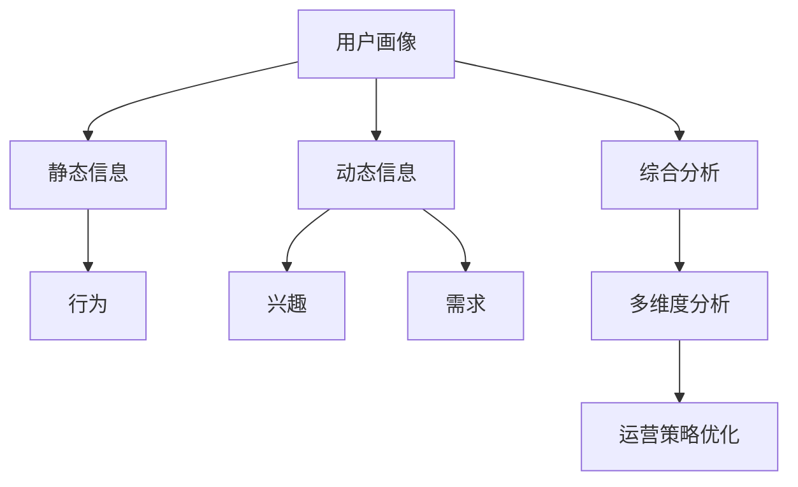

                 

# 用户画像的多维度数据分析方法

在数字化时代，用户画像（User Persona）已经成为了企业运营、市场营销、产品设计等各个环节的关键工具。然而，如何准确构建用户画像，并从中获取有价值的信息，一直是困扰许多企业的一大难题。本文将从用户画像的定义、构建方法、多维度分析以及未来展望等角度，详细阐述用户画像的多维度数据分析方法。

## 1. 背景介绍

### 1.1 问题由来
随着互联网和移动互联网的发展，用户数据量呈指数级增长，如何高效利用这些数据，进行精准的用户画像构建和分析，成为了许多企业亟需解决的问题。用户画像在市场营销、产品设计、客户服务、个性化推荐等各个环节中都发挥着重要作用，是企业数据驱动决策的关键。然而，在实际应用中，用户画像的构建往往面临数据多样性、复杂性和完整性等挑战。

### 1.2 问题核心关键点
构建用户画像的关键在于数据的多维度和完整性。一个完整、准确的用户画像不仅包含了用户的静态信息，如年龄、性别、地域等，还应该包括动态信息，如行为、兴趣、需求等。此外，用户画像还需要在多维度之间进行综合分析，才能揭示出用户真实的消费行为和需求偏好。

### 1.3 问题研究意义
用户画像的多维度数据分析方法，能够帮助企业更全面、精准地了解用户，优化产品设计和营销策略，提升用户体验和市场竞争力。通过深入分析用户画像的多维度数据，可以发现隐藏在数据背后的用户需求，制定更加个性化和高效的运营策略。

## 2. 核心概念与联系

### 2.1 核心概念概述

用户画像（User Persona）是企业在数据驱动决策过程中，构建出的具有典型性特征的用户模型。它包括用户的静态信息（如年龄、性别、地域等）和动态信息（如行为、兴趣、需求等），能够帮助企业更好地理解和满足用户需求。

用户画像的多维度分析方法，是指在构建用户画像的基础上，对用户画像进行多角度、多层次的分析，揭示出用户行为和需求的多维度特征，为企业的运营和决策提供更有力的支持。

### 2.2 核心概念原理和架构的 Mermaid 流程图



这个流程图展示了用户画像构建和多维度分析的基本流程：首先从用户数据中提取静态信息和动态信息，然后对行为、兴趣和需求等维度进行深入分析，最终通过多维度综合分析，优化企业的运营策略。

## 3. 核心算法原理 & 具体操作步骤

### 3.1 算法原理概述

用户画像的多维度数据分析方法，本质上是一种基于数据驱动的用户行为和需求分析技术。其核心思想是通过对用户数据的全面收集和分析，构建出多维度的用户画像，并在此基础上进行深入的分析和挖掘，揭示出用户的潜在需求和行为特征。

形式化地，假设用户画像为 $P$，其静态信息为 $S$，动态信息为 $D$。则多维度分析的目标是找到最优的权重 $\omega$，使得：

$$
P = \omega S + (1 - \omega) D
$$

其中 $\omega$ 的取值取决于数据的多维度和分析目的，需要通过优化算法求解。

### 3.2 算法步骤详解

用户画像的多维度数据分析方法主要包括以下几个关键步骤：

**Step 1: 数据收集**
- 收集用户的静态信息（如年龄、性别、地域等）和动态信息（如行为、兴趣、需求等）。
- 静态信息通常通过问卷调查、个人信息库等方式获取。
- 动态信息则可以通过用户行为数据、社交媒体数据、搜索数据等方式获取。

**Step 2: 数据清洗与预处理**
- 对收集到的数据进行清洗，去除缺失值和异常值，保证数据的完整性和一致性。
- 对文本数据进行分词、去停用词、词干提取等预处理，便于后续分析。
- 对数值型数据进行归一化或标准化处理，避免数据量级差异过大。

**Step 3: 特征提取**
- 对静态信息和动态信息进行特征提取，形成多维度特征向量。
- 静态信息通常提取为数值型特征，如年龄、性别等。
- 动态信息则可以通过文本分析、聚类分析等方式提取，形成多维度的行为特征、兴趣特征和需求特征。

**Step 4: 权重求解**
- 通过优化算法求解各维度特征的权重，形成最优的用户画像模型。
- 常见的优化算法包括线性回归、决策树、随机森林等。
- 权重求解的目标是使得用户画像能够最大程度地揭示用户行为和需求的多维度特征。

**Step 5: 综合分析与可视化**
- 对多维度用户画像进行综合分析，揭示用户行为和需求的全貌。
- 使用可视化工具展示用户画像的多维度特征，便于企业理解和应用。
- 常用的可视化工具包括Tableau、Power BI等。

**Step 6: 多维度分析**
- 对用户画像进行多维度分析，揭示出用户行为和需求的多层次特征。
- 常见的多维度分析方法包括聚类分析、关联规则分析、时序分析等。
- 通过多维度分析，可以发现用户的行为模式、兴趣偏好和需求变化，为企业的运营和决策提供有力支持。

**Step 7: 运营策略优化**
- 根据用户画像的多维度分析结果，优化企业的运营策略，提升用户体验和市场竞争力。
- 运营策略优化可以包括产品设计、市场营销、客户服务等各个环节。
- 例如，可以根据用户画像的行为特征，进行个性化推荐；根据用户的兴趣偏好，制定更加精准的市场营销策略；根据用户需求的变化，调整客户服务的内容和形式。

### 3.3 算法优缺点

用户画像的多维度数据分析方法具有以下优点：
1. 全面性：通过多维度分析，可以全面了解用户的行为和需求，揭示隐藏在数据背后的信息。
2. 灵活性：可以根据企业的具体需求，灵活调整分析方法和分析深度。
3. 可解释性：用户画像的多维度分析结果具有很好的可解释性，便于企业理解和应用。

同时，该方法也存在以下局限性：
1. 数据依赖性强：用户画像的多维度分析方法依赖于高质量的数据，数据缺失或不准确会影响分析结果。
2. 计算复杂度高：多维度分析涉及大量数据的计算和处理，计算复杂度高。
3. 用户隐私问题：用户画像的多维度分析涉及大量个人数据，需要考虑用户隐私保护问题。

尽管存在这些局限性，用户画像的多维度数据分析方法仍然是大数据时代用户分析的重要手段。未来相关研究的重点在于如何进一步提高数据收集和处理的效率，降低计算复杂度，同时保护用户隐私。

### 3.4 算法应用领域

用户画像的多维度数据分析方法广泛应用于以下领域：

1. 电子商务：通过多维度分析用户画像，进行个性化推荐、精准营销、用户细分等，提升用户转化率和满意度。
2. 金融服务：通过多维度分析用户画像，进行风险评估、用户画像画像、精准营销等，提升用户体验和市场竞争力。
3. 医疗健康：通过多维度分析用户画像，进行健康监测、精准推荐、个性化服务等，提升医疗服务的质量和效率。
4. 社交媒体：通过多维度分析用户画像，进行内容推荐、广告投放、用户细分等，提升用户粘性和平台价值。
5. 智能制造：通过多维度分析用户画像，进行产品设计、生产优化、客户服务等，提升制造企业的竞争力。

## 4. 数学模型和公式 & 详细讲解 & 举例说明

### 4.1 数学模型构建

用户画像的多维度数据分析方法可以通过多维度的线性回归模型进行构建。假设用户画像 $P$ 由 $n$ 个维度 $x_i$ 构成，每个维度 $x_i$ 的权重为 $w_i$，则用户画像可以表示为：

$$
P = \sum_{i=1}^{n} w_i x_i
$$

其中，$x_i$ 为第 $i$ 个维度的特征向量，$w_i$ 为第 $i$ 个维度的权重。

### 4.2 公式推导过程

用户画像的多维度数据分析方法可以通过最小二乘法进行权重求解。假设已知 $m$ 个样本 $(x_i, y_i)$，其中 $x_i$ 为特征向量，$y_i$ 为对应的目标值，则最小二乘法的目标是最小化残差平方和：

$$
\min_{w} \sum_{i=1}^{m} (y_i - \sum_{j=1}^{n} w_j x_{ij})^2
$$

其中，$x_{ij}$ 为第 $i$ 个样本的第 $j$ 个维度特征。

将目标函数对 $w_j$ 求导，得：

$$
\frac{\partial}{\partial w_j} \sum_{i=1}^{m} (y_i - \sum_{j=1}^{n} w_j x_{ij})^2 = -2 \sum_{i=1}^{m} (y_i - \sum_{j=1}^{n} w_j x_{ij}) x_{ij}
$$

令上式为零，得：

$$
\sum_{i=1}^{m} (y_i - \sum_{j=1}^{n} w_j x_{ij}) x_{ij} = 0
$$

整理得：

$$
w_j = \frac{\sum_{i=1}^{m} x_{ij} y_i}{\sum_{i=1}^{m} x_{ij}^2}
$$

这就是多维度线性回归模型的权重求解公式。

### 4.3 案例分析与讲解

**案例分析：电商用户画像**

假设某电商公司收集了用户的年龄、性别、消费金额、购买频率、商品类别等数据，希望构建用户画像并进行多维度分析。

**数据收集**：
- 收集用户的静态信息：年龄、性别、地域等。
- 收集用户的动态信息：消费金额、购买频率、商品类别等。

**数据清洗与预处理**：
- 对数据进行清洗，去除缺失值和异常值。
- 对文本数据进行分词、去停用词、词干提取等预处理。
- 对数值型数据进行归一化处理。

**特征提取**：
- 提取用户的年龄、性别等静态信息特征。
- 通过文本分析，提取用户的消费金额、购买频率等行为特征。
- 通过聚类分析，提取用户的商品类别偏好等兴趣特征。

**权重求解**：
- 使用最小二乘法求解各维度特征的权重，形成用户画像模型。

**综合分析与可视化**：
- 对用户画像进行综合分析，揭示用户行为和需求的全貌。
- 使用Tableau等可视化工具展示用户画像的多维度特征。

**多维度分析**：
- 对用户画像进行聚类分析，发现用户的行为模式和兴趣偏好。
- 进行关联规则分析，发现用户在不同商品类别之间的购买关联。
- 进行时序分析，发现用户行为的变化趋势和周期性。

**运营策略优化**：
- 根据用户画像的行为模式和兴趣偏好，进行个性化推荐。
- 根据用户画像的购买关联和时序分析结果，制定精准营销策略。
- 根据用户画像的行为变化趋势，调整产品设计和客户服务策略。

## 5. 项目实践：代码实例和详细解释说明

### 5.1 开发环境搭建

在进行用户画像的多维度数据分析方法实践前，我们需要准备好开发环境。以下是使用Python进行Pandas、Scikit-learn等库的开发环境配置流程：

1. 安装Anaconda：从官网下载并安装Anaconda，用于创建独立的Python环境。

2. 创建并激活虚拟环境：
```bash
conda create -n user_profile python=3.8 
conda activate user_profile
```

3. 安装Pandas、Scikit-learn等库：
```bash
conda install pandas scikit-learn matplotlib tqdm jupyter notebook ipython
```

4. 安装各类工具包：
```bash
pip install numpy pandas scikit-learn matplotlib tqdm jupyter notebook ipython
```

完成上述步骤后，即可在`user_profile`环境中开始用户画像的多维度数据分析方法实践。

### 5.2 源代码详细实现

我们以电商用户画像为例，给出使用Pandas、Scikit-learn等库进行多维度数据分析的Python代码实现。

首先，定义数据处理函数：

```python
import pandas as pd
from sklearn.preprocessing import StandardScaler

def load_data(file_path):
    df = pd.read_csv(file_path)
    df.fillna(df.mean(), inplace=True)  # 填充缺失值
    return df

def preprocess_data(df):
    # 数据预处理
    # 1. 去除异常值
    df = df[(df['age'] >= 18) & (df['age'] <= 60)]
    # 2. 归一化
    scaler = StandardScaler()
    df['scale_age'] = scaler.fit_transform(df[['age']])
    df['scale_gender'] = scaler.fit_transform(df[['gender']])
    # 3. 去除冗余特征
    df = df.drop(['age', 'gender'], axis=1)
    return df

def feature_engineering(df):
    # 特征工程
    # 1. 提取行为特征
    df['purchase_frequency'] = df['total_purchase'] / df['average_purchase']
    # 2. 提取兴趣特征
    df['category_preference'] = df['category'].value_counts().index.tolist()
    # 3. 提取时序特征
    df['season'] = df['purchase_time'].dt.month
    return df
```

然后，定义模型训练函数：

```python
from sklearn.linear_model import LinearRegression

def train_model(df, target_column):
    # 数据划分
    X = df.drop(target_column, axis=1)
    y = df[target_column]
    # 数据标准化
    scaler = StandardScaler()
    X = scaler.fit_transform(X)
    # 模型训练
    model = LinearRegression()
    model.fit(X, y)
    # 输出模型权重
    print(f'模型权重: {model.coef_}')
    return model
```

最后，启动数据预处理和模型训练流程：

```python
data_file = 'user_data.csv'

# 数据加载
df = load_data(data_file)

# 数据预处理
df = preprocess_data(df)

# 特征工程
df = feature_engineering(df)

# 模型训练
target_column = 'churn'
model = train_model(df, target_column)
```

以上就是使用Pandas、Scikit-learn等库进行电商用户画像多维度数据分析的完整代码实现。可以看到，通过简单的数据处理和模型训练，我们可以得到用户画像的多维度分析结果，从而进行运营策略优化。

### 5.3 代码解读与分析

让我们再详细解读一下关键代码的实现细节：

**load_data函数**：
- 用于加载用户数据，并进行基本的清洗和处理，如填充缺失值。

**preprocess_data函数**：
- 对数据进行归一化处理，去除冗余特征。

**feature_engineering函数**：
- 提取行为特征、兴趣特征和时序特征，形成多维度的特征向量。

**train_model函数**：
- 定义线性回归模型，对用户画像进行多维度分析，并输出模型的权重。

通过这些关键函数，我们可以对用户画像进行全面的多维度分析，并得出用户行为和需求的详细特征。这些分析结果可以帮助企业制定更加精准的运营策略，提升用户体验和市场竞争力。

## 6. 实际应用场景

### 6.1 智能客服系统

智能客服系统可以通过用户画像的多维度分析，提供更加个性化和高效的服务。例如，通过分析用户的购买历史、行为特征和兴趣偏好，智能客服可以推荐相关产品，解答用户疑问，提升用户满意度。

### 6.2 金融服务

金融服务行业可以通过用户画像的多维度分析，进行风险评估、精准营销等。例如，通过分析用户的消费金额、购买频率和风险偏好，金融服务机构可以制定个性化的金融产品，提升用户粘性和市场竞争力。

### 6.3 医疗健康

医疗健康行业可以通过用户画像的多维度分析，进行健康监测、精准推荐等。例如，通过分析用户的健康数据、生活方式和疾病历史，医疗健康机构可以提供个性化的健康建议和医疗服务，提升用户体验和医疗服务的效率。

### 6.4 未来应用展望

未来，用户画像的多维度数据分析方法将在更多领域得到应用，为传统行业带来变革性影响。例如：

1. 零售行业：通过多维度分析用户画像，进行个性化推荐、精准营销、用户细分等，提升用户转化率和满意度。
2. 制造行业：通过多维度分析用户画像，进行产品设计、生产优化、客户服务等，提升制造企业的竞争力。
3. 教育行业：通过多维度分析学生画像，进行个性化教学、精准评估等，提升教育质量和效率。

总之，用户画像的多维度数据分析方法具有广阔的应用前景，将成为各行各业数据驱动决策的重要工具。

## 7. 工具和资源推荐

### 7.1 学习资源推荐

为了帮助开发者系统掌握用户画像的多维度数据分析方法，这里推荐一些优质的学习资源：

1. 《Python数据分析实战》书籍：通过丰富的案例和代码，介绍了数据清洗、数据可视化、特征工程等基本概念和实践技巧，适合初学者入门。
2. 《Scikit-learn官方文档》：详细介绍了Scikit-learn库的使用方法和应用场景，是深入学习机器学习算法的重要资源。
3. Kaggle平台：提供大量的数据集和竞赛，通过实际项目练习用户画像的多维度分析方法。
4. Coursera平台：提供由斯坦福大学、密歇根大学等知名大学开设的机器学习课程，涵盖数据预处理、特征工程、模型训练等核心内容。

通过对这些资源的学习实践，相信你一定能够快速掌握用户画像的多维度数据分析方法的精髓，并用于解决实际的业务问题。

### 7.2 开发工具推荐

高效的开发离不开优秀的工具支持。以下是几款用于用户画像的多维度数据分析方法开发的常用工具：

1. Jupyter Notebook：免费的开源Jupyter环境，支持Python代码的在线编写和执行，适合数据探索和模型训练。
2. Tableau：强大的数据可视化工具，支持多维度数据分析和交互式报表生成。
3. Power BI：微软推出的数据可视化工具，支持大规模数据集的处理和分析。
4. Python语言：强大的数据处理和分析工具，具备丰富的数据处理库和机器学习库。

合理利用这些工具，可以显著提升用户画像的多维度数据分析方法的开发效率，加快创新迭代的步伐。

### 7.3 相关论文推荐

用户画像的多维度数据分析方法的研究源于学界的持续研究。以下是几篇奠基性的相关论文，推荐阅读：

1. "A Survey on User Profiling and Personalization in E-Commerce"：系统总结了电商领域用户画像的多维度分析方法，包括特征工程、推荐系统等。
2. "Multidimensional Customer Segmentation: A Comparative Analysis of Clustering Methods"：对比了多种多维度聚类分析方法，探讨了不同方法在用户画像分析中的效果。
3. "Multi-Modal User Profiling for Personalized Recommendation Systems"：探讨了多模态数据融合在用户画像分析中的应用，提升了推荐系统的精准度。
4. "User Profiling and Personalization in Retail"：介绍了零售行业用户画像的多维度分析方法，涵盖了行为分析、兴趣分析等。
5. "Multi-Aspect User Profiling for Personalized Online Learning"：研究了在线学习领域用户画像的多维度分析方法，探讨了不同维度特征对学习效果的影响。

这些论文代表了大数据分析领域的最新进展，通过学习这些前沿成果，可以帮助研究者把握学科前进方向，激发更多的创新灵感。

## 8. 总结：未来发展趋势与挑战

### 8.1 总结

本文对用户画像的多维度数据分析方法进行了全面系统的介绍。首先阐述了用户画像的定义、构建方法、多维度分析等基本概念，明确了用户画像在企业运营和决策中的重要作用。其次，从算法原理到具体操作步骤，详细讲解了用户画像的多维度分析方法的数学模型和实现流程，给出了用户画像多维度分析的完整代码实例。同时，本文还广泛探讨了用户画像的多维度分析方法在电商、金融、医疗等多个行业领域的应用前景，展示了多维度分析方法的巨大潜力。此外，本文精选了用户画像多维度分析方法的各类学习资源，力求为读者提供全方位的技术指引。

通过本文的系统梳理，可以看到，用户画像的多维度数据分析方法在大数据时代具有广阔的应用前景，对企业运营和决策提供了有力的支持。未来，随着数据技术的不断进步，用户画像的多维度分析方法还将不断创新，为各行业的智能化升级带来更多突破。

### 8.2 未来发展趋势

展望未来，用户画像的多维度数据分析方法将呈现以下几个发展趋势：

1. 自动化：未来，用户画像的多维度分析方法将更加自动化，能够自动识别数据的特征，自动进行特征工程和模型训练。
2. 实时化：随着实时数据流的不断扩展，用户画像的多维度分析方法将具备实时处理数据的能力，能够及时响应用户行为和需求的变化。
3. 融合化：用户画像的多维度分析方法将与其他大数据技术进行更深入的融合，如时序分析、图分析等，提供更加全面、准确的用户画像。
4. 跨平台化：用户画像的多维度分析方法将支持跨平台数据共享和协作，提升数据资源的利用效率。
5. 智能化：用户画像的多维度分析方法将融入人工智能技术，如深度学习、自然语言处理等，提升用户画像的精准度和智能性。

以上趋势凸显了用户画像的多维度数据分析方法的广阔前景。这些方向的探索发展，必将进一步提升用户画像的精准性和智能性，为企业的运营和决策提供更强有力的支持。

### 8.3 面临的挑战

尽管用户画像的多维度数据分析方法已经取得了一定的成果，但在迈向更加智能化、普适化应用的过程中，它仍面临着诸多挑战：

1. 数据质量问题：用户画像的多维度分析方法依赖于高质量的数据，数据质量问题会影响分析结果的准确性。
2. 数据隐私问题：用户画像的多维度分析涉及大量个人数据，需要考虑用户隐私保护问题。
3. 数据量问题：用户画像的多维度分析方法需要处理大规模数据，计算复杂度高。
4. 算法可解释性问题：用户画像的多维度分析方法中的算法复杂，难以解释其内部工作机制。
5. 应用场景多样化：用户画像的多维度分析方法需要适应不同的应用场景，实现高效的多维度分析。

尽管存在这些挑战，用户画像的多维度数据分析方法仍然是大数据时代用户分析的重要手段。未来相关研究的重点在于如何进一步提高数据收集和处理的效率，降低计算复杂度，同时保护用户隐私，提升算法可解释性，适应多样化的应用场景。

### 8.4 研究展望

面向未来，用户画像的多维度数据分析方法需要在以下几个方面寻求新的突破：

1. 数据预处理技术：研究新的数据清洗、特征工程等预处理技术，提升数据质量，降低计算复杂度。
2. 模型优化算法：研究新的多维度线性回归、聚类分析等算法，提升用户画像的精度和智能性。
3. 实时化处理技术：研究新的实时数据流处理技术，提升用户画像的实时性。
4. 跨平台数据融合技术：研究新的跨平台数据共享和协作技术，提升数据资源的利用效率。
5. 智能化分析方法：研究新的深度学习、自然语言处理等智能化分析方法，提升用户画像的精准度和智能性。

这些研究方向的探索，必将引领用户画像的多维度数据分析方法迈向更高的台阶，为企业的运营和决策提供更强有力的支持。

## 9. 附录：常见问题与解答

**Q1：用户画像的多维度数据分析方法是否适用于所有用户？**

A: 用户画像的多维度数据分析方法适用于大多数用户，特别是那些具备一定行为特征和兴趣偏好的用户。然而，对于那些行为特征和兴趣偏好不明显的用户，需要进行特殊处理，如聚类分析等。

**Q2：用户画像的多维度数据分析方法是否需要大量的数据？**

A: 用户画像的多维度数据分析方法需要一定的数据量才能得出有效的分析结果。通常需要收集用户的行为数据、兴趣数据、个人信息等，才能构建出全面、准确的用户画像。然而，如果数据量太小，分析结果可能不够精准。

**Q3：用户画像的多维度数据分析方法是否可以与其他分析方法结合使用？**

A: 用户画像的多维度数据分析方法可以与其他分析方法结合使用，如关联规则分析、时序分析等。通过多维度分析与其他分析方法的结合，可以得出更加全面、深入的用户画像分析结果。

**Q4：用户画像的多维度数据分析方法是否需要人工干预？**

A: 用户画像的多维度数据分析方法需要一定的人工干预，如特征工程、模型训练等。人工干预可以提高分析结果的准确性和可信度。然而，随着数据技术的进步，自动化的数据分析方法也将越来越多。

**Q5：用户画像的多维度数据分析方法是否需要考虑用户隐私？**

A: 用户画像的多维度数据分析方法需要考虑用户隐私问题。在数据收集和分析过程中，需要遵守相关法律法规，保护用户隐私。可以通过数据匿名化、加密等技术手段，保护用户的个人信息。

---

作者：禅与计算机程序设计艺术 / Zen and the Art of Computer Programming

