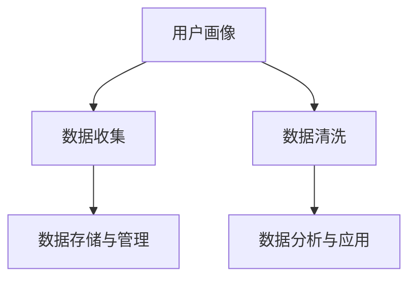

                 

# 用户画像的数据收集方法

## 1. 背景介绍

### 1.1 问题由来

在数字化时代，数据已成为企业的重要资产。然而，仅仅拥有数据是不够的，只有通过有效的数据收集方法，将数据转化为洞察，才能真正为企业的业务决策提供支持。用户画像（User Persona）作为一种将用户数据系统化的工具，通过数据的收集、整理和分析，帮助企业更好地理解用户需求和行为，指导产品的设计、优化和推广。因此，如何高效、准确地收集用户画像数据，是企业数字化转型的关键问题。

### 1.2 问题核心关键点

用户画像的数据收集涉及多方面的技术和方法，关键点包括：
- 确定数据来源：选择合适且可信赖的数据源，获取全面的用户信息。
- 设计数据收集方案：根据用户画像的目的和需求，设计具体的数据收集方案。
- 数据清洗和处理：确保数据的准确性和完整性，去除噪音和错误。
- 数据存储与管理：采用合适的方式存储和管理数据，保障数据的安全性和可访问性。
- 数据分析与应用：通过数据挖掘和分析技术，提取有价值的用户信息，并应用于实际业务。

这些问题之间相互联系，共同构成了用户画像数据收集的全过程。

## 2. 核心概念与联系

### 2.1 核心概念概述

为更好地理解用户画像的数据收集方法，本节将介绍几个密切相关的核心概念：

- 用户画像（User Persona）：指通过对用户行为的观察和分析，以图形化方式描述用户特征和需求的工具。
- 数据收集（Data Collection）：指从不同渠道获取用户数据的过程。
- 数据清洗（Data Cleaning）：指从原始数据中去除噪音和错误，确保数据质量的过程。
- 数据存储与管理（Data Storage and Management）：指通过合适的方式，存储和管理用户数据的过程。
- 数据分析与应用（Data Analysis and Application）：指通过数据挖掘和分析技术，提取有价值的用户信息，并应用于实际业务的过程。

这些核心概念之间的逻辑关系可以通过以下Mermaid流程图来展示：



这个流程图展示了这个过程中各关键点之间的联系：

1. 用户画像作为目标，驱动数据收集、清洗、存储和应用。
2. 数据收集是获取用户信息的第一步。
3. 数据清洗确保数据的准确性和完整性。
4. 数据存储与管理保障数据的安全性和可访问性。
5. 数据分析与应用将用户信息转化为可操作的洞察。

## 3. 核心算法原理 & 具体操作步骤

### 3.1 算法原理概述

用户画像的数据收集方法基于多个数据源的整合和处理，旨在构建全面、准确的个性化用户画像。其核心原理包括以下几点：

- 多源数据融合：从不同渠道获取用户数据，如社交媒体、电商数据、客服记录等，以构建更全面的用户画像。
- 数据清洗与处理：通过数据清洗和处理技术，去除噪音和错误，确保数据的质量。
- 数据分析与建模：使用数据挖掘和机器学习技术，提取用户特征和行为模式，构建用户画像模型。
- 可视化与报告：将分析结果以图形化方式展示，生成可视化报告，辅助业务决策。

### 3.2 算法步骤详解

基于以上原理，用户画像的数据收集通常包括以下几个关键步骤：

**Step 1: 确定数据来源**

选择合适的数据源，获取全面的用户信息。数据来源包括：

1. 社交媒体：如微博、微信、抖音等，可以获取用户的兴趣、行为等信息。
2. 电商平台：如淘宝、京东、亚马逊等，可以获取用户的购买记录、浏览历史等。
3. 客服记录：通过客服记录可以了解用户的投诉、反馈等信息。
4. 调查问卷：通过问卷调查获取用户的直接反馈。

**Step 2: 设计数据收集方案**

根据用户画像的目的和需求，设计具体的数据收集方案。方案设计要考虑以下因素：

1. 数据类型：确定需要收集的数据类型，如用户基本信息、行为数据、偏好数据等。
2. 数据频率：确定数据收集的频率，如每天、每周、每月等。
3. 数据质量：设计数据质量控制机制，确保数据的准确性和完整性。

**Step 3: 数据清洗与处理**

对原始数据进行清洗和处理，确保数据的准确性和完整性。主要步骤包括：

1. 数据去重：去除重复的数据记录。
2. 数据补全：补全缺失的数据字段。
3. 数据标准化：对数据格式进行标准化处理，如日期格式统一、单位统一等。
4. 数据筛选：根据业务需求筛选有价值的数据。

**Step 4: 数据存储与管理**

选择合适的数据存储和管理方式，确保数据的安全性和可访问性。主要步骤包括：

1. 数据分区：按照业务需求将数据分区，如用户基本信息、行为数据、偏好数据等。
2. 数据加密：对敏感数据进行加密处理。
3. 数据备份：定期备份数据，以防数据丢失。

**Step 5: 数据分析与应用**

通过数据挖掘和分析技术，提取有价值的用户信息，并应用于实际业务。主要步骤包括：

1. 数据挖掘：使用聚类、分类等算法，提取用户特征和行为模式。
2. 机器学习：使用回归、分类、聚类等机器学习技术，构建用户画像模型。
3. 可视化与报告：将分析结果以图形化方式展示，生成可视化报告，辅助业务决策。

### 3.3 算法优缺点

用户画像的数据收集方法具有以下优点：

1. 全面性：通过多源数据融合，获取全面的用户信息，构建更准确的个性化用户画像。
2. 可操作性：通过数据清洗和处理，确保数据的准确性和完整性，提升数据分析的可靠性。
3. 灵活性：通过数据分析与建模，提取用户特征和行为模式，提供多种业务应用场景。

同时，该方法也存在一定的局限性：

1. 数据隐私：用户画像涉及大量敏感信息，需要严格遵守隐私保护法律法规。
2. 数据质量：数据收集和清洗过程需要投入大量资源，确保数据质量。
3. 技术门槛：数据分析和建模技术要求较高，需要具备较强的技术能力。

尽管存在这些局限性，但就目前而言，用户画像的数据收集方法仍是大数据应用中的主流范式。未来相关研究的重点在于如何进一步提升数据收集的自动化和智能化，降低对人工干预的依赖，同时兼顾隐私保护和数据质量等因素。

### 3.4 算法应用领域

用户画像的数据收集方法在多个领域中得到了广泛应用，例如：

- 电商零售：通过用户画像分析用户购买行为和偏好，优化商品推荐和营销策略。
- 金融服务：通过用户画像分析用户消费行为和信用记录，进行风险控制和精准营销。
- 旅游服务：通过用户画像分析用户旅游偏好和行为模式，提升旅游体验和销售转化率。
- 健康医疗：通过用户画像分析用户健康数据和行为，提供个性化的健康建议和医疗服务。

除了上述这些经典应用外，用户画像的数据收集方法也被创新性地应用到更多场景中，如智慧城市、教育培训、能源管理等，为用户行为分析和应用提供了新的思路。随着数据收集技术的不断发展，用户画像的应用场景还将不断拓展，为各行业数字化转型提供更有力的支持。

## 4. 数学模型和公式 & 详细讲解

### 4.1 数学模型构建

用户画像的数据收集方法涉及多个数据源和处理步骤，其数学模型构建可以如下描述：

假设用户画像的数据集为 $D=\{(x_i, y_i)\}_{i=1}^N$，其中 $x_i$ 为输入特征向量，$y_i$ 为输出标签向量。目标是通过数据收集、清洗、处理、分析和建模等步骤，构建一个映射函数 $f: x \rightarrow y$，使得 $f(x)$ 尽可能接近 $y$。

### 4.2 公式推导过程

以用户画像中的行为数据分析为例，我们推导一种简单的线性回归模型。假设用户行为数据 $x$ 包括时间戳、商品ID、购买金额等特征，目标预测用户是否会购买某商品。

使用线性回归模型 $y=f(x)=\theta_0 + \theta_1x_1 + \theta_2x_2 + ... + \theta_nx_n$，其中 $\theta_k$ 为模型参数。目标是最小化预测误差，即最小化均方误差 $MSE=\frac{1}{N}\sum_{i=1}^N(y_i - f(x_i))^2$。

对 $MSE$ 求导，得到梯度向量 $\nabla_{\theta}MSE$：

$$
\nabla_{\theta}MSE = \frac{1}{N}\sum_{i=1}^N 2(y_i - f(x_i)) \nabla_{\theta}f(x_i)
$$

其中 $\nabla_{\theta}f(x_i)$ 为函数 $f$ 对参数 $\theta$ 的梯度，可以通过自动微分技术高效计算。

将 $\nabla_{\theta}MSE=0$ 代入优化目标，得到线性回归模型的最小二乘解：

$$
\theta_k = \frac{\sum_{i=1}^N x_{ik}y_i}{\sum_{i=1}^N x_{ik}^2}
$$

通过上述公式，我们可以计算出线性回归模型的参数 $\theta_k$，进而对用户是否会购买某商品进行预测。

### 4.3 案例分析与讲解

以下我们以用户画像中的行为数据分析为例，给出具体案例的讲解。

假设某电商公司希望构建用户画像，预测用户是否会购买某款服装。该公司收集了用户的购买记录、浏览历史、搜索记录等数据，并对其进行数据清洗和处理。

**Step 1: 数据收集**

公司从电商平台上获取用户购买记录、浏览历史和搜索记录，存储在数据库中。

**Step 2: 数据清洗**

对数据进行去重、补全、标准化处理，并筛选出有用数据。例如，将浏览历史和搜索记录合并，去除重复记录，补全缺失的浏览时间和搜索关键词。

**Step 3: 数据分析**

使用聚类算法对用户进行分组，分析不同用户的购买行为模式。例如，将用户分为高频购买用户、中频购买用户和低频购买用户。

**Step 4: 数据建模**

使用线性回归模型对用户是否会购买某款服装进行预测。例如，将购买记录中的时间戳、商品ID、购买金额等特征作为输入，预测用户是否会购买该商品。

**Step 5: 可视化与报告**

将分析结果以图形化方式展示，生成可视化报告。例如，使用饼图展示不同用户群体的购买比例，使用折线图展示用户购买行为随时间的变化趋势。

通过上述步骤，电商公司可以更好地理解用户购买行为，优化商品推荐和营销策略，提升销售转化率。

## 5. 项目实践：代码实例和详细解释说明

### 5.1 开发环境搭建

在进行用户画像的数据收集实践前，我们需要准备好开发环境。以下是使用Python进行Pandas和Scikit-learn开发的环境配置流程：

1. 安装Anaconda：从官网下载并安装Anaconda，用于创建独立的Python环境。

2. 创建并激活虚拟环境：
```bash
conda create -n userprofile python=3.8 
conda activate userprofile
```

3. 安装Pandas：
```bash
pip install pandas
```

4. 安装Scikit-learn：
```bash
pip install scikit-learn
```

5. 安装各类工具包：
```bash
pip install numpy matplotlib seaborn sklearn tqdm
```

完成上述步骤后，即可在`userprofile`环境中开始用户画像的数据收集实践。

### 5.2 源代码详细实现

这里我们以电商数据为例，展示如何使用Pandas和Scikit-learn进行用户画像的行为数据分析和建模。

首先，加载电商数据集：

```python
import pandas as pd
from sklearn.model_selection import train_test_split

# 加载电商数据集
data = pd.read_csv('elec_data.csv')

# 数据预处理
data = data.drop_duplicates()  # 去重
data = data.dropna()  # 补全缺失
data['buy_time'] = pd.to_datetime(data['buy_time'])  # 标准化时间戳
```

然后，设计数据分析模型：

```python
from sklearn.cluster import KMeans
from sklearn.linear_model import LinearRegression

# 数据聚类
kmeans = KMeans(n_clusters=3, random_state=0)
kmeans.fit(data[['buy_time', 'buy_amount', 'search_keyword']])
labels = kmeans.labels_

# 数据建模
X = data[['buy_time', 'buy_amount', 'search_keyword']].values
y = data['buy']  # 购买标记
X_train, X_test, y_train, y_test = train_test_split(X, y, test_size=0.2, random_state=0)

# 线性回归模型
lr = LinearRegression()
lr.fit(X_train, y_train)
y_pred = lr.predict(X_test)
```

最后，生成可视化报告：

```python
import matplotlib.pyplot as plt
import seaborn as sns

# 可视化分析结果
sns.set_style('darkgrid')
sns.pie(data['label'].value_counts(), labels=kmeans.cluster_centers_.round(2).columns, explode=[0.1, 0.1, 0.1], autopct='%1.1f%%')
plt.title('User Purchase Distribution')
plt.show()

sns.lineplot(data.groupby('buy_time')['buy'].mean())
plt.title('User Purchase Over Time')
plt.show()
```

以上就是使用Pandas和Scikit-learn对电商数据进行用户画像的行为数据分析和建模的完整代码实现。可以看到，通过简单的数据清洗、特征提取和建模，我们能够快速得到用户购买行为的洞察，并生成可视化报告，辅助业务决策。

### 5.3 代码解读与分析

让我们再详细解读一下关键代码的实现细节：

**数据加载与预处理**：
- `pd.read_csv('elec_data.csv')`：从CSV文件中加载电商数据集。
- `data.drop_duplicates()`：去重操作，避免重复数据。
- `data.dropna()`：补全缺失数据，确保数据完整性。
- `data['buy_time'] = pd.to_datetime(data['buy_time'])`：标准化时间戳，确保时间格式一致。

**数据聚类与建模**：
- `KMeans(n_clusters=3, random_state=0)`：使用KMeans算法对用户进行分组。
- `kmeans.fit(data[['buy_time', 'buy_amount', 'search_keyword']])`：训练KMeans模型，对用户进行分组。
- `labels = kmeans.labels_`：获取用户的分组标签。
- `X = data[['buy_time', 'buy_amount', 'search_keyword']].values`：获取特征数据。
- `y = data['buy']`：获取购买标记。
- `train_test_split(X, y, test_size=0.2, random_state=0)`：划分训练集和测试集。
- `LinearRegression()`：定义线性回归模型。
- `lr.fit(X_train, y_train)`：训练线性回归模型。
- `y_pred = lr.predict(X_test)`：对测试集进行预测。

**可视化报告生成**：
- `sns.pie(data['label'].value_counts(), labels=kmeans.cluster_centers_.round(2).columns, explode=[0.1, 0.1, 0.1], autopct='%1.1f%%')`：绘制饼图，展示不同用户群体的购买比例。
- `sns.lineplot(data.groupby('buy_time')['buy'].mean())`：绘制折线图，展示用户购买行为随时间的变化趋势。

通过上述代码，我们可以看到，用户画像的数据收集方法在实际应用中，通过数据收集、清洗、处理、分析和建模等步骤，能够快速生成可视化报告，为业务决策提供支持。

## 6. 实际应用场景

### 6.1 智能客服系统

在智能客服系统中，用户画像可以帮助客服系统更好地理解用户需求和行为，提供更精准的客户服务。通过分析用户的购买记录、浏览历史、搜索记录等数据，客服系统可以预测用户的咨询意图，提供个性化的服务。

**应用流程**：
- 收集用户的购买记录、浏览历史和搜索记录。
- 对数据进行清洗和处理，去除噪音和错误。
- 使用聚类算法对用户进行分组。
- 构建用户画像模型，预测用户的咨询意图。
- 根据用户画像结果，提供个性化的客服服务。

**示例**：某电商平台通过用户画像分析，发现新用户对产品的使用率较低。通过用户画像数据，客服系统能够及时识别新用户，提供产品使用指导和售后服务，提升用户满意度。

### 6.2 金融风险控制

在金融领域，用户画像可以帮助金融机构更好地评估用户的信用风险，提高风险控制能力。通过分析用户的消费记录、交易历史、社交关系等数据，金融机构可以预测用户的信用风险，制定合理的授信策略。

**应用流程**：
- 收集用户的消费记录、交易历史和社交关系等数据。
- 对数据进行清洗和处理，去除噪音和错误。
- 使用聚类算法对用户进行分组。
- 构建用户画像模型，预测用户的信用风险。
- 根据用户画像结果，制定授信策略。

**示例**：某银行通过用户画像分析，发现某用户近期消费行为异常。通过用户画像数据，银行能够及时识别高风险用户，调整授信策略，避免金融风险。

### 6.3 个性化推荐系统

在个性化推荐系统中，用户画像可以帮助推荐系统更好地理解用户需求和偏好，提供更加精准的商品推荐。通过分析用户的购买记录、浏览历史、搜索记录等数据，推荐系统可以预测用户的兴趣和需求，推荐个性化的商品。

**应用流程**：
- 收集用户的购买记录、浏览历史和搜索记录。
- 对数据进行清洗和处理，去除噪音和错误。
- 使用聚类算法对用户进行分组。
- 构建用户画像模型，预测用户的兴趣和需求。
- 根据用户画像结果，推荐个性化的商品。

**示例**：某电商平台通过用户画像分析，发现某用户对运动类商品感兴趣。通过用户画像数据，推荐系统能够及时推荐相关商品，提升用户的购买率。

### 6.4 未来应用展望

随着用户画像数据收集技术的不断发展，其在各个领域的应用前景将更加广阔。未来，用户画像将在以下领域得到更广泛的应用：

- 智慧医疗：通过分析用户的健康数据和行为，提供个性化的健康建议和医疗服务。
- 教育培训：通过分析学生的学习行为和成绩，提供个性化的学习建议和资源。
- 能源管理：通过分析用户的能源消耗和行为，提供个性化的节能建议和方案。

总之，用户画像数据收集技术将成为未来数字化转型的重要工具，为各行各业提供更深层次的用户洞察，驱动业务创新和发展。

## 7. 工具和资源推荐

### 7.1 学习资源推荐

为了帮助开发者系统掌握用户画像的数据收集方法，这里推荐一些优质的学习资源：

1. 《Python数据科学手册》：深入介绍Pandas、Scikit-learn等数据处理和建模工具，适合初学者和中级开发者。

2. Kaggle官方教程：Kaggle提供大量数据分析和机器学习的项目教程，适合实践练习。

3. Udacity《数据科学与机器学习》课程：由业内专家授课，涵盖数据清洗、特征工程、建模等关键技能，适合系统学习。

4. Coursera《数据科学导论》课程：由斯坦福大学教授授课，系统介绍数据科学的核心概念和应用，适合入门学习。

5. Google AI手册：Google提供的数据处理和建模教程，涵盖多个工具和技术，适合全面掌握。

通过对这些资源的学习实践，相信你一定能够快速掌握用户画像的数据收集方法，并应用于实际的业务场景。

### 7.2 开发工具推荐

高效的开发离不开优秀的工具支持。以下是几款用于用户画像数据收集开发的常用工具：

1. Pandas：Python数据分析库，提供高效的数据清洗和处理功能。

2. Scikit-learn：Python机器学习库，提供丰富的数据挖掘和建模算法。

3. Matplotlib：Python数据可视化库，提供图形化展示数据的能力。

4. Seaborn：基于Matplotlib的高级数据可视化库，提供更美观的数据展示方式。

5. Jupyter Notebook：Python代码开发环境，支持代码编写、数据处理和可视化，适合快速迭代开发。

合理利用这些工具，可以显著提升用户画像数据收集任务的开发效率，加快创新迭代的步伐。

### 7.3 相关论文推荐

用户画像数据收集技术的发展源于学界的持续研究。以下是几篇奠基性的相关论文，推荐阅读：

1. "Data Mining, Statistical Learning, and Statistical Inference" by Leo Breiman：介绍了数据挖掘和机器学习的基本概念和应用。

2. "The Elements of Statistical Learning" by Trevor Hastie, Robert Tibshirani, Jerome Friedman：系统介绍了统计学习理论和算法，适合深入学习。

3. "Machine Learning Yearning" by Andrew Ng：讲解了机器学习在实际应用中的策略和方法，适合实践参考。

4. "Hands-On Machine Learning with Scikit-Learn, Keras, and TensorFlow" by Aurélien Géron：详细介绍Scikit-learn和TensorFlow的使用方法，适合实战练习。

5. "Data Collection and Preprocessing" by Köse, Özgür Üstün：系统介绍了数据收集和预处理的常用技术和方法，适合系统学习。

这些论文代表了大数据和机器学习领域的研究进展，通过学习这些前沿成果，可以帮助研究者把握学科前进方向，激发更多的创新灵感。

## 8. 总结：未来发展趋势与挑战

### 8.1 总结

本文对用户画像的数据收集方法进行了全面系统的介绍。首先阐述了用户画像在数字化转型中的重要性，明确了数据收集、清洗、处理、分析和建模等关键环节。其次，从原理到实践，详细讲解了用户画像的数据收集步骤，给出了具体的数据分析案例和代码实现。最后，本文还广泛探讨了用户画像在多个领域的应用前景，展示了其在数字化转型中的广泛潜力。

通过本文的系统梳理，可以看到，用户画像的数据收集方法已经成为数字化转型的重要工具，帮助企业更好地理解用户需求和行为，驱动业务创新和发展。未来，伴随数据收集技术的不断演进，用户画像将会在更多的应用场景中发挥作用，为数字化转型带来更深刻的变革。

### 8.2 未来发展趋势

展望未来，用户画像数据收集技术将呈现以下几个发展趋势：

1. 数据收集自动化：通过AI和大数据分析技术，自动化数据收集过程，减少人工干预。

2. 数据清洗智能化：利用机器学习和自然语言处理技术，自动清洗和处理数据，提升数据质量。

3. 数据建模多样化：引入更多先进的数据建模算法，提升用户画像的准确性和可靠性。

4. 数据可视化智能化：利用AI和大数据分析技术，自动生成高质量的数据可视化报告。

5. 数据融合无缝化：通过多模态数据融合技术，实现不同数据源的无缝集成和处理。

这些趋势凸显了用户画像数据收集技术的广阔前景。这些方向的探索发展，必将进一步提升数据收集的自动化和智能化，降低对人工干预的依赖，同时兼顾隐私保护和数据质量等因素。

### 8.3 面临的挑战

尽管用户画像数据收集技术已经取得了瞩目成就，但在迈向更加智能化、普适化应用的过程中，它仍面临着诸多挑战：

1. 数据隐私：用户画像涉及大量敏感信息，需要严格遵守隐私保护法律法规。

2. 数据质量：数据收集和清洗过程需要投入大量资源，确保数据质量。

3. 技术门槛：数据分析和建模技术要求较高，需要具备较强的技术能力。

4. 数据融合：多模态数据的融合需要突破技术瓶颈，实现无缝集成和处理。

5. 数据可视化：高质量的数据可视化报告需要更多技术支持，提升自动化水平。

尽管存在这些挑战，但用户画像数据收集技术作为数字化转型的重要工具，将继续发挥重要作用。未来，相关研究需要在自动化、智能化、隐私保护等方面寻求新的突破，确保技术应用的广泛性和可持续性。

### 8.4 研究展望

面对用户画像数据收集所面临的种种挑战，未来的研究需要在以下几个方面寻求新的突破：

1. 探索无监督和半监督数据收集方法：摆脱对大规模标注数据的依赖，利用自监督学习、主动学习等无监督和半监督范式，最大限度利用非结构化数据。

2. 研究自动化和智能化数据收集工具：开发自动化、智能化的数据收集和处理工具，减少人工干预，提高数据收集效率。

3. 引入更多先进的数据分析技术：引入更多先进的数据分析算法，提升用户画像的准确性和可靠性。

4. 设计高效的数据可视化方案：设计高效、智能化的数据可视化方案，提升数据报告的质量和自动化水平。

5. 解决数据隐私和安全问题：通过技术手段和法律法规保障数据隐私和安全，确保用户画像应用的合规性和可靠性。

这些研究方向的探索，必将引领用户画像数据收集技术迈向更高的台阶，为数字化转型提供更全面的技术支持。面向未来，用户画像数据收集技术需要与其他人工智能技术进行更深入的融合，共同推动数字化转型的进步。

## 9. 附录：常见问题与解答

**Q1：如何选择合适的数据来源？**

A: 选择合适的数据来源是用户画像数据收集的第一步。需要考虑以下因素：

1. 数据的全面性：选择能够覆盖用户多个维度的数据来源，如社交媒体、电商平台、客服记录等。
2. 数据的准确性：选择数据质量高、更新频率快的数据来源，如在线监控、实时数据流等。
3. 数据的可用性：选择易于获取和处理的数据来源，如公开数据集、API接口等。

**Q2：数据清洗和处理过程中需要注意哪些问题？**

A: 数据清洗和处理是确保数据质量的重要环节，需要注意以下问题：

1. 数据去重：去除重复的数据记录，确保数据的唯一性。
2. 数据补全：补全缺失的数据字段，避免数据不完整。
3. 数据标准化：对数据格式进行标准化处理，如日期格式统一、单位统一等。
4. 数据筛选：根据业务需求筛选有价值的数据，去除噪音和错误。

**Q3：用户画像建模时如何选择算法？**

A: 用户画像建模需要根据数据类型和业务需求选择适合的算法。常用的算法包括：

1. 线性回归：适合预测连续型数据，如用户购买金额等。
2. 分类算法：适合预测离散型数据，如用户是否购买某商品等。
3. 聚类算法：适合将用户分组，识别用户群体特征。
4. 关联规则算法：适合发现用户行为模式和关联关系。

**Q4：用户画像数据收集过程中如何保障数据隐私？**

A: 保障数据隐私是用户画像数据收集的关键问题，需要注意以下问题：

1. 数据匿名化：对敏感数据进行匿名化处理，如去标识化、泛化等。
2. 数据加密：对敏感数据进行加密处理，防止数据泄露。
3. 数据访问控制：设置严格的访问控制机制，确保数据只能被授权人员访问。

**Q5：如何评估用户画像的效果？**

A: 评估用户画像的效果需要结合业务需求和用户画像目标进行。常用的评估指标包括：

1. 准确率：用户画像预测的准确性，如分类准确率、回归误差等。
2. 召回率：用户画像预测的召回率，如用户覆盖率、兴趣召回率等。
3. F1分数：综合准确率和召回率的评估指标，如F1分数等。

通过以上评估指标，可以全面评估用户画像的效果，优化用户画像模型。

总之，用户画像的数据收集方法已经成为数字化转型的重要工具，帮助企业更好地理解用户需求和行为，驱动业务创新和发展。未来，伴随数据收集技术的不断演进，用户画像将会在更多的应用场景中发挥作用，为数字化转型带来更深刻的变革。

