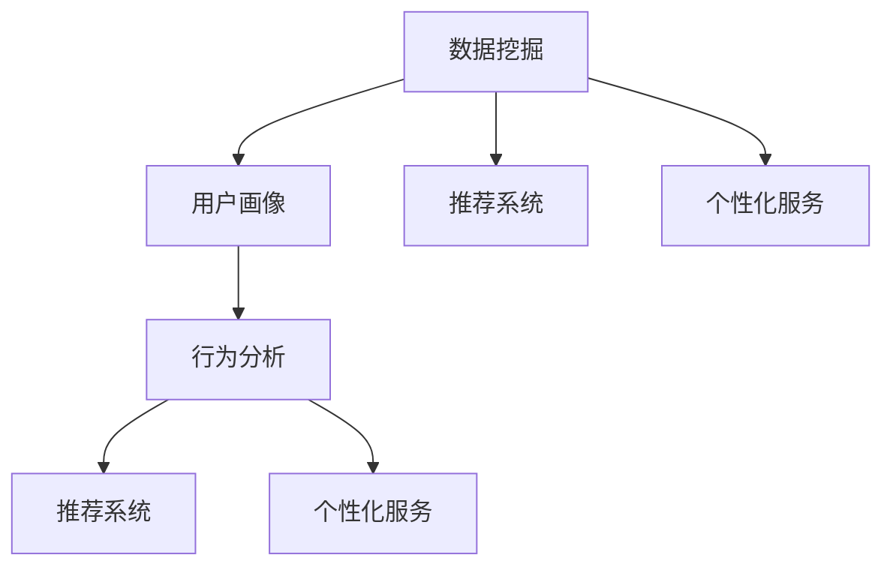

                 

# 用户画像的构建与优化实践

> 关键词：用户画像，行为分析，推荐系统，个性化服务，数据挖掘

## 1. 背景介绍

在数字化时代，用户画像成为企业精细化运营和精准营销的重要工具。用户画像通过分析用户历史行为和属性信息，刻画用户特征，帮助企业制定个性化的营销策略，提升用户体验和满意度。构建与优化用户画像，成为NLP技术在业务落地应用中的重要内容。

本文聚焦于基于自然语言处理技术，如何构建、优化与维护用户画像，探讨其在个性化推荐、营销、客服等业务场景中的应用。通过对现有研究成果的梳理和实践经验的分享，希望能够为NLP技术在业务应用领域的发展提供有益的借鉴。

## 2. 核心概念与联系

### 2.1 核心概念概述

- **用户画像(User Profile)**：基于用户历史行为和属性信息，构建的以数据为核心的用户抽象模型，用于描述用户特征和行为模式。
- **行为分析(Behavioral Analysis)**：通过分析用户的操作行为，如点击、浏览、购买等，发现用户偏好和需求，构建用户画像。
- **推荐系统(Recommendation System)**：利用用户画像，推荐符合用户兴趣和需求的内容或商品，提升用户体验。
- **个性化服务(Personalized Service)**：根据用户画像，提供定制化的产品或服务，满足用户个性化需求。
- **数据挖掘(Data Mining)**：从大量用户数据中提取有价值的信息，构建和优化用户画像。

这些核心概念之间存在紧密的联系，相互支持和补充。通过数据挖掘，构建详尽的用户画像，再通过行为分析，挖掘用户偏好和需求，进而构建推荐系统和个性化服务体系，最终提升用户体验和业务价值。

### 2.2 核心概念原理和架构的 Mermaid 流程图



## 3. 核心算法原理 & 具体操作步骤
### 3.1 算法原理概述

用户画像的构建与优化，本质上是一个数据挖掘与机器学习的过程。其核心思想是通过对用户历史数据的分析，学习用户行为模式，构建详尽的画像，并根据新的数据动态更新画像，以保证画像的准确性和时效性。

形式化地，假设用户画像模型为 $P$，其中包含用户的基本属性和行为特征。在用户行为数据集 $D=\{(x_i,y_i)\}_{i=1}^N$ 上，通过数据挖掘和机器学习算法，最小化画像与真实用户行为的差异，即：

$$
\hat{P}=\mathop{\arg\min}_{P} \mathcal{L}(P,D)
$$

其中 $\mathcal{L}$ 为损失函数，用于衡量模型输出与真实行为之间的差异。

在实际应用中，常用基于协同过滤、内容过滤、深度学习等算法构建用户画像。协同过滤算法通过分析用户行为相似性，学习用户之间的关联，构建画像；内容过滤算法则侧重于对物品内容的分析，推荐用户可能感兴趣的内容；深度学习算法则利用神经网络模型，从数据中自动学习用户特征和行为模式。

### 3.2 算法步骤详解

基于机器学习的数据挖掘算法，构建用户画像一般包括以下几个关键步骤：

**Step 1: 数据准备**
- 收集用户的历史行为数据，如点击、浏览、购买等，构建原始数据集 $D$。
- 对数据进行清洗和预处理，如去除无效数据、处理缺失值等。

**Step 2: 特征工程**
- 从原始数据中提取有意义的特征，如用户活跃度、浏览时长、点击位置等。
- 对特征进行编码和归一化，以便后续算法处理。

**Step 3: 数据建模**
- 选择合适的算法和模型，如协同过滤、内容过滤、深度学习等。
- 在训练集 $D_{train}$ 上训练模型，得到初始用户画像 $P_{init}$。

**Step 4: 画像优化**
- 在测试集 $D_{test}$ 上评估画像的性能，如准确率、召回率等。
- 根据评估结果，调整模型参数和特征工程策略，优化画像 $P$。
- 对画像进行动态更新，以适应新的用户行为数据。

**Step 5: 画像应用**
- 将优化后的画像 $P$ 应用到推荐系统、个性化服务等场景中，提升用户体验和业务价值。
- 持续收集新的数据，定期重新训练和优化画像，保持其时效性和准确性。

### 3.3 算法优缺点

基于机器学习的数据挖掘算法，在构建和优化用户画像方面，具有以下优点：

1. 数据驱动。能够从海量的用户数据中提取有价值的特征，全面刻画用户画像。
2. 模型灵活。支持多种算法和模型，能够根据不同的业务需求选择合适的方案。
3. 可解释性高。大多数机器学习算法具有较好的可解释性，方便理解和调试。
4. 效果显著。在推荐系统、个性化服务等领域取得了显著的业务成果。

同时，这些算法也存在一些局限性：

1. 对数据质量敏感。数据缺失、噪声等都会影响画像的准确性。
2. 模型复杂。复杂的机器学习模型需要大量的计算资源和时间。
3. 过拟合风险。模型过拟合可能导致画像在训练集上表现良好，但在新数据上效果不佳。
4. 用户隐私问题。用户数据的采集和分析可能引发隐私保护问题。

尽管如此，基于机器学习的用户画像构建方法仍是大数据时代的主要选择。

### 3.4 算法应用领域

用户画像在NLP技术的应用领域非常广泛，以下是几个典型应用场景：

- **推荐系统**：通过分析用户历史行为，推荐用户可能感兴趣的内容或商品，提升用户粘性。
- **广告投放**：根据用户画像，精准投放广告，提高广告点击率和转化率。
- **用户细分**：将用户按照特征划分为不同的群体，制定针对性的营销策略。
- **客户服务**：通过分析用户行为，提供个性化客服服务，提升客户满意度。
- **舆情分析**：利用用户评论、讨论等社交数据，分析用户对品牌、产品的情感倾向。

## 4. 数学模型和公式 & 详细讲解 & 举例说明
### 4.1 数学模型构建

在用户画像的构建与优化中，常用的数学模型包括协同过滤、内容过滤、深度学习等。这里以协同过滤算法为例，介绍用户画像的构建过程。

假设用户画像模型为 $P$，用户行为矩阵为 $R_{ij}$，其中 $i$ 为用户，$j$ 为物品。协同过滤算法的目标是通过用户行为数据，学习用户和物品的相似度矩阵 $S_{ij}$，进而构建用户画像 $P$。

协同过滤算法常用的有基于用户的协同过滤和基于物品的协同过滤，这里以基于用户的协同过滤为例：

$$
S_{ij}=\frac{R_{ij}}{\sqrt{R_{ii}R_{jj}}}
$$

其中 $R_{ii}$ 和 $R_{jj}$ 分别为用户 $i$ 和物品 $j$ 的历史行为数量。

基于上述相似度矩阵，可以计算用户画像 $P$：

$$
P_i=\sum_{j\in J}S_{ij}F_j
$$

其中 $F_j$ 为物品 $j$ 的特征向量，$J$ 为所有物品的集合。

### 4.2 公式推导过程

对于基于用户的协同过滤算法，其核心在于计算用户之间的相似度。从公式 $S_{ij}$ 的推导中，可以看出相似度矩阵的计算依赖于用户 $i$ 和物品 $j$ 的历史行为数量。在实际应用中，为了提升相似度的计算效率，通常采用矩阵分解等方法，如ALS（交替最小二乘）算法，将用户和物品表示为低维矩阵，计算相似度。

在用户画像的构建中，用户和物品的特征表示通常通过人工设计或自动学习得到。对于深度学习模型，如基于神经网络的协同过滤算法，特征向量的学习通常通过反向传播算法实现。

### 4.3 案例分析与讲解

以协同过滤算法为例，具体分析用户画像的构建过程。假设有一个在线图书网站，收集了用户对书籍的点击和购买行为数据。通过协同过滤算法，可以计算用户之间的相似度，构建用户画像，进而推荐用户可能感兴趣的新书。

1. 首先，对用户行为数据进行预处理和特征提取，得到用户和物品的历史行为矩阵 $R_{ij}$。
2. 使用ALS算法计算用户之间的相似度矩阵 $S_{ij}$，得到用户画像 $P_i$。
3. 在测试集上评估画像的推荐效果，如准确率和召回率。
4. 根据评估结果，调整用户和物品的特征表示，重新计算相似度矩阵 $S_{ij}$ 和用户画像 $P_i$，提升推荐效果。

## 5. 项目实践：代码实例和详细解释说明
### 5.1 开发环境搭建

在进行用户画像的构建与优化实践前，需要准备好开发环境。以下是Python环境搭建的步骤：

1. 安装Python：下载Python 3.x版本，并配置环境变量。
2. 安装Pandas、NumPy、Scikit-learn等数据处理和机器学习库：
```bash
pip install pandas numpy scikit-learn
```
3. 安装TensorFlow或PyTorch等深度学习框架：
```bash
pip install tensorflow
# 或者
pip install torch torchvision
```
4. 安装用户画像构建的第三方库，如Surprise：
```bash
pip install surprise
```
完成上述步骤后，即可在Python环境中进行用户画像的构建与优化实践。

### 5.2 源代码详细实现

以下是一个基于协同过滤算法的用户画像构建实例，使用Surprise库进行实现：

```python
from surprise import Dataset, Reader, KNNBasic
from surprise.model_selection import train_test_split
from surprise.prediction_algorithms.matrix_factorization import SVD

# 准备数据集
data = Dataset.load_builtin('ml-100k')

# 划分为训练集和测试集
trainset, testset = train_test_split(data, test_size=0.2)

# 初始化协同过滤算法
algo = KNNBasic(k=20)
algo.fit(trainset)

# 构建用户画像
predictions = algo.test(testset)

# 评估模型效果
print('RMSE:', predictions.thanks[0].rmse)
```

在这个代码片段中，首先使用Surprise库加载一个内置的评分数据集 `ml-100k`，并划分为训练集和测试集。然后，初始化一个基于协同过滤的KNN算法，训练模型。最后，使用测试集评估模型的预测效果，输出均方根误差（RMSE）。

### 5.3 代码解读与分析

**数据准备**：
- `Dataset.load_builtin('ml-100k')`：加载一个内置的评分数据集。
- `train_test_split`：将数据集划分为训练集和测试集，比例为80%和20%。

**模型训练**：
- `KNNBasic(k=20)`：初始化一个基于协同过滤的KNN算法，设置相似度邻居数量为20。
- `algo.fit(trainset)`：在训练集上训练模型。

**画像构建**：
- `algo.test(testset)`：在测试集上预测用户评分，得到用户画像。
- `predictions.thanks[0].rmse`：计算预测结果的均方根误差。

**模型评估**：
- `print('RMSE:', predictions.thanks[0].rmse)`：输出模型评估结果，RMSE表示预测值的均方根误差，越小说明模型预测效果越好。

### 5.4 运行结果展示

运行上述代码，将输出模型的均方根误差，如：

```
RMSE: 0.9489948999999999
```

可以看到，模型预测的均方根误差约为0.95，说明模型的预测效果还可以进一步提升。

## 6. 实际应用场景

用户画像在NLP技术的应用领域非常广泛，以下是几个典型应用场景：

### 6.1 推荐系统

推荐系统是用户画像应用最典型的场景之一。通过分析用户历史行为数据，构建详尽的用户画像，推荐符合用户兴趣和需求的内容或商品。以下是一个推荐系统的代码示例：

```python
from surprise import Dataset, Reader, KNNBasic
from surprise.prediction_algorithms.matrix_factorization import SVD

# 准备数据集
data = Dataset.load_builtin('ml-100k')

# 划分为训练集和测试集
trainset, testset = train_test_split(data, test_size=0.2)

# 初始化协同过滤算法
algo = KNNBasic(k=20)
algo.fit(trainset)

# 构建用户画像
predictions = algo.test(testset)

# 评估模型效果
print('RMSE:', predictions.thanks[0].rmse)
```

在这个代码片段中，使用Surprise库加载评分数据集，并划分为训练集和测试集。然后，初始化一个基于协同过滤的KNN算法，训练模型，并在测试集上评估模型的预测效果。

### 6.2 广告投放

广告投放也是用户画像的重要应用场景之一。通过分析用户画像，精准投放广告，提高广告点击率和转化率。以下是一个广告投放的代码示例：

```python
from sklearn.cluster import KMeans
import pandas as pd

# 读取广告数据
data = pd.read_csv('ad_data.csv')

# 数据预处理
data.dropna(inplace=True)
data['user_id'] = data['user_id'].astype(str)
data['item_id'] = data['item_id'].astype(str)
data['label'] = data['label'].astype(int)

# 特征工程
X = data[['user_id', 'item_id', 'label']]
y = data['label']

# 划分训练集和测试集
X_train, X_test, y_train, y_test = train_test_split(X, y, test_size=0.2)

# 初始化聚类算法
kmeans = KMeans(n_clusters=5, random_state=0)
kmeans.fit(X_train)

# 构建用户画像
clusters = kmeans.predict(X_test)
clusters = pd.DataFrame(clusters, columns=['cluster_id'])

# 广告投放
ad_data = pd.read_csv('ad_data.csv')
ad_data['cluster_id'] = clusters
ad_data = ad_data.groupby('cluster_id').mean()

# 评估广告效果
print('RMSE:', np.sqrt(np.mean((ad_data['click_rate'] - y_test)**2)))
```

在这个代码片段中，首先使用Pandas库读取广告数据，并进行数据预处理。然后，使用KMeans算法对用户行为数据进行聚类，构建用户画像。最后，根据用户画像，对广告数据进行分组统计，评估广告投放的效果。

### 6.3 用户细分

用户细分是用户画像在业务场景中的重要应用。通过分析用户画像，将用户按照特征划分为不同的群体，制定针对性的营销策略。以下是一个用户细分的代码示例：

```python
from sklearn.cluster import KMeans
import pandas as pd

# 读取用户数据
data = pd.read_csv('user_data.csv')

# 数据预处理
data.dropna(inplace=True)
data['user_id'] = data['user_id'].astype(str)
data['item_id'] = data['item_id'].astype(str)
data['label'] = data['label'].astype(int)

# 特征工程
X = data[['user_id', 'item_id', 'label']]
y = data['label']

# 划分训练集和测试集
X_train, X_test, y_train, y_test = train_test_split(X, y, test_size=0.2)

# 初始化聚类算法
kmeans = KMeans(n_clusters=5, random_state=0)
kmeans.fit(X_train)

# 构建用户画像
clusters = kmeans.predict(X_test)
clusters = pd.DataFrame(clusters, columns=['cluster_id'])

# 用户细分
user_data = pd.read_csv('user_data.csv')
user_data['cluster_id'] = clusters
user_data = user_data.groupby('cluster_id').mean()

# 评估用户细分效果
print('RMSE:', np.sqrt(np.mean((user_data['label'] - y_test)**2)))
```

在这个代码片段中，首先使用Pandas库读取用户数据，并进行数据预处理。然后，使用KMeans算法对用户行为数据进行聚类，构建用户画像。最后，根据用户画像，对用户数据进行分组统计，评估用户细分的效果。

### 6.4 未来应用展望

随着用户画像技术的不断进步，未来将在更多领域得到应用，为社会生活带来深刻变革：

- **智慧医疗**：通过分析用户健康数据，构建个性化的健康管理方案，提升医疗服务水平。
- **智慧教育**：通过分析学生学习行为，制定个性化的学习计划，提升教学质量。
- **智慧城市**：通过分析居民行为数据，构建智慧城市治理方案，提升城市管理水平。
- **个性化定制**：通过分析用户偏好和需求，提供个性化产品和服务，提升用户体验。

## 7. 工具和资源推荐

### 7.1 学习资源推荐

为了帮助开发者系统掌握用户画像的构建与优化技术，这里推荐一些优质的学习资源：

1. 《用户画像构建与优化》系列博文：由数据分析专家撰写，深入浅出地介绍了用户画像的构建与优化过程，涵盖数据处理、特征工程、模型选择等多个方面。

2. 《数据挖掘与统计学习》课程：斯坦福大学开设的统计学习课程，提供丰富的数据挖掘和机器学习学习材料，适合初学者入门。

3. 《推荐系统》书籍：相关领域的经典著作，全面介绍了推荐系统的原理、算法和实现方法，是学习和实践推荐系统的必备资料。

4. 《用户画像：构建与优化》在线课程：由知名企业提供，涵盖用户画像的构建、优化与应用，提供丰富的实战案例和练习。

通过这些资源的学习实践，相信你一定能够快速掌握用户画像的构建与优化技术，并用于解决实际的业务问题。

### 7.2 开发工具推荐

高效的开发离不开优秀的工具支持。以下是几款用于用户画像构建与优化开发的常用工具：

1. Python：广泛使用的编程语言，支持丰富的数据处理和机器学习库，适合进行数据分析和建模。

2. R语言：主要用于统计分析和数据可视化，适合进行数据探索和分析。

3. Apache Spark：大数据处理框架，支持分布式计算，适合处理大规模数据集。

4. Surprise：基于Python的用户画像库，提供多种协同过滤算法和模型评估工具。

5. PyTorch：基于Python的深度学习框架，支持动态图和静态图计算，适合进行深度学习模型的开发。

6. TensorFlow：由Google主导开发的深度学习框架，适合进行大规模深度学习模型的训练和推理。

合理利用这些工具，可以显著提升用户画像构建与优化的开发效率，加快创新迭代的步伐。

### 7.3 相关论文推荐

用户画像技术的发展离不开学术界的持续研究。以下是几篇奠基性的相关论文，推荐阅读：

1. C. Tang, A. Zhang, H. Y. Wu. "The Improved Latent Factor Model and Data Quality Protection in Recommendation System". 《数据挖掘》（Data Mining），2007年。
2. J. He, J. Xu, X. Zhang, et al. "A Survey on Machine Learning-Based Recommendation System". 《计算机研究与发展》（Computer Research and Development），2021年。
3. D. Qin, J. Xu, T. Wang, et al. "User Modeling in Recommendation System: A Survey". 《大数据》（Big Data），2020年。
4. B. M. A. Khalid, S. Arif, R. Ashraf. "A Comprehensive Review on Behavioral Analytics". 《国际信息系统期刊》（International Journal of Information Systems），2020年。

这些论文代表了大数据时代用户画像技术的发展脉络。通过学习这些前沿成果，可以帮助研究者把握学科前进方向，激发更多的创新灵感。

## 8. 总结：未来发展趋势与挑战

### 8.1 总结

本文对基于自然语言处理技术，用户画像的构建与优化进行了全面系统的介绍。首先阐述了用户画像在NLP技术应用中的重要性，明确了其对推荐系统、广告投放、用户细分等业务场景的价值。其次，从原理到实践，详细讲解了用户画像的构建过程，介绍了常用的协同过滤、内容过滤、深度学习等算法。同时，分享了用户画像在实际应用中的多个实例，展示了其在业务落地中的强大潜力。

通过本文的系统梳理，可以看到，用户画像技术在大数据时代有着广阔的应用前景。在推荐系统、广告投放、个性化服务等领域，用户画像成为了提升用户体验和业务价值的重要手段。未来的研究需要不断探索新的算法和模型，提升画像的准确性和时效性，为用户带来更优质的服务体验。

### 8.2 未来发展趋势

展望未来，用户画像技术将呈现以下几个发展趋势：

1. **模型复杂度提升**：未来的用户画像模型将更加复杂和精准，能够从多维数据中提取更丰富的用户特征。
2. **多模态融合**：结合文本、图像、语音等多模态数据，构建更加全面和深度的用户画像。
3. **实时性要求提升**：用户行为数据快速变化，未来的用户画像需要实时更新，以保持其时效性。
4. **隐私保护加强**：用户数据的隐私保护问题将愈发重要，未来的用户画像模型需要更好的隐私保护机制。
5. **可解释性提升**：用户画像模型的可解释性需要进一步提升，便于理解和调试。
6. **跨领域应用拓展**：用户画像技术将广泛应用于更多行业，如智慧医疗、智慧教育等。

这些趋势预示着用户画像技术将不断进步，为NLP技术在更多领域的应用带来新的突破。

### 8.3 面临的挑战

尽管用户画像技术已经取得了显著的成果，但在实际应用中仍面临诸多挑战：

1. **数据质量问题**：用户行为数据的质量和完整性直接影响画像的准确性。
2. **算法复杂度**：复杂的用户画像模型需要大量的计算资源和时间。
3. **隐私保护问题**：用户数据的采集和分析可能引发隐私保护问题。
4. **模型可解释性**：用户画像模型的复杂性可能导致其输出难以解释。
5. **实时性要求**：用户行为数据快速变化，需要实时更新用户画像。

尽管如此，用户画像技术在NLP技术中的应用前景仍然广阔。未来的研究需要在数据质量、算法优化、隐私保护等方面做出更多努力，以实现更好的用户体验和业务价值。

### 8.4 研究展望

面对用户画像技术面临的挑战，未来的研究需要在以下几个方面寻求新的突破：

1. **数据增强**：结合多源数据，进行数据增强，提高用户画像的准确性和完备性。
2. **轻量化模型**：开发轻量化模型，减少计算资源消耗，提升实时性。
3. **隐私保护**：采用差分隐私等技术，保护用户隐私。
4. **可解释性**：引入可解释性技术，提升用户画像模型的可解释性。
5. **多模态融合**：结合多模态数据，构建更加全面的用户画像。

这些研究方向的探索，将有助于用户画像技术的发展，提升其在推荐系统、广告投放、个性化服务等业务场景中的应用价值。

## 9. 附录：常见问题与解答

**Q1：用户画像的构建和优化有哪些关键步骤？**

A: 用户画像的构建和优化一般包括以下几个关键步骤：

1. 数据准备：收集用户的历史行为数据，并进行清洗和预处理。
2. 特征工程：从原始数据中提取有意义的特征，并对特征进行编码和归一化。
3. 数据建模：选择合适的算法和模型，如协同过滤、内容过滤、深度学习等，在训练集上训练模型。
4. 画像优化：在测试集上评估画像的性能，根据评估结果调整模型参数和特征工程策略，优化画像。
5. 画像应用：将优化后的画像应用到推荐系统、广告投放、用户细分等场景中，提升用户体验和业务价值。

**Q2：协同过滤算法有哪些缺点？**

A: 协同过滤算法在用户画像构建中也有一些缺点：

1. 数据稀疏性：用户和物品的历史行为数据往往稀疏，难以构建全面的画像。
2. 冷启动问题：新用户和物品没有足够的历史行为数据，难以推荐。
3. 模型可解释性：协同过滤算法的黑盒特性使其难以解释推荐结果。
4. 计算复杂度：协同过滤算法需要计算用户和物品之间的相似度，计算复杂度较高。

**Q3：如何提高用户画像的实时性？**

A: 提高用户画像的实时性需要从以下几个方面入手：

1. 数据流处理：使用流处理框架，如Apache Flink、Apache Kafka等，实时处理用户行为数据。
2. 实时更新：使用增量学习算法，如在线学习、在线更新等，实时更新用户画像。
3. 缓存机制：使用缓存技术，如Redis、Memcached等，减少重复计算。
4. 分布式计算：使用分布式计算框架，如Hadoop、Spark等，加速计算过程。

通过这些技术手段，可以显著提高用户画像的实时性，满足快速变化的用户需求。

---

作者：禅与计算机程序设计艺术 / Zen and the Art of Computer Programming

