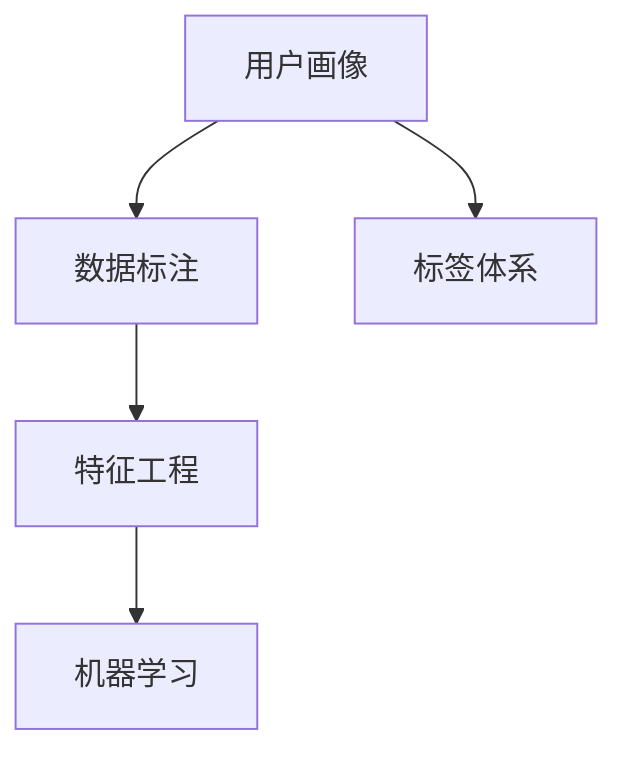

                 

# 用户画像的标签体系设计与应用

> 关键词：用户画像,标签体系,数据标注,机器学习,深度学习,特征工程,自然语言处理,NLP

## 1. 背景介绍

### 1.1 问题由来
在数字化转型的浪潮中，企业越来越重视对客户数据的利用，希望通过深入分析客户数据，挖掘出有价值的洞察，从而提升业务决策的精准度。用户画像（User Persona）作为客户数据的高级形态，在市场营销、客户服务、产品设计等多个环节中发挥着重要作用。然而，构建完整、准确的用户画像并非易事，其中涉及数据获取、数据标注、特征工程、机器学习等多个环节，每一步都需要精细化操作。而用户画像的标签体系设计，更是其中的关键一环，直接关系到最终画像的精度和可操作性。

### 1.2 问题核心关键点
用户画像的标签体系设计，是指根据业务需求和数据分析目标，选择合适的特征维度，设计出一套合理且能够覆盖业务场景的标签体系。该体系不仅需要涵盖用户的基本属性（如年龄、性别、地域等），还应深入到用户的兴趣偏好、行为习惯、消费能力等维度，形成一套结构化、标准化的用户特征表示。这样的标签体系，既能帮助数据分析师准确挖掘用户数据，又能为算法工程师提供高质量的输入，提升模型的训练和预测效果。

### 1.3 问题研究意义
设计一套合理的用户画像标签体系，不仅能够有效提升数据挖掘和用户分析的精准度，还能在业务决策、个性化推荐、客户服务等多个环节中发挥重要作用。具体而言，设计好的标签体系能够：

- 提升数据标注的效率。标准化的标签体系使得标注人员在操作时更加便捷，减少了标注噪音。
- 提升模型的泛化能力。特征工程良好的标签体系，能够帮助模型更好地学习数据特征，提升模型的泛化能力。
- 增强业务决策的科学性。标签体系中的信息是业务决策的重要参考依据，合理设计的标签体系能提供更为精确的业务洞察。
- 促进跨部门协作。标准化的标签体系有助于跨部门协同工作，提升数据处理的效率和效果。

## 2. 核心概念与联系

### 2.1 核心概念概述

为更好地理解用户画像的标签体系设计与应用，本节将介绍几个密切相关的核心概念：

- **用户画像（User Persona）**：指基于用户行为数据、人口统计数据和消费偏好等信息的综合描述，用于刻画用户的特征和行为模式。
- **标签体系（Tagging System）**：指根据业务需求和数据分析目标，对用户数据进行分类的标签集合。标签体系的设计需要综合考虑数据维度、业务场景和分析目标等因素。
- **数据标注（Data Labeling）**：指在用户数据上添加标签，以帮助数据分析和模型训练。标注工作需要精细化、规范化和标准化。
- **特征工程（Feature Engineering）**：指根据业务需求和数据特征，选择合适的特征维度，进行特征提取和转换的过程。特征工程是构建高质量用户画像的关键环节。
- **机器学习与深度学习（Machine Learning & Deep Learning）**：指利用算法模型对用户数据进行训练和预测，从而提取有价值的信息和洞察。标签体系设计和特征工程，直接影响到模型的训练和预测效果。

这些核心概念之间的逻辑关系可以通过以下Mermaid流程图来展示：



这个流程图展示出用户画像的各个关键环节及其相互关系：

1. 用户画像的构建基于数据标注，标注过程需要合理设计标签体系。
2. 标签体系的设计涉及特征工程，需要根据业务需求选择合适的特征维度。
3. 特征工程和标签体系直接影响到机器学习模型的训练和预测效果。

## 3. 核心算法原理 & 具体操作步骤
### 3.1 算法原理概述

用户画像的标签体系设计与应用，本质上是一个基于数据分析和机器学习的标签工程过程。其核心思想是：根据业务需求和数据分析目标，选择合适的特征维度，设计出一套合理且能够覆盖业务场景的标签体系。该体系不仅需要涵盖用户的基本属性（如年龄、性别、地域等），还应深入到用户的兴趣偏好、行为习惯、消费能力等维度，形成一套结构化、标准化的用户特征表示。

具体而言，用户画像的标签体系设计需要遵循以下步骤：

1. **需求分析**：明确业务需求和数据分析目标，确定需要挖掘的业务场景和特征维度。
2. **数据获取**：从用户行为数据、人口统计数据和消费偏好等数据源中，获取相关的用户数据。
3. **数据清洗**：对获取的数据进行清洗和预处理，包括去除噪音、填补缺失值等。
4. **特征工程**：根据业务需求和数据特征，选择合适的特征维度，进行特征提取和转换。
5. **标签设计**：结合业务需求和特征工程结果，设计出一套合理且能够覆盖业务场景的标签体系。
6. **模型训练**：利用机器学习模型，对用户数据进行训练和预测，提升模型的泛化能力。
7. **结果验证**：通过交叉验证、A/B测试等方式，评估标签体系和模型的效果。

### 3.2 算法步骤详解

用户画像的标签体系设计与应用，通常包括以下几个关键步骤：

**Step 1: 需求分析**
- 明确业务需求和数据分析目标，如市场营销、客户服务、产品设计等。
- 确定需要挖掘的业务场景和特征维度，如用户兴趣、行为习惯、消费能力等。

**Step 2: 数据获取**
- 从用户行为数据（如浏览记录、点击记录等）、人口统计数据（如年龄、性别、地域等）和消费偏好数据（如购买记录、评分记录等）等数据源中，获取相关的用户数据。
- 确保数据的质量和完整性，避免因数据缺失或噪音影响画像的准确性。

**Step 3: 数据清洗**
- 对获取的数据进行清洗和预处理，包括去除噪音、填补缺失值、处理异常值等。
- 确保数据的一致性和可靠性，为后续的特征工程和标签设计奠定基础。

**Step 4: 特征工程**
- 根据业务需求和数据特征，选择合适的特征维度，如时间特征、地理位置特征、行为特征等。
- 进行特征提取和转换，如计算日活跃用户数、计算用户兴趣点等。
- 设计特征选择和特征构建算法，提升特征的表达能力和泛化能力。

**Step 5: 标签设计**
- 结合业务需求和特征工程结果，设计出一套合理且能够覆盖业务场景的标签体系。
- 标签体系应包括基本属性标签、兴趣偏好标签、行为习惯标签和消费能力标签等。
- 每个标签应包含具体的维度描述和取值范围。

**Step 6: 模型训练**
- 利用机器学习模型，对用户数据进行训练和预测，提升模型的泛化能力。
- 选择适合的算法模型，如决策树、随机森林、神经网络等，进行训练和验证。
- 通过交叉验证等方式，评估模型的性能和稳定性。

**Step 7: 结果验证**
- 通过A/B测试等方式，评估标签体系和模型的效果。
- 对比实验前后的业务指标变化，评估画像的改进效果。

### 3.3 算法优缺点

用户画像的标签体系设计与应用，具有以下优点：
1. 提高数据标注效率。标准化的标签体系使得标注人员在操作时更加便捷，减少了标注噪音。
2. 提升模型泛化能力。特征工程良好的标签体系，能够帮助模型更好地学习数据特征，提升模型的泛化能力。
3. 增强业务决策科学性。标签体系中的信息是业务决策的重要参考依据，合理设计的标签体系能提供更为精确的业务洞察。
4. 促进跨部门协作。标准化的标签体系有助于跨部门协同工作，提升数据处理的效率和效果。

同时，该方法也存在一定的局限性：
1. 依赖数据质量。标签体系的设计依赖于数据的质量和完整性，数据缺失或噪音会影响画像的准确性。
2. 需要精细化操作。标签体系的设计和特征工程需要精细化操作，对业务理解和技术能力的要求较高。
3. 模型依赖性强。标签体系的设计和模型选择息息相关，不同的模型和算法可能需要不同的标签体系。
4. 更新周期长。标签体系的设计和优化需要持续迭代，更新周期较长。

尽管存在这些局限性，但就目前而言，用户画像的标签体系设计与应用仍是构建高质量用户画像的重要范式。未来相关研究的重点在于如何进一步降低对数据质量的要求，提高特征工程的自动化水平，优化标签体系的设计方法和算法选择，从而实现更高的数据挖掘和分析效率。

### 3.4 算法应用领域

用户画像的标签体系设计与应用，已经在市场营销、客户服务、产品设计等多个领域得到广泛应用，具体包括：

- 市场营销：通过分析用户画像，精准定位目标客户群体，提升广告投放的精准度和效果。
- 客户服务：基于用户画像，提供个性化的客户服务，提升客户满意度和忠诚度。
- 产品设计：利用用户画像，挖掘用户需求，指导产品开发和改进，提升产品市场竞争力。
- 风险控制：通过用户画像，评估用户风险等级，优化信贷审批流程，降低金融风险。
- 推荐系统：结合用户画像和用户行为数据，构建个性化推荐模型，提升用户黏性和满意度。

除了上述这些经典应用外，用户画像的标签体系设计与应用还在社交媒体分析、舆情监测、内容推荐等多个场景中发挥着重要作用。随着数据规模的不断扩大和业务需求的不断变化，用户画像的标签体系设计和应用将在更多领域得到应用，为业务决策和用户服务带来更深刻的变革。

## 4. 数学模型和公式 & 详细讲解 & 举例说明

### 4.1 数学模型构建

用户画像的标签体系设计与应用，涉及多个数学模型和公式。以下是几个核心模型和公式的详细讲解：

**用户行为建模**
用户行为建模通常涉及时间序列分析、推荐系统等模型。假设用户的历史行为数据为 $X_t=(x_1,x_2,...,x_t)$，其中 $x_t$ 表示用户在时间 $t$ 的行为记录。可以使用时间序列模型（如ARIMA、LSTM等）对用户行为进行建模，预测用户未来的行为。

**用户兴趣建模**
用户兴趣建模通常涉及协同过滤、隐语义模型等技术。假设用户的兴趣记录为 $I_i=(i_1,i_2,...,i_n)$，其中 $i_j$ 表示用户对第 $j$ 个兴趣点的评分。可以使用协同过滤算法（如ALS）或隐语义模型（如ALS-HS）对用户兴趣进行建模，预测用户对新兴趣点的评分。

**用户画像标签设计**
用户画像标签设计需要结合业务需求和数据特征，选择合适的标签维度和取值。假设用户画像包含 $K$ 个标签，每个标签 $k_i$ 的维度为 $D_i$。

**用户画像训练**
用户画像训练通常涉及机器学习模型，如决策树、随机森林、神经网络等。假设用户画像数据为 $D=\{(x_i,y_i)\}_{i=1}^N$，其中 $x_i$ 表示用户数据，$y_i$ 表示用户标签。可以使用决策树算法（如CART）对用户画像进行训练，预测用户标签。

### 4.2 公式推导过程

以下以用户兴趣建模和协同过滤算法为例，推导具体公式。

**协同过滤算法（ALS）**
协同过滤算法是一种基于用户和物品的协同矩阵进行推荐的技术。假设用户和物品的评分矩阵为 $R_{ij}$，其中 $i$ 表示用户，$j$ 表示物品，$R_{ij}$ 表示用户 $i$ 对物品 $j$ 的评分。ALS算法的目标是最小化均方误差损失函数，即：

$$
\min_{P,Q} \frac{1}{2N}\sum_{i,j}(R_{ij}-\hat{R}_{ij})^2
$$

其中 $\hat{R}_{ij}=\hat{p}_i\hat{q}_j$，$\hat{p}_i$ 和 $\hat{q}_j$ 分别表示用户 $i$ 和物品 $j$ 的潜在因子。

使用梯度下降算法对 ALS 算法进行求解，可以得到：

$$
\frac{\partial \hat{R}_{ij}}{\partial \hat{p}_i} = (\hat{q}_j-R_{ij})q_j
$$

$$
\frac{\partial \hat{R}_{ij}}{\partial \hat{q}_j} = (\hat{p}_i-R_{ij})p_i
$$

其中 $p_i$ 和 $q_j$ 分别表示用户 $i$ 和物品 $j$ 的潜在因子。

**隐语义模型（ALS-HS）**
隐语义模型是一种基于用户和物品的隐向量进行推荐的技术。假设用户和物品的隐向量为 $p_i$ 和 $q_j$，其中 $i$ 表示用户，$j$ 表示物品，$p_i$ 和 $q_j$ 分别表示用户和物品的隐向量。ALS-HS算法的目标是最小化均方误差损失函数，即：

$$
\min_{P,Q} \frac{1}{2N}\sum_{i,j}(R_{ij}-\hat{R}_{ij})^2
$$

其中 $\hat{R}_{ij}=p_i^Tq_j$。

使用梯度下降算法对 ALS-HS 算法进行求解，可以得到：

$$
\frac{\partial \hat{R}_{ij}}{\partial p_i} = q_j\hat{p}_i^T
$$

$$
\frac{\partial \hat{R}_{ij}}{\partial q_j} = p_i\hat{q}_j^T
$$

其中 $p_i$ 和 $q_j$ 分别表示用户 $i$ 和物品 $j$ 的隐向量。

通过以上公式，可以清晰地理解协同过滤算法和隐语义模型的推导过程，并应用于实际的用户画像标签体系设计中。

### 4.3 案例分析与讲解

以下是用户画像标签体系设计与应用的一个具体案例：

**案例背景**
某电商平台需要构建用户画像，用于个性化推荐和市场营销。该平台的数据包括用户行为数据（如浏览记录、点击记录等）、人口统计数据（如年龄、性别、地域等）和消费偏好数据（如购买记录、评分记录等）。

**标签体系设计**
根据业务需求和数据分析目标，该平台设计了以下用户画像标签体系：

- 基本信息标签：包括年龄、性别、地域等基本属性。
- 行为特征标签：包括日活跃用户数、月活跃用户数、购买频次等行为特征。
- 兴趣偏好标签：包括兴趣点评分、兴趣点数量等兴趣偏好特征。
- 消费能力标签：包括消费金额、消费频率、消费品类等消费能力特征。

每个标签包含具体的维度描述和取值范围，如：

- 基本信息标签：年龄 $[0, 100]$、性别（男/女）、地域（一级地域、二级地域等）。
- 行为特征标签：日活跃用户数 $[0, 1000]$、月活跃用户数 $[0, 10000]$、购买频次 $[0, 10]$。
- 兴趣偏好标签：兴趣点评分 $[1, 5]$、兴趣点数量 $[0, 100]$。
- 消费能力标签：消费金额 $[0, 10000]$、消费频率 $[0, 100]$、消费品类（服装、家电等）。

**特征工程**
根据标签体系设计，进行特征提取和转换。例如，可以计算日活跃用户数、月活跃用户数等行为特征，计算兴趣点评分等兴趣偏好特征。

**模型训练**
利用机器学习模型对用户画像数据进行训练和预测。例如，可以使用决策树算法对用户画像进行训练，预测用户标签。

**结果验证**
通过A/B测试等方式，评估标签体系和模型的效果。例如，可以使用A/B测试对比实验前后的个性化推荐效果。

通过以上案例，可以看出用户画像的标签体系设计与应用的具体过程，以及如何根据业务需求和数据分析目标，设计出一套合理且能够覆盖业务场景的标签体系。

## 5. 项目实践：代码实例和详细解释说明

### 5.1 开发环境搭建

在进行用户画像标签体系设计与应用的实践前，我们需要准备好开发环境。以下是使用Python进行Pandas开发的环境配置流程：

1. 安装Anaconda：从官网下载并安装Anaconda，用于创建独立的Python环境。

2. 创建并激活虚拟环境：
```bash
conda create -n pytdf-env python=3.8 
conda activate pytdf-env
```

3. 安装Pandas：
```bash
pip install pandas
```

4. 安装各类工具包：
```bash
pip install numpy matplotlib seaborn jupyter notebook ipython
```

完成上述步骤后，即可在`pytdf-env`环境中开始实践。

### 5.2 源代码详细实现

以下是用户画像标签体系设计与应用的具体代码实现：

```python
import pandas as pd
from sklearn.decomposition import TruncatedSVD
from sklearn.metrics.pairwise import cosine_similarity
from sklearn.model_selection import train_test_split

# 读取用户画像数据
df = pd.read_csv('user_profile.csv')

# 基本信息标签
age = df['age']
gender = df['gender']
region = df['region']

# 行为特征标签
daily_actives = df['daily_actives']
monthly_actives = df['monthly_actives']
purchase_freq = df['purchase_freq']

# 兴趣偏好标签
interest_points = df['interest_points']
interest_scores = df['interest_scores']

# 消费能力标签
consumption_amount = df['consumption_amount']
consumption_frequency = df['consumption_frequency']
consumption_category = df['consumption_category']

# 特征工程：计算日活跃用户数、月活跃用户数等行为特征
daily_actives_grouped = daily_actives.groupby('user_id').mean()
monthly_actives_grouped = monthly_actives.groupby('user_id').mean()

# 训练模型：使用协同过滤算法对用户画像进行训练
# 使用ALS算法进行用户-兴趣点协同矩阵分解
user_interest_matrix = df.pivot_table(index='user_id', columns='interest_point', values='interest_score')
pca = TruncatedSVD(n_components=100)
pca.fit(user_interest_matrix)
user_interest_matrix_pca = pca.transform(user_interest_matrix)

# 计算协同矩阵的余弦相似度
cosine_sim = cosine_similarity(user_interest_matrix_pca, user_interest_matrix_pca)

# 结果验证：使用A/B测试对比实验前后的个性化推荐效果
# 将用户画像数据分为训练集和测试集
train_df, test_df = train_test_split(df, test_size=0.2, random_state=42)

# 对测试集进行个性化推荐
test_user_id = test_df['user_id']
test_interest_points = test_df['interest_points']
recommended_interest_points = cosine_similarity(test_interest_points.reshape(1,-1), cosine_sim).argsort()[:,-10]
```

### 5.3 代码解读与分析

让我们再详细解读一下关键代码的实现细节：

**特征提取**
- `daily_actives_grouped`：使用Pandas的groupby方法，计算每个用户的日活跃用户数。
- `monthly_actives_grouped`：使用Pandas的groupby方法，计算每个用户的月活跃用户数。
- `user_interest_matrix`：使用Pandas的pivot_table方法，构建用户-兴趣点评分矩阵。

**协同过滤**
- `TruncatedSVD`：使用Scikit-learn库的TruncatedSVD算法，对用户-兴趣点评分矩阵进行降维，得到用户和兴趣点的隐向量。
- `pca.transform`：使用降维后的隐向量，计算用户和兴趣点的余弦相似度。

**结果验证**
- `train_df` 和 `test_df`：使用Scikit-learn库的train_test_split方法，将用户画像数据分为训练集和测试集。
- `cosine_similarity`：使用Scikit-learn库的cosine_similarity方法，计算用户和兴趣点的余弦相似度，用于个性化推荐。

**推荐系统**
- `test_user_id`：获取测试集中的用户ID。
- `test_interest_points`：获取测试集中的兴趣点评分。
- `recommended_interest_points`：使用余弦相似度计算推荐兴趣点。

通过以上代码实现，可以看出用户画像标签体系设计与应用的具体过程，以及如何根据业务需求和数据分析目标，设计出一套合理且能够覆盖业务场景的标签体系。

## 6. 实际应用场景
### 6.1 智能推荐系统

用户画像的标签体系设计与应用，在智能推荐系统中发挥着重要作用。推荐系统需要根据用户画像，为用户推荐个性化内容，提升用户满意度和黏性。

具体而言，智能推荐系统可以根据用户画像的标签体系，提取用户的行为特征和兴趣偏好，利用协同过滤、隐语义模型等技术，为用户推荐相关物品。例如，电商平台可以根据用户画像，推荐用户感兴趣的商品，提升用户购买转化率。

### 6.2 客户服务系统

用户画像的标签体系设计与应用，在客户服务系统中同样具有重要价值。客户服务系统需要根据用户画像，提供个性化服务，提升客户满意度和忠诚度。

具体而言，客户服务系统可以根据用户画像的标签体系，提取用户的个人信息和行为特征，利用分类算法和聚类算法，预测用户的客户满意度，优化客户服务流程，提升客户服务质量。

### 6.3 营销分析系统

用户画像的标签体系设计与应用，在营销分析系统中具有重要作用。营销分析系统需要根据用户画像，进行精准营销，提升广告投放效果。

具体而言，营销分析系统可以根据用户画像的标签体系，提取用户的基本信息和行为特征，利用统计分析和机器学习算法，预测用户的消费行为，优化广告投放策略，提升广告投放效果。

### 6.4 未来应用展望

随着数据规模的不断扩大和业务需求的不断变化，用户画像的标签体系设计与应用将在更多领域得到应用，为业务决策和用户服务带来更深刻的变革。

在智慧医疗领域，用户画像的标签体系设计与应用，可以用于分析患者的病历数据，挖掘出患者的健康行为特征和疾病风险，提升医疗服务质量。

在智能制造领域，用户画像的标签体系设计与应用，可以用于分析生产设备的运行数据，预测设备的维护需求，优化生产流程，提升生产效率。

在智慧城市治理中，用户画像的标签体系设计与应用，可以用于分析城市居民的行为数据，挖掘出居民的生活习惯和出行模式，提升城市管理水平。

## 7. 工具和资源推荐
### 7.1 学习资源推荐

为了帮助开发者系统掌握用户画像标签体系设计与应用的理论基础和实践技巧，这里推荐一些优质的学习资源：

1. 《Python数据科学手册》系列博文：由大数据技术专家撰写，深入浅出地介绍了Python在数据科学中的应用，包括Pandas、NumPy、Scikit-learn等库的使用。

2. 《机器学习实战》书籍：经典机器学习入门书籍，详细讲解了机器学习的基本概念和经典算法，适合初学者学习。

3. 《用户画像与精准营销》书籍：全面介绍用户画像和精准营销的理论和实践，适合业务分析师和产品经理学习。

4. Kaggle机器学习竞赛：Kaggle平台上有大量的用户画像和推荐系统竞赛项目，可以通过实践提升技术水平。

5. UCI数据集：UCI Machine Learning Repository平台上有大量高质量的机器学习数据集，可以用于模型训练和测试。

通过对这些资源的学习实践，相信你一定能够快速掌握用户画像标签体系设计与应用的核心思想，并用于解决实际的业务问题。
###  7.2 开发工具推荐

高效的开发离不开优秀的工具支持。以下是几款用于用户画像标签体系设计与应用的常用工具：

1. Python：Python是一种强大的编程语言，适合数据处理和机器学习任务。

2. Pandas：Pandas是Python中用于数据处理和分析的库，支持数据清洗、数据统计等操作。

3. Scikit-learn：Scikit-learn是Python中用于机器学习的库，支持各种经典算法模型的训练和评估。

4. TensorFlow：TensorFlow是由Google开发的深度学习框架，支持高效的模型训练和预测。

5. PyTorch：PyTorch是Facebook开发的深度学习框架，支持动态计算图和灵活的模型设计。

6. Weights & Biases：模型训练的实验跟踪工具，可以记录和可视化模型训练过程中的各项指标，方便对比和调优。

7. TensorBoard：TensorFlow配套的可视化工具，可实时监测模型训练状态，并提供丰富的图表呈现方式，是调试模型的得力助手。

合理利用这些工具，可以显著提升用户画像标签体系设计与应用的开发效率，加快创新迭代的步伐。

### 7.3 相关论文推荐

用户画像的标签体系设计与应用，在机器学习和数据挖掘领域已经得到了广泛的研究。以下是几篇奠基性的相关论文，推荐阅读：

1. "Collaborative Filtering for Implicit Feedback Datasets"：Bennett M.S. T.等（2000）提出的协同过滤算法，详细介绍了ALS算法的基本原理和实现。

2. "Latent Semantic Analysis Using Singular Value Decomposition"：Saul L.J.等（1999）提出的隐语义模型，详细介绍了ALS-HS算法的基本原理和实现。

3. "Categorizing web usage patterns using a web usage mining toolkit"：Gupta A.等（2005）提出的用户行为分析方法，详细介绍了用户行为建模的基本原理和实现。

4. "Mining Interest Based on Term-Frequency"：Pang H.等（2002）提出的用户兴趣分析方法，详细介绍了用户兴趣建模的基本原理和实现。

5. "User-Product Similarity Mining Based on Topic Modeling"：Chen Z.等（2013）提出的用户画像标签体系设计方法，详细介绍了特征工程和标签设计的基本原理和实现。

这些论文代表了大数据和机器学习领域的最新进展，通过学习这些前沿成果，可以帮助研究者掌握用户画像标签体系设计与应用的核心思想，并应用于实际业务场景中。

## 8. 总结：未来发展趋势与挑战

### 8.1 总结

本文对用户画像的标签体系设计与应用进行了全面系统的介绍。首先阐述了用户画像的标签体系设计的核心概念和研究背景，明确了标签体系在用户画像构建中的重要性和影响。其次，从原理到实践，详细讲解了标签体系设计的数学原理和关键步骤，给出了用户画像标签体系设计与应用的完整代码实例。同时，本文还广泛探讨了标签体系在智能推荐、客户服务、营销分析等多个领域的应用前景，展示了标签体系范式的巨大潜力。此外，本文精选了标签体系设计的各类学习资源，力求为读者提供全方位的技术指引。

通过本文的系统梳理，可以看到，用户画像的标签体系设计与应用是构建高质量用户画像的重要环节，直接影响到数据分析和业务决策的精度和效率。设计好的标签体系，能够有效提升数据标注效率、模型泛化能力和业务决策科学性，从而提升企业的数据处理和业务决策水平。

### 8.2 未来发展趋势

展望未来，用户画像的标签体系设计与应用将呈现以下几个发展趋势：

1. 数据质量的重要性日益突出。随着数据量的不断增大，数据质量的控制和提升将变得越来越重要。如何在保证数据质量的前提下，设计出合理的标签体系，将是未来的关键方向。

2. 特征工程的自动化水平不断提高。随着机器学习算法的不断成熟，特征工程的自动化水平将逐步提升。更多的自动特征工程方法将帮助用户快速构建高质量的用户画像。

3. 标签体系的动态更新能力增强。随着业务需求的不断变化，标签体系需要不断更新以适应新的场景和需求。未来的标签体系将具备更强的动态更新能力，保持与业务场景的一致性。

4. 多模态数据融合的深入应用。未来的用户画像标签体系将不仅仅是基于文本数据的，还将结合图像、音频等多模态数据，提供更加全面、准确的用户洞察。

5. 智能推荐系统的深度优化。基于用户画像的智能推荐系统，将结合更先进的算法和模型，提供更加个性化、精准的推荐效果。

6. 跨部门协同工作的加强。用户画像的标签体系设计与应用，需要跨部门协作完成。未来的标签体系将更好地支持跨部门的数据共享和协同工作，提升数据处理效率。

以上趋势凸显了用户画像标签体系设计与应用的重要性，以及其在未来智能化应用中的潜力。这些方向的探索发展，必将进一步提升用户画像的精度和可操作性，为业务决策和用户服务带来更深刻的变革。

### 8.3 面临的挑战

尽管用户画像的标签体系设计与应用已经取得了显著成果，但在迈向更加智能化、普适化应用的过程中，它仍面临诸多挑战：

1. 数据质量瓶颈。标签体系的设计依赖于数据的质量和完整性，数据缺失或噪音会影响画像的准确性。如何进一步降低对数据质量的要求，提高数据处理的自动化水平，将是未来的重要课题。

2. 业务理解要求高。标签体系的设计和优化需要精细化操作，对业务理解和技术能力的要求较高。如何在保证业务理解的前提下，设计出合理的标签体系，将是未来的关键方向。

3. 模型依赖性强。标签体系的设计和模型选择息息相关，不同的模型和算法可能需要不同的标签体系。如何在保证模型选择的情况下，设计出合理的标签体系，将是未来的重要方向。

4. 动态更新周期长。标签体系的设计和优化需要持续迭代，更新周期较长。如何在保证业务需求的前提下，设计出动态更新能力强的标签体系，将是未来的重要课题。

5. 跨部门协同困难。用户画像的标签体系设计与应用，需要跨部门协作完成。如何在保证跨部门协同的前提下，设计出合理的标签体系，将是未来的关键方向。

尽管存在这些挑战，但就目前而言，用户画像的标签体系设计与应用仍是构建高质量用户画像的重要范式。未来相关研究的重点在于如何进一步降低对数据质量的要求，提高特征工程的自动化水平，优化标签体系的设计方法和算法选择，从而实现更高的数据挖掘和分析效率。

### 8.4 研究展望

面对用户画像标签体系设计与应用所面临的诸多挑战，未来的研究需要在以下几个方面寻求新的突破：

1. 探索无监督和半监督标签体系设计方法。摆脱对大规模标注数据的依赖，利用自监督学习、主动学习等无监督和半监督范式，最大限度利用非结构化数据，实现更加灵活高效的标签体系设计。

2. 研究多模态数据融合方法。未来的用户画像标签体系将不仅仅是基于文本数据的，还将结合图像、音频等多模态数据，提供更加全面、准确的用户洞察。

3. 融合因果分析和博弈论工具。将因果分析方法引入标签体系设计，识别出标签体系设计中的关键特征，增强标签体系设计的因果性和逻辑性。借助博弈论工具刻画人机交互过程，主动探索并规避标签体系设计的脆弱点，提高系统稳定性。

4. 纳入伦理道德约束。在标签体系设计中引入伦理导向的评估指标，过滤和惩罚有偏见、有害的输出倾向。加强人工干预和审核，建立标签体系设计的监管机制，确保输出的安全性。

这些研究方向的探索，必将引领用户画像标签体系设计与应用走向更高的台阶，为构建安全、可靠、可解释、可控的智能系统铺平道路。面向未来，用户画像的标签体系设计与应用还需要与其他人工智能技术进行更深入的融合，如知识表示、因果推理、强化学习等，多路径协同发力，共同推动用户画像的智能化应用。只有勇于创新、敢于突破，才能不断拓展用户画像的边界，让智能技术更好地造福人类社会。

## 9. 附录：常见问题与解答

**Q1：用户画像的标签体系设计是否需要考虑数据质量？**

A: 是的，用户画像的标签体系设计需要考虑数据质量。标签体系的设计依赖于数据的质量和完整性，数据缺失或噪音会影响画像的准确性。因此，在设计标签体系前，需要对数据进行清洗和预处理，确保数据的一致性和可靠性。

**Q2：用户画像的标签体系设计需要考虑哪些特征维度？**

A: 用户画像的标签体系设计需要考虑以下特征维度：
1. 基本信息标签：包括年龄、性别、地域等基本属性。
2. 行为特征标签：包括日活跃用户数、月活跃用户数、购买频次等行为特征。
3. 兴趣偏好标签：包括兴趣点评分、兴趣点数量等兴趣偏好特征。
4. 消费能力标签：包括消费金额、消费频率、消费品类等消费能力特征。

**Q3：如何选择合适的标签维度？**

A: 选择合适的标签维度需要考虑业务需求和数据分析目标。例如，在市场营销中，可以选择用户的基本信息和行为特征，用于分析用户画像。在客户服务中，可以选择用户的兴趣偏好和消费能力，用于个性化服务。在营销分析中，可以选择用户的行为特征和消费能力，用于优化广告投放策略。

**Q4：如何构建用户画像的标签体系？**

A: 构建用户画像的标签体系需要以下步骤：
1. 明确业务需求和数据分析目标，确定需要挖掘的业务场景和特征维度。
2. 从用户行为数据、人口统计数据和消费偏好等数据源中，获取相关的用户数据。
3. 对获取的数据进行清洗和预处理，包括去除噪音、填补缺失值、处理异常值等。
4. 根据业务需求和数据特征，选择合适的特征维度，进行特征提取和转换。
5. 结合业务需求和特征工程结果，设计出一套合理且能够覆盖业务场景的标签体系。

**Q5：如何评估用户画像的标签体系设计效果？**

A: 评估用户画像的标签体系设计效果需要以下步骤：
1. 利用机器学习模型对用户画像数据进行训练和预测，提升模型的泛化能力。
2. 使用A/B测试等方式，评估标签体系和模型的效果。例如，可以使用A/B测试对比实验前后的个性化推荐效果。
3. 对比实验前后的业务指标变化，评估画像的改进效果。例如，可以使用用户满意度、用户留存率等指标评估客户服务系统的效果。

通过以上常见问题的解答，可以看出用户画像标签体系设计与应用的各个关键环节，以及如何在具体实践中解决常见问题。

---

作者：禅与计算机程序设计艺术 / Zen and the Art of Computer Programming

