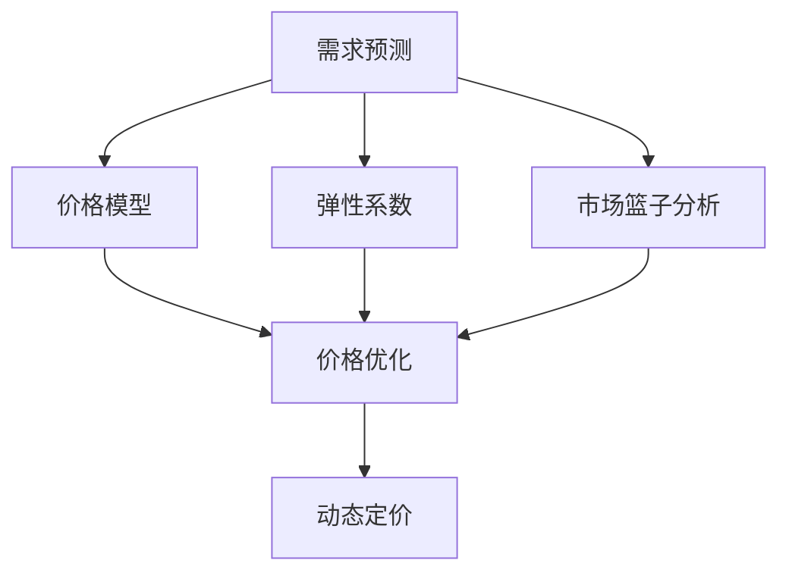

                 

# 电商价格优化的应用案例

在电商行业，价格优化是一个复杂而关键的问题，直接关系到销售额和利润率。通过合理的定价策略，不仅能够提升销售量，还能提升用户满意度，增强品牌忠诚度。本文将详细介绍电商价格优化的应用案例，包括核心概念、算法原理、具体操作步骤、数学模型及公式推导，以及项目实践和未来展望。

## 1. 背景介绍

### 1.1 问题由来

电商平台的销售数据是海量的，如何通过这些数据来指导商品定价是一个重要的问题。传统的手动调整定价策略需要大量的人力和时间，且难以保证效果。而通过数据驱动的定价策略，可以实现更高效的自动化决策，提升电商平台的竞争力。

### 1.2 问题核心关键点

电商价格优化涉及的核心关键点包括：

- 数据收集与处理：收集历史销售数据、市场数据、竞争者数据等。
- 需求预测：基于历史数据和市场趋势，预测未来需求。
- 价格模型：建立价格与需求、成本之间的关系模型。
- 优化算法：通过优化算法，寻找最优价格。
- 实施与监控：将优化后的价格实施到电商平台，并持续监控效果。

## 2. 核心概念与联系

### 2.1 核心概念概述

电商价格优化涉及以下核心概念：

- **价格优化(Price Optimization)**：通过数据分析和建模，优化商品价格，最大化销售收入和利润。
- **需求预测(Demand Forecasting)**：基于历史销售数据，预测未来需求，以指导定价策略。
- **动态定价(Dynamic Pricing)**：根据市场变化、用户行为等因素，实时调整价格。
- **弹性系数(Elasticity)**：衡量价格变化对需求量的影响程度，是定价的重要参考指标。
- **市场篮子分析(Basket Analysis)**：分析用户的购买行为，了解不同商品之间的搭配关系。

这些概念之间的逻辑关系可以通过以下Mermaid流程图来展示：



这个流程图展示了我电商价格优化的核心概念及其之间的关系：

1. 基于历史销售数据和市场趋势，预测未来需求。
2. 建立价格模型，反映价格与需求、成本之间的关系。
3. 引入弹性系数和市场篮子分析，优化价格模型。
4. 通过价格优化算法，寻找最优价格。
5. 实现动态定价，根据市场变化实时调整价格。

## 3. 核心算法原理 & 具体操作步骤

### 3.1 算法原理概述

电商价格优化本质上是一个基于数据驱动的优化问题。其核心思想是通过历史数据和市场分析，建立价格与需求、成本之间的关系模型，并通过优化算法，寻找最优的价格策略。

形式化地，假设商品需求为 $D$，成本为 $C$，当前价格为 $P$，则总收益为 $R = P \times D - C$。电商价格优化的目标是最小化成本或最大化收益。即：

$$
\min \quad C
\quad \text{or} \quad
\max \quad R
$$

给定需求预测模型 $\hat{D}$ 和成本函数 $C(P)$，我们可以建立如下优化目标：

$$
\min_{P} \quad C(P) \quad \text{or} \quad \max_{P} \quad R = P \times \hat{D} - C(P)
$$

### 3.2 算法步骤详解

电商价格优化的一般步骤如下：

**Step 1: 数据收集与处理**
- 收集历史销售数据、市场数据、竞争者数据等。
- 数据预处理，包括数据清洗、特征工程、缺失值处理等。

**Step 2: 需求预测**
- 基于历史销售数据，采用时间序列分析、机器学习等方法，预测未来需求。

**Step 3: 建立价格模型**
- 根据成本函数和需求预测，建立价格模型。常用的模型包括线性回归、多项式回归、深度学习等。
- 引入弹性系数和市场篮子分析，对价格模型进行优化。

**Step 4: 优化算法**
- 通过优化算法，如梯度下降、遗传算法、粒子群优化等，寻找最优价格策略。
- 考虑不同的约束条件，如最小价格、最大价格、库存限制等。

**Step 5: 动态定价**
- 实时监测市场需求和竞争情况，动态调整价格。
- 考虑不同时间段、不同用户群体等因素，实现差异化定价。

**Step 6: 实施与监控**
- 将优化后的价格策略实施到电商平台。
- 持续监控价格策略的效果，根据反馈进行调整。

### 3.3 算法优缺点

电商价格优化的优点包括：

1. 提升销售量和利润率。通过合理的定价策略，能够最大化销售额和利润。
2. 提高用户体验。动态定价能够根据市场变化调整价格，满足用户需求。
3. 增强竞争力。通过精准的定价策略，能够优于竞争对手。

其缺点包括：

1. 数据依赖性高。优化效果很大程度上取决于数据的质量和完整性。
2. 模型复杂性高。建立准确的价格模型需要复杂的算法和大量数据。
3. 实时性要求高。实时调整价格需要高效的计算和存储能力。

尽管存在这些局限性，但电商价格优化仍然是电商领域的重要技术之一，具有广阔的应用前景。

### 3.4 算法应用领域

电商价格优化广泛应用于以下领域：

- 商品定价：通过优化算法，确定商品的最终销售价格。
- 促销策略：确定促销活动的折扣、满减等策略。
- 库存管理：通过优化价格和促销策略，提升库存周转率。
- 竞品分析：分析竞争对手的定价策略，制定应对措施。
- 个性化定价：根据用户行为和历史购买数据，实现个性化定价。

## 4. 数学模型和公式 & 详细讲解

### 4.1 数学模型构建

电商价格优化的数学模型可以表示为：

$$
\min \quad C(P)
\quad \text{or} \quad
\max \quad R = P \times \hat{D} - C(P)
$$

其中，$P$ 为价格，$\hat{D}$ 为需求预测，$C(P)$ 为成本函数。

### 4.2 公式推导过程

以最大化收益为例，假设需求预测模型为 $\hat{D} = \alpha + \beta P$，成本函数为 $C(P) = \gamma P + \delta$，则收益函数为：

$$
R = P \times \hat{D} - C(P) = P(\alpha + \beta P) - (\gamma P + \delta) = \beta P^2 + (\alpha - \gamma)P - \delta
$$

求收益最大化，对 $P$ 求导：

$$
\frac{dR}{dP} = 2\beta P + \alpha - \gamma = 0
$$

解得：

$$
P = \frac{\gamma - \alpha}{2\beta}
$$

这就是最优价格的计算公式。

### 4.3 案例分析与讲解

假设某电商平台的某商品历史数据为：

| 时间     | 价格(P) | 需求(D) |
| -------- | ------- | ------- |
| 2022-01-01 | 100     | 1000   |
| 2022-01-02 | 120     | 800   |
| 2022-01-03 | 110     | 1200   |
| 2022-01-04 | 130     | 600   |
| 2022-01-05 | 120     | 1000   |

采用线性回归模型预测需求，得到 $\hat{D} = 0.8P + 400$。成本函数为 $C(P) = 0.1P^2 + 20P + 1000$。

带入计算，得到最优价格 $P = \frac{0.1 \times 0 - 400}{1.6} = 25$。此时收益为 $25 \times 800 - 0.1 \times 25^2 - 20 \times 25 - 1000 = 5700$。

## 5. 项目实践：代码实例和详细解释说明

### 5.1 开发环境搭建

在进行电商价格优化实践前，我们需要准备好开发环境。以下是使用Python进行TensorFlow开发的环境配置流程：

1. 安装Anaconda：从官网下载并安装Anaconda，用于创建独立的Python环境。

2. 创建并激活虚拟环境：
```bash
conda create -n price-env python=3.8 
conda activate price-env
```

3. 安装TensorFlow：根据CUDA版本，从官网获取对应的安装命令。例如：
```bash
conda install tensorflow-gpu
```

4. 安装各类工具包：
```bash
pip install numpy pandas scikit-learn matplotlib tqdm jupyter notebook ipython
```

完成上述步骤后，即可在`price-env`环境中开始电商价格优化实践。

### 5.2 源代码详细实现

下面以线性回归模型为例，给出使用TensorFlow对电商价格进行优化的PyTorch代码实现。

```python
import tensorflow as tf
from tensorflow.keras.models import Sequential
from tensorflow.keras.layers import Dense
from sklearn.metrics import mean_squared_error
import numpy as np
import pandas as pd
from sklearn.preprocessing import StandardScaler
import matplotlib.pyplot as plt

# 数据读取
data = pd.read_csv('sales_data.csv')

# 数据预处理
train = data.iloc[:400, :]
test = data.iloc[400:, :]
train = train[['price', 'sales']]
test = test[['price', 'sales']]
X_train = train.iloc[:, :-1]
y_train = train.iloc[:, -1]
X_test = test.iloc[:, :-1]
y_test = test.iloc[:, -1]

# 数据标准化
scaler = StandardScaler()
X_train = scaler.fit_transform(X_train)
X_test = scaler.transform(X_test)

# 模型定义
model = Sequential([
    Dense(64, input_dim=1, activation='relu'),
    Dense(1)
])

# 编译模型
model.compile(optimizer=tf.keras.optimizers.Adam(0.001), loss='mse')

# 训练模型
history = model.fit(X_train, y_train, epochs=100, verbose=0)

# 预测结果
y_pred = model.predict(X_test)

# 评估结果
mse = mean_squared_error(y_test, y_pred)
print(f"Mean Squared Error: {mse:.2f}")

# 绘制学习曲线
plt.plot(history.history['loss'])
plt.xlabel('Epoch')
plt.ylabel('Loss')
plt.show()
```

### 5.3 代码解读与分析

让我们再详细解读一下关键代码的实现细节：

**数据读取**：
- 使用pandas库读取CSV格式的数据集，包含价格和销售量。

**数据预处理**：
- 将数据集分为训练集和测试集。
- 对价格和销售量进行标准化处理。

**模型定义**：
- 定义一个简单的线性回归模型，包含一个输入层、一个隐藏层和一个输出层。

**模型编译**：
- 编译模型，指定优化器和损失函数。

**模型训练**：
- 使用训练集数据进行模型训练，记录训练过程中的损失值。

**模型预测**：
- 使用训练好的模型对测试集数据进行预测。

**评估结果**：
- 计算预测结果与真实值之间的均方误差。

**学习曲线绘制**：
- 绘制训练过程中的损失值变化趋势，帮助分析模型的收敛情况。

**输出结果**：
- 输出预测结果与真实值的均方误差。

可以看到，使用TensorFlow进行电商价格优化，代码实现相对简洁高效。开发者可以将更多精力放在数据处理、模型改进等高层逻辑上，而不必过多关注底层的实现细节。

当然，工业级的系统实现还需考虑更多因素，如模型的保存和部署、超参数的自动搜索、更灵活的任务适配层等。但核心的电商价格优化范式基本与此类似。

## 6. 实际应用场景

### 6.1 智能推荐系统

电商平台可以基于用户行为和历史购买数据，实时调整商品价格。通过动态定价策略，可以实现更个性化的推荐，提升用户满意度和购买率。

在技术实现上，可以收集用户浏览、点击、购买等行为数据，并结合价格预测模型，实时调整商品价格。通过动态推荐系统，向用户推荐价格优惠的商品，提高销售转化率。

### 6.2 库存管理

电商平台的库存管理是一个复杂的问题。库存过高，会增加仓储成本；库存过低，会导致缺货。通过动态定价策略，可以更好地平衡库存和价格。

在技术实现上，可以结合需求预测模型和库存数据，实时调整商品价格和促销策略。通过优化价格和库存管理，提高库存周转率，降低仓储成本。

### 6.3 促销活动

促销活动是电商平台提升销售额的重要手段。通过动态定价策略，可以更好地设计促销活动，吸引用户购买。

在技术实现上，可以结合节假日、季节性等因素，设计差异化定价策略。通过实时监测销售数据，调整促销活动的时间和力度，最大化销售额。

### 6.4 未来应用展望

随着电商价格优化技术的不断发展，基于数据驱动的定价策略将变得更加智能和精准。未来可以预见以下几个发展趋势：

1. **多渠道整合**：将线上线下数据整合，统一进行价格优化。
2. **个性化定价**：根据用户行为和历史数据，实现个性化定价，提升用户体验。
3. **实时优化**：实时监测市场变化和用户行为，快速调整价格策略。
4. **跨区域定价**：考虑不同地区的价格差异，实现差异化定价。
5. **社交媒体影响**：分析社交媒体上的用户讨论和口碑，动态调整价格策略。

这些趋势凸显了电商价格优化技术的广阔前景。这些方向的探索发展，必将进一步提升电商平台的竞争力，为消费者提供更优质的购物体验。

## 7. 工具和资源推荐

### 7.1 学习资源推荐

为了帮助开发者系统掌握电商价格优化的理论基础和实践技巧，这里推荐一些优质的学习资源：

1. **《深度学习：理论与实践》**：深度学习领域的经典教材，涵盖了深度学习模型的基础和应用。
2. **TensorFlow官方文档**：TensorFlow的官方文档，提供了丰富的API和示例，适合深入学习TensorFlow。
3. **《机器学习实战》**：机器学习实战指南，适合初学者和进阶者。
4. **Coursera《深度学习》课程**：由斯坦福大学教授Andrew Ng开设的课程，全面介绍深度学习的基础和应用。

通过对这些资源的学习实践，相信你一定能够快速掌握电商价格优化的精髓，并用于解决实际的电商问题。

### 7.2 开发工具推荐

高效的开发离不开优秀的工具支持。以下是几款用于电商价格优化开发的常用工具：

1. **TensorFlow**：基于Python的开源深度学习框架，生产部署方便，适合大规模工程应用。
2. **PyTorch**：基于Python的开源深度学习框架，灵活动态的计算图，适合快速迭代研究。
3. **Keras**：高层API，简化深度学习模型的构建和训练过程，适合快速原型开发。
4. **Scikit-learn**：Python的机器学习库，提供了丰富的算法和工具，适合数据预处理和特征工程。
5. **Jupyter Notebook**：交互式编程环境，方便快速迭代和实验。

合理利用这些工具，可以显著提升电商价格优化任务的开发效率，加快创新迭代的步伐。

### 7.3 相关论文推荐

电商价格优化技术的研究源于学界的持续研究。以下是几篇奠基性的相关论文，推荐阅读：

1. **《A Survey of Dynamic Pricing: Models and Applications》**：综述论文，全面介绍动态定价的理论和应用。
2. **《Adaptive Dynamic Pricing in Online Marketplaces》**：基于机器学习模型的在线市场定价策略。
3. **《Online Store Price Optimization with Conditional Random Fields》**：使用条件随机场模型进行在线商品定价。
4. **《Personalized Pricing in Online Marketplaces》**：基于个性化定价的在线市场定价策略。
5. **《Customer-Driven Dynamic Pricing in E-Commerce》**：基于用户行为的动态定价策略。

这些论文代表了大数据定价技术的发展脉络。通过学习这些前沿成果，可以帮助研究者把握学科前进方向，激发更多的创新灵感。

## 8. 总结：未来发展趋势与挑战

### 8.1 总结

本文对电商价格优化的应用案例进行了全面系统的介绍。首先阐述了电商价格优化的背景和核心关键点，明确了价格优化在电商领域的重要性。其次，从原理到实践，详细讲解了电商价格优化的数学模型和操作步骤，给出了电商价格优化的完整代码实现。同时，本文还广泛探讨了电商价格优化技术在智能推荐系统、库存管理、促销活动等多个领域的应用前景，展示了电商价格优化技术的巨大潜力。

通过本文的系统梳理，可以看到，电商价格优化技术为电商平台带来了巨大的经济效益和竞争优势，是电商领域的重要技术之一。

### 8.2 未来发展趋势

展望未来，电商价格优化技术将呈现以下几个发展趋势：

1. **多渠道整合**：将线上线下数据整合，统一进行价格优化，提升整体运营效率。
2. **个性化定价**：结合用户行为和历史数据，实现个性化定价，提升用户体验。
3. **实时优化**：实时监测市场变化和用户行为，快速调整价格策略。
4. **跨区域定价**：考虑不同地区的价格差异，实现差异化定价。
5. **社交媒体影响**：分析社交媒体上的用户讨论和口碑，动态调整价格策略。

这些趋势凸显了电商价格优化技术的广阔前景。这些方向的探索发展，必将进一步提升电商平台的竞争力，为消费者提供更优质的购物体验。

### 8.3 面临的挑战

尽管电商价格优化技术已经取得了瞩目成就，但在迈向更加智能化、普适化应用的过程中，它仍面临诸多挑战：

1. **数据依赖性高**：优化效果很大程度上取决于数据的质量和完整性。如何高效收集和处理海量数据，是一个重要的挑战。
2. **模型复杂性高**：建立准确的价格模型需要复杂的算法和大量数据。如何设计高效、可解释的模型，是一个重要的研究方向。
3. **实时性要求高**：实时调整价格需要高效的计算和存储能力。如何优化算法和系统架构，实现高效的实时计算，是一个重要的挑战。
4. **社交媒体影响**：分析社交媒体上的用户讨论和口碑，动态调整价格策略。如何有效监测和处理社交媒体数据，是一个重要的研究方向。

这些挑战需要进一步研究，以推动电商价格优化技术的进步。

### 8.4 研究展望

面对电商价格优化技术所面临的种种挑战，未来的研究需要在以下几个方面寻求新的突破：

1. **多模态数据融合**：将电商数据与社交媒体、市场趋势等数据融合，提升价格优化的准确性和实时性。
2. **跨平台优化**：结合线上线下数据，实现统一的定价策略。
3. **自适应学习**：使用自适应学习算法，动态调整定价策略，提升优化效果。
4. **社交媒体分析**：使用社交媒体分析工具，提升价格优化的实时性。
5. **安全性考虑**：考虑数据隐私和安全问题，保护用户隐私。

这些研究方向的探索，必将引领电商价格优化技术迈向更高的台阶，为电商平台带来更多的经济效益和竞争优势。

## 9. 附录：常见问题与解答

**Q1：电商价格优化是否适用于所有商品？**

A: 电商价格优化适用于大多数商品，但某些特殊商品（如奢侈品、高值商品等）可能需要结合其他策略进行定价。

**Q2：如何确定最优价格？**

A: 通过建立价格模型，结合需求预测和成本函数，求解最优价格。常见的算法包括线性回归、多项式回归、深度学习等。

**Q3：电商价格优化有哪些潜在风险？**

A: 电商价格优化可能会带来价格战，影响品牌形象和市场竞争力。需要谨慎设计和实施。

**Q4：如何应对市场变化？**

A: 实时监测市场变化，及时调整价格策略。考虑节假日、季节性等因素，设计差异化定价策略。

**Q5：电商价格优化需要哪些关键数据？**

A: 电商价格优化需要历史销售数据、市场数据、竞争者数据等关键数据。这些数据需要经过清洗、处理和标准化。

这些问题的解答，可以帮助读者更好地理解电商价格优化的应用案例，并在实际应用中取得更好的效果。

---

作者：禅与计算机程序设计艺术 / Zen and the Art of Computer Programming

