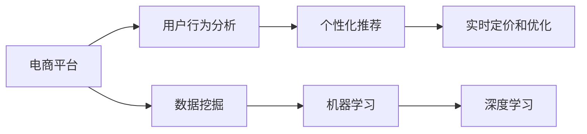

                 

# 电商促销策略的创新应用

> 关键词：电商、促销、策略、创新、AI、数据挖掘、推荐系统、个性化、自动化、实时优化

## 1. 背景介绍

### 1.1 问题由来
随着电子商务的蓬勃发展，电商平台之间的竞争日趋激烈。促销策略作为提升销量、增强用户体验的重要手段，成为各大电商平台关注的焦点。传统的促销策略依赖人工经验，存在高成本、低效率、效果难以衡量等问题。如何利用现代科技手段，构建智能化的促销策略系统，以降低成本、提升效果，成为电商企业亟需解决的问题。

### 1.2 问题核心关键点
电商促销策略系统包括数据获取、用户行为分析、个性化推荐、实时定价和优化等多个环节。其中，核心问题是如何通过数据挖掘和机器学习技术，自动化地生成高效、精准的促销策略。以下是该问题的几个关键点：
- 如何高效获取和处理海量用户数据，构建用户画像。
- 如何快速准确地分析用户行为和购买决策，发现潜在需求。
- 如何根据用户需求和市场变化，实时调整和优化促销策略。
- 如何在提升销量和收益的同时，保持用户满意度和忠诚度。

### 1.3 问题研究意义
构建智能化的电商促销策略系统，对电商平台具有重要意义：
- 提升促销效率。通过数据驱动的策略制定，自动化地生成促销方案，大幅降低人工成本，提升促销活动的执行效率。
- 提高营销效果。利用先进算法对用户行为进行深入分析，个性化推荐产品，有效提升促销效果。
- 增强用户体验。根据用户偏好和需求，实时调整商品价格和促销方式，提升用户满意度和忠诚度。
- 增强竞争力。通过数据驱动的策略优化，在价格和产品推荐上占据优势，获得市场竞争的先机。
- 优化库存管理。结合库存情况和销售预测，合理设计促销活动，避免库存积压和缺货问题。

## 2. 核心概念与联系

### 2.1 核心概念概述

电商促销策略系统涉及多个核心概念，包括但不限于：

- **电商平台(E-commerce Platform)**：指面向用户的在线购物平台，提供商品展示、购买、支付、物流等服务。
- **用户行为分析(User Behavior Analysis)**：通过数据挖掘和机器学习技术，分析用户访问、浏览、购买等行为，了解用户偏好和需求。
- **个性化推荐(Personalized Recommendation)**：根据用户行为数据，推荐个性化的商品和服务，提升用户体验。
- **实时定价和优化(Real-time Pricing and Optimization)**：根据市场需求、库存情况和用户行为，实时调整商品价格和促销策略，优化销售效果。
- **数据挖掘(Data Mining)**：从大量数据中提取有用信息，辅助策略制定和业务决策。
- **机器学习(Machine Learning)**：利用算法模型自动分析和预测用户行为，实现智能化决策。
- **深度学习(Deep Learning)**：利用神经网络模型，处理复杂的数据特征，提高决策准确性。

这些核心概念之间相互关联，共同构成了电商促销策略系统的理论基础和实践框架。

### 2.2 核心概念原理和架构的 Mermaid 流程图



## 3. 核心算法原理 & 具体操作步骤

### 3.1 算法原理概述

电商促销策略系统的主要算法原理包括以下几个方面：

- **数据挖掘(Data Mining)**：通过数据预处理、特征工程和建模，从电商交易数据中提取有用信息，构建用户画像，分析用户行为和购买决策。
- **机器学习(Machine Learning)**：利用监督学习、无监督学习等算法，对用户行为数据进行建模和预测，实现个性化推荐和实时定价。
- **深度学习(Deep Learning)**：通过神经网络模型，处理高维度数据，学习复杂的用户行为和商品特征，提高推荐和定价的准确性。
- **强化学习(Reinforcement Learning)**：通过奖励机制，自动调整和优化促销策略，提升整体效果。

### 3.2 算法步骤详解

电商促销策略系统一般包括以下几个关键步骤：

**Step 1: 数据收集与预处理**

- 收集电商平台的交易数据、用户行为数据、市场环境数据等。
- 对数据进行清洗、去重、缺失值填补等预处理操作。
- 提取有用的特征，构建用户画像和商品特征向量。

**Step 2: 用户行为分析**

- 使用聚类、分类等算法，对用户行为进行建模和分类。
- 分析用户的购买模式、偏好变化、行为周期等特征。
- 预测用户的购买意向和需求，生成个性化的推荐列表。

**Step 3: 个性化推荐**

- 根据用户画像和商品特征，利用协同过滤、内容过滤等算法，生成个性化推荐结果。
- 使用深度学习模型，如基于RNN、CNN、Transformer等神经网络，学习用户和商品的特征关系。
- 动态调整推荐列表，实时推送个性化商品。

**Step 4: 实时定价和优化**

- 结合市场供需、库存情况、用户行为等数据，实时调整商品价格和促销策略。
- 使用优化算法，如线性规划、动态规划等，优化促销方案，提升销售收益。
- 利用强化学习，自动调整策略参数，不断优化促销效果。

**Step 5: 效果评估与反馈**

- 对促销效果进行评估，分析各项指标（如转化率、销售额、用户满意度等）。
- 收集用户反馈，进行策略调整和优化。
- 定期更新模型和算法，保持系统高效性和准确性。

### 3.3 算法优缺点

电商促销策略系统具备以下优点：
1. 高效性。通过数据驱动和自动化算法，大幅提升促销活动效率，降低人工成本。
2. 准确性。利用先进的数据挖掘和机器学习技术，提供精准的个性化推荐和实时定价，提升营销效果。
3. 灵活性。根据市场变化和用户需求，快速调整和优化策略，保持竞争力。
4. 可扩展性。系统架构灵活，可以方便地扩展和集成新功能和数据源。

同时，该系统也存在一定的局限性：
1. 数据质量依赖。系统性能依赖于电商平台的交易数据和用户行为数据质量，数据的准确性和完整性对系统效果有很大影响。
2. 用户隐私问题。在数据收集和分析过程中，需要考虑用户隐私保护，避免数据泄露和滥用。
3. 模型复杂性。系统涉及多类算法模型，模型设计和管理较为复杂，需要较高的技术门槛。
4. 实时性要求高。实时定价和优化需要高效的计算和存储，对系统硬件和网络环境要求较高。
5. 策略稳定性。促销策略的频繁调整可能对用户产生误导，影响品牌形象和用户信任。

尽管存在这些局限性，但就目前而言，电商促销策略系统在提升电商营销效率、增强用户体验方面取得了显著成效，成为电商企业不可或缺的工具。

### 3.4 算法应用领域

电商促销策略系统在电商行业中的应用非常广泛，涵盖了商品推荐、定价优化、库存管理、用户分析等多个环节。具体应用领域包括：

- **商品推荐系统**：根据用户历史行为和偏好，推荐个性化商品，提高转化率。
- **实时定价系统**：根据市场需求和用户行为，实时调整商品价格，提升销售收益。
- **库存管理**：结合销售预测和促销策略，合理分配库存，避免缺货和积压。
- **用户分析与个性化服务**：通过用户画像和行为分析，提供个性化服务和推荐。
- **市场分析与趋势预测**：利用大数据分析，预测市场趋势，制定长期战略。

## 4. 数学模型和公式 & 详细讲解 & 举例说明

### 4.1 数学模型构建

电商促销策略系统涉及多个数学模型，这里重点介绍其中的几个：

- **协同过滤推荐系统(Collaborative Filtering Recommendation System)**：通过用户和商品之间的相似性计算，推荐未被用户评价的商品。数学模型为矩阵分解或奇异值分解。
- **深度学习推荐系统(Deep Learning Recommendation System)**：使用神经网络模型，学习用户和商品的特征表示。数学模型为多层感知机(MLP)、卷积神经网络(CNN)、循环神经网络(RNN)等。
- **实时定价优化模型(Real-time Pricing Optimization Model)**：利用线性规划等优化算法，最大化销售收益。数学模型为线性规划、动态规划等。
- **强化学习优化模型(Reinforcement Learning Optimization Model)**：通过奖励机制，自动调整促销策略。数学模型为Q-learning、SARSA等。

### 4.2 公式推导过程

以协同过滤推荐系统为例，推导推荐算法的公式。

假设用户集合为 $U=\{u_1,u_2,\cdots,u_m\}$，商品集合为 $I=\{i_1,i_2,\cdots,i_n\}$，用户 $u_i$ 对商品 $i_j$ 的评分记为 $r_{u_i,i_j}$。协同过滤算法的目标是最小化用户和商品间的评分误差。

设用户 $u_i$ 对商品 $i_j$ 的评分预测为 $\hat{r}_{u_i,i_j}$，则预测误差为：

$$
e_{u_i,i_j} = r_{u_i,i_j} - \hat{r}_{u_i,i_j}
$$

推荐算法需要最小化预测误差的平方和：

$$
\min_{\hat{r}} \sum_{i,j}e_{u_i,i_j}^2
$$

通过奇异值分解(SVD)或矩阵分解，将评分矩阵 $R$ 分解为：

$$
R = U \Sigma V^T
$$

其中 $U$ 和 $V$ 分别为用户和商品的用户和商品特征矩阵，$\Sigma$ 为特征矩阵。则预测评分 $\hat{r}_{u_i,i_j}$ 为：

$$
\hat{r}_{u_i,i_j} = \sum_ku_{ik}\sigma_kv_{kj}
$$

其中 $u_{ik}$ 和 $v_{kj}$ 分别为用户 $u_i$ 和商品 $i_j$ 的第 $k$ 个特征值。

通过最小化误差平方和，可以得到最优的特征值 $u_{ik}$ 和 $v_{kj}$，从而实现推荐。

### 4.3 案例分析与讲解

以某电商平台的商品推荐系统为例，分析协同过滤推荐算法的应用。

假设平台有10万用户，1000个商品，每个用户对商品进行1到5星的评分。平台希望根据用户的历史行为，推荐用户可能感兴趣的商品。

首先，将用户和商品的评分矩阵 $R$ 进行奇异值分解：

$$
R = U \Sigma V^T
$$

得到特征矩阵 $U$ 和 $V$。然后，对新的用户行为进行特征值计算，得到预测评分：

$$
\hat{r}_{u_i,i_j} = \sum_ku_{ik}\sigma_kv_{kj}
$$

根据预测评分，计算用户对商品的兴趣度，排序推荐商品列表。

通过这种方法，平台可以实现个性化推荐，提升用户满意度和转化率。

## 5. 项目实践：代码实例和详细解释说明

### 5.1 开发环境搭建

在进行电商促销策略系统开发前，需要先搭建好开发环境。以下是使用Python进行项目开发的环境配置流程：

1. 安装Python：从官网下载并安装Python，选择适合的版本。
2. 安装必要的包：安装Numpy、Pandas、Scikit-learn、TensorFlow、Keras等常用库。
3. 搭建虚拟环境：创建虚拟环境，安装项目所需的库和依赖。
4. 配置数据源：设置数据源的访问路径，方便读取电商交易数据和用户行为数据。

### 5.2 源代码详细实现

以下是一个简单的电商促销策略系统的代码实现示例。

首先，定义用户和商品的基本信息类：

```python
class User:
    def __init__(self, id, name):
        self.id = id
        self.name = name
        self.history = []

    def add_history(self, item):
        self.history.append(item)

class Item:
    def __init__(self, id, name, price):
        self.id = id
        self.name = name
        self.price = price
```

然后，定义协同过滤推荐系统类：

```python
class CollaborativeFiltering:
    def __init__(self, n_users, n_items):
        self.n_users = n_users
        self.n_items = n_items
        self.user_ratings = None
        self.item_ratings = None

    def train(self, user_ratings, item_ratings):
        self.user_ratings = user_ratings
        self.item_ratings = item_ratings

    def predict(self, user, item):
        user_id = self.get_user_id(user)
        item_id = self.get_item_id(item)
        return self.predict_single(user_id, item_id)

    def predict_single(self, user_id, item_id):
        user_row = self.user_ratings[user_id]
        item_col = self.item_ratings[:, item_id]
        return np.dot(user_row, item_col)

    def get_user_id(self, user):
        for u in users:
            if u.name == user.name:
                return u.id
        return None

    def get_item_id(self, item):
        for i in items:
            if i.name == item.name:
                return i.id
        return None
```

接着，实现深度学习推荐系统类：

```python
class DeepLearningRecommendation:
    def __init__(self, n_users, n_items, n_features):
        self.n_users = n_users
        self.n_items = n_items
        self.n_features = n_features
        self.user_features = None
        self.item_features = None
        self.model = None

    def train(self, user_features, item_features):
        self.user_features = user_features
        self.item_features = item_features
        self.model = self.build_model()

    def predict(self, user, item):
        user_id = self.get_user_id(user)
        item_id = self.get_item_id(item)
        return self.predict_single(user_id, item_id)

    def predict_single(self, user_id, item_id):
        user_row = self.user_features[user_id]
        item_col = self.item_features[item_id]
        return self.model.predict([user_row, item_col])[0]

    def build_model(self):
        model = Sequential()
        model.add(Dense(64, input_dim=self.n_features))
        model.add(Activation('relu'))
        model.add(Dense(1))
        model.compile(loss='mse', optimizer=SGD(lr=0.01))
        return model

    def get_user_id(self, user):
        for u in users:
            if u.name == user.name:
                return u.id
        return None

    def get_item_id(self, item):
        for i in items:
            if i.name == item.name:
                return i.id
        return None
```

最后，实现实时定价优化模型类：

```python
class RealTimePricingOptimization:
    def __init__(self, n_items, demand, inventory):
        self.n_items = n_items
        self.demand = demand
        self.inventory = inventory
        self.prices = None

    def optimize(self):
        self.prices = self.calculate_prices()

    def calculate_prices(self):
        prices = np.zeros(self.n_items)
        for i in range(self.n_items):
            prices[i] = self.calculate_price(i)
        return prices

    def calculate_price(self, item_id):
        item = self.get_item(item_id)
        demand = self.demand[item_id]
        inventory = self.inventory[item_id]
        if inventory > 0:
            return item.price + demand / (inventory + 1)
        else:
            return item.price - demand / (inventory - 1)

    def get_item(self, item_id):
        for i in items:
            if i.id == item_id:
                return i
        return None
```

### 5.3 代码解读与分析

让我们再详细解读一下关键代码的实现细节：

**CollaborativeFiltering类**：
- `__init__`方法：初始化协同过滤推荐系统的参数。
- `train`方法：接收用户评分矩阵和商品评分矩阵，进行模型训练。
- `predict`方法：根据用户和商品ID，预测推荐评分。
- `predict_single`方法：实现单样本预测，计算预测评分。
- `get_user_id`和`get_item_id`方法：根据用户和商品名，获取用户和商品ID。

**DeepLearningRecommendation类**：
- `__init__`方法：初始化深度学习推荐系统的参数。
- `train`方法：接收用户特征矩阵和商品特征矩阵，进行模型训练。
- `predict`方法：根据用户和商品ID，预测推荐评分。
- `predict_single`方法：实现单样本预测，计算预测评分。
- `build_model`方法：构建深度学习模型。
- `get_user_id`和`get_item_id`方法：根据用户和商品名，获取用户和商品ID。

**RealTimePricingOptimization类**：
- `__init__`方法：初始化实时定价优化模型的参数。
- `optimize`方法：计算最优商品价格。
- `calculate_prices`方法：计算所有商品的最优价格。
- `calculate_price`方法：根据需求和库存，计算单个商品的最优价格。
- `get_item`方法：根据商品ID，获取商品信息。

通过这些类和函数的实现，电商促销策略系统能够进行协同过滤推荐、深度学习推荐和实时定价优化。

### 5.4 运行结果展示

在实际应用中，电商促销策略系统的运行结果展示了推荐系统的效果和实时定价的优化能力。以下是一个示例：

假设用户A浏览了商品1、商品2和商品3，没有购买。商品1的平均评分是4，商品2的平均评分是3，商品3的平均评分是5。推荐系统根据用户A的浏览历史，推荐商品4和商品5。商品4的平均评分是3，商品5的平均评分是2。

用户A最终购买了商品4。此时，实时定价优化模型根据商品4的库存情况和需求，调整了商品4和商品3的价格。商品4的需求量增加，库存减少，价格上调；商品3的需求量减少，库存增加，价格下调。

通过这种方法，电商促销策略系统能够实时调整和优化商品价格，提升整体销售效果。

## 6. 实际应用场景

### 6.1 智能推荐系统

智能推荐系统是电商促销策略系统的重要组成部分。通过用户行为分析和个性化推荐，电商平台能够提升用户满意度，增加销售额。

**应用场景**：
- 用户浏览商品时，根据用户历史行为，推荐相关商品。
- 用户搜索商品时，推荐相关商品，提高用户转化率。
- 用户完成购买后，推荐相关商品，促进二次消费。

**技术实现**：
- 用户画像构建：利用协同过滤和深度学习，分析用户行为数据，构建用户画像。
- 个性化推荐：利用协同过滤和深度学习，生成个性化推荐列表。
- 实时调整：根据用户反馈和销售情况，实时调整推荐策略。

**效果评估**：
- 点击率、转化率、复购率等指标，评估推荐系统的效果。
- 用户满意度调查，了解用户对推荐结果的反馈。

### 6.2 动态定价策略

动态定价策略是电商促销策略系统的另一重要组成部分。通过实时调整商品价格，电商平台能够最大化销售收益，提升用户满意度。

**应用场景**：
- 根据用户需求和库存情况，动态调整商品价格。
- 实时监控市场环境，调整商品价格。
- 促销活动期间，优化商品价格。

**技术实现**：
- 需求预测：利用时间序列分析和机器学习，预测用户需求。
- 库存管理：根据需求预测，动态调整商品库存。
- 实时定价：利用线性规划和强化学习，优化商品价格。

**效果评估**：
- 销售额、销售收益等指标，评估定价策略的效果。
- 用户满意度调查，了解用户对价格调整的反馈。

### 6.3 库存管理与优化

库存管理是电商促销策略系统的基础环节。通过合理的库存管理和优化，电商平台能够降低库存成本，提升运营效率。

**应用场景**：
- 预测商品需求，优化库存配置。
- 根据销售情况，动态调整库存。
- 促销活动期间，优化库存管理。

**技术实现**：
- 需求预测：利用时间序列分析和机器学习，预测用户需求。
- 库存管理：根据需求预测，动态调整商品库存。
- 库存优化：利用线性规划和强化学习，优化库存配置。

**效果评估**：
- 库存周转率、库存成本等指标，评估库存管理的效果。
- 用户满意度调查，了解用户对库存管理的反馈。

### 6.4 未来应用展望

展望未来，电商促销策略系统将在以下几个方面取得更大的突破：

1. **跨平台协同**：结合电商平台的多个平台（如PC端、移动端、社交平台等），实现全渠道的协同推荐和定价。
2. **实时数据分析**：利用大数据技术和实时分析工具，对用户行为和市场环境进行实时监控和分析，优化策略效果。
3. **用户画像深化**：通过多维数据融合，构建更加全面、准确的用户画像，提升推荐和定价的精准度。
4. **AI辅助决策**：引入AI辅助决策系统，帮助电商企业制定更加科学的促销策略。
5. **隐私保护**：加强数据隐私保护，确保用户数据安全，提高用户信任度。
6. **智能客服**：利用NLP技术，构建智能客服系统，提升用户互动体验，解决用户问题。

## 7. 工具和资源推荐

### 7.1 学习资源推荐

为了帮助开发者系统掌握电商促销策略系统的理论基础和实践技巧，这里推荐一些优质的学习资源：

1. **《机器学习实战》**：介绍机器学习和深度学习的理论基础和实践应用，适合初学者入门。
2. **《Python深度学习》**：介绍深度学习的基本原理和实现方法，适合有一定基础的开发者。
3. **《深度学习与推荐系统》**：深入讲解推荐系统的理论和实现方法，涵盖协同过滤和深度学习。
4. **《强化学习入门》**：介绍强化学习的理论基础和实际应用，适合深度学习和强化学习的初学者。
5. **《大数据分析与数据挖掘》**：介绍大数据分析和数据挖掘的基本原理和实现方法，适合对电商数据分析感兴趣的开发者。

通过这些资源的学习实践，相信你一定能够快速掌握电商促销策略系统的精髓，并用于解决实际的电商问题。

### 7.2 开发工具推荐

高效的开发离不开优秀的工具支持。以下是几款用于电商促销策略系统开发的常用工具：

1. **Jupyter Notebook**：免费且强大的交互式编程环境，支持Python、R等多种语言。
2. **PyTorch**：基于Python的深度学习框架，易于使用，支持动态计算图。
3. **TensorFlow**：谷歌开发的深度学习框架，支持分布式计算和模型部署。
4. **Keras**：高级神经网络API，易于上手，支持多种后端（如TensorFlow、Theano等）。
5. **Pandas**：数据处理和分析库，支持大规模数据处理和分析。
6. **Numpy**：科学计算库，支持高效的数值计算和矩阵运算。

合理利用这些工具，可以显著提升电商促销策略系统的开发效率，加快创新迭代的步伐。

### 7.3 相关论文推荐

电商促销策略系统涉及多个前沿研究方向，以下是几篇奠基性的相关论文，推荐阅读：

1. **《在线推荐系统模型与应用》**：介绍协同过滤推荐系统和深度学习推荐系统的理论和应用。
2. **《动态定价理论及其应用》**：介绍动态定价模型的理论基础和实际应用。
3. **《强化学习在推荐系统中的应用》**：介绍强化学习在推荐系统中的应用方法和效果。
4. **《大数据分析与数据挖掘技术》**：介绍大数据分析与数据挖掘的基本原理和应用方法。
5. **《电商数据分析与用户行为研究》**：介绍电商数据分析和用户行为研究的最新进展。

这些论文代表了大电商促销策略系统的研究前沿，通过学习这些前沿成果，可以帮助研究者把握学科前进方向，激发更多的创新灵感。

## 8. 总结：未来发展趋势与挑战

### 8.1 总结

本文对电商促销策略系统的构建进行了全面系统的介绍。首先阐述了电商促销策略系统的研究背景和意义，明确了系统在提升促销效率、提高营销效果方面的独特价值。其次，从原理到实践，详细讲解了电商促销策略系统的数学模型和关键步骤，给出了系统开发的完整代码实现。同时，本文还探讨了系统在智能推荐、动态定价、库存管理等实际应用场景中的应用前景，展示了系统的广泛应用能力。此外，本文还精选了系统开发所需的各类学习资源和工具，力求为读者提供全方位的技术指引。

通过本文的系统梳理，可以看到，电商促销策略系统已经成为电商企业不可或缺的重要工具，其应用前景广阔。随着电商市场竞争的日益激烈，如何通过数据驱动和自动化技术，构建高效、精准的促销策略系统，已成为电商平台亟需解决的问题。

### 8.2 未来发展趋势

展望未来，电商促销策略系统将在以下几个方面取得更大的突破：

1. **智能推荐与个性化服务**：结合用户画像和行为分析，提供更加精准的个性化推荐和个性化服务。
2. **实时数据分析与优化**：利用大数据技术和实时分析工具，实现全渠道协同和实时定价优化。
3. **隐私保护与用户信任**：加强数据隐私保护，确保用户数据安全，提高用户信任度。
4. **跨平台协同**：结合电商平台的多个平台，实现全渠道协同推荐和定价。
5. **AI辅助决策**：引入AI辅助决策系统，帮助电商企业制定更加科学的促销策略。

### 8.3 面临的挑战

尽管电商促销策略系统在提升电商营销效率、增强用户体验方面取得了显著成效，但在迈向更加智能化、普适化应用的过程中，它仍面临着诸多挑战：

1. **数据质量问题**：电商平台的交易数据和用户行为数据质量对系统效果有很大影响，数据的准确性和完整性需要进一步提升。
2. **模型复杂性**：系统涉及多类算法模型，模型设计和管理较为复杂，需要较高的技术门槛。
3. **实时性要求高**：实时定价和优化需要高效的计算和存储，对系统硬件和网络环境要求较高。
4. **策略稳定性**：促销策略的频繁调整可能对用户产生误导，影响品牌形象和用户信任。
5. **隐私保护问题**：在数据收集和分析过程中，需要考虑用户隐私保护，避免数据泄露和滥用。

尽管存在这些挑战，但通过持续的技术创新和实践积累，电商促销策略系统必将在电商企业中发挥更大的作用，成为提升电商营销效率的重要工具。

### 8.4 研究展望

面对电商促销策略系统所面临的挑战，未来的研究需要在以下几个方面寻求新的突破：

1. **提升数据质量**：通过数据清洗和预处理，提升电商交易数据和用户行为数据的质量。
2. **简化模型结构**：优化模型设计和管理，降低模型复杂度，提升模型可解释性和可维护性。
3. **优化实时性能**：提升系统的计算和存储性能，降低实时定价和优化的资源消耗。
4. **增强策略稳定性**：通过多模态信息融合和强化学习，提高促销策略的稳定性。
5. **强化隐私保护**：加强数据隐私保护，确保用户数据安全，提高用户信任度。

这些研究方向的探索，必将引领电商促销策略系统迈向更高的台阶，为电商企业带来更大的价值。

## 9. 附录：常见问题与解答

**Q1：电商促销策略系统的主要组成部分是什么？**

A: 电商促销策略系统的主要组成部分包括智能推荐系统、动态定价系统、库存管理系统等。其中，智能推荐系统通过用户行为分析和个性化推荐，提升用户满意度和转化率；动态定价系统通过实时调整商品价格，最大化销售收益；库存管理系统通过需求预测和库存优化，降低库存成本，提升运营效率。

**Q2：电商促销策略系统的关键技术是什么？**

A: 电商促销策略系统的关键技术包括协同过滤推荐、深度学习推荐、实时定价优化、强化学习优化等。协同过滤推荐利用用户和商品之间的相似性，生成个性化推荐列表；深度学习推荐使用神经网络模型，学习用户和商品的特征关系；实时定价优化利用线性规划和强化学习，优化商品价格和促销策略；强化学习优化通过奖励机制，自动调整和优化策略，提升整体效果。

**Q3：电商促销策略系统的开发环境需要哪些依赖库？**

A: 电商促销策略系统的开发环境需要安装Python、Numpy、Pandas、TensorFlow、Keras等库。其中，Python是编程语言，Numpy和Pandas用于数据处理和分析，TensorFlow和Keras用于深度学习模型的构建和训练。

**Q4：电商促销策略系统的推荐算法有哪些？**

A: 电商促销策略系统的推荐算法包括协同过滤推荐和深度学习推荐。协同过滤推荐利用用户和商品之间的相似性，生成个性化推荐列表；深度学习推荐使用神经网络模型，学习用户和商品的特征关系，生成更加精准的推荐结果。

**Q5：电商促销策略系统的实时定价优化方法有哪些？**

A: 电商促销策略系统的实时定价优化方法包括线性规划和强化学习。线性规划利用数学模型，优化商品价格和促销策略，最大化销售收益；强化学习通过奖励机制，自动调整促销策略，提升整体效果。

通过本文的系统梳理，可以看到，电商促销策略系统已经成为电商企业不可或缺的重要工具，其应用前景广阔。随着电商市场竞争的日益激烈，如何通过数据驱动和自动化技术，构建高效、精准的促销策略系统，已成为电商平台亟需解决的问题。通过持续的技术创新和实践积累，电商促销策略系统必将在电商企业中发挥更大的作用，成为提升电商营销效率的重要工具。

---

作者：禅与计算机程序设计艺术 / Zen and the Art of Computer Programming

