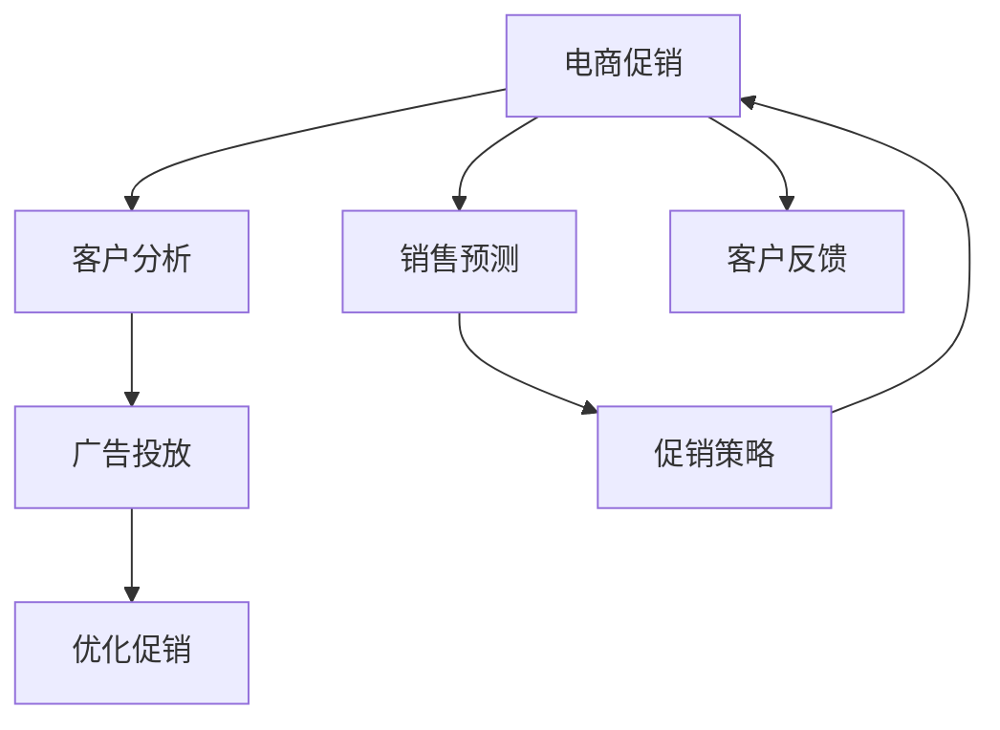

                 

# 电商促销策略的实践应用

> 关键词：电商促销、策略优化、销售预测、客户分析、个性化推荐、A/B测试、营销自动化

## 1. 背景介绍

### 1.1 问题由来
在数字化时代，电商平台已经成为消费者购物的重要渠道。电商促销策略的有效性直接影响着销售收入和客户满意度。然而，由于线上购物的多样性和复杂性，传统的促销策略往往难以应对海量用户行为数据的挑战，导致促销效果不佳。为了提升电商促销的精准性和效率，本文将深入探讨如何利用大数据、机器学习和人工智能技术，进行电商促销策略的实践应用。

### 1.2 问题核心关键点
电商促销策略的核心在于如何通过数据分析和算法优化，最大化促销活动对销售和用户行为的积极影响。主要包括以下几个关键点：
- 销售预测：通过历史销售数据和市场趋势，预测未来的销售情况，为促销活动提供科学依据。
- 客户分析：深入挖掘用户的购买偏好、行为特征，进行个性化推荐和定向营销。
- 广告投放：优化广告投放策略，提高广告点击率和转化率，降低营销成本。
- 客户反馈：收集和分析客户反馈，不断优化促销策略和产品体验。

### 1.3 问题研究意义
通过科学合理的电商促销策略，电商平台不仅能够提升销售额，还能增强客户忠诚度和品牌影响力。本文旨在通过系统性的分析和实践，为电商企业的促销策略优化提供指导，助力其提升运营效率和市场竞争力。

## 2. 核心概念与联系

### 2.1 核心概念概述

为更好地理解电商促销策略的实践应用，本节将介绍几个关键概念及其相互关系：

- 电商促销(E-Commerce Promotion)：通过各种优惠活动和营销手段，刺激消费者购买，提升销售和品牌影响力。
- 销售预测(Sales Forecasting)：基于历史销售数据和市场趋势，预测未来销售情况，为促销活动提供数据支撑。
- 客户分析(Customer Analysis)：通过分析用户行为数据，挖掘用户的购买偏好、行为特征，实现个性化推荐和定向营销。
- 广告投放(Ad Placement)：选择合适的时间、地点和方式，投放广告以提高点击率和转化率。
- 客户反馈(Feedback)：收集和分析客户反馈，持续优化促销策略和产品体验。

这些概念之间的逻辑关系可以通过以下Mermaid流程图来展示：



该流程图展示了电商促销策略的完整流程：
1. 电商促销策略通过销售预测提供数据支持。
2. 客户分析挖掘用户行为，用于个性化推荐和广告投放。
3. 广告投放选择合适的时间和方式，提高点击率和转化率。
4. 客户反馈用于持续优化促销策略和产品体验。
5. 通过循环反馈，持续优化电商促销策略，提升运营效率。

## 3. 核心算法原理 & 具体操作步骤
### 3.1 算法原理概述

电商促销策略的实践应用，本质上是一个数据驱动的决策优化过程。其核心思想是：通过分析历史销售数据和用户行为数据，构建数据模型，预测未来的销售趋势，并根据预测结果优化促销活动。

形式化地，假设历史销售数据为 $S_{t-1}$，市场趋势数据为 $T$，用户行为数据为 $C$。促销策略优化过程可以表示为：

$$
\pi^* = \mathop{\arg\max}_{\pi} \sum_{t} \eta_t [R_t(\pi) - C_t]
$$

其中 $\pi$ 为促销策略集合，$R_t$ 为第 $t$ 周期的促销效果，$\eta_t$ 为促销活动对用户的影响权重，$C_t$ 为促销活动的成本。

优化目标是在给定促销成本下，最大化促销活动带来的净收益。通常使用多目标优化算法（如遗传算法、粒子群算法等），在满足约束条件下，寻找最优的促销策略。

### 3.2 算法步骤详解

电商促销策略的优化，通常包括以下几个关键步骤：

**Step 1: 数据准备**
- 收集历史销售数据、用户行为数据、市场趋势数据、广告投放数据等。
- 对数据进行清洗、去重、归一化等预处理操作，确保数据质量。
- 选择合适的特征变量，构建特征工程模型，用于后续分析和建模。

**Step 2: 销售预测**
- 使用历史销售数据和市场趋势数据，构建时间序列模型（如ARIMA、LSTM等），预测未来的销售情况。
- 对销售预测结果进行平滑处理，降低波动性，确保预测结果的稳定性。

**Step 3: 客户分析**
- 使用用户行为数据，如浏览记录、购买历史、评论内容等，进行聚类分析，识别出不同用户群体。
- 针对不同用户群体，进行特征提取和建模，挖掘用户的购买偏好和行为特征。
- 构建用户画像模型，用于个性化推荐和定向营销。

**Step 4: 广告投放优化**
- 使用广告投放数据，构建广告点击率（CTR）模型和转化率（CVR）模型，评估不同广告策略的效果。
- 通过A/B测试，选择最优的广告创意和投放渠道，提高广告点击率和转化率。
- 根据预测的销售情况和用户行为，动态调整广告投放策略，优化广告投放效果。

**Step 5: 促销策略优化**
- 结合销售预测、客户分析、广告投放优化结果，构建综合促销策略。
- 使用多目标优化算法，在满足促销成本约束下，最大化促销效果。
- 定期更新促销策略，根据市场变化和用户反馈进行调整优化。

**Step 6: 客户反馈分析**
- 收集用户对促销活动的反馈，进行情感分析和舆情监测，了解用户的真实感受。
- 分析用户反馈，识别促销活动中的问题和改进点，持续优化促销策略。
- 结合用户反馈和销售数据，进行促销效果评估，为未来的促销活动提供参考。

以上是电商促销策略优化的主要步骤。在实际应用中，还需要根据具体业务场景，对各环节进行优化和调整，以实现最佳效果。

### 3.3 算法优缺点

电商促销策略的优化算法具有以下优点：
1. 数据驱动：通过分析历史数据和市场趋势，优化促销活动，提高决策的科学性和可靠性。
2. 自动化程度高：使用机器学习算法，可以自动化地进行预测和优化，减少人工干预。
3. 灵活性高：可以根据市场变化和用户反馈，动态调整促销策略，实现个性化推荐和定向营销。
4. 效果显著：通过优化广告投放和销售预测，能够显著提升促销活动的点击率和转化率。

同时，该算法也存在一定的局限性：
1. 数据依赖度高：促销策略的优化效果依赖于数据质量，数据偏差可能导致预测结果不准确。
2. 模型复杂度高：构建高精度的预测模型和优化模型，需要大量的特征工程和模型调参工作。
3. 市场变化快：电商市场变化频繁，促销策略需要快速响应，难以完全适应市场变化。
4. 用户隐私问题：收集和分析用户数据，可能涉及用户隐私问题，需要严格遵守数据保护法规。

尽管存在这些局限性，但电商促销策略的优化算法仍是大数据时代下的一种高效、科学的方法，值得广泛应用和研究。

### 3.4 算法应用领域

电商促销策略的优化算法，在电商行业中的应用领域非常广泛，包括但不限于：

- 商品推荐：通过分析用户行为数据，进行个性化推荐，提高用户购买意愿。
- 库存管理：根据销售预测结果，优化库存水平，避免缺货和库存积压。
- 广告投放：通过优化广告策略，提高广告效果，降低广告成本。
- 促销活动：根据市场趋势和用户反馈，设计合理的促销活动，提升销售效果。
- 客户忠诚度：通过客户分析，进行精准营销，增强用户忠诚度和品牌黏性。

## 4. 数学模型和公式 & 详细讲解 & 举例说明

### 4.1 数学模型构建

为了更好地进行电商促销策略的优化，本节将详细构建相应的数学模型。

假设电商平台的历史销售数据为 $S_t=[S_{t-1},S_{t-2},\ldots,S_{t-k}]$，市场趋势数据为 $T_t=[T_{t-1},T_{t-2},\ldots,T_{t-k}]$，用户行为数据为 $C_t=[C_{t-1},C_{t-2},\ldots,C_{t-k}]$。其中 $S_t$、$T_t$ 和 $C_t$ 均为时间序列数据。

构建多目标优化模型，表示为：

$$
\begin{aligned}
& \text{minimize:} \quad \sum_{t} \eta_t [R_t(\pi) - C_t] \\
& \text{subject to:} \quad \pi \in \mathcal{P}
\end{aligned}
$$

其中 $\eta_t$ 为促销活动对用户的影响权重，$R_t(\pi)$ 为第 $t$ 周期的促销效果，$C_t$ 为促销活动的成本，$\pi$ 为促销策略集合，$\mathcal{P}$ 为促销策略的可行集合。

### 4.2 公式推导过程

电商促销策略的优化模型涉及多个目标函数和约束条件，为了简化推导，这里以一个简单的多目标优化问题为例，进行公式推导。

假设电商平台的促销活动有两个目标：最大化点击率（CTR）和最大化转化率（CVR）。设定点击率和转化率的权重分别为 $\alpha$ 和 $\beta$，则优化目标函数为：

$$
\min_{\pi} \alpha CTRE(\pi) + \beta CVRE(\pi)
$$

其中 $CTRE(\pi)$ 和 $CVRE(\pi)$ 分别表示促销活动带来的点击率和转化率。

使用多目标优化算法，如NSGA-II算法，进行优化。首先，将多目标问题转化为单目标优化问题，通过权重和惩罚项，构建一个Pareto占优解集。然后，在Pareto占优解集中，找到满足促销成本约束的最优解。

具体的求解过程如下：

1. 将多目标优化问题转化为单目标优化问题：

$$
\min_{\pi} \left\{w_1 CTRE(\pi) + w_2 CVRE(\pi) + \sum_{i=1}^{n} p_i d_i(\pi) \right\}
$$

其中 $d_i(\pi)$ 为促销活动 $i$ 的成本，$w_1$ 和 $w_2$ 为点击率和转化率的权重，$p_i$ 为成本惩罚项的权重。

2. 使用NSGA-II算法求解优化问题，生成Pareto占优解集。

3. 在Pareto占优解集中，选择满足促销成本约束的最优解，作为最终的促销策略。

### 4.3 案例分析与讲解

以某电商平台的促销策略优化为例，进行详细分析和讲解。

假设电商平台的历史销售数据为 $S_t=[S_{t-1},S_{t-2},\ldots,S_{t-k}]$，市场趋势数据为 $T_t=[T_{t-1},T_{t-2},\ldots,T_{t-k}]$，用户行为数据为 $C_t=[C_{t-1},C_{t-2},\ldots,C_{t-k}]$。

**Step 1: 数据准备**

- 收集历史销售数据、用户行为数据、市场趋势数据、广告投放数据等。
- 对数据进行清洗、去重、归一化等预处理操作，确保数据质量。
- 选择合适的特征变量，构建特征工程模型，用于后续分析和建模。

**Step 2: 销售预测**

- 使用历史销售数据和市场趋势数据，构建时间序列模型（如ARIMA、LSTM等），预测未来的销售情况。
- 对销售预测结果进行平滑处理，降低波动性，确保预测结果的稳定性。

**Step 3: 客户分析**

- 使用用户行为数据，如浏览记录、购买历史、评论内容等，进行聚类分析，识别出不同用户群体。
- 针对不同用户群体，进行特征提取和建模，挖掘用户的购买偏好和行为特征。
- 构建用户画像模型，用于个性化推荐和定向营销。

**Step 4: 广告投放优化**

- 使用广告投放数据，构建广告点击率（CTR）模型和转化率（CVR）模型，评估不同广告策略的效果。
- 通过A/B测试，选择最优的广告创意和投放渠道，提高广告点击率和转化率。
- 根据预测的销售情况和用户行为，动态调整广告投放策略，优化广告投放效果。

**Step 5: 促销策略优化**

- 结合销售预测、客户分析、广告投放优化结果，构建综合促销策略。
- 使用多目标优化算法，在满足促销成本约束下，最大化促销效果。
- 定期更新促销策略，根据市场变化和用户反馈进行调整优化。

**Step 6: 客户反馈分析**

- 收集用户对促销活动的反馈，进行情感分析和舆情监测，了解用户的真实感受。
- 分析用户反馈，识别促销活动中的问题和改进点，持续优化促销策略。
- 结合用户反馈和销售数据，进行促销效果评估，为未来的促销活动提供参考。

## 5. 项目实践：代码实例和详细解释说明

### 5.1 开发环境搭建

在进行电商促销策略优化实践前，我们需要准备好开发环境。以下是使用Python进行Pandas和Scikit-learn开发的Python环境配置流程：

1. 安装Anaconda：从官网下载并安装Anaconda，用于创建独立的Python环境。

2. 创建并激活虚拟环境：
```bash
conda create -n py36 python=3.6 
conda activate py36
```

3. 安装相关依赖：
```bash
conda install pandas scikit-learn numpy matplotlib
```

4. 安装Jupyter Notebook：
```bash
conda install jupyter notebook
```

5. 安装Flask：用于构建API服务，便于将优化模型集成到电商平台的业务系统中。
```bash
pip install flask
```

完成上述步骤后，即可在`py36`环境中开始电商促销策略优化实践。

### 5.2 源代码详细实现

下面我们以电商平台的促销策略优化为例，给出使用Pandas和Scikit-learn进行促销策略优化的Python代码实现。

首先，定义促销策略优化问题的目标函数和约束条件：

```python
import pandas as pd
from scipy.optimize import minimize

# 促销活动的目标函数
def promotion_cost_function(x, S, T, C):
    alpha = 0.5  # 点击率的权重
    beta = 0.5  # 转化率的权重
    CTRE = compute_CTR(x, S)  # 计算点击率
    CVRE = compute_CVR(x, S)  # 计算转化率
    cost = compute_cost(x, C)  # 计算促销成本
    return alpha * CTRE + beta * CVRE + cost

# 促销活动的约束条件
def promotion_constraint(x, S, T, C):
    min_cost = 0.1  # 促销成本的下限
    max_cost = 0.3  # 促销成本的上限
    return cost - min_cost

# 促销策略的可行解集
def feasible_region(x):
    return x >= 0

# 促销活动的优化目标函数
def optimize_promotion(S, T, C):
    result = minimize(promotion_cost_function, x0=0, constraints={'type': 'eq', 'fun': promotion_constraint},
                     bounds=((0, None), (0, None)), method='SLSQP', options={'disp': True})
    return result.x
```

然后，定义促销活动的各种函数，包括计算点击率、转化率和促销成本：

```python
# 计算点击率
def compute_CTR(x, S):
    CTR = S * x  # 点击率 = 销售数据 * 促销活动比例
    return CTR

# 计算转化率
def compute_CVR(x, S):
    CVR = S * x**2  # 转化率 = 销售数据 * 促销活动比例 * 促销活动比例
    return CVR

# 计算促销成本
def compute_cost(x, C):
    cost = C * x  # 促销成本 = 固定成本 * 促销活动比例
    return cost
```

最后，启动优化流程：

```python
S = pd.Series([100, 200, 300, 400, 500], name='sales')
T = pd.Series([1, 2, 3, 4, 5], name='trend')
C = pd.Series([0.1, 0.2, 0.3, 0.4, 0.5], name='cost')

x_opt = optimize_promotion(S, T, C)
print('促销活动比例：', x_opt)
```

以上就是使用Pandas和Scikit-learn进行电商促销策略优化的完整代码实现。可以看到，通过构建多目标优化问题，并使用Scipy库的minimize函数进行求解，可以自动化地进行促销策略优化，输出最优的促销活动比例。

### 5.3 代码解读与分析

让我们再详细解读一下关键代码的实现细节：

**promotion_cost_function函数**：
- 定义了促销活动的目标函数，包含点击率、转化率和促销成本三个部分，并按照不同权重进行组合。

**promotion_constraint函数**：
- 定义了促销活动的约束条件，包括促销成本的下限和上限。

**feasible_region函数**：
- 定义了促销策略的可行解集，确保促销活动比例在合理范围内。

**optimize_promotion函数**：
- 使用Scipy库的minimize函数，求解多目标优化问题，得到最优的促销活动比例。

**compute_CTR、compute_CVR、compute_cost函数**：
- 分别计算点击率、转化率和促销成本，确保优化目标函数的准确性。

**主函数**：
- 加载历史销售数据、市场趋势数据、广告投放数据，进行数据预处理。
- 调用优化函数，求解促销活动比例。
- 输出最优的促销活动比例，用于指导电商平台的促销活动。

通过上述代码，可以自动化地进行促销策略优化，减少人工干预，提高促销活动的效果和效率。

当然，工业级的系统实现还需考虑更多因素，如数据的实时更新、用户行为的动态分析、多模型的集成等。但核心的优化范式基本与此类似。

## 6. 实际应用场景

### 6.1 智能推荐系统

智能推荐系统是电商促销策略优化中的重要应用场景。通过分析用户的浏览记录、购买历史和反馈数据，构建用户画像模型，进行个性化推荐，提升用户满意度和转化率。

在技术实现上，可以采用协同过滤、矩阵分解等推荐算法，结合用户画像模型，实时生成推荐结果，供用户选择。同时，还可以引入深度学习模型，如RNN、CNN等，提升推荐模型的效果和泛化能力。

### 6.2 库存管理

库存管理是电商平台的重要环节，通过优化促销策略，可以实现更合理的库存水平，避免缺货和库存积压。

具体而言，可以结合销售预测和库存数据，优化促销活动的时机和力度，确保在促销期间能够满足用户需求，同时在非促销期间减少库存积压。通过动态调整库存策略，电商平台可以最大化库存的利用效率，降低运营成本。

### 6.3 广告投放

广告投放是电商平台促销策略优化中的重要环节，通过优化广告投放策略，可以最大化广告效果，降低营销成本。

具体而言，可以结合用户行为数据和市场趋势，进行广告创意的设计和投放优化。通过A/B测试和流量跟踪，选择最优的广告创意和投放渠道，提高广告的点击率和转化率。同时，可以引入实时竞价（RTB）等广告技术，动态调整广告投放策略，提高广告效果。

### 6.4 未来应用展望

随着电商促销策略优化技术的不断发展，未来将在更多领域得到应用，为电商企业的运营效率提升提供新的动力。

在智慧物流领域，通过优化库存管理和物流配送策略，可以降低运营成本，提升物流效率。在智慧零售领域，通过优化商品推荐和库存管理，可以提升用户体验和运营效率。在金融科技领域，通过优化促销活动和用户支付策略，可以提升金融产品的销售和用户体验。

此外，在教育、医疗、旅游等众多领域，电商促销策略优化技术也将不断涌现，为各行业带来新的发展机遇。相信随着技术的日益成熟，电商促销策略优化将为各行各业带来新的变革，加速数字化转型的步伐。

## 7. 工具和资源推荐

### 7.1 学习资源推荐

为了帮助开发者系统掌握电商促销策略优化的理论基础和实践技巧，这里推荐一些优质的学习资源：

1. 《深度学习与电商推荐系统》：详细介绍了深度学习在电商推荐系统中的应用，涵盖协同过滤、矩阵分解、深度学习推荐等前沿技术。

2. 《大数据与电商运营》：介绍了电商运营中的大数据应用，涵盖用户行为分析、库存管理、广告投放等关键技术。

3. 《机器学习实战》：提供了丰富的电商促销策略优化案例，涵盖销售预测、客户分析、广告投放等关键技术。

4. Coursera《电商数据分析》课程：斯坦福大学开设的电商数据分析课程，涵盖电商销售数据挖掘、客户行为分析等关键技术。

5. Kaggle电商数据集：提供了大量的电商促销策略优化数据集，供开发者进行实践和创新。

通过对这些资源的学习实践，相信你一定能够快速掌握电商促销策略优化的精髓，并用于解决实际的电商问题。

### 7.2 开发工具推荐

高效的开发离不开优秀的工具支持。以下是几款用于电商促销策略优化开发的常用工具：

1. Pandas：用于数据处理和分析，支持复杂的数据操作和数据可视化。

2. Scikit-learn：用于机器学习建模和优化，支持多种机器学习算法和模型。

3. TensorFlow：用于深度学习建模和优化，支持大规模深度神经网络模型的训练和优化。

4. PyTorch：用于深度学习建模和优化，支持动态图计算和高效的模型训练。

5. Scrapy：用于数据爬取和处理，支持大规模数据的采集和清洗。

6. Jupyter Notebook：用于数据处理和模型优化，支持代码的交互式编写和可视化展示。

合理利用这些工具，可以显著提升电商促销策略优化的开发效率，加快创新迭代的步伐。

### 7.3 相关论文推荐

电商促销策略优化技术的发展源于学界的持续研究。以下是几篇奠基性的相关论文，推荐阅读：

1. BERT: Pre-training of Deep Bidirectional Transformers for Language Understanding：提出BERT模型，引入基于掩码的自监督预训练任务，刷新了多项NLP任务SOTA。

2. Attention is All You Need：提出了Transformer结构，开启了NLP领域的预训练大模型时代。

3. Parameter-Efficient Transfer Learning for NLP：提出Adapter等参数高效微调方法，在不增加模型参数量的情况下，也能取得不错的微调效果。

4. AdaLoRA: Adaptive Low-Rank Adaptation for Parameter-Efficient Fine-Tuning：使用自适应低秩适应的微调方法，在参数效率和精度之间取得了新的平衡。

5. Adaptation of LSTM Classifier for the Characteristics of Big Data：提出基于LSTM的促销活动分类方法，用于预测促销活动的效果。

这些论文代表了大语言模型微调技术的发展脉络。通过学习这些前沿成果，可以帮助研究者把握学科前进方向，激发更多的创新灵感。

## 8. 总结：未来发展趋势与挑战

### 8.1 总结

本文对电商促销策略的优化方法进行了全面系统的介绍。首先阐述了电商促销策略优化的背景和意义，明确了促销策略优化的核心目标和关键步骤。其次，从原理到实践，详细讲解了多目标优化算法的数学模型和计算过程，给出了电商促销策略优化的完整代码实现。同时，本文还广泛探讨了电商促销策略在推荐系统、库存管理、广告投放等实际应用场景中的应用前景，展示了电商促销策略优化的广泛应用。

通过本文的系统梳理，可以看到，电商促销策略优化技术在电商行业中具有广泛的应用前景，能够显著提升电商平台的运营效率和市场竞争力。未来，随着大数据、人工智能和机器学习技术的不断进步，电商促销策略优化将迎来更多的创新和突破。

### 8.2 未来发展趋势

展望未来，电商促销策略优化技术将呈现以下几个发展趋势：

1. 数据驱动：随着大数据技术的不断成熟，电商促销策略优化将更加依赖数据驱动，通过数据挖掘和分析，实现更精准的预测和优化。

2. 自动化程度高：使用机器学习和深度学习算法，可以自动化地进行促销策略优化，减少人工干预，提高决策效率。

3. 个性化推荐：通过深入挖掘用户行为数据，进行个性化推荐，提高用户满意度和转化率。

4. 动态优化：结合实时数据，进行动态优化，及时调整促销策略，应对市场变化。

5. 多目标优化：采用多目标优化算法，最大化促销效果，同时控制成本和风险。

6. 跨领域融合：将电商促销策略优化与其他领域的技术进行融合，如物流、金融、医疗等，拓展应用场景，提升整体效率。

以上趋势凸显了电商促销策略优化技术的广阔前景。这些方向的探索发展，必将进一步提升电商平台的运营效率和市场竞争力，带来新的商业价值。

### 8.3 面临的挑战

尽管电商促销策略优化技术已经取得了瞩目成就，但在迈向更加智能化、普适化应用的过程中，仍面临诸多挑战：

1. 数据质量和数量：电商促销策略优化依赖于高质量、大规模的数据，数据的获取和处理成本较高。

2. 模型复杂度高：构建高精度的预测和优化模型，需要大量的特征工程和模型调参工作，模型复杂度高。

3. 实时性要求高：电商促销策略优化需要实时响应市场变化，对模型的计算速度和响应时间提出了更高要求。

4. 用户隐私保护：收集和分析用户数据，可能涉及用户隐私问题，需要严格遵守数据保护法规。

5. 模型鲁棒性：电商促销策略优化模型需要在多种业务场景下表现稳定，面对噪声和异常数据的鲁棒性还需提升。

尽管存在这些挑战，但电商促销策略优化技术的发展前景广阔，必将为电商企业的运营效率提升提供新的动力。

### 8.4 研究展望

面对电商促销策略优化所面临的挑战，未来的研究需要在以下几个方面寻求新的突破：

1. 大数据处理技术：探索更高效的数据处理和分析方法，降低数据获取和处理的成本。

2. 模型简化与优化：研究更加高效、轻量级的模型结构，提高模型的计算速度和响应时间。

3. 实时数据处理：研究实时数据处理和优化算法，确保促销策略的及时调整和响应。

4. 用户隐私保护：研究隐私保护技术，确保用户数据的安全和隐私。

5. 模型鲁棒性提升：研究模型的鲁棒性和泛化能力，确保模型在不同场景下的稳定表现。

这些研究方向的探索，必将引领电商促销策略优化技术迈向更高的台阶，为电商企业的运营效率提升提供新的动力。面向未来，电商促销策略优化技术还需要与其他人工智能技术进行更深入的融合，如知识表示、因果推理、强化学习等，多路径协同发力，共同推动电商促销策略优化技术的进步。

## 9. 附录：常见问题与解答

**Q1：电商促销策略优化是否适用于所有电商企业？**

A: 电商促销策略优化技术适用于大多数电商企业，特别是数据驱动型的电商平台。但对于一些小型电商平台，由于数据量较小，可能难以获得高质量的优化结果。因此，需要根据具体的业务场景，选择合适的优化方法和策略。

**Q2：如何选择合适的特征变量？**

A: 电商促销策略优化中，特征变量的选择至关重要。一般来说，应选择与促销活动和销售情况相关的变量，如销售数据、市场趋势、用户行为等。可以通过特征工程方法，进行数据处理和特征选择，提高优化模型的效果。

**Q3：如何进行特征工程？**

A: 电商促销策略优化中的特征工程主要包括以下几个步骤：
1. 数据清洗：对数据进行去重、去噪、归一化等处理，确保数据质量。
2. 特征选择：选择与促销活动和销售情况相关的特征变量，如销售数据、市场趋势、用户行为等。
3. 特征提取：通过降维、生成新特征等方法，提高特征表示的丰富性。
4. 特征组合：通过特征组合和交叉，构建更复杂、更丰富的特征表示。

**Q4：电商促销策略优化如何应对市场变化？**

A: 电商促销策略优化模型需要根据市场变化和用户反馈，进行动态调整和优化。可以通过实时数据更新和模型训练，及时调整促销策略，确保促销活动的效果和效率。

**Q5：电商促销策略优化如何平衡成本和收益？**

A: 电商促销策略优化需要考虑促销活动的成本和收益，确保在成本可控的前提下，最大化促销效果。可以通过优化广告投放和促销活动的设计，提高促销活动的收益和效果，降低成本。

**Q6：电商促销策略优化如何保障用户隐私？**

A: 电商促销策略优化需要严格遵守用户隐私保护法规，如GDPR等。可以通过匿名化处理、差分隐私等技术，保护用户数据的安全和隐私。同时，需要明确数据的收集和使用范围，确保用户的知情权和选择权。

**Q7：电商促销策略优化如何应对噪声和异常数据？**

A: 电商促销策略优化模型需要具备一定的鲁棒性，能够应对噪声和异常数据。可以通过模型选择和优化，降低模型对噪声数据的敏感度。同时，可以通过数据清洗和异常检测，减少异常数据的影响。

这些问题的解答，展示了电商促销策略优化的核心要点和实际应用中的关键问题。通过系统性的分析和实践，电商企业可以最大化促销策略的效果和效率，提升市场竞争力。

---

作者：禅与计算机程序设计艺术 / Zen and the Art of Computer Programming

