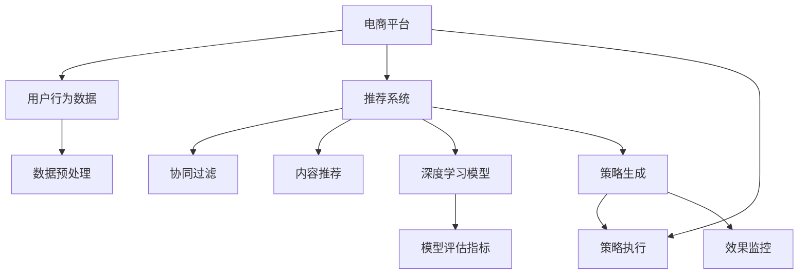

                 

# 电商促销策略的技术实现

> 关键词：电商促销,算法优化,商品推荐,交易转化,大数据分析,机器学习,模型评估,推荐系统

## 1. 背景介绍

### 1.1 问题由来
在电商领域，促销活动是商家提升销售、清理库存、吸引用户的重要手段。然而，传统的人工制定促销策略方法耗时长、成本高，且难以精准把握用户需求，往往导致活动效果不佳。随着大数据和人工智能技术的成熟，基于数据的促销策略生成方法逐渐成为研究热点，能够快速生成多方案，供商家选择最优方案。

### 1.2 问题核心关键点
通过机器学习和数据分析，结合电商平台的实际场景，可以设计出自动化、个性化的促销策略生成系统。该系统核心关键点包括：
1. **大数据分析**：收集用户行为数据，提取有价值的信息。
2. **模型构建**：选择合适的算法模型，如协同过滤、内容推荐、深度学习等，建立商品和用户间的关联。
3. **方案生成**：通过模型训练，自动生成不同促销策略，供商家选择。
4. **评估优化**：设计评估指标，衡量促销策略效果，不断优化策略生成算法。

### 1.3 问题研究意义
基于数据的电商促销策略生成技术，能够显著提升促销活动的效率和效果。该技术可以帮助商家快速制定个性化促销方案，提高商品推荐精度和交易转化率，优化库存管理，减少人力成本，增强用户体验。

## 2. 核心概念与联系

### 2.1 核心概念概述

为更好地理解电商促销策略生成技术，本节将介绍几个关键概念：

- **电商平台**：以电商应用为基础，结合物流、支付等环节，提供商品展示、搜索、购物、支付和物流追踪等服务。
- **用户行为数据**：包括浏览、点击、购买、评价等行为，是分析用户需求、生成促销策略的重要依据。
- **推荐系统**：通过分析用户行为数据，自动生成个性化推荐列表，提升用户体验，增加交易转化率。
- **协同过滤**：基于用户之间的相似性，推断用户可能感兴趣的商品，常用于个性化推荐系统。
- **内容推荐**：基于商品描述、图片等信息，自动生成推荐列表，帮助用户发现潜在新商品。
- **深度学习模型**：如神经网络、卷积神经网络、注意力机制等，通过学习大量数据，提取隐含的特征，用于生成更为精准的推荐和促销策略。
- **模型评估指标**：如精度、召回率、F1分数、ROI等，用于衡量推荐和促销策略的效果，指导优化。

这些概念之间的联系可以通过以下Mermaid流程图来展示：



这个流程图展示了电商平台的核心组件和数据流向：

1. 电商平台收集用户行为数据和销售数据。
2. 通过推荐系统，分析用户数据，生成个性化推荐列表。
3. 推荐系统采用多种算法，包括协同过滤、内容推荐、深度学习等。
4. 模型评估指标用于衡量推荐效果，指导算法优化。
5. 根据推荐结果生成促销策略。
6. 促销策略执行后，监控效果，循环迭代优化。

## 3. 核心算法原理 & 具体操作步骤
### 3.1 算法原理概述

电商促销策略生成系统通常采用以下技术流程：

1. **数据收集与处理**：从电商平台获取用户行为数据和销售数据，进行预处理。
2. **用户画像构建**：利用机器学习算法对用户行为数据进行分析，生成用户画像，捕捉用户偏好和购买力。
3. **商品关联分析**：分析商品描述、图片等信息，生成商品关联网络。
4. **促销方案生成**：结合用户画像和商品关联网络，生成不同促销方案。
5. **效果评估**：使用模型评估指标，评估促销方案的效果，选取最优方案。
6. **迭代优化**：不断收集新数据，重新训练模型，优化促销方案。

### 3.2 算法步骤详解

#### 3.2.1 数据收集与预处理

- **数据源**：电商平台的用户行为数据，如浏览记录、点击行为、购买记录、评价等；销售数据，如商品销售量、库存量等。
- **数据清洗**：去除异常数据、缺失值和重复记录。
- **特征工程**：提取有意义的特征，如用户年龄、性别、地域、浏览时间等；商品属性，如价格、品牌、类别等。

#### 3.2.2 用户画像构建

- **用户行为建模**：使用协同过滤、内容推荐、深度学习等算法，分析用户行为数据，生成用户画像。
- **用户画像表示**：将用户画像表示为高维向量，用于后续的推荐和策略生成。

#### 3.2.3 商品关联分析

- **商品嵌入表示**：将商品描述、图片等信息，通过深度学习模型提取为高维向量，表示商品的语义信息。
- **商品关联网络**：使用图神经网络等算法，分析商品嵌入向量，生成商品关联网络。

#### 3.2.4 促销方案生成

- **策略生成算法**：根据用户画像和商品关联网络，生成不同的促销策略，如打折、买一赠一、组合销售等。
- **策略多样化**：结合历史销售数据和用户反馈，不断优化生成算法，生成更多样化的促销策略。

#### 3.2.5 效果评估

- **评估指标**：使用精度、召回率、F1分数、ROI等指标，衡量促销方案的效果。
- **效果监控**：实时监控促销方案的执行效果，反馈到策略生成算法中，进行动态调整。

#### 3.2.6 迭代优化

- **数据更新**：定期更新用户行为数据和销售数据，重新训练模型，优化策略生成算法。
- **模型更新**：结合新算法和技术，如强化学习、迁移学习等，提升模型的预测精度。

### 3.3 算法优缺点

基于数据的电商促销策略生成技术具有以下优点：

- **效率高**：自动化生成促销方案，大幅减少人工操作。
- **精准性高**：通过数据驱动，生成个性化推荐，提升用户体验和交易转化率。
- **成本低**：减少人工成本，提高运营效率。
- **可扩展性好**：算法可复用，适用于不同电商平台和商品。

同时，该方法也存在一定的局限性：

- **数据质量要求高**：用户行为数据和销售数据的完整性和准确性直接影响策略生成效果。
- **算法复杂度高**：涉及多种算法和模型，技术难度较大。
- **策略多样性有限**：过度依赖算法，可能无法生成非常多样化的促销策略。

尽管存在这些局限性，但就目前而言，基于数据的电商促销策略生成方法仍然是大数据和人工智能在电商领域的重要应用之一。

### 3.4 算法应用领域

基于数据的电商促销策略生成技术，主要应用于以下领域：

- **个性化推荐**：利用用户画像和商品关联网络，生成个性化推荐列表，提升用户体验和交易转化率。
- **库存管理**：通过分析销售数据和用户行为数据，生成库存优化策略，减少库存积压。
- **营销活动设计**：结合用户画像和商品关联网络，生成多方案促销活动，供商家选择。
- **用户留存策略**：通过分析用户行为数据，生成用户留存策略，提升用户忠诚度。

除了以上应用场景，该技术还可进一步拓展到消费者行为分析、市场趋势预测、个性化定制商品等方面，为电商平台的运营提供更多的支持。

## 4. 数学模型和公式 & 详细讲解 & 举例说明
### 4.1 数学模型构建

本节将使用数学语言对电商促销策略生成技术进行更加严格的刻画。

设电商平台上的用户数为 $U$，商品数为 $I$，商品关联网络为 $G=(I,E)$，其中 $E$ 表示商品之间的关联关系。设用户画像表示为 $\mathbf{u} \in \mathbb{R}^{d_u}$，商品表示为 $\mathbf{i} \in \mathbb{R}^{d_i}$，促销方案表示为 $\mathbf{c} \in \mathbb{R}^{d_c}$，其中 $d_u$、$d_i$、$d_c$ 分别为用户画像、商品表示和促销方案的维度。

定义用户画像与商品表示的相似度为 $\mathbf{u}_i$，促销方案的效果为 $\mathbf{c}_i$，模型目标是最大化促销方案的效果，即：

$$
\max_{\mathbf{u}, \mathbf{i}, \mathbf{c}} \sum_{i \in I} \mathbf{u}_i \mathbf{i} \mathbf{c}_i
$$

在实际应用中，我们可以采用协同过滤、深度学习等算法，对用户画像和商品表示进行建模。具体而言，可以使用用户-商品共现矩阵 $\mathbf{X} \in \mathbb{R}^{U \times I}$ 来表示用户与商品的互动关系，其中 $\mathbf{X}(u,i)$ 表示用户 $u$ 对商品 $i$ 的互动次数。

### 4.2 公式推导过程

**协同过滤算法**：协同过滤算法是基于用户与商品之间相似性，推断用户可能感兴趣的商品。假设用户 $u$ 和商品 $i$ 的相似度为 $s(u,i)$，则用户画像 $\mathbf{u}$ 和商品表示 $\mathbf{i}$ 的相似度为：

$$
\mathbf{u}_i = \sum_{j=1}^{N_u} s(u_j,i) \mathbf{u}_{j,i}
$$

其中 $N_u$ 表示用户数，$s(u_j,i)$ 表示用户 $u_j$ 和商品 $i$ 的相似度，$\mathbf{u}_{j,i}$ 表示用户 $u_j$ 与商品 $i$ 的互动记录。

**深度学习模型**：深度学习模型，如神经网络、卷积神经网络、注意力机制等，通过学习大量数据，提取隐含的特征，用于生成更为精准的推荐和促销策略。假设使用深度神经网络对商品表示 $\mathbf{i}$ 进行建模，生成商品嵌入 $\mathbf{e}_i \in \mathbb{R}^{d_e}$，其中 $d_e$ 为商品嵌入的维度。

**策略生成算法**：基于用户画像 $\mathbf{u}$ 和商品嵌入 $\mathbf{e}_i$，可以生成不同的促销方案 $\mathbf{c}$。例如，折扣方案可以表示为：

$$
\mathbf{c} = \mathbf{u} \mathbf{e}_i
$$

**效果评估**：使用模型评估指标，如精度、召回率、F1分数、ROI等，衡量促销方案的效果。以ROI为例，定义ROI为促销方案带来的收益与成本之比，即：

$$
ROI = \frac{P - C}{C}
$$

其中 $P$ 表示促销活动带来的总收益，$C$ 表示促销活动带来的总成本。

### 4.3 案例分析与讲解

假设某电商平台拥有100万用户和10万商品，用户画像 $\mathbf{u}$ 包含年龄、性别、地域、购买历史等特征，商品嵌入 $\mathbf{e}_i$ 包含价格、品牌、类别等特征。使用协同过滤算法生成用户画像，生成促销方案 $\mathbf{c} = \mathbf{u} \mathbf{e}_i$，其中 $\mathbf{u} \in \mathbb{R}^{100万 \times 10维}$，$\mathbf{e}_i \in \mathbb{R}^{10万 \times 10维}$，生成促销方案 $\mathbf{c} \in \mathbb{R}^{100万 \times 10维}$。通过ROI评估指标，衡量促销方案的效果，不断优化生成算法。

## 5. 项目实践：代码实例和详细解释说明
### 5.1 开发环境搭建

在进行电商促销策略生成系统的开发前，我们需要准备好开发环境。以下是使用Python进行项目开发的流程：

1. 安装Python：从官网下载并安装最新版本的Python。
2. 安装Pandas、Numpy、Scikit-learn等数据处理库。
3. 安装TensorFlow或PyTorch等深度学习框架。
4. 安装TorchServe、Flask等工具，方便部署模型服务。
5. 安装Jupyter Notebook或Spyder等IDE，用于开发和调试。

### 5.2 源代码详细实现

假设我们已经收集到用户行为数据和销售数据，需要将这些数据预处理和分析，生成促销策略。以下是使用Pandas和TensorFlow进行数据处理和模型训练的代码实现。

首先，我们需要定义数据处理函数：

```python
import pandas as pd
import numpy as np
from sklearn.preprocessing import MinMaxScaler

def preprocess_data(data):
    # 数据清洗
    data = data.dropna()
    
    # 特征选择
    features = ['age', 'gender', 'location', 'browsing_time', 'purchase_frequency', 'brand', 'category', 'price']
    data = data[features]
    
    # 数据标准化
    scaler = MinMaxScaler()
    data = scaler.fit_transform(data)
    
    return data
```

接着，我们需要定义模型训练函数：

```python
import tensorflow as tf
from tensorflow.keras.layers import Dense, Dropout
from tensorflow.keras.models import Sequential

def train_model(data):
    # 模型定义
    model = Sequential()
    model.add(Dense(64, input_dim=10, activation='relu'))
    model.add(Dropout(0.2))
    model.add(Dense(10, activation='softmax'))
    
    # 编译模型
    model.compile(loss='binary_crossentropy', optimizer='adam', metrics=['accuracy'])
    
    # 训练模型
    model.fit(data, labels, epochs=10, batch_size=32)
    
    return model
```

最后，我们需要定义策略生成和效果评估函数：

```python
def generate_promotion(model, data):
    # 生成促销方案
    promotion = model.predict(data)
    promotion = np.argmax(promotion, axis=1)
    
    return promotion

def evaluate_promotion(promotion):
    # 效果评估
    ROI = calculate_ROI(promotion)
    return ROI
```

### 5.3 代码解读与分析

让我们再详细解读一下关键代码的实现细节：

**数据处理函数**：
- `dropna`：去除缺失值。
- `features`：选择对用户购买行为影响较大的特征。
- `MinMaxScaler`：对数据进行标准化处理，使不同特征具有相同的数值范围。

**模型训练函数**：
- `Sequential`：定义一个顺序神经网络模型。
- `Dense`：定义全连接层，使用ReLU激活函数。
- `Dropout`：使用Dropout防止过拟合。
- `binary_crossentropy`：定义二分类交叉熵损失函数。
- `adam`：定义Adam优化器。
- `fit`：使用训练数据训练模型。

**策略生成函数**：
- `predict`：使用模型预测促销方案。
- `argmax`：获取预测结果中概率最大的类别。

**效果评估函数**：
- `calculate_ROI`：计算促销方案的ROI指标。

### 5.4 运行结果展示

假设我们已经训练好模型，可以使用以下代码进行策略生成和效果评估：

```python
# 加载数据
data = load_data()

# 数据处理
processed_data = preprocess_data(data)

# 模型训练
model = train_model(processed_data)

# 生成促销方案
promotion = generate_promotion(model, processed_data)

# 效果评估
ROI = evaluate_promotion(promotion)
print('ROI:', ROI)
```

以上就是使用Python进行电商促销策略生成系统的完整代码实现。可以看到，通过Pandas和TensorFlow等库，我们可以方便地进行数据处理、模型训练和策略生成。

## 6. 实际应用场景
### 6.1 电商平台的促销活动设计

电商平台可以通过该系统，自动化生成不同的促销活动方案，供商家选择。例如，商家可以选择全站促销、店铺促销、个性化促销等不同方案，快速制定针对用户需求的活动，提升销售效果。

### 6.2 库存优化

基于销售数据和用户行为数据，生成库存优化策略，合理调配商品库存，避免积压或缺货。例如，系统可以预测某商品的销售趋势，提前备货或削减库存，提升库存管理效率。

### 6.3 个性化推荐

通过分析用户画像和商品关联网络，生成个性化推荐列表，提升用户体验和交易转化率。例如，系统可以根据用户浏览和购买历史，推荐相关商品，提升用户粘性。

### 6.4 用户留存策略

通过分析用户行为数据，生成用户留存策略，提升用户忠诚度。例如，系统可以识别出活跃用户和潜在流失用户，针对性推送优惠券、生日礼包等活动，增强用户黏性。

### 6.5 市场趋势预测

通过分析销售数据和用户行为数据，预测市场趋势，指导商家制定经营策略。例如，系统可以预测某类商品的市场需求，帮助商家调整产品线。

## 7. 工具和资源推荐
### 7.1 学习资源推荐

为了帮助开发者系统掌握电商促销策略生成技术，这里推荐一些优质的学习资源：

1. 《电商大数据分析与机器学习》书籍：系统介绍了大数据分析在电商领域的应用，包括数据清洗、特征工程、模型构建等。
2. 《深度学习入门》书籍：介绍了深度学习的基本原理和应用，包括神经网络、卷积神经网络、注意力机制等。
3. Coursera《机器学习》课程：斯坦福大学开设的机器学习课程，涵盖机器学习的基本概念和算法。
4 Udacity《深度学习》纳米学位：提供深度学习的基础知识和实战案例，适合初学者和进阶者。

通过对这些资源的学习实践，相信你一定能够快速掌握电商促销策略生成技术的精髓，并用于解决实际的电商问题。

### 7.2 开发工具推荐

高效的开发离不开优秀的工具支持。以下是几款用于电商促销策略生成系统开发的常用工具：

1. Python：易于使用，生态丰富，适用于各种数据处理和机器学习任务。
2. TensorFlow：深度学习框架，提供高效的计算图和自动微分功能，适合大规模深度学习模型训练。
3. PyTorch：灵活性高，支持动态计算图，适合研究和原型开发。
4. Jupyter Notebook：交互式开发环境，支持代码执行和结果展示。
5. Flask：轻量级Web框架，适合快速搭建Web服务。

合理利用这些工具，可以显著提升电商促销策略生成系统的开发效率，加快创新迭代的步伐。

### 7.3 相关论文推荐

电商促销策略生成技术的研究源于学界的持续研究。以下是几篇奠基性的相关论文，推荐阅读：

1. KDD 2010: "A Graph-based Framework for Recommender System Development"：提出基于图模型的推荐系统框架，适用于电商平台的个性化推荐。
2. ICML 2016: "Deep Interest Networks for Recommendation"：使用深度神经网络生成用户兴趣表示，提升推荐效果。
3. KDD 2018: "Interactive Recommendation Systems"：介绍交互式推荐系统的设计思路和算法实现。
4 KDD 2019: "A Survey of Recommendation Systems"：系统回顾了推荐系统的发展历程和主要算法。

这些论文代表了大数据和人工智能在电商领域的应用方向。通过学习这些前沿成果，可以帮助研究者把握学科前进方向，激发更多的创新灵感。

## 8. 总结：未来发展趋势与挑战
### 8.1 总结

本文对基于数据的电商促销策略生成技术进行了全面系统的介绍。首先阐述了电商促销策略生成技术的背景和意义，明确了技术在提升电商销售、优化库存管理等方面的重要价值。其次，从原理到实践，详细讲解了促销策略生成技术的数学模型和算法流程，给出了系统的代码实现和实际应用案例。

通过本文的系统梳理，可以看到，基于数据的电商促销策略生成技术正在成为电商领域的重要应用之一，极大地提升了电商平台的运营效率和用户体验。未来，伴随大数据和人工智能技术的进一步发展，该技术将迎来更多的创新和突破。

### 8.2 未来发展趋势

展望未来，电商促销策略生成技术将呈现以下几个发展趋势：

1. **模型复杂度提升**：随着深度学习技术的发展，模型的复杂度和精度将不断提升，能够处理更为复杂的促销策略生成问题。
2. **多模态融合**：结合用户行为数据、销售数据、用户评价等多模态信息，生成更为全面和精准的促销策略。
3. **个性化推荐**：通过更深入的用户画像和商品关联分析，生成更为个性化和多样化的推荐列表，提升用户满意度。
4. **实时优化**：结合实时数据，动态调整促销策略，优化促销效果，提升运营效率。
5. **强化学习**：引入强化学习技术，通过不断试错，优化促销策略生成算法。

以上趋势凸显了电商促销策略生成技术的广阔前景。这些方向的探索发展，必将进一步提升电商平台的销售和服务质量，为电商运营提供更强大的技术支持。

### 8.3 面临的挑战

尽管电商促销策略生成技术已经取得了一定的成果，但在迈向更加智能化、普适化应用的过程中，它仍面临着诸多挑战：

1. **数据质量问题**：用户行为数据和销售数据的完整性和准确性直接影响策略生成效果，需要不断优化数据收集和预处理流程。
2. **算法复杂性**：涉及多种算法和模型，技术难度较大，需要更多的跨学科合作和创新。
3. **模型泛化性**：不同电商平台的运营模式和用户需求差异较大，模型需要具备良好的泛化能力。
4. **计算资源需求**：深度学习模型训练和推理需要大量的计算资源，需要持续优化算力和硬件配置。
5. **用户隐私保护**：电商促销策略生成涉及大量用户数据，需要严格保护用户隐私，避免数据泄露和滥用。

正视电商促销策略生成面临的这些挑战，积极应对并寻求突破，将是大数据和人工智能在电商领域的重要方向。相信随着学界和产业界的共同努力，这些挑战终将一一被克服，电商促销策略生成技术必将在电商运营中发挥更大的作用。

### 8.4 研究展望

面向未来，电商促销策略生成技术的研究需要在以下几个方面寻求新的突破：

1. **多模态数据融合**：结合用户行为数据、销售数据、评价数据等多种信息，生成更为全面和精准的促销策略。
2. **强化学习应用**：引入强化学习技术，通过试错机制，优化促销策略生成算法。
3. **实时数据处理**：结合实时数据，动态调整促销策略，提升促销效果。
4. **跨平台通用性**：设计通用的促销策略生成模型，适用于不同电商平台的运营需求。
5. **用户隐私保护**：研究如何在保证策略效果的前提下，保护用户隐私。

这些研究方向的探索，必将引领电商促销策略生成技术迈向更高的台阶，为电商平台的运营提供更强大的技术支持。

## 9. 附录：常见问题与解答
### 9.1 如何选择合适的促销策略？

A: 选择促销策略需要综合考虑多个因素，包括用户需求、商品属性、市场趋势等。可以采用多方案生成和多目标优化的方法，选取效果最优的策略。

### 9.2 促销策略生成是否适用于所有电商平台？

A: 促销策略生成技术可以适用于大部分电商平台，但需要根据不同平台的特性进行适当调整。例如，对于社交电商，可以加入社交互动信息，提升策略生成效果。

### 9.3 如何提高促销策略生成的效果？

A: 可以通过增加用户画像的维度、优化模型训练数据、引入多模态数据、结合强化学习等方法，提升促销策略的生成效果。

### 9.4 电商促销策略生成需要哪些数据？

A: 需要收集用户行为数据、销售数据、商品信息等，涵盖浏览、点击、购买、评价、评论等行为。数据收集的全面性和准确性直接影响策略生成效果。

### 9.5 如何处理电商平台的实时数据？

A: 采用流式数据处理技术，如Apache Kafka、Apache Flink等，对实时数据进行实时处理和分析，动态调整促销策略。

---
作者：禅与计算机程序设计艺术 / Zen and the Art of Computer Programming

