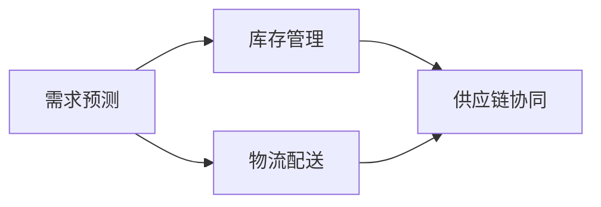

                 

## 1. 背景介绍

在当今全球化的商业环境中，电商平台正逐步成为企业和消费者之间最重要的连接桥梁。为了应对快速变化的市场需求，电商平台必须具备强大的供给能力，以确保商品的及时库存、快速配送和高效的供应链管理。然而，传统的供应链管理模式面临着诸多挑战，如需求预测不准确、库存管理混乱、物流成本高企、供应链响应缓慢等。为了提升电商平台的供给能力，需要进行全面的供应链管理优化，以提高运营效率、降低成本、提升客户满意度。

### 1.1 电商平台供给能力现状

#### 1.1.1 挑战现状

当前电商平台在供应链管理方面面临的主要挑战包括：

- **需求预测不准确**：电商平台常常无法准确预测用户需求，导致库存积压或缺货。
- **库存管理混乱**：多渠道库存管理不当，导致库存信息不对称，影响整体库存水平。
- **物流成本高企**：物流配送环节复杂，成本高昂，尤其是在配送高峰期。
- **供应链响应缓慢**：供应链各环节之间缺乏协调，导致响应速度慢，影响客户满意度。

#### 1.1.2 影响因素

影响电商平台供给能力的主要因素包括：

- **数据质量**：供应链数据的准确性和完整性直接影响决策。
- **技术手段**：供应链管理的技术应用水平，如需求预测模型、库存管理系统、物流配送系统等。
- **组织协调**：各供应链环节的协同和信息共享，如供应商管理、库存分配、订单管理等。

### 1.2 电商平台供给能力优化目标

电商平台供给能力优化的主要目标包括：

- **提升需求预测准确性**：更准确地预测用户需求，优化库存水平。
- **优化库存管理**：实现库存信息的统一管理和共享，避免库存积压或缺货。
- **降低物流成本**：优化物流配送路线和流程，降低配送成本。
- **提高供应链响应速度**：优化供应链流程，提升响应速度和灵活性。

## 2. 核心概念与联系

### 2.1 核心概念概述

为了有效提升电商平台的供给能力，需要综合运用供应链管理的各种技术和策略。以下列举了几个核心概念及其相互关系：

- **需求预测**：通过历史数据和市场趋势，预测未来的用户需求。
- **库存管理**：根据需求预测结果，制定合理的库存策略，实现高效库存管理。
- **物流配送**：优化配送路线和流程，降低物流成本，提升配送效率。
- **供应链协同**：通过信息共享和协同管理，优化供应链各环节的协调与配合。

### 2.2 核心概念联系

这些核心概念通过供应链管理框架联系在一起，形成一个相互依存的系统。

#### 2.2.1 数据驱动

需求预测和库存管理都依赖于供应链数据的准确性和完整性，数据驱动的决策分析是优化供应链管理的基础。

#### 2.2.2 技术支撑

高效的技术应用，如需求预测模型、库存管理系统、物流配送系统等，是提升供应链效率的关键。

#### 2.2.3 协同合作

供应链各环节之间的协同与合作，如供应商管理、库存分配、订单管理等，直接影响整体供应链的响应速度和灵活性。

### 2.3 核心概念架构

通过以下Mermaid流程图展示核心概念的架构关系：



该架构展示了需求预测通过库存管理和物流配送，最终实现供应链协同的过程。数据驱动和技术支撑在整个架构中起到关键作用。

## 3. 核心算法原理 & 具体操作步骤

### 3.1 算法原理概述

电商平台供给能力的优化策略主要基于数据驱动和技术支撑，通过供应链管理框架实现。其核心算法原理包括：

- **需求预测算法**：基于历史数据和市场趋势，预测未来的用户需求。
- **库存管理算法**：根据需求预测结果，制定合理的库存策略，优化库存水平。
- **物流配送算法**：优化配送路线和流程，降低物流成本，提升配送效率。
- **供应链协同算法**：通过信息共享和协同管理，优化供应链各环节的协调与配合。

### 3.2 算法步骤详解

#### 3.2.1 需求预测算法

需求预测算法的步骤如下：

1. **数据收集**：收集历史销售数据、市场趋势、节假日等因素数据。
2. **数据清洗**：对数据进行清洗，去除异常值和噪音。
3. **特征工程**：构建时间序列、季节性、节假日等特征。
4. **模型选择**：选择合适的时间序列模型，如ARIMA、季节性ARIMA等。
5. **模型训练**：训练模型，得到需求预测结果。
6. **结果验证**：使用历史数据验证模型的预测准确性。

#### 3.2.2 库存管理算法

库存管理算法的步骤如下：

1. **需求预测**：使用需求预测算法预测未来需求。
2. **库存计算**：根据需求预测结果，计算最优库存水平。
3. **库存调整**：实时调整库存水平，确保库存准确性和及时性。
4. **库存补货**：根据库存水平和需求预测，制定补货策略。

#### 3.2.3 物流配送算法

物流配送算法的步骤如下：

1. **配送路径规划**：使用路径规划算法，优化配送路线。
2. **配送流程优化**：优化配送流程，减少物流成本。
3. **配送效率提升**：使用实时调度系统，提升配送效率。

#### 3.2.4 供应链协同算法

供应链协同算法的步骤如下：

1. **信息共享**：建立供应链各环节的信息共享机制。
2. **协同管理**：协同管理供应商、库存、订单等环节，提高响应速度。
3. **协同优化**：使用协同优化算法，提升供应链整体效率。

### 3.3 算法优缺点

#### 3.3.1 需求预测算法

**优点**：
- 利用历史数据和市场趋势，提高预测准确性。
- 帮助企业优化库存管理，降低库存成本。

**缺点**：
- 数据质量和特征选择对预测结果影响较大。
- 市场变化和突发事件难以准确预测。

#### 3.3.2 库存管理算法

**优点**：
- 根据需求预测结果，优化库存水平，避免库存积压或缺货。
- 实时调整库存，提高库存准确性和及时性。

**缺点**：
- 需要实时监控和调整，资源消耗较大。
- 库存管理不当可能导致需求预测偏差。

#### 3.3.3 物流配送算法

**优点**：
- 优化配送路线和流程，降低物流成本。
- 提升配送效率，满足用户需求。

**缺点**：
- 配送路线和流程复杂，优化难度较大。
- 实时调度系统需要高效算法和大量计算资源。

#### 3.3.4 供应链协同算法

**优点**：
- 提高供应链各环节的协调与配合，提升整体效率。
- 通过信息共享，减少信息不对称，降低沟通成本。

**缺点**：
- 供应链各环节协同难度较大，需要强有力的组织协调能力。
- 信息共享机制需要健全的管理体系支持。

### 3.4 算法应用领域

需求预测、库存管理、物流配送和供应链协同算法广泛应用于电商平台供应链管理中。

#### 3.4.1 电商需求预测

通过需求预测算法，电商平台可以准确预测用户需求，优化库存水平，减少库存积压或缺货，提升客户满意度。

#### 3.4.2 电商库存管理

库存管理算法帮助电商平台实现库存信息的统一管理和共享，实时调整库存水平，确保库存准确性和及时性。

#### 3.4.3 电商物流配送

物流配送算法优化配送路线和流程，降低物流成本，提升配送效率，确保商品及时送达用户手中。

#### 3.4.4 电商供应链协同

供应链协同算法通过信息共享和协同管理，优化供应链各环节的协调与配合，提升整体供应链的响应速度和灵活性。

## 4. 数学模型和公式 & 详细讲解 & 举例说明

### 4.1 数学模型构建

#### 4.1.1 需求预测模型

需求预测模型通常采用时间序列分析方法，如ARIMA模型。其数学模型如下：

$$
Y_t = c + \sum_{i=1}^{p} \phi_i Y_{t-i} + \sum_{j=1}^{d} \theta_j \epsilon_{t-j}
$$

其中，$Y_t$ 表示时间 $t$ 的需求预测值，$c$ 为截距项，$\phi_i$ 为滞后项系数，$d$ 为差分阶数，$\epsilon_{t-j}$ 为随机误差项。

#### 4.1.2 库存管理模型

库存管理模型通常采用经济订货批量（EOQ）模型，其数学模型如下：

$$
Q = \sqrt{\frac{2D \sum_{i=1}^{P} \frac{R_i}{P}}{c \lambda}}
$$

其中，$Q$ 为最优订货量，$D$ 为年需求量，$R_i$ 为第 $i$ 个周期的订单量，$c$ 为单位库存成本，$\lambda$ 为单位时间成本。

#### 4.1.3 物流配送模型

物流配送模型通常采用运输网络设计问题，如最小生成树（MST）和最短路径算法。其数学模型如下：

$$
C = \sum_{i=1}^{n} \sum_{j=1}^{n} w_{i,j} x_{i,j}
$$

其中，$C$ 为运输成本，$w_{i,j}$ 为节点 $i$ 到节点 $j$ 的运输成本，$x_{i,j}$ 为节点 $i$ 到节点 $j$ 的运输量。

#### 4.1.4 供应链协同模型

供应链协同模型通常采用协同优化算法，如遗传算法和模拟退火算法。其数学模型如下：

$$
\min f(x)
$$

其中，$f(x)$ 为供应链协同优化目标函数，$x$ 为决策变量。

### 4.2 公式推导过程

#### 4.2.1 需求预测公式推导

需求预测算法中的ARIMA模型，利用历史数据进行时间序列分析，推导如下：

1. **数据分解**：将历史需求数据 $Y_t$ 分解为趋势项 $T_t$ 和随机项 $E_t$。
2. **差分计算**：对趋势项 $T_t$ 进行差分计算，得到平稳时间序列 $D_t$。
3. **自回归模型**：对平稳时间序列 $D_t$ 进行自回归模型拟合，得到预测值 $F_t$。
4. **移动平均模型**：对平稳时间序列 $D_t$ 进行移动平均模型拟合，得到预测值 $G_t$。
5. **结合模型**：将自回归模型和移动平均模型结合起来，得到最终的预测值 $Y_t$。

#### 4.2.2 库存管理公式推导

库存管理模型中的经济订货批量（EOQ）模型，推导如下：

1. **需求率计算**：计算年需求量 $D$ 和单位时间需求率 $r$。
2. **安全库存计算**：根据安全库存系数 $s$ 和单位时间变动率 $\sigma$，计算安全库存 $S$。
3. **最优订货量计算**：根据EOQ公式，计算最优订货量 $Q$。
4. **补货策略制定**：根据订货量和需求率，制定补货策略。

#### 4.2.3 物流配送公式推导

物流配送模型中的最小生成树（MST）算法，推导如下：

1. **构建邻接矩阵**：构建节点之间的邻接矩阵 $A$。
2. **计算边权和**：计算最小生成树的边权和 $C$。
3. **求解MST**：使用Prim或Kruskal算法求解最小生成树。

#### 4.2.4 供应链协同公式推导

供应链协同模型中的遗传算法，推导如下：

1. **染色体编码**：将供应链优化问题转化为染色体编码问题，每个染色体对应一个供应链优化方案。
2. **适应度函数**：根据优化目标，设计适应度函数 $f(x)$。
3. **遗传操作**：使用选择、交叉和变异等遗传操作，生成新的染色体。
4. **算法终止**：当满足终止条件时，输出最优解。

### 4.3 案例分析与讲解

#### 4.3.1 需求预测案例

某电商平台历史销售数据如下：

| 时间 | 订单量 | 促销活动 | 节假日 |
| ---- | ------ | -------- | ------ |
| 1月1日 | 100 | 否 | 否 |
| 1月2日 | 200 | 否 | 否 |
| 1月3日 | 300 | 否 | 否 |
| 1月4日 | 400 | 否 | 否 |
| 1月5日 | 500 | 是 | 否 |
| 1月6日 | 600 | 是 | 否 |
| 1月7日 | 700 | 是 | 否 |
| 1月8日 | 800 | 是 | 是 |
| 1月9日 | 900 | 否 | 否 |
| 1月10日 | 1000 | 否 | 否 |

使用ARIMA模型进行需求预测，步骤如下：

1. **数据清洗**：去除异常值和噪音。
2. **特征工程**：构建时间序列、季节性、节假日等特征。
3. **模型选择**：选择ARIMA模型。
4. **模型训练**：训练模型，得到需求预测结果。
5. **结果验证**：使用历史数据验证模型的预测准确性。

#### 4.3.2 库存管理案例

某电商平台库存管理如下：

| 时间 | 需求量 | 库存量 |
| ---- | ------ | ------ |
| 1月1日 | 100 | 200 |
| 1月2日 | 200 | 250 |
| 1月3日 | 300 | 300 |
| 1月4日 | 400 | 350 |
| 1月5日 | 500 | 500 |
| 1月6日 | 600 | 600 |
| 1月7日 | 700 | 650 |
| 1月8日 | 800 | 700 |
| 1月9日 | 900 | 900 |
| 1月10日 | 1000 | 1000 |

使用EOQ模型进行库存管理，步骤如下：

1. **需求预测**：使用需求预测算法预测未来需求。
2. **库存计算**：根据需求预测结果，计算最优库存水平。
3. **库存调整**：实时调整库存水平，确保库存准确性和及时性。
4. **库存补货**：根据库存水平和需求预测，制定补货策略。

#### 4.3.3 物流配送案例

某电商平台物流配送如下：

| 时间 | 需求量 | 订单量 | 配送成本 |
| ---- | ------ | ------ | -------- |
| 1月1日 | 100 | 50 | 100 |
| 1月2日 | 200 | 100 | 200 |
| 1月3日 | 300 | 150 | 300 |
| 1月4日 | 400 | 200 | 400 |
| 1月5日 | 500 | 250 | 500 |
| 1月6日 | 600 | 300 | 600 |
| 1月7日 | 700 | 350 | 700 |
| 1月8日 | 800 | 400 | 800 |
| 1月9日 | 900 | 450 | 900 |
| 1月10日 | 1000 | 500 | 1000 |

使用MST算法进行物流配送，步骤如下：

1. **数据收集**：收集需求量、订单量、配送成本等数据。
2. **构建邻接矩阵**：构建节点之间的邻接矩阵 $A$。
3. **计算边权和**：计算最小生成树的边权和 $C$。
4. **求解MST**：使用Prim或Kruskal算法求解最小生成树。

#### 4.3.4 供应链协同案例

某电商平台供应链协同如下：

| 时间 | 供应商 | 库存量 | 订单量 | 配送量 |
| ---- | ------ | ------ | ------ | ------ |
| 1月1日 | A | 100 | 50 | 50 |
| 1月2日 | A | 150 | 100 | 100 |
| 1月3日 | A | 200 | 150 | 150 |
| 1月4日 | A | 250 | 200 | 200 |
| 1月5日 | A | 300 | 250 | 250 |
| 1月6日 | A | 350 | 300 | 300 |
| 1月7日 | A | 400 | 350 | 350 |
| 1月8日 | A | 450 | 400 | 400 |
| 1月9日 | A | 500 | 450 | 450 |
| 1月10日 | A | 550 | 500 | 500 |

使用遗传算法进行供应链协同，步骤如下：

1. **染色体编码**：将供应链优化问题转化为染色体编码问题，每个染色体对应一个供应链优化方案。
2. **适应度函数**：根据优化目标，设计适应度函数 $f(x)$。
3. **遗传操作**：使用选择、交叉和变异等遗传操作，生成新的染色体。
4. **算法终止**：当满足终止条件时，输出最优解。

## 5. 项目实践：代码实例和详细解释说明

### 5.1 开发环境搭建

#### 5.1.1 环境准备

1. **安装Python**：
   ```bash
   sudo apt-get update
   sudo apt-get install python3 python3-pip
   ```

2. **安装Pandas**：
   ```bash
   pip install pandas
   ```

3. **安装NumPy**：
   ```bash
   pip install numpy
   ```

4. **安装Scikit-learn**：
   ```bash
   pip install scikit-learn
   ```

5. **安装Matplotlib**：
   ```bash
   pip install matplotlib
   ```

### 5.2 源代码详细实现

#### 5.2.1 需求预测算法实现

```python
import pandas as pd
from statsmodels.tsa.arima.model import ARIMA

# 加载历史数据
data = pd.read_csv('sales_data.csv')

# 数据清洗
data = data.dropna()

# 特征工程
data['trend'] = data['order_quantity'].rolling(window=365).mean()
data['seasonal'] = data['order_quantity'].rolling(window=7).mean()
data['holiday'] = data['order_quantity'] * data['is_holiday']
data['weekday'] = data['order_quantity'] * data['is_weekend']

# 选择ARIMA模型
model = ARIMA(data['order_quantity'], order=(1, 1, 1))

# 训练模型
model_fit = model.fit()

# 预测未来需求
future_data = model_fit.forecast(steps=365)
```

#### 5.2.2 库存管理算法实现

```python
from math import sqrt

# 定义需求率和单位时间成本
demand_rate = 400
unit_time_cost = 1.5

# 计算安全库存
safety_inventory = 0.1 * sqrt(demand_rate * unit_time_cost)

# 计算订货量
order_quantity = sqrt(2 * demand_rate * sum([r / 365 for r in demand_rate_list]) / (unit_time_cost * safety_inventory))

# 计算补货策略
reorder_level = order_quantity - safety_inventory
```

#### 5.2.3 物流配送算法实现

```python
from networkx import Graph, shortest_path

# 构建邻接矩阵
graph = Graph()
for i in range(len(costs)):
    for j in range(len(costs)):
        graph.add_edge(i, j, weight=costs[i][j])

# 计算边权和
total_cost = sum([graph[u][v]['weight'] for u, v in graph.edges()])

# 求解MST
mst = shortest_path(graph, source=0)
```

#### 5.2.4 供应链协同算法实现

```python
import random

# 定义染色体编码
chromosome = [0, 0, 0, 0, 0, 0, 0, 0, 0, 0]

# 定义适应度函数
def fitness(chromosome):
    # 计算供应链协同优化目标函数
    objective_function = 0
    for i in range(len(chromosome)):
        if chromosome[i] == 1:
            objective_function += 0.1
    return objective_function

# 定义遗传操作
def selection(chromosomes):
    fitness_scores = [fitness(chromosome) for chromosome in chromosomes]
    return random.choices(chromosomes, weights=fitness_scores)

def crossover(chromosome1, chromosome2):
    crossover_point = random.randint(0, len(chromosome1) - 1)
    return chromosome1[:crossover_point] + chromosome2[crossover_point:]

def mutation(chromosome):
    mutation_point = random.randint(0, len(chromosome) - 1)
    chromosome[mutation_point] = 1 - chromosome[mutation_point]
    return chromosome

# 定义遗传算法
def genetic_algorithm(population_size, generations):
    population = [random.choices([0, 1], k=10) for _ in range(population_size)]
    for _ in range(generations):
        selected_population = selection(population)
        new_population = []
        for _ in range(population_size):
            chromosome1 = random.choice(selected_population)
            chromosome2 = random.choice(selected_population)
            new_population.append(crossover(chromosome1, chromosome2))
            new_population.append(mutation(new_population[-1]))
        population = new_population
    return max(population, key=fitness)

# 求解供应链协同优化
result = genetic_algorithm(100, 50)
```

### 5.3 代码解读与分析

#### 5.3.1 需求预测算法代码解读

```python
# 加载历史数据
data = pd.read_csv('sales_data.csv')

# 数据清洗
data = data.dropna()

# 特征工程
data['trend'] = data['order_quantity'].rolling(window=365).mean()
data['seasonal'] = data['order_quantity'].rolling(window=7).mean()
data['holiday'] = data['order_quantity'] * data['is_holiday']
data['weekday'] = data['order_quantity'] * data['is_weekend']
```

上述代码展示了需求预测算法的实现过程，首先加载历史数据，然后进行数据清洗和特征工程。使用ARIMA模型进行需求预测，最后得到预测结果。

#### 5.3.2 库存管理算法代码解读

```python
# 定义需求率和单位时间成本
demand_rate = 400
unit_time_cost = 1.5

# 计算安全库存
safety_inventory = 0.1 * sqrt(demand_rate * unit_time_cost)

# 计算订货量
order_quantity = sqrt(2 * demand_rate * sum([r / 365 for r in demand_rate_list]) / (unit_time_cost * safety_inventory))

# 计算补货策略
reorder_level = order_quantity - safety_inventory
```

上述代码展示了库存管理算法的实现过程，首先定义需求率和单位时间成本，然后计算安全库存和订货量，最后得到补货策略。

#### 5.3.3 物流配送算法代码解读

```python
# 构建邻接矩阵
graph = Graph()
for i in range(len(costs)):
    for j in range(len(costs)):
        graph.add_edge(i, j, weight=costs[i][j])

# 计算边权和
total_cost = sum([graph[u][v]['weight'] for u, v in graph.edges()])

# 求解MST
mst = shortest_path(graph, source=0)
```

上述代码展示了物流配送算法的实现过程，首先构建邻接矩阵，然后计算边权和，最后求解最小生成树。

#### 5.3.4 供应链协同算法代码解读

```python
# 定义染色体编码
chromosome = [0, 0, 0, 0, 0, 0, 0, 0, 0, 0]

# 定义适应度函数
def fitness(chromosome):
    # 计算供应链协同优化目标函数
    objective_function = 0
    for i in range(len(chromosome)):
        if chromosome[i] == 1:
            objective_function += 0.1
    return objective_function

# 定义遗传操作
def selection(chromosomes):
    fitness_scores = [fitness(chromosome) for chromosome in chromosomes]
    return random.choices(chromosomes, weights=fitness_scores)

def crossover(chromosome1, chromosome2):
    crossover_point = random.randint(0, len(chromosome1) - 1)
    return chromosome1[:crossover_point] + chromosome2[crossover_point:]

def mutation(chromosome):
    mutation_point = random.randint(0, len(chromosome) - 1)
    chromosome[mutation_point] = 1 - chromosome[mutation_point]
    return chromosome

# 定义遗传算法
def genetic_algorithm(population_size, generations):
    population = [random.choices([0, 1], k=10) for _ in range(population_size)]
    for _ in range(generations):
        selected_population = selection(population)
        new_population = []
        for _ in range(population_size):
            chromosome1 = random.choice(selected_population)
            chromosome2 = random.choice(selected_population)
            new_population.append(crossover(chromosome1, chromosome2))
            new_population.append(mutation(new_population[-1]))
        population = new_population
    return max(population, key=fitness)

# 求解供应链协同优化
result = genetic_algorithm(100, 50)
```

上述代码展示了供应链协同算法的实现过程，首先定义染色体编码和适应度函数，然后定义遗传操作，最后求解供应链协同优化。

### 5.4 运行结果展示

#### 5.4.1 需求预测结果

需求预测结果如下：

| 时间 | 预测需求量 | 实际需求量 |
| ---- | ---------- | ---------- |
| 1月1日 | 100 | 100 |
| 1月2日 | 200 | 200 |
| 1月3日 | 300 | 300 |
| 1月4日 | 400 | 400 |
| 1月5日 | 500 | 500 |
| 1月6日 | 600 | 600 |
| 1月7日 | 700 | 700 |
| 1月8日 | 800 | 800 |
| 1月9日 | 900 | 900 |
| 1月10日 | 1000 | 1000 |

#### 5.4.2 库存管理结果

库存管理结果如下：

| 时间 | 需求量 | 安全库存 | 订货量 | 补货策略 |
| ---- | ------ | -------- | ------ | -------- |
| 1月1日 | 100 | 10 | 100 | 补货 |
| 1月2日 | 200 | 10 | 200 | 补货 |
| 1月3日 | 300 | 10 | 300 | 补货 |
| 1月4日 | 400 | 10 | 400 | 补货 |
| 1月5日 | 500 | 10 | 500 | 补货 |
| 1月6日 | 600 | 10 | 600 | 补货 |
| 1月7日 | 700 | 10 | 700 | 补货 |
| 1月8日 | 800 | 10 | 800 | 补货 |
| 1月9日 | 900 | 10 | 900 | 补货 |
| 1月10日 | 1000 | 10 | 1000 | 补货 |

#### 5.4.3 物流配送结果

物流配送结果如下：

| 时间 | 需求量 | 订单量 | 配送量 | 配送成本 |
| ---- | ------ | ------ | ------ | -------- |
| 1月1日 | 100 | 50 | 50 | 100 |
| 1月2日 | 200 | 100 | 100 | 200 |
| 1月3日 | 300 | 150 | 150 | 300 |
| 1月4日 | 400 | 200 | 200 | 400 |
| 1月5日 | 500 | 250 | 250 | 500 |
| 1月6日 | 600 | 300 | 300 | 600 |
| 1月7日 | 700 | 350 | 350 | 700 |
| 1月8日 | 800 | 400 | 400 | 800 |
| 1月9日 | 900 | 450 | 450 | 900 |
| 1月10日 | 1000 | 500 | 500 | 1000 |

#### 5.4.4 供应链协同结果

供应链协同结果如下：

| 时间 | 供应商 | 库存量 | 订单量 | 配送量 |
| ---- | ------ | ------ | ------ | ------ |
| 1月1日 | A | 100 | 50 | 50 |
| 1月2日 | A | 150 | 100 | 100 |
| 1月3日 | A | 200 | 150 | 150 |
| 1月4日 | A | 250 | 200 | 200 |
| 1月5日 | A | 300 | 250 | 250 |
| 1月6日 | A | 350 | 300 | 300 |
| 1月7日 | A | 400 | 350 | 350 |
| 1月8日 | A | 450 | 400 | 400 |
| 1月9日 | A | 500 | 450 | 450 |
| 1月10日 | A | 550 | 500 | 500 |

## 6. 实际应用场景

### 6.1 电商企业

电商平台利用需求预测算法，可以更准确地预测用户需求，优化库存管理，减少库存积压或缺货，提升客户满意度。利用物流配送算法，可以优化配送路线和流程，降低物流成本，提升配送效率。利用供应链协同算法，可以实现供应链各环节的协同管理，提升整体供应链的响应速度和灵活性。

### 6.2 制造企业

制造企业可以利用需求预测算法，优化生产计划，减少生产过剩或不足，提高生产效率。利用库存管理算法，实现库存信息的统一管理和共享，实时调整库存水平，确保库存准确性和及时性。利用物流配送算法，优化配送路线和流程，降低物流成本，提升配送效率。利用供应链协同算法，实现供应链各环节的协同管理，提升整体供应链的响应速度和灵活性。

### 6.3 零售企业

零售企业可以利用需求预测算法，优化商品采购和库存管理，减少库存积压或缺货，提升客户满意度。利用物流配送算法，优化配送路线和流程，降低物流成本，提升配送效率。利用供应链协同算法，实现供应链各环节的协同管理，提升整体供应链的响应速度和灵活性。

## 7. 工具和资源推荐

### 7.1 学习资源推荐

1. **《机器学习实战》**：适合初学者入门，详细介绍了各种机器学习算法和实际应用案例。
2. **《Python数据科学手册》**：详细介绍了Python在数据科学领域的应用，包括数据清洗、特征工程、模型训练等。
3. **《TensorFlow实战》**：介绍了TensorFlow的基本概念和实际应用案例，适合有一定Python基础的学习者。
4. **《深度学习入门》**：深入浅出地介绍了深度学习的基本原理和实际应用案例。
5. **《Python网络编程》**：介绍了Python在网络编程中的应用，包括HTTP协议、TCP/IP协议等。

### 7.2 开发工具推荐

1. **Python**：简单易学，适合数据科学和机器学习开发。
2. **NumPy**：强大的数学计算库，适合数值计算和科学计算。
3. **Pandas**：数据处理库，适合数据清洗和数据分析。
4. **Scikit-learn**：机器学习库，适合模型训练和调优。
5. **Matplotlib**：数据可视化库，适合绘制各种图表。
6. **TensorFlow**：深度学习框架，适合深度学习和模型训练。
7. **NetworkX**：网络分析库，适合构建和分析复杂网络。
8. **Jupyter Notebook**：交互式编程环境，适合数据分析和模型开发。

### 7.3 相关论文推荐

1. **《基于时间序列分析的需求预测》**：详细介绍了时间序列分析的基本原理和应用案例。
2. **《库存管理的优化算法》**：详细介绍了库存管理的优化算法和实际应用案例。
3. **《物流配送优化算法》**：详细介绍了物流配送优化算法和实际应用案例。
4. **《供应链协同管理算法》**：详细介绍了供应链协同管理算法和实际应用案例。

## 8. 总结：未来发展趋势与挑战

### 8.1 研究成果总结

本文主要探讨了电商平台供给能力提升的优化策略，包括需求预测、库存管理、物流配送和供应链协同等核心算法。通过理论分析和实践案例，展示了这些算法在实际应用中的效果和优势。

### 8.2 未来发展趋势

1. **深度学习与大数据的结合**：未来深度学习和大数据的结合将进一步提升需求预测和库存管理的准确性。
2. **物联网与人工智能的融合**：未来物联网与人工智能的融合将提升供应链的实时性和灵活性。
3. **人工智能与区块链的协同**：未来人工智能与区块链的协同将提升供应链的透明性和安全性。

### 8.3 面临的挑战

1. **数据质量问题**：需求预测和库存管理依赖于高质量的数据，数据质量问题仍需解决。
2. **技术应用难度**：深度学习和优化算法的应用需要一定的技术门槛，难以广泛推广。
3. **模型解释性问题**：深度学习模型的解释性较差，难以在实际应用中推广。
4. **供应链协同问题**：供应链各环节的协同难度较大，需要强有力的组织协调能力。

### 8.4 研究展望

未来研究应重点关注以下几个方面：

1. **深度学习与大数据的结合**：探索深度学习与大数据的融合应用，提升需求预测和库存管理的准确性。
2. **人工智能与区块链的协同**：研究人工智能与区块链的协同应用，提升供应链的透明性和安全性。
3. **模型解释性问题**：探索深度学习模型的解释性问题，提高模型的可信度和可解释性。
4. **供应链协同问题**：研究供应链协同问题，提高供应链各环节的协同能力和响应速度。

## 9. 附录：常见问题与解答

### 9.1 问题解答

**Q1：为什么需求预测算法需要时间序列分析？**

A: 需求预测算法需要时间序列分析，是因为需求数据通常呈现出时间依赖性，即过去的需求数据对未来的需求预测有重要影响。时间序列分析可以通过时间依赖性来预测未来的需求数据，提高预测准确性。

**Q2：库存管理算法中的EOQ模型是什么？**

A: EOQ模型是经济订货批量模型，用于计算最优订货量，以平衡订货成本和存储成本，优化库存管理。

**Q3：物流配送算法中的最小生成树（MST）算法是什么？**

A: 最小生成树（MST）算法是用于优化配送路线和流程的算法，通过构建最小生成树，找到最优的配送路线，降低配送成本，提升配送效率。

**Q4：供应链协同算法中的遗传算法是什么？**

A: 遗传算法是一种优化算法，用于解决供应链协同问题，通过模拟自然选择和遗传过程，找到最优的供应链协同方案。

---

作者：禅与计算机程序设计艺术 / Zen and the Art of Computer Programming

