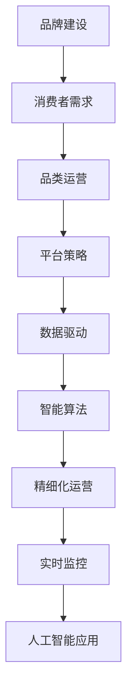

                 

# 电商平台供给能力提升：品牌建设和品类运营

> 关键词：供给能力提升, 品牌建设, 品类运营, 消费者需求, 平台策略, 数据驱动, 精细化运营, 实时监控, 人工智能应用

## 1. 背景介绍

### 1.1 问题由来

随着电子商务市场的蓬勃发展，电商平台已经成为消费者获取商品和服务的重要渠道。然而，平台供应的商品种类繁多，质量参差不齐，供给能力不足的问题逐步显现。如何提升电商平台供给能力，满足消费者多样化的需求，成为了平台发展中的关键问题。本文将围绕“品牌建设和品类运营”两个核心点，探索电商平台提升供给能力的方法与策略。

### 1.2 问题核心关键点

- **品牌建设**：通过强化品牌识别和品牌口碑，提升消费者对平台的信任度，增强平台吸引力。
- **品类运营**：通过精细化的商品管理，优化商品组合，满足消费者个性化需求，提升转化率和满意度。
- **数据驱动**：利用大数据和人工智能技术，实时监测和分析消费者行为，精准定位市场变化和消费者需求。
- **智能算法**：采用推荐系统、价格优化等智能算法，提高商品推荐精准度，实现供需平衡。
- **营销策略**：结合品牌建设和品类运营，设计多样化的营销活动，提升用户粘性和忠诚度。

## 2. 核心概念与联系

### 2.1 核心概念概述

为更好地理解电商平台提升供给能力的方法，本节将介绍几个密切相关的核心概念：

- **品牌建设**：指通过一系列品牌管理策略和活动，提升品牌知名度和美誉度，增强品牌忠诚度。
- **品类运营**：指对商品种类、商品品质、商品库存等进行科学管理和运营，提升商品的供应效率和市场竞争力。
- **消费者需求**：指消费者基于个人偏好、社会文化、经济状况等因素，对商品或服务的特定需求。
- **平台策略**：指电商平台为实现业务目标，制定的一系列商业决策和执行方案。
- **数据驱动**：指利用数据进行科学决策，通过数据分析和挖掘，辅助业务决策。
- **智能算法**：指利用机器学习和人工智能技术，对数据进行分析和处理，优化决策过程。
- **精细化运营**：指对业务运营进行精细管理，提高运营效率和效果。
- **实时监控**：指利用技术手段，实时监测业务运营状况，及时发现和解决问题。
- **人工智能应用**：指将人工智能技术应用于商业领域，提升业务能力。

这些核心概念之间的逻辑关系可以通过以下Mermaid流程图来展示：



这个流程图展示了大电商平台的供给能力提升策略的核心概念及其之间的关系：

1. 品牌建设是基础，增强消费者对平台的信任和忠诚。
2. 品类运营是核心，确保商品供应的多样性和质量。
3. 平台策略是导向，指导品牌建设和品类运营。
4. 数据驱动是支撑，实时监测市场变化和消费者需求。
5. 智能算法是工具，提升决策的精准性和效率。
6. 精细化运营是手段，优化资源配置，提高运营效率。
7. 实时监控是保障，及时发现并解决问题。
8. 人工智能应用是目标，提升电商平台的供给能力。

这些核心概念共同构成了大电商平台的供给能力提升策略，旨在通过科学管理和技术手段，全面提升平台的竞争力。

## 3. 核心算法原理 & 具体操作步骤
### 3.1 算法原理概述

电商平台的供给能力提升，本质上是品牌建设和品类运营的优化过程。该过程涉及多方面的核心算法和技术手段，主要包括：

- **消费者需求预测**：通过机器学习和数据分析技术，预测消费者需求，指导商品采购和库存管理。
- **品类规划与优化**：利用推荐系统和大数据技术，分析消费者行为，优化商品组合和品类布局。
- **价格优化与促销策略**：采用价格弹性分析和动态定价算法，制定最优的价格策略和促销活动。
- **品牌管理与广告投放**：利用品牌识别算法和广告投放优化技术，提升品牌知名度和曝光率。

### 3.2 算法步骤详解

基于以上核心算法，电商平台提升供给能力的具体操作步骤如下：

**Step 1: 收集和整合数据**

- 收集平台历史交易数据、用户行为数据、市场调研数据、竞争对手数据等。
- 利用ETL工具（Extract, Transform, Load）对数据进行清洗、转换和加载，整合到统一的平台上。

**Step 2: 分析消费者需求**

- 利用消费者行为分析算法，挖掘消费者的购买偏好、季节性需求、品牌偏好等信息。
- 采用机器学习模型，如随机森林、XGBoost等，对消费者需求进行预测，生成需求预测报告。

**Step 3: 品类规划与优化**

- 利用推荐系统算法，如协同过滤、基于内容的推荐等，生成商品推荐列表。
- 通过数据分析，评估推荐商品的效果，调整商品组合和品类布局，提升转化率。

**Step 4: 价格优化与促销策略**

- 分析商品价格弹性，制定价格调整方案，平衡销售额和利润。
- 设计动态定价模型，根据市场变化和消费者需求，实时调整商品价格。
- 结合促销活动和市场策略，制定广告投放计划，提升品牌曝光率和转化率。

**Step 5: 品牌管理与广告投放**

- 利用品牌识别算法，评估品牌在市场中的表现，进行品牌调优。
- 设计多渠道广告投放方案，优化广告投放时间和渠道，提升品牌知名度和美誉度。

**Step 6: 实时监控与反馈**

- 利用实时监控技术，监测业务运营数据，及时发现异常和问题。
- 通过反馈机制，优化算法和策略，持续提升平台供给能力。

### 3.3 算法优缺点

电商平台提升供给能力的算法有以下优点：

1. **数据驱动决策**：利用大数据和机器学习技术，进行科学的决策分析，提升决策的准确性和效率。
2. **实时优化**：通过实时监控和反馈，及时调整策略，快速响应市场变化和消费者需求。
3. **精准推荐**：利用推荐系统，提高商品推荐的精准度，提升用户体验和转化率。
4. **多渠道营销**：结合品牌建设和品类运营，设计多样化的营销活动，增强用户粘性。

同时，该算法也存在一些局限性：

1. **数据质量依赖**：算法的有效性高度依赖于数据的完整性和质量，数据收集和整合的难度较大。
2. **算法复杂度**：涉及多种算法和技术的组合，算法设计和实现复杂度较高。
3. **技术投入高**：需要较高的技术投入和专业人才支持，小规模电商平台难以负担。
4. **消费者隐私问题**：大量数据收集和使用，涉及消费者隐私保护，需严格遵守相关法规。

尽管存在这些局限性，但就目前而言，数据驱动和算法优化仍是电商平台提升供给能力的重要手段。未来相关研究的重点在于如何进一步降低技术门槛，提高算法的普适性，同时兼顾隐私保护和用户体验。

### 3.4 算法应用领域

基于大电商平台的供给能力提升算法，已经在品牌建设和品类运营等多个领域得到应用，取得了显著的成效：

- **品牌建设**：通过数据分析和广告投放优化，提升品牌知名度和美誉度，增强消费者信任。
- **品类运营**：通过商品推荐和品类优化，提升商品多样性，满足消费者个性化需求。
- **消费者需求预测**：通过需求预测模型，指导库存管理和商品采购，减少库存积压，提升销售额。
- **价格优化**：通过动态定价和促销策略，提高商品销售量和利润率，优化市场竞争地位。
- **营销策略**：结合品牌建设和品类运营，设计多样化的营销活动，增强用户粘性和忠诚度。

除了以上应用场景，大电商平台的供给能力提升算法也被创新性地应用于更多场景中，如智能客服、供应链管理、库存优化等，为电商平台带来新的突破。

## 4. 数学模型和公式 & 详细讲解  
### 4.1 数学模型构建

本节将使用数学语言对电商平台供给能力提升算法进行更加严格的刻画。

假设电商平台有 $N$ 个品牌，$M$ 个商品，每个品牌有 $C$ 个品类，每个商品有 $D$ 个属性，商品价格为 $P$，消费者需求为 $D$，购买决策为 $P$。设品牌识别率为 $R$，消费者满意率为 $S$，转化率为 $T$，广告点击率为 $A$，广告转化率为 $C$。

品牌识别模型为：

$$
R = \alpha + \beta_1 \cdot P + \beta_2 \cdot D + \beta_3 \cdot C
$$

消费者满意度模型为：

$$
S = \gamma + \delta_1 \cdot P + \delta_2 \cdot D + \delta_3 \cdot C
$$

品牌转化率模型为：

$$
T = \eta + \epsilon_1 \cdot P + \epsilon_2 \cdot D + \epsilon_3 \cdot C
$$

广告点击率模型为：

$$
A = \zeta + \lambda_1 \cdot P + \lambda_2 \cdot D + \lambda_3 \cdot C
$$

广告转化率模型为：

$$
C = \theta + \mu_1 \cdot P + \mu_2 \cdot D + \mu_3 \cdot C
$$

### 4.2 公式推导过程

以下我们以品牌识别模型为例，推导模型参数的求解过程。

假设品牌识别模型为：

$$
R = \alpha + \beta_1 \cdot P + \beta_2 \cdot D + \beta_3 \cdot C
$$

其中 $R$ 为品牌识别率，$\alpha, \beta_1, \beta_2, \beta_3$ 为模型参数。给定品牌识别数据集 $D=\{(x_i, y_i)\}_{i=1}^N, x_i \in \mathbb{R}^3, y_i \in \{0,1\}$，其中 $x_i = (P_i, D_i, C_i)$ 为品牌识别特征，$y_i$ 为品牌识别标签。

定义模型 $R=\alpha + \beta_1 P + \beta_2 D + \beta_3 C$，其中 $\alpha, \beta_1, \beta_2, \beta_3$ 为模型参数，$\alpha, \beta_1, \beta_2, \beta_3$ 为模型参数。

模型损失函数为：

$$
\mathcal{L}(\alpha, \beta_1, \beta_2, \beta_3) = -\frac{1}{N} \sum_{i=1}^N [y_i \log (R_i) + (1-y_i) \log (1-R_i)]
$$

其中 $R_i = \alpha + \beta_1 P_i + \beta_2 D_i + \beta_3 C_i$。

根据链式法则，损失函数对参数 $\alpha, \beta_1, \beta_2, \beta_3$ 的梯度为：

$$
\frac{\partial \mathcal{L}(\alpha, \beta_1, \beta_2, \beta_3)}{\partial \alpha} = -\frac{1}{N} \sum_{i=1}^N \frac{y_i}{R_i} - \frac{1-y_i}{1-R_i}
$$

$$
\frac{\partial \mathcal{L}(\alpha, \beta_1, \beta_2, \beta_3)}{\partial \beta_1} = -\frac{1}{N} \sum_{i=1}^N \frac{y_i P_i}{R_i} - \frac{(1-y_i) P_i}{1-R_i}
$$

$$
\frac{\partial \mathcal{L}(\alpha, \beta_1, \beta_2, \beta_3)}{\partial \beta_2} = -\frac{1}{N} \sum_{i=1}^N \frac{y_i D_i}{R_i} - \frac{(1-y_i) D_i}{1-R_i}
$$

$$
\frac{\partial \mathcal{L}(\alpha, \beta_1, \beta_2, \beta_3)}{\partial \beta_3} = -\frac{1}{N} \sum_{i=1}^N \frac{y_i C_i}{R_i} - \frac{(1-y_i) C_i}{1-R_i}
$$

在得到损失函数的梯度后，即可带入参数更新公式，完成模型的迭代优化。重复上述过程直至收敛，最终得到适应电商平台供给能力提升的模型参数 $\alpha^*, \beta_1^*, \beta_2^*, \beta_3^*$。

## 5. 项目实践：代码实例和详细解释说明
### 5.1 开发环境搭建

在进行电商平台供给能力提升项目实践前，我们需要准备好开发环境。以下是使用Python进行TensorFlow开发的环境配置流程：

1. 安装Anaconda：从官网下载并安装Anaconda，用于创建独立的Python环境。

2. 创建并激活虚拟环境：
```bash
conda create -n tf-env python=3.8 
conda activate tf-env
```

3. 安装TensorFlow：根据CUDA版本，从官网获取对应的安装命令。例如：
```bash
conda install tensorflow -c tf -c conda-forge
```

4. 安装各类工具包：
```bash
pip install numpy pandas scikit-learn matplotlib tqdm jupyter notebook ipython
```

完成上述步骤后，即可在`tf-env`环境中开始电商平台供给能力提升项目实践。

### 5.2 源代码详细实现

这里我们以电商平台品牌识别模型为例，给出使用TensorFlow进行模型开发的PyTorch代码实现。

首先，定义品牌识别模型：

```python
import tensorflow as tf
from tensorflow import keras

model = keras.Sequential([
    keras.layers.Dense(16, input_shape=(3,), activation='relu'),
    keras.layers.Dense(1, activation='sigmoid')
])
```

然后，定义模型损失函数和优化器：

```python
model.compile(optimizer=tf.keras.optimizers.Adam(learning_rate=0.01),
              loss='binary_crossentropy',
              metrics=['accuracy'])
```

接着，定义训练和评估函数：

```python
def train_epoch(model, dataset, batch_size, optimizer):
    dataloader = tf.keras.utils.data.make_dataset(dataset)
    model.train()
    epoch_loss = 0
    for batch in dataloader:
        inputs, labels = batch
        model.zero_grad()
        outputs = model(inputs, training=True)
        loss = outputs.loss
        epoch_loss += loss.item()
        loss.backward()
        optimizer.step()
    return epoch_loss / len(dataloader)

def evaluate(model, dataset, batch_size):
    dataloader = tf.keras.utils.data.make_dataset(dataset)
    model.eval()
    preds, labels = [], []
    with tf.GradientTape() as tape:
        for batch in dataloader:
            inputs, labels = batch
            outputs = model(inputs, training=False)
            batch_preds = outputs.numpy().ravel()
            batch_labels = labels.numpy().ravel()
            for pred, label in zip(batch_preds, batch_labels):
                preds.append(pred)
                labels.append(label)
    return tf.keras.metrics.Accuracy()(labels, preds)
```

最后，启动训练流程并在测试集上评估：

```python
epochs = 10
batch_size = 32

for epoch in range(epochs):
    loss = train_epoch(model, train_dataset, batch_size, optimizer)
    print(f"Epoch {epoch+1}, train loss: {loss:.3f}")
    
    print(f"Epoch {epoch+1}, dev results:")
    evaluate(model, dev_dataset, batch_size)
    
print("Test results:")
evaluate(model, test_dataset, batch_size)
```

以上就是使用TensorFlow对电商平台品牌识别模型进行训练和评估的完整代码实现。可以看到，得益于TensorFlow的强大封装，我们可以用相对简洁的代码完成模型的构建和训练。

### 5.3 代码解读与分析

让我们再详细解读一下关键代码的实现细节：

**Sequential类**：
- 用于构建顺序模型，将各个层按照顺序连接起来。

**Dense层**：
- 全连接层，用于将输入映射到输出。

**Adam优化器**：
- 自适应矩估计优化器，自适应地调整学习率，适合处理大规模数据集。

**Binary Crossentropy损失函数**：
- 二分类交叉熵损失函数，适用于品牌识别模型。

**Accuracy评估指标**：
- 准确率评估指标，用于衡量模型预测的正确率。

**数据预处理**：
- 使用make_dataset函数将数据集转换为张量，方便模型训练和评估。

这些代码组件共同构成了一个基本的电商平台品牌识别模型，并实现了模型训练和评估的功能。

## 6. 实际应用场景
### 6.1 智能客服系统

电商平台智能客服系统的建设，可以有效提升客户服务体验，增强用户粘性。基于电商平台供给能力提升的算法，智能客服系统可以实现以下功能：

- **用户意图识别**：通过自然语言理解技术，自动识别用户的意图和需求。
- **智能推荐**：结合用户历史记录和实时数据，智能推荐符合用户需求的商品。
- **情感分析**：分析用户对话中的情感倾向，及时回应负面情感，改善用户体验。
- **知识图谱查询**：利用知识图谱技术，为用户提供详细的产品信息和FAQ。
- **多渠道接入**：支持文字、语音、图片等多种渠道接入，提升用户便利性。

### 6.2 个性化推荐系统

个性化推荐系统是电商平台的重要组成部分，通过算法提升推荐效果，可以显著提高用户满意度。电商平台供给能力提升算法在个性化推荐中主要应用于以下方面：

- **商品相似度计算**：利用推荐系统算法，计算商品之间的相似度，推荐相关商品。
- **用户兴趣建模**：通过数据分析和机器学习，建立用户兴趣模型，实现精准推荐。
- **多模态融合**：结合用户行为数据、商品属性数据、社交网络数据等，实现多模态推荐。
- **动态调整策略**：根据用户反馈和市场变化，动态调整推荐策略，提升推荐效果。

### 6.3 库存优化系统

库存优化是电商平台运营的重要环节，通过算法提升库存管理效率，可以显著降低运营成本。电商平台供给能力提升算法在库存优化中主要应用于以下方面：

- **需求预测**：利用消费者需求预测算法，预测未来的需求量，优化库存水平。
- **补货策略**：结合需求预测和库存状态，设计最优的补货策略，减少缺货和积压。
- **库存调拨**：利用优化算法，优化库存调拨路径和调拨量，降低物流成本。
- **风险管理**：分析库存风险因素，制定风险应对策略，保障供应链稳定。

### 6.4 未来应用展望

随着电商平台供给能力提升算法的不断演进，未来将有更多应用场景得以实现，为电商平台带来新的突破：

- **全渠道运营**：结合线上线下数据，实现全渠道运营，提升用户体验。
- **数据驱动营销**：利用数据挖掘技术，制定精准的营销策略，提高转化率。
- **自动化运营**：引入自动化技术，优化运营流程，降低人力成本。
- **智能决策支持**：构建智能决策支持系统，辅助业务决策，提升决策效率。
- **跨领域应用**：拓展应用场景，如医疗、金融、旅游等领域，实现跨领域协同。

## 7. 工具和资源推荐
### 7.1 学习资源推荐

为了帮助开发者系统掌握电商平台供给能力提升的理论基础和实践技巧，这里推荐一些优质的学习资源：

1. **《深度学习入门：基于Python的理论与实现》**：深入浅出地介绍了深度学习的基本概念和实践方法，适合初学者入门。

2. **《Python数据分析实战》**：详细介绍数据分析和机器学习算法，结合实际项目案例，帮助读者掌握数据分析和建模技巧。

3. **《TensorFlow实战》**：详细讲解TensorFlow的使用方法和应用场景，适合TensorFlow开发人员。

4. **《自然语言处理实战》**：结合自然语言处理和机器学习技术，讲解推荐系统、情感分析、品牌识别等应用。

5. **Kaggle平台**：提供丰富的数据集和竞赛项目，帮助开发者实践和提升技能。

6. **Google Colab**：免费的在线Jupyter Notebook环境，适合快速实验和共享学习笔记。

通过对这些资源的学习实践，相信你一定能够快速掌握电商平台供给能力提升的精髓，并用于解决实际的业务问题。

### 7.2 开发工具推荐

高效的开发离不开优秀的工具支持。以下是几款用于电商平台供给能力提升开发的常用工具：

1. **TensorFlow**：由Google主导开发的开源深度学习框架，支持分布式计算，适合大规模项目开发。

2. **PyTorch**：Facebook开发的开源深度学习框架，灵活高效，适合快速迭代和实验。

3. **Keras**：基于TensorFlow和Theano的高级神经网络API，适合快速搭建和训练模型。

4. **Scikit-learn**：Python的科学计算库，提供丰富的机器学习算法和工具，适合数据分析和建模。

5. **Jupyter Notebook**：开源的交互式笔记本环境，支持代码编写和数据分析，适合实验和分享。

6. **Docker**：轻量级的容器化平台，方便模型部署和跨平台运行。

合理利用这些工具，可以显著提升电商平台供给能力提升的开发效率，加快创新迭代的步伐。

### 7.3 相关论文推荐

电商平台供给能力提升算法的研究源于学界的持续研究。以下是几篇奠基性的相关论文，推荐阅读：

1. **《E-commerce Item Recommendation》**：提出基于协同过滤的商品推荐算法，广泛应用在电商平台。

2. **《A Deep Learning Approach for Recommendation System》**：利用深度学习模型，提升推荐系统的准确性和多样性。

3. **《Brand Management and Advertising Optimization》**：研究品牌识别和广告投放优化算法，提升品牌曝光率和转化率。

4. **《Real-time demand prediction in e-commerce》**：提出基于时间序列分析的需求预测模型，优化库存管理和商品采购。

5. **《Cross-domain recommendation system》**：利用跨领域数据，提升推荐系统的泛化能力和精准度。

这些论文代表了大电商平台的供给能力提升算法的理论基础和实践前沿。通过学习这些前沿成果，可以帮助研究者把握学科前进方向，激发更多的创新灵感。

## 8. 总结：未来发展趋势与挑战

### 8.1 总结

本文对电商平台供给能力提升的方法进行了全面系统的介绍。首先阐述了品牌建设和品类运营的重要性和核心内容，明确了电商平台的供给能力提升的关键点。其次，从原理到实践，详细讲解了电商平台供给能力提升的数学模型和核心算法，给出了具体的代码实现。同时，本文还广泛探讨了电商平台的实际应用场景，展示了供给能力提升算法的巨大潜力。此外，本文精选了电商平台供给能力提升的相关学习资源和开发工具，力求为读者提供全方位的技术指引。

通过本文的系统梳理，可以看到，电商平台供给能力提升技术正在成为电商行业的重要范式，极大地拓展了电商平台的应用边界，催生了更多的落地场景。受益于电商平台供给能力提升算法的持续演进，电商平台的业务能力将得到全面提升，为消费者带来更优质的购物体验。

### 8.2 未来发展趋势

展望未来，电商平台供给能力提升技术将呈现以下几个发展趋势：

1. **技术融合创新**：结合人工智能、大数据、区块链等新兴技术，提升电商平台的智能化水平。
2. **场景应用拓展**：拓展应用场景，如医疗、金融、旅游等领域，实现跨领域协同。
3. **用户体验优化**：通过个性化推荐、智能客服、情感分析等技术，提升用户购物体验。
4. **自动化运营提升**：引入自动化技术，优化运营流程，降低人力成本。
5. **数据驱动决策**：利用数据挖掘和分析技术，制定精准的营销策略，提高转化率。
6. **风险管理强化**：构建智能风险管理系统，保障供应链稳定。

以上趋势凸显了电商平台供给能力提升技术的广阔前景。这些方向的探索发展，必将进一步提升电商平台的业务能力，为消费者带来更优质的购物体验。

### 8.3 面临的挑战

尽管电商平台供给能力提升技术已经取得了显著成效，但在迈向更加智能化、普适化应用的过程中，它仍面临着诸多挑战：

1. **数据质量问题**：算法的有效性高度依赖于数据的完整性和质量，数据收集和整合的难度较大。
2. **算法复杂性**：涉及多种算法和技术的组合，算法设计和实现复杂度较高。
3. **技术门槛高**：需要较高的技术投入和专业人才支持，小规模电商平台难以负担。
4. **隐私保护问题**：大量数据收集和使用，涉及消费者隐私保护，需严格遵守相关法规。
5. **市场竞争激烈**：电商平台市场竞争激烈，需要不断创新和优化，才能保持竞争优势。

尽管存在这些挑战，但就目前而言，电商平台供给能力提升技术仍是电商行业的重要手段。未来相关研究的重点在于如何进一步降低技术门槛，提高算法的普适性，同时兼顾隐私保护和用户体验。

### 8.4 研究展望

面对电商平台供给能力提升技术所面临的种种挑战，未来的研究需要在以下几个方面寻求新的突破：

1. **数据增强和数据预处理**：通过数据增强和预处理技术，提升数据的有效性和算法的鲁棒性。
2. **算法优化和模型压缩**：优化算法实现，提高模型的计算效率和存储效率。
3. **跨领域知识融合**：引入跨领域知识，提升模型的泛化能力和精准度。
4. **隐私保护与可解释性**：在算法设计和实现中引入隐私保护和可解释性机制，确保用户数据安全。
5. **自动化与智能决策**：引入自动化技术，提升运营效率和决策精准度。

这些研究方向的探索，必将引领电商平台供给能力提升技术迈向更高的台阶，为电商平台带来新的突破。面向未来，电商平台供给能力提升技术还需要与其他人工智能技术进行更深入的融合，多路径协同发力，共同推动电商平台的发展。

## 9. 附录：常见问题与解答

**Q1：电商平台供给能力提升的主要算法有哪些？**

A: 电商平台供给能力提升主要包括以下几种算法：

1. **消费者需求预测**：利用机器学习和数据分析技术，预测消费者需求，指导商品采购和库存管理。
2. **品类规划与优化**：利用推荐系统和大数据技术，分析消费者行为，优化商品组合和品类布局。
3. **价格优化与促销策略**：采用价格弹性分析和动态定价算法，制定最优的价格策略和促销活动。
4. **品牌管理与广告投放**：利用品牌识别算法和广告投放优化技术，提升品牌知名度和曝光率。

这些算法共同构成电商平台供给能力提升的核心技术框架，帮助电商平台提升运营效率和市场竞争力。

**Q2：电商平台供给能力提升的实现流程是什么？**

A: 电商平台供给能力提升的实现流程如下：

1. **数据收集与整合**：收集平台历史交易数据、用户行为数据、市场调研数据、竞争对手数据等。
2. **数据分析与建模**：利用数据分析和机器学习技术，对数据进行建模和预测。
3. **模型训练与优化**：在训练集上训练模型，调整模型参数，优化模型性能。
4. **模型评估与部署**：在测试集上评估模型效果，将模型部署到生产环境。
5. **实时监控与反馈**：利用实时监控技术，监测业务运营数据，及时发现和解决问题。

通过以上流程，电商平台可以不断优化供给能力，提升用户满意度和市场竞争力。

**Q3：电商平台供给能力提升需要哪些关键数据？**

A: 电商平台供给能力提升需要以下关键数据：

1. **用户行为数据**：如浏览记录、点击记录、购买记录等，用于分析和预测用户需求。
2. **商品属性数据**：如商品名称、价格、类别、描述等，用于推荐系统和库存管理。
3. **市场调研数据**：如市场趋势、竞争对手动态等，用于制定营销策略和优化商品组合。
4. **库存状态数据**：如商品库存量、缺货率、周转率等，用于库存管理和补货策略。
5. **用户评价数据**：如商品评价、用户反馈等，用于改进产品和服务。

这些数据共同构成了电商平台供给能力提升的基础，通过科学分析和建模，可以提升平台运营效率和市场竞争力。

**Q4：电商平台供给能力提升的挑战有哪些？**

A: 电商平台供给能力提升面临以下挑战：

1. **数据质量问题**：算法的有效性高度依赖于数据的完整性和质量，数据收集和整合的难度较大。
2. **算法复杂性**：涉及多种算法和技术的组合，算法设计和实现复杂度较高。
3. **技术门槛高**：需要较高的技术投入和专业人才支持，小规模电商平台难以负担。
4. **隐私保护问题**：大量数据收集和使用，涉及消费者隐私保护，需严格遵守相关法规。
5. **市场竞争激烈**：电商平台市场竞争激烈，需要不断创新和优化，才能保持竞争优势。

尽管存在这些挑战，但就目前而言，电商平台供给能力提升技术仍是电商行业的重要手段。未来相关研究的重点在于如何进一步降低技术门槛，提高算法的普适性，同时兼顾隐私保护和用户体验。

**Q5：电商平台供给能力提升的未来发展方向是什么？**

A: 电商平台供给能力提升的未来发展方向包括：

1. **技术融合创新**：结合人工智能、大数据、区块链等新兴技术，提升电商平台的智能化水平。
2. **场景应用拓展**：拓展应用场景，如医疗、金融、旅游等领域，实现跨领域协同。
3. **用户体验优化**：通过个性化推荐、智能客服、情感分析等技术，提升用户购物体验。
4. **自动化运营提升**：引入自动化技术，优化运营流程，降低人力成本。
5. **数据驱动决策**：利用数据挖掘和分析技术，制定精准的营销策略，提高转化率。
6. **风险管理强化**：构建智能风险管理系统，保障供应链稳定。

这些发展方向凸显了电商平台供给能力提升技术的广阔前景。通过这些方向的探索发展，电商平台可以不断优化运营效率和市场竞争力，为消费者带来更优质的购物体验。

---

作者：禅与计算机程序设计艺术 / Zen and the Art of Computer Programming

