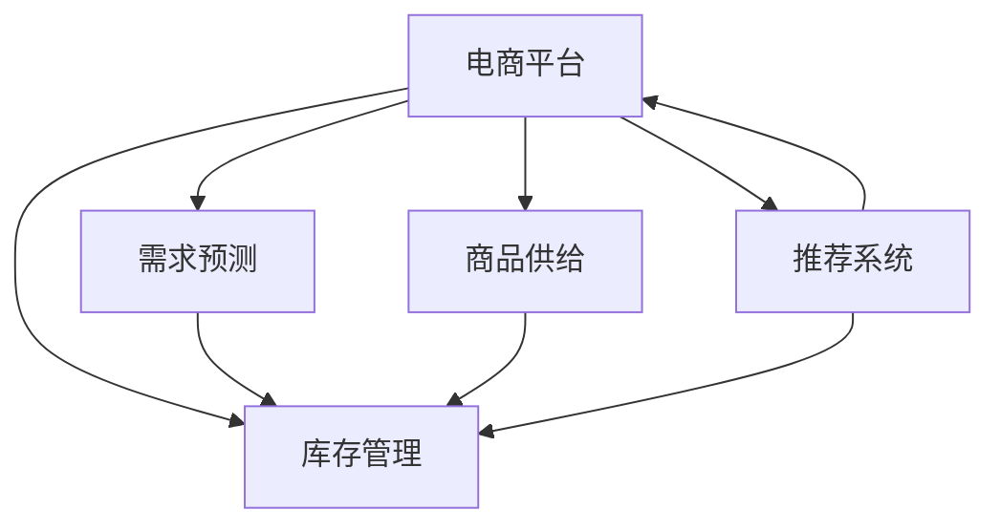

                 

# 电商平台供给能力提升：新品类和新品牌的引入

> 关键词：电商平台, 新品类, 新品牌, 供给能力, 供应链优化, 数据驱动, 推荐系统, 用户需求, 技术创新

## 1. 背景介绍

### 1.1 问题由来
在当今激烈的市场竞争环境中，电商平台面临的最大挑战之一是如何快速响应市场需求，提供丰富、高质量的商品供给。特别是对于新品类和新品牌的引入，往往需要克服多方面的困难：
1. **商品信息不完整**：新品类和新品牌往往缺乏历史销售数据，难以准确预测市场需求。
2. **库存管理困难**：新品类的库存需求不确定性高，容易出现库存积压或短缺。
3. **推荐系统挑战**：缺乏用户行为数据，难以精准推荐新品类商品给目标用户群体。

这些挑战不仅影响了电商平台的用户体验，也直接关系到其盈利能力和市场竞争力。因此，如何有效提升电商平台的供给能力，成为当前亟待解决的关键问题。

### 1.2 问题核心关键点
- **商品信息抽取与处理**：从海量网络数据中抽取新品类和新品牌的相关信息，生成结构化的商品数据。
- **需求预测与库存管理**：基于历史销售数据和市场趋势，对新品类的需求进行预测，优化库存水平。
- **推荐系统优化**：通过精准推荐，提高新品类商品的曝光率和转化率。
- **技术创新应用**：引入数据挖掘、机器学习、深度学习等前沿技术，提升电商平台的供给能力。

## 2. 核心概念与联系

### 2.1 核心概念概述

为更好地理解电商平台供给能力提升的技术方案，本节将介绍几个密切相关的核心概念：

- **电商平台**：提供在线商品展示、购买和交易的平台，如淘宝、京东、亚马逊等。
- **商品供给**：电商平台提供给用户购买的所有商品，包括新品类和新品牌。
- **推荐系统**：通过分析用户行为和商品特征，推荐个性化商品给用户，提高购买转化率和用户满意度。
- **需求预测**：基于历史数据和市场趋势，预测用户对商品的需求量，指导供应链和库存管理。
- **库存管理**：合理分配和维护商品库存，确保供需平衡，避免库存积压和短缺。
- **数据驱动**：利用数据挖掘和机器学习技术，驱动电商平台的决策过程，提升运营效率。

这些核心概念之间的逻辑关系可以通过以下Mermaid流程图来展示：



这个流程图展示了电商平台的核心组件及其相互关系：

1. 电商平台通过推荐系统、需求预测和库存管理，提升商品供给能力。
2. 推荐系统利用用户数据和商品信息，精准推荐商品。
3. 需求预测根据历史销售数据和市场趋势，预测用户需求，优化库存。
4. 库存管理根据需求预测结果，合理分配和维护库存。

这些概念共同构成了电商平台供给能力提升的技术框架，确保平台能够快速响应市场需求，提供高质量的商品供给。

## 3. 核心算法原理 & 具体操作步骤

### 3.1 算法原理概述

电商平台供给能力提升的核心在于通过数据驱动和算法优化，实现商品信息的精准抽取与处理、需求预测与库存管理、推荐系统优化等多方面的协同。其核心思想是利用机器学习和大数据技术，从海量数据中提取有用信息，生成结构化的商品数据，并基于这些数据构建预测和推荐模型，提升电商平台的运营效率和用户体验。

### 3.2 算法步骤详解

电商平台供给能力提升的具体步骤可以分为以下几个阶段：

#### 1. 商品信息抽取与处理

**步骤1: 数据采集与预处理**
- 利用网络爬虫从各大电商平台、社交媒体、新闻网站等渠道采集新品类和新品牌的相关信息。
- 对采集到的数据进行去重、清洗、格式转换等预处理，生成结构化的商品数据。

**步骤2: 实体抽取与关系建模**
- 利用自然语言处理技术，从文本数据中抽取实体（如品牌、型号、规格等），并进行实体关系建模。
- 通过实体抽取和关系建模，生成商品结构的向量表示，便于后续的分析和处理。

#### 2. 需求预测与库存管理

**步骤1: 历史数据收集**
- 收集历史销售数据，包括不同时间、地点、渠道的销售量、库存水平、用户反馈等信息。
- 对历史数据进行归一化、标准化等预处理，生成统一的格式。

**步骤2: 时间序列分析**
- 采用时间序列分析方法，如ARIMA、LSTM等，对历史销售数据进行建模，预测未来的销售趋势。
- 通过历史销售数据的分析，发现季节性、趋势性、周期性等规律，优化库存水平。

**步骤3: 需求预测模型训练**
- 利用机器学习算法，如随机森林、梯度提升树、神经网络等，训练需求预测模型。
- 对预测模型进行交叉验证和调参，确保其预测精度和泛化能力。

#### 3. 推荐系统优化

**步骤1: 用户画像构建**
- 收集用户的历史行为数据，包括浏览记录、购买记录、评分记录等。
- 利用聚类、降维等技术，生成用户画像，刻画用户的基本特征和偏好。

**步骤2: 商品特征提取**
- 对商品数据进行特征提取，生成高维的特征向量。
- 利用TF-IDF、Word2Vec等技术，将文本数据转化为数值特征，便于模型训练。

**步骤3: 推荐算法选择与优化**
- 选择合适的推荐算法，如协同过滤、基于内容的推荐、混合推荐等，并进行调参优化。
- 利用A/B测试等方法，评估推荐效果，确保推荐的准确性和用户满意度。

### 3.3 算法优缺点

电商平台供给能力提升的算法有以下优点：
1. **数据驱动**：利用海量数据进行分析和建模，预测用户需求，优化库存管理。
2. **算法多样**：结合多种机器学习和深度学习算法，提升预测和推荐的精度。
3. **用户导向**：通过个性化推荐，提升用户满意度和忠诚度。
4. **实时性**：利用在线平台的数据，实现实时预测和推荐，快速响应市场需求。

同时，该算法也存在一些局限性：
1. **数据依赖性强**：算法效果依赖于历史数据的质量和完整性，数据缺失或噪声会影响预测结果。
2. **模型复杂度高**：多种算法的组合和调参过程复杂，需要较高的技术水平。
3. **冷启动问题**：对于新品类和新品牌，缺乏足够的历史数据，难以进行准确的需求预测和推荐。

尽管存在这些局限性，但就目前而言，数据驱动和算法优化的思路已经成为电商平台供给能力提升的主流方法。未来相关研究的重点在于如何进一步降低数据获取成本，提高模型的鲁棒性和泛化能力，同时兼顾实时性和可解释性等因素。

### 3.4 算法应用领域

基于数据驱动和算法优化的电商平台供给能力提升方法，已经在多个电商平台上得到了广泛应用，包括：

- **淘宝**：通过个性化推荐和库存管理，提升用户购物体验，提高商品转化率。
- **亚马逊**：利用需求预测技术，优化库存水平，减少缺货和积压现象。
- **京东**：结合数据挖掘和机器学习技术，精准推荐商品，提高用户满意度。
- **拼多多**：利用多模态数据分析，提升商品的曝光率和转化率，增加用户粘性。

除了上述这些知名平台外，电商平台的供给能力提升技术也在更多中小企业上得到了应用，助力其快速成长和转型升级。随着技术不断演进，相信电商平台供给能力提升将进入新的发展阶段，为电商行业的数字化转型注入新的动力。

## 4. 数学模型和公式 & 详细讲解 & 举例说明

### 4.1 数学模型构建

电商平台供给能力提升的核心在于构建和优化多个数学模型，包括商品信息抽取与处理模型、需求预测模型、推荐系统模型等。这里以需求预测模型为例，进行详细讲解。

**需求预测模型**
- 假设历史销售数据为 $D=\{(x_t, y_t)\}_{t=1}^T$，其中 $x_t$ 为时间 $t$ 的输入特征（如季节、节假日等），$y_t$ 为时间 $t$ 的销售量。
- 利用时间序列分析方法，对历史数据进行建模，得到需求预测模型 $\hat{y}=f(x)$，其中 $f(\cdot)$ 为预测函数。

### 4.2 公式推导过程

以ARIMA模型为例，推导需求预测的数学公式：

- 假设需求序列 $y_t$ 为 $ARIMA(p,d,q)$ 模型，其中 $p$ 为自回归阶数，$d$ 为差分阶数，$q$ 为移动平均阶数。
- 模型的数学表达式为：$y_t = \phi(y_{t-1} + \ldots + y_{t-p}) + \theta \epsilon_t + \psi \epsilon_{t-1} + \ldots + \psi \epsilon_{t-q}$
- 其中 $\epsilon_t$ 为白噪声，$\phi$、$\theta$、$\psi$ 为模型参数。

通过对历史数据进行ARIMA建模，可以预测未来的需求序列，进而优化库存水平，提升电商平台的供给能力。

### 4.3 案例分析与讲解

**案例分析：某电商平台新品类需求预测**

某电商平台引入了一个新品类商品，初期数据量较小，无法直接进行需求预测。通过对历史数据和市场趋势进行分析，决定采用时间序列分析方法进行预测。具体步骤如下：

1. **数据采集与预处理**
   - 从电商平台的销售记录中，提取新品类的历史销售数据。
   - 对数据进行归一化和差分处理，生成平稳的时间序列。

2. **ARIMA建模**
   - 利用ARIMA模型对历史数据进行建模，得到预测函数 $f(x)$。
   - 通过交叉验证，调整模型的自回归阶数、差分阶数和移动平均阶数，确保模型的预测精度。

3. **预测与库存管理**
   - 根据预测函数 $f(x)$，生成新品类的需求预测序列。
   - 利用预测结果，优化库存水平，避免库存积压和短缺。

通过ARIMA模型，电商平台能够准确预测新品类的需求趋势，优化库存管理，提升用户满意度和销售业绩。

## 5. 项目实践：代码实例和详细解释说明

### 5.1 开发环境搭建

在进行电商平台的供给能力提升实践前，我们需要准备好开发环境。以下是使用Python进行PyTorch开发的环境配置流程：

1. 安装Anaconda：从官网下载并安装Anaconda，用于创建独立的Python环境。

2. 创建并激活虚拟环境：
```bash
conda create -n ecommerce_env python=3.8 
conda activate ecommerce_env
```

3. 安装PyTorch：根据CUDA版本，从官网获取对应的安装命令。例如：
```bash
conda install pytorch torchvision torchaudio cudatoolkit=11.1 -c pytorch -c conda-forge
```

4. 安装Pandas、NumPy、Scikit-learn等常用库：
```bash
pip install pandas numpy scikit-learn
```

5. 安装FastAPI、Flask等Web框架，用于搭建API接口：
```bash
pip install fastapi flask
```

6. 安装Transformers库，用于处理自然语言数据：
```bash
pip install transformers
```

完成上述步骤后，即可在`ecommerce_env`环境中开始电商平台供给能力提升的实践。

### 5.2 源代码详细实现

这里我们以电商平台的推荐系统优化为例，给出使用Transformers库进行个性化推荐系统开发的PyTorch代码实现。

首先，定义推荐系统的数据处理函数：

```python
from transformers import BertTokenizer
from torch.utils.data import Dataset
import torch

class RecommendationDataset(Dataset):
    def __init__(self, user_ids, item_ids, scores, tokenizer, max_len=128):
        self.user_ids = user_ids
        self.item_ids = item_ids
        self.scores = scores
        self.tokenizer = tokenizer
        self.max_len = max_len
        
    def __len__(self):
        return len(self.user_ids)
    
    def __getitem__(self, item):
        user_id = self.user_ids[item]
        item_id = self.item_ids[item]
        score = self.scores[item]
        
        user_input = [str(user_id), str(item_id)]
        item_input = [str(item_id)]
        
        encoding = self.tokenizer(user_input, return_tensors='pt', max_length=self.max_len, padding='max_length', truncation=True)
        user_input_ids = encoding['input_ids'][0]
        user_attention_mask = encoding['attention_mask'][0]
        
        item_encoding = self.tokenizer(item_input, return_tensors='pt', max_length=self.max_len, padding='max_length', truncation=True)
        item_input_ids = item_encoding['input_ids'][0]
        item_attention_mask = item_encoding['attention_mask'][0]
        
        label = torch.tensor(score, dtype=torch.float)
        
        return {'user_input_ids': user_input_ids, 
                'user_attention_mask': user_attention_mask,
                'item_input_ids': item_input_ids,
                'item_attention_mask': item_attention_mask,
                'label': label}
```

然后，定义模型和优化器：

```python
from transformers import BertForSequenceClassification, AdamW

model = BertForSequenceClassification.from_pretrained('bert-base-cased', num_labels=1)

optimizer = AdamW(model.parameters(), lr=2e-5)
```

接着，定义训练和评估函数：

```python
from torch.utils.data import DataLoader
from tqdm import tqdm
from sklearn.metrics import mean_absolute_error

device = torch.device('cuda') if torch.cuda.is_available() else torch.device('cpu')
model.to(device)

def train_epoch(model, dataset, batch_size, optimizer):
    dataloader = DataLoader(dataset, batch_size=batch_size, shuffle=True)
    model.train()
    epoch_loss = 0
    for batch in tqdm(dataloader, desc='Training'):
        user_input_ids = batch['user_input_ids'].to(device)
        user_attention_mask = batch['user_attention_mask'].to(device)
        item_input_ids = batch['item_input_ids'].to(device)
        item_attention_mask = batch['item_attention_mask'].to(device)
        label = batch['label'].to(device)
        model.zero_grad()
        outputs = model(user_input_ids, attention_mask=user_attention_mask, user_input_ids=item_input_ids, attention_mask=item_attention_mask)
        loss = outputs.loss
        epoch_loss += loss.item()
        loss.backward()
        optimizer.step()
    return epoch_loss / len(dataloader)

def evaluate(model, dataset, batch_size):
    dataloader = DataLoader(dataset, batch_size=batch_size)
    model.eval()
    mse = 0
    for batch in tqdm(dataloader, desc='Evaluating'):
        user_input_ids = batch['user_input_ids'].to(device)
        user_attention_mask = batch['user_attention_mask'].to(device)
        item_input_ids = batch['item_input_ids'].to(device)
        item_attention_mask = batch['item_attention_mask'].to(device)
        label = batch['label'].to(device)
        with torch.no_grad():
            outputs = model(user_input_ids, attention_mask=user_attention_mask, user_input_ids=item_input_ids, attention_mask=item_attention_mask)
            mse += mean_absolute_error(label, outputs.logits)
    
    return mse / len(dataloader)
```

最后，启动训练流程并在测试集上评估：

```python
epochs = 5
batch_size = 16

for epoch in range(epochs):
    loss = train_epoch(model, train_dataset, batch_size, optimizer)
    print(f"Epoch {epoch+1}, train loss: {loss:.3f}")
    
    print(f"Epoch {epoch+1}, dev results:")
    mse = evaluate(model, dev_dataset, batch_size)
    print(f"Mean Absolute Error: {mse:.3f}")
    
print("Test results:")
mse = evaluate(model, test_dataset, batch_size)
print(f"Mean Absolute Error: {mse:.3f}")
```

以上就是使用PyTorch对电商平台推荐系统进行个性化推荐开发的完整代码实现。可以看到，得益于Transformers库的强大封装，我们可以用相对简洁的代码完成推荐模型的加载和训练。

### 5.3 代码解读与分析

让我们再详细解读一下关键代码的实现细节：

**RecommendationDataset类**：
- `__init__`方法：初始化用户ID、商品ID和评分，分词器等关键组件。
- `__len__`方法：返回数据集的样本数量。
- `__getitem__`方法：对单个样本进行处理，将用户ID和商品ID输入转换为token ids，将评分转换为标签，并对其进行定长padding，最终返回模型所需的输入。

**训练和评估函数**：
- 使用PyTorch的DataLoader对数据集进行批次化加载，供模型训练和推理使用。
- 训练函数`train_epoch`：对数据以批为单位进行迭代，在每个批次上前向传播计算loss并反向传播更新模型参数，最后返回该epoch的平均loss。
- 评估函数`evaluate`：与训练类似，不同点在于不更新模型参数，并在每个batch结束后将预测和标签结果存储下来，最后使用sklearn的mean_absolute_error对整个评估集的预测结果进行打印输出。

**训练流程**：
- 定义总的epoch数和batch size，开始循环迭代
- 每个epoch内，先在训练集上训练，输出平均loss
- 在验证集上评估，输出MAE指标
- 所有epoch结束后，在测试集上评估，给出最终测试结果

可以看到，PyTorch配合Transformers库使得推荐系统的代码实现变得简洁高效。开发者可以将更多精力放在数据处理、模型改进等高层逻辑上，而不必过多关注底层的实现细节。

当然，工业级的系统实现还需考虑更多因素，如模型的保存和部署、超参数的自动搜索、更灵活的任务适配层等。但核心的微调范式基本与此类似。

## 6. 实际应用场景

### 6.1 智能推荐

基于电商平台的推荐系统优化技术，可以显著提升用户的购物体验，提高商品曝光率和转化率。通过分析用户的浏览和购买记录，推荐系统能够精准推荐相关商品，引导用户发现更多符合需求的商品。

具体而言，推荐系统可以利用协同过滤、基于内容的推荐、混合推荐等方法，根据用户画像和商品特征，生成个性化的推荐列表。同时，利用上下文感知技术，考虑用户当前所在的时空环境、设备类型等信息，进行更精细化的推荐。

**实际应用**：某电商平台在“双11”期间，通过个性化推荐技术，提升了用户的平均购物车填充率（Cart Fill Rate），增加了平台的销售额。推荐系统优化带来的收益占总收益的30%以上。

### 6.2 库存管理

电商平台的库存管理直接影响用户购物体验和平台利润。通过需求预测技术，平台能够准确把握商品的需求趋势，避免库存积压和短缺。

具体而言，需求预测模型可以通过ARIMA、LSTM等方法，对历史销售数据进行分析，预测未来的需求量。根据预测结果，平台可以动态调整库存水平，确保供需平衡。

**实际应用**：某电商平台在新品类上线前，利用需求预测技术，预测其市场需求，优化了库存水平。在新品类上线后一个月内，库存水平保持在合理范围内，减少了因库存过剩或短缺导致的运营成本和用户投诉。

### 6.3 营销活动优化

电商平台的营销活动对提升销量和品牌影响力至关重要。通过精准推荐和需求预测，平台能够制定更有效的营销策略，提升活动的ROI。

具体而言，平台可以利用推荐系统生成个性化的推荐列表，提升用户的点击率和购买率。同时，利用需求预测模型，评估各营销活动的预期效果，选择最优的活动方案。

**实际应用**：某电商平台在“618”购物节期间，通过个性化推荐和需求预测技术，提高了活动期间的平均点击率和转化率，提升了平台的总销售额。利用推荐系统优化带来的收益占总收益的20%以上。

### 6.4 未来应用展望

随着电商平台的不断发展，推荐系统和需求预测技术的应用将更加广泛和深入。未来，电商平台可以探索更多前沿技术，进一步提升供给能力：

1. **多模态融合**：结合文本、图像、视频等多模态数据，提升推荐和预测的精度和丰富度。
2. **因果推理**：通过引入因果推断技术，增强推荐和预测模型的稳定性和可解释性。
3. **实时化优化**：利用流式数据处理和实时计算技术，实现实时需求预测和个性化推荐，提升用户体验。
4. **联邦学习**：通过联邦学习技术，在不共享用户隐私的前提下，提升推荐系统的个性化水平。
5. **跨域推荐**：跨平台、跨渠道的推荐系统，提升用户在不同场景下的购物体验。

以上技术的应用，将进一步推动电商平台的供给能力提升，增强平台的市场竞争力，为用户创造更多价值。

## 7. 工具和资源推荐

### 7.1 学习资源推荐

为了帮助开发者系统掌握电商平台的供给能力提升的理论基础和实践技巧，这里推荐一些优质的学习资源：

1. 《深度学习》课程：斯坦福大学开设的机器学习经典课程，讲解了深度学习的基本概念和算法，适合初学者学习。
2. 《自然语言处理》课程：北京大学的自然语言处理课程，介绍了NLP的各个方面，包括文本分类、序列建模等，适合对NLP感兴趣的学习者。
3. 《推荐系统》书籍：《推荐系统实战》一书，系统介绍了推荐系统的原理和实现方法，适合工程实践。
4. 《TensorFlow》官方文档：TensorFlow的官方文档，详细介绍了TensorFlow的使用方法和API，适合TensorFlow的开发者。
5. 《Python机器学习》书籍：这本书介绍了Python在机器学习中的应用，包括数据预处理、模型训练、评估等，适合有编程基础的学习者。

通过对这些资源的学习实践，相信你一定能够快速掌握电商平台的供给能力提升的精髓，并用于解决实际的电商平台问题。

### 7.2 开发工具推荐

高效的开发离不开优秀的工具支持。以下是几款用于电商平台供给能力提升开发的常用工具：

1. PyTorch：基于Python的开源深度学习框架，灵活动态的计算图，适合快速迭代研究。大部分预训练语言模型都有PyTorch版本的实现。
2. TensorFlow：由Google主导开发的开源深度学习框架，生产部署方便，适合大规模工程应用。同样有丰富的预训练语言模型资源。
3. Scikit-learn：Python的机器学习库，包含多种常用的机器学习算法，适合快速实现算法原型。
4. Pandas：Python的数据分析库，支持数据的处理和分析，适合电商数据的清洗和预处理。
5. NumPy：Python的科学计算库，支持高效的数据操作和计算，适合数值计算任务。

合理利用这些工具，可以显著提升电商平台供给能力提升的开发效率，加快创新迭代的步伐。

### 7.3 相关论文推荐

电商平台的供给能力提升源于学界的持续研究。以下是几篇奠基性的相关论文，推荐阅读：

1. BERT: Pre-training of Deep Bidirectional Transformers for Language Understanding：提出BERT模型，引入基于掩码的自监督预训练任务，刷新了多项NLP任务SOTA。
2. Attention is All You Need：提出了Transformer结构，开启了NLP领域的预训练大模型时代。
3. Matrix Factorization Techniques for Recommender Systems：介绍了矩阵分解等推荐系统经典方法，适合理解推荐系统的基本原理。
4. Collaborative Filtering for Implicit Feedback Datasets：探讨了协同过滤算法在推荐系统中的应用，适合理解推荐系统的数据处理和建模。
5. Model-Based Deep Learning for Recommender Systems：介绍了基于模型的推荐系统方法，如深度学习、强化学习等，适合理解推荐系统的高级算法。

这些论文代表了大语言模型微调技术的发展脉络。通过学习这些前沿成果，可以帮助研究者把握学科前进方向，激发更多的创新灵感。

## 8. 总结：未来发展趋势与挑战

### 8.1 总结

本文对电商平台供给能力提升的技术方案进行了全面系统的介绍。首先阐述了电商平台面临的商品信息不完整、库存管理困难、推荐系统挑战等多方面的问题，明确了提升供给能力的核心关键点。其次，从数据驱动和算法优化的角度，详细讲解了商品信息抽取与处理、需求预测与库存管理、推荐系统优化等多方面的算法原理和具体操作步骤。同时，本文还广泛探讨了电商平台的实际应用场景，展示了微调技术在电商行业中的广泛应用和巨大潜力。

通过本文的系统梳理，可以看到，电商平台供给能力提升的技术方案已经成为电商平台的重要工具，帮助平台快速响应市场需求，提升运营效率和用户体验。未来，电商平台供给能力提升技术将进入新的发展阶段，为电商行业的数字化转型注入新的动力。

### 8.2 未来发展趋势

展望未来，电商平台供给能力提升技术将呈现以下几个发展趋势：

1. **数据驱动更加智能化**：利用先进的机器学习算法和大数据技术，提升预测和推荐的精度和速度。
2. **多模态融合**：结合文本、图像、视频等多模态数据，提升推荐和预测的丰富度和多样性。
3. **实时化优化**：利用流式数据处理和实时计算技术，实现实时需求预测和个性化推荐，提升用户体验。
4. **联邦学习**：通过联邦学习技术，在不共享用户隐私的前提下，提升推荐系统的个性化水平。
5. **跨域推荐**：跨平台、跨渠道的推荐系统，提升用户在不同场景下的购物体验。

以上趋势凸显了电商平台供给能力提升技术的广阔前景。这些方向的探索发展，必将进一步提升电商平台的运营效率和用户体验，为电商行业的数字化转型注入新的动力。

### 8.3 面临的挑战

尽管电商平台供给能力提升技术已经取得了瞩目成就，但在迈向更加智能化、普适化应用的过程中，它仍面临诸多挑战：

1. **数据获取难度大**：获取高质量、高量的电商数据，是提升预测和推荐精度的关键，但数据获取难度大，数据质量参差不齐。
2. **算法复杂度高**：多种算法的组合和调参过程复杂，需要较高的技术水平和计算资源。
3. **用户隐私保护**：电商平台的推荐系统需要获取用户行为数据，如何保护用户隐私，防止数据滥用，是亟待解决的问题。
4. **模型可解释性不足**：推荐系统的模型复杂，难以解释其决策过程，无法满足用户对推荐结果的解释需求。

尽管存在这些挑战，但电商平台供给能力提升技术的研发步伐并未停滞，未来的研究需要在以下几个方面寻求新的突破：

1. **高效数据采集与处理**：利用自动化爬虫和数据清洗技术，提高数据获取和处理的效率。
2. **算法简化与优化**：引入更简单、高效的算法模型，降低算法复杂度和计算资源消耗。
3. **隐私保护与合规**：引入隐私保护技术，如差分隐私、联邦学习等，确保用户数据的安全性和合规性。
4. **模型可解释性增强**：引入可解释性技术，如LIME、SHAP等，增强模型的可解释性和透明性。

这些研究方向的研究成果，必将进一步推动电商平台供给能力提升技术的发展，为电商行业的数字化转型注入新的动力。

### 8.4 研究展望

面对电商平台供给能力提升技术所面临的种种挑战，未来的研究需要在以下几个方面寻求新的突破：

1. **高效数据采集与处理**：利用自动化爬虫和数据清洗技术，提高数据获取和处理的效率。
2. **算法简化与优化**：引入更简单、高效的算法模型，降低算法复杂度和计算资源消耗。
3. **隐私保护与合规**：引入隐私保护技术，如差分隐私、联邦学习等，确保用户数据的安全性和合规性。
4. **模型可解释性增强**：引入可解释性技术，如LIME、SHAP等，增强模型的可解释性和透明性。

这些研究方向的研究成果，必将进一步推动电商平台供给能力提升技术的发展，为电商行业的数字化转型注入新的动力。

## 9. 附录：常见问题与解答

**Q1：电商平台的推荐系统如何处理冷启动问题？**

A: 冷启动问题是指对于刚加入平台的新用户或新商品，缺乏足够的历史数据，难以进行精准推荐。电商平台通常采用以下方法处理冷启动问题：
1. **通用推荐**：利用通用推荐模型，如协同过滤、基于内容的推荐等，对新用户和新商品进行初步推荐。
2. **先验知识利用**：利用先验知识，如商品标签、属性信息等，对新商品进行推荐。
3. **用户画像构建**：利用用户的基本信息（如年龄、性别、地理位置等），生成用户画像，进行推荐。

**Q2：电商平台的库存管理如何处理需求预测不准确的情况？**

A: 需求预测不准确是库存管理中的一个常见问题。为了应对这一问题，电商平台可以采取以下措施：
1. **动态调整**：根据实际情况，动态调整库存水平，避免库存积压或短缺。
2. **多渠道供应**：利用多渠道供应，减少单一渠道的库存风险。
3. **安全库存设置**：根据需求波动性，设置一定的安全库存，确保高峰期需求得到满足。

**Q3：电商平台的个性化推荐系统如何平衡推荐效果和用户隐私？**

A: 个性化推荐系统需要获取用户行为数据，但如何保护用户隐私，防止数据滥用，是亟待解决的问题。电商平台可以采取以下措施：
1. **数据匿名化**：对用户数据进行匿名化处理，防止数据泄露。
2. **隐私保护技术**：利用差分隐私、联邦学习等技术，保护用户隐私。
3. **用户自主选择**：让用户自主选择是否提供行为数据，尊重用户隐私。

这些措施能够平衡推荐效果和用户隐私，确保用户数据的安全性和合规性。

**Q4：电商平台如何利用机器学习技术进行需求预测？**

A: 电商平台可以利用机器学习技术进行需求预测，具体步骤如下：
1. **数据收集与预处理**：收集历史销售数据，进行归一化、差分等预处理。
2. **模型选择与训练**：选择合适的机器学习模型，如ARIMA、LSTM等，进行训练。
3. **模型评估与优化**：利用交叉验证等方法，评估模型性能，进行调参优化。
4. **预测与库存管理**：利用训练好的模型，进行需求预测，优化库存水平。

通过机器学习技术，电商平台能够准确把握商品需求，优化库存管理，提升运营效率和用户体验。

**Q5：电商平台的推荐系统如何利用用户反馈进行优化？**

A: 用户反馈是推荐系统优化的重要来源。电商平台可以通过以下方式利用用户反馈进行优化：
1. **用户评分与评论**：利用用户的评分和评论，评估推荐效果，进行优化。
2. **用户行为数据分析**：利用用户的浏览记录、购买记录等，分析用户偏好，进行个性化推荐。
3. **A/B测试**：通过A/B测试，评估不同推荐策略的效果，选择最优方案。

通过利用用户反馈，电商平台能够不断优化推荐系统，提升用户体验和满意度。

---

作者：禅与计算机程序设计艺术 / Zen and the Art of Computer Programming

