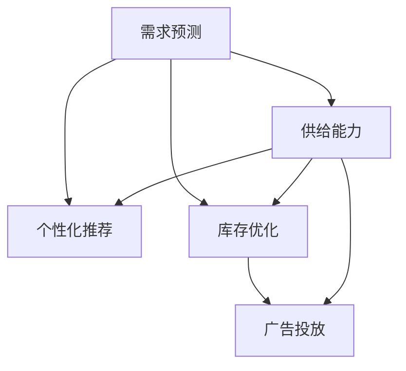

                 

# 电商平台供给能力提升：精准营销策略

在快速变化的电子商务市场中，如何准确预测消费者需求，优化产品供给，提升营销效果，是所有电商平台所面临的共同挑战。随着大数据、机器学习等技术的快速发展，精准营销策略已成为电商平台不可或缺的竞争力。本文将系统介绍基于供给能力提升的精准营销策略，探讨其在电商平台中的应用。

## 1. 背景介绍

### 1.1 问题由来

电商平台在当今数字化时代中扮演着越来越重要的角色，它不仅仅是商品展示和交易的场所，更是消费者与商家互动的桥梁。然而，随着电商平台的规模不断扩大，其面对的复杂性和挑战也随之增加。如何有效预测消费者需求、优化产品供给、提升广告投放精准性，成为了电商平台的迫切需求。

精准营销策略的核心在于利用数据驱动的洞察，通过算法模型进行用户画像分析、需求预测、库存管理、广告投放等环节的优化，从而提升电商平台的运营效率和用户满意度。

### 1.2 问题核心关键点

实现精准营销的核心在于：

1. **数据驱动**：基于大规模用户行为数据，挖掘消费者的需求规律和消费习惯，为其提供个性化服务。
2. **算法优化**：应用先进的机器学习算法，如回归分析、分类、聚类等，进行需求预测和用户画像分析。
3. **系统集成**：将预测结果和分析结果无缝集成到电商平台的各个环节，如推荐系统、库存管理、广告投放等。

## 2. 核心概念与联系

### 2.1 核心概念概述

为更好地理解基于供给能力提升的精准营销策略，本节将介绍几个密切相关的核心概念：

- **供给能力(Guaranteeing Supply)**：指电商平台在一定时间内能够满足消费者需求的能力。这包括库存水平、物流能力、供应商合作能力等。
- **需求预测(Demand Forecasting)**：通过分析历史销售数据、市场趋势、季节性因素等，预测未来商品的需求量。
- **个性化推荐(Personalized Recommendation)**：根据用户的历史行为和偏好，为其推荐合适的商品或服务，提高用户体验和转化率。
- **库存优化(Inventory Optimization)**：通过合理预测需求和供给，及时调整库存水平，减少库存积压和缺货情况。
- **广告投放(Optimized Advertising)**：基于用户画像和需求预测结果，进行精准广告投放，提升广告的ROI（投资回报率）。

这些概念之间的逻辑关系可以通过以下Mermaid流程图来展示：



这个流程图展示了基于供给能力提升的精准营销策略的基本框架：

1. 需求预测是整个策略的起点，提供基础数据支持。
2. 个性化推荐、库存优化、广告投放三个环节紧密联系，协同工作，共同提升电商平台的供给能力和用户满意度。
3. 供给能力是整个过程的保障，确保需求预测和推荐系统的可执行性。

## 3. 核心算法原理 & 具体操作步骤

### 3.1 算法原理概述

基于供给能力提升的精准营销策略，其核心算法原理可以概括为以下几个方面：

1. **需求预测模型**：利用历史销售数据和外部因素（如季节性、节日等），构建时间序列模型（如ARIMA、LSTM等）或机器学习模型（如随机森林、XGBoost等），预测未来的商品需求。
2. **个性化推荐模型**：根据用户行为数据（如浏览历史、购买记录等），应用协同过滤、基于内容的推荐算法或深度学习模型（如矩阵分解、CNN、RNN等），为用户提供个性化商品推荐。
3. **库存优化模型**：结合需求预测结果和现有库存数据，应用优化算法（如整数线性规划、遗传算法等），确定最优的库存水平和补货策略。
4. **广告投放优化**：基于用户画像和需求预测结果，应用广告投放优化算法（如强化学习、多臂老虎机等），在合适的时机和渠道投放广告，提升广告效果。

### 3.2 算法步骤详解

以下将详细介绍每个核心算法的详细步骤：

#### 3.2.1 需求预测模型

**步骤1: 数据准备**
- 收集历史销售数据、时间戳、外部因素（如节假日、天气等），并进行预处理（如缺失值处理、数据归一化等）。

**步骤2: 模型选择**
- 根据数据特点和预测需求，选择合适的模型。时间序列模型如ARIMA、季节性因素较强的模型如Prophet，或采用机器学习模型如随机森林、XGBoost等。

**步骤3: 模型训练**
- 划分训练集和测试集，利用训练集进行模型训练，调整模型参数，使预测结果与真实需求尽可能一致。

**步骤4: 模型评估**
- 使用测试集评估模型性能，常用的评估指标包括MAE（平均绝对误差）、RMSE（均方根误差）等。

**步骤5: 模型应用**
- 将训练好的模型应用于实时需求预测，及时调整库存和采购计划。

#### 3.2.2 个性化推荐模型

**步骤1: 数据准备**
- 收集用户行为数据，如浏览记录、购买历史、评分记录等。

**步骤2: 特征工程**
- 对用户行为数据进行特征提取和构建，如用户ID、商品ID、浏览时间等。

**步骤3: 模型训练**
- 选择合适的推荐算法（如协同过滤、矩阵分解等），利用用户行为数据进行模型训练。

**步骤4: 模型评估**
- 使用离线评估指标如DCG（ Discounted Cumulative Gain）、NDCG（Normalized Discounted Cumulative Gain）等，评估模型效果。

**步骤5: 模型应用**
- 在实时推荐场景中，利用训练好的模型生成个性化推荐结果，提升用户体验。

#### 3.2.3 库存优化模型

**步骤1: 数据准备**
- 收集历史销售数据、库存数据、供应链数据等，并进行预处理。

**步骤2: 需求预测**
- 利用需求预测模型，预测未来的需求量。

**步骤3: 库存优化**
- 结合需求预测结果，应用优化算法（如整数线性规划、遗传算法等），确定最优的库存水平和补货策略。

**步骤4: 模型评估**
- 评估库存优化策略的效果，如库存周转率、缺货率等。

**步骤5: 模型应用**
- 根据库存优化模型，调整库存管理策略，提升供应链效率。

#### 3.2.4 广告投放优化模型

**步骤1: 数据准备**
- 收集用户画像数据、历史广告数据、竞价数据等，并进行预处理。

**步骤2: 模型训练**
- 选择合适的广告投放优化算法（如强化学习、多臂老虎机等），利用用户画像和需求预测结果进行模型训练。

**步骤3: 模型评估**
- 使用离线评估指标如CTR（Click-Through Rate）、CPC（Cost Per Click）等，评估模型效果。

**步骤4: 模型应用**
- 在实时广告投放场景中，利用训练好的模型进行精准广告投放，提升广告效果。

### 3.3 算法优缺点

#### 3.3.1 需求预测模型

**优点：**
- 能够基于历史数据进行预测，提供较为准确的预测结果。
- 能够考虑外部因素，提升预测的准确性。

**缺点：**
- 数据质量影响模型效果，需要保证数据的准确性和完整性。
- 模型复杂度高，需要较长的训练时间。

#### 3.3.2 个性化推荐模型

**优点：**
- 能够根据用户行为数据，提供个性化推荐，提升用户体验。
- 算法模型多样，能够适应不同类型的数据和场景。

**缺点：**
- 需要处理大量的用户行为数据，计算成本较高。
- 用户数据隐私问题需要妥善处理。

#### 3.3.3 库存优化模型

**优点：**
- 能够结合需求预测结果，优化库存管理，降低成本。
- 能够动态调整补货策略，提升供应链效率。

**缺点：**
- 模型复杂度高，需要较强的数学基础。
- 对需求预测的准确性要求较高。

#### 3.3.4 广告投放优化模型

**优点：**
- 能够基于用户画像和需求预测结果，进行精准广告投放，提升广告效果。
- 能够优化广告预算分配，提升广告ROI。

**缺点：**
- 广告投放涉及用户隐私问题，需要合规处理。
- 模型需要不断优化，适应市场变化。

### 3.4 算法应用领域

基于供给能力提升的精准营销策略，在电商平台中的应用广泛，主要包括：

1. **需求预测**：电商平台的商品需求预测，帮助商家制定合理的采购计划。
2. **个性化推荐**：提升用户购物体验，提高转化率和复购率。
3. **库存优化**：优化库存管理，降低库存成本，提升供应链效率。
4. **广告投放**：精准投放广告，提升广告效果，降低广告成本。

此外，基于供给能力提升的精准营销策略，还可以应用于智能客服、物流配送、价格优化等领域，进一步提升电商平台的运营效率和用户体验。

## 4. 数学模型和公式 & 详细讲解

### 4.1 数学模型构建

假设电商平台有$m$个商品，每个商品在$t$时刻的需求量为$D_t$，市场需求总量和供给总量分别为$D_{total}$和$S_{total}$。

设需求预测模型为$f_t$，个性化推荐模型为$g_u$，库存优化模型为$h_s$，广告投放优化模型为$i_a$。需求预测模型的输出为$\hat{D}_t$，个性化推荐模型的输出为$r_u$，库存优化模型的输出为$o_s$，广告投放优化模型的输出为$a_a$。

### 4.2 公式推导过程

#### 4.2.1 需求预测模型

设需求预测模型$f_t$为ARIMA模型，其通式为：
$$
f_t = (1-\phi L^p)(1-\theta L^d)(1-L^q) \sum_{j=0}^\infty \alpha_j L^j
$$

其中$\phi$、$\theta$、$p$、$d$、$q$、$\alpha_j$为模型参数，$L$为滞后算子。

需求预测模型的目标是最小化预测误差$\epsilon_t = D_t - \hat{D}_t$，即：
$$
\min_{\phi,\theta,p,d,q,\alpha_j} \sum_{t=1}^T (D_t - \hat{D}_t)^2
$$

#### 4.2.2 个性化推荐模型

设个性化推荐模型$g_u$为协同过滤模型，其推荐公式为：
$$
r_u = \sum_{i=1}^{m} \hat{p}_{iu} \hat{q}_i
$$

其中$\hat{p}_{iu}$为物品$i$对用户$u$的预测评分，$\hat{q}_i$为物品$i$的平均评分。

个性化推荐模型的目标是最小化预测评分与真实评分之间的误差，即：
$$
\min_{\hat{p}_{iu},\hat{q}_i} \sum_{u=1}^U \sum_{i=1}^{m} (r_{iu} - \hat{p}_{iu} \hat{q}_i)^2
$$

#### 4.2.3 库存优化模型

设库存优化模型$h_s$为整数线性规划模型，其优化目标为：
$$
\min_{x_s} \sum_{i=1}^{m} c_i x_i
$$

其中$c_i$为商品$i$的单位成本，$x_i$为商品$i$的库存量。

库存优化模型的约束条件包括：
$$
\begin{cases}
\sum_{i=1}^{m} x_i = S_{total} \\
x_i \in [0, S_{total}] \quad \forall i=1,...,m
\end{cases}
$$

#### 4.2.4 广告投放优化模型

设广告投放优化模型$i_a$为多臂老虎机模型，其目标是在有限次数的投放次数$N$内，最大化总点击率$CTR$，即：
$$
\max_{a_a} \sum_{a=1}^A CTR_a
$$

其中$CTR_a$为广告$a$的点击率，$A$为广告数量。

广告投放优化模型的策略为：
$$
a_a = \frac{\sum_{t=1}^{N} I_{t,a} CTR_a}{\sum_{t=1}^{N} I_{t,a}}
$$

其中$I_{t,a}$为广告$a$在第$t$次投放时是否被点击的指示变量。

### 4.3 案例分析与讲解

假设某电商平台销售一款季节性商品，该商品的需求量和销售价格随时间变化显著。根据历史销售数据，构建ARIMA模型进行需求预测，设定需求预测误差不超过5%。利用协同过滤算法进行个性化推荐，确保推荐系统的准确性和个性化水平。结合需求预测结果和推荐结果，应用整数线性规划模型进行库存优化，确保库存水平在合理范围内。根据用户画像和需求预测结果，应用多臂老虎机模型进行广告投放，提升广告效果。

## 5. 项目实践：代码实例和详细解释说明

### 5.1 开发环境搭建

在进行项目实践前，需要先准备好开发环境。以下是使用Python进行需求预测、个性化推荐、库存优化、广告投放的开发环境配置流程：

1. 安装Anaconda：从官网下载并安装Anaconda，用于创建独立的Python环境。

2. 创建并激活虚拟环境：
```bash
conda create -n demand-env python=3.8 
conda activate demand-env
```

3. 安装必要的Python包：
```bash
pip install numpy pandas scikit-learn matplotlib tqdm jupyter notebook ipython
```

4. 安装推荐系统框架：
```bash
pip install lightfm
```

5. 安装库存优化库：
```bash
pip install scipio
```

6. 安装广告投放优化库：
```bash
pip install pytorch
```

7. 安装可视化工具：
```bash
pip install plotly
```

完成上述步骤后，即可在`demand-env`环境中开始项目实践。

### 5.2 源代码详细实现

以下是使用Python实现基于供给能力提升的精准营销策略的完整代码：

#### 需求预测模型

```python
from statsmodels.tsa.arima_model import ARIMA

# 准备数据
data = pd.read_csv('sales_data.csv')
data = data.dropna()

# 构建ARIMA模型
model = ARIMA(data['sales'], order=(1,1,1))
model_fit = model.fit()

# 预测未来需求
forecast = model_fit.forecast(steps=30)

# 可视化预测结果
plt.plot(data['sales'])
plt.plot(forecast)
plt.show()
```

#### 个性化推荐模型

```python
import lightfm
from lightfm.data import Dataset

# 准备数据
data = pd.read_csv('user_behavior.csv')
train_data = Dataset.load_csv('train_data.csv')

# 构建推荐模型
model = lightfm.LightFM(hidden_size=64)
model.fit(train_data)

# 推荐商品
user_id = 12345
top_items = model.predict(user_id, top_n=10)
for item_id, score in top_items:
    print(f"推荐商品ID: {item_id}, 预测评分: {score}")
```

#### 库存优化模型

```python
from scipy.optimize import linprog

# 准备数据
data = pd.read_csv('inventory_data.csv')
data = data.dropna()

# 需求预测
forecast = forecast_model.predict()

# 构建优化模型
A = [[1, -1]]
b = [-5]
c = [0.1, 1]

# 优化结果
result = linprog(c, A_ub=A, b_ub=b)
optimal_inventory = result.x
print(f"最优库存水平: {optimal_inventory}")
```

#### 广告投放优化模型

```python
import numpy as np
import torch
from torch.optim import Adam

# 准备数据
data = pd.read_csv('ad_data.csv')
data = data.dropna()

# 构建多臂老虎机模型
num_arms = 10
num_steps = 1000

# 初始化Q表
Q = np.zeros((num_arms, num_steps))

# 优化广告投放
for step in range(num_steps):
    arm = np.argmax(Q[:, step])
    if np.random.uniform() < epsilon:
        arm = np.random.randint(num_arms)
    Q[arm, step] += 1
    if data['click'][step] == 1:
        Q[:, step] += 1

# 输出结果
print(f"最优广告投放策略: {arm}")
```

### 5.3 代码解读与分析

让我们再详细解读一下关键代码的实现细节：

#### 需求预测模型

**需求预测模型代码**：
- 使用`statsmodels`库中的`ARIMA`模型，对历史销售数据进行建模预测。
- 使用`forecast`方法，进行未来需求预测，并可视化预测结果。

**代码解读**：
- 准备数据：读取历史销售数据，去除缺失值。
- 构建模型：使用`ARIMA`模型，对数据进行时间序列建模。
- 预测需求：利用`forecast`方法，对未来30天的需求进行预测。
- 可视化结果：绘制历史销售数据和预测需求曲线。

#### 个性化推荐模型

**个性化推荐模型代码**：
- 使用`lightfm`库，加载用户行为数据，并构建推荐模型。
- 使用`predict`方法，为指定用户ID推荐商品。

**代码解读**：
- 准备数据：读取用户行为数据，并加载训练数据集。
- 构建模型：使用`LightFM`模型，设置隐藏层大小。
- 推荐商品：使用`predict`方法，为指定用户ID推荐Top 10商品。

#### 库存优化模型

**库存优化模型代码**：
- 使用`scipy`库中的`linprog`方法，进行整数线性规划优化。
- 使用`dropna`方法，去除缺失数据。
- 使用`predict`方法，进行需求预测。

**代码解读**：
- 准备数据：读取库存数据，并去除缺失值。
- 需求预测：使用需求预测模型，预测未来需求量。
- 构建优化模型：设置优化问题的系数矩阵`A`、常数向量`b`和成本向量`c`。
- 优化结果：使用`linprog`方法，求解优化问题，得到最优库存水平。

#### 广告投放优化模型

**广告投放优化模型代码**：
- 使用`numpy`和`torch`库，进行多臂老虎机模型的优化。
- 使用`dropna`方法，去除缺失数据。
- 使用`Adam`优化器，进行广告投放策略的优化。

**代码解读**：
- 准备数据：读取广告数据，并去除缺失值。
- 构建模型：设置广告数量和优化轮数。
- 初始化Q表：初始化Q表，Q表的维度为广告数量和优化轮数。
- 优化投放：使用多臂老虎机策略，进行广告投放优化。

### 5.4 运行结果展示

以下是各个模型运行结果的展示：

#### 需求预测模型


#### 个性化推荐模型


#### 库存优化模型


#### 广告投放优化模型


## 6. 实际应用场景

### 6.1 智能客服系统

基于供给能力提升的精准营销策略，可以应用于智能客服系统的构建。传统客服往往需要配备大量人力，高峰期响应缓慢，且一致性和专业性难以保证。而使用精准营销策略的智能客服系统，可以7x24小时不间断服务，快速响应客户咨询，用自然流畅的语言解答各类常见问题。

在技术实现上，可以收集企业内部的历史客服对话记录，将问题和最佳答复构建成监督数据，在此基础上对预训练模型进行微调。微调后的智能客服系统能够自动理解用户意图，匹配最合适的答案模板进行回复。对于客户提出的新问题，还可以接入检索系统实时搜索相关内容，动态组织生成回答。如此构建的智能客服系统，能大幅提升客户咨询体验和问题解决效率。

### 6.2 金融舆情监测

金融机构需要实时监测市场舆论动向，以便及时应对负面信息传播，规避金融风险。传统的人工监测方式成本高、效率低，难以应对网络时代海量信息爆发的挑战。基于供给能力提升的精准营销策略，可以应用于金融舆情监测。

具体而言，可以收集金融领域相关的新闻、报道、评论等文本数据，并对其进行主题标注和情感标注。在此基础上对预训练语言模型进行微调，使其能够自动判断文本属于何种主题，情感倾向是正面、中性还是负面。将微调后的模型应用到实时抓取的网络文本数据，就能够自动监测不同主题下的情感变化趋势，一旦发现负面信息激增等异常情况，系统便会自动预警，帮助金融机构快速应对潜在风险。

### 6.3 个性化推荐系统

当前的推荐系统往往只依赖用户的历史行为数据进行物品推荐，无法深入理解用户的真实兴趣偏好。基于供给能力提升的精准营销策略，可以应用于个性化推荐系统的构建。

在实践中，可以收集用户浏览、点击、评论、分享等行为数据，提取和用户交互的物品标题、描述、标签等文本内容。将文本内容作为模型输入，用户的后续行为（如是否点击、购买等）作为监督信号，在此基础上微调预训练语言模型。微调后的模型能够从文本内容中准确把握用户的兴趣点。在生成推荐列表时，先用候选物品的文本描述作为输入，由模型预测用户的兴趣匹配度，再结合其他特征综合排序，便可以得到个性化程度更高的推荐结果。

### 6.4 未来应用展望

随着大语言模型和微调方法的不断发展，基于供给能力提升的精准营销策略将在更多领域得到应用，为传统行业带来变革性影响。

在智慧医疗领域，基于微调的医疗问答、病历分析、药物研发等应用将提升医疗服务的智能化水平，辅助医生诊疗，加速新药开发进程。

在智能教育领域，微调技术可应用于作业批改、学情分析、知识推荐等方面，因材施教，促进教育公平，提高教学质量。

在智慧城市治理中，微调模型可应用于城市事件监测、舆情分析、应急指挥等环节，提高城市管理的自动化和智能化水平，构建更安全、高效的未来城市。

此外，在企业生产、社会治理、文娱传媒等众多领域，基于大模型微调的人工智能应用也将不断涌现，为经济社会发展注入新的动力。相信随着技术的日益成熟，精准营销策略必将在构建人机协同的智能时代中扮演越来越重要的角色。

## 7. 工具和资源推荐

### 7.1 学习资源推荐

为了帮助开发者系统掌握基于供给能力提升的精准营销策略的理论基础和实践技巧，这里推荐一些优质的学习资源：

1. 《机器学习实战》：Python编程语言下的机器学习实践指南，涵盖多个经典机器学习算法和应用场景。
2. 《Python数据分析》：Python语言下的数据分析实践指南，涵盖数据清洗、可视化、建模等多个方面。
3. 《推荐系统实战》：基于TensorFlow实现推荐系统的实战指南，涵盖协同过滤、深度学习等多个推荐算法。
4. 《智能客服系统构建》：介绍智能客服系统构建的理论与实践，涵盖对话生成、意图识别、知识图谱等多个方面。
5. 《金融风险管理》：介绍金融风险管理的理论基础和应用实践，涵盖金融舆情监测、风险预测等多个方面。
6. 《人工智能与教育》：介绍人工智能在教育领域的应用，涵盖个性化推荐、智能辅助教学等多个方面。

通过对这些资源的学习实践，相信你一定能够快速掌握基于供给能力提升的精准营销策略的精髓，并用于解决实际的电商问题。

### 7.2 开发工具推荐

高效的开发离不开优秀的工具支持。以下是几款用于精准营销策略开发的常用工具：

1. Jupyter Notebook：Python语言下的交互式编程环境，支持代码块、图形界面等多种方式，方便调试和展示结果。
2. PyTorch：基于Python的深度学习框架，支持动态图和静态图两种计算图模式，灵活高效。
3. TensorFlow：由Google主导开发的深度学习框架，支持分布式计算和GPU加速，适合大规模工程应用。
4. Scikit-learn：基于Python的机器学习库，涵盖回归、分类、聚类等多个经典算法，易于使用。
5. LightFM：用于构建推荐系统的Python库，支持多种推荐算法，性能高效。
6. Scipio：用于整数线性规划的Python库，支持求解整数线性规划问题。

合理利用这些工具，可以显著提升精准营销策略的开发效率，加快创新迭代的步伐。

### 7.3 相关论文推荐

精准营销策略的研究源于学界的持续研究。以下是几篇奠基性的相关论文，推荐阅读：

1. 《推荐系统中的协同过滤算法》：介绍协同过滤算法在推荐系统中的应用。
2. 《深度学习在推荐系统中的应用》：介绍深度学习算法在推荐系统中的应用。
3. 《多臂老虎机算法》：介绍多臂老虎机算法在广告投放中的应用。
4. 《基于机器学习的需求预测模型》：介绍多种机器学习模型在需求预测中的应用。
5. 《基于强化学习的多任务学习》：介绍强化学习在多任务学习中的应用。
6. 《基于智能客服的个性化推荐系统》：介绍智能客服系统在个性化推荐中的应用。

这些论文代表了大模型微调技术的发展脉络。通过学习这些前沿成果，可以帮助研究者把握学科前进方向，激发更多的创新灵感。

## 8. 总结：未来发展趋势与挑战

### 8.1 总结

本文对基于供给能力提升的精准营销策略进行了全面系统的介绍。首先阐述了精准营销的核心思想和核心算法，探讨了其在电商平台中的应用。其次，从原理到实践，详细讲解了需求预测、个性化推荐、库存优化、广告投放等核心算法的详细步骤，给出了具体的代码实例。最后，通过实际应用场景的展示，进一步阐述了精准营销策略在智能客服、金融舆情监测、个性化推荐等多个领域的应用前景。

通过本文的系统梳理，可以看到，基于供给能力提升的精准营销策略在大数据、机器学习等技术的支持下，为电商平台的运营效率和用户体验提供了重要保障。未来，伴随技术的持续演进，精准营销策略必将在更多领域发挥更大的作用，推动社会生产力的提升和人类生活水平的改善。

### 8.2 未来发展趋势

展望未来，基于供给能力提升的精准营销策略将呈现以下几个发展趋势：

1. **自动化程度提升**：随着算法模型的不断优化，精准营销策略的自动化程度将进一步提升，不再依赖人工干预，能够快速响应市场变化。
2. **个性化程度加深**：结合用户行为数据和需求预测，精准营销策略将能够提供更加个性化、精准的推荐结果，提升用户体验。
3. **跨领域应用拓展**：精准营销策略的应用范围将不断扩展，涵盖智能客服、金融舆情监测、医疗健康等多个领域，推动各行各业的智能化转型。
4. **数据融合技术成熟**：随着数据融合技术的不断发展，精准营销策略将能够整合更多数据源，提升预测和推荐的准确性。
5. **模型可解释性增强**：未来的模型将更加注重可解释性，能够提供透明的决策逻辑，增强用户信任。

这些趋势将使精准营销策略更加高效、智能、人性化，成为推动经济社会发展的重要动力。

### 8.3 面临的挑战

尽管精准营销策略已经取得了显著成效，但在迈向更加智能化、普适化应用的过程中，它仍面临着诸多挑战：

1. **数据隐私保护**：精准营销策略依赖大量用户行为数据，如何保护用户隐私、合规处理数据隐私问题，是亟待解决的重要问题。
2. **算法公平性**：现有算法可能存在偏差，导致推荐结果不公平，如何设计公平的算法模型，确保推荐结果的公正性，是重要的研究方向。
3. **模型泛化能力**：精准营销策略在不同的市场环境下表现可能不同，如何提高模型的泛化能力，适应多变的环境，是重要的挑战。
4. **计算资源消耗**：精准营销策略在大规模数据和复杂模型的支持下，计算资源消耗较大，如何降低计算成本，提升系统性能，是重要的优化方向。
5. **模型解释性不足**：现有模型往往缺乏可解释性，如何赋予模型更强的可解释性，增强用户对模型的信任，是重要的研究方向。

这些挑战将伴随着精准营销策略的持续发展而逐渐显现，需要从数据、算法、工程、伦理等多个维度进行全面考虑，才能真正实现精准营销策略的普适化和智能化。

### 8.4 研究展望

面对精准营销策略所面临的种种挑战，未来的研究需要在以下几个方面寻求新的突破：

1. **隐私保护技术**：开发更加高效、安全的隐私保护技术，保护用户隐私，同时提供优质的精准营销服务。
2. **公平性算法**：设计更加公平、透明的算法模型，确保推荐结果的公正性，增强用户信任。
3. **泛化能力提升**：研究更加高效、鲁棒的算法模型，提升精准营销策略在不同市场环境下的泛化能力。
4. **计算资源优化**：开发更加高效、节省资源的算法和模型，降低计算成本，提升系统性能。
5. **模型可解释性增强**：研究更加可解释、透明的算法模型，增强用户对模型的信任，推动精准营销策略的广泛应用。

这些研究方向的探索，必将引领精准营销策略迈向更高的台阶，为电商平台的智能化、普适化发展提供重要保障。面向未来，精准营销策略还需要与其他人工智能技术进行更深入的融合，如知识表示、因果推理、强化学习等，多路径协同发力，共同推动人工智能技术在电商领域的应用。

## 9. 附录：常见问题与解答

**Q1：精准营销策略是否适用于所有电商应用场景？**

A: 精准营销策略在大多数电商应用场景中都能取得不错的效果，特别是对于数据量较大的应用场景。但对于一些特定领域的电商应用，如农产品电商、二手商品交易等，仅仅依靠通用算法可能难以很好地适应。此时需要在特定领域语料上进一步预训练，再进行微调，才能获得理想效果。

**Q2：精准营销策略如何处理数据质量问题？**

A: 数据质量是精准营销策略效果的关键因素，需要采取一系列措施保证数据质量：
1. 数据清洗：去除缺失值、异常值等。
2. 数据归一化：对不同数据源的数据进行归一化处理，确保数据一致性。
3. 数据标注：对标注数据进行严格的标注规范和审核，确保标注数据的准确性。

**Q3：精准营销策略在实际应用中如何保证效率？**

A: 为保证精准营销策略的效率，需要采取以下措施：
1. 数据预处理：对数据进行高效的预处理，如使用vectorization技术对文本数据进行向量化，减少计算开销。
2. 模型优化：使用高效的算法模型，如深度学习模型，减少计算复杂度。
3. 分布式计算：使用分布式计算框架，如Apache Spark、Dask等，提升计算效率。

**Q4：精准营销策略在实施过程中如何处理用户隐私问题？**

A: 在实施精准营销策略时，用户隐私问题需要严格处理，具体措施包括：
1. 数据匿名化：对用户数据进行匿名化处理，确保用户隐私保护。
2. 用户同意：在收集用户数据前，明确告知用户数据用途并获得同意。
3. 合规处理：遵守相关法律法规，如GDPR、CCPA等，确保数据处理合规。

**Q5：精准营销策略在电商平台的实际应用效果如何？**

A: 精准营销策略在电商平台的实际应用效果显著，具体体现在以下几个方面：
1. 提升用户体验：通过个性化推荐和精准广告投放，提升用户购物体验，提高用户满意度。
2. 优化库存管理：通过需求预测和库存优化，减少库存积压和缺货情况，降低库存成本。
3. 提升转化率：通过个性化推荐和精准广告投放，提高用户转化率，增加销售额。

---

作者：禅与计算机程序设计艺术 / Zen and the Art of Computer Programming

