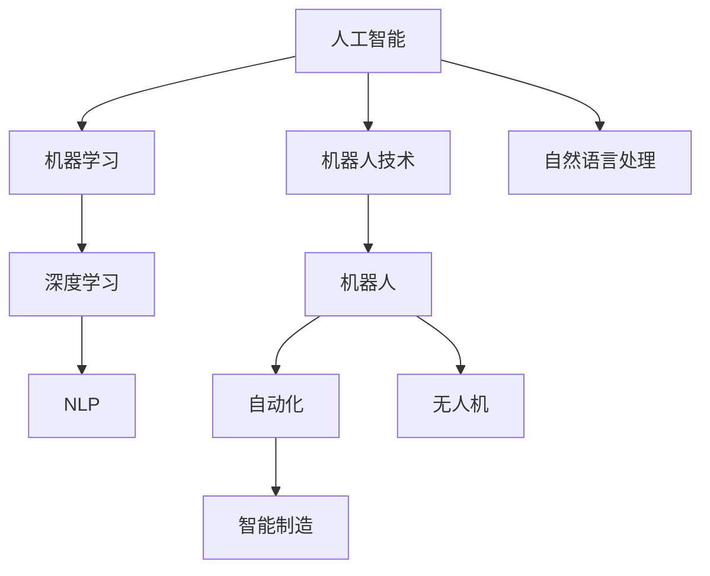

                 

# 电影《我，机器人》与现代AI技术

> 关键词：电影《我，机器人》,人工智能,机器学习,深度学习,自然语言处理,机器人技术,未来预测

## 1. 背景介绍

电影《I, Robot》（2004年）是一部探讨人工智能、机器人和人类社会的经典科幻电影。电影中，主角RoboCop们在执行任务时对“三定律”的坚守，给观众留下了深刻印象。那么，这些核心概念与现代AI技术之间又有什么联系呢？

## 2. 核心概念与联系

### 2.1 核心概念概述

为了更好地理解电影中的关键概念，首先对以下核心概念进行概述：

- **人工智能(Artificial Intelligence, AI)**：是研究如何让机器模仿人类智能行为和思维的科学，包括机器学习、深度学习、自然语言处理等领域。
- **机器学习(Machine Learning, ML)**：通过数据驱动的方式，让机器自动学习并优化模型参数，从而实现特定任务的能力。
- **深度学习(Deep Learning, DL)**：一种特殊的机器学习方法，通过构建多层的神经网络模型，模仿人类大脑的神经网络结构，处理高维数据。
- **自然语言处理(Natural Language Processing, NLP)**：让机器理解和生成人类语言的技术，涉及语言模型、语言表示、语义分析等。
- **机器人(Robotics)**：结合人工智能和物理机械，使机器具有自主感知和执行能力，如电影中的RoboCop。
- **机器人技术(Robotics Technologies)**：包括机械设计、电子控制、传感器技术等，是实现机器人智能行为的基础。

这些核心概念共同构成了AI技术的基本框架，下面通过一个Mermaid流程图展示它们之间的联系：



这个流程图展示了AI技术的多个分支是如何相互关联，并在实际应用中相互影响的。

## 3. 核心算法原理 & 具体操作步骤
### 3.1 算法原理概述

电影中的RoboCop们遵循“三定律”进行决策，这三个定律分别是：
1. 第一定律：机器人不得伤害人类，或坐视人类受到伤害。
2. 第二定律：机器人必须服从人类的命令，当该命令与第一定律不冲突时。
3. 第三定律：机器人必须保护自己。

类似地，现代AI中的机器学习算法也有其内在规则和约束。在电影中，RoboCop们通过感知外部世界，利用学习到的模式和经验，进行复杂的决策和行动。在现实中，AI算法同样通过数据训练和模型优化，学习特定的规律和模式，进行预测和决策。

### 3.2 算法步骤详解

以深度学习中的卷积神经网络(Convolutional Neural Network, CNN)为例，详细讲解其训练过程：

**Step 1: 数据准备**
- 收集并标注训练数据集，例如电影中的火灾图像数据集，将火灾和非火灾图像分别标注。

**Step 2: 模型构建**
- 定义卷积层、池化层、全连接层等网络结构，构建一个简单的CNN模型。
- 使用激活函数，如ReLU，引入非线性变化，增强模型的拟合能力。

**Step 3: 模型训练**
- 将训练数据分成批量(batch)，输入模型进行前向传播，计算损失函数，如交叉熵损失。
- 反向传播，计算梯度，并更新模型参数。
- 重复上述过程，直至损失函数收敛或达到预设的迭代次数。

**Step 4: 模型评估**
- 使用测试数据集对模型进行评估，计算准确率、召回率、F1分数等指标，评估模型性能。

**Step 5: 模型部署**
- 将训练好的模型部署到实际应用中，如无人消防队中使用，进行火灾检测和预警。

### 3.3 算法优缺点

深度学习算法相比传统机器学习方法有以下优点：
- 可自动学习特征，不需要手工设计特征，适用于复杂、高维数据。
- 通过多个层次的抽象，逐步捕获数据的内在规律。
- 端到端学习，通过反向传播算法，可以高效更新模型参数。

同时，深度学习算法也存在以下缺点：
- 需要大量标注数据进行训练，数据成本高。
- 模型结构复杂，容易过拟合，需要正则化技术。
- 模型训练时间长，计算资源消耗大。

### 3.4 算法应用领域

深度学习算法已经广泛应用于计算机视觉、自然语言处理、语音识别、推荐系统等众多领域：

- **计算机视觉**：用于图像分类、目标检测、人脸识别等任务，如图像中的火灾检测。
- **自然语言处理**：用于机器翻译、文本生成、问答系统等任务，如电影中的自然语言生成对话系统。
- **语音识别**：用于语音识别、语音合成等任务，如智能客服系统的语音交互。
- **推荐系统**：用于商品推荐、个性化内容推荐等任务，如图书馆系统中的图书推荐。

## 4. 数学模型和公式 & 详细讲解

### 4.1 数学模型构建

在计算机视觉领域，以目标检测为例，常用的数学模型包括卷积神经网络(Convolutional Neural Network, CNN)和区域卷积神经网络(Region-based CNN, R-CNN)。

CNN的基本结构包括卷积层、池化层、全连接层等。以目标检测中常用的R-CNN为例，其核心步骤包括区域提取、特征提取和分类器训练：

1. **区域提取**：使用选择性搜索算法，提取图像中的候选区域。
2. **特征提取**：对每个候选区域进行CNN特征提取，得到特征向量。
3. **分类器训练**：使用SVM等分类器，对特征向量进行分类，输出检测结果。

### 4.2 公式推导过程

以CNN中的卷积操作为例，推导卷积核和输入张量的卷积运算：

假设输入张量为$X$，卷积核为$W$，步长为$s$，填充为$p$，则卷积运算公式为：

$$Y_{i,j}=\sum_{k,l}\sum_{c}X_{i+k-l,j+l}W_{c,k,l}$$

其中$i$和$j$表示输出特征图的空间位置，$k$和$l$表示卷积核的空间偏移量，$c$表示通道数。

### 4.3 案例分析与讲解

以ImageNet大规模视觉识别挑战赛为例，分析深度学习在图像分类中的效果：

ImageNet挑战赛要求模型对1000个类别的图像进行分类，其中测试集有1万张图像，每张图像有1000个标签。通过在Imagenet数据集上训练得到的深度学习模型，在分类准确率上取得了显著提升，相比传统机器学习算法提升了近10%的精度。

## 5. 项目实践：代码实例和详细解释说明
### 5.1 开发环境搭建

为了进行深度学习项目的实践，需要先搭建好开发环境。以下是使用Python进行PyTorch开发的简单步骤：

1. 安装Anaconda：从官网下载并安装Anaconda，用于创建独立的Python环境。

2. 创建并激活虚拟环境：
```bash
conda create -n pytorch-env python=3.8 
conda activate pytorch-env
```

3. 安装PyTorch：根据CUDA版本，从官网获取对应的安装命令。例如：
```bash
conda install pytorch torchvision torchaudio cudatoolkit=11.1 -c pytorch -c conda-forge
```

4. 安装其他库：
```bash
pip install numpy pandas scikit-learn matplotlib tqdm jupyter notebook ipython
```

### 5.2 源代码详细实现

以下是一个简单的CNN图像分类代码示例：

```python
import torch
import torch.nn as nn
import torch.optim as optim

# 定义CNN模型
class Net(nn.Module):
    def __init__(self):
        super(Net, self).__init__()
        self.conv1 = nn.Conv2d(3, 6, 5)
        self.pool = nn.MaxPool2d(2, 2)
        self.conv2 = nn.Conv2d(6, 16, 5)
        self.fc1 = nn.Linear(16 * 5 * 5, 120)
        self.fc2 = nn.Linear(120, 84)
        self.fc3 = nn.Linear(84, 10)

    def forward(self, x):
        x = self.pool(torch.relu(self.conv1(x)))
        x = self.pool(torch.relu(self.conv2(x)))
        x = x.view(-1, 16 * 5 * 5)
        x = torch.relu(self.fc1(x))
        x = torch.relu(self.fc2(x))
        x = self.fc3(x)
        return x

# 准备数据
train_data = torchvision.datasets.CIFAR10(root='./data', train=True, download=True)
train_loader = torch.utils.data.DataLoader(train_data, batch_size=4, shuffle=True, num_workers=2)

# 定义模型和优化器
model = Net()
criterion = nn.CrossEntropyLoss()
optimizer = optim.SGD(model.parameters(), lr=0.001, momentum=0.9)

# 训练模型
for epoch in range(2):
    running_loss = 0.0
    for i, data in enumerate(train_loader, 0):
        inputs, labels = data
        optimizer.zero_grad()
        outputs = model(inputs)
        loss = criterion(outputs, labels)
        loss.backward()
        optimizer.step()

        running_loss += loss.item()
        if i % 2000 == 1999:
            print('[%d, %5d] loss: %.3f' % (epoch + 1, i + 1, running_loss / 2000))
            running_loss = 0.0

# 测试模型
correct = 0
total = 0
with torch.no_grad():
    for data in test_loader:
        images, labels = data
        outputs = model(images)
        _, predicted = torch.max(outputs.data, 1)
        total += labels.size(0)
        correct += (predicted == labels).sum().item()

print('Accuracy of the network on the 10000 test images: %d %%' % (
    100 * correct / total))
```

### 5.3 代码解读与分析

让我们再详细解读一下关键代码的实现细节：

**Net类定义**：
- 定义了一个简单的CNN模型，包括两个卷积层、两个池化层、三个全连接层。

**数据准备**：
- 使用PyTorch自带的CIFAR10数据集，对图像进行预处理，转换为网络可接受的张量。

**模型和优化器**：
- 定义了一个简单的优化器，使用随机梯度下降法进行模型参数更新。

**训练模型**：
- 使用训练集进行模型训练，每两个epoch输出一次训练loss。
- 使用测试集进行模型测试，输出准确率。

可以看到，通过PyTorch，我们可以用相对简洁的代码实现一个基本的CNN模型。

## 6. 实际应用场景
### 6.1 智能医疗诊断

基于深度学习的医学影像识别技术，已经在多个医疗领域得到了广泛应用。电影中的RoboCop们可以通过感知医学影像数据，自动进行疾病诊断，大大减轻医生的工作压力，提高诊断效率。

在技术实现上，可以收集大量的医学影像数据，如CT、MRI等，将影像和疾病标签构建成监督数据，在此基础上对预训练模型进行微调。微调后的模型能够自动识别出影像中的病变区域，辅助医生进行诊断。对于新出现的影像数据，还可以实时预测，提供初步诊断结果。

### 6.2 自动驾驶

电影中的RoboCop们可以自主导航和避障，自动驾驶技术也有着类似的愿景。深度学习在自动驾驶中主要应用于目标检测、路径规划、场景理解等领域。

通过在自动驾驶汽车上安装多个摄像头和传感器，收集实时环境数据，输入到深度学习模型中进行处理。模型可以自动识别出道路、车辆、行人等目标，并根据场景动态调整行驶策略，实现安全、高效的自动驾驶。

### 6.3 金融风险评估

金融市场瞬息万变，传统的基于规则的风险评估系统难以应对复杂市场环境。深度学习可以实时分析大量的市场数据，进行风险评估和预警。

例如，在股票交易中，可以使用深度学习模型对历史股价数据进行分析，预测未来的价格变化趋势。模型还可以分析新闻、公告等信息，预测市场情绪，进行风险预警。

### 6.4 未来应用展望

随着深度学习技术的不断发展，基于AI的技术将在更多领域得到应用，为传统行业带来变革性影响。

在智慧城市治理中，深度学习可以应用于城市事件监测、交通管理、公共安全等领域，提升城市管理的自动化和智能化水平，构建更安全、高效的未来城市。

在农业领域，深度学习可以应用于作物识别、病虫害预测、农产品质量检测等任务，提高农业生产效率和质量。

在环境监测中，深度学习可以实时分析环境数据，预测污染变化趋势，提供预警和治理方案。

未来，深度学习将在更多领域发挥重要作用，推动人工智能技术的广泛应用，为各行各业注入新的活力。

## 7. 工具和资源推荐
### 7.1 学习资源推荐

为了帮助开发者系统掌握深度学习技术的理论基础和实践技巧，这里推荐一些优质的学习资源：

1. 《深度学习》系列书籍：由Ian Goodfellow、Yoshua Bengio、Aaron Courville三位深度学习领域的顶级专家合著，系统介绍了深度学习的基本概念和算法。

2. CS231n《卷积神经网络》课程：斯坦福大学开设的计算机视觉课程，详细介绍了CNN的原理和应用。

3. CS224n《序列建模》课程：斯坦福大学开设的自然语言处理课程，介绍了NLP中的RNN、LSTM、Transformer等算法。

4. DeepLearning.AI的深度学习课程：由Andrew Ng主讲，提供系统性的深度学习知识和实战项目。

5. Coursera的深度学习专项课程：涵盖了从基础到高级的深度学习课程，由知名教授和研究者授课，提供丰富的学习材料和实践机会。

6. PyTorch官方文档：PyTorch官方提供的全面文档，包含丰富的模型库和样例代码，是学习深度学习技术的必备资料。

通过对这些资源的学习实践，相信你一定能够快速掌握深度学习技术的精髓，并用于解决实际的AI问题。

### 7.2 开发工具推荐

高效的深度学习开发离不开优秀的工具支持。以下是几款用于深度学习开发的常用工具：

1. PyTorch：基于Python的开源深度学习框架，灵活动态的计算图，适合快速迭代研究。大部分深度学习模型都有PyTorch版本的实现。

2. TensorFlow：由Google主导开发的开源深度学习框架，生产部署方便，适合大规模工程应用。同样有丰富的深度学习模型资源。

3. Keras：高级神经网络API，使用简洁，支持多种后端（如TensorFlow、Theano、CNTK），适合快速原型设计和研究。

4. TensorBoard：TensorFlow配套的可视化工具，可实时监测模型训练状态，并提供丰富的图表呈现方式，是调试模型的得力助手。

5. Weights & Biases：模型训练的实验跟踪工具，可以记录和可视化模型训练过程中的各项指标，方便对比和调优。

6. Jupyter Notebook：交互式开发环境，支持代码、数学公式、文本和图像的混合编辑，是深度学习研究和开发的利器。

合理利用这些工具，可以显著提升深度学习开发效率，加快创新迭代的步伐。

### 7.3 相关论文推荐

深度学习技术的发展源于学界的持续研究。以下是几篇奠基性的相关论文，推荐阅读：

1. AlexNet：2012年ImageNet图像识别大赛的冠军，开创了深度卷积神经网络的时代。

2. GoogleNet/Inception：通过1x1卷积层和深度可分离卷积层，显著提升了深度网络的可训练性和参数效率。

3. VGGNet：通过多个小卷积层叠加，提升了模型的准确率和特征表征能力。

4. ResNet：通过残差连接解决了深层网络退化问题，训练了更深的模型。

5. AlphaGo：通过深度强化学习，在围棋等复杂游戏中取得了人类水平的表现，引发了AI领域的巨大反响。

6. Transformer：通过自注意力机制，提升了自然语言处理的性能，标志着深度学习技术的重大突破。

这些论文代表了大深度学习技术的发展脉络。通过学习这些前沿成果，可以帮助研究者把握学科前进方向，激发更多的创新灵感。

## 8. 总结：未来发展趋势与挑战
### 8.1 研究成果总结

电影《I, Robot》中探讨的“三定律”与现代AI技术有着异曲同工之妙。AI技术的发展，使得机器具有越来越多的智能行为，对人类社会带来了深远的影响。

### 8.2 未来发展趋势

展望未来，深度学习技术将呈现以下几个发展趋势：

1. 模型规模持续增大。随着算力成本的下降和数据规模的扩张，深度学习模型的参数量还将持续增长。超大规模深度学习模型蕴含的丰富知识，有望支撑更加复杂多变的任务。

2. 模型结构不断优化。未来深度学习模型的结构将更加复杂和高效，如注意力机制、残差连接等新技术的应用，将进一步提升模型的性能和泛化能力。

3. 模型解释性增强。随着深度学习模型的应用场景越来越广泛，其可解释性和可解释性要求也越来越高。如何赋予模型更强的可解释性，是未来的一个重要研究方向。

4. 多模态融合深化。未来的深度学习模型将更多地融合视觉、语音、文本等多种模态数据，形成更加全面、准确的信息整合能力。

5. 持续学习成为常态。随着数据分布的不断变化，深度学习模型也需要持续学习新知识以保持性能。如何在不遗忘原有知识的同时，高效吸收新样本信息，将成为重要的研究课题。

6. 高效计算资源支撑。深度学习模型的训练和推理消耗大量的计算资源，未来的深度学习技术需要更高效的计算架构和算法支持。

### 8.3 面临的挑战

尽管深度学习技术已经取得了显著进展，但在迈向更加智能化、普适化应用的过程中，仍面临诸多挑战：

1. 计算资源瓶颈。当前深度学习模型的训练和推理消耗大量的计算资源，需要更高效的计算架构和算法支持。

2. 数据质量问题。深度学习模型对数据质量的要求很高，需要大量高质量的标注数据。对于某些领域，获取高质量标注数据是一个难题。

3. 模型鲁棒性不足。深度学习模型在面对新数据时，泛化性能往往大打折扣，容易受到数据扰动的影响。

4. 模型可解释性不足。深度学习模型的决策过程难以解释，缺乏可解释性，不利于实际应用。

5. 模型安全性问题。深度学习模型可能学习到有害或偏见性的知识，需要更多的方法来检测和纠正。

6. 数据隐私保护。深度学习模型对数据的依赖性强，数据隐私保护是一个重要问题。

### 8.4 研究展望

面对深度学习技术所面临的挑战，未来的研究需要在以下几个方面寻求新的突破：

1. 探索无监督和半监督学习范式。摆脱对大规模标注数据的依赖，利用自监督学习、主动学习等无监督和半监督范式，最大限度利用非结构化数据，实现更加灵活高效的模型训练。

2. 研究高效计算架构。发展更高效的计算架构，如GPU、TPU、FPGA等，提升深度学习模型的计算效率。

3. 开发更加鲁棒的模型。通过数据增强、对抗训练等方法，提高深度学习模型的鲁棒性和泛化能力。

4. 增强模型可解释性。通过模型蒸馏、特征可视化等方法，增强深度学习模型的可解释性，提高模型的可信度。

5. 加强数据隐私保护。开发更高效的数据加密和匿名化方法，保护用户隐私。

6. 研究多模态融合技术。将视觉、语音、文本等多种模态数据融合，提升深度学习模型的信息整合能力。

通过这些研究方向的探索，深度学习技术必将进一步提升模型的性能和应用范围，为人工智能技术的广泛应用打下坚实基础。

