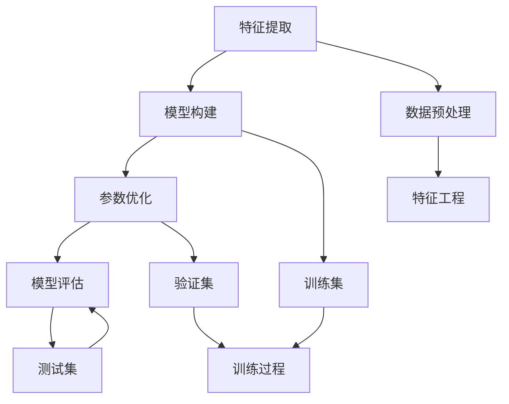

                 

# 监督学习原理与代码实例讲解

> 关键词：监督学习, 机器学习, 数学模型, 代码实现, 预测精度, 特征选择, 模型评估, 过拟合, 欠拟合

## 1. 背景介绍

监督学习（Supervised Learning）是机器学习领域的重要分支，其目标是利用已标注的数据，构建能够对未知数据进行准确预测的模型。相比于无监督学习和强化学习，监督学习更贴近于现实应用，广泛用于分类、回归、聚类等任务。本文将深入探讨监督学习的原理，并通过代码实例详细讲解其实现过程，帮助读者深入理解这一关键技术。

## 2. 核心概念与联系

### 2.1 核心概念概述

在监督学习中，我们通常将样本数据分为两个部分：训练集和测试集。训练集用于模型训练，测试集用于模型评估，以确保模型能够泛化到未见过的数据上。模型的训练过程通常包括特征提取、模型构建、参数优化和模型评估四个阶段。

- **特征提取**：将原始数据转换为可供模型使用的数值型特征，这是监督学习中数据预处理的核心步骤。
- **模型构建**：根据任务类型选择合适的模型，如线性回归、决策树、支持向量机（SVM）、深度学习等。
- **参数优化**：通过梯度下降等优化算法，调整模型参数以最小化预测误差。
- **模型评估**：使用测试集对训练好的模型进行评估，常见的评估指标包括准确率、召回率、F1-score、AUC等。

这些核心概念通过以下Mermaid流程图展现出来：



### 2.2 核心概念原理和架构

监督学习的核心原理基于统计学习理论。通过最大化模型在训练集上的似然函数，最小化预测误差，使得模型能够在未知数据上实现泛化。具体的数学模型构建和优化算法将会在下文中详细介绍。

## 3. 核心算法原理 & 具体操作步骤

### 3.1 算法原理概述

监督学习中最常用的算法包括线性回归、逻辑回归、决策树、支持向量机和神经网络等。本文将以逻辑回归和支持向量机为例，分别介绍它们的基本原理和实现步骤。

**逻辑回归（Logistic Regression）**：
逻辑回归是一种广泛应用于二分类问题的线性模型。其目标是最小化实际标签与预测标签之间的交叉熵损失，从而得到最优参数。

**支持向量机（Support Vector Machine, SVM）**：
支持向量机是一种基于间隔最大化的线性分类模型。其目标是在高维特征空间中找到一个最优超平面，使得不同类别的样本在该超平面上被有效分隔，从而实现高精度的分类。

### 3.2 算法步骤详解

#### 3.2.1 逻辑回归步骤详解

1. **数据准备**：
   - 收集训练集和测试集。
   - 将数据分为特征和标签两部分。

2. **模型构建**：
   - 定义逻辑回归模型：$$y = \sigma(\mathbf{w} \cdot \mathbf{x} + b)$$
   - 其中，$\mathbf{w}$ 为模型权重，$b$ 为偏置，$\sigma$ 为逻辑函数。

3. **损失函数**：
   - 定义交叉熵损失函数：$$L = -\frac{1}{m} \sum_{i=1}^m (y_i \log(\sigma(\mathbf{w} \cdot \mathbf{x}_i + b)) + (1-y_i) \log(1-\sigma(\mathbf{w} \cdot \mathbf{x}_i + b))$$
   - $m$ 为训练集大小，$y_i$ 为标签，$\sigma$ 为逻辑函数。

4. **参数优化**：
   - 使用梯度下降算法最小化损失函数：$$\mathbf{w}^{(t+1)} = \mathbf{w}^{(t)} - \eta \frac{\partial L}{\partial \mathbf{w}}$$
   - $\eta$ 为学习率。

5. **模型评估**：
   - 使用测试集评估模型性能，常见评估指标包括准确率、召回率、F1-score等。

#### 3.2.2 支持向量机步骤详解

1. **数据准备**：
   - 收集训练集和测试集。
   - 将数据分为特征和标签两部分。

2. **模型构建**：
   - 定义支持向量机模型，包括核函数和超参数。

3. **损失函数**：
   - 定义合页损失函数：$$L = \frac{1}{m} \sum_{i=1}^m [\max(0, 1-y_i \cdot \mathbf{w} \cdot \mathbf{x}_i - b) + \frac{\lambda}{2} \|\mathbf{w}\|^2]$$
   - $m$ 为训练集大小，$y_i$ 为标签，$\mathbf{w}$ 为模型权重，$b$ 为偏置，$\lambda$ 为正则化参数。

4. **参数优化**：
   - 使用梯度下降算法最小化损失函数：$$\mathbf{w}^{(t+1)} = \mathbf{w}^{(t)} - \eta \frac{\partial L}{\partial \mathbf{w}}$$
   - $\eta$ 为学习率。

5. **模型评估**：
   - 使用测试集评估模型性能，常见评估指标包括准确率、召回率、F1-score等。

### 3.3 算法优缺点

**逻辑回归的优点**：
- 模型简单，易于实现。
- 适用于多分类问题，可以通过softmax函数进行拓展。
- 易于解释，适合于特征工程较简单的问题。

**逻辑回归的缺点**：
- 对异常值敏感。
- 当特征非线性时，线性模型可能无法捕捉到复杂模式。

**支持向量机的优点**：
- 在高维空间中表现良好。
- 对噪声和异常值具有较好的鲁棒性。
- 可以进行非线性分类。

**支持向量机的缺点**：
- 计算复杂度较高，对大规模数据集处理困难。
- 对参数调优敏感。
- 对噪声数据敏感，可能出现过拟合现象。

### 3.4 算法应用领域

监督学习广泛应用于图像分类、文本分类、推荐系统、金融预测等诸多领域。以下是几个典型的应用场景：

- **图像分类**：通过训练深度学习模型，如卷积神经网络（CNN），将图像分类为多个类别。
- **文本分类**：使用自然语言处理技术，将文本分为不同主题或情感类别。
- **推荐系统**：根据用户行为数据，预测用户对商品的兴趣。
- **金融预测**：使用时间序列数据，预测股票价格、汇率等金融指标。

## 4. 数学模型和公式 & 详细讲解 & 举例说明

### 4.1 数学模型构建

**逻辑回归**：
$$\hat{y} = \sigma(\mathbf{w} \cdot \mathbf{x} + b)$$
$$L = -\frac{1}{m} \sum_{i=1}^m (y_i \log(\sigma(\mathbf{w} \cdot \mathbf{x}_i + b)) + (1-y_i) \log(1-\sigma(\mathbf{w} \cdot \mathbf{x}_i + b))$$

**支持向量机**：
$$y = \max(0, 1-y \cdot \mathbf{w} \cdot \mathbf{x} - b)$$
$$L = \frac{1}{m} \sum_{i=1}^m [\max(0, 1-y_i \cdot \mathbf{w} \cdot \mathbf{x}_i - b) + \frac{\lambda}{2} \|\mathbf{w}\|^2]$$

### 4.2 公式推导过程

**逻辑回归的推导**：
- 假设样本 $x$ 的标签为 $y$，模型预测结果为 $\hat{y}$。
- 定义损失函数为交叉熵损失：$$L = -\frac{1}{m} \sum_{i=1}^m (y_i \log(\hat{y}_i) + (1-y_i) \log(1-\hat{y}_i))$$
- 通过对损失函数求导，得到梯度下降的更新公式：$$\frac{\partial L}{\partial \mathbf{w}} = -\frac{1}{m} \sum_{i=1}^m (\hat{y}_i - y_i) x_i$$

**支持向量机的推导**：
- 假设样本 $x$ 的标签为 $y$，模型预测结果为 $\hat{y}$。
- 定义损失函数为合页损失函数：$$L = \frac{1}{m} \sum_{i=1}^m [\max(0, 1-y_i \cdot \mathbf{w} \cdot \mathbf{x}_i - b) + \frac{\lambda}{2} \|\mathbf{w}\|^2]$$
- 通过对损失函数求导，得到梯度下降的更新公式：$$\frac{\partial L}{\partial \mathbf{w}} = -\frac{1}{m} \sum_{i=1}^m (y_i - \hat{y}_i) x_i$$

### 4.3 案例分析与讲解

假设有一个二分类问题，训练集大小为 $m=1000$，特征维度为 $n=10$，使用逻辑回归进行建模。

1. **数据准备**：
   - 收集训练集和测试集。
   - 将数据分为特征和标签两部分。

2. **模型构建**：
   - 定义逻辑回归模型：$$y = \sigma(\mathbf{w} \cdot \mathbf{x} + b)$$

3. **损失函数**：
   - 定义交叉熵损失函数：$$L = -\frac{1}{1000} \sum_{i=1}^{1000} (y_i \log(\sigma(\mathbf{w} \cdot \mathbf{x}_i + b)) + (1-y_i) \log(1-\sigma(\mathbf{w} \cdot \mathbf{x}_i + b))$$

4. **参数优化**：
   - 使用梯度下降算法最小化损失函数：$$\mathbf{w}^{(t+1)} = \mathbf{w}^{(t)} - \eta \frac{\partial L}{\partial \mathbf{w}}$$
   - $\eta$ 为学习率。

5. **模型评估**：
   - 使用测试集评估模型性能，常见评估指标包括准确率、召回率、F1-score等。

## 5. 项目实践：代码实例和详细解释说明

### 5.1 开发环境搭建

在进行监督学习模型的开发时，我们需要准备好开发环境。以下是使用Python进行Scikit-learn开发的环境配置流程：

1. 安装Anaconda：从官网下载并安装Anaconda，用于创建独立的Python环境。

2. 创建并激活虚拟环境：
```bash
conda create -n sklearn-env python=3.8 
conda activate sklearn-env
```

3. 安装Scikit-learn：
```bash
conda install scikit-learn
```

4. 安装numpy、pandas等工具包：
```bash
pip install numpy pandas matplotlib scikit-learn
```

5. 安装相关依赖库：
```bash
pip install seaborn statsmodels
```

完成上述步骤后，即可在`sklearn-env`环境中开始监督学习模型的开发。

### 5.2 源代码详细实现

这里我们以逻辑回归模型为例，给出使用Scikit-learn进行训练的Python代码实现。

```python
from sklearn.linear_model import LogisticRegression
from sklearn.metrics import accuracy_score
from sklearn.model_selection import train_test_split
from sklearn.datasets import load_iris

# 加载数据集
iris = load_iris()
X = iris.data
y = iris.target

# 划分训练集和测试集
X_train, X_test, y_train, y_test = train_test_split(X, y, test_size=0.2, random_state=42)

# 实例化逻辑回归模型
model = LogisticRegression(max_iter=1000)

# 训练模型
model.fit(X_train, y_train)

# 预测测试集
y_pred = model.predict(X_test)

# 评估模型性能
accuracy = accuracy_score(y_test, y_pred)
print("Accuracy: {:.2f}%".format(accuracy * 100))
```

### 5.3 代码解读与分析

这段代码实现了逻辑回归模型的训练和评估过程，主要步骤如下：

1. **数据准备**：
   - 加载数据集：使用Scikit-learn自带的鸢尾花数据集。
   - 划分训练集和测试集：使用train_test_split函数划分数据集，测试集占总数据的20%。

2. **模型构建**：
   - 实例化逻辑回归模型：使用LogisticRegression类，设置最大迭代次数为1000。

3. **训练模型**：
   - 使用fit函数训练模型，传入训练集数据。

4. **预测测试集**：
   - 使用predict函数对测试集进行预测。

5. **评估模型性能**：
   - 使用accuracy_score函数计算模型在测试集上的准确率。

## 6. 实际应用场景

### 6.1 医疗诊断

监督学习在医疗诊断领域有广泛应用，通过分析患者的病历数据、基因数据等，构建预测模型，辅助医生进行疾病诊断和治疗方案推荐。例如，使用逻辑回归模型对患者的症状和病史进行分类，预测其是否患有某种疾病。

### 6.2 金融预测

在金融领域，监督学习被用于预测股票价格、汇率、信用评分等。例如，使用支持向量机模型对历史交易数据进行分析，预测股票在未来一段时间内的涨跌情况。

### 6.3 推荐系统

推荐系统是电子商务和内容平台的核心功能之一，通过分析用户的历史行为数据，预测用户对商品的兴趣，推荐可能感兴趣的商品或内容。使用监督学习算法（如线性回归、逻辑回归）对用户行为数据进行建模，生成推荐结果。

## 7. 工具和资源推荐

### 7.1 学习资源推荐

为了帮助开发者系统掌握监督学习的理论基础和实践技巧，这里推荐一些优质的学习资源：

1. 《机器学习实战》系列博文：由机器学习领域专家撰写，深入浅出地介绍了监督学习的基本概念和经典模型。

2. Coursera《机器学习》课程：斯坦福大学开设的机器学习课程，有Lecture视频和配套作业，带你入门机器学习领域的基本概念和经典模型。

3. 《Python数据科学手册》书籍：全面介绍了使用Python进行数据科学应用的工具和算法，包括监督学习在内的诸多主题。

4. Scikit-learn官方文档：Scikit-learn库的官方文档，提供了丰富的模型和算法，是学习监督学习的重要资源。

5. Kaggle机器学习竞赛：Kaggle提供了大量的机器学习竞赛和数据集，是练习和提升机器学习技能的好地方。

通过对这些资源的学习实践，相信你一定能够快速掌握监督学习的精髓，并用于解决实际的机器学习问题。

### 7.2 开发工具推荐

高效的开发离不开优秀的工具支持。以下是几款用于监督学习开发的常用工具：

1. Python：作为机器学习领域的主流编程语言，Python拥有丰富的库和框架，易于学习和使用。

2. Scikit-learn：由SciPy团队开发的机器学习库，提供了丰富的模型和算法，易于使用和集成。

3. TensorFlow和PyTorch：这两个深度学习框架支持监督学习模型的开发，拥有强大的计算能力和灵活的编程接口。

4. Jupyter Notebook：免费的在线编程环境，支持代码编写、数据可视化、版本控制等，是数据科学家的必备工具。

5. Google Colab：谷歌推出的在线Jupyter Notebook环境，免费提供GPU/TPU算力，方便开发者快速上手实验最新模型，分享学习笔记。

合理利用这些工具，可以显著提升监督学习任务的开发效率，加快创新迭代的步伐。

### 7.3 相关论文推荐

监督学习的发展得益于学界的持续研究。以下是几篇奠基性的相关论文，推荐阅读：

1. Logistic Regression（逻辑回归）：提出逻辑回归模型，用于二分类问题。
2. Support Vector Machines（支持向量机）：提出支持向量机模型，用于分类和回归问题。
3. Decision Trees and Random Forests（决策树和随机森林）：提出决策树和随机森林模型，用于分类和回归问题。
4. AdaBoost（Adaptive Boosting）：提出AdaBoost算法，用于提高分类器的准确率。
5. Gradient Boosting Machines（梯度提升机）：提出梯度提升算法，用于提升回归模型的精度。

这些论文代表了大模型微调技术的发展脉络。通过学习这些前沿成果，可以帮助研究者把握学科前进方向，激发更多的创新灵感。

## 8. 总结：未来发展趋势与挑战

### 8.1 总结

本文对监督学习的原理和代码实例进行了全面系统的介绍。首先阐述了监督学习的核心概念和应用场景，明确了其在机器学习中的重要地位。其次，从原理到实践，详细讲解了逻辑回归和支持向量机的实现过程，通过代码实例帮助读者深入理解这些算法。最后，本文还广泛探讨了监督学习在医疗、金融、推荐系统等众多领域的应用前景，展示了其在实际应用中的巨大潜力。

通过本文的系统梳理，可以看到，监督学习在机器学习领域具有广泛的应用和深远的影响。随着算力的提升和数据的丰富，监督学习将继续发挥重要作用，推动机器学习技术在更多领域的落地应用。

### 8.2 未来发展趋势

展望未来，监督学习技术将呈现以下几个发展趋势：

1. 模型复杂度增加。随着深度学习技术的进步，监督学习模型的复杂度将不断提升，能够处理更复杂的数据结构和问题。

2. 自动化调参。自动化调参技术的发展，使得监督学习模型的超参数调整更加高效，提升模型训练的精度和速度。

3. 数据增强技术应用。数据增强技术可以生成更多的训练样本，提升监督学习模型的泛化能力。

4. 模型解释性增强。随着数据规模和模型复杂度的增加，模型的解释性变得更加重要。未来，将涌现更多的模型解释工具和方法，帮助用户理解模型的决策过程。

5. 跨模态学习发展。监督学习模型将越来越多地应用于跨模态数据，如图像、文本、语音等多种类型的数据融合分析。

这些趋势预示着监督学习技术的持续演进和升级，为更多领域带来新的突破和发展机会。

### 8.3 面临的挑战

尽管监督学习技术已经取得了显著进展，但在迈向更加智能化、普适化应用的过程中，它仍面临着诸多挑战：

1. 数据质量和多样性问题。高质量、多样化的数据是监督学习模型训练的基础，但在实际应用中，往往难以获得足够的数据。如何高效地利用现有数据，提升模型泛化能力，仍然是一个重要问题。

2. 模型过拟合问题。监督学习模型在训练集上的表现往往优于测试集，导致过拟合现象。如何通过正则化、dropout等方法避免过拟合，仍需进一步研究。

3. 模型可解释性问题。监督学习模型通常是"黑盒"系统，难以解释其内部工作机制和决策逻辑。如何提高模型的可解释性，增强用户信任，仍然是一个亟待解决的问题。

4. 模型鲁棒性问题。监督学习模型在面对异常值、噪声数据时，可能出现鲁棒性不足的问题。如何提升模型的鲁棒性，增强其在复杂环境下的适应能力，是一个重要研究方向。

5. 计算资源问题。监督学习模型通常需要大量的计算资源进行训练和推理，如何优化模型结构和算法，提升计算效率，是一个重要问题。

这些挑战需要学界和产业界的共同努力，才能进一步推动监督学习技术的成熟和发展。

### 8.4 研究展望

面对监督学习所面临的挑战，未来的研究需要在以下几个方面寻求新的突破：

1. 探索无监督和半监督学习范式。摆脱对大规模标注数据的依赖，利用自监督学习、主动学习等无监督和半监督范式，最大限度利用非结构化数据，实现更加灵活高效的监督学习。

2. 研究参数高效和计算高效的监督学习范式。开发更加参数高效的监督学习算法，在固定大部分模型参数的情况下，只调整极少量的超参数。同时优化监督学习模型的计算图，减少前向传播和反向传播的资源消耗，实现更加轻量级、实时性的部署。

3. 融合因果和对比学习范式。通过引入因果推断和对比学习思想，增强监督学习模型建立稳定因果关系的能力，学习更加普适、鲁棒的语言表征，从而提升模型泛化性和抗干扰能力。

4. 引入更多先验知识。将符号化的先验知识，如知识图谱、逻辑规则等，与神经网络模型进行巧妙融合，引导监督学习过程学习更准确、合理的语言模型。同时加强不同模态数据的整合，实现视觉、语音等多模态信息与文本信息的协同建模。

5. 结合因果分析和博弈论工具。将因果分析方法引入监督学习模型，识别出模型决策的关键特征，增强输出解释的因果性和逻辑性。借助博弈论工具刻画人机交互过程，主动探索并规避模型的脆弱点，提高系统稳定性。

这些研究方向将引领监督学习技术迈向更高的台阶，为构建安全、可靠、可解释、可控的智能系统铺平道路。面向未来，监督学习技术还需要与其他人工智能技术进行更深入的融合，如知识表示、因果推理、强化学习等，多路径协同发力，共同推动自然语言理解和智能交互系统的进步。只有勇于创新、敢于突破，才能不断拓展监督学习模型的边界，让智能技术更好地造福人类社会。

## 9. 附录：常见问题与解答

**Q1：监督学习是否适用于所有数据集？**

A: 监督学习适用于标注数据集，但不同类型的数据集可能需要不同的处理方式。例如，文本数据和图像数据需要不同的特征工程和模型构建方法。

**Q2：如何选择监督学习算法？**

A: 选择监督学习算法时应考虑数据类型、任务类型、模型复杂度等因素。例如，对于线性关系明显的问题，可以选择线性回归；对于复杂关系的问题，可以选择决策树、支持向量机等算法。

**Q3：如何避免监督学习模型的过拟合问题？**

A: 避免过拟合的常见方法包括正则化、dropout、early stopping等。此外，数据增强、模型集成等方法也可以有效缓解过拟合现象。

**Q4：监督学习模型在实际应用中需要注意哪些问题？**

A: 实际应用中，监督学习模型需要注意数据质量、模型解释性、鲁棒性等问题。此外，模型部署和维护也需要考虑计算资源和系统稳定性。

**Q5：监督学习与无监督学习有何区别？**

A: 监督学习需要标注数据，模型训练的目标是学习输入数据与输出数据之间的映射关系；而无监督学习不需要标注数据，模型训练的目标是发现数据的内在结构和规律。

---

作者：禅与计算机程序设计艺术 / Zen and the Art of Computer Programming

