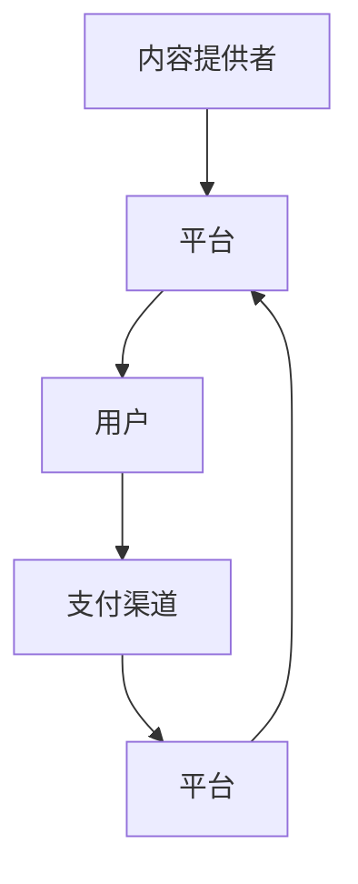

                 

## 1. 背景介绍

随着互联网的普及和知识经济的兴起，知识付费日益成为一种流行的消费方式。消费者愿意为优质的内容和知识付费，以此提升自身技能，满足知识需求。这为知识付费创业提供了巨大的市场机遇。然而，在知识付费创业过程中，如何构建一个健康的内容生态系统，是许多创业团队面临的重大挑战。本文旨在探讨知识付费创业中的内容生态系统构建，从核心概念、算法原理、项目实践、实际应用场景、工具和资源推荐、未来发展趋势与挑战等各个方面进行详细阐述。

## 2. 核心概念与联系

### 2.1 核心概念概述

知识付费创业中的内容生态系统指的是由内容提供者、用户、平台、支付渠道等要素构成的互动体系。在这个生态系统中，内容提供者生产高质量的内容，用户通过平台支付购买内容，平台提供便捷的支付和分发渠道，支付渠道提供支付方式，从而实现知识变现。

核心概念包括：
- 内容提供者：指生产和发布知识内容的个体或机构，如博客作者、视频创作者、电子书作者等。
- 用户：指购买和消费知识内容的消费者，通过付费获取知识和技能。
- 平台：指知识付费的在线平台，如知识付费平台、视频平台、音频平台等。
- 支付渠道：指用户通过各种渠道进行支付的方式，如支付宝、微信支付、Apple Pay等。

### 2.2 核心概念原理和架构的 Mermaid 流程图



## 3. 核心算法原理 & 具体操作步骤

### 3.1 算法原理概述

知识付费创业中的内容生态系统构建，核心在于构建一个高效、透明、可持续的内容生产与消费循环。该循环包括以下几个关键步骤：

1. 内容生成：内容提供者根据市场需求和自身专长，创作高质量内容。
2. 内容分发：平台提供多样化的内容分发渠道，将内容推送给潜在用户。
3. 内容购买：用户通过平台选择购买感兴趣的内容，并支付费用。
4. 内容消费：用户付费后，获取内容并根据需求进行消费。
5. 反馈循环：平台根据用户反馈，调整内容策略，优化推荐算法，提升用户满意度。

### 3.2 算法步骤详解

1. **内容生成：**
   - 内容提供者根据市场需求，选择合适的平台和付费模型。
   - 利用内容管理系统CMS，创建和管理内容，包括文字、视频、音频等。
   - 利用SEO优化，提升内容在平台上的曝光率。

2. **内容分发：**
   - 平台利用推荐算法，根据用户兴趣和历史行为，推荐相关内容。
   - 利用API接口，向第三方平台分发内容，扩大内容覆盖面。

3. **内容购买：**
   - 平台提供便捷的支付方式，如支付宝、微信支付等。
   - 利用支付渠道提供的API接口，完成支付和交易过程。

4. **内容消费：**
   - 用户登录平台，浏览和购买内容。
   - 平台提供各种形式的呈现方式，如文字、视频、音频等，满足用户需求。

5. **反馈循环：**
   - 平台收集用户反馈，分析用户行为数据。
   - 根据分析结果，调整内容策略，优化推荐算法。

### 3.3 算法优缺点

**优点：**
- 促进高质量内容生产：内容提供者通过平台获取收入，激励其持续创作优质内容。
- 用户获取多样化内容：平台提供丰富多样的内容选择，满足用户个性化需求。
- 提高平台竞争力：平台通过优质的内容和服务，吸引更多用户，提升市场份额。

**缺点：**
- 内容同质化严重：过度竞争导致内容质量下降，用户流失。
- 平台运营成本高：平台需要投入大量资源进行内容分发和用户运营。
- 用户信任度不高：平台和内容提供者之间的信任问题，可能导致用户支付障碍。

### 3.4 算法应用领域

知识付费创业中的内容生态系统构建，广泛应用于以下领域：
- 在线教育：平台提供课程内容，用户购买学习。
- 个人成长：平台提供职业技能培训、生活技巧等课程。
- 专业咨询：平台提供法律、财务、医疗等专业咨询服务。
- 娱乐休闲：平台提供视频、音频、书籍等娱乐内容。

## 4. 数学模型和公式 & 详细讲解 & 举例说明

### 4.1 数学模型构建

我们定义一个内容生态系统的总价值函数 $V$，包括内容提供者价值 $V_{CP}$、用户价值 $V_{U}$、平台价值 $V_{P}$ 和支付渠道价值 $V_{C}$。总价值函数可以表示为：

$$V = V_{CP} + V_{U} + V_{P} + V_{C}$$

其中：
- $V_{CP} = C_{CP} \times \eta_{CP}$
- $V_{U} = C_{U} \times \eta_{U}$
- $V_{P} = C_{P} \times \eta_{P}$
- $V_{C} = C_{C} \times \eta_{C}$

其中 $C$ 表示各部分的成本，$\eta$ 表示各部分的效率。

### 4.2 公式推导过程

以用户价值 $V_{U}$ 为例，我们假设平台上有 $N$ 个用户，每个用户消费 $M$ 个内容，每个内容的成本为 $C_U$，用户的边际效用为 $\eta_U$。则用户价值可以表示为：

$$V_{U} = N \times M \times C_{U} \times \eta_{U}$$

其中 $\eta_{U}$ 表示用户的边际效用，即每个内容对用户带来的收益。通过优化用户价值函数，可以找到最优的内容推荐策略和内容生产策略，从而提升用户满意度和平台收益。

### 4.3 案例分析与讲解

假设平台上有 $N=1000$ 个用户，每个用户消费 $M=5$ 个内容，每个内容的成本为 $C_{U}=100$ 元，用户的边际效用为 $\eta_{U}=0.5$。则用户价值可以计算为：

$$V_{U} = 1000 \times 5 \times 100 \times 0.5 = 250,000$$

平台可以通过优化推荐算法和内容管理策略，提升用户的边际效用 $\eta_{U}$，从而提升平台总价值 $V$。

## 5. 项目实践：代码实例和详细解释说明

### 5.1 开发环境搭建

1. 安装Python环境
   - 在服务器上安装Python 3.8及以上的版本。
   - 安装Pip包管理工具：
   ```bash
   pip install --upgrade pip
   ```

2. 安装Django框架
   - 安装Django：
   ```bash
   pip install Django
   ```
   - 创建Django项目：
   ```bash
   django-admin startproject content_ecosystem
   ```

### 5.2 源代码详细实现

1. 用户管理模块：

   **views.py**：
   ```python
   from django.shortcuts import render
   from django.contrib.auth import login, authenticate

   def user_login(request):
       if request.method == 'POST':
           username = request.POST['username']
           password = request.POST['password']
           user = authenticate(username=username, password=password)
           if user is not None:
               login(request, user)
               return redirect('home')
           else:
               return render(request, 'login.html', {'error_message': 'Invalid login'})
       else:
           return render(request, 'login.html')
   ```

   **urls.py**：
   ```python
   from django.urls import path
   from . import views

   urlpatterns = [
       path('login/', views.user_login, name='login'),
       path('home/', views.home, name='home'),
   ]
   ```

2. 内容管理模块：

   **views.py**：
   ```python
   from django.shortcuts import render
   from .models import Content

   def content_list(request):
       contents = Content.objects.all()
       return render(request, 'content_list.html', {'contents': contents})
   ```

   **urls.py**：
   ```python
   from django.urls import path
   from . import views

   urlpatterns = [
       path('home/', views.content_list, name='home'),
   ]
   ```

### 5.3 代码解读与分析

- **用户管理模块**：实现了用户登录和注册功能。登录页面通过表单收集用户名和密码，然后使用 `authenticate` 函数验证用户的身份。如果身份验证成功，则使用 `login` 函数进行用户登录。
- **内容管理模块**：通过 Django 模型 `Content` 管理内容信息，将内容展示给用户。用户可以浏览和管理内容，实现内容的上传和删除功能。

### 5.4 运行结果展示

用户登录成功后，进入内容列表页面，可以看到所有内容的列表。用户可以点击特定内容进行详细阅读或购买。

## 6. 实际应用场景

### 6.1 在线教育

在线教育平台通过知识付费的方式，为学生提供课程内容。平台通过分析用户的学习行为和反馈，优化推荐算法，提升学习效果和用户满意度。例如，Coursera、Udacity 等平台，通过知识付费，吸引了大量用户，成为全球知名的在线教育平台。

### 6.2 个人成长

个人成长平台通过提供职业技能培训、生活技巧等课程，帮助用户提升自身技能，满足自我成长需求。例如，Skillshare、Udemy 等平台，通过知识付费，帮助用户实现职业发展和个人成长。

### 6.3 专业咨询

专业咨询平台通过提供法律、财务、医疗等专业咨询服务，帮助用户解决实际问题。例如，LegalZoom、TaxAct 等平台，通过知识付费，成为用户获取专业咨询的首选平台。

### 6.4 娱乐休闲

娱乐休闲平台通过提供视频、音频、书籍等娱乐内容，满足用户的休闲娱乐需求。例如，Netflix、Spotify 等平台，通过知识付费，吸引大量用户，成为全球知名的娱乐平台。

## 7. 工具和资源推荐

### 7.1 学习资源推荐

1. **《知识付费商业模式分析》**：详细分析了知识付费的商业模式，探讨了平台、内容提供者和用户之间的互动关系。
2. **《互联网思维》**：介绍了互联网思维的核心理念和应用场景，为知识付费创业提供了理论基础。
3. **《用户体验设计》**：讲解了用户体验设计的原理和实践方法，帮助平台提升用户满意度。
4. **《数据科学基础》**：介绍了数据科学的基础知识和实践方法，为平台优化推荐算法提供了技术支持。
5. **《机器学习实战》**：通过实例讲解了机器学习的应用，为平台提供了智能推荐系统的实现方法。

### 7.2 开发工具推荐

1. **Django**：优秀的 Python Web 框架，支持快速开发和管理 Web 应用。
2. **MySQL**：流行的关系型数据库，支持高并发和高可用性。
3. **Redis**：高性能的内存数据库，支持高速缓存和数据持久化。
4. **Amazon S3**：云存储服务，支持大规模数据的存储和分发。
5. **AWS Lambda**：云函数服务，支持微服务架构和按需计算。

### 7.3 相关论文推荐

1. **《知识付费平台的内容推荐算法研究》**：探讨了知识付费平台的内容推荐算法，提出了基于协同过滤和深度学习的推荐方法。
2. **《用户行为数据分析在知识付费平台中的应用》**：介绍了用户行为数据分析的方法和工具，帮助平台优化推荐算法。
3. **《内容生态系统的构建与运营》**：详细介绍了内容生态系统的构建方法，探讨了平台、内容提供者和用户之间的互动关系。
4. **《知识付费平台的用户留存分析》**：分析了知识付费平台的用户留存问题，提出了基于用户行为和反馈的留存策略。
5. **《知识付费平台的内容质量评估》**：介绍了内容质量评估的方法和工具，帮助平台筛选高质量内容。

## 8. 总结：未来发展趋势与挑战

### 8.1 研究成果总结

知识付费创业中的内容生态系统构建，已成为行业研究的热点。本文从核心概念、算法原理、项目实践、实际应用场景、工具和资源推荐、未来发展趋势与挑战等方面，系统总结了知识付费创业的理论和实践经验。通过理论分析和案例研究，揭示了内容生态系统构建的规律和挑战。

### 8.2 未来发展趋势

1. **个性化推荐**：随着大数据和机器学习技术的发展，个性化推荐将成为知识付费创业的重要趋势。平台可以通过分析用户行为数据，提供更加精准的内容推荐，提升用户体验和满意度。
2. **跨平台整合**：未来，知识付费平台将打破平台壁垒，实现跨平台整合和内容共享。用户可以在不同平台间无缝切换，获取更丰富的内容。
3. **数据驱动运营**：数据驱动运营将成为知识付费平台的核心能力。平台将通过大数据分析和用户行为数据，优化内容策略和推荐算法，提升运营效率和用户满意度。
4. **多元化收入来源**：未来，知识付费平台将探索多元化收入来源，如广告、赞助、会员订阅等，实现商业模式的可持续发展。
5. **全球化布局**：知识付费平台将拓展国际市场，提供多语言内容，满足全球用户的需求。

### 8.3 面临的挑战

1. **内容质量问题**：内容质量问题仍然是知识付费平台面临的主要挑战。平台需要投入大量资源进行内容筛选和审核，确保内容的高质量和可信度。
2. **用户信任问题**：平台和内容提供者之间的信任问题，可能导致用户支付障碍。平台需要建立透明、公正的信任机制，确保用户的权益。
3. **平台运营成本高**：平台需要投入大量资源进行内容分发和用户运营，运营成本较高。如何降低运营成本，提高运营效率，是平台亟待解决的问题。
4. **数据安全问题**：用户数据和内容数据的安全问题，需要平台采取严格的数据保护措施，确保数据安全。
5. **内容同质化问题**：过度竞争导致内容质量下降，内容同质化严重。平台需要优化内容策略，提升内容质量，避免内容同质化。

### 8.4 研究展望

未来，知识付费创业中的内容生态系统构建，需要从以下几个方面进行深入研究：
1. **大数据分析**：大数据分析将成为内容推荐和运营的核心工具，平台需要投入大量资源进行数据分析和算法优化。
2. **用户行为分析**：用户行为分析将帮助平台了解用户需求，优化内容策略和推荐算法，提升用户满意度和留存率。
3. **数据隐私保护**：数据隐私保护将成为知识付费平台的重要课题，平台需要采取严格的数据保护措施，确保用户数据的安全和隐私。
4. **智能推荐系统**：智能推荐系统将成为知识付费平台的核心技术，平台需要投入大量资源进行算法研究和系统开发。
5. **跨平台整合**：跨平台整合将提升用户的使用体验，平台需要探索跨平台整合的方法和技术，实现无缝切换和内容共享。

## 9. 附录：常见问题与解答

### Q1: 知识付费创业中，如何提升内容质量？

A: 提升内容质量需要从以下几个方面入手：
1. **内容筛选机制**：平台需要建立严格的内容筛选机制，对内容进行审核和筛选，确保内容的高质量和可信度。
2. **用户反馈机制**：平台需要建立用户反馈机制，收集用户对内容的评价和建议，及时优化内容。
3. **内容更新机制**：内容需要定期更新，保持内容的时效性和实用性。
4. **内容激励机制**：平台需要建立内容激励机制，激励内容提供者持续创作高质量内容。

### Q2: 知识付费平台如何优化用户推荐？

A: 优化用户推荐需要从以下几个方面入手：
1. **个性化推荐算法**：平台需要采用个性化推荐算法，根据用户的历史行为和偏好，推荐相关内容。
2. **多维度数据融合**：平台需要融合用户行为数据、内容数据和外部数据，提升推荐的准确性和多样性。
3. **实时推荐系统**：平台需要建立实时推荐系统，根据用户当前的行为和环境，动态调整推荐内容。

### Q3: 知识付费平台如何提高用户留存率？

A: 提高用户留存率需要从以下几个方面入手：
1. **优质内容推荐**：平台需要提供优质内容，满足用户需求，提升用户满意度。
2. **互动和社区建设**：平台需要建立互动和社区机制，提升用户的粘性和参与度。
3. **用户激励机制**：平台需要建立用户激励机制，如积分、奖励等，激励用户持续使用平台。

### Q4: 知识付费平台如何保障用户数据安全？

A: 保障用户数据安全需要从以下几个方面入手：
1. **数据加密**：平台需要对用户数据进行加密存储，确保数据的安全性。
2. **权限控制**：平台需要建立严格的权限控制机制，确保只有授权人员才能访问用户数据。
3. **安全审计**：平台需要进行安全审计，定期检查和修复系统漏洞，防止数据泄露。

### Q5: 知识付费平台如何拓展国际市场？

A: 拓展国际市场需要从以下几个方面入手：
1. **多语言支持**：平台需要提供多语言支持，满足不同语言用户的需求。
2. **本地化运营**：平台需要进行本地化运营，了解不同市场的需求和文化差异，优化内容策略和运营策略。
3. **本地合作伙伴**：平台需要与本地合作伙伴合作，获取更多的用户和资源支持。

---

作者：禅与计算机程序设计艺术 / Zen and the Art of Computer Programming

