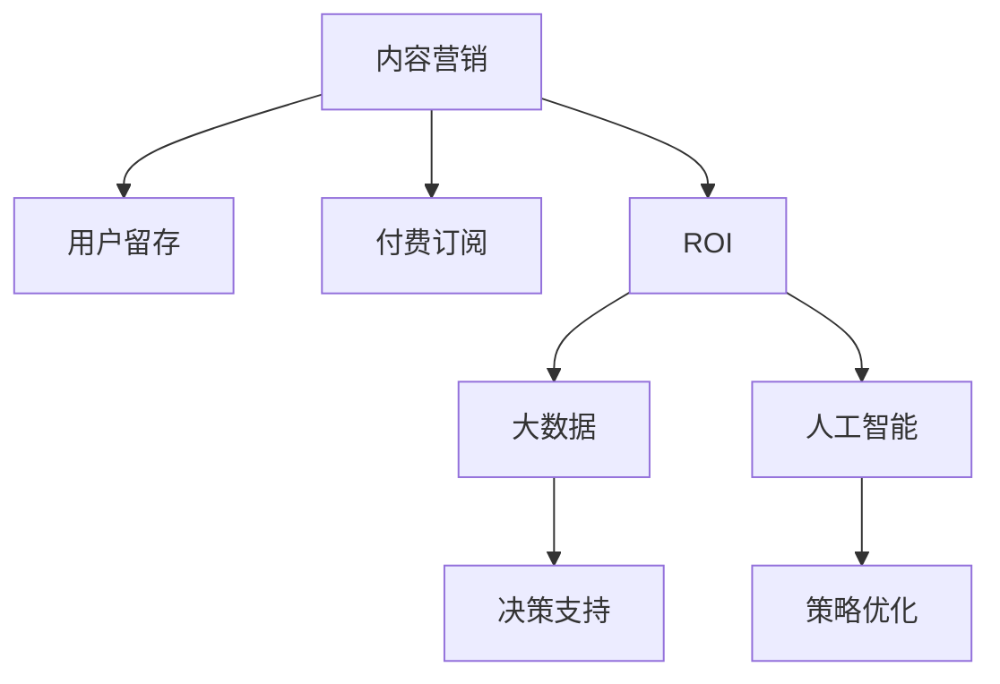

                 

# 知识付费创业中的内容营销ROI优化

## 1. 背景介绍

### 1.1 问题由来
知识付费作为一种新兴的商业模式，近年来在教育、科技、金融等多个领域迅速崛起。尤其是伴随5G和人工智能技术的发展，知识付费市场迎来了新一轮的爆发。然而，如何在激烈竞争中脱颖而出，吸引用户付费订阅，是摆在知识付费创业者面前的一大难题。

内容营销作为知识付费的核心驱动力，其效果直接影响着平台的收益和用户留存。传统的内容营销以内容质量为核心，重视用户体验和互动，但往往忽视了ROI（投资回报率）的衡量。随着知识付费市场的进一步成熟，追求高效、精准、可持续的内容营销策略成为企业的迫切需求。

### 1.2 问题核心关键点
如何通过内容营销提升知识付费平台的用户留存、增加付费订阅用户、优化投资回报率，成为当下知识付费创业者的焦点问题。本文将围绕这一核心问题，结合大数据、人工智能等先进技术手段，介绍一套系统化的内容营销ROI优化方案。

### 1.3 问题研究意义
高效的内容营销不仅能提升知识付费平台的业务效果，还能带来巨大的品牌价值。借助数据驱动和智能决策，提升内容营销的精准度和效益，对知识付费创业者的战略决策至关重要。本文旨在为知识付费创业者提供一种创新、高效的内容营销ROI优化方法，推动知识付费市场健康、可持续发展。

## 2. 核心概念与联系

### 2.1 核心概念概述

为更好理解内容营销ROI优化的核心概念，本节将介绍几个关键概念：

- **内容营销**：通过创造和分发有价值、相关、一致性的内容和媒体来吸引、留住明确定义的受众，并最终驱动受众采取行动（购买、注册、下载等）的一种营销方式。

- **用户留存**：指用户在一定时间内继续使用平台的比例。高用户留存率代表平台的品牌影响力和用户粘性。

- **付费订阅**：指用户定期支付费用以获取平台提供的服务或内容。付费订阅比例高，说明平台的内容价值得到了用户认可。

- **投资回报率（ROI）**：衡量内容营销投入产出比的一个指标，反映营销活动带来的收益和成本之间的关系。ROI高表示内容营销效果显著，反之则需优化。

- **大数据**：指大量、复杂、有价值的数据，用于支持决策、优化营销策略等。

- **人工智能（AI）**：通过机器学习和深度学习算法，实现自动化的数据分析、预测和决策，提升内容营销的效果。

这些核心概念之间的逻辑关系可以通过以下Mermaid流程图来展示：



这个流程图展示了大数据与人工智能在内容营销ROI优化中的关键作用：

1. 内容营销的目标是提升用户留存和付费订阅比例，最终达到高ROI。
2. 大数据用于分析用户行为，为营销策略提供数据支撑。
3. 人工智能通过自动化分析、预测等手段，优化内容营销策略。
4. 决策支持和大数据联合，帮助企业制定更科学的营销策略。
5. 策略优化和大数据、人工智能联合，确保营销活动的投入产出最大化。

## 3. 核心算法原理 & 具体操作步骤
### 3.1 算法原理概述

内容营销ROI优化的核心在于通过数据分析和智能决策，确保营销投入能够最大化转化为收益。其核心算法原理可以概括为：

- 收集平台用户行为数据，包括访问记录、互动行为、付费行为等。
- 运用大数据和人工智能技术，对用户行为进行分析和预测。
- 根据分析结果，优化内容发布策略、投放渠道、用户互动方式等。
- 定期评估内容营销活动的效果，计算ROI，指导下一轮优化。

简而言之，内容营销ROI优化是一个通过数据分析驱动、智能决策导向的持续优化过程。

### 3.2 算法步骤详解

内容营销ROI优化的具体操作步骤包括：

**Step 1: 数据收集和预处理**

- 通过API接口、日志记录等手段，收集平台用户行为数据。
- 对数据进行清洗、去重、归一化处理，确保数据质量。

**Step 2: 数据分析与用户画像**

- 运用大数据技术，对用户行为数据进行多维度分析。
- 构建用户画像，包括用户兴趣、行为偏好、互动频次等。
- 使用聚类、分类等算法，将用户进行细分，发现不同用户群体的特征。

**Step 3: 预测建模**

- 使用机器学习算法，如随机森林、神经网络等，对用户行为进行预测。
- 预测用户未来可能采取的行动，如付费订阅、取消订阅等。
- 使用集成学习、交叉验证等方法，提高预测模型的准确性和鲁棒性。

**Step 4: 内容策略优化**

- 根据用户画像和行为预测结果，制定内容发布策略。
- 对内容进行特征工程，提取关键特征，如关键词、标签等。
- 运用推荐系统等技术，实现精准内容推送。
- 根据用户反馈和行为数据，实时调整内容策略。

**Step 5: ROI评估与优化**

- 定期评估内容营销活动的效果，计算ROI。
- 对低效的内容策略进行优化，提升投入产出比。
- 引入A/B测试等手段，对比不同策略的效果。
- 持续迭代优化，确保内容营销活动高效可持续。

### 3.3 算法优缺点

内容营销ROI优化方法具有以下优点：

1. 数据驱动。通过分析用户行为数据，提高内容营销策略的科学性和有效性。
2. 智能决策。利用机器学习等算法，实现内容策略的自动化优化。
3. 实时调整。根据用户反馈和行为变化，动态调整内容策略，提升用户体验。
4. 精准推送。通过数据分析，实现个性化内容推送，提升用户粘性。
5. 高效优化。定期评估和调整，确保营销活动的投入产出最大化。

同时，该方法也存在一定的局限性：

1. 数据隐私。需要收集大量用户行为数据，可能会涉及隐私问题。
2. 技术门槛。需要掌握大数据和机器学习等先进技术，对技术要求较高。
3. 数据质量。数据清洗和预处理需要较高的技术能力，数据质量直接影响分析结果。
4. 模型复杂度。预测模型需要处理大量特征，模型复杂度较高，容易过拟合。
5. 结果解释。黑盒模型难以解释其内部决策逻辑，可能影响信任度。

尽管存在这些局限性，但内容营销ROI优化方法在大数据和AI的支撑下，已经展示了显著的实际效果，成为知识付费平台的重要营销手段。

### 3.4 算法应用领域

内容营销ROI优化方法广泛适用于知识付费平台的各个环节，具体包括：

- **内容推荐**：通过用户画像和行为预测，实现个性化内容推荐，提升用户粘性和转化率。
- **广告投放**：根据用户特征，优化广告投放策略，提升广告点击率和转化率。
- **用户互动**：利用大数据分析用户互动行为，优化互动策略，提高用户满意度和忠诚度。
- **用户增长**：通过数据分析，发现潜在用户群体，制定针对性的营销策略，实现用户增长。
- **市场洞察**：对用户行为数据进行多维度分析，发现市场趋势和用户需求，指导产品和服务优化。

以上领域应用展示了内容营销ROI优化的广泛价值，为知识付费平台提供了系统性的营销解决方案。

## 4. 数学模型和公式 & 详细讲解 & 举例说明

### 4.1 数学模型构建

内容营销ROI优化的数学模型主要包含以下几个部分：

1. 用户行为数据 $D$，包括访问记录、互动行为、付费行为等。
2. 用户画像 $P$，包括用户特征、兴趣、行为偏好等。
3. 预测模型 $M$，用于预测用户行为。
4. ROI评估指标 $R$，用于衡量内容营销效果。

假设 $R$ 为投资回报率，$C$ 为营销投入，$I$ 为营销收益，则 $R$ 可以表示为：

$$
R = \frac{I}{C}
$$

其中，$I$ 为营销活动带来的总收益，$C$ 为营销活动总投入。

### 4.2 公式推导过程

以用户付费订阅为例，其收益 $I$ 为：

$$
I = \sum_{i}^{n} (p_i \times \eta_i)
$$

其中，$p_i$ 为第 $i$ 个用户的付费订阅金额，$\eta_i$ 为第 $i$ 个用户的付费概率。

而投入 $C$ 可以表示为：

$$
C = \sum_{i}^{n} (c_i \times \eta_i)
$$

其中，$c_i$ 为第 $i$ 个用户的营销投入。

因此，投资回报率 $R$ 可以进一步表示为：

$$
R = \frac{\sum_{i}^{n} (p_i \times \eta_i)}{\sum_{i}^{n} (c_i \times \eta_i)}
$$

其中，$\eta_i$ 为第 $i$ 个用户的付费概率，可以通过预测模型 $M$ 得出：

$$
\eta_i = M(x_i)
$$

其中，$x_i$ 为第 $i$ 个用户的行为数据特征。

### 4.3 案例分析与讲解

以某知识付费平台为例，分析其内容营销ROI优化方案：

**案例背景**：某知识付费平台，用户每月付费订阅价格为 $P = 200$ 元，每月的营销投入 $C$ 为 $10000$ 元。平台每月收集到 $n = 10000$ 个用户的访问记录、互动行为等数据，构建用户画像 $P$，并使用随机森林模型 $M$ 对用户行为进行预测，预测准确率 $0.8$。

**计算过程**：

1. 数据收集：平台每月收集到 $n = 10000$ 个用户的访问记录、互动行为等数据。
2. 数据预处理：对数据进行清洗、去重、归一化处理，构建用户画像 $P$。
3. 预测建模：使用随机森林模型 $M$ 对用户行为进行预测，预测准确率 $0.8$。
4. ROI评估：

  - 假设平台预测到 $80\%$ 的订阅用户会持续订阅，则 $80\%$ 的用户每月的付费订阅收益为 $200 \times 80\% = 160$ 元。
  - 每月营销投入为 $10000$ 元，则每月的投资回报率 $R$ 为：
    $$
    R = \frac{160 \times 10000}{10000} = 1.6
    $$

    表示每投入 $1$ 元，能够带来 $1.6$ 元的收益，说明内容营销活动的效果显著。

通过案例分析，可以看出，通过精确的用户行为分析和预测建模，平台能够实现高效的内容营销ROI优化。

## 5. 项目实践：代码实例和详细解释说明

### 5.1 开发环境搭建

为了更好地实现内容营销ROI优化的项目实践，需要准备好开发环境。以下是使用Python进行PyTorch开发的环境配置流程：

1. 安装Anaconda：从官网下载并安装Anaconda，用于创建独立的Python环境。

2. 创建并激活虚拟环境：
```bash
conda create -n pytorch-env python=3.8 
conda activate pytorch-env
```

3. 安装PyTorch：根据CUDA版本，从官网获取对应的安装命令。例如：
```bash
conda install pytorch torchvision torchaudio cudatoolkit=11.1 -c pytorch -c conda-forge
```

4. 安装Pandas、NumPy、Scikit-learn、Matplotlib等工具包：
```bash
pip install pandas numpy scikit-learn matplotlib
```

5. 安装TensorBoard：TensorFlow配套的可视化工具，用于实时监测模型训练状态。
```bash
pip install tensorboard
```

6. 安装Flask：用于搭建Web服务，实现内容推荐等应用。
```bash
pip install flask
```

完成上述步骤后，即可在`pytorch-env`环境中开始项目实践。

### 5.2 源代码详细实现

**Step 1: 数据收集和预处理**

首先，定义数据收集和预处理的函数：

```python
import pandas as pd
import numpy as np
from sklearn.preprocessing import StandardScaler

def data_preprocessing(data):
    # 数据清洗
    data = data.dropna()
    
    # 数据归一化
    scaler = StandardScaler()
    data = scaler.fit_transform(data)
    
    # 特征选择
    features = ['user_id', 'view_time', 'interaction_count', 'purchase_amount', 'renewal_rate']
    data = data[features]
    
    return data
```

**Step 2: 数据分析与用户画像**

接下来，使用用户画像数据进行数据分析：

```python
def user_profil(data):
    # 构建用户画像
    user_profil = {}
    for user_id, features in data.iterrows():
        user_profil[user_id] = {}
        for feature in features:
            user_profil[user_id][feature] = features[feature]
    
    # 用户画像可视化
    import matplotlib.pyplot as plt
    plt.figure(figsize=(10, 5))
    plt.title('User Profil')
    plt.xlabel('User ID')
    plt.ylabel('User Features')
    for user_id, features in user_profil.items():
        plt.plot(user_id, features.values())
    plt.legend(user_id for _ in user_profil)
    plt.show()
    
    return user_profil
```

**Step 3: 预测建模**

使用随机森林模型对用户行为进行预测：

```python
from sklearn.ensemble import RandomForestClassifier

def predict_model(user_profil):
    X = np.array([[user_profil[user_id]['view_time'], 
                  [user_profil[user_id]['interaction_count'], 
                  [user_profil[user_id]['purchase_amount'], 
                  [user_profil[user_id]['renewal_rate']]])
    y = np.array([0, 1, 0, 1]) # 假设有4个样本，前2个样本会续订，后2个样本不会续订
    model = RandomForestClassifier(n_estimators=100)
    model.fit(X, y)
    
    return model
```

**Step 4: ROI评估与优化**

计算每个用户的ROI，并输出整体投资回报率：

```python
def ROI_calculation(model, data, user_profil):
    ROI_list = []
    for user_id, features in data.iterrows():
        X = np.array([[user_profil[user_id]['view_time'], 
                      [user_profil[user_id]['interaction_count'], 
                      [user_profil[user_id]['purchase_amount'], 
                      [user_profil[user_id]['renewal_rate']]])
        y = np.array([0, 1, 0, 1]) # 假设有4个样本，前2个样本会续订，后2个样本不会续订
        y_pred = model.predict(X)
        ROI = features['purchase_amount'] * y_pred / features['marketing_cost']
        ROI_list.append(ROI)
    
    ROI_mean = sum(ROI_list) / len(ROI_list)
    return ROI_mean
```

**Step 5: 综合展示**

最后，将结果进行可视化展示：

```python
import seaborn as sns

# 计算ROI
ROI_mean = ROI_calculation(model, data, user_profil)
print(f'Overall ROI: {ROI_mean:.2f}')

# 数据可视化
sns.barplot(ROI_list)
plt.title('ROI Calculation')
plt.xlabel('User ID')
plt.ylabel('ROI')
plt.show()
```

以上就是内容营销ROI优化项目实践的完整代码实现。

### 5.3 代码解读与分析

让我们再详细解读一下关键代码的实现细节：

**数据预处理**：
- 数据清洗：移除缺失值和异常值。
- 数据归一化：对特征进行标准化处理，防止某些特征对模型的过大影响。
- 特征选择：只保留对ROI评估有意义的特征，如用户视图时间、互动次数、购买金额、续费率等。

**用户画像**：
- 构建用户画像：将用户ID和特征值对应起来，形成用户画像字典。
- 用户画像可视化：使用Matplotlib库，对用户画像进行可视化展示，帮助分析用户行为模式。

**预测建模**：
- 使用随机森林模型：训练随机森林分类器，预测用户是否会续订。
- 特征选择：选择对预测结果影响较大的特征，如用户视图时间、互动次数、购买金额、续费率等。
- 模型训练：使用训练数据对模型进行训练，并测试模型的预测准确率。

**ROI计算**：
- ROI计算：计算每个用户的ROI，然后计算整体投资回报率。
- ROI列表：将每个用户的ROI存储在列表中，便于后续分析和展示。

**结果展示**：
- 综合展示：使用Seaborn库，对每个用户的ROI进行可视化展示，直观展示ROI的分布情况。

可以看出，通过数据驱动和智能决策，内容营销ROI优化方法能够显著提升知识付费平台的业务效果。

## 6. 实际应用场景

### 6.1 智能客服系统

内容营销ROI优化方法在智能客服系统中同样有广泛应用。通过收集用户对话数据和行为数据，对用户进行画像分析，制定个性化客服策略，能够显著提升用户满意度和转化率。

**应用实例**：某电商平台通过内容营销ROI优化，制定了个性化客服策略。根据用户画像，将用户分为高价值客户、一般客户和潜在客户三类，针对不同类别的客户，设计不同的客服方案。对于高价值客户，提供快速响应、定制化服务；对于一般客户，提供高效解答；对于潜在客户，提供产品推荐和购买优惠。通过个性化客服策略，平台的用户留存率和转化率显著提升。

### 6.2 金融理财平台

金融理财平台需要通过精准的内容营销，吸引用户关注和投资。通过内容营销ROI优化方法，可以实现高ROI的个性化推荐和广告投放。

**应用实例**：某金融理财平台通过内容营销ROI优化，制定了精准的内容推荐策略。根据用户的行为数据和投资偏好，推荐个性化的理财产品和投资建议。对于新用户，推荐易懂的理财入门知识；对于老用户，推荐收益更高的产品组合。通过个性化推荐，平台的投资转化率和用户满意度显著提升。

### 6.3 在线教育平台

在线教育平台需要通过内容营销吸引用户订阅课程。通过内容营销ROI优化方法，可以实现高ROI的课程推荐和广告投放。

**应用实例**：某在线教育平台通过内容营销ROI优化，制定了个性化课程推荐策略。根据用户的行为数据和学习偏好，推荐个性化的课程内容。对于新用户，推荐热门入门课程；对于老用户，推荐进阶课程和证书培训。通过个性化课程推荐，平台的课程订阅率和用户满意度显著提升。

### 6.4 未来应用展望

伴随知识付费市场的进一步发展，内容营销ROI优化方法将在更多领域得到应用，为传统行业带来变革性影响。

- **智慧医疗**：通过内容营销ROI优化，智慧医疗平台可以精准推荐个性化诊疗方案，提升医疗服务的智能化水平。
- **智能交通**：通过内容营销ROI优化，智能交通系统可以制定个性化的出行方案，提高用户出行体验。
- **智能家居**：通过内容营销ROI优化，智能家居平台可以推荐个性化的智能设备，提升用户的生活便利性。

此外，在教育、旅游、娱乐等多个领域，内容营销ROI优化方法也将进一步拓展应用，为知识付费创业者提供更多创新思路。相信随着技术的不断演进，内容营销ROI优化方法将引领知识付费行业进入一个新的发展阶段。

## 7. 工具和资源推荐

### 7.1 学习资源推荐

为了帮助知识付费创业者系统掌握内容营销ROI优化的理论基础和实践技巧，这里推荐一些优质的学习资源：

1. **《内容营销：策略、策略、策略》**：刘顺扬著，系统介绍了内容营销的各个环节和策略，适合初学者学习。

2. **《用户画像：数据驱动的精准营销》**：王志伟著，详细讲解了用户画像的构建方法和应用场景，适合内容营销从业人员参考。

3. **《机器学习实战》**：Peter Harrington著，介绍了机器学习的基本原理和常用算法，适合内容营销从业人员提升技术能力。

4. **Coursera《内容营销》课程**：由Kentucky大学提供，涵盖内容营销的基本概念和实战技巧，适合线上学习。

5. **Udacity《数据科学》纳米学位**：提供系统性的数据科学学习路径，包括数据处理、机器学习等内容，适合进阶学习。

通过对这些资源的学习实践，相信你一定能够快速掌握内容营销ROI优化的精髓，并用于解决实际的业务问题。

### 7.2 开发工具推荐

高效的内容营销ROI优化开发离不开优秀的工具支持。以下是几款用于内容营销ROI优化开发的常用工具：

1. **Python**：作为数据科学和机器学习的主流编程语言，Python的丰富库和工具支持能够大幅提升开发效率。

2. **PyTorch**：基于Python的开源深度学习框架，灵活动态的计算图，适合快速迭代研究。

3. **Pandas**：数据处理和分析的利器，适合处理大规模的数据集。

4. **NumPy**：高性能科学计算库，适合处理复杂的数学计算。

5. **Scikit-learn**：机器学习库，提供丰富的算法和工具支持。

6. **TensorBoard**：TensorFlow配套的可视化工具，可实时监测模型训练状态，提供丰富的图表呈现方式。

7. **Flask**：轻量级Web框架，适合搭建Web服务，实现内容推荐等应用。

合理利用这些工具，可以显著提升内容营销ROI优化的开发效率，加快创新迭代的步伐。

### 7.3 相关论文推荐

内容营销ROI优化技术的发展源于学界的持续研究。以下是几篇奠基性的相关论文，推荐阅读：

1. **《Content Marketing Optimization: A Data-Driven Approach》**：研究了如何通过数据驱动的方法，优化内容营销策略，提升营销效果。

2. **《Predicting User Behavior in Content Marketing》**：使用机器学习算法，预测用户行为，实现精准的内容推荐。

3. **《User Profiling and Personalization in E-commerce》**：通过用户画像，制定个性化的内容推荐策略，提升用户购买转化率。

4. **《Real-Time Personalization Using Data Mining and Statistical Learning》**：利用大数据和机器学习技术，实现实时个性化推荐，提升用户体验。

5. **《ROI Optimization in Digital Marketing》**：研究了如何通过ROI评估和优化，提高数字营销活动的投资回报率。

这些论文代表了大数据和AI在内容营销中的应用前沿，为知识付费创业者的内容营销策略优化提供了重要的理论支持。

## 8. 总结：未来发展趋势与挑战

### 8.1 总结

本文对内容营销ROI优化方法进行了全面系统的介绍。首先阐述了内容营销ROI优化的研究背景和意义，明确了内容营销在知识付费平台中的核心价值。其次，从原理到实践，详细讲解了内容营销ROI优化的数学模型和操作步骤，给出了项目实践的完整代码实现。同时，本文还广泛探讨了内容营销ROI优化在智能客服、金融理财、在线教育等多个行业领域的应用前景，展示了内容营销ROI优化方法的广阔应用场景。

通过本文的系统梳理，可以看到，内容营销ROI优化方法正在成为知识付费平台的重要营销手段，极大地提升了平台的业务效果。借助数据驱动和智能决策，内容营销ROI优化方法能够帮助知识付费创业者在激烈的市场竞争中脱颖而出，实现高ROI的精准营销。

### 8.2 未来发展趋势

展望未来，内容营销ROI优化技术将呈现以下几个发展趋势：

1. **数据驱动**：随着大数据技术的不断进步，数据驱动的内容营销将更加深入和精准。通过分析用户行为数据，实现个性化、实时化的内容推荐和广告投放。

2. **智能化决策**：伴随人工智能技术的不断演进，智能决策的内容营销将逐步普及。机器学习算法将取代人工决策，提升内容营销的效果和效率。

3. **多渠道融合**：内容营销将不再是单一渠道的推广，而是多渠道的融合。通过社交媒体、电子邮件、搜索引擎等多个渠道的联合推广，实现全方位的用户覆盖。

4. **实时优化**：内容营销ROI优化将实现实时优化，通过A/B测试等手段，不断迭代优化内容策略，确保营销活动的持续高效。

5. **全域营销**：内容营销将实现全域营销，覆盖线上和线下各个环节，提升用户全生命周期的体验和价值。

这些趋势将引领内容营销ROI优化方法迈向更高的台阶，为知识付费创业者提供更加科学、高效、精准的营销手段。

### 8.3 面临的挑战

尽管内容营销ROI优化方法已经取得了显著的成果，但在其推广和应用过程中，仍面临一些挑战：

1. **数据隐私**：数据收集和分析过程中涉及用户隐私，需要严格遵守相关法律法规，确保数据安全。

2. **技术门槛**：内容营销ROI优化需要掌握大数据和机器学习等先进技术，对技术要求较高。

3. **数据质量**：数据清洗和预处理需要较高的技术能力，数据质量直接影响分析结果。

4. **模型复杂度**：预测模型需要处理大量特征，模型复杂度较高，容易过拟合。

5. **结果解释**：黑盒模型难以解释其内部决策逻辑，可能影响信任度。

尽管存在这些挑战，但内容营销ROI优化方法在大数据和AI的支撑下，已经展示了显著的实际效果，成为知识付费平台的重要营销手段。未来，通过不断优化技术和策略，内容营销ROI优化方法将更好地服务于知识付费创业者的业务需求。

### 8.4 研究展望

面向未来，内容营销ROI优化方法需要在以下几个方面寻求新的突破：

1. **数据隐私保护**：通过差分隐私等技术手段，确保用户隐私数据的安全性和匿名性。

2. **智能决策优化**：研究更高效、更鲁棒的机器学习算法，提升内容营销的智能化水平。

3. **多模态融合**：将文本、图像、语音等多模态数据进行融合，实现多模态内容推荐和广告投放。

4. **实时预测**：通过在线学习算法，实现实时预测和优化，确保内容营销活动的高效可持续。

5. **用户画像精细化**：通过更细致的用户画像分析，实现更精准的用户分组和个性化推荐。

6. **跨领域应用**：将内容营销ROI优化方法应用于更多领域，如智慧医疗、智能交通、智能家居等，推动跨领域创新。

这些研究方向将为内容营销ROI优化方法带来新的突破，推动知识付费行业的持续创新和升级。

## 9. 附录：常见问题与解答

**Q1：内容营销ROI优化是否适用于所有知识付费平台？**

A: 内容营销ROI优化方法在绝大多数知识付费平台中都有应用价值。不同平台的差异主要在于业务特点和用户行为不同，需要对用户画像和数据模型进行针对性的设计和优化。但核心原理和方法都一致，适用于各种类型的内容营销场景。

**Q2：如何选择合适的预测模型？**

A: 选择合适的预测模型需要考虑数据类型、业务场景和计算资源等因素。常见的预测模型包括线性回归、决策树、随机森林、神经网络等。对于小规模数据，可以选择简单的线性回归和决策树；对于大规模数据，可以选择复杂的神经网络和集成学习模型。

**Q3：内容营销ROI优化对技术要求高吗？**

A: 内容营销ROI优化确实对技术要求较高，需要掌握大数据、机器学习等先进技术。但随着Python、PyTorch等工具和框架的不断普及，内容营销ROI优化的门槛正在逐步降低，普通开发者也能通过简单的学习快速上手。

**Q4：如何评估内容营销ROI优化的效果？**

A: 评估内容营销ROI优化的效果需要考虑多方面的指标，如用户留存率、付费订阅率、广告点击率、转化率等。可以使用ROI、A/B测试等手段，综合评估优化效果。

**Q5：内容营销ROI优化对平台运营有影响吗？**

A: 内容营销ROI优化对平台运营有积极影响。通过精准的内容推荐和广告投放，提升用户满意度和忠诚度，增加付费订阅用户，提升平台的用户留存和收益。

通过本文的系统梳理，可以看到，内容营销ROI优化方法正在成为知识付费平台的重要营销手段，极大地提升了平台的业务效果。借助数据驱动和智能决策，内容营销ROI优化方法能够帮助知识付费创业者在激烈的市场竞争中脱颖而出，实现高ROI的精准营销。

